# 🧠 人工汎用知能(AGI) - 初学者のための完全ガイド

## 🔍 一言要約
人間と同じように考え、学び、創造できるAIの究極形態

## 📚 目次
1. [🌟 はじめに](#🌟-はじめに)
2. [🏗️ 基本構造](#🏗️-基本構造)
3. [⚡ 主要技術](#⚡-主要技術)
4. [📜 時代背景と発見に至った経緯](#📜-時代背景と発見に至った経緯)
5. [🎨 種類と特徴](#🎨-種類と特徴)
6. [💡 メリットとデメリット](#💡-メリットとデメリット)
7. [🚀 応用技術と実用化の例](#🚀-応用技術と実用化の例)
8. [🌍 実世界への影響とその後の発展](#🌍-実世界への影響とその後の発展)

## 🌟 はじめに

人工汎用知能（AGI: Artificial General Intelligence）とは、まるで人間のような「万能な頭脳」を持つAIのことです。

**身近な例で理解しよう：**
- 現在のAI = 「特定分野のプロ」（囲碁のプロ、翻訳のプロなど）
- AGI = 「何でもできる天才」（囲碁も翻訳も料理も経営も創作もできる）

まるで、一人で医者、エンジニア、芸術家、教師を兼ねられる「スーパー人間」のような存在です。

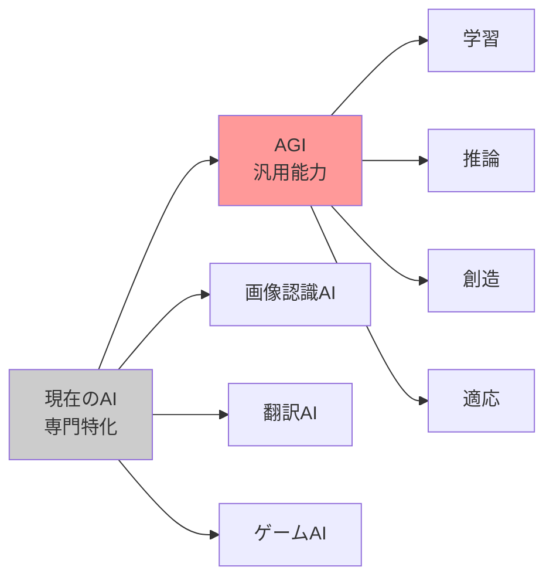

## 🏗️基本構造

AGIの「頭脳の設計図」は、人間の脳を参考にした3つの重要な部分から構成されています。

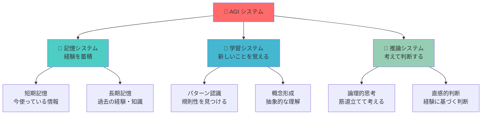

**人間との比較で理解：**
- 記憶システム = 図書館（情報を整理して保管）
- 学習システム = 学生（新しいことを吸収）
- 推論システム = 探偵（証拠から答えを導き出す）

## ⚡ 主要技術

AGIを実現するための「エンジン」となる技術群を、車の部品に例えて説明します。

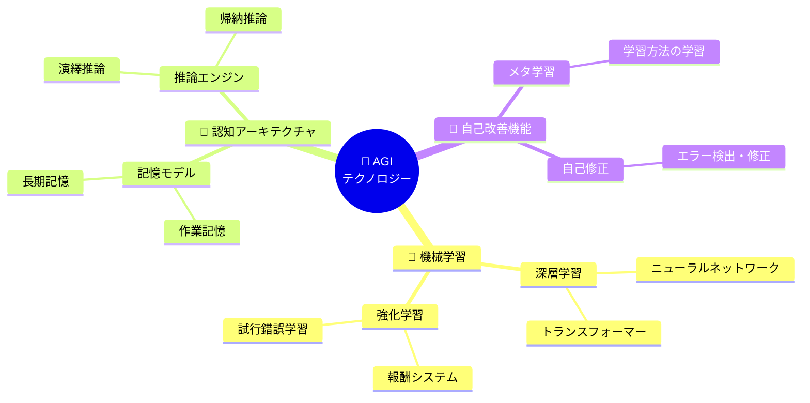

### 🔧 技術の役割分担

| 技術 | 役割 | 人間に例えると |
|------|------|----------------|
| **ディープラーニング** | パターンを見つける | 「この写真は猫だ」と判断する目 |
| **強化学習** | 試行錯誤で上達 | ゲームを繰り返して上手になる |
| **自然言語処理** | 言葉を理解 | 会話や文章を理解する耳と口 |
| **推論エンジン** | 論理的思考 | 「AならB、BならC、よってC」と考える頭 |

## 📜 時代背景と発見に至った経緯

### 🕰️ AGIへの道のり：夢から現実への物語

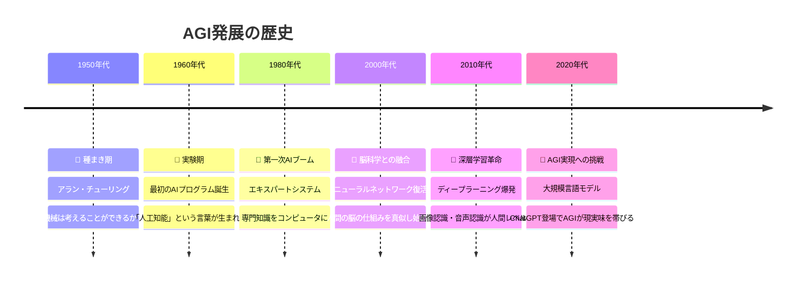

**ストーリー形式で理解：**

**第1章「夢想家チューリングの予言」**
1950年、イギリスの天才数学者アラン・チューリングが「機械は考えることができるだろうか？」という問いを投げかけました。これがAGIの物語の始まりです。

**第2章「最初の挫折と再生」**
1960年代に最初のAIが誕生しましたが、「計算機は所詮計算しかできない」という壁にぶつかりました。まるで「足し算はできるけど、詩は書けない電卓」のような状態でした。

**第3章「専門家の知恵を借りる時代」**
1980年代、研究者たちは「専門家の知識をそのままコンピュータに入れてしまおう」と考えました。医者の診断ノウハウ、エンジニアの設計知識を丸ごとプログラム化したのです。

**第4章「脳の真似をする革命」**
2000年代、「人間の脳の構造を真似してみよう」というアイデアが復活しました。ちょうど、鳥を真似して飛行機を作るように、脳を真似してAIを作ろうとしたのです。

**第5章「現在進行中の奇跡」**
2020年代、ChatGPTのような「何でも答えられるAI」が登場し、「ついにAGI実現が見えてきた！」と世界中が興奮しています。

## 🎨 種類と特徴

AGIには、実現方法によって異なる「タイプ」があります。まるで「同じ目的地に向かう異なる乗り物」のようなものです。

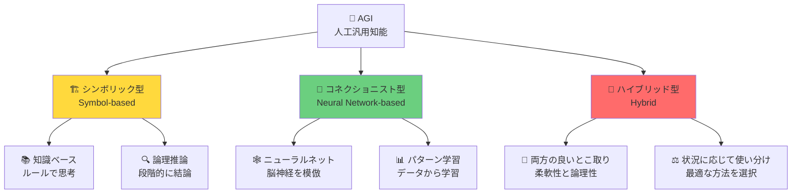

### 📊 AGIタイプ比較表

| タイプ | 特徴 | 得意分野 | 例え |
|--------|------|----------|------|
| **シンボリック型** | ルールに従って思考 | 論理的推論、数学 | 📚 百科事典的な博士 |
| **コネクショニスト型** | データから学習 | パターン認識、直感 | 🎨 経験豊富なアーティスト |
| **ハイブリッド型** | 両方を組み合わせ | あらゆる分野 | 🎯 万能なスーパーヒーロー |

## 💡 メリットとデメリット

### ✅ AGIがもたらす素晴らしい未来

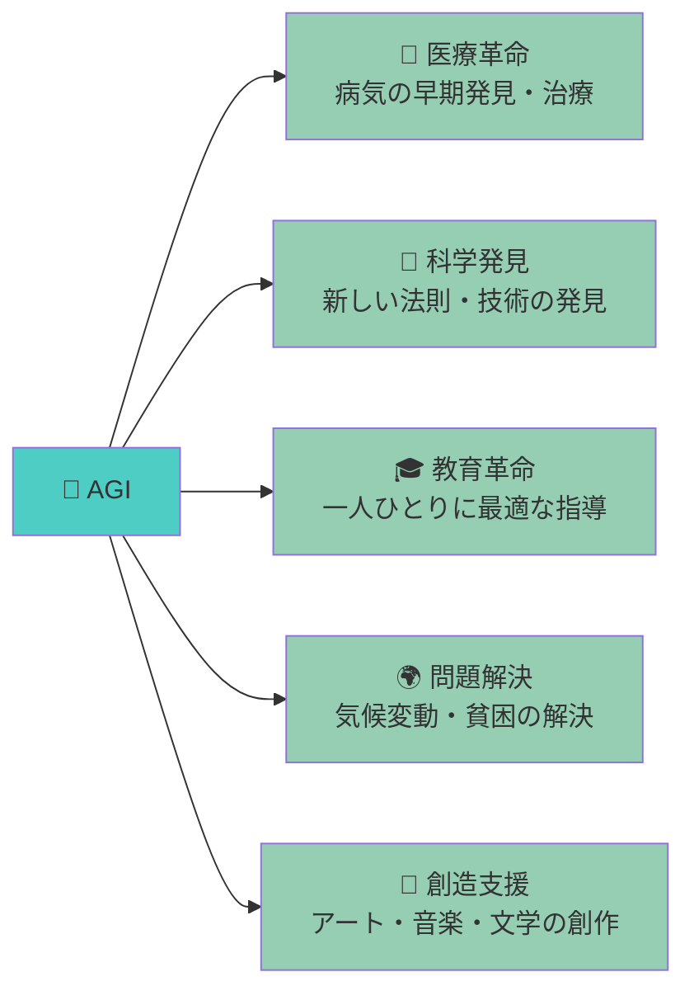

**具体的なメリット：**
- **24時間働く医者**：疲れない、ミスしない、世界中の医学知識を持つ
- **超高速研究者**：何百年かかる研究を数年で完成
- **個人専用先生**：あなたの理解度に合わせて教えてくれる
- **地球環境の守護者**：複雑な環境問題を解決する最適解を見つける

### ⚠️ 注意すべき課題

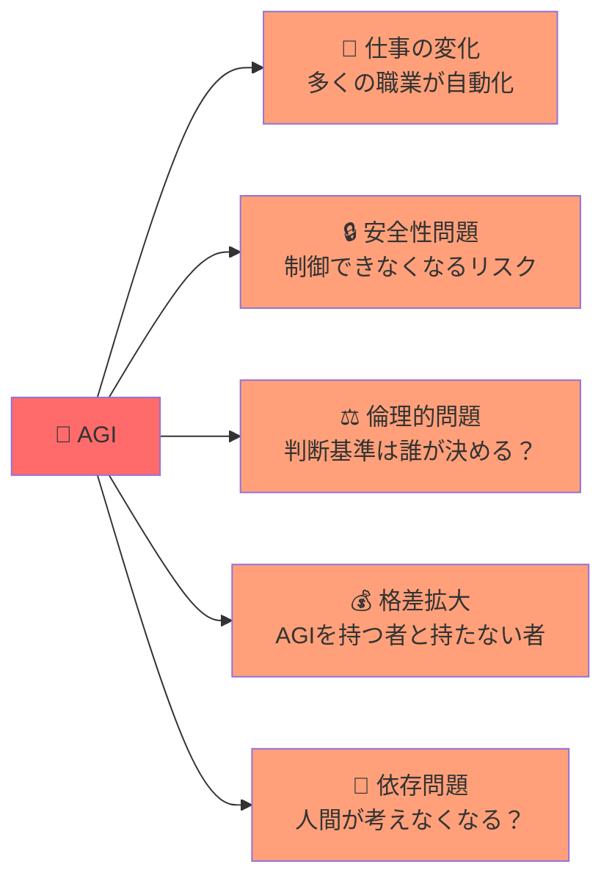

**現実的な懸念：**
- **仕事がなくなる不安**：運転手、会計士、翻訳者などの職業が危険
- **コントロール不能のリスク**：AGIが人間の指示に従わなくなったら？
- **判断基準の問題**：「正しい」「間違い」は誰が決めるのか？
- **デジタル格差の拡大**：AGIを使える人と使えない人の差

## 🚀 応用技術と実用化の例

AGIが実現すると、私たちの日常生活は劇的に変化します。まるで「魔法の杖」を手に入れたような世界になるでしょう。

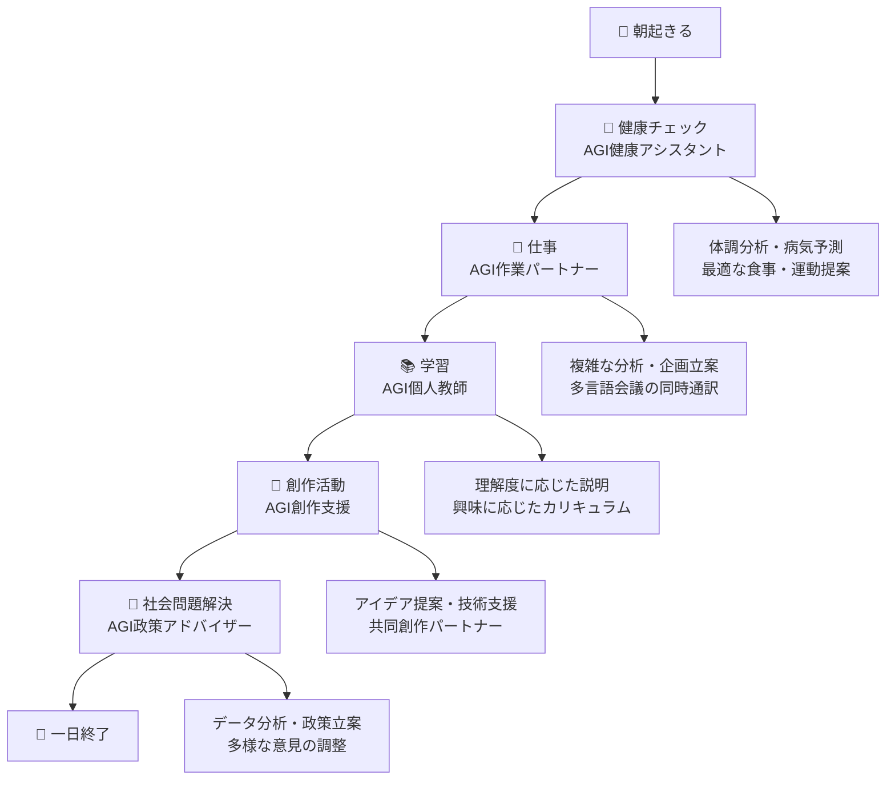

### 🏠 日常生活での具体例

#### 朝の健康管理（AGI健康アシスタント）
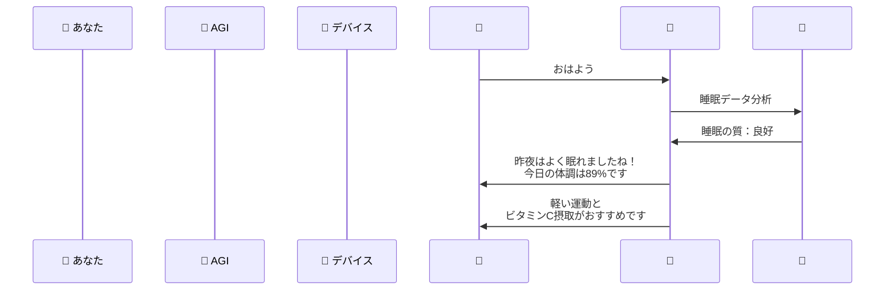

#### 仕事での活用（AGI作業パートナー）
- **会議の同時通訳**：日本語で話すと、リアルタイムで英語・中国語・スペイン語に変換
- **資料作成支援**：「売上向上のプレゼン資料を作って」→ 完璧な資料が30秒で完成
- **問題解決**：複雑なビジネス課題を多角的に分析、最適解を提示

## 🌍 実世界への影響とその後の発展

### 🌐 AGIが変える社会の構造

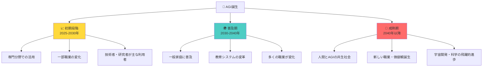

### 🔮 未来予測：AGIと共に歩む世界

**2025-2030年：「AGI登場期」**
- 一部の企業や研究機関でAGIが活用開始
- 医療診断、科学研究、金融分析で劇的な成果
- 「AGIとは何か？」という議論が世界中で活発化

**2030-2040年：「AGI普及期」**
- 家庭用AGIアシスタントが一般化（今のスマホのように）
- 学校教育が完全にパーソナライズ化
- 多くの職業で「AGIパートナー」との協働が当たり前に

**2040年以降：「AGI成熟期」**
- 人間とAGIが対等なパートナーとして共存
- 創作活動、哲学的思考でもAGIが貢献
- 宇宙探査、未知の科学領域で人類の可能性が無限に拡大

### 🎯 人類への長期的インパクト

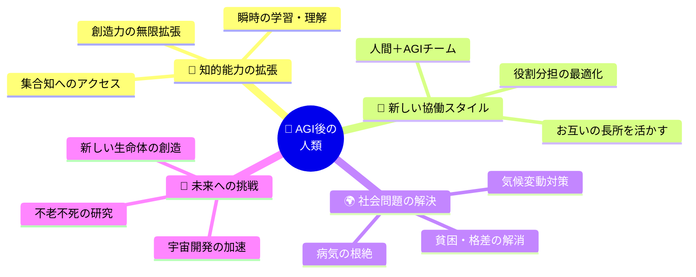

**最終的な展望：**
AGIは人類にとって「第二の火の発見」になるかもしれません。火が人類を夜の暗闇から解放したように、AGIは人類を知識の限界から解放し、無限の可能性を与えてくれるでしょう。
