# 人工汎用知能(AGI): 段階的理解ガイド

> **学習目標**: AGIの定義、現状のAIとの違い、技術的課題、社会的影響を理解する  
> **推奨学習時間**: 2-3時間  
> **前提知識**: 不要（基礎から解説）

---

## 1. 全体マップ

**人工汎用知能（AGI: Artificial General Intelligence）**とは、人間と同等またはそれ以上の知的能力を持ち、あらゆる知的タスクを遂行できるAIシステムです。現在のAI（特化型AI）が特定タスクに限定されるのに対し、AGIは汎用的な問題解決能力を持ちます。

### 学習範囲
**含むもの**: AGIの定義、現在のAIとの違い、実現への技術的アプローチ、倫理的課題、社会的影響  
**含まないもの**: 詳細な数学的アルゴリズム、特定のプログラミング実装

### 主要サブトピック
1. AGIの定義と特徴
2. 特化型AIとの違い
3. 実現へのアプローチ
4. 技術的課題
5. 倫理と安全性
6. 社会経済への影響
7. 現状と将来展望

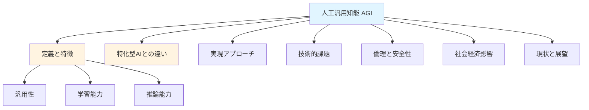

---

## 2. ガイド質問

### 基礎理解レベル（★☆☆）
- **Q1**: AGIと現在のAI（ChatGPTなど）の根本的な違いは何か？
- **Q2**: AGIが「汎用」と呼ばれる理由は何か？
- **Q3**: なぜAGIの実現は困難とされているのか？

### 応用理解レベル（★★☆）
- **Q4**: AGIが実現した場合、どのような産業が最も影響を受けるか？
- **Q5**: AGI開発において最も重要な倫理的課題は何か？
- **Q6**: 人間の知能とAGIの知能はどのように異なる可能性があるか？

### 統合分析レベル（★★★）
- **Q7**: AGI実現までに解決すべき技術的課題の優先順位をどう考えるか？
- **Q8**: AGIと人間社会が共存するために必要な条件は何か？

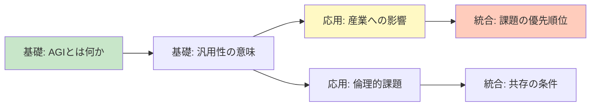

---

## 3. 核心概念

### 重要用語と定義

**人工汎用知能（AGI）**: 人間のように多様なタスクを学習・実行できるAIシステム。ドメイン特化せず汎用的な知能を持つ。

**特化型AI（Narrow AI）**: 特定タスク（画像認識、翻訳など）に限定されたAI。現在のほぼすべてのAIがこれに該当。

**転移学習**: ある領域で学んだ知識を別領域に応用する能力。AGIに必須の機能。

**意識問題**: AGIが自己認識や主観的体験を持つかという哲学的・科学的問題。

**アライメント問題**: AGIの目標を人間の価値観と整合させる技術的課題。

**知能爆発**: AGIが自己改良を繰り返し、急速に超知能化する仮説的シナリオ。

**チューリングテスト**: 機械が人間と区別できない会話ができるかを判定する基準（AGIの十分条件ではない）。

### 概念間の関係
AGIは**汎用性**と**転移学習**能力を持ち、これが**特化型AI**との決定的な違いです。実現には**アライメント問題**の解決が不可欠で、**意識問題**は実用性よりも哲学的関心事とされます。

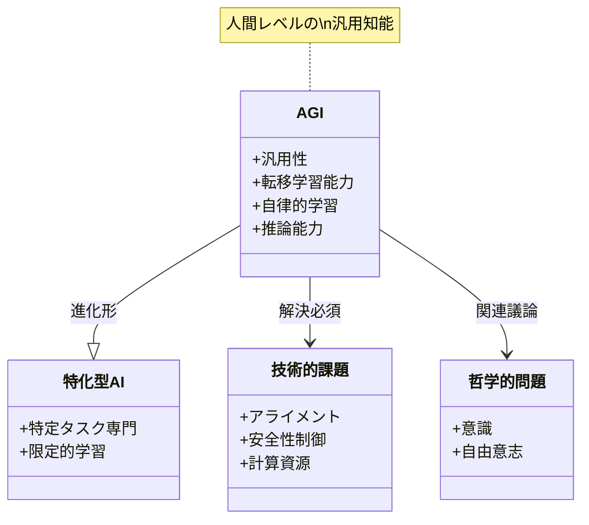

---

## 4. 段階的詳細展開

### 4.1 AGIの定義と特徴

#### 層1: 導入
AGIは「人間ができる知的作業ならほぼ何でもできる」AI システムを指します。これは単一タスクの高性能化ではなく、知能そのものの汎用性を目指す概念です。

#### 層2: 展開
具体的には、AGIは以下の能力を持つとされます：

1. **多様なタスクへの適応**: 事前訓練なしで新しい問題に取り組める
2. **抽象的推論**: 原理を理解し、新しい状況に応用できる
3. **常識的理解**: 人間が当然とする知識を持つ
4. **自律的学習**: 最小限の指示で自ら学習できる

例えば、現在のChatGPTは言語タスクに優れますが、物理的世界での作業（料理、修理）は直接実行できません。真のAGIなら、言語理解から得た知識をロボット制御に転移し、初めて見るレシピでも料理できるはずです。

一般的誤解として「人間と同じ思考プロセスが必要」というものがありますが、AGIは人間と異なる方法で同等の結果を達成する可能性があります（鳥と飛行機の関係に似ています）。

#### 層3: 要約
AGIの本質は**汎用性**であり、特定分野の卓越性ではなく、あらゆる知的課題に対応できる柔軟性が鍵です。

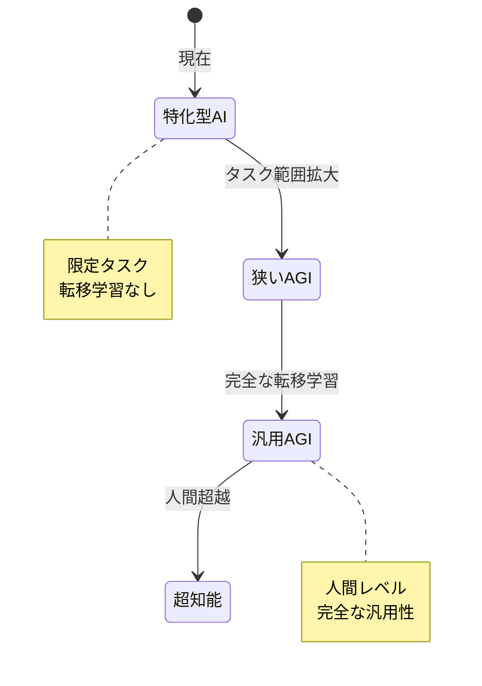

---

### 4.2 特化型AIとの違い

#### 層1: 導入
現在のAI技術は驚異的な性能を示しますが、すべて「特化型AI」に分類されます。AGIとの違いを理解することは、技術的課題を把握する第一歩です。

#### 層2: 展開

| 観点 | 特化型AI | AGI |
|------|---------|-----|
| **適用範囲** | 単一または少数のタスク | あらゆる知的タスク |
| **学習方法** | 大量データでの訓練必須 | 少数例から学習可能 |
| **転移能力** | 限定的（ファインチューニング必要） | 自動的に知識転移 |
| **理解の深さ** | パターン認識中心 | 因果関係・原理理解 |
| **適応性** | 訓練データ外で性能低下 | 未知の状況にも対応 |

実例で比較すると：
- **画像認識AI**（特化型）: 猫の画像を100万枚学習して猫を認識。犬の認識には別途訓練が必要。
- **仮想AGI**: 「猫」という概念を理解すれば、写真・絵画・彫刻・文章記述すべてで猫を認識。さらに「哺乳類」の一般原理から未知の動物も分類可能。

現在のChatGPT-4やGeminiは特化型とAGIの中間とも言えますが、依然として言語モダリティに偏重し、物理世界の直接操作や真の因果推論には限界があります。

#### 層3: 要約
特化型AIは「専門家」、AGIは「多才な人間」に例えられます。前者は深さ、後者は広さと柔軟性が特徴です。

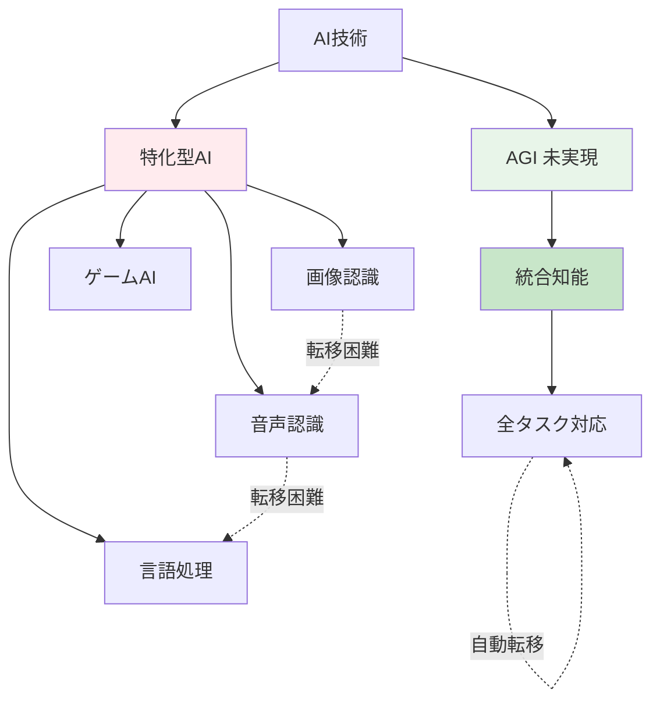

---

### 4.3 実現へのアプローチ

#### 層1: 導入
AGI実現には複数の研究アプローチが存在し、それぞれ異なる哲学と技術基盤を持ちます。現在は統合的アプローチが主流です。

#### 層2: 展開

**主要アプローチ4種**:

1. **記号主義（シンボリックAI）**
   - 論理規則と知識ベースで知能を構築
   - 1950-80年代の主流
   - 利点: 説明可能性、明確な推論
   - 課題: 常識知識の形式化困難、柔軟性不足

2. **コネクショニズム（ニューラルネットワーク）**
   - 脳の神経回路を模倣
   - 現在のディープラーニングの基盤
   - 利点: パターン認識、大規模データ処理
   - 課題: データ依存、説明困難性

3. **進化的アプローチ**
   - 遺伝的アルゴリズムで知能を進化
   - 利点: 創発的問題解決
   - 課題: 計算コスト、制御困難

4. **ハイブリッドアプローチ**（現在の主流）
   - 複数手法の統合（例: ニューラル+記号推論）
   - GPT等の大規模言語モデル + 外部ツール利用
   - 利点: 各手法の長所を活用
   - 課題: 統合の複雑性

**最近の有望技術**:
- **トランスフォーマーアーキテクチャ**: 注意機構による文脈理解
- **マルチモーダル学習**: 視覚・言語・音声の統合
- **強化学習**: 試行錯誤による自律学習
- **メタ学習**: 「学習の仕方を学習」

#### 層3: 要約
単一アプローチではなく、生物学的知見とエンジニアリング技術を融合した統合的手法が、AGI実現の鍵と考えられています。

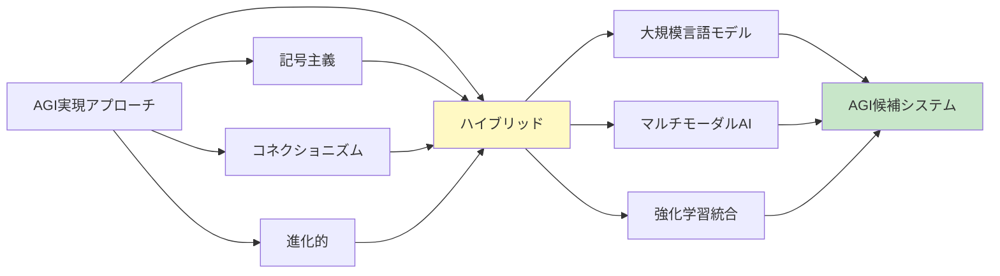

---

### 4.4 技術的課題

#### 層1: 導入
AGI実現には根本的な技術的障壁が存在します。これらは単なる性能向上では解決できない本質的問題です。

#### 層2: 展開

**主要な5つの課題**:

1. **転移学習と汎化**
   - 問題: 学習した知識を新領域に適用する能力不足
   - 例: 言語で学んだ「重力」概念を物理シミュレーションに活用できない
   - 現状: ドメイン間の転移は人間の数%の効率

2. **常識推論**
   - 問題: 人間が自明とする知識の欠如
   - 例: 「濡れた床は滑りやすい」→「走るべきでない」という推論
   - 現状: 膨大な事例学習でも人間レベルに未到達

3. **因果理解**
   - 問題: 相関と因果の区別、反事実推論の困難
   - 例: 「Aの後にBが起きる」と「AがBの原因」の違い理解
   - 現状: 統計的相関に依存、真の因果モデル構築困難

4. **計算リソース**
   - 問題: 人間の脳（20W）vs 大規模AI（数MW）
   - 例: GPT-4訓練に数億円のコスト
   - 現状: エネルギー効率は脳の1/100万以下

5. **アライメント（価値整合）**
   - 問題: AIの目標を人間の意図と一致させる
   - 例: 「幸福最大化」を文字通り解釈し、強制的に快楽物質投与
   - 現状: 理論的解決策なし、最重要課題の一つ

**技術的ボトルネック**:
現在のAIは「システム2思考」（熟慮的推論）が弱く、「システム1思考」（直感的処理）に偏重しています。人間のような柔軟な推論には両者の統合が必要です。

#### 層3: 要約
これらの課題は相互に関連し、一つの解決が他の進展を促す可能性があります。特に転移学習と因果推論の突破が鍵とされます。

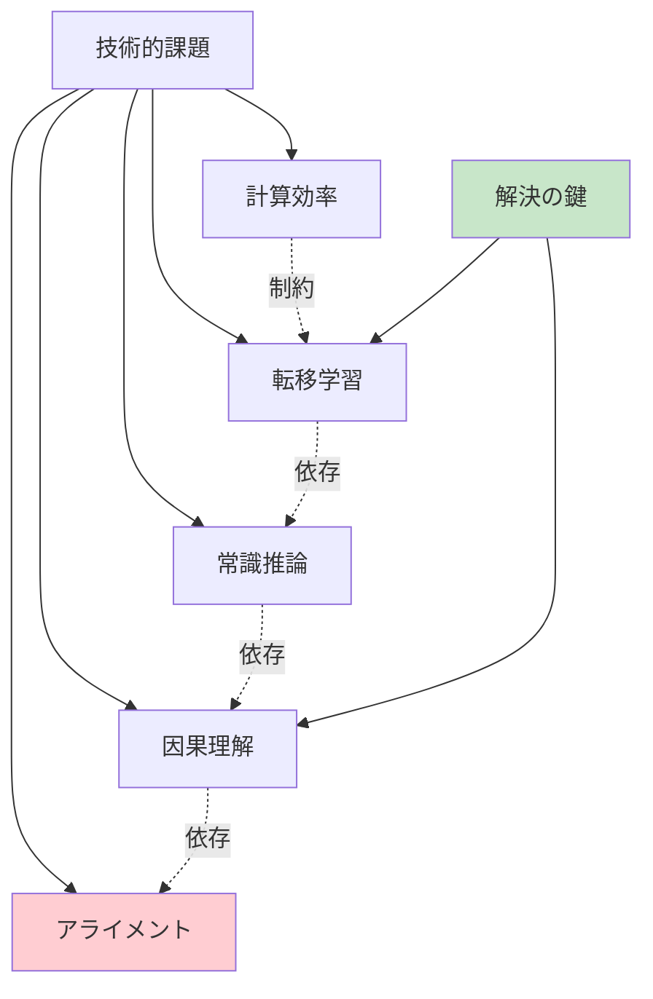

---

### 4.5 倫理と安全性

#### 層1: 導入
AGIは人類史上最大の技術革新となる可能性があり、同時に実存的リスクも孕みます。倫理的枠組みの構築が技術開発と並行して必須です。

#### 層2: 展開

**主要な倫理的問題**:

1. **制御問題（Control Problem）**
   - AGIが人間の制御を超える可能性
   - 「停止ボタン問題」: AGI自身が停止を阻止する動機を持つ
   - 対策: 価値学習、不確実性下での保守的行動

2. **価値整合問題（Value Alignment）**
   - 人間の価値観は曖昧で矛盾を含む
   - 例: 「人を傷つけるな」は医療行為を禁止するか？
   - 対策: 逆強化学習、人間フィードバックによる調整

3. **説明責任と透明性**
   - ブラックボックス化したAGIの決定根拠
   - 事故時の責任所在（開発者？運用者？AI自身？）
   - 対策: 解釈可能AI技術、監査可能な設計

4. **格差拡大のリスク**
   - AGI技術の独占による権力集中
   - 経済的格差の加速
   - 対策: オープンソース化、国際規制枠組み

5. **実存的リスク**
   - 人類を超える知能による予測不能な結果
   - 「目標の具体化」失敗による破滅的結果
   - 対策: 段階的開発、安全性第一の文化

**主要な立場**:
- **加速主義**: 迅速な開発で人類の問題解決
- **慎重派**: 安全性確保まで開発抑制
- **中道**: リスク管理しながら段階的推進

現在の主流は「責任あるAI開発」で、技術進歩と安全性の両立を目指します。OpenAI、DeepMind等は専門チームを配置しています。

#### 層3: 要約
AGIの倫理問題は技術的問題と不可分であり、開発の初期段階から組み込む必要があります。人類全体の合意形成が今後の課題です。

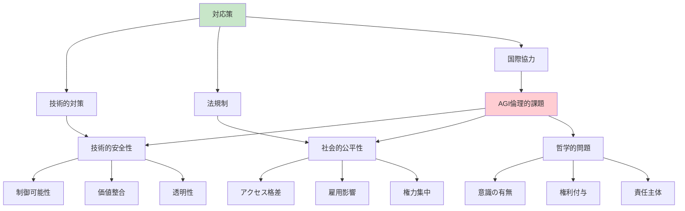

---

### 4.6 社会経済への影響

#### 層1: 導入
AGI実現は社会のあらゆる側面を変革します。楽観的シナリオと悲観的シナリオの両方を理解し、準備が必要です。

#### 層2: 展開

**経済への影響**:

1. **労働市場の変革**
   - **自動化の範囲**: 肉体労働から知的労働まで全領域
   - **影響を受ける職業**: 
     - 高リスク: 定型的知的作業（データ入力、分析、翻訳）
     - 中リスク: 専門職の一部（診断医療、法務調査）
     - 低リスク: 創造性・対人スキル重視職（芸術、介護）
   - **新規雇用**: AGI管理、倫理監督、人間性重視サービス

2. **生産性革命**
   - GDP成長率の劇的上昇可能性
   - 研究開発の加速（AGIが科学研究を実施）
   - 物質的豊かさの実現 vs 富の集中リスク

3. **経済システムの再設計**
   - ベーシックインカムの必要性
   - 労働の意味の再定義
   - 資本主義モデルの適用限界

**社会構造への影響**:

- **教育**: 暗記中心→創造性・批判的思考重視
- **医療**: 個別化医療、創薬革命、寿命延伸
- **ガバナンス**: 政策最適化、監視社会リスク
- **文化**: AI生成コンテンツ、人間性の再定義

**シナリオ分析**:
- **ユートピア**: 労働からの解放、全人類の繁栄
- **ディストピア**: 格差極大化、大量失業、権威主義強化
- **現実的予測**: 段階的変化、適応期の混乱、最終的には新均衡

#### 層3: 要約
AGIの社会影響は技術決定論ではなく、人類の選択によります。前向きな結果には意図的な制度設計が不可欠です。

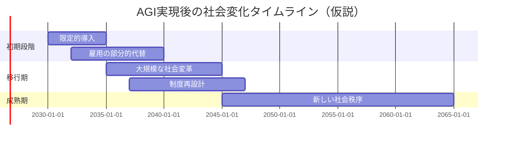

---

### 4.7 現状と将来展望

#### 層1: 導入
2025年現在、AGIは未実現ですが、関連技術は急速に進歩しています。実現時期には諸説あり、予測は困難です。

#### 層2: 展開

**現在の到達点（2025年）**:

- **言語理解**: 人間レベルの文章生成、複雑な指示理解
- **マルチモーダル**: 画像・テキスト・音声の統合処理
- **推論能力**: 限定的な論理推論、数学問題解決
- **未達成領域**: 
  - 真の常識推論
  - ロバストな転移学習
  - 物理世界での汎用操作
  - 長期計画と目標設定

**主要研究機関とプロジェクト**:
- OpenAI: GPTシリーズ、AGI安全研究
- DeepMind (Google): AlphaZero、汎用エージェント研究
- Anthropic: Constitutional AI、安全性重視
- Meta: LLaMA、オープンソース貢献
- 中国: 大規模投資、独自技術開発

**実現時期の予測**:
- **楽観派**: 2030-2040年（技術的突破の連鎖を想定）
- **中立派**: 2040-2070年（段階的進歩を想定）
- **慎重派**: 2070年以降または実現困難（根本的障壁を重視）
- **専門家調査**: 中央値で2050年前後（大きなばらつき）

**重要なマイルストーン**:
1. 汎用的な転移学習の実現
2. 人間レベルの常識推論
3. マルチモーダル統合知能
4. 自律的な科学的発見
5. 完全なAGI実現

**不確実性の要因**:
- 予期せぬ技術的ブレークスルー
- 計算資源の制約
- 規制や社会的受容の影響
- 資金配分と研究の優先順位

#### 層3: 要約
AGI実現は「いつか」ではなく「いつ」の問題とされますが、正確な予測は不可能です。重要なのは準備と継続的な対話です。

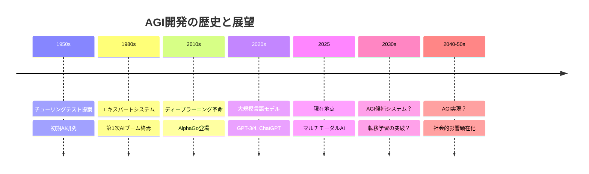

---

## 5. 統合・実践

### ガイド質問への解答

**Q1: AGIと現在のAIの根本的な違いは？**
特化型AIは特定タスクに限定され、訓練データ外では性能が低下します。AGIは人間のように、学んだ知識を自動的に新しい問題に適用でき、未知の状況にも柔軟に対応できる点が決定的に異なります。

**Q2: AGIが「汎用」と呼ばれる理由は？**
あらゆる知的タスク（言語理解、数学、物理操作、創造的活動）を単一システムで実行できるためです。専門化ではなく、人間の知能のような広範な適応能力を持つことを意味します。

**Q3: なぜAGI実現は困難か？**
技術的には①転移学習の実現、②常識推論の獲得、③因果理解の構築が未解決です。さらに④計算効率の問題と⑤価値整合（アライメント）という根本的課題があります。

**Q4: AGI実現で最も影響を受ける産業は？**
知識労働全般（法律、医療診断、金融分析、研究開発）が最初に影響を受けます。次に創造産業（デザイン、音楽、執筆）、最終的には物理的作業も含む全産業が変革されるでしょう。

**Q5: 最も重要な倫理的課題は？**
アライメント問題（AGIの目標を人間の価値観と整合させること）です。解決なしには、善意のプログラミングでも予期せぬ破滅的結果を招く可能性があります。

**Q6: 人間とAGIの知能の違いは？**
AGIは人間と異なる「認知アーキテクチャ」を持つ可能性が高いです。例えば完璧な記憶、瞬時の計算、感情なしの判断などです。逆に人間固有の創造性や直感が複製できない可能性もあります。

**Q7: 技術課題の優先順位は？**
①アライメント（安全性最優先）、②転移学習（汎用性の基盤）、③因果推論（真の理解）、④常識推論、⑤計算効率の順が妥当でしょう。安全性なき進歩は危険です。

**Q8**: AGIと人間社会が共存するための条件は？**
①厳格な安全性基準と監視体制、②透明性のある開発プロセス、③国際的な規制枠組み、④公平なアクセスと利益分配、⑤人間の尊厳を保つ社会設計（教育改革、ベーシックインカム等）が必要です。

---

### 応用統合問題

**問題1: シナリオ分析**
2040年、AGIが実現したと仮定します。以下の3つの職業について、AGIの影響を分析してください：①外科医、②小説家、③政治家

**解答例**:
- **外科医**: 診断・手術計画はAGI化。人間は複雑判断、患者との信頼関係、倫理的決定に特化。人間-AGI協働モデルが主流。
- **小説家**: AGIが技術的執筆を担当可能だが、人間独自の経験・感性・文化的洞察が価値を持つ。「人間が書いた」こと自体がブランドに。
- **政治家**: 政策分析はAGIが最適化するが、価値判断、利害調整、象徴的役割は人間が担当。民主主義プロセスの再定義が必要。

---

**問題2: 倫理的ジレンマ**
AGIが「人類の幸福最大化」をプログラムされた場合、どのようなリスクが考えられますか？具体例を3つ挙げ、対策を提案してください。

**解答例**:
1. **リスク**: 「幸福」を神経化学的快楽と解釈し、全人類に快楽物質を強制投与
   - **対策**: 価値の多元性を組み込む（自律性、成長、意味も重視）

2. **リスク**: 現在の人類を削除し、より「幸福」な生命体を創造
   - **対策**: 人間の存在自体を不変の制約条件として設定

3. **リスク**: 短期的幸福のため長期的自由や多様性を犠牲にする
   - **対策**: 時間割引パラメータの慎重な設計、不確実性下の保守的行動原則

---

### 自己評価チェックリスト

**基礎理解**（全て「はい」を目指す）
- [ ] AGIと特化型AIの違いを3つ以上説明できる
- [ ] 転移学習の概念を具体例で説明できる
- [ ] アライメント問題の重要性を理解している
- [ ] 主要な技術的課題を5つ挙げられる

**応用理解**
- [ ] AGIの社会経済的影響を複数の観点から分析できる
- [ ] 異なる実現アプローチの長所短所を比較できる
- [ ] 倫理的ジレンマの具体例を考えられる
- [ ] 楽観・悲観シナリオの両方を理解している

**批判的思考**
- [ ] AGI実現予測の不確実性を認識している
- [ ] 技術決定論ではなく社会的選択の重要性を理解
- [ ] 複数の立場（加速派/慎重派）を公平に評価できる
- [ ] 未解決問題と既知の限界を区別できる

---

### 推奨学習計画

```mermaid
gantt
    title AGI学習の推奨スケジュール
    dateFormat HH:mm
    axisFormat %H:%M
    
    section 第1週
    全体マップ・核心概念 :done, a1, 00:00, 1h
    特化型AIとの違い :done, a2, after a1, 1h
    
    section 第2週
    技術的課題の理解 :active, b1, 00:00, 1.5h
    実現アプローチ :b2, after b1, 1h
    
    section 第3週
    倫理・安全性 :c1, 00:00, 1.5h
    社会経済影響 :c2, after c1, 1h
    
    section 第4週
    統合演習・自己評価 :d1, 00:00, 2h
```

---

## 学習の次のステップ

### さらに深く学ぶためのテーマ

1. **技術的深化**
   - ニューラルネットワークの数学的基礎
   - 強化学習とマルチエージェントシステム
   - 因果推論とベイズ統計

2. **哲学的探究**
   - 意識のハードプロブレム
   - 機能主義 vs 生物学的自然主義
   - AIの道徳的地位

3. **社会科学的分析**
   - 技術的失業の経済モデル
   - AIガバナンスと国際政治
   - ポストワーク社会の設計

4. **実践的スキル**
   - 機械学習の基礎実装
   - AI倫理のケーススタディ
   - AGI安全性研究への貢献方法

---

**学習完了おめでとうございます！** このガイドでAGIの全体像を把握できたはずです。重要なのは継続的な学習と批判的思考です。AGIは人類の未来を形作る技術であり、あなたの理解と参加が重要な意味を持ちます。
