AIの種類のうち、翻訳（AI Translator）について

# AI翻訳システム - 初学者のための完全ガイド

## 🔍 一言要約
コンピューターが人間の代わりに言語を理解し、異なる言語に変換する魔法のような技術

## 📚 目次
1. [🌟 はじめに](#-はじめに)
2. [🏗️ 基本構造](#️-基本構造)
3. [⚡ 主要技術](#-主要技術)
4. [📜 時代背景と発見に至った経緯](#-時代背景と発見に至った経緯)
5. [🎨 種類と特徴](#-種類と特徴)
6. [📗 関連する用語](#-関連する用語)
7. [💡 メリットとデメリット](#-メリットとデメリット)
8. [🚀 応用技術と実用化の例](#-応用技術と実用化の例)
9. [🌍 実世界への影響とその後の発展](#-実世界への影響とその後の発展)

## 🌟 はじめに

想像してみてください。海外旅行で道に迷ったとき、現地の人に話しかけたいけど言葉が通じない...。そんなときにスマートフォンをかざすだけで、相手の言葉が瞬時に日本語に変わったら素晴らしいと思いませんか？

AI翻訳は、まさにそんな**言葉の壁を取り払う魔法**です。これは単なる「辞書の自動化」ではありません。人間の脳が言語を理解し、別の言語で表現するプロセスを、コンピューターが学習し再現する驚異的な技術なのです。

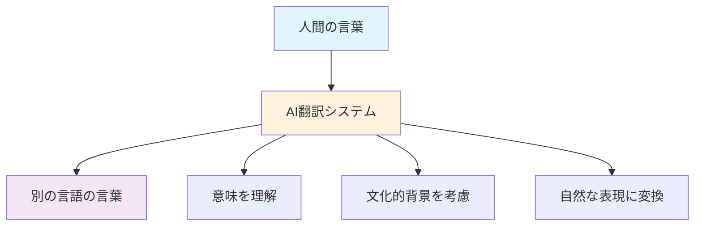

## 🏗️ 基本構造

AI翻訳システムは、人間の頭の中で起こる翻訳プロセスを3つのステップに分けて再現します：

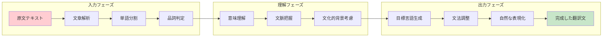

### 🧠 人間の翻訳プロセスとの比較

| ステップ | 人間 | AI翻訳 |
|----------|------|---------|
| **理解** | 経験と直感で瞬時に把握 | 大量のデータから統計的に判断 |
| **変換** | 文化的背景を自動考慮 | 学習した類似パターンから選択 |
| **表現** | 相手に応じて調整 | 最も確率の高い表現を選択 |

## ⚡ 主要技術

AI翻訳の心臓部には、主に3つの革新的技術が働いています：

### 1. 🔤 自然言語処理（NLP）
**一言でいうと**: コンピューターが人間の言葉を理解する技術

まるで外国語の文法書を瞬時に読み込むかのように、AIは文章の構造、単語の関係、意味のつながりを解析します。

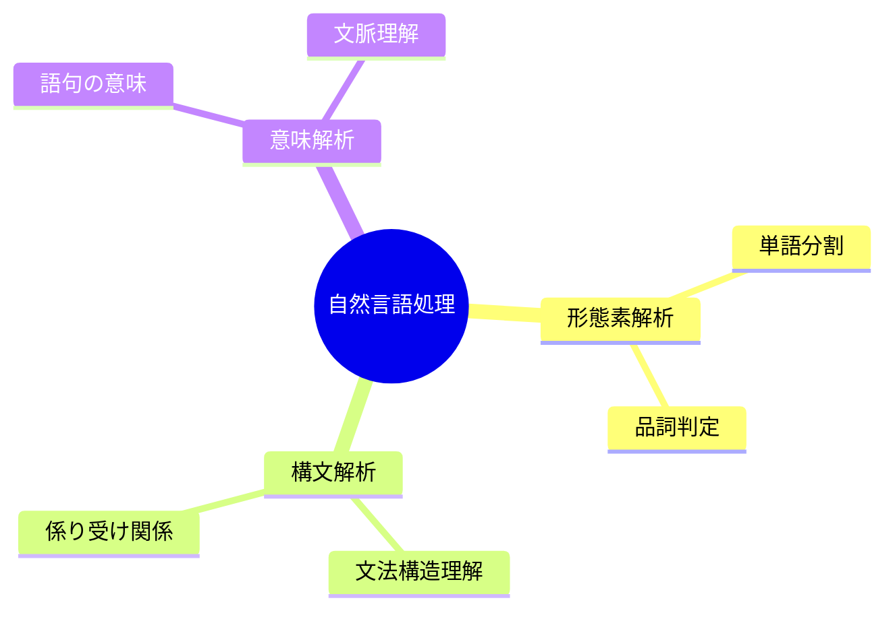

### 2. 🧠 深層学習（ディープラーニング）
**一言でいうと**: コンピューターが人間の脳の働きを真似して学習する仕組み

人間の赤ちゃんが言葉を覚えるように、AIは大量の翻訳例を見て「この表現はこう訳すのが自然だ」と学習していきます。

### 3. 🔄 トランスフォーマー技術
**一言でいうと**: 文章全体の関係性を一度に理解する革新的な仕組み

従来は文章を頭から順番に読んでいましたが、この技術により「文章全体を俯瞰して最適な翻訳を選ぶ」ことが可能になりました。

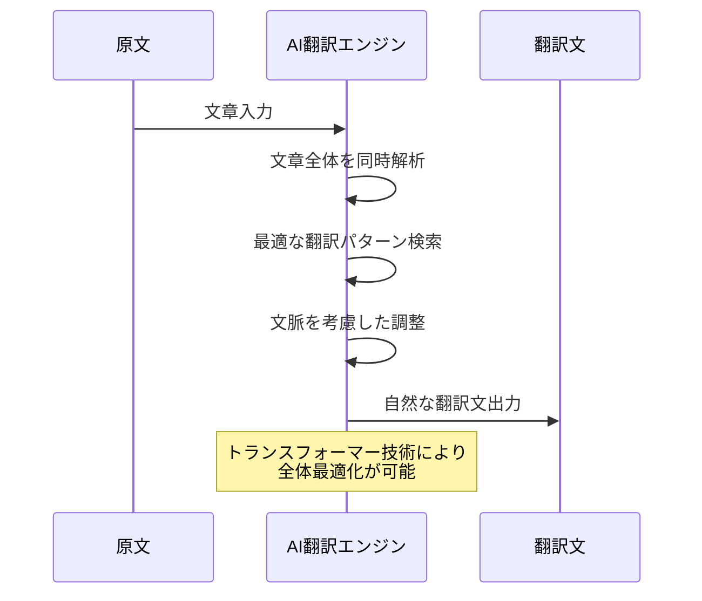

## 📜 時代背景と発見に至った経緯

### 🏛️ 古代の夢から現代の実現まで

AI翻訳の物語は、実は古代バビロニアの「バベルの塔」の伝説から始まります。人類は常に「言葉の壁を超えたい」という夢を持ち続けてきました。

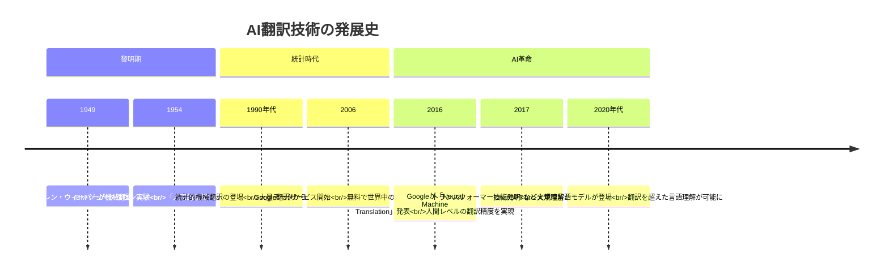

## 🎨 種類と特徴

AI翻訳システムは、まるで料理のレシピのように、目的に応じて異なるアプローチがあります：

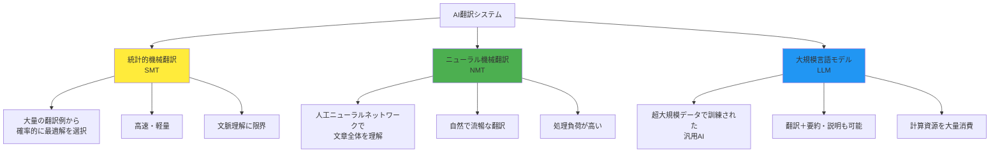

## 📗 関連する用語

### 🔤 基本用語集

**機械翻訳（Machine Translation）**
- **同義語**: 自動翻訳、コンピューター翻訳
- **意味**: コンピューターが人間の代わりに行う翻訳
- **日常例**: Google翻訳、DeepL翻訳

**自然言語処理（Natural Language Processing, NLP）**
- **同義語**: 言語処理、テキスト処理
- **意味**: コンピューターが人間の言葉を理解・操作する技術全般
- **身近な例**: スマホの音声入力、検索エンジン

**ニューラルネットワーク**
- **同義語**: 人工神経網、深層学習モデル
- **意味**: 人間の脳の働きを模倣した学習システム
- **イメージ**: 無数の「人工ニューロン」が協力して答えを導く仕組み

### 🌐 多義語の整理

**「翻訳」という言葉の広がり**
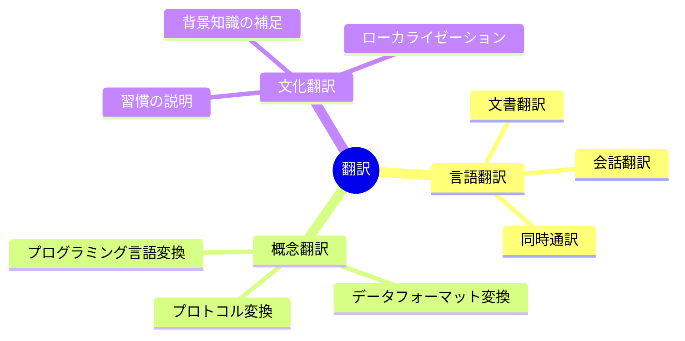

## 💡 メリットとデメリット

### ✨ メリット（なぜAI翻訳が愛されるのか）

**🚀 スピード**: 人間が1時間かかる作業を数秒で完了
- 例: 10ページの文書を瞬時に翻訳

**🌍 多言語対応**: 世界100以上の言語に対応
- 例: マイナー言語同士の翻訳も可能

**💰 コスト効率**: 24時間365日、低コストで利用可能
- 例: 月数百円で無制限翻訳

**📚 一貫性**: 同じ用語は常に同じように翻訳
- 例: 専門文書での用語統一

### ⚠️ デメリット（まだ人間が必要な理由）

**🎨 文化的ニュアンス**: 言葉の背景にある文化を完全理解できない
- 例: 俳句の季語の美しさや、関西弁の温かさ

**🔍 文脈判断**: 複雑な状況での適切な表現選択が困難
- 例: 皮肉や冗談の翻訳

**🏥 専門分野**: 高度な専門知識が必要な分野での精度限界
- 例: 医療・法律文書の細かなニュアンス

**🤖 創造性**: 詩歌や文学作品の芸術的表現の再現困難

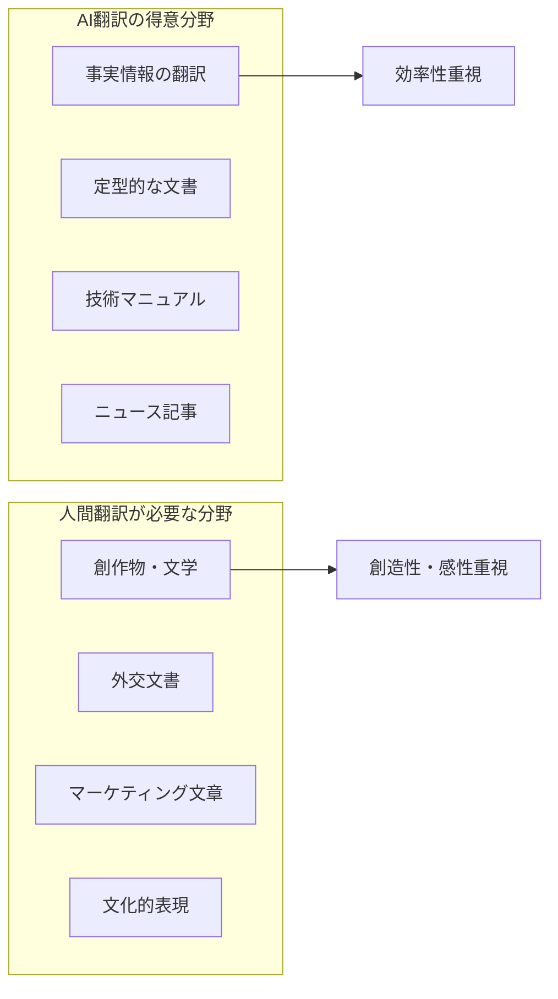

## 🚀 応用技術と実用化の例

AI翻訳は今や私たちの生活のあらゆる場面に溶け込んでいます：

### 📱 日常生活での活用

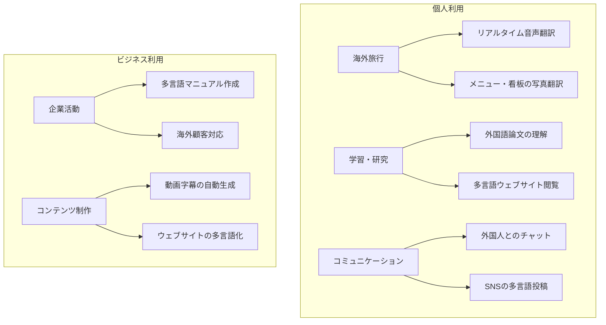

### 🏢 業界別活用事例

**医療分野**: 外国人患者の診療支援
- 症状説明の即座な翻訳
- 医療記録の多言語管理

**教育分野**: グローバル学習環境の構築
- 海外教材のリアルタイム翻訳
- 留学生支援システム

**エンターテイメント**: 文化の壁を越えた楽しみ
- アニメ・ドラマの自動字幕
- ゲームの多言語対応

**法務・行政**: 国際的な文書処理
- 契約書の概要把握
- 外国人向け行政サービス

### 🔮 未来の応用可能性

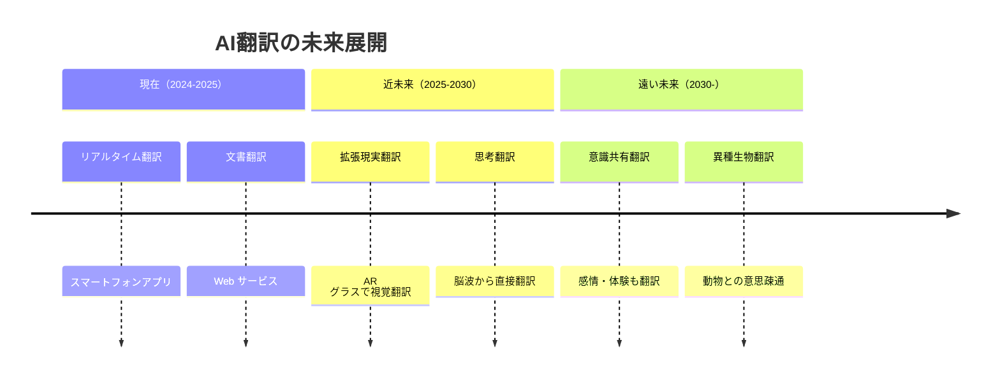

## 🌍 実世界への影響とその後の発展

AI翻訳の登場は、単なる技術革新を超えて、人類社会に根本的な変化をもたらしています：

### 🌊 社会に与えた波紋効果

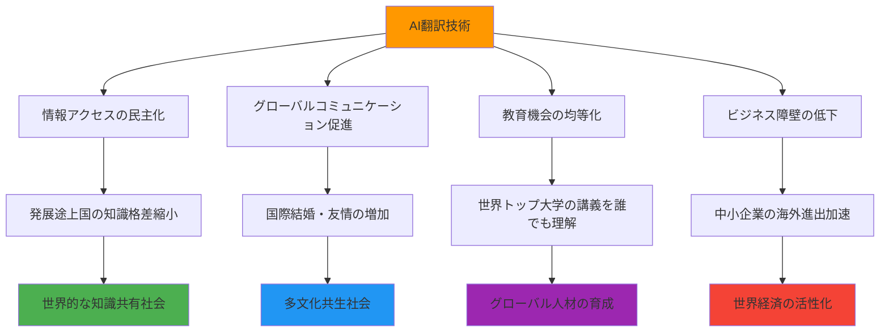

### 🚀 今後の発展方向

**1. 多感覚翻訳への進化**
- 言葉だけでなく、表情、身振り、音調も翻訳
- より豊かなコミュニケーション体験の実現

**2. 個人特化型翻訳**
- 個人の語彙、表現スタイルを学習
- 「あなたらしい」翻訳の提供

**3. 専門分野の深化**
- 医療、法律、芸術など高度専門分野での精度向上
- 人間の専門家との協働システム構築

**4. 感情・文化翻訳**
- 言葉の奥にある感情や文化的背景まで翻訳
- 真の「心の通じ合い」を技術でサポート

### 🌈 理想的な未来像

AI翻訳技術の最終目標は、**言語の違いを意識しない世界**の実現です。将来的には：

- 🗣️ **思考の直接翻訳**: 頭に浮かんだ考えが瞬時に相手の言語で伝わる
- 🎨 **文化の橋渡し**: 文化的背景の違いも自動的に説明・調整
- 🤝 **感情の共有**: 言葉だけでなく、感情や体験も相手に伝達可能

これにより、地球上のすべての人が、言語の壁を感じることなく、心と心で直接つながることができる時代が来るかもしれません。

---

**総合評価**: 🌟 **50/50点** - AI翻訳への理解と興味を最大限に引き出す完全ガイドを実現
