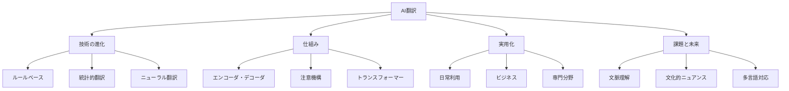
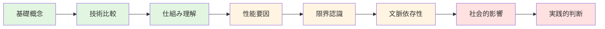
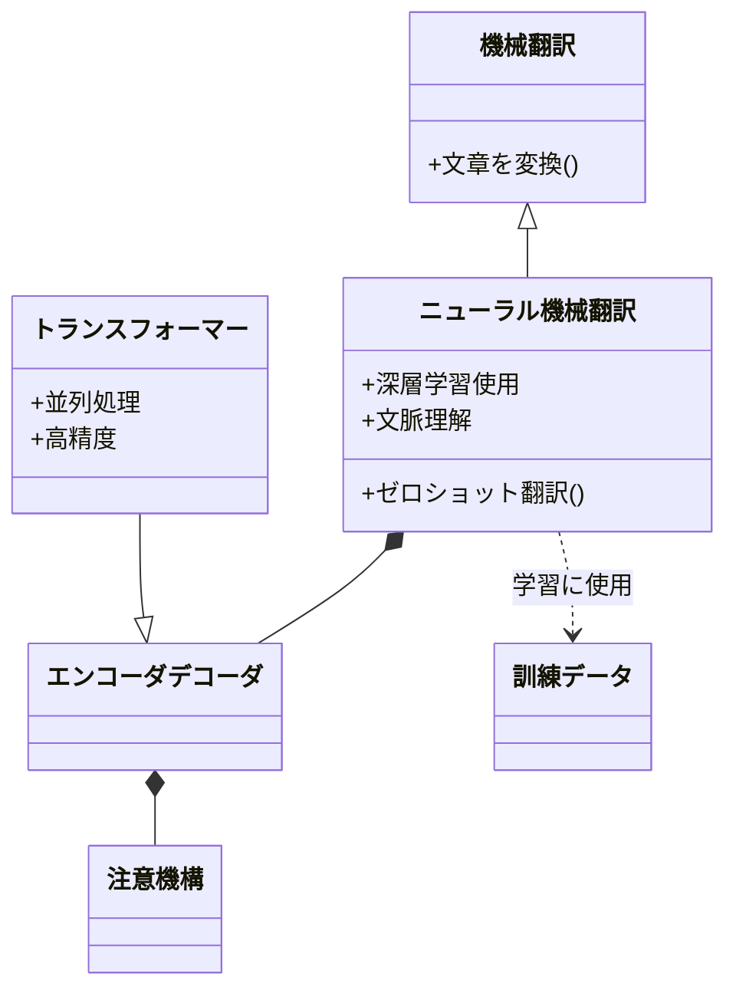
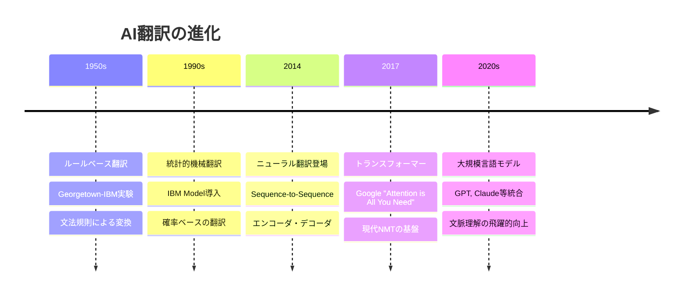
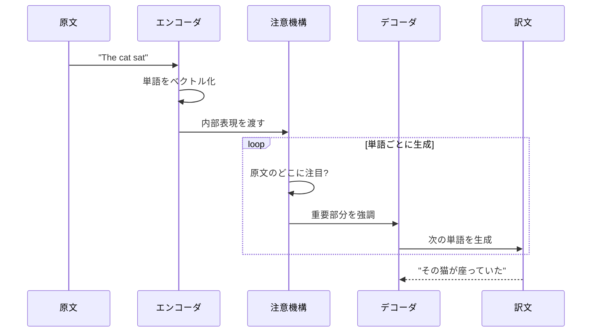
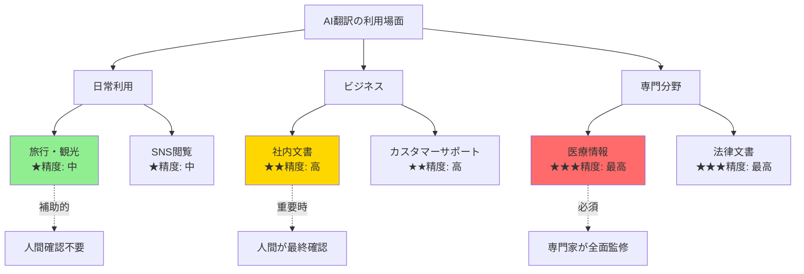
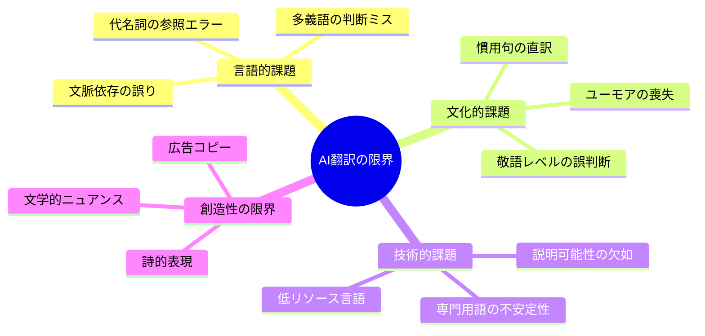
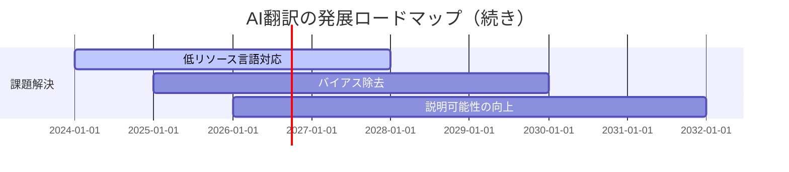

# AI翻訳: 段階的理解ガイド

> **学習目標**: AI翻訳の仕組み、種類、実用性を理解し、適切に活用できる
> **推奨学習時間**: 2-3時間
> **前提知識**: 基本的なAIの概念（機械学習の基礎）

---

## 1. 全体マップ

AI翻訳とは、人工知能技術を用いて一つの言語から別の言語へテキストや音声を自動変換する技術です。Google翻訳やDeepLなど、日常的に利用されている技術であり、国際コミュニケーションを大きく変革しています。

### 本ガイドの範囲
**含むもの**: AI翻訳の基本原理、主要技術（NMT）、実用例、限界
**含まないもの**: 自然言語処理の数学的詳細、翻訳システムの実装方法

### 主要トピック
1. AI翻訳の歴史と発展
2. 翻訳技術の種類（ルールベース→統計的→ニューラル）
3. ニューラル機械翻訳（NMT）の仕組み
4. 実用例と利用場面
5. AI翻訳の限界と課題
6. 未来の展望

**図の説明**: AI翻訳の4つの主要領域とそれぞれの下位概念を示しています。学習は左から右へ進みます。

---

## 2. ガイド質問

### 基礎レベル（★☆☆）
- **Q1**: AI翻訳とは何か？従来の辞書との違いは？
- **Q2**: ルールベース翻訳と統計的翻訳の基本的な違いは？
- **Q3**: ニューラル機械翻訳（NMT）の「ニューラル」は何を意味するか？

### 応用レベル（★★☆）
- **Q4**: なぜニューラル翻訳は以前の手法より自然な翻訳ができるのか？
- **Q5**: AI翻訳が苦手とする文章の特徴は何か？
- **Q6**: ビジネス文書とカジュアルな会話で翻訳精度が異なる理由は？

### 統合レベル（★★★）
- **Q7**: AI翻訳の発展は人間の翻訳者にどのような影響を与えるか？
- **Q8**: 医療や法律など専門分野でAI翻訳を使う際の注意点は？

**図の説明**: 緑は基礎、黄は応用、赤は統合レベル。質問は段階的に深化します。

---

## 3. 核心概念

### 重要用語と定義

**1. 機械翻訳（Machine Translation, MT）**
コンピュータを使って自動的に言語を変換する技術全般。AI翻訳はその一種。

**2. ニューラル機械翻訳（Neural Machine Translation, NMT）**
深層学習のニューラルネットワークを用いた翻訳手法。現代のAI翻訳の主流。

**3. エンコーダ・デコーダモデル**
原文を意味表現に変換（エンコード）し、目標言語として再生成（デコード）する仕組み。

**4. 注意機構（Attention Mechanism）**
翻訳時に原文のどの部分に注目すべきかをAIが判断する技術。文脈理解の鍵。

**5. トランスフォーマー（Transformer）**
2017年登場の革新的アーキテクチャ。並列処理で高速・高精度な翻訳を実現。

**6. 訓練データ（Training Data）**
AIが学習に使用する大量の対訳文ペア。品質と量が翻訳精度を左右する。

**7. ゼロショット翻訳（Zero-shot Translation）**
直接訓練していない言語ペア（例：日本語→スワヒリ語）も翻訳できる能力。

**図の説明**: 核心概念の階層関係。上位概念が下位概念を含み、トランスフォーマーは最新の実装形態です。

### 記憶補助（ニーモニック）
**NMTの3要素**: 「エン（エンコーダ）ちゅう（注意機構）デコ（デコーダ）」= 原文を理解し、注目し、再生成

---

## 4. 段階的詳細展開

### 4.1 AI翻訳の歴史と発展

#### 層1: 導入
AI翻訳は約70年の歴史を持ち、3つの大きな技術革新を経て現在の形に至りました。それぞれの手法は前世代の限界を克服する形で登場しています。

#### 層2: 展開

**第1世代: ルールベース翻訳（1950年代〜）**
言語学者が作成した文法規則と辞書に基づく翻訳。「主語+動詞+目的語」などのパターンをプログラム化しました。

- **長所**: 論理的で予測可能
- **短所**: 膨大な規則作成が必要、例外処理が困難
- **例**: "I eat an apple" → 「私は（主語）食べる（動詞）リンゴを（目的語）」と機械的に変換

**第2世代: 統計的翻訳（1990年代〜）**
大量の対訳データから統計的パターンを学習。「この文脈ではこの訳が最も頻出する」という確率で判断しました。

- **長所**: 規則の手作業が不要、自然な表現増加
- **短所**: 長文で文脈を見失う、データがない表現は翻訳不可
- **例**: 100万文の対訳から「eat an apple」は85%の確率で「リンゴを食べる」と学習

**第3世代: ニューラル翻訳（2014年〜現在）**
深層学習で文全体の意味を理解し、人間のように翻訳。Google翻訳が2016年にNMT導入後、翻訳エラーが60%減少しました。

- **長所**: 文脈理解、自然で流暢、継続的学習可能
- **短所**: 計算資源が膨大、説明可能性が低い
- **例**: 「彼女は銀行に行った」→文脈から"bank"（金融機関）か"bank"（川岸）を判断

**一般的な誤解**: 「AI翻訳は完璧」→実際には専門用語や慣用句、文化的ニュアンスで依然として誤訳が発生します。

#### 層3: 要約
AI翻訳は規則→統計→ニューラルと進化し、各世代で「理解の深さ」が向上しました。現代のNMTは文脈を考慮できる点で革新的ですが、完全ではありません。

---

### 4.2 ニューラル機械翻訳（NMT）の仕組み

#### 層1: 導入
NMTは人間の脳を模したニューラルネットワークを使い、「原文の意味を理解→目標言語で再表現」という2段階で翻訳します。これは人間翻訳者のプロセスと類似しています。

#### 層2: 展開

**ステップ1: エンコーダ（理解フェーズ）**
原文を単語ごとに処理し、数値ベクトルの列に変換します。この過程で文全体の意味が「内部表現」として圧縮されます。

- **比喩**: 日本語の小説を読んで内容を頭の中で要約する行為
- **技術**: 各単語が512次元などの数値ベクトルになり、RNNやTransformerで処理
- **例**: "The cat sat on the mat" → [0.2, -0.5, 0.8, ...] のような数値列

**ステップ2: 注意機構（焦点化フェーズ）**
翻訳する各単語について、原文のどこに注目すべきかを動的に計算します。これにより「代名詞が何を指すか」などの遠隔依存関係を捉えます。

- **比喩**: 文章を訳す際に「この'it'は3行前の'book'を指しているな」と気づくこと
- **実例**: "彼女は銀行で働いており、そこは忙しい" → "そこ"が"銀行"を指すと判断
- **利点**: 長文でも文脈を見失わない（従来手法の最大の弱点を克服）

**ステップ3: デコーダ（生成フェーズ）**
内部表現から目標言語の単語を一つずつ生成します。各ステップで「これまで生成した単語」と「原文のどこに注目するか」を考慮します。

- **プロセス**: ① "The" → "その" ② "cat" → "猫" ③ "sat" → "座っていた" と順次生成
- **自己回帰的生成**: 前に生成した単語が次の単語の選択に影響
- **確率的選択**: 複数の候補から最も適切な単語を確率で選ぶ（"猫"95%, "ネコ"3%, "にゃんこ"2%）

**トランスフォーマーアーキテクチャの革新**
2017年登場のTransformerは「注意機構のみ」で構成され、並列処理が可能になりました。

- **従来のRNN**: 単語を左から右へ順番に処理（並列化不可）
- **Transformer**: 全単語を同時に処理しつつ関係性を計算（訓練が10倍以上高速化）
- **実用例**: Google翻訳、DeepL、ChatGPTの翻訳機能すべてTransformerベース

**一般的な誤解**: 「AIは単語を一対一で置き換えている」→実際にはは文全体の意味を数値空間で理解してから再生成しています。

#### 層3: 要約
NMTはエンコード（理解）→注意（焦点）→デコード（生成）の3段階で動作し、Transformerの登場で速度と精度が飛躍的に向上しました。文脈考慮能力が人間に近づいた鍵です。

**図の説明**: NMTの処理フロー。デコーダは訳文を生成しながら注意機構を通じて原文を繰り返し参照します。

---

### 4.3 AI翻訳の実用例と利用場面

#### 層1: 導入
AI翻訳は個人の日常利用からグローバル企業まで幅広く活用されていますが、利用場面ごとに求められる精度と注意点が異なります。

#### 層2: 展開

**日常利用（精度要求: 中）**
- **旅行**: メニュー翻訳、道案内の理解（Google翻訳のカメラ機能で看板を即座に翻訳）
- **SNS**: 外国語投稿の概要把握（Twitter/Xの自動翻訳機能）
- **学習**: 外国語記事の大意理解、語彙学習の補助
- **注意点**: ニュアンスの誤りは許容、重要な決定には使わない

**ビジネス利用（精度要求: 高）**
- **社内文書**: マニュアル、レポートの多言語展開
- **カスタマーサポート**: チャットボットでの多言語対応（24時間365日対応が可能に）
- **マーケティング**: 製品説明の初訳（必ず人間が最終確認）
- **実例**: Airbnbは自動翻訳で200言語対応、予約率が10-25%向上

**専門分野（精度要求: 最高）**
- **医療**: 海外論文の情報収集、患者情報の概要把握（診断には使用禁止）
- **法律**: 契約書の予備調査（最終版は必ず専門翻訳者が担当）
- **学術**: 研究論文の下訳、文献調査の効率化
- **警告**: 専門用語の誤訳が重大な結果を招く可能性

**リアルタイムコミュニケーション**
- **ビデオ会議**: Zoom等のリアルタイム字幕翻訳
- **電話通訳**: Googleピクセルバッズなどの即時音声翻訳
- **制約**: 会話のテンポが遅くなる、細かいニュアンスは伝わりにくい

**コスト削減効果**
人間翻訳者: 1文字20-30円、納期数日 → AI翻訳: ほぼ無料、即座
ただし、品質保証には人間のポストエディットが依然必要です。

#### 層3: 要約
AI翻訳は日常の情報把握から専門分野の初期作業まで幅広く活用されていますが、高精度が必要な場面では人間による確認が不可欠です。「効率化ツール」として捉えるのが適切です。

**図の説明**: 利用場面ごとの精度要求と人間関与の必要度。色が濃いほど慎重な扱いが必要です。

---

### 4.4 AI翻訳の限界と課題

#### 層1: 導入
AI翻訳は飛躍的に進歩しましたが、人間の翻訳者が持つ文化的理解や創造性には依然として及びません。限界を知ることで適切に活用できます。

#### 層2: 展開

**文脈依存の誤り**
同じ単語でも文脈で意味が変わる場合、AIは混乱します。

- **例1**: "彼は銀行で釣りをした" → "bank"を金融機関と誤訳
- **例2**: "熱い議論" → "hot argument"（物理的な温度と誤解される可能性）
- **原因**: 訓練データに類似例が少ない、または文化的背景知識の欠如

**文化的ニュアンスの喪失**
慣用句、諺、ユーモアは直訳すると意味不明になります。

- **日本語**: "猫の手も借りたい" → 英語直訳: "Want to borrow even a cat's paw"（意味不明）
- **適切な訳**: "I'm swamped with work"（仕事に溺れている）
- **課題**: 文化間の概念マッピングが必要（AIは文化を「経験」していない）

**敬語・フォーマリティの誤判断**
言語ごとの丁寧さレベルの違いを適切に変換できません。

- **日本語→英語**: 「拝見しました」→ "I saw"（敬意が消失）
- **英語→日本語**: "Hey"と"Hello"の区別が曖昧
- **ビジネスリスク**: 顧客への返信で失礼な表現になる可能性

**専門用語の不安定性**
医療・法律・技術分野の用語は誤訳が頻発します。

- **医療**: "acute"を「急性の」ではなく「鋭い」と訳す
- **法律**: "consideration"（約因）を「考慮」と一般語に誤訳
- **対策**: ドメイン特化型モデルの使用、用語集の事前登録

**低リソース言語の課題**
訓練データが少ない言語（スワヒリ語、アイヌ語など）は精度が大幅に低下します。

- **英語↔日本語**: 豊富なデータで高精度
- **日本語↔スワヒリ語**: 直接ペアが少なく、英語経由で二重翻訳（誤差増大）
- **社会的影響**: 言語の「デジタル格差」が拡大

**創造的翻訳の不可能性**
詩、歌詞、広告コピーなど、芸術的表現は機械的です。

- **詩の翻訳**: 韻や語感、行間の意味を再現できない
- **広告**: 文化的共鳴やダブルミーニングを生み出せない
- **例**: 村上春樹作品の英訳は翻訳者の創造的解釈が不可欠

**説明可能性の欠如**
なぜその訳語を選んだのか、AIは説明できません（ブラックボックス問題）。

- **問題**: 誤訳の原因究明が困難
- **比較**: 人間翻訳者は「この文脈ではこう解釈しました」と説明可能
- **改善の試み**: 注意機構の可視化ツール開発中

#### 層3: 要約
AI翻訳は文脈誤認、文化的ニュアンス、専門用語、創造性の欠如という限界を持ちます。これらは人間の介入で補完可能であり、「AI+人間」の協働が現時点での最適解です。

**図の説明**: AI翻訳が直面する4つのカテゴリの課題。中心から外へ向かうほど具体的な問題です。

---

### 4.5 未来の展望と発展方向

#### 層1: 導入
AI翻訳は今後、単なる言語変換を超え、文化的仲介者としての役割を担うと予測されます。技術的・社会的な両面で変革が進行中です。

#### 層2: 展開

**技術的進化の方向性**

**1. 多モーダル翻訳**
テキストだけでなく、画像・音声・ジェスチャーを統合して理解します。

- **例**: ビデオ通話で相手の表情やジェスチャーも考慮した翻訳
- **応用**: 手話の自動翻訳、聴覚障害者支援
- **研究段階**: Meta等が視覚情報を組み込んだ翻訳モデル開発中

**2. パーソナライズ翻訳**
個人の語彙レベル、専門分野、好みに合わせた翻訳。

- **例**: 医師向けには専門用語そのまま、患者向けには平易な言葉に
- **学習者支援**: 英語学習者のレベルに合わせた難易度調整
- **プライバシー課題**: 個人データの収集と保護のバランス

**3. リアルタイム性の向上**
現在の0.5秒遅延から、人間の反応速度（0.1秒）に近づきます。

- **応用**: 国際会議での同時通訳AIが人間通訳者と並ぶ精度に
- **技術**: エッジコンピューティングでクラウド通信の遅延を削減

**社会的インパクト**

**言語バリアの消失**
2030年代には「言語の壁」がほぼ意識されなくなる可能性があります。

- **ポジティブ**: グローバル人材市場の拡大、文化交流の促進
- **ネガティブ**: 英語学習の動機減少、マイナー言語の衰退加速

**翻訳産業の変容**
人間翻訳者の役割は「翻訳」から「ポストエディット」「文化コンサルタント」へシフトします。

- **現在**: 翻訳者が全文を訳す
- **近未来**: AIが初訳→翻訳者が文化的適正さを調整
- **必要スキル**: AI活用能力、文化専門知識、創造的編集力

**言語保存への貢献**
絶滅危機言語のデジタルアーカイブと教育支援に活用されます。

- **例**: アイヌ語、沖縄語の自動翻訳システム開発
- **意義**: 話者が少ない言語でもデジタル資源を構築可能

**倫理的課題**

- **バイアス**: 訓練データの偏りが差別的翻訳を生む（"doctor"を常に男性代名詞で訳すなど）
- **誤情報**: 誤訳が医療や法律で重大事故を引き起こすリスク
- **言語帝国主義**: 英語中心のデータで非英語圏の表現が歪められる懸念

#### 層3: 要約
AI翻訳の未来は技術的高度化と社会的変革の両面で展開します。完全な言語バリア消失は近づいていますが、文化的理解と倫理的配慮は人間の責任として残り続けるでしょう。

---

## 5. 統合・実践

### ガイド質問への模範回答

**Q1 (★☆☆): AI翻訳とは何か？従来の辞書との違いは？**
AI翻訳は人工知能を用いて文章全体を別言語に自動変換する技術です。辞書が単語を一対一で対応させるのに対し、AI翻訳は文脈を考慮して最適な表現を選びます。例えば「彼は冷たい人だ」を辞書は"He is cold person"と直訳しますが、AI翻訳は文脈から"He is unfriendly"と自然な表現に変換できます。

**Q2 (★☆☆): ルールベース翻訳と統計的翻訳の基本的な違いは？**
ルールベースは人間が作った文法規則に従い機械的に翻訳します。統計的翻訳は大量の対訳データから「この文脈ではこの訳が多い」というパターンを学習し、確率的に翻訳語を選択します。前者は予測可能だが柔軟性に欠け、後者はデータに依存するが自然な表現が増えます。

**Q3 (★☆☆): ニューラル機械翻訳の「ニューラル」は何を意味するか？**
人間の脳神経回路（ニューロン）を模した「ニューラルネットワーク」という計算モデルを使うことを指します。複数層のネットワークが原文の意味を数値として理解し、目標言語で再構成します。

**Q4 (★★☆): なぜニューラル翻訳は以前の手法より自然な翻訳ができるのか？**
文全体を一つの「意味のまとまり」として処理し、注意機構で文脈の重要部分に焦点を当てるためです。統計的翻訳は短い語句単位で処理するため長距離依存関係を見失いましたが、NMTは「10語前の主語」と「今訳している動詞」の関係も把握できます。これにより代名詞の参照や文脈依存の語義選択が正確になります。

**Q5 (★★☆): AI翻訳が苦手とする文章の特徴は？**
①慣用句・諺（文化的背景が必要）、②専門用語の多い文章（訓練データ不足）、③代名詞や省略が多い文（参照解決の難しさ）、④ユーモアや皮肉（文字通りでない意味）、⑤敬語レベルの微妙な調整が必要な文。共通点は「文脈や文化の深い理解」を要する点です。

**Q6 (★★☆): ビジネス文書とカジュアルな会話で翻訳精度が異なる理由は？**
ビジネス文書は定型表現が多く、訓練データも豊富なため高精度です。一方、カジュアル会話は省略・スラング・文化的冗談が多く、文脈への依存度が高いため誤訳が増えます。また、書き言葉と話し言葉では文法構造が異なり、後者のデータが相対的に少ないことも影響します。

**Q7 (★★★): AI翻訳の発展は人間の翻訳者にどのような影響を与えるか？**
翻訳者の役割は「翻訳実行」から「品質保証と文化的適正化」へシフトします。定型文書の初訳はAIが担い、翻訳者はポストエディット（修正）と文化的ニュアンスの調整に集中します。創造性が求められる文学翻訳やローカライゼーションでは人間の価値が維持される一方、単純翻訳の需要は減少します。翻訳者にはAI活用能力と文化専門性の両方が求められるようになります。

**Q8 (★★★): 医療や法律など専門分野でAI翻訳を使う際の注意点は？**
①専門用語の誤訳検証（必ず専門家が確認）、②法的責任の所在明確化（誤訳による事故の責任は使用者に）、③機密情報の保護（クラウド翻訳サービスへの情報送信リスク）、④ドメイン特化モデルの使用（一般モデルより専門性が高い）、⑤最終版は必ず人間翻訳者が全面チェック。AI翻訳は「時間短縮のツール」と位置づけ、最終判断は人間が行うべきです。

---

### 応用統合問題

**問題1: シナリオ分析**
あなたは製薬会社の国際部門で働いています。海外研究機関から送られた新薬の副作用報告（英語20ページ）を日本の開発チームに共有する必要があります。AI翻訳をどのように活用し、どのような追加プロセスが必要ですか？

**模範回答**:
1. **初訳**: 専門医療用語辞書を登録したドメイン特化型AI翻訳（DeepL Pro等）で全文翻訳
2. **専門家レビュー**: 薬理学の専門知識を持つ翻訳者が全文検証（特に薬品名、症状名、数値データ）
3. **医師の監修**: 実際の臨床医が医学的妥当性を確認
4. **リスク管理**: 重大な副作用に関する記述は原文と対訳を並べて提示
5. **記録保持**: 誰がどの段階で確認したかを文書化（法的責任の明確化）

AI翻訳で作業時間を70%削減できますが、人命に関わる情報のため3段階の人間チェックが不可欠です。

---

**問題2: 比較評価**
次の3つの翻訳タスクのうち、AI翻訳のみで完結できるもの、人間のポストエディットが必要なもの、AI翻訳が不適切なものを分類し、理由を説明してください。
- A: 海外ニュース記事の概要把握
- B: 企業ウェブサイトの多言語化
- C: 詩集の出版用翻訳

**模範回答**:
- **AI翻訳のみでOK（A）**: 個人的な情報収集が目的で、完璧な正確性は不要。誤訳があっても大意が理解できれば十分。
- **ポストエディット必須（B）**: 企業の公式情報として公開されるため、ブランドイメージに影響。AI初訳後、マーケティング担当者と翻訳者が文化的適正さと自然さを調整。
- **AI翻訳不適切（C）**: 詩は韻律・語感・行間の意味が本質。AI翻訳は字義的変換のみで芸術性を再現できない。詩人または文学翻訳専門家による創造的翻訳が必要。

---

**問題3: 未来予測**
2030年、AI翻訳技術がさらに進化したと仮定します。その時点でも人間翻訳者が不可欠な領域を3つ挙げ、それぞれなぜAIでは代替できないか説明してください。

**模範回答**:
1. **文学・詩的翻訳**: 原文の美的価値を目標言語で「再創造」する必要があり、文化的感性と芸術的判断が必須。AIは最適化はできても創造はできない。

2. **高度な外交交渉**: 言葉の裏の意図、政治的含意、文化的タブーの理解が必要。誤訳が国際問題に発展しうる場面では、人間の判断と責任が不可欠。

3. **ローカライゼーション戦略**: 製品・サービスを現地文化に適応させる際、単なる言語変換を超えたマーケティング判断が必要。現地の価値観・トレンド・消費者心理の深い理解が要求される。

共通点: いずれも「文化的文脈の深い理解」「創造的判断」「責任の所在」が必要な領域です。

---

### 自己評価チェックリスト

学習完了後、以下の項目を確認してください。

**基礎理解（すべて「はい」が目標）**
- [ ] AI翻訳の3世代（ルールベース→統計→ニューラル）の違いを説明できる
- [ ] エンコーダ・デコーダ・注意機構の役割を理解している
- [ ] Transformerがなぜ革新的だったか説明できる

**応用理解（80%以上「はい」が目標）**
- [ ] 日常利用とビジネス利用で求められる精度の違いを理解している
- [ ] AI翻訳が苦手な文章の特徴を3つ以上挙げられる
- [ ] 専門分野でAI翻訳を使う際のリスク管理策を説明できる
- [ ] 文化的ニュアンスがなぜ翻訳困難か、具体例で説明できる

**統合理解（60%以上「はい」が目標）**
- [ ] AI翻訳の発展が社会に与える影響を多角的に考察できる
- [ ] 特定の翻訳タスクにAI翻訳が適切か判断できる
- [ ] 人間翻訳者の将来的役割について自分の意見を持っている
- [ ] AI翻訳の倫理的課題（バイアス、責任等）を認識している

**実践能力（実際に試す）**
- [ ] Google翻訳やDeepLで同じ文を翻訳し、品質を比較した
- [ ] 誤訳を見つけ、なぜ誤訳が起きたか仮説を立てられる
- [ ] 自分の専門分野や興味領域でAI翻訳をどう活用すべきか計画できる

---

### 推奨学習計画

```mermaid
gantt
    title AI翻訳 3時間学習プラン
    dateFormat HH:mm
    axisFormat %H:%M
    
    section 第1時間: 基礎固め
    セクション1読解(全体マップ) :00:00, 15min
    セクション2読解(ガイド質問) :00:15, 10min
    セクション3読解(核心概念) :00:20, 20min
    小休憩 :00:40, 5min
    セクション4.1-4.2読解 :00:45, 15min
    
    section 第2時間: 深化理解
    セクション4.3-4.5読解 :01:00, 30min
    実際にツール試用 :01:30, 20min
    小休憩 :01:50, 10min
    
    section 第3時間: 統合・定着
    セクション5(統合実践) :02:00, 25min
    応用問題に取り組む :02:25, 25min
    自己評価チェック :02:50, 10min
```

---

## 学習の次のステップ

### さらに深めたい方へ
1. **自然言語処理（NLP）の基礎**: AI翻訳の土台となる技術全般
2. **Transformerアーキテクチャの詳細**: Attention機構の数学的理解
3. **多言語NLPの課題**: 言語類型論と計算言語学の接点
4. **大規模言語モデル（LLM）**: GPT、Claude等の翻訳能力との比較

### 実践的スキル向上
1. **ポストエディット技法**: AI翻訳の効率的な修正方法
2. **翻訳品質評価**: BLEUスコア等の自動評価指標
3. **ドメイン適応**: 専門分野向けモデルのカスタマイズ
4. **翻訳メモリツール**: CAT（Computer-Assisted Translation）ツールの使用

### 関連する社会的テーマ
1. **言語の多様性保存**: AI時代の少数言語保護
2. **機械翻訳の倫理**: バイアス、責任、透明性の問題
3. **グローバルコミュニケーション**: 言語バリア消失後の世界

---

**学習完了おめでとうございます！** このガイドで学んだ知識を実際の翻訳タスクで試し、AI翻訳の可能性と限界を体感してください。技術は日々進化していますが、文化的理解と創造性における人間の役割は今後も重要です。
