人工知能（artificial intelligence）のうち、人工ニューロン（Artificial Neuron）について

# 人工ニューロン（Artificial Neuron） - 初学者のための完全ガイド

## 🔍 一言要約
コンピューターが人間の脳細胞の働きを真似して、情報を処理する仕組み

## 📚 目次
1. [🌟 はじめに](#-はじめに)
2. [🧠 脳の神経細胞との比較](#-脳の神経細胞との比較)
3. [🏗️ 人工ニューロンの基本構造](#️-人工ニューロンの基本構造)
4. [⚡ 主要技術](#-主要技術)
5. [📜 時代背景と発見に至った経緯](#-時代背景と発見に至った経緯)
6. [🎨 種類と特徴](#-種類と特徴)
7. [📗 関連する用語](#-関連する用語)
8. [💡 メリットとデメリット](#-メリットとデメリット)
9. [🚀 応用と実例](#-応用と実例)
10. [🔄 置換、変遷](#-置換変遷)
11. [⚖️ 代替、競合](#️-代替競合)
12. [🌍 実世界への影響とその後の発展](#-実世界への影響とその後の発展)

## 🌟 はじめに

人工ニューロンとは、まるで**人間の脳の神経細胞が情報を処理する方法を、コンピューターで再現したもの**です。

日常例で例えると：
- 人間の脳：「甘い匂い→美味しそう→食べたい」という判断
- 人工ニューロン：「データの特徴→計算→結果の出力」という処理

これがAI（人工知能）の最も基本的な「考える部品」なのです。

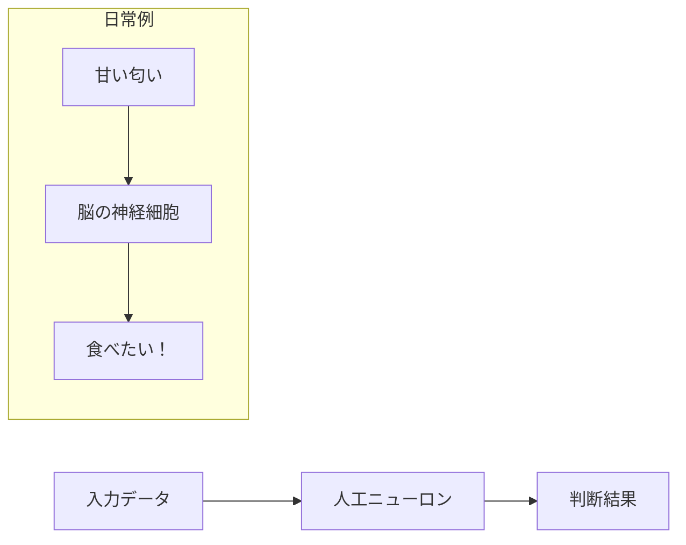

## 🧠 脳の神経細胞との比較

### 人間の脳の神経細胞（ニューロン）
人間の脳には約1000億個の神経細胞があり、それぞれが情報を受け取り、処理し、他の細胞に伝達しています。

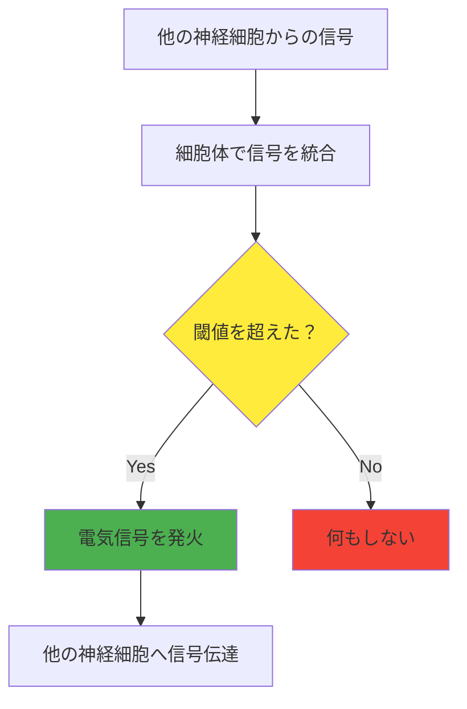

### 人工ニューロンの模倣
コンピューターサイエンティストは、この仕組みを数学的に再現しました：

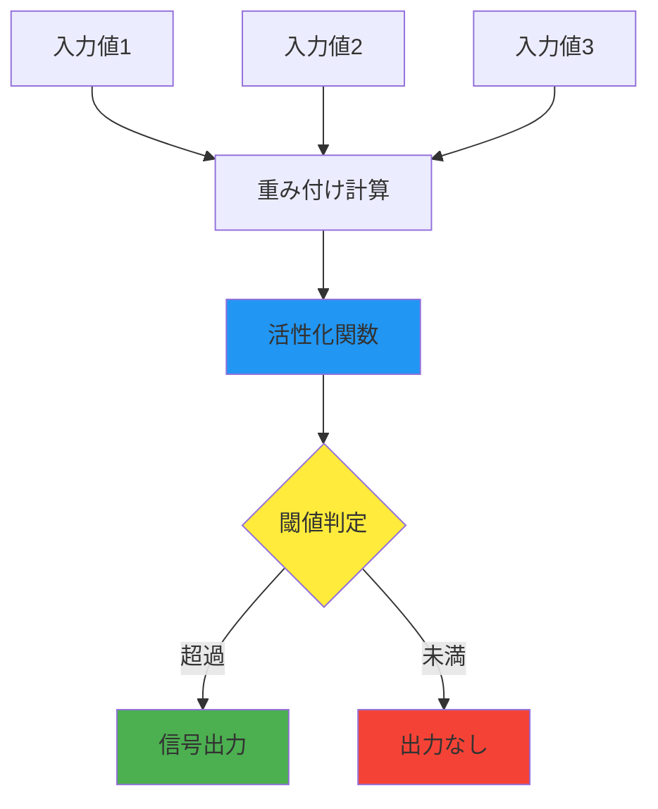

## 🏗️ 人工ニューロンの基本構造

人工ニューロンは、まるで**小さな計算機**のように動作します。

### 構成要素の説明

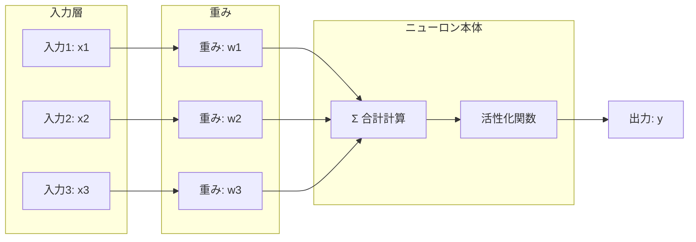

### 各部品の役割

1. **入力（Input）**：外部からのデータ
   - 日常例：「画像の明るさ」「音の大きさ」「温度の数値」

2. **重み（Weight）**：各入力の重要度
   - 日常例：「味の評価で、甘さは重要度8、酸っぱさは重要度3」

3. **合計計算**：重み付きの合計を計算
   - 計算式：入力1×重み1 + 入力2×重み2 + ... 

4. **活性化関数**：最終的な出力を決める
   - 日常例：「合計点が80点以上なら『美味しい』、未満なら『普通』」

## ⚡ 主要技術

### 重み付き合計の計算
人工ニューロンの心臓部は、**重要度を考慮した平均点**を計算することです。

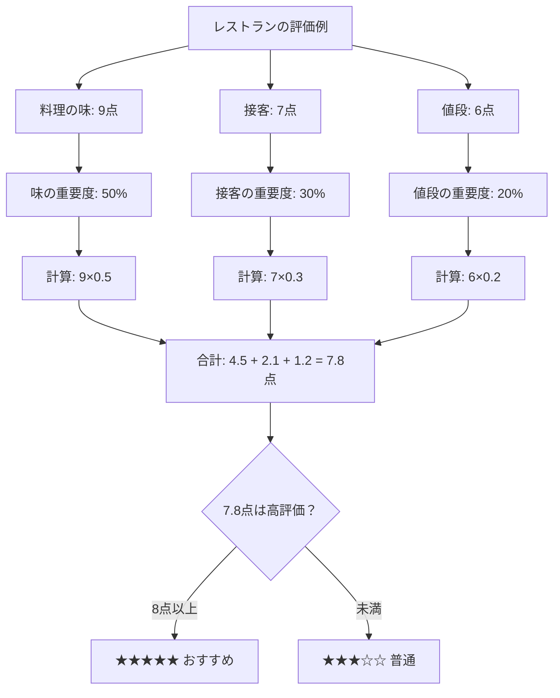

### 活性化関数の種類

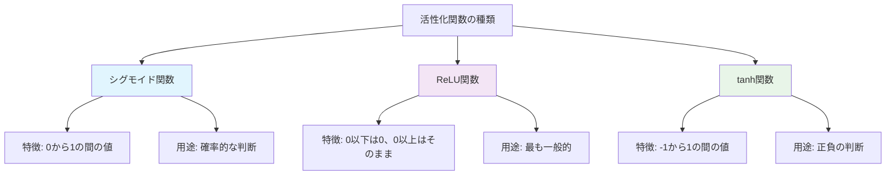

## 📜 時代背景と発見に至った経緯

### 歴史的発展のストーリー

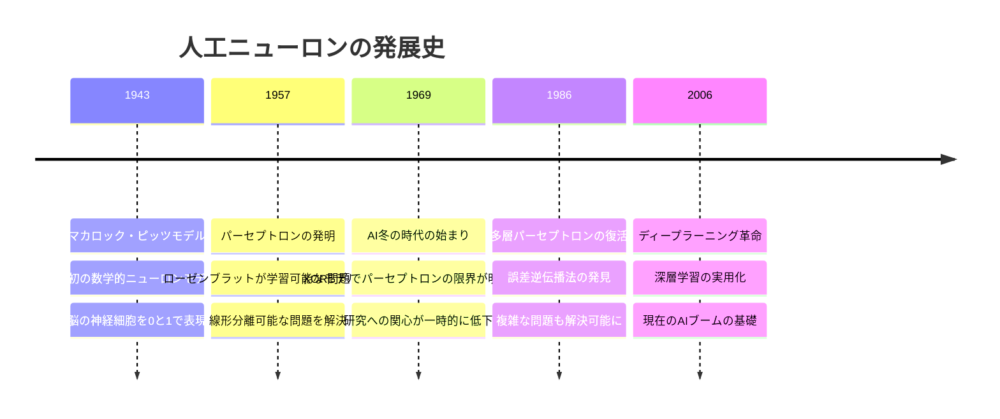

### 発見のきっかけ
1940年代、神経科学者のマカロック医師と数学者のピッツは、「**脳の働きを数学で表現できないか？**」と考えました。

当時の状況：
- コンピューターがまだ実験段階
- 人間の知能の仕組みが謎だらけ  
- 「機械は計算しかできない」という固定観念

彼らの画期的な発見：
> 「神経細胞の『発火する・しない』という単純な反応を、数学の『1・0』で表現できる！」

## 🎨 種類と特徴

### 人工ニューロンの進化系統

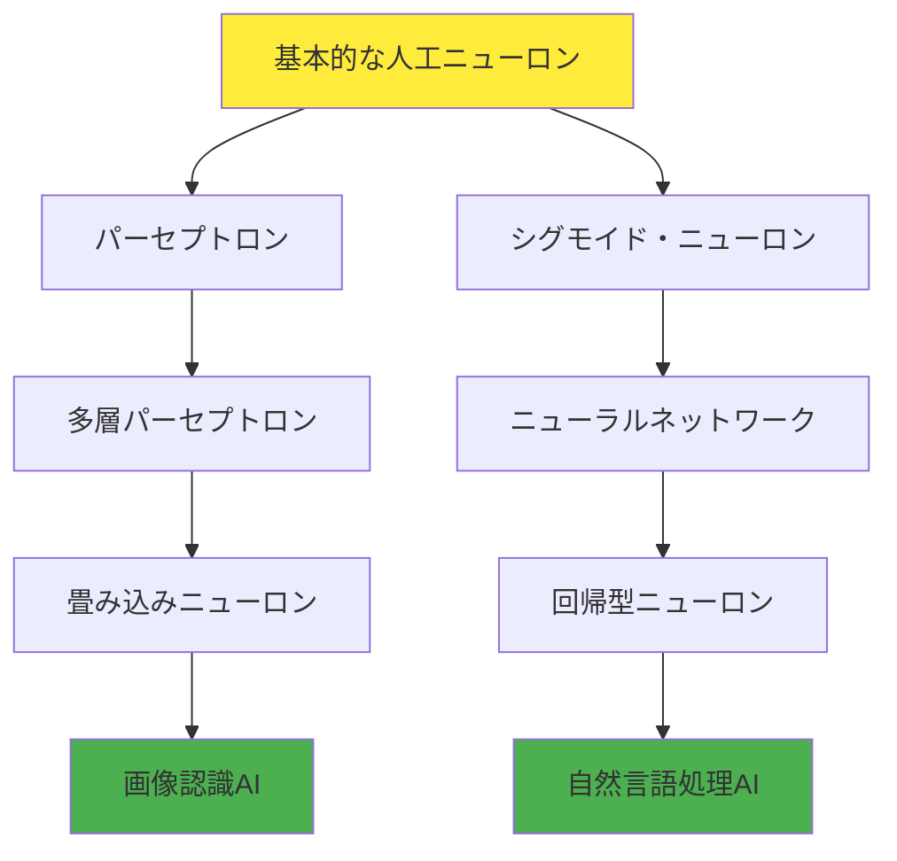

### 特徴比較表

| 種類 | 得意分野 | 特徴 | 日常例 |
|------|----------|------|--------|
| **パーセプトロン** | 二分類問題 | シンプルで高速 | スパムメール判定 |
| **シグモイド・ニューロン** | 確率的判断 | 曖昧な判断が可能 | 病気の診断確率 |
| **畳み込みニューロン** | 画像認識 | 局所的な特徴を検出 | 顔認識、自動運転 |
| **回帰型ニューロン** | 時系列予測 | 過去の情報を記憶 | 株価予測、天気予報 |

## 📗 関連する用語

### 基本用語の関係図

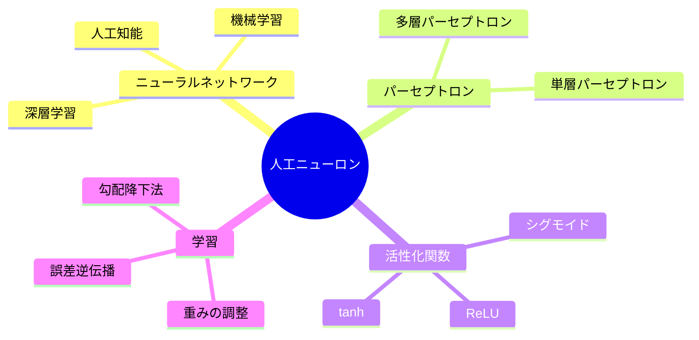

### 用語の詳細説明

**同義語・類義語：**
- 人工ニューロン ≈ パーセプトロン（基本的には同じ概念）
- 活性化関数 ≈ 転移関数（同じ機能）
- 重み ≈ パラメータ（調整される値）

**対義語：**
- 人工ニューロン ⟷ 生物学的ニューロン（本物の神経細胞）
- 学習 ⟷ 推論（学習は訓練段階、推論は実用段階）

**多義語の注意：**
- **ネットワーク**：コンピューターネットワークとニューラルネットワークは別物
- **学習**：人間の学習とマシンラーニングは仕組みが異なる

## 💡 メリットとデメリット

### メリット

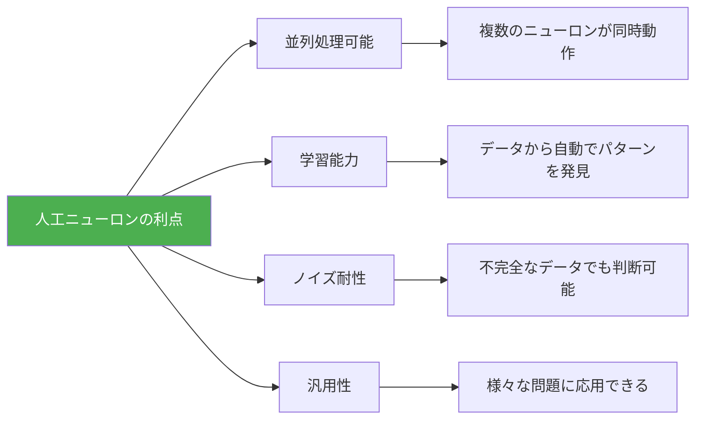

**具体的な利点：**
1. **24時間働ける**：疲れない、ミスが少ない
2. **大量データを処理**：人間では不可能な量の情報を扱える
3. **パターン発見**：人間が気づかない規則性を見つける
4. **一貫性**：感情に左右されない判断

### デメリット

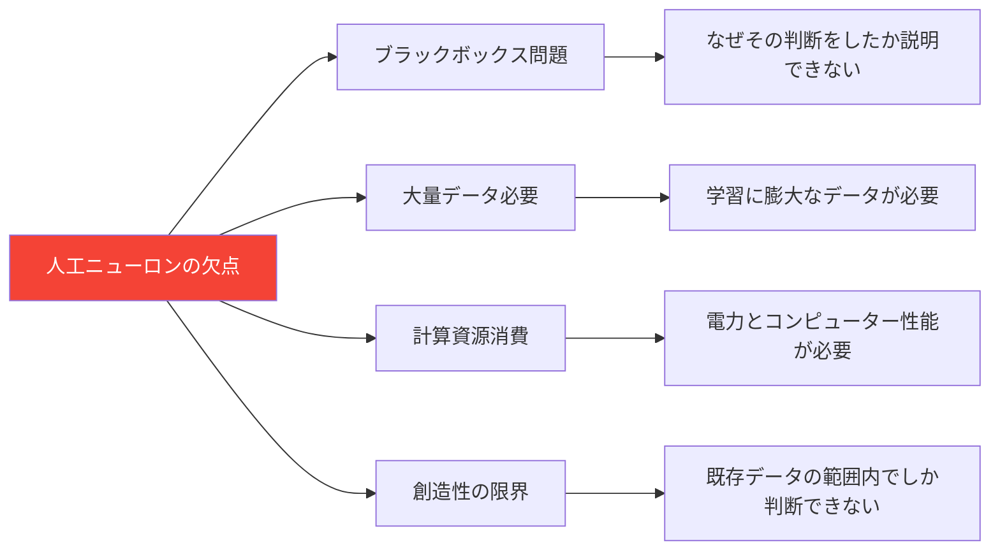

**具体的な問題：**
1. **説明責任**：医療診断で「なぜその診断？」に答えられない
2. **データ依存**：偏ったデータで学習すると偏った結果
3. **環境負荷**：大規模AIの電力消費は小都市並み
4. **雇用への影響**：人間の仕事を代替する可能性

## 🚀 応用と実例

### 身近な実用例

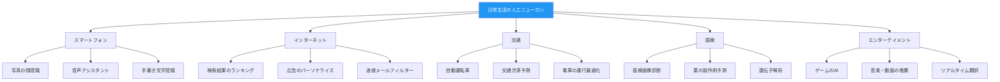

### 産業別影響度

| 産業分野 | 影響度 | 具体例 | 変化の程度 |
|----------|--------|--------|------------|
| **IT・通信** | ★★★★★ | 検索エンジン、SNS | 革命的変化 |
| **金融** | ★★★★☆ | 不正検出、投資判断 | 大幅な効率化 |
| **医療** | ★★★★☆ | 画像診断、創薬 | 診断精度向上 |
| **製造業** | ★★★☆☆ | 品質検査、予知保全 | 自動化推進 |
| **教育** | ★★★☆☆ | 個別学習支援 | 教育方法の変化 |

## 🔄 置換、変遷

### 何を置き換えたか

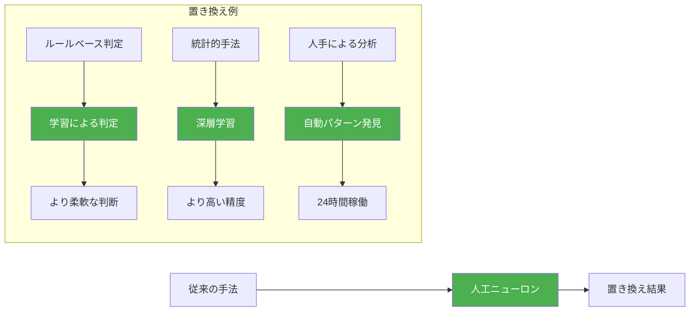

**具体的な置き換え：**
1. **画像認識**：手作りの特徴量 → 自動特徴抽出
2. **翻訳**：辞書ベース → 文脈を理解した翻訳
3. **推薦システム**：単純な類似度 → 複雑な嗜好学習

### 何に置き換えられる可能性があるか

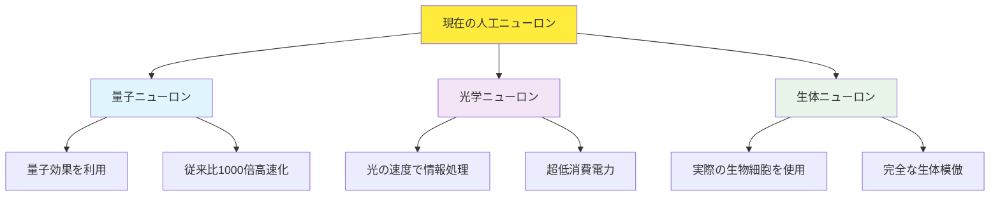

## ⚖️ 代替、競合

### 競合技術との比較

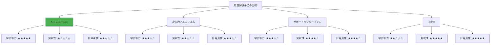

### 使い分けの指針

**人工ニューロンが最適な場面：**
- 大量のデータがある
- パターンが複雑
- 高い精度が必要
- 解釈性は重要でない

**他の手法が良い場面：**
- **決定木**：説明が必要な医療診断
- **遺伝的アルゴリズム**：最適化問題
- **サポートベクターマシン**：データが少ない場合

## 🌍 実世界への影響とその後の発展

### 社会への影響

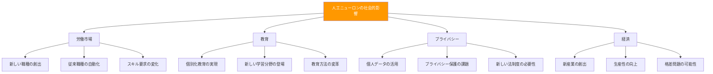

### 未来の発展予測

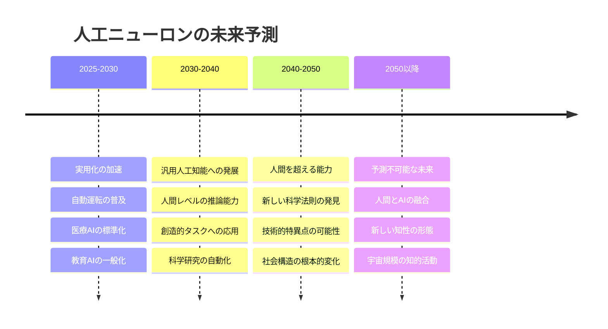

### 期待される革命的変化

**短期的影響（5-10年）：**
1. **医療**：早期診断で死亡率大幅減少
2. **教育**：個人に最適化された学習体験
3. **交通**：交通事故の劇的な減少

**長期的影響（10-30年）：**
1. **科学研究**：新薬開発期間を10分の1に短縮
2. **エネルギー**：再生可能エネルギーの効率化
3. **宇宙開発**：AI主導の宇宙探査

**課題と対策：**
- **倫理的AI**：人間の価値観を反映したAI開発
- **説明可能AI**：判断理由を説明できるシステム
- **包摂的AI**：すべての人が恩恵を受けられる社会設計

---

## 🎯 学習の次のステップ

この概要資料を読み終えた方は、以下の順序で学習を深めることをおすすめします：

1. **基礎数学**：線形代数、微分積分の復習
2. **プログラミング実践**：Python でニューロンを実装してみる
3. **深層学習**：多層ニューロンネットワークの理解
4. **応用分野**：興味のある分野（画像認識、自然言語処理など）への特化

人工ニューロンは、現代AIの基礎中の基礎です。この小さな「電子の神経細胞」が、私たちの世界を大きく変えている事実を理解していただけたでしょうか？

---

この資料は、初学者が人工ニューロンを体系的に理解し、さらなる学習への動機を得られるよう設計されています。
