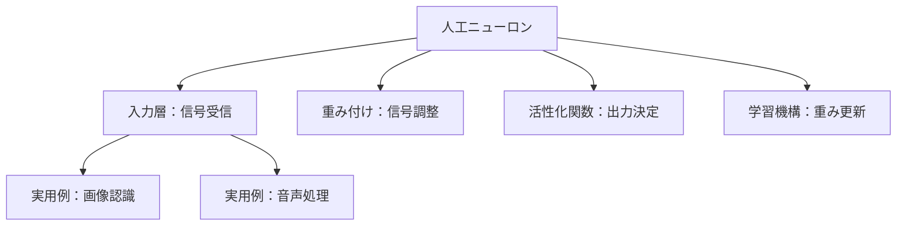
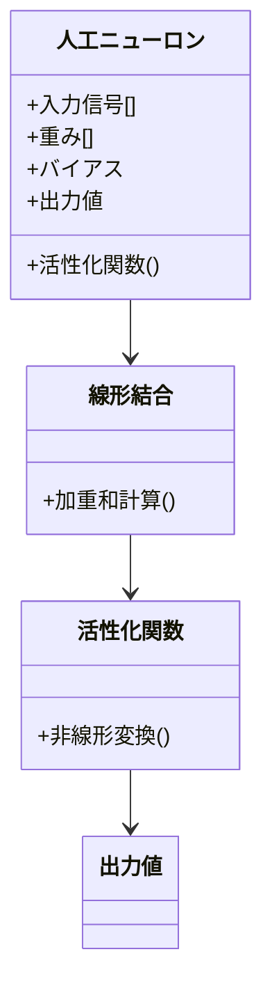
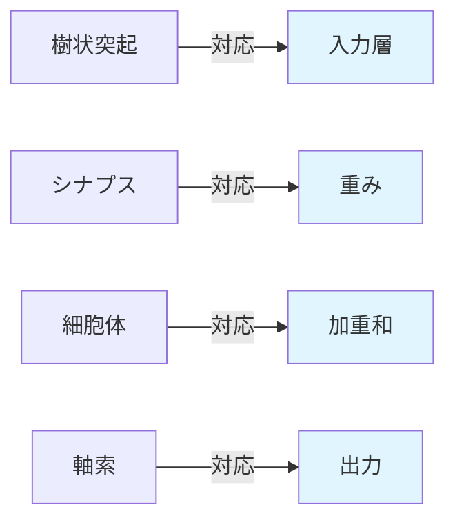
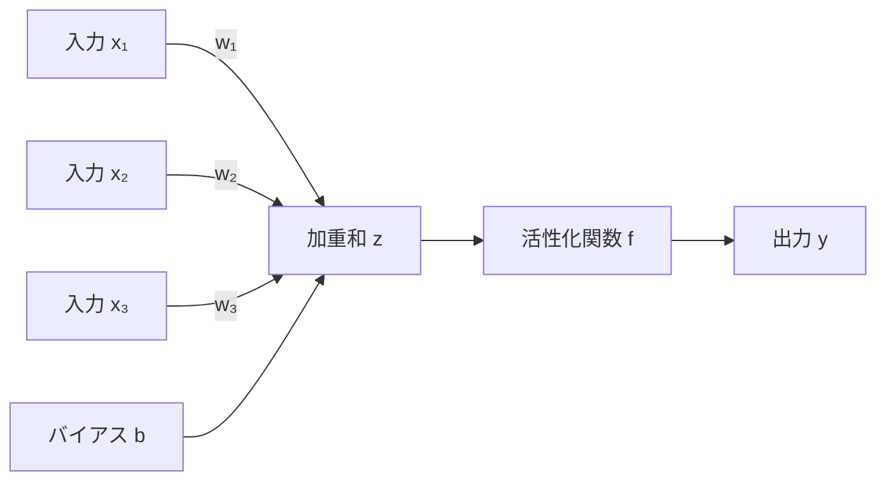
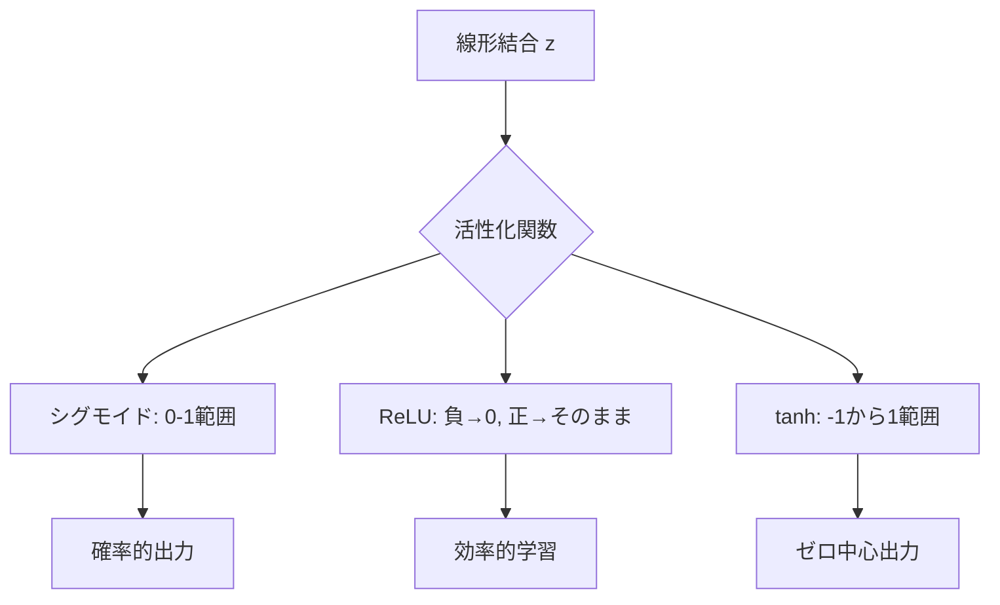
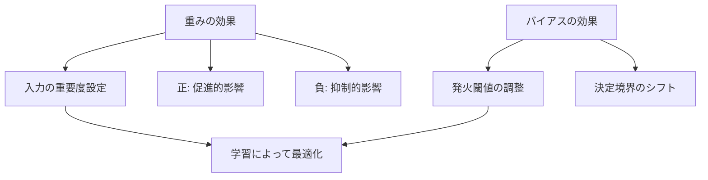
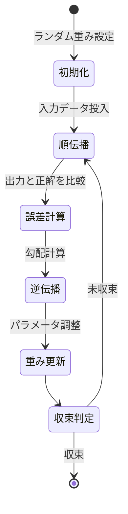

# 人工ニューロン: 段階的理解ガイド

> **学習目標**: 人工ニューロンの基本構造・動作原理・実用性を理解し、生物学的ニューロンとの対応関係を説明できる
> **推奨学習時間**: 2-3時間
> **前提知識**: 基本的な数学（加算・乗算）の理解

---

## 1. 全体マップ

人工ニューロン（Artificial Neuron）は、人間の脳神経細胞の働きを数学的にモデル化した計算単位です。1943年にMcCullochとPittsによって提案され、現代の深層学習の基礎となっています。

**学習範囲**:
- ✅ 含む：基本構造、数学的表現、活性化関数、学習の仕組み
- ❌ 含まない：ニューラルネットワーク全体の設計、最適化アルゴリズムの詳細

**主要サブトピック**:
1. 生物学的ニューロンとの対応
2. 人工ニューロンの数学的構造
3. 活性化関数の役割
4. 重みとバイアスの意味
5. 学習プロセスの基礎



---

## 2. ガイド質問

### 基礎理解レベル（★☆☆）
1. 人工ニューロンは生物学的ニューロンのどの部分を模倣していますか？
2. 入力信号が複数ある場合、人工ニューロンはどのように処理しますか？
3. 「重み」とは何を表すパラメータですか？

### 応用理解レベル（★★☆）
4. 活性化関数が無い場合、何が問題になりますか？
5. バイアス項はなぜ必要ですか？
6. 1つの人工ニューロンで解決できる問題と解決できない問題の違いは？

### 統合レベル（★★★）
7. 複数の人工ニューロンを組み合わせることで、どのような能力が生まれますか？
8. 人工ニューロンの「学習」とは数学的にどのようなプロセスですか？


---

## 3. 核心概念

### 重要用語と定義

**人工ニューロン**：複数の入力を受け取り、重み付けして合計し、活性化関数を通して出力を生成する計算単位。

**重み（Weight）**：各入力信号の重要度を表す数値パラメータ。大きい重みは強い影響を意味する。

**バイアス（Bias）**：入力に依存しない調整項。ニューロンの発火しやすさを制御する。

**活性化関数（Activation Function）**：加重和を非線形変換する関数。シグモイド、ReLU、tanhなどがある。

**線形結合**：入力と重みの積の総和（x₁w₁ + x₂w₂ + ... + xₙwₙ + b）。

**非線形性**：活性化関数が導入する性質。複雑なパターン認識を可能にする。

**学習**：訓練データに基づいて重みとバイアスを調整するプロセス。

### 記憶補助（ニーモニック）
**WBS** = **W**eights（重み）+ **B**ias（バイアス）+ **S**ignal（信号）→ 人工ニューロンの3要素



---

## 4. 段階的詳細展開

### 4.1 生物学的ニューロンとの対応

**層1: 導入**
人工ニューロンは、人間の脳にある生物学的ニューロンの基本動作を単純化した数学モデルです。生物学的ニューロンは樹状突起で信号を受け取り、細胞体で処理し、軸索を通じて次のニューロンへ伝達します。

**層2: 展開**
生物学的対応関係：
- **樹状突起** → 人工ニューロンの入力（x₁, x₂, ..., xₙ）
- **シナプス結合強度** → 重み（w₁, w₂, ..., wₙ）
- **細胞体の統合機能** → 加重和の計算
- **発火閾値** → バイアスと活性化関数
- **軸索の信号伝達** → 出力値

重要な相違点：生物学的ニューロンは電気化学的信号を扱い、時間的な動態を持ちますが、基本的な人工ニューロンはこれらを単純化し、瞬時の数値計算として表現します。

**層3: 要約**
人工ニューロンは生物学的ニューロンの「情報統合→閾値判定→出力」という基本機能を数学的に再現したものです。この対応関係が、脳の計算原理を工学的に応用する基盤となります。



---

### 4.2 人工ニューロンの数学的構造

**層1: 導入**
人工ニューロンの動作は2段階の数学的計算で表現されます：線形結合の計算と活性化関数の適用です。

**層2: 展開**
基本式：
```
z = w₁x₁ + w₂x₂ + ... + wₙxₙ + b （線形結合）
y = f(z) （活性化関数の適用）
```

**具体例**：2つの入力を持つニューロン
- 入力：x₁ = 0.5、x₂ = 0.8
- 重み：w₁ = 0.3、w₂ = 0.7
- バイアス：b = -0.2

計算：
```
z = (0.3 × 0.5) + (0.7 × 0.8) + (-0.2)
z = 0.15 + 0.56 - 0.2 = 0.51
```

この構造により、ニューロンは各入力の重要度に応じて異なる反応を示します。重みが大きい入力ほど出力に強く影響します。

**層3: 要約**
線形結合によって複数の情報源を統合し、活性化関数によって出力の性質を制御する2段階構造が、人工ニューロンの計算の核心です。



---

### 4.3 活性化関数の役割

**層1: 導入**
活性化関数は線形結合の結果を非線形変換する関数で、ニューロンに複雑なパターン認識能力を与えます。

**層2: 展開**
主要な活性化関数：

1. **シグモイド関数**：f(z) = 1/(1+e⁻ᶻ)
   - 出力範囲：0〜1
   - 用途：確率的な出力、二値分類
   - 特徴：滑らかな曲線、勾配消失問題あり

2. **ReLU（Rectified Linear Unit）**：f(z) = max(0, z)
   - 出力範囲：0〜∞
   - 用途：現代の深層学習で最も一般的
   - 特徴：計算が高速、負の値をゼロに

3. **tanh（双曲線正接）**：f(z) = (eᶻ - e⁻ᶻ)/(eᶻ + e⁻ᶻ)
   - 出力範囲：-1〜1
   - 用途：ゼロ中心の出力が必要な場合
   - 特徴：シグモイドより勾配が大きい

**なぜ非線形性が必要か**：活性化関数が無い（または線形）場合、複数のニューロンを重ねても単一の線形変換と等価になり、XOR問題のような非線形問題が解けません。

**層3: 要約**
活性化関数の非線形性が、人工ニューロンの表現力を劇的に向上させ、複雑な現実世界の問題への対応を可能にします。



---

### 4.4 重みとバイアスの意味

**層1: 導入**
重みとバイアスは人工ニューロンの学習可能なパラメータで、ニューロンの動作特性を決定します。

**層2: 展開**
**重みの役割**：
- 各入力の「重要度」または「影響力」を表現
- 正の重み：入力が大きいほど出力を増加
- 負の重み：入力が大きいほど出力を減少
- ゼロに近い重み：その入力を無視

**実世界の例**：住宅価格予測ニューロン
- 面積の重み：w₁ = +0.8（大きな影響）
- 築年数の重み：w₂ = -0.3（古いほど価格↓）
- 駅距離の重み：w₃ = -0.2（遠いほど価格↓）

**バイアスの役割**：
- ニューロンの「発火しやすさ」を調整
- 正のバイアス：出力を増加させる傾向
- 負のバイアス：出力を抑制する傾向
- 入力がすべてゼロでも出力を持てる

**幾何学的解釈**：重みとバイアスは決定境界（直線や超平面）の位置と傾きを定義します。

**層3: 要約**
重みは入力の重要性、バイアスは全体的な調整を担い、これらの学習によってニューロンは適切な入出力関係を獲得します。



---

### 4.5 学習プロセスの基礎

**層1: 導入**
人工ニューロンの「学習」とは、訓練データを用いて重みとバイアスを調整し、望ましい入出力関係を実現するプロセスです。

**層2: 展開**
基本的な学習ステップ：

1. **初期化**：重みとバイアスにランダムな小さい値を設定

2. **順伝播**：入力を与えてニューロンの出力を計算
   ```
   z = Σ(wᵢxᵢ) + b
   y = f(z)
   ```

3. **誤差計算**：実際の出力と正解の差を測定
   ```
   誤差 = (正解値 - 実際の出力値)²
   ```

4. **逆伝播**：誤差を減らす方向に重みを更新
   ```
   新しい重み = 古い重み - 学習率 × 誤差勾配
   ```

5. **反復**：すべての訓練データで2-4を繰り返す

**具体例**：AND論理ゲートの学習
- 訓練データ：(0,0)→0、(0,1)→0、(1,0)→0、(1,1)→1
- 初期重み：w₁=0.1、w₂=0.1、b=-0.1
- 誤差が小さくなるまで更新を繰り返す
- 最終的に：w₁≈0.5、w₂≈0.5、b≈-0.7

**一般的な誤解**：学習は「知識の蓄積」ではなく「パラメータの最適化」です。

**層3: 要約**
学習は誤差を最小化する方向への反復的なパラメータ調整であり、この仕組みによって人工ニューロンは経験から適応的に改善します。



---

## 5. 統合・実践

### ガイド質問への模範回答

**Q1**: 人工ニューロンは樹状突起（入力）、シナプス結合（重み）、細胞体（加重和）、発火機構（活性化関数）、軸索（出力）を模倣しています。

**Q2**: 各入力に重みを掛けて合計し（線形結合）、バイアスを加えた後、活性化関数を適用して単一の出力を生成します。

**Q4**: 活性化関数が無いと、複数層のニューロンも単一の線形変換と等価になり、非線形問題（XOR等）が解けません。

**Q5**: バイアスは入力に依存せずニューロンの発火しやすさを調整し、決定境界を柔軟に配置できるようにします。

**Q7**: 複数ニューロンの組み合わせにより、階層的特徴抽出、非線形決定境界の形成、複雑なパターン認識が可能になります。

### 応用問題

**問題1**：入力x₁=1、x₂=0、重みw₁=0.6、w₂=0.4、バイアスb=-0.3のニューロンがあります。ReLU活性化関数を使用する場合の出力は？

**解答**：
```
z = (0.6×1) + (0.4×0) + (-0.3) = 0.3
y = ReLU(0.3) = max(0, 0.3) = 0.3
```

**問題2**：単一の人工ニューロンで実現できる論理演算と実現できない論理演算を1つずつ挙げ、理由を説明してください。

**解答**：
- 実現可能：AND、OR（線形分離可能）
- 実現不可能：XOR（線形分離不可能、非線形決定境界が必要）

### 自己評価チェックリスト

- [ ] 人工ニューロンの5つの構成要素を説明できる
- [ ] 線形結合の計算を手計算で実行できる
- [ ] 3種類以上の活性化関数の特徴を述べられる
- [ ] 重みとバイアスの役割の違いを説明できる
- [ ] 学習の基本ステップを順序立てて説明できる
- [ ] 単一ニューロンの限界を理解している

```mermaid
gantt
    title 推奨学習計画
    dateFormat HH:mm
    axisFormat %H:%M
    
    section 第1セッション
    全体マップ理解 :a1, 00:00, 20m
    核心概念暗記 :a2, after a1, 25m
    
    section 第2セッション
    数学的構造学習 :b1, 00:45, 30m
    活性化関数理解 :b2, after b1, 25m
    
    section 第3セッション
    学習プロセス理解 :c1, 01:40, 30m
    演習問題実施 :c2, after c1, 30m
```



---

## 学習の次のステップ

**推奨される発展トピック**：
1. **パーセプトロン**：最も単純なニューロンモデルの歴史的実装
2. **多層パーセプトロン**：複数ニューロンの層構造
3. **誤差逆伝播法**：効率的な学習アルゴリズムの詳細
4. **畳み込みニューロン**：画像処理に特化した構造
5. **回帰型ニューロン**：時系列データ処理への拡張

**推奨リソース**：
- 実装練習：NumPyで人工ニューロンを実装
- 可視化：TensorFlow Playgroundで動作を視覚的に理解
- 理論深化：線形代数と微積分の復習
