人工知能に関連する、情報科学について。AIを設計・実装するための理論的基盤と、データ処理、アルゴリズム開発といった工学的枠組みを提供する。

# 情報科学 - AIを支える魔法の数学と設計図

## 🔍 一言要約
**コンピュータで「考える仕組み」を作るための、設計図と道具箱の学問**

---

## 📚 目次
1. [🌟 はじめに - なぜ情報科学が重要なのか](#-はじめに---なぜ情報科学が重要なのか)
2. [🏗️ 情報科学の全体像](#️-情報科学の全体像)
3. [⚡ 3つの柱 - 理論・データ・アルゴリズム](#-3つの柱---理論データアルゴリズム)
4. [📜 誕生の物語 - 計算する夢から始まった](#-誕生の物語---計算する夢から始まった)
5. [🎨 情報科学の種類と特徴](#-情報科学の種類と特徴)
6. [📗 関連する用語 - 似た言葉を整理しよう](#-関連する用語---似た言葉を整理しよう)
7. [💡 メリットとデメリット](#-メリットとデメリット)
8. [🚀 応用と実例 - 日常生活での活躍](#-応用と実例---日常生活での活躍)
9. [🔄 置換と変遷 - 何から生まれ、何を生んだか](#-置換と変遷---何から生まれ何を生んだか)
10. [⚔️ 代替と競合 - 似た分野との関係](#️-代替と競合---似た分野との関係)
11. [🌍 実世界への影響とその後の発展](#-実世界への影響とその後の発展)

---

## 🌟 はじめに - なぜ情報科学が重要なのか

想像してください。あなたがレゴブロックで「自動的にパズルを解くロボット」を作りたいとします。

- **どんな部品が必要？**（データ構造）
- **どんな手順で組み立てる？**（アルゴリズム）
- **そもそも、そのロボットは本当にパズルを解けるのか証明できる？**（計算理論）

この3つの疑問に答えるのが**情報科学**です。

特にAI（人工知能）の時代では、「機械に知的な振る舞いをさせる」ために、情報科学は**建築における設計図**のような役割を果たします。設計図がなければ、どんなに良い素材があっても家は建ちません。同じように、情報科学がなければ、AIは「賢いふり」すらできないのです。

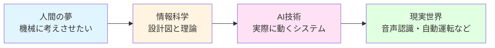

---

## 🏗️ 情報科学の全体像

情報科学は**3階建ての家**のようなものです。

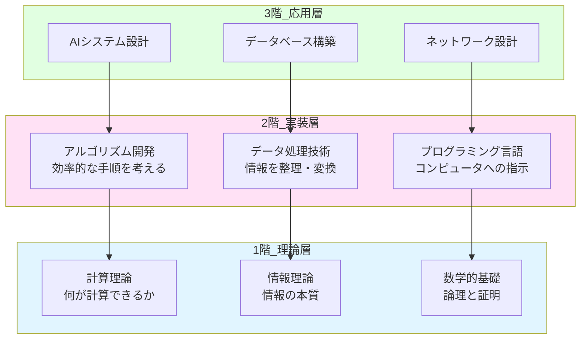

**各階の役割：**
- **1階（理論層）**: 「そもそも可能なのか？」を数学で証明
- **2階（実装層）**: 「どうやって実現するか？」を技術で構築
- **3階（応用層）**: 「何に使えるか？」を実世界で展開

---

## ⚡ 3つの柱 - 理論・データ・アルゴリズム

情報科学を支える3本の柱を、料理に例えて理解しましょう。

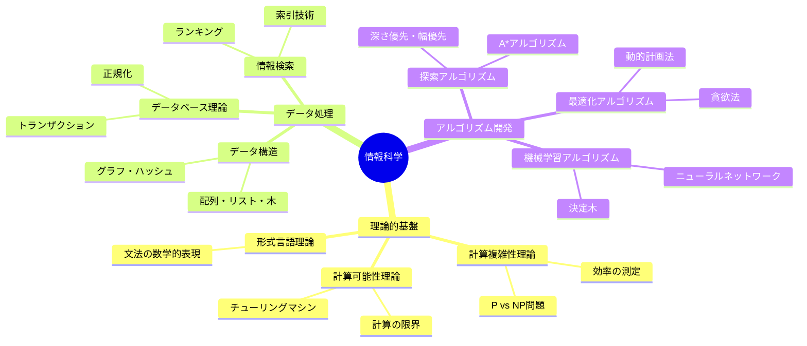

### 🔹 1. 理論的基盤（レシピの原理）

**料理における「なぜ熱を加えると固まるのか？」という科学**

- **計算可能性理論**: 「この料理は本当に作れるのか？」
  - 例：「完璧なAI」は作れるか？ → 実は数学的に不可能な問題もある
  
- **計算複雑性理論**: 「この料理にどれくらい時間がかかる？」
  - 例：1000万人分のデータから最適解を探すのに、宇宙の年齢より長い時間がかかる問題もある

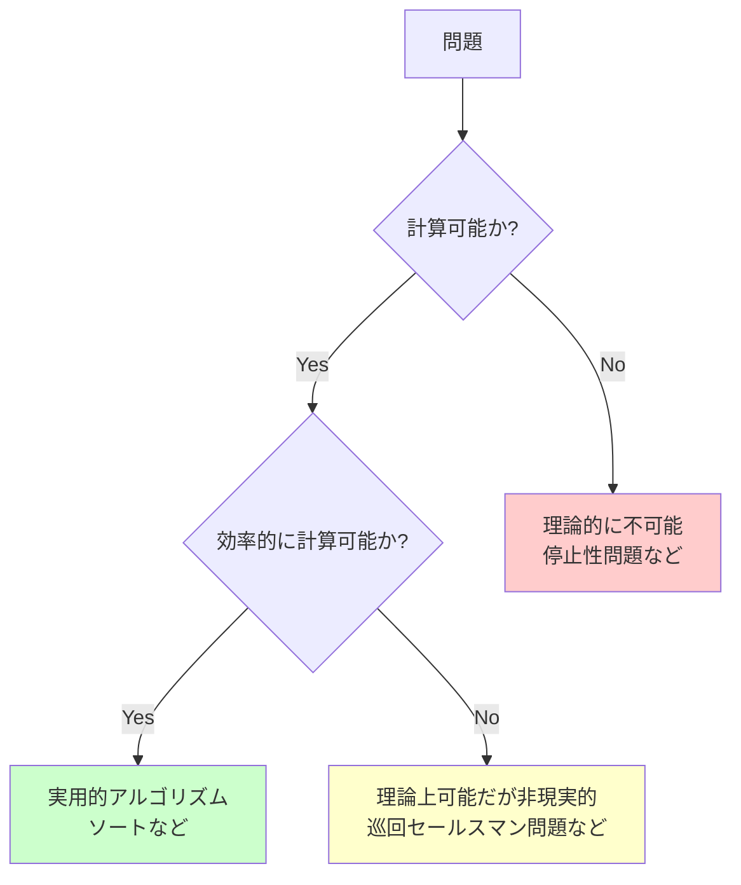

### 🔹 2. データ処理（食材の準備）

**料理における「野菜の切り方」「保存方法」**

- **データ構造**: 情報の整理方法
  - 配列：本棚に本を順番に並べる
  - 木構造：家系図のような階層
  - グラフ：駅と路線の関係図

- **データベース理論**: 大量の情報を効率的に保存・検索
  - 例：Googleが数秒で数十億のページから検索できる仕組み

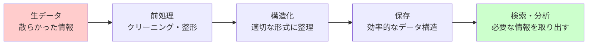

### 🔹 3. アルゴリズム開発（調理手順）

**料理における「レシピの手順」**

- **探索アルゴリズム**: 迷路から出口を見つける方法
- **最適化アルゴリズム**: 最短ルートを見つける方法
- **機械学習アルゴリズム**: 経験から学ぶ方法

**具体例：地図アプリのルート検索**

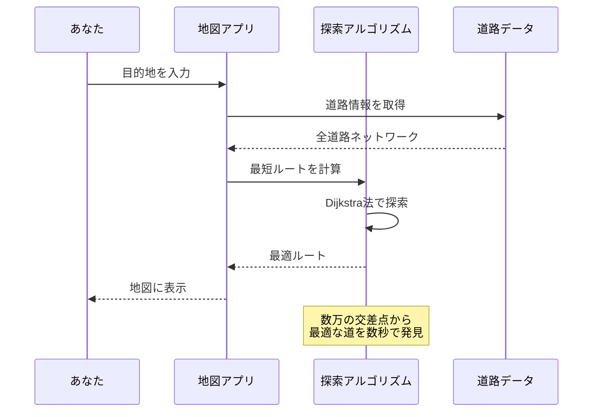

---

## 📜 誕生の物語 - 計算する夢から始まった

### 🕰️ タイムライン

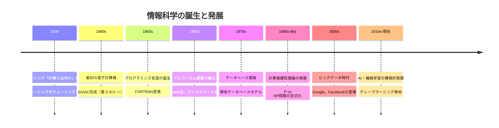

### 📖 ストーリー：なぜ情報科学が生まれたのか

**第1章：計算する機械の夢**

1930年代、数学者たちは悩んでいました。
「そもそも『計算』とは何だろう？」「機械で計算できることの限界はあるのか？」

そこに現れたのが**アラン・チューリング**という若き天才です。彼は1936年、紙の上に想像上の機械「チューリングマシン」を描きました。これは、テープに書かれた記号を読み書きするだけの、とてもシンプルな機械です。

しかし驚くべきことに、この単純な機械で**あらゆる計算が表現できる**ことを証明したのです！これが情報科学の誕生瞬間でした。

**第2章：戦争が加速させた技術**

第二次世界大戦中、暗号解読や弾道計算のため、実際の電子計算機が作られました。戦争という悲劇が、皮肉にも計算機科学を急速に発展させたのです。

**第3章：理論から実践へ**

1950年代以降、「どうやって効率的に計算するか？」という実践的な問いが生まれました。ここから**アルゴリズム**という概念が花開きます。

- **1950年代**: Dijkstra（ダイクストラ）が最短経路を見つける方法を考案
- **1960年代**: Hoare（ホーア）がクイックソートを発明
- **1970年代**: データベース理論が確立され、大量データを扱えるように

**第4章：AIとの融合**

2000年代以降、インターネットで爆発的に増えたデータと、計算機の性能向上により、情報科学は**AI研究の中心的基盤**となりました。

---

## 🎨 情報科学の種類と特徴

情報科学は、目的や対象によって様々な分野に分かれています。

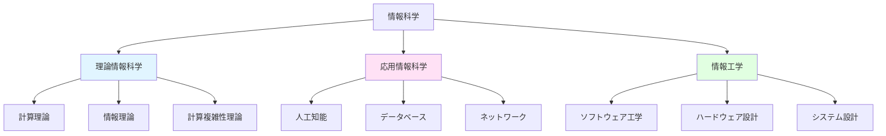

### 📊 分野別比較表

| 分野 | 主な問い | 具体例 | AI開発での役割 |
|------|----------|--------|----------------|
| **計算理論** | 何が計算可能か？ | チューリングマシン、停止性問題 | AIの理論的限界を明確にする |
| **アルゴリズム論** | どうやって効率的に？ | ソート、探索、最適化 | 学習アルゴリズムの基礎 |
| **データ構造** | どう整理する？ | 配列、木、グラフ | ニューラルネットワークの実装 |
| **機械学習理論** | どう学習させる？ | 統計的学習理論、最適化理論 | AI性能の保証と改善 |
| **情報理論** | 情報量はどう測る？ | エントロピー、圧縮 | データの効率的表現 |

---

## 📗 関連する用語 - 似た言葉を整理しよう

### 🔤 同義語・類義語

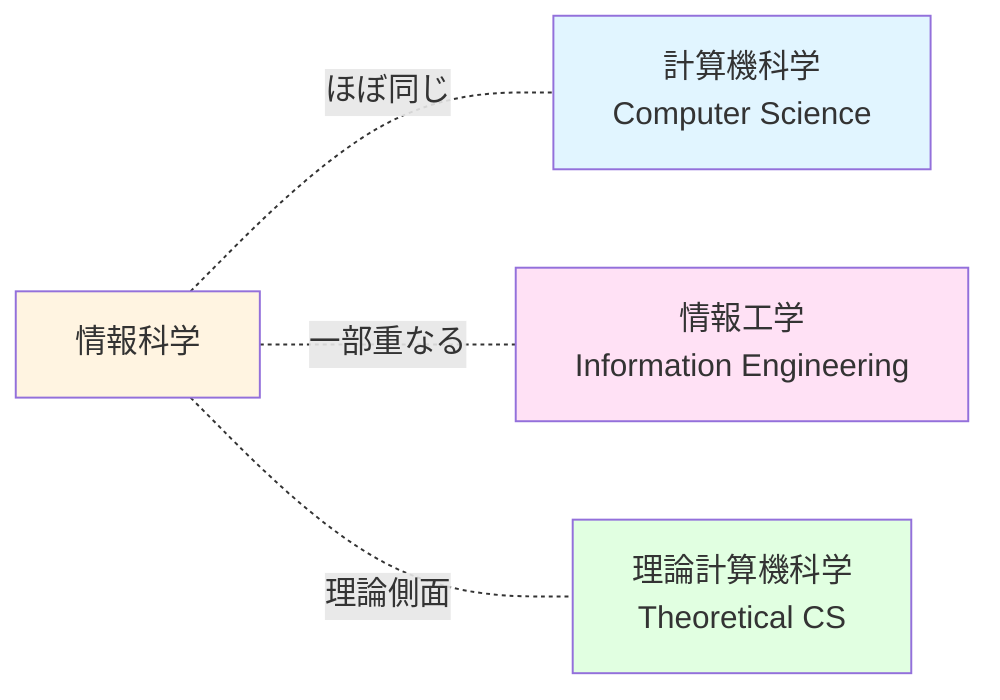

| 用語 | 意味 | 違いのニュアンス |
|------|------|------------------|
| **情報科学** | 情報処理の理論と実践 | 最も広い概念 |
| **計算機科学** | コンピュータによる計算の科学 | ほぼ同義（英語のComputer Scienceの訳） |
| **情報工学** | 情報技術の工学的応用 | より実装・応用寄り |
| **コンピュータサイエンス** | 英語での正式名称 | グローバルスタンダードな表現 |

### 🔄 対義語・補完的概念

| 情報科学 | ⇔ | 対比される概念 | 関係性 |
|----------|---|----------------|--------|
| **理論** | ⇔ | **実践（エンジニアリング）** | 理論が実践の基礎を提供 |
| **アルゴリズム** | ⇔ | **ヒューリスティック** | 厳密な手順 vs 経験則 |
| **決定的計算** | ⇔ | **確率的計算** | 必ず同じ結果 vs ランダム性を含む |

### 📖 多義語の整理

**「アルゴリズム」という言葉の多面性**

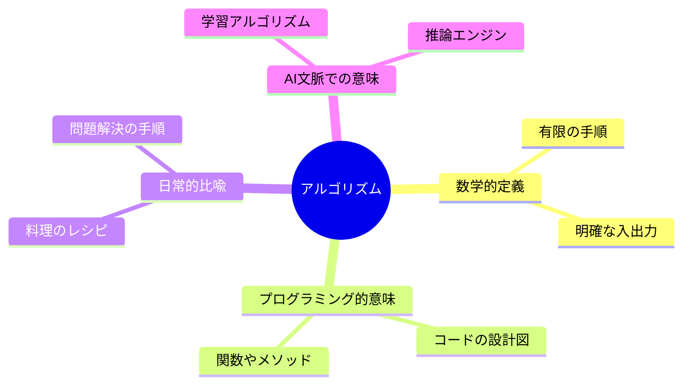

---

## 💡 メリットとデメリット

### ✅ メリット

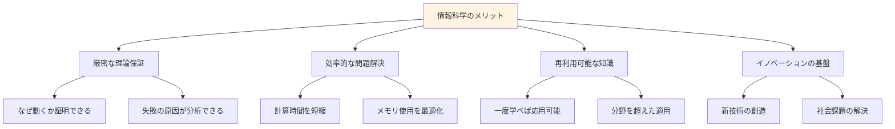

1. **普遍的な知識体系**
   - 一度学べば、あらゆるプログラミング言語・技術に応用できる
   - 例：ソートアルゴリズムの原理は、Python でもJavaでも同じ

2. **効率性の保証**
   - 「なんとなく動く」ではなく、「なぜ速いのか」を数学的に証明
   - 例：Googleの検索が速い理由を理論的に説明できる

3. **限界の明確化**
   - 「できないこと」を明確にすることで、無駄な努力を避けられる
   - 例：「完璧なスパムフィルタ」が理論的に不可能な理由が分かる

4. **イノベーションの源泉**
   - 新しいアルゴリズムの発見が、産業を変革
   - 例：ディープラーニングの数学的基礎理論

### ❌ デメリット

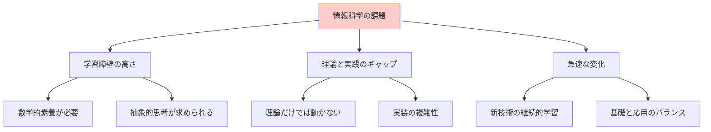

1. **高い学習難易度**
   - 数学（特に離散数学、線形代数、統計）の知識が必須
   - 抽象的な概念を理解する忍耐力が必要

2. **理論と実装の乖離**
   - 理論上は美しいアルゴリズムも、実装では複雑になることがある
   - 例：理論計算量はO(n log n)でも、実際は定数項が大きく遅い場合もある

3. **急速な進化**
   - 新しい技術が次々と登場し、継続的な学習が必要
   - 例：10年前の「最先端」が今では古典的技術に

4. **応用への翻訳作業**
   - 理論を実世界の問題に適用するには、創造的な思考が必要
   - すぐに「使える」形にはなっていない

---

## 🚀 応用と実例 - 日常生活での活躍

情報科学は、私たちの生活のあらゆる場面で活躍しています。

### 🎯 身近な応用例

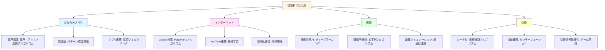

### 🔬 詳細解説：Google検索を支える情報科学

**問題**: 数十億のWebページから、あなたの質問に最も関連するページを0.5秒で見つける

**情報科学の解決策**:

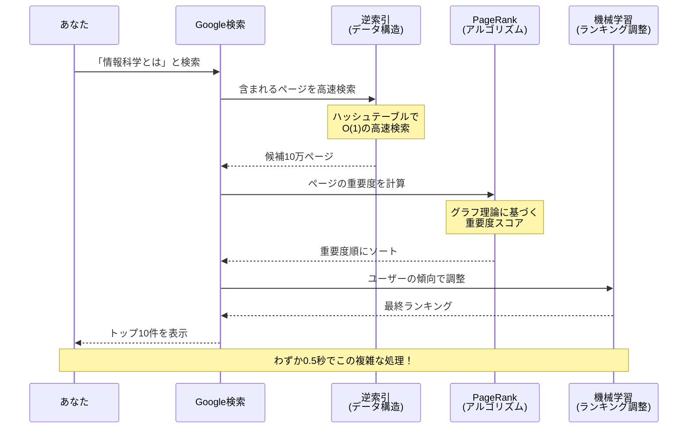

**使われている情報科学の技術**:
1. **データ構造**: 逆索引（単語からページへの高速マップ）
2. **グラフ理論**: PageRankアルゴリズム（Webページの重要度計算）
3. **機械学習**: ユーザーの検索傾向を学習してランキング調整
4. **並列処理**: 数千台のサーバーで同時計算

---

## 🔄 置換と変遷 - 何から生まれ、何を生んだか

### 📉 何を置き換えたか

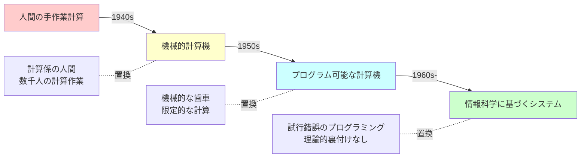

**具体例**:
- **1940年代以前**: 弾道計算は人間の「計算係」が手作業で実施（数日かかる）
- **1940年代**: ENIACなど初期計算機の登場（数時間に短縮）
- **1950年代以降**: アルゴリズム理論に基づく効率的プログラム（数分に短縮）
- **現在**: 情報科学の理論に基づくAIが瞬時に計算・予測

### 📈 何に置き換えられつつあるか

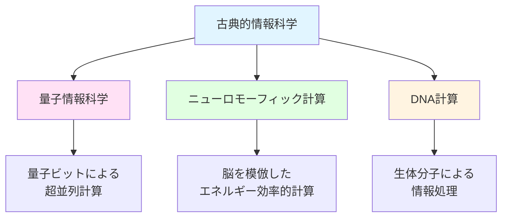

**未来の計算パラダイム**:
- **量子コンピュータ**: ある種の問題で古典計算を圧倒的に上回る可能性
- **ニューロモーフィックチップ**: 脳の神経回路を模倣した省エネ計算
- しかし、**古典的情報科学の理論は依然として基盤**として残る

### 🌱 何を継承し、何に継承されたか

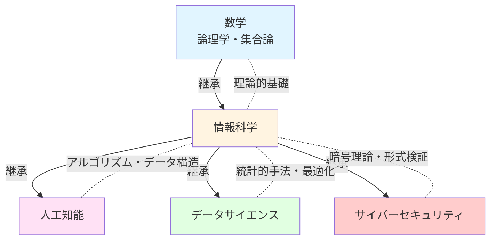

**継承の系譜**:
1. **数学から継承**: 論理、集合論、グラフ理論、確率論
2. **情報科学が生んだ子孫たち**:
   - AI: 学習理論、探索アルゴリズム
   - データサイエンス: 統計的推定、可視化理論
   - サイバーセキュリティ: 暗号理論、形式検証

---

## ⚔️ 代替と競合 - 似た分野との関係

### 🔀 代替可能性

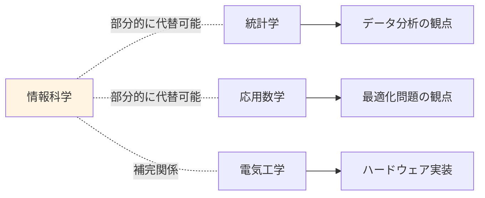

| 分野 | 情報科学との関係 | 代替可能範囲 | 不可能な領域 |
|------|------------------|-------------|-------------|
| **統計学** | データ分析で重複 | 統計的推定、仮説検証 | アルゴリズム設計、計算複雑性 |
| **応用数学** | 最適化問題で重複 | 数値計算、最適化理論 | データ構造、プログラミング理論 |
| **電気工学** | ハードウェアで補完 | 回路設計、信号処理 | ソフトウェアアルゴリズム、理論計算 |
| **認知科学** | AI分野で交差 | 人間の思考モデル化 | 計算効率、実装技術 |

### ⚡ 競合する分野

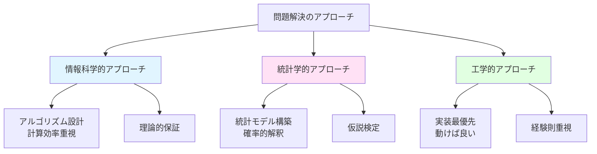

**競合の具体例：機械学習の文脈で**

| アプローチ | 重視する点 | 強み | 弱み |
|-----------|-----------|------|------|
| **情報科学** | アルゴリズムの計算複雑性 | 効率的な実装、スケーラビリティ | 数学的厳密性にこだわりすぎる場合も |
| **統計学** | モデルの統計的妥当性 | 不確実性の定量化、解釈可能性 | 大規模データでの計算効率が課題 |
| **工学** | 実用性と実装容易性 | 迅速なプロトタイピング | 理論的裏付けが弱い場合も |

**実際には協調関係**：
現代のAI開発では、この3つのアプローチが融合しています。

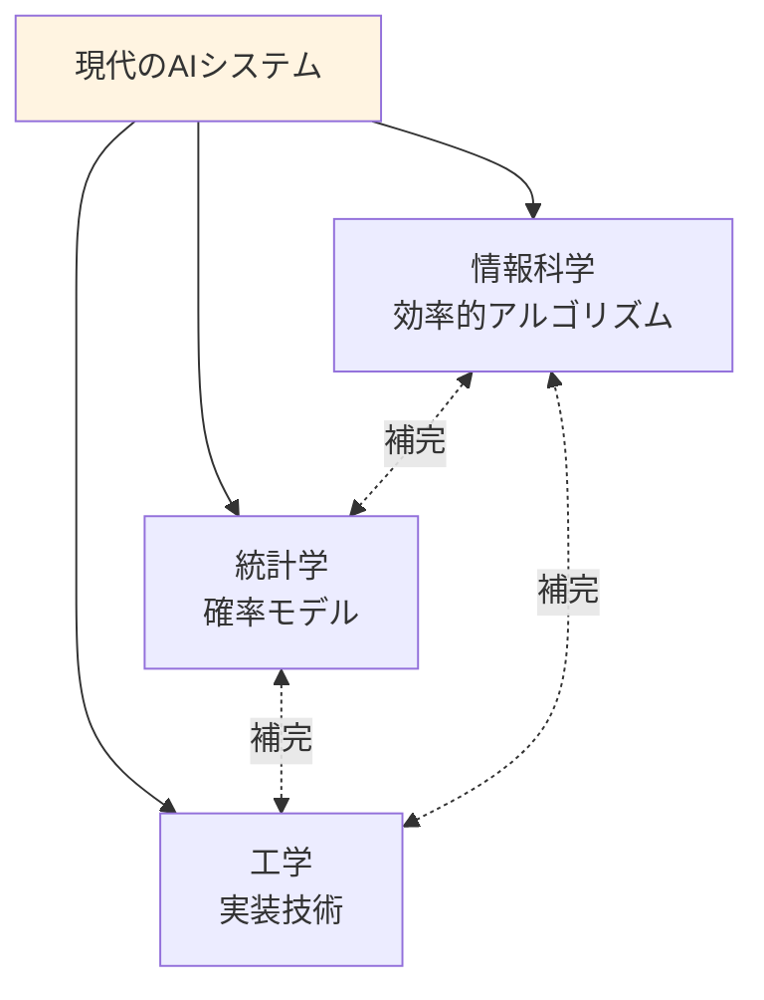

---

## 🌍 実世界への影響とその後の発展

### 💫 社会への影響

情報科学は、20世紀後半から現在にかけて、人類社会を根本から変革しました。

```mermaid
mindmap
  root((情報科学の影響))
    経済変革
      IT産業の誕生
        GAFAM台頭
        デジタル経済
      自動化による効率化
        製造業の変革
        サービス業の変化
      新しい職業の創造
        データサイエンティスト
        AIエンジニア
    社会構造の変化
      コミュニケーション革命
        SNSの普及
        リモートワーク
      情報アクセスの民主化
        知識の平等化
        教育機会の拡大
      デジタルデバイド
        格差問題
        倫理的課題
    科学研究の加速
      シミュレーション科学
        気候モデル
        創薬研究
      ビッグデータ解析
        ゲノム解析
        天文学の進展
      AI駆動の発見
        材料科学
        数学の定理証明
```

**数字で見る影響**：

```mermaid
graph LR
    A[1950年代<br/>計算機は研究室の巨大装置] --> B[1980年代<br/>パソコンが家庭に]
    B --> C[2000年代<br/>インターネット普及率50%超]
    C --> D[2020年代<br/>スマホ所有率80%超]
    
    A1[計算速度: 数千回/秒] -.100万倍.- B1[数百万回/秒]
    B1 -.1000倍.- C1[数十億回/秒]
    C1 -.100倍.- D1[数兆回/秒]
    
    style A fill:#ffcccc
    style B fill:#ffffcc
    style C fill:#ccffff
    style D fill:#ccffcc
```

### 🚀 未来への発展

情報科学は今も進化を続けています。以下は、今後10〜30年で予想される発展です。

```mermaid
graph TD
    A[現在の情報科学] --> B[短期的発展<br/>2025-2030]
    B --> C[中期的発展<br/>2030-2040]
    C --> D[長期的展望<br/>2040-2050]
    
    B --> B1[AI民主化<br/>誰でもAI開発可能に]
    B --> B2[エッジコンピューティング<br/>デバイス上でAI実行]
    B --> B3[説明可能AI<br/>ブラックボックス解消]
    
    C --> C1[量子AI<br/>量子コンピュータとの融合]
    C --> C2[脳模倣チップ<br/>超低消費電力AI]
    C --> C3[自律システム<br/>完全自動化社会]
    
    D --> D1[汎用AI<br/>人間レベルの知能]
    D --> D2[生体計算<br/>DNAコンピューティング]
    D --> D3[意識のシミュレーション<br/>心のアップロード?]
    
    style A fill:#fff4e1
    style B fill:#e1f5ff
    style C fill:#ffe1f5
    style D fill:#e1ffe1
```

### 🔮 5つの主要トレンド

#### 1️⃣ **量子情報科学との融合**

従来の情報科学は「ビット（0か1）」で情報を表現しますが、量子情報科学は「量子ビット（0と1の重ね合わせ）」を使います。

```mermaid
graph LR
    A[古典ビット<br/>0 または 1] --> C[新しい計算パラダイム]
    B[量子ビット<br/>0 と 1 の重ね合わせ] --> C
    
    C --> D[特定問題で<br/>指数関数的高速化]
    
    D --> D1[暗号解読]
    D --> D2[量子化学シミュレーション]
    D --> D3[最適化問題]
    
    style B fill:#ffe1f5
    style D fill:#ccffcc
```

**影響**：
- 現在の暗号が破られる可能性 → 量子暗号の必要性
- 創薬や材料開発が劇的に加速
- しかし、量子コンピュータにも限界があり、古典情報科学は引き続き重要

#### 2️⃣ **AI倫理と説明可能性**

現在のAIは「なぜその判断をしたか」を説明できないブラックボックス問題があります。

```mermaid
graph TD
    A[現在のAI] --> B[問題点]
    B --> B1[判断根拠が不明]
    B --> B2[バイアスの混入]
    B --> B3[予期しない振る舞い]
    
    B1 --> C[説明可能AI<br/>XAI]
    B2 --> D[公平性保証<br/>アルゴリズム]
    B3 --> E[形式検証<br/>安全性証明]
    
    C --> F[信頼できるAI社会]
    D --> F
    E --> F
    
    style B fill:#ffcccc
    style F fill:#ccffcc
```

**情報科学の役割**：
- 形式検証理論：AIが安全に動作することを数学的に証明
- 因果推論理論：AIの判断理由を追跡可能に
- 公平性の数学的定義：差別のないアルゴリズム設計

#### 3️⃣ **エッジAI - 計算の分散化**

現在のAIは巨大データセンターで動きますが、将来はスマホやIoTデバイス上で動作します。

```mermaid
sequenceDiagram
    participant Device as あなたのスマホ
    participant Edge as エッジAI<br/>(デバイス上)
    participant Cloud as クラウドAI<br/>(データセンター)
    
    Device->>Edge: 音声認識リクエスト
    Note over Edge: デバイス内で即座に処理
    Edge-->>Device: 0.1秒で結果返却
    
    Note over Device,Cloud: インターネット接続不要<br/>プライバシー保護
    
    alt 複雑な処理の場合のみ
        Edge->>Cloud: 追加計算依頼
        Cloud-->>Edge: 詳細結果
    end
```

**メリット**：
- 低遅延：リアルタイム応答
- プライバシー：データが外部に出ない
- オフライン動作：ネット不要

**課題**：
- アルゴリズムの軽量化（計算効率の追求）
- 限られたメモリでの動作（データ構造の最適化）

#### 4️⃣ **自己改善するAI - メタ学習**

AIが「学習方法そのものを学習」する時代へ。

```mermaid
graph TD
    A[従来のAI] --> A1[人間がアルゴリズム設計]
    A1 --> A2[データで学習]
    A2 --> A3[特定タスクを実行]
    
    B[メタ学習AI] --> B1[AI自身がアルゴリズム探索]
    B1 --> B2[少ないデータで学習]
    B2 --> B3[多様なタスクに適応]
    
    style A fill:#ffffcc
    style B fill:#ccffcc
```

**情報科学の貢献**：
- AutoML理論：アルゴリズム探索の最適化
- Few-shot学習：少ないデータでの学習理論
- Transfer Learning：知識の転移メカニズム

#### 5️⃣ **人間とAIの協調知能**

AIが人間を置き換えるのではなく、人間の能力を拡張する方向へ。

```mermaid
graph LR
    A[人間の強み] --> C[協調知能システム]
    B[AIの強み] --> C
    
    A --> A1[創造性]
    A --> A2[常識的判断]
    A --> A3[倫理的思考]
    
    B --> B1[高速計算]
    B --> B2[パターン認識]
    B --> B3[疲れない正確性]
    
    C --> D[最適な問題解決]
    
    style C fill:#fff4e1
    style D fill:#ccffcc
```

**応用例**：
- **医療診断**：AIが画像から病変候補を検出 → 医師が最終判断
- **創作活動**：AIがアイデアを提案 → 人間が選択・洗練
- **科学研究**：AIが仮説生成 → 人間が実験設計

---

### 🎓 学習ロードマップ - あなたはどこから始めるべきか

情報科学は広大ですが、段階的に学べます。

```mermaid
graph TD
    Start[情報科学を学びたい] --> Level1[レベル1: 基礎]
    Level1 --> Level2[レベル2: 実践]
    Level2 --> Level3[レベル3: 応用]
    Level3 --> Level4[レベル4: 専門]
    
    Level1 --> L1A[プログラミング基礎<br/>Python/JavaScript]
    Level1 --> L1B[データ構造入門<br/>配列・リスト・木]
    Level1 --> L1C[基本アルゴリズム<br/>探索・ソート]
    
    Level2 --> L2A[アルゴリズム解析<br/>計算量評価]
    Level2 --> L2B[データベース理論<br/>SQL・正規化]
    Level2 --> L2C[ネットワーク基礎<br/>プロトコル・暗号]
    
    Level3 --> L3A[機械学習理論<br/>統計的学習]
    Level3 --> L3B[分散システム<br/>並列処理]
    Level3 --> L3C[セキュリティ<br/>暗号理論]
    
    Level4 --> L4A[AI研究<br/>ディープラーニング]
    Level4 --> L4B[理論計算機科学<br/>計算複雑性]
    Level4 --> L4C[量子計算<br/>新パラダイム]
    
    style Level1 fill:#e1ffe1
    style Level2 fill:#e1f5ff
    style Level3 fill:#ffe1f5
    style Level4 fill:#fff4e1
```

**推奨学習期間**：
- レベル1（基礎）：3〜6ヶ月
- レベル2（実践）：6ヶ月〜1年
- レベル3（応用）：1〜2年
- レベル4（専門）：継続的な学習

---


---

## 🎯 まとめ - 情報科学とは何だったのか

最後に、この長い旅を振り返りましょう。

```mermaid
graph TD
    A[情報科学] --> B[理論的基盤<br/>計算の本質を理解]
    A --> C[データ処理<br/>情報の整理と変換]
    A --> D[アルゴリズム開発<br/>効率的な問題解決]
    
    B --> E[AI開発の設計図]
    C --> E
    D --> E
    
    E --> F[現実世界の変革]
    
    F --> F1[スマホ・SNS]
    F --> F2[自動運転・医療AI]
    F --> F3[未来の量子AI]
    
    style A fill:#fff4e1
    style E fill:#ffe1f5
    style F fill:#ccffcc
```

### 🌟 核心メッセージ

情報科学は、**「コンピュータで考える仕組みを作るための設計図と道具箱」**です。

- **理論**が「何が可能か」を教え
- **データ処理**が「情報をどう扱うか」を示し
- **アルゴリズム**が「どうやって実現するか」を提供する

そして、これらすべてが**AI時代の土台**となっています。

### 💭 最後に - あなたへのメッセージ

情報科学を学ぶことは、単に技術を習得することではありません。それは、**問題を構造化して考える力**を身につけることです。

この思考法は、プログラミングだけでなく、人生のあらゆる問題解決に応用できます。

```mermaid
graph LR
    A[情報科学的思考] --> B[問題の分解]
    B --> C[パターンの認識]
    C --> D[抽象化]
    D --> E[アルゴリズム設計]
    E --> F[問題解決]
    
    F --> G[技術的問題]
    F --> H[ビジネス課題]
    F --> I[日常の悩み]
    
    style A fill:#fff4e1
    style F fill:#ccffcc
```

**あなたの次の一歩**：
1. 簡単なプログラミング言語（Pythonなど）を学ぶ
2. 基本的なアルゴリズム（ソート・探索）を実装してみる
3. 小さなプロジェクト（To-doアプリなど）を作ってみる
4. オンラインコミュニティに参加して、仲間と学ぶ

情報科学の世界へようこそ！ 🚀

---

