人工知能における、情報科学について。AIを設計・実装するための理論的基盤と、データ処理、アルゴリズム開発といった工学的枠組みを提供する。

# 情報科学（AI基盤編）- 初学者のための完全ガイド

## 🔍 一言要約
人工知能の「脳の設計図」を描く学問 - データという材料をどう加工し、賢い判断を実現するかを研究する技術の土台

## 📚 目次
1. [🌟 はじめに - なぜ情報科学がAIの心臓なのか](#-はじめに---なぜ情報科学がaiの心臓なのか)
2. [🏗️ 基本構造 - 情報科学の3つの柱](#️-基本構造---情報科学の3つの柱)
3. [⚡ 主要技術 - AIを支える5つのコア技術](#-主要技術---aiを支える5つのコア技術)
4. [📜 時代背景と発見に至った経緯](#-時代背景と発見に至った経緯)
5. [🎨 種類と特徴 - 情報科学の3つの顔](#-種類と特徴---情報科学の3つの顔)
6. [📗 関連する用語](#-関連する用語)
7. [💡 メリットとデメリット](#-メリットとデメリット)
8. [🚀 応用と実例](#-応用と実例)
9. [🔄 置換と変遷](#-置換と変遷)
10. [⚔️ 代替と競合](#️-代替と競合)
11. [🌍 実世界への影響とその後の発展](#-実世界への影響とその後の発展)

---

## 🌟 はじめに - なぜ情報科学がAIの心臓なのか

**日常例で理解する：**
レストランのシェフを想像してください。料理（AI）を作るには：
- 🍅 **材料の選び方**（データ処理）
- 🔪 **調理技術**（アルゴリズム）
- 📖 **レシピ理論**（理論的基盤）

情報科学は、この「料理学」全体を体系化した学問です。AIという料理を美味しく作るための、科学と技術の両面を提供します。

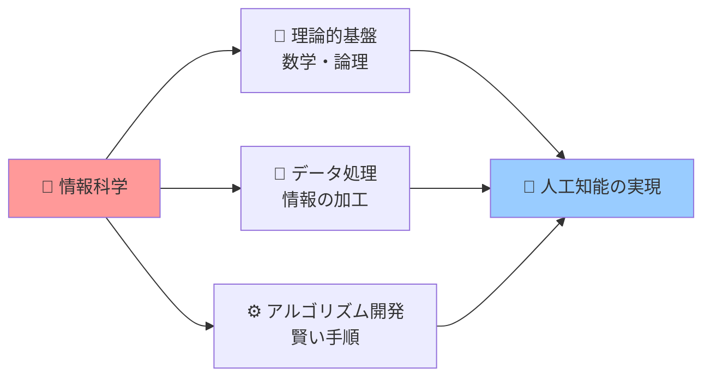

**なぜ重要？**
- AIは「勝手に賢くなる魔法」ではない → 設計図が必要
- 情報科学がなければ、AIは暗闇で料理するようなもの
- ChatGPTも自動運転も、全て情報科学の原理で動いている

---

## 🏗️ 基本構造 - 情報科学の3つの柱

情報科学は、まるで**三本足の椅子**のように、3つの要素で成り立っています。

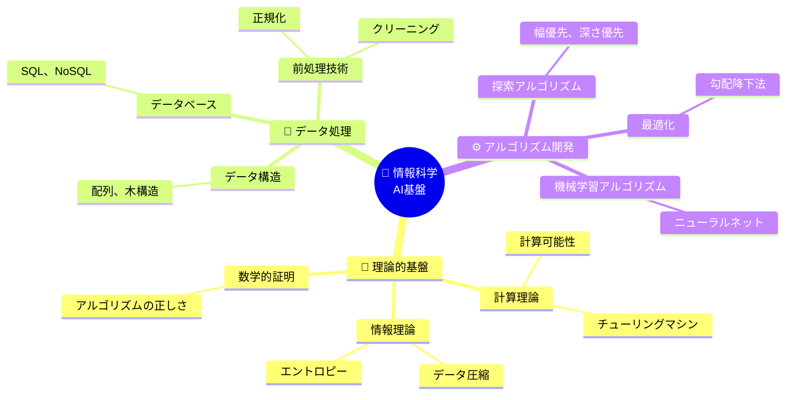

### 各柱の役割を日常例で：

| 柱 | 建築に例えると | AI開発での役割 |
|---|-------------|--------------|
| 🧮 **理論的基盤** | 建築学の原理（力学、材料学） | 「なぜこの方法で動くのか」を証明 |
| 💾 **データ処理** | 建材の加工技術（木材切断、溶接） | 生データを使える形に変換 |
| ⚙️ **アルゴリズム開発** | 施工手順書（工程表） | 効率的に問題を解く手順設計 |

---

## ⚡ 主要技術 - AIを支える5つのコア技術

### 1️⃣ **計算理論** - AIの「思考の限界」を定義

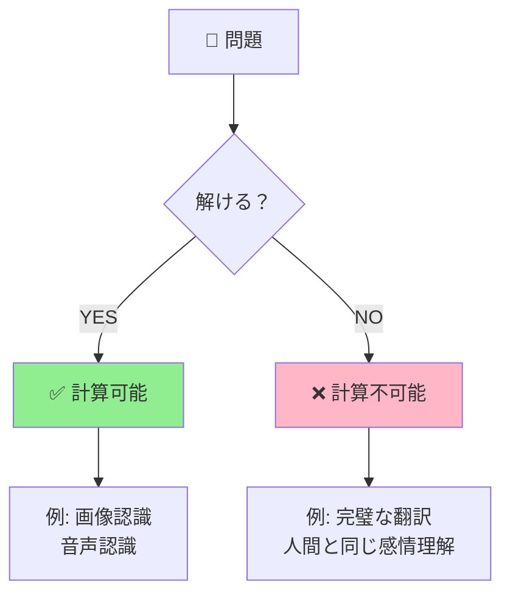

**日常例：** 
- スマホの顔認識（✅ できる）
- 全ての人の心を完全に読む（❌ できない）

### 2️⃣ **データ構造** - 情報の「収納術」

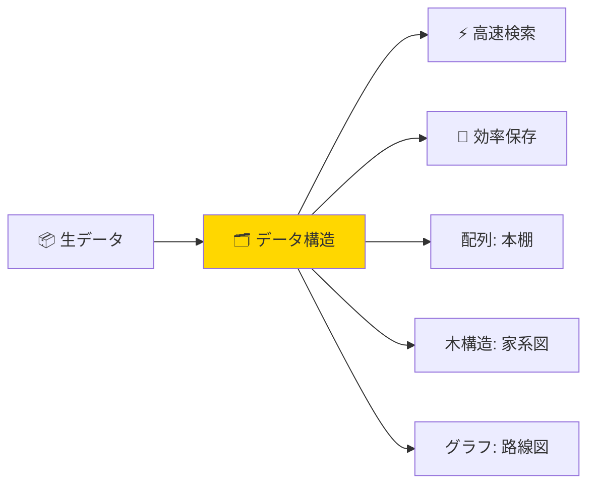

**比喩：**
- **配列** = 本棚（順番に並べる）
- **木構造** = 家系図（親子関係）
- **グラフ** = 電車路線図（複雑なつながり）

### 3️⃣ **アルゴリズム最適化** - 「最短ルート」を見つける技術

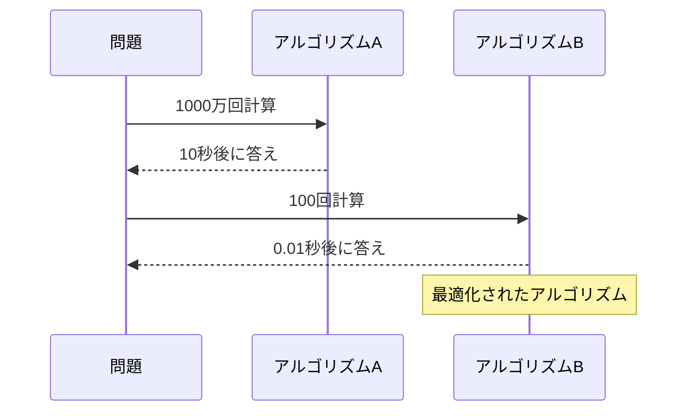

**実例：** Google検索が0.5秒で結果を返せる理由

### 4️⃣ **機械学習の数学的基礎** - AIが「学ぶ」仕組み

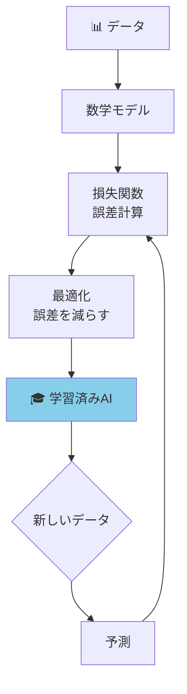

**比喩：** 自転車の練習
- 転ぶ（誤差） → 姿勢を調整（最適化） → 上達（学習）

### 5️⃣ **情報理論** - データの「圧縮と伝達」

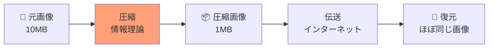

**身近な例：** 
- YouTube動画がサクサク再生できる理由
- ZIPファイルでデータを軽くする技術

---

## 📜 時代背景と発見に至った経緯

### 🎭 情報科学誕生の物語

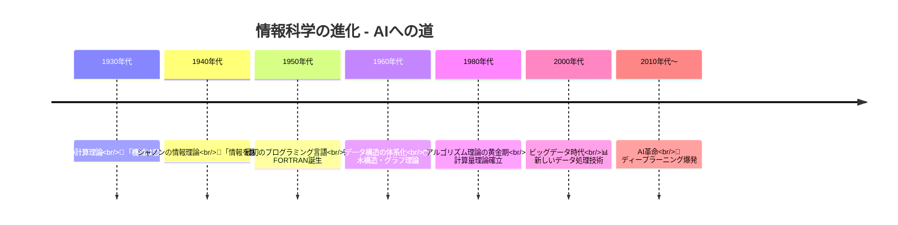

### 📖 重要な転換点

**1. アラン・チューリング（1936年）**
> 「機械は人間のように計算できるか？」という問いから、**チューリングマシン**を考案。これが現代コンピュータの理論的原型に。

**2. クロード・シャノン（1948年）**
> 電話回線のノイズ問題を解決する中で、**情報を数値化する方法**を発見。「1ビット = 2択の情報量」という概念が生まれた。

**3. ドナルド・クヌース（1960年代）**
> アルゴリズムを芸術的に分析する手法を確立。「美しいコード」の基準を作った。

---

## 🎨 種類と特徴 - 情報科学の3つの顔

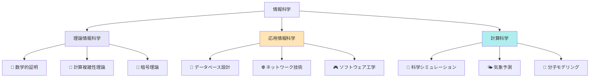

### 比較表

| 分野 | 焦点 | AI開発での役割 | 例 |
|-----|------|--------------|---|
| **理論情報科学** | 「なぜ」を追求 | AIが理論的に可能か証明 | アルゴリズムの正当性証明 |
| **応用情報科学** | 「どう作るか」実装 | AI製品の実際の構築 | ChatGPTのシステム設計 |
| **計算科学** | 「何を計算するか」応用 | AIで複雑な現象を予測 | タンパク質折りたたみ予測 |

---

## 📗 関連する用語

### 🔤 同義語・類似語

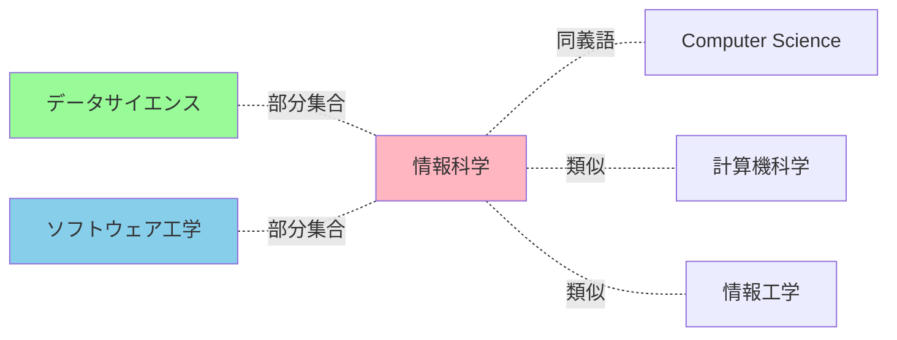

| 用語 | 関係 | 違い |
|-----|------|------|
| **計算機科学** | ほぼ同義 | ハードウェア寄りのニュアンス |
| **情報工学** | 類似（応用寄り） | エンジニアリング実践重視 |
| **データサイエンス** | 部分集合 | データ分析に特化 |
| **AI/機械学習** | 応用分野 | 情報科学の応用例の一つ |

### 🔄 多義語の注意

**「アルゴリズム」**
- 一般用語：手順、やり方
- 情報科学：厳密に定義された計算手順

**「データ」**
- 日常：情報全般
- 情報科学：デジタル化され構造化された情報

---

## 💡 メリットとデメリット

### ✅ メリット

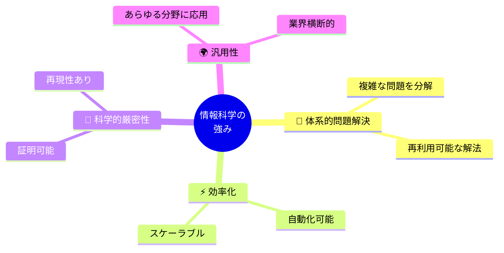

**具体例：**
1. **医療**：画像診断の精度向上（情報科学のアルゴリズム）
2. **物流**：最適配送ルート（グラフ理論）
3. **金融**：不正検出システム（パターン認識）

### ❌ デメリットと課題

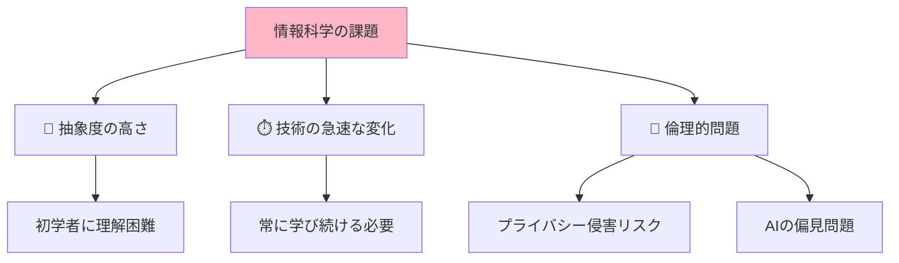

| デメリット | 実例 | 対策 |
|-----------|------|------|
| **学習曲線が急** | 数学的知識が必要 | 段階的学習、視覚化ツール |
| **技術の陳腐化** | 5年前の技術が古い | 継続的学習文化 |
| **倫理的ジレンマ** | 顔認識の悪用 | ガイドライン整備 |
| **ブラックボックス問題** | AIの判断根拠不明 | 説明可能AI（XAI）の研究 |

---

## 🚀 応用と実例

### 身近な実例トップ5

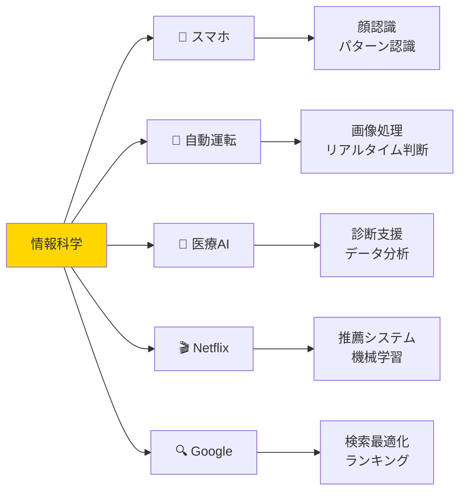

### 詳細解説

**1. 🔍 Google検索（0.5秒で数十億ページを探索）**
- **使用技術：** ページランクアルゴリズム、分散処理
- **情報科学の役割：** グラフ理論、アルゴリズム最適化

**2. 🎬 Netflixの推薦（「次に観る作品」の精度）**
- **使用技術：** 協調フィルタリング、行列分解
- **情報科学の役割：** データマイニング、機械学習

**3. 🚗 自動運転（周囲360度を認識）**
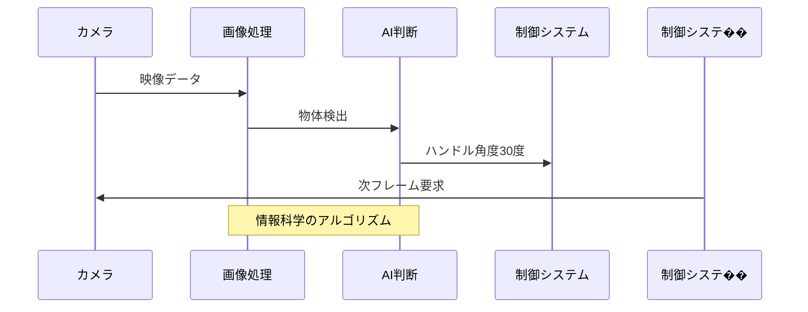

**4. 🏥 がん診断AI（放射線画像から病変検出）**
- **使用技術：** 畳み込みニューラルネットワーク（CNN）
- **情報科学の役割：** 画像処理、パターン認識理論

**5. 💬 ChatGPT（自然な会話生成）**
- **使用技術：** Transformer、大規模言語モデル
- **情報科学の役割：** 自然言語処理、確率モデル

---

## 🔄 置換と変遷

### 何を置き換えたか

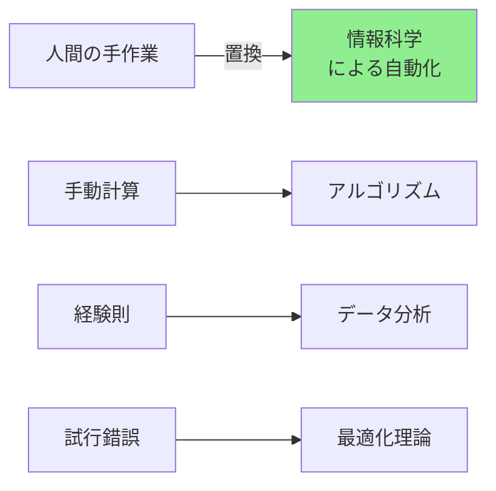

| 従来の方法 | 情報科学の方法 | 変化 |
|-----------|---------------|------|
| 📊 手作業集計 | データベース自動集計 | 数日→数秒 |
| 🗺️ 地図で経路探索 | GPS最適ルート | 30分→即座 |
| 📞 人間のオペレーター | チャットボット | 24時間対応可能 |

### 何に置き換えられつつあるか

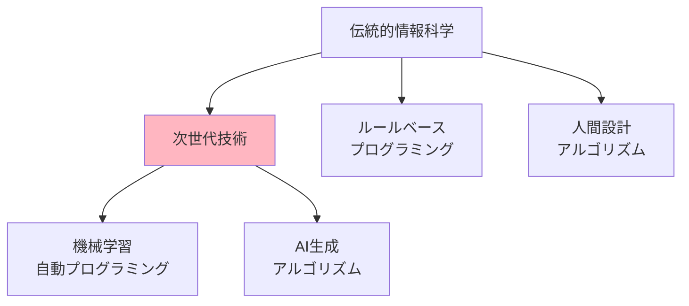

**例：**
- **従来：** プログラマーがルールを書く
- **現在：** AIがデータから自動学習

---

## ⚔️ 代替と競合

### 代替可能性

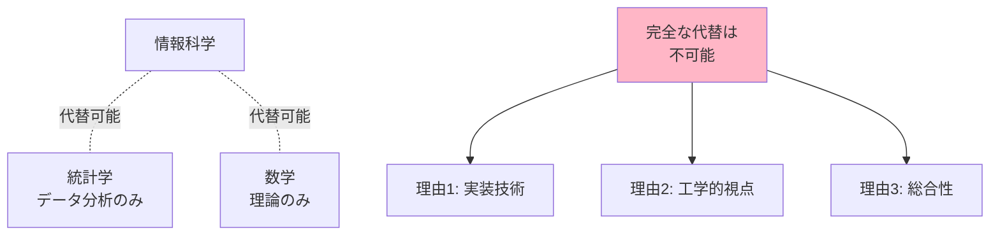

**結論：** 情報科学は他分野と**補完関係**であり、完全代替は不可能

### 競合する分野

| 分野 | 競合点 | 協調点 |
|-----|--------|--------|
| **データサイエンス** | データ処理手法 | 情報科学が基盤提供 |
| **ソフトウェア工学** | システム開発手法 | 理論と実践で協力 |
| **数学** | アルゴリズム理論 | 数学が理論基盤 |
| **AI研究** | 学習手法開発 | 情報科学が実装基盤 |

---

## 🌍 実世界への影響とその後の発展

### 社会への4大インパクト

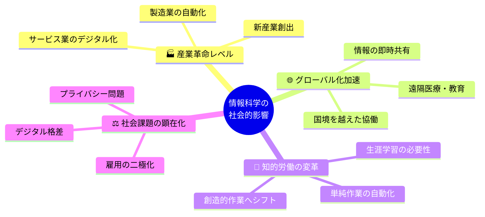

### 未来展望（2025年以降）

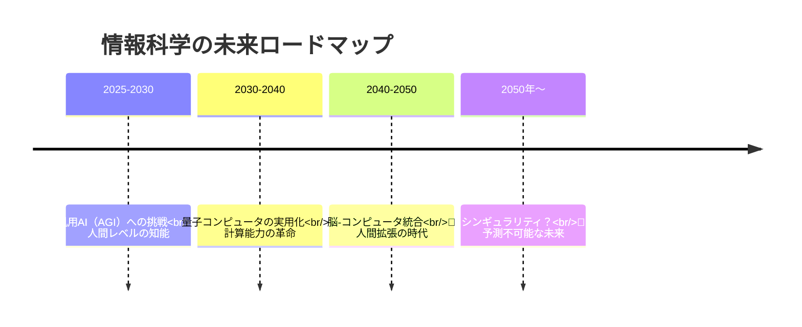

### 現在進行中の重要トレンド

**1. 🔐 量子コンピュータと量子情報科学**
- 従来の暗号が無効化される可能性
- 新しいアルゴリズムパラダイム

**2. 🧬 バイオインフォマティクス**
- DNA配列解析
- 創薬の加速

**3. 🌍 エッジコンピューティング**
- クラウドからデバイスへ処理を分散
- リアルタイム性の向上

**4. 🤝 説明可能AI（XAI）**
- AIの判断根拠を人間が理解できる形に
- 倫理的AI開発の基盤

---

## 🎓 学習のロードマップ

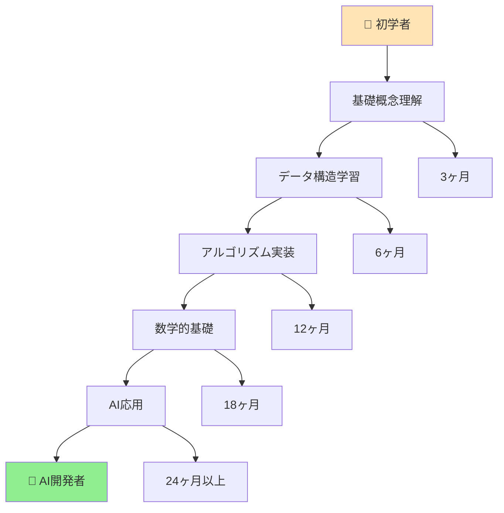

**推奨学習順序：**
1. プログラミング基礎（Python推奨）
2. データ構造（配列→リスト→木）
3. 基本アルゴリズム（ソート→探索）
4. 数学（線形代数→微積分→確率統計）
5. 機械学習基礎
6. ディープラーニング

---

## 🔗 次のステップ

このガイドを読み終えたあなたへ：

1. **実践してみよう：** Pythonで簡単なソートアルゴリズムを実装
2. **深掘りしよう：** 興味ある分野（機械学習、データベース等）の専門書
3. **コミュニティに参加：** GitHub、Stack Overflowで実践的学習

**情報科学は、AIという未来を創る「魔法の杖」ではなく、誰でも学べる「科学と技術の体系」です。一歩ずつ、楽しみながら学んでいきましょう！** 🚀
