人工知能における、機能的価値について。AIが提供する実用的な能力（自動化、予測など）と、その具体的な適用範囲の評価に不可欠。

# 機能的価値（Functional Value in AI） - 初学者のための完全ガイド

## 🔍 一言要約
**AIが「実際に何ができるのか」を測る物差し**

## 📚 目次
1. [🌟 はじめに](#-はじめに)
2. [🏗️ 基本構造](#️-基本構造)
3. [⚡ 主要な3つの構成要素](#-主要な3つの構成要素)
4. [📜 概念の誕生背景](#-概念の誕生背景)
5. [🎨 評価の種類と方法](#-評価の種類と方法)
6. [📗 関連する用語](#-関連する用語)
7. [💡 メリットとデメリット](#-メリットとデメリット)
8. [🚀 実世界での応用例](#-実世界での応用例)
9. [🔄 概念の変遷](#-概念の変遷)
10. [⚖️ 代替概念と競合](#️-代替概念と競合)
11. [🌍 社会への影響と未来](#-社会への影響と未来)

---

## 🌟 はじめに

### なぜ機能的価値が重要なのか？

あなたがスマートフォンを買うとき、「カメラの画質は？」「バッテリーは何時間持つ？」と聞きますよね。これが**機能的価値**の考え方です。

AIの世界でも同じです。「このAI、何ができるの？」「どれくらい正確？」「どんな場面で使える？」——これらの問いに答えるのが機能的価値という概念なのです。

**日常例で理解する：**
- 🍳 **料理ロボット**：「卵を割れる」「焼き加減を調整できる」→ これが機能的価値
- 🚗 **自動運転車**：「障害物を避けられる」「目的地まで運転できる」→ これも機能的価値
- 📱 **音声アシスタント**：「天気を教えられる」「音楽を再生できる」→ やはり機能的価値

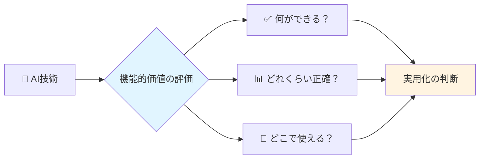

---

## 🏗️ 基本構造

機能的価値は**3つの柱**で成り立っています：

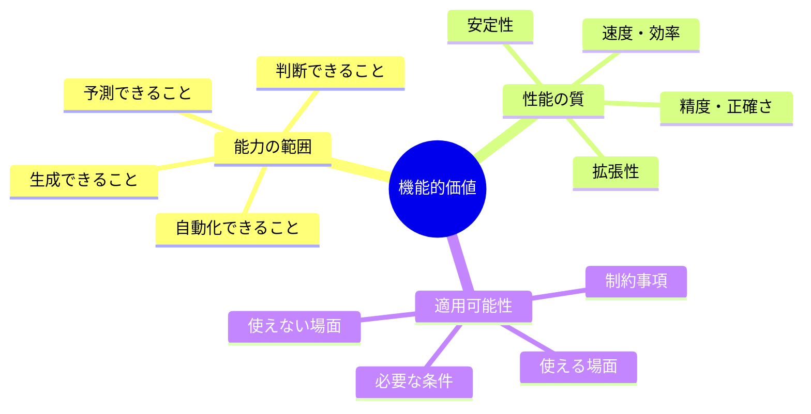

### わかりやすく言い換えると：

| 専門用語 | 日常語での表現 | 例 |
|---------|--------------|-----|
| 能力の範囲 | 「できること」のリスト | 料理ロボットなら「切る、焼く、煮る」 |
| 性能の質 | 「どれくらい上手か」 | 10回中9回成功する |
| 適用可能性 | 「どこで使えるか」 | 家庭用キッチンでのみ使用可能 |

---

## ⚡ 主要な3つの構成要素

### 1️⃣ **実用的能力（Practical Capability）**

AIが**実際に実行できるタスク**のこと。

**例：医療診断AI**
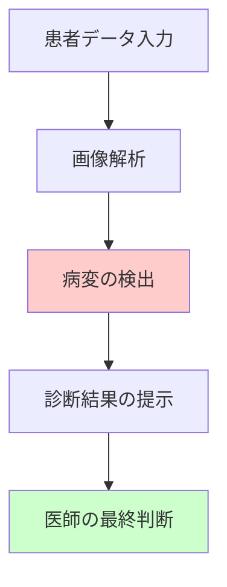

- ✅ できること：レントゲン写真から肺炎の兆候を見つける
- ❌ できないこと：患者と会話して症状を聞き出す（まだ）

### 2️⃣ **性能指標（Performance Metrics）**

「どれくらい正確か」を数字で表したもの。

**レストラン予約AIの例：**
- 📈 **正解率**：100回中95回正しく予約 → 95%
- ⚡ **応答速度**：質問から回答まで2秒
- 🔄 **稼働率**：24時間365日動き続ける → 99.9%

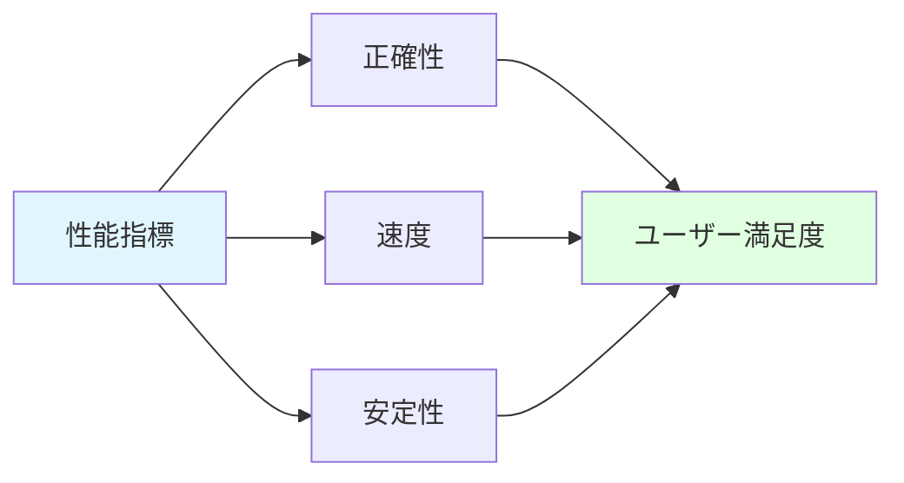

### 3️⃣ **適用範囲（Application Scope）**

「どんな場面で使えるか」の地図。

**天気予報AIの例：**
- ✅ **使える場面**：都市部の1週間予報、気温・降水確率
- ⚠️ **注意が必要**：山岳地帯、局地的豪雨
- ❌ **使えない場面**：1ヶ月先の天気、台風の進路（精度低下）

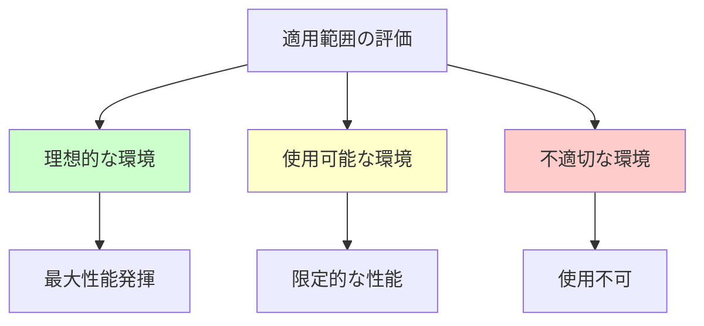

---

## 📜 概念の誕生背景

### 🎭 ドラマチックな誕生ストーリー

**時代：1950年代〜**

**第1幕：夢の時代（1950-1970年代）**

科学者たちは叫びました。「AIは何でもできる！」

でも現実は...
- ❌ チェスは指せるけど、靴紐は結べない
- ❌ 数式は解けるけど、猫と犬の区別ができない

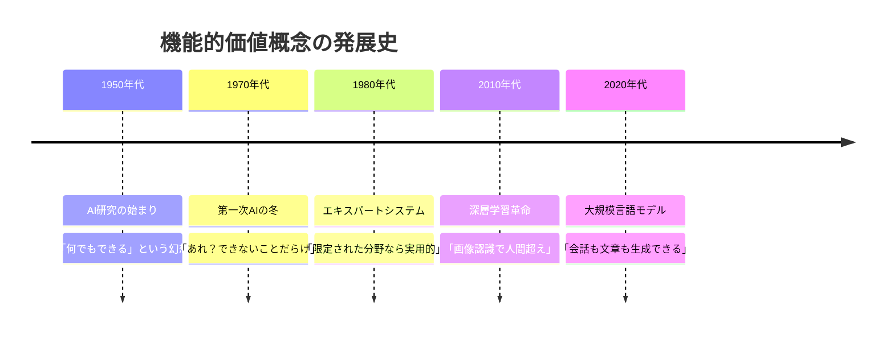

**第2幕：現実直視の時代（1980-2000年代）**

ある企業が医療診断AIを作りました。

研究室では95%の精度！「すごい！」

でも病院では...
- 照明が違う → 精度70%に低下
- カメラの機種が違う → 使えない
- 患者の肌の色が違う → 誤診連発

**教訓：「できる」だけでは不十分。「どこで」「どんな条件で」できるかが重要**

**第3幕：評価の科学化（2010年代〜現在）**

「ちゃんと測ろう！」という動きが加速。

- 📊 ベンチマークテストの標準化
- 🔬 多様な環境でのテスト
- 📋 限界の明示（「できないこと」も公開）

---

## 🎨 評価の種類と方法

### 📊 評価の全体マップ

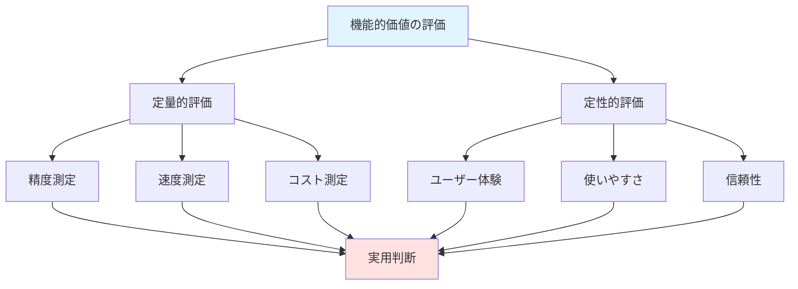

### 🔢 定量的評価（数字で測れるもの）

| 評価項目 | 測定方法 | 実例 |
|---------|---------|------|
| **正確性** | テストデータで検証 | 画像認識AI：猫の写真100枚中98枚正解 |
| **速度** | 処理時間の計測 | 翻訳AI：1000文字を0.5秒で翻訳 |
| **コスト** | 必要な計算資源 | 月額1万円で1000回まで利用可能 |
| **スケーラビリティ** | 負荷増加時の性能 | 同時1000人でも速度低下なし |

### 💭 定性的評価（人の感覚で測るもの）

| 評価項目 | 評価方法 | 実例 |
|---------|---------|------|
| **使いやすさ** | ユーザーテスト | 初めての人が5分で使いこなせる |
| **信頼感** | 継続使用率 | 一度使った人の80%がリピート |
| **柔軟性** | 想定外の対応 | マニュアルにない質問にも対応 |

---

## 📗 関連する用語

### 🔤 同義語・類似概念

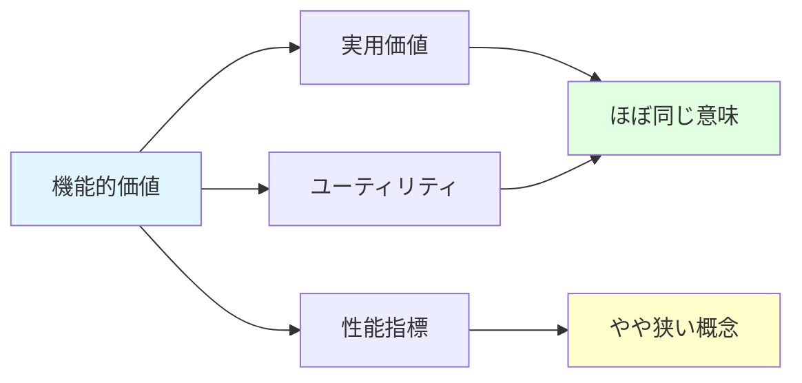

| 用語 | 関係 | 説明 |
|-----|------|------|
| **実用価値** | 同義語 | 「実際に役立つか」という意味で同じ |
| **ユーティリティ** | 類義語 | 経済学用語。「有用性」と訳される |
| **性能指標** | 部分集合 | 機能的価値の中の「測定可能な部分」 |
| **技術的有用性** | 類義語 | より技術寄りの表現 |

### ⚖️ 対義語・対照概念

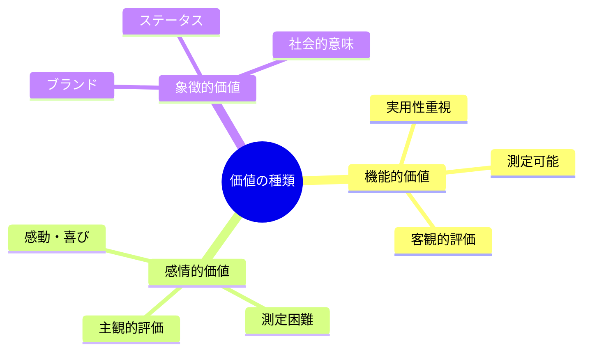

| 対照概念 | 違い | 例 |
|---------|------|-----|
| **感情的価値** | 気持ちや満足感 | 可愛いロボット（機能は低くても愛される） |
| **象徴的価値** | イメージやブランド | 「最先端AI搭載」という宣伝文句 |
| **理論的価値** | 研究上の意義 | 論文にはなるが実用化は未定 |

### 🔀 多義語の注意点

**「価値（Value）」という言葉の使い分け：**

1. **経済的価値**：お金で測れる価値
   - 例：このAIは年間100万円のコスト削減効果
   
2. **機能的価値**：実用的な能力（今回のテーマ）
   - 例：このAIは顧客対応を自動化できる
   
3. **社会的価値**：社会全体への貢献
   - 例：このAIは医療格差を縮小する

---

## 💡 メリットとデメリット

### ✅ メリット

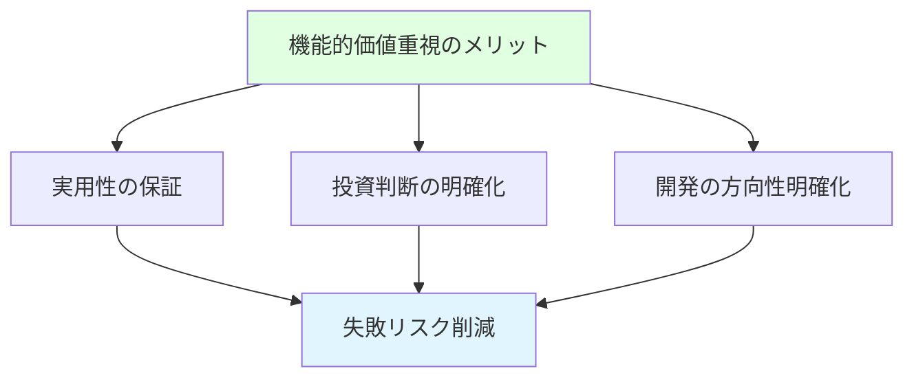

#### 1. **客観的な評価が可能**
- 数字で比較できる
- 「何となく良い」ではなく「95%正確」と言える
- **具体例：** 2つの翻訳AIを比較 → 精度・速度・コストで優劣が明確

#### 2. **実用化の可否が判断できる**
- 研究段階から製品化まで見通せる
- 無駄な投資を避けられる
- **具体例：** 自動運転AI「高速道路では実用レベル、市街地はまだ」→ 段階的導入

#### 3. **ユーザーの期待値調整**
- 「できること」「できないこと」を明示
- 過度な期待によるトラブル防止
- **具体例：** チャットボット「簡単な質問は対応、複雑な相談は人間にバトンタッチ」

#### 4. **改善の方向性が見える**
- どこを強化すべきか明確
- 効率的な開発
- **具体例：** 音声認識AI「騒音下での精度が課題」→ ノイズ除去技術に注力

### ❌ デメリット

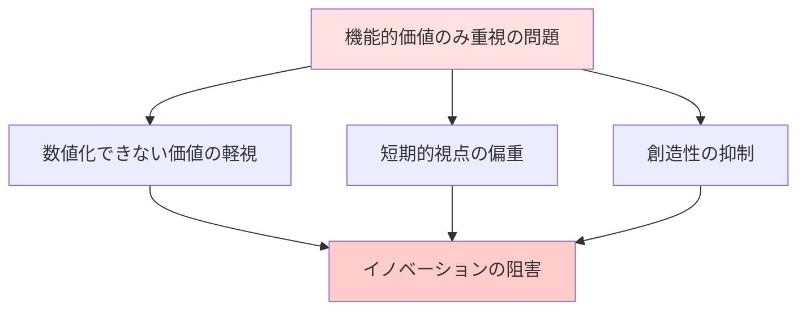

#### 1. **測定できない価値の見落とし**
- 「楽しさ」「安心感」は数値化困難
- ユーザー体験の軽視
- **具体例：** 効率的だが冷たいAI vs 遅いが親しみやすいAI → 後者が選ばれることも

#### 2. **短期的成果への偏り**
- すぐに数字が出るものばかり開発
- 長期的な革新的技術が育たない
- **具体例：** 既存技術の改良ばかり、全く新しいアプローチは放置

#### 3. **過度な最適化による脆弱性**
- 特定の条件でのみ高性能
- 想定外の状況で大失敗
- **具体例：** 晴天の昼間で99%精度の自動運転 → 雨の夜は使えない

#### 4. **評価コストの増大**
- 徹底的に測定するには時間とお金が必要
- 小規模プロジェクトには負担
- **具体例：** スタートアップ「評価に時間をかけすぎて開発が遅れる」

---

## 🚀 実世界での応用例

### 🏥 医療分野

**事例：皮膚がん診断AI**

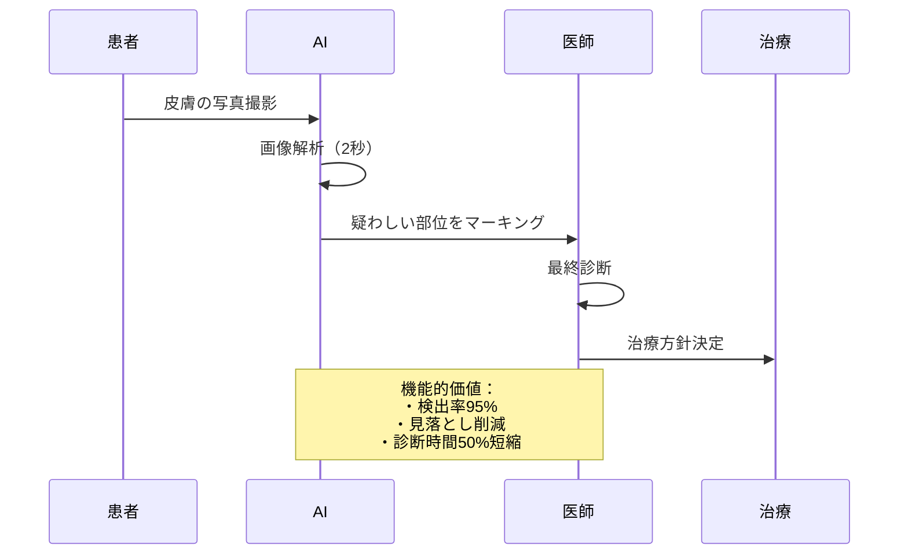

**機能的価値の評価：**
- ✅ **精度**：皮膚科専門医と同等（95%）
- ✅ **速度**：1枚2秒で解析
- ✅ **適用範囲**：6種類の皮膚がんに対応
- ⚠️ **制約**：稀な症例は対応困難
- 💰 **コスト削減**：初診時間を30%短縮

### 🏭 製造業

**事例：製品検査AI**

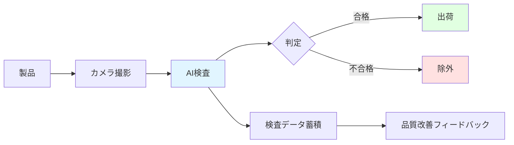

**機能的価値の実現：**
- 📊 **不良品検出率**：99.5%（人間：95%）
- ⚡ **検査速度**：1秒1個（人間：5秒1個）
- 💵 **コスト効果**：年間5000万円削減
- 🔄 **24時間稼働**：シフト制不要

### 🛒 小売・サービス業

**事例：需要予測AI**

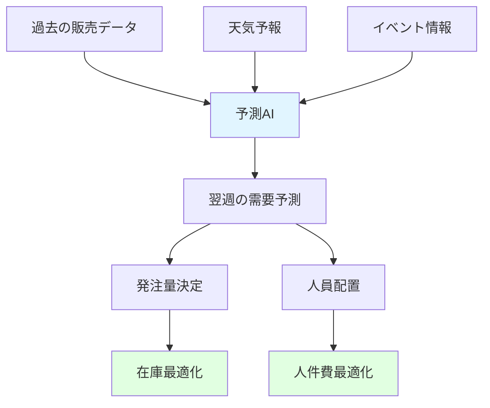

**機能的価値の展開：**
- 📈 **予測精度**：85%（従来60%）
- 🗑️ **廃棄ロス**：30%削減
- 👥 **人員配置効率**：20%向上
- 💡 **新発見**：天気と売上の相関を発見

### 🚗 交通・物流

**事例：配送ルート最適化AI**

**機能的価値の具体化：**
| 指標 | 導入前 | 導入後 | 改善率 |
|-----|--------|--------|--------|
| 配送時間 | 8時間 | 6時間 | 25%短縮 |
| 燃料コスト | 100万円/月 | 75万円/月 | 25%削減 |
| 配送件数 | 80件/日 | 100件/日 | 25%増加 |
| CO2排出量 | 2トン/月 | 1.5トン/月 | 25%削減 |

### 🎓 教育分野

**事例：個別学習支援AI**

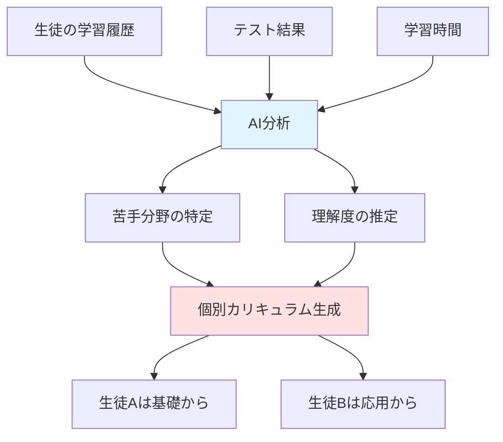

**機能的価値の測定：**
- 📈 **成績向上**：平均15点アップ（100点満点）
- ⏱️ **学習時間短縮**：同じ理解度到達まで20%短縮
- 😊 **学習意欲**：継続率80% → 95%に向上
- 👨‍🏫 **教師負担**：個別対応時間50%削減

---

## 🔄 概念の変遷

### 📖 何を置き換えたか

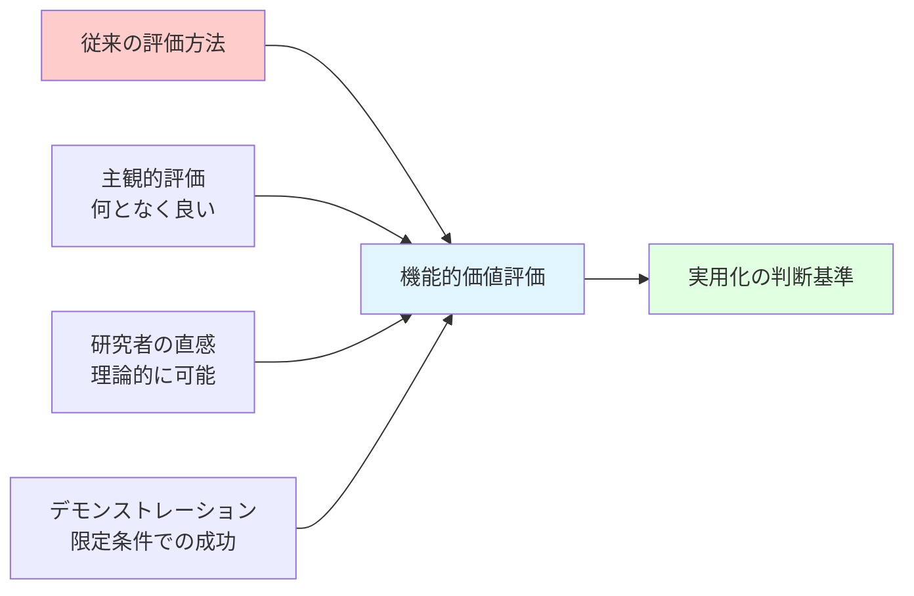

#### 1. **主観的評価から客観的評価へ**

**昔（1970年代）：**
- 研究者：「このAI、すごく賢いよ！」
- 投資家：「具体的に何ができるの？」
- 研究者：「えーと...理論的には何でも！」

**今（2020年代）：**
- 開発者：「画像認識精度98%、処理速度0.1秒」
- 投資家：「数値で比較できるね。採用！」

#### 2. **研究室から実世界へ**

**置き換えられた考え方：**
- ❌ 「研究室で動けばOK」
- ✅ 「実際の環境で安定動作が必須」

**具体例：**
- 昔：きれいな画像での顔認識99%！
- 今：暗い場所・横顔・マスク着用でも90%以上の精度を保証

### 🌱 何を継承したか

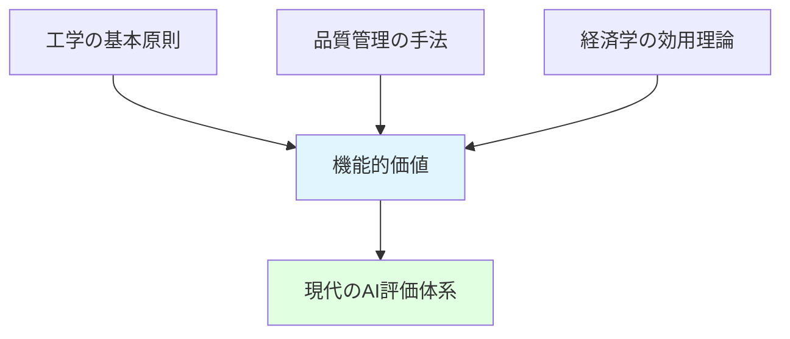

#### 1. **工学の「性能評価」思想**
- 橋の耐荷重、エンジンの出力 → AIの精度・速度
- 測定可能な指標で品質保証

#### 2. **品質管理のPDCAサイクル**
- Plan（計画）→ Do（実行）→ Check（評価）→ Act（改善）
- 機能的価値の継続的測定と改善

#### 3. **経済学の「効用」概念**
- 商品やサービスが提供する満足度
- AIが提供する実用的価値へ応用

### 🔄 何かに継承されたか

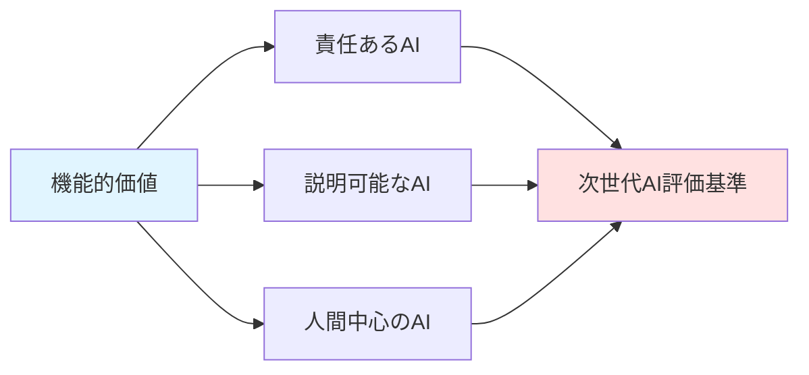

#### 1. **責任あるAI（Responsible AI）**
- 機能だけでなく倫理性も評価
- 「できる」から「すべきか」へ拡張

#### 2. **説明可能なAI（Explainable AI）**
- 「何ができるか」に加えて「なぜそうなるか」
- 機能の透明性を追加

#### 3. **人間中心のAI（Human-Centered AI）**
- 機能的価値＋人間の幸福度
- 技術的性能と人間的価値の統合

---

## ⚖️ 代替概念と競合

### 🔀 何かに代替できるか

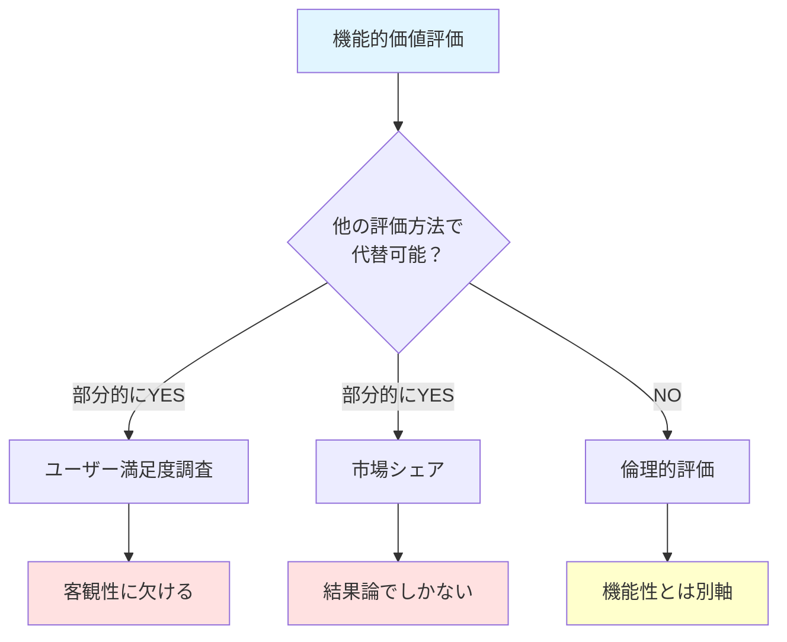

#### ✅ 部分的に代替可能な方法

| 代替方法 | 長所 | 短所 | 代替可能度 |
|---------|------|------|-----------|
| **ユーザー満足度** | 実際の使用感を反映 | 主観的で比較困難 | 40% |
| **市場シェア** | 実際の受容度を示す | 機能以外の要因も混在 | 30% |
| **技術ベンチマーク** | 客観的・再現可能 | 実用性を保証しない | 60% |

#### ❌ 代替不可能な側面

- **実用性の直接評価**：他の方法では測れない
- **改善の方向性**：具体的な数値がないと戦略立案不可
- **投資判断の根拠**：定量データが必須

## ⚖️ 代替概念と競合（続き）

### 🥊 何かと競合するか（続き）

**対立点（続き）：**
- 技術開発：可能性の追求 vs 制約の設定
- 評価軸：効率性 vs 倫理性
- 時間軸：短期成果 vs 長期的影響

#### 🤝 統合への道

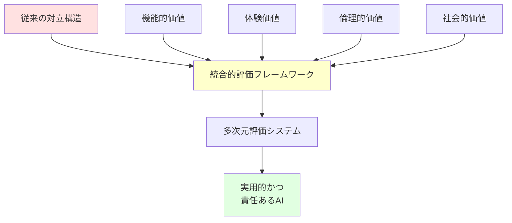

**統合の実例：自動運転AI**

| 評価軸 | 具体的指標 | 重要度 |
|--------|-----------|--------|
| 機能的価値 | 障害物回避率99.9% | ⭐⭐⭐⭐⭐ |
| 安全性（倫理） | 歩行者優先プログラム | ⭐⭐⭐⭐⭐ |
| 体験価値 | 乗り心地の快適さ | ⭐⭐⭐ |
| 環境価値 | CO2排出削減 | ⭐⭐⭐⭐ |

**結論：競合ではなく補完関係へ**
- 機能的価値は「土台」
- 他の価値は「上乗せ」
- 全てが揃って初めて成功するAI

---

## 🌍 社会への影響と未来

### 🌊 実世界への影響

#### 1️⃣ **産業構造の変革**

```mermaid
graph LR
    A[機能的価値の明確化] --> B[AI導入の加速]
    B --> C[産業の自動化]
    C --> D[労働市場の変化]
    
    D --> E[新しい仕事の創出]
    D --> F[既存職種の変容]
    
    style A fill:#e1f5ff
    style E fill:#e1ffe1
    style F fill:#ffe1e1
```

**具体的な変化：**

| 業界 | 変化の内容 | 影響度 |
|------|-----------|--------|
| 製造業 | 検査工程の完全自動化 | 🔴🔴🔴🔴🔴 |
| 医療 | 診断支援で医師の役割変化 | 🔴🔴🔴🔴 |
| 小売 | レジ無人化、在庫管理AI化 | 🔴🔴🔴🔴 |
| 金融 | 審査・取引の自動化 | 🔴🔴🔴🔴🔴 |
| 教育 | 個別指導の民主化 | 🔴🔴🔴 |

#### 2️⃣ **意思決定の科学化**

**昔の企業会議：**
- 役員A：「AIに投資すべきだ！」
- 役員B：「いや、リスクが大きい」
- 社長：「うーん...」（感覚で決定）

**今の企業会議：**
- データ部門：「このAIは業務効率30%向上、投資回収1.5年」
- 全員：「数字で見えるね、GO!」

```mermaid
graph TD
    A[機能的価値の定量化] --> B[投資判断の客観化]
    B --> C[失敗リスクの低減]
    C --> D[AI導入の普及]
    
    D --> E[経済全体の生産性向上]
    
    style A fill:#e1f5ff
    style E fill:#e1ffe1
```

#### 3️⃣ **教育システムへの影響**

**変化の波：**

| 従来の教育 | 新しい教育 |
|-----------|----------|
| 「AIは夢の技術」 | 「AIの機能と限界を理解する」 |
| 技術者だけが学ぶ | 全員がリテラシーを持つ |
| 理論中心 | 実用評価能力の育成 |

**具体例：カリキュラムの変化**
- 📚 小学生：「AIができること・できないこと」
- 🎓 中学生：「AIの性能を比較してみよう」
- 🔬 高校生：「機能的価値を測定する実験」

#### 4️⃣ **格差問題の両面性**

```mermaid
graph TD
    A[機能的価値評価の普及] --> B{影響}
    
    B --> C[ポジティブ]
    B --> D[ネガティブ]
    
    C --> E[中小企業もAI導入可能]
    C --> F[途上国でも活用]
    
    D --> G[評価能力の格差]
    D --> H[デジタルデバイド拡大]
    
    style C fill:#e1ffe1
    style D fill:#ffe1e1
```

**ポジティブな影響：**
- ✅ 安価で高性能なAIの普及（機能が明確だから選びやすい）
- ✅ 地方や途上国でも先進技術利用可能

**ネガティブな影響：**
- ❌ AI評価能力がない企業は取り残される
- ❌ 技術リテラシーの格差が経済格差に直結

### 🔮 未来展望

#### 📈 短期的展望（2025-2030年）

```mermaid
timeline
    title 機能的価値評価の発展予測
    2025年 : 標準化の進展 : 業界共通の評価基準確立
    2027年 : AI性能表示義務化 : 消費者保護法の整備
    2030年 : リアルタイム評価 : AIが自己の性能を常時報告
```

**1. 評価基準の国際標準化**

現在の課題：
- 企業ごとに評価方法がバラバラ
- 比較が困難

未来の姿：
- ISO規格でAI性能表示が統一
- 「AIの栄養成分表示」のような義務化

**例：商品ラベルのイメージ**
```
【AI性能表示】
名称：画像認識AI
精度：95.2%（標準テスト）
速度：0.1秒/枚
適用範囲：屋内・自然光
制約事項：暗所・逆光では精度低下
最終更新：2025年10月
```

**2. 動的評価システムの登場**

```mermaid
graph LR
    A[AIシステム] --> B[性能モニタリング]
    B --> C[リアルタイム評価]
    C --> D[自動アラート]
    
    D --> E[精度低下検知]
    D --> F[異常動作検知]
    
    E --> G[自動調整or人間へ通知]
    F --> G
    
    style C fill:#e1f5ff
    style G fill:#ffe1e1
```

従来：開発時に1回評価 → 運用中は性能劣化に気づかない

未来：運用中も常時監視 → 性能低下を即座に検知・対応

**3. AI選択支援サービスの普及**

```mermaid
graph TD
    A[企業のニーズ入力] --> B[AI推薦システム]
    
    C[必要な機能] --> B
    D[予算] --> B
    E[技術レベル] --> B
    
    B --> F[最適AIの提案]
    B --> G[導入効果の予測]
    
    style B fill:#e1f5ff
    style F fill:#e1ffe1
```

**サービスのイメージ：**
- 「うちの工場に合う検査AIは？」
- → 3つの候補を性能・コスト・導入難易度で比較提示
- → 投資回収期間も自動計算

#### 🌟 中長期的展望（2030-2040年）

**1. 「機能の商品化」の加速**

```mermaid
graph TD
    A[AI機能のモジュール化] --> B[機能の売買市場]
    
    B --> C[翻訳機能：月額100円]
    B --> D[画像認識：従量課金]
    B --> E[予測分析：成果報酬]
    
    C --> F[誰でもAI活用可能]
    D --> F
    E --> F
    
    style B fill:#e1f5ff
    style F fill:#e1ffe1
```

**未来のシナリオ：**
- 小さなカフェでも高度なAI活用
- 「翻訳機能」「需要予測」「顧客分析」を月額数百円で利用
- 機能的価値が明確だから、必要な機能だけ選べる

**2. AI評価の自動化・AI化**

```mermaid
graph LR
    A[AI評価AI] --> B[新しいAIの性能評価]
    B --> C[多様な環境でテスト]
    C --> D[レポート自動生成]
    
    D --> E[開発者]
    D --> F[ユーザー]
    D --> G[規制当局]
    
    style A fill:#e1f5ff
```

**革新的な変化：**
- AIがAIを評価する時代
- 人間の評価コスト激減
- より多様で徹底的なテストが可能に

**3. 「適応的機能価値」の実現**

```mermaid
graph TD
    A[ユーザーの使用状況] --> B[AI自己学習]
    B --> C[個別最適化]
    
    C --> D[ユーザーAには高精度モード]
    C --> E[ユーザーBには高速モード]
    
    D --> F[満足度向上]
    E --> F
    
    style B fill:#e1f5ff
    style F fill:#e1ffe1
```

**未来の姿：**
- AIが使用者に合わせて機能を調整
- 「あなた専用の機能的価値」を提供
- 万人向けから個別最適化へ

#### 🎯 究極のビジョン（2040年代〜）

**「透明で信頼できるAI社会」**

```mermaid
mindmap
  root((2040年代のAI社会))
    完全な透明性
      全AIの性能が公開
      リアルタイム監視
      トレーサビリティ確保
    民主的アクセス
      誰でも必要な機能を利用
      格差の最小化
      教育の普及
    責任ある開発
      機能と倫理の両立
      人間中心設計
      持続可能性
    継続的進化
      自己改善システム
      フィードバックループ
      集合知の活用
```

**実現される世界：**

1. **AIの「見える化」完成**
   - すべてのAIが自己の能力を正確に報告
   - 「できること」「できないこと」が一目瞭然
   - 誇大広告や過度な期待が消滅

2. **機能的価値の民主化**
   - 大企業も中小企業も同等のAI活用
   - 先進国も途上国も技術格差縮小
   - 個人でも高度なAI機能を利用可能

3. **人間とAIの適切な役割分担**
   - AIは「できること」に専念
   - 人間は創造性や感情面に注力
   - 相互補完で社会全体が発展

---

## 🎓 学習のまとめ

### 📝 重要ポイント振り返り

```mermaid
graph TD
    A[機能的価値] --> B[3つの柱]
    
    B --> C[実用的能力<br/>何ができるか]
    B --> D[性能指標<br/>どれくらい正確か]
    B --> E[適用範囲<br/>どこで使えるか]
    
    C --> F[実社会での成功]
    D --> F
    E --> F
    
    style A fill:#e1f5ff
    style F fill:#e1ffe1
```

#### ✅ これだけは覚えておこう

1. **機能的価値とは**
   - AIの「実際の使い勝手」を測る物差し
   - 夢や理論ではなく、現実の能力評価

2. **なぜ重要か**
   - 投資判断の根拠になる
   - 失敗リスクを減らせる
   - ユーザーの期待値を適切に設定できる

3. **評価の3本柱**
   - できること（能力）
   - どれくらい上手か（性能）
   - どこで使えるか（適用範囲）

4. **未来への展望**
   - 標準化が進む
   - 誰でもAIを評価・活用できる時代へ
   - 透明性と信頼性の向上

### 🚀 次のステップ

**初学者のあなたへのアドバイス：**

```mermaid
graph LR
    A[今ここ] --> B[実例を観察]
    B --> C[評価方法を学ぶ]
    C --> D[自分で評価してみる]
    
    style A fill:#e1f5ff
    style D fill:#e1ffe1
```

#### 📚 推奨学習パス

1. **レベル1：日常観察**
   - 使っているAIサービスを意識する
   - 「これは何ができるのか？」と問いかける
   - 性能の良し悪しを感じ取る

2. **レベル2：比較分析**
   - 同じ機能の異なるAIを比較
   - ニュースでAIの性能発表を読む
   - 「なぜこのAIが選ばれたのか」を考える

3. **レベル3：実践評価**
   - 簡単なAIツールを使ってみる
   - 自分なりの評価基準を作る
   - 改善点を考えてみる

4. **レベル4：創造応用**
   - 「こんなAIがあったら」と発想する
   - 必要な機能的価値を定義してみる
   - 実現可能性を検討する

---

