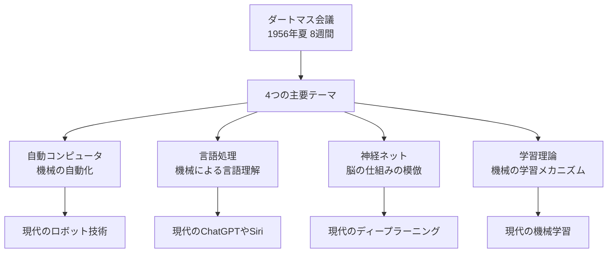
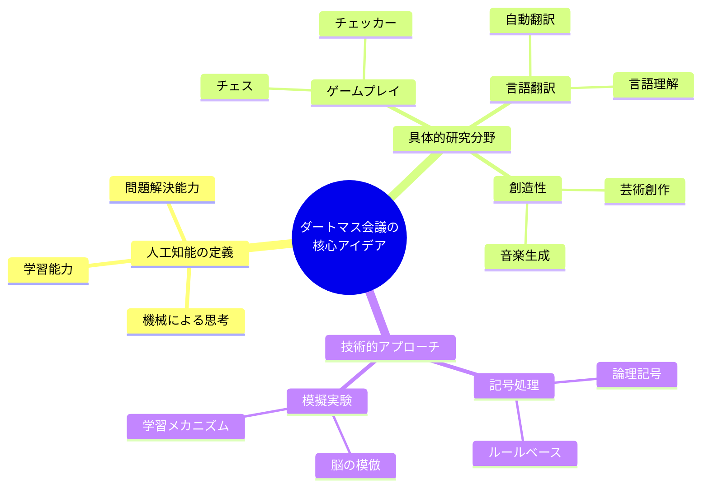
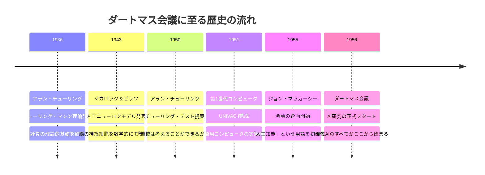
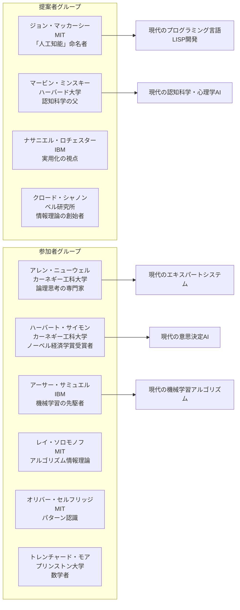
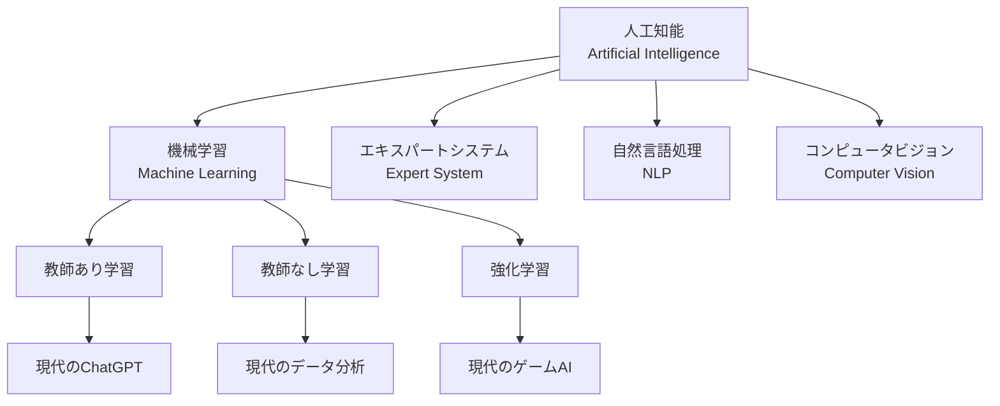
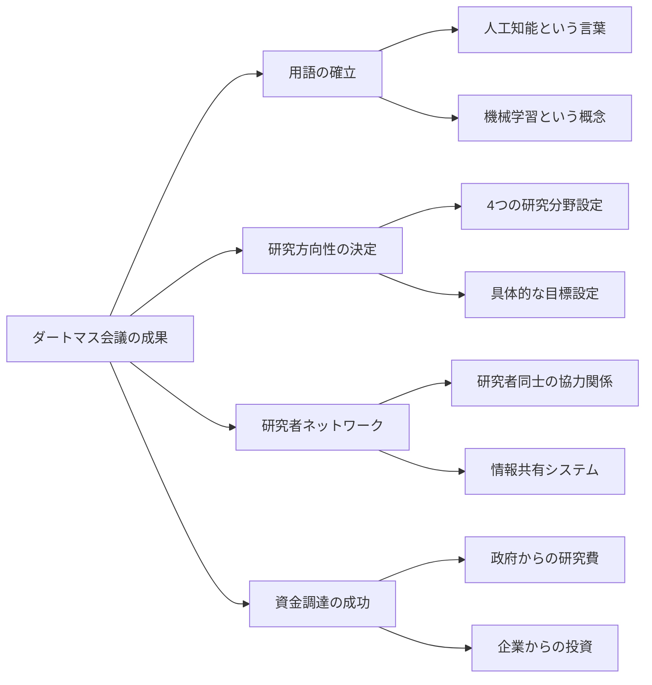
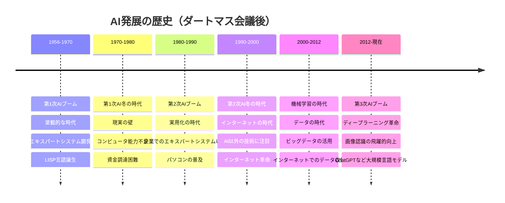
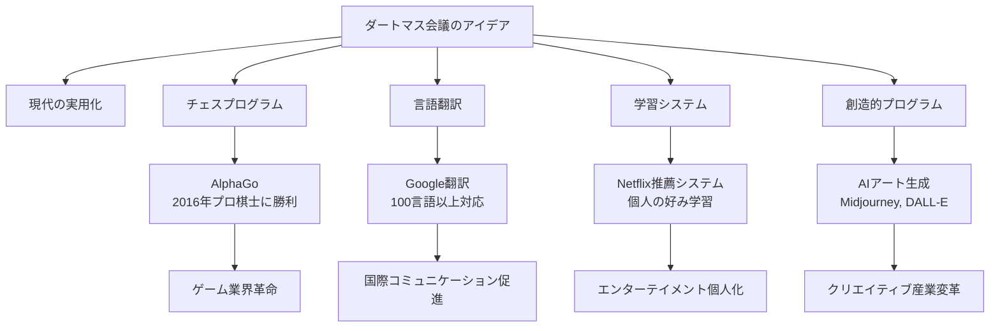
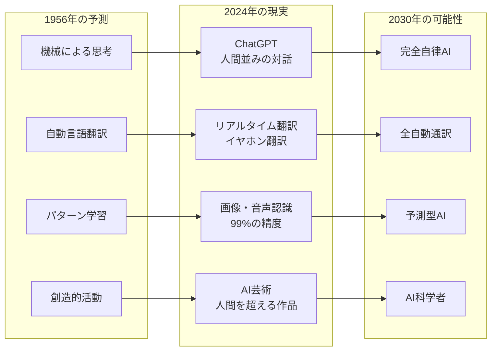
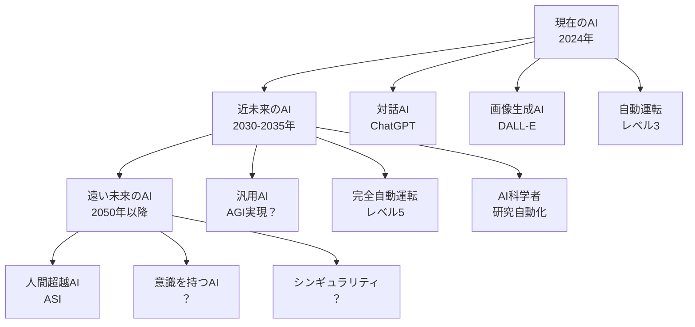

ダートマス会議
# ダートマス会議 - 初学者のための完全ガイド

## 🔍 一言要約
**人工知能という言葉が生まれた歴史的瞬間**

## 📚 目次

1. [🌟 はじめに](#-はじめに)
2. [🏗️ 会議の基本構造](#-会議の基本構造)
3. [⚡ 主要な提案と議論](#-主要な提案と議論)
4. [📜 時代背景と開催に至った経緯](#-時代背景と開催に至った経緯)
5. [🎨 参加者の特徴と役割分担](#-参加者の特徴と役割分担)
6. [📗 関連する用語](#-関連する用語)
7. [💡 会議の成果と限界](#-会議の成果と限界)
8. [🚀 会議後の発展と実用化](#-会議後の発展と実用化)
9. [🌍 現代への影響とその後の発展](#-現代への影響とその後の発展)

## 🌟 はじめに

想像してください。1956年の夏、アメリカの小さな大学町で、10人ほどの学者たちが「機械に人間のような知能を持たせることは可能か？」という壮大な夢について真剣に語り合いました。

この会議こそが「**ダートマス会議**」です。スマートフォンのSiri、自動運転車、ChatGPTなど、今私たちが当たり前に使っているAI技術すべての出発点となった、まさに「人工知能の誕生日」と呼べる歴史的瞬間でした。

## 🏗️ 会議の基本構造

**会議の基本情報**
- **開催期間**: 1956年6月20日〜8月17日（約8週間）
- **場所**: アメリカ・ニューハンプシャー州ダートマス大学
- **参加者**: 10名の研究者（数学者、心理学者、コンピュータ科学者）
- **目標**: 機械に人間のような知能を持たせる方法を探る

## ⚡ 主要な提案と議論

### 🧠 核心的なアイデア

**4つの主要研究テーマ**

1. **自動コンピュータ（オートマトン）**
   - 今で言う「ロボット」や「自動化システム」
   - 人間の指示なしに作業を続ける機械

2. **言語処理**
   - 機械による言語の理解と生成
   - 現在のGoogle翻訳やChatGPTの原点

3. **神経ネットワーク**
   - 人間の脳の神経細胞の働きを機械で再現
   - 現在のAIの中核技術

4. **学習と創造性**
   - 機械が経験から学ぶ方法
   - 芸術や音楽の創作可能性

## 📜 時代背景と開催に至った経緯

### 🕰️ 時代の流れ

**なぜこの時期だったのか？**

1950年代は「コンピュータ革命」の始まりでした。第二次世界大戦中に軍事目的で開発されたコンピュータが、ようやく科学研究に使えるようになった時代です。

- **戦争の影響**: 暗号解読や弾道計算でコンピュータの威力を実感
- **コンピュータの普及**: 大学や研究機関にコンピュータが導入開始
- **楽観的な時代**: 「科学技術でなんでも解決できる」という雰囲気
- **資金の確保**: 冷戦下でアメリカ政府がハイテク研究に積極投資

## 🎨 参加者の特徴と役割分担

### 👥 10人の革命家たち

**それぞれの専門分野と貢献**

| 参加者 | 専門分野 | 会議での貢献 | 現代への影響 |
|--------|----------|--------------|--------------|
| マッカーシー | 数学・論理学 | AI用語の創造 | プログラミング言語LISP |
| ミンスキー | 心理学・数学 | 認知モデル提案 | 現代の認知科学 |
| ニューウェル&サイモン | 心理学・経営学 | 論理思考プログラム | エキスパートシステム |
| サミュエル | コンピュータ科学 | 機械学習デモ | 現代の機械学習 |

## 📗 関連する用語

### 🔤 基本用語の理解

**人工知能 (Artificial Intelligence)**
- **意味**: 人間の知能をコンピュータで再現する技術
- **日常例**: スマホの音声認識、おすすめ機能、自動運転
- **同義語**: AI、機械知能
- **対義語**: 人間知能、自然知能

**機械学習 (Machine Learning)**
- **意味**: コンピュータがデータから自動で学ぶ仕組み
- **日常例**: 迷惑メール判定、写真の自動分類
- **関係**: AI の一部分野

**エキスパートシステム (Expert System)**
- **意味**: 専門家の知識をコンピュータに組み込んだシステム
- **日常例**: 医療診断支援、法律相談アプリ
- **特徴**: if-then ルールを大量に組み合わせ

**記号処理 (Symbolic Processing)**
- **意味**: 文字や記号を使った論理的な情報処理
- **対比**: 数値計算とは異なるアプローチ
- **現代例**: プログラミング言語、データベース検索

### 📊 用語の関係図

## 💡 会議の成果と限界

### ✅ 主な成果

**具体的な成果**

1. **「人工知能」という言葉の誕生**
   - それまで統一された呼び名がなかった分野に正式名称
   - 世界共通の学術用語として定着

2. **研究分野の体系化**
   - バラバラだった研究を4つの分野に整理
   - 現在のAI研究の基本構造を確立

3. **楽観的な未来予測**
   - 「20年以内に人間レベルのAI実現」という目標設定
   - 研究者や投資家の関心を集める

4. **実用的なプログラム開発**
   - チェッカー（日本の将棋のような）ゲームを学習するプログラム
   - 簡単な数学定理証明プログラム

### ❌ 限界と課題

**過度な楽観主義**
- 「2、30年で人間並みのAI完成」→ 実際は70年経っても道半ば
- コンピュータの能力を過大評価
- 人間の知能の複雑さを過小評価

**技術的限界**
- 1950年代のコンピュータは計算速度が遅すぎ
- メモリ容量が極端に小さい（現在のスマホの100万分の1以下）
- インターネットなし→情報共有が困難

**理論的課題**
- 「知能とは何か」の定義が不明確
- 人間の学習メカニズムの理解不足
- 創造性や直感の扱い方が不明

## 🚀 会議後の発展と実用化

### 📈 時代別発展段階

### 🌟 現代への応用例

**身近な実用例**

| 分野 | 1956年のアイデア | 現代の実現例 | 使用場面 |
|------|------------------|--------------|----------|
| ゲーム | チェス・チェッカー | ゲームAI、eスポーツ | ゲーム相手、戦略分析 |
| 言語 | 自動翻訳 | Google翻訳、DeepL | 海外旅行、国際ビジネス |
| 学習 | パターン認識 | 推薦システム | Netflix、Amazon、YouTube |
| 創造 | 芸術創作 | AI絵画、作曲 | デザイン、音楽制作 |
| 判断 | 専門家システム | 医療診断AI | 病気の早期発見 |

## 🌍 現代への影響とその後の発展

### 🔮 ダートマス会議の預言的側面

### 🌐 社会への影響マップ

**経済への影響**
- **職業の変化**: 単純作業の自動化 → 創造的職業の重要性向上
- **新産業創出**: AI関連企業（Google, OpenAI等）が世界最大企業に
- **生産性向上**: 製造業、サービス業の効率化

**教育への影響**
- **学習方法の変革**: 個人最適化された学習システム
- **教師の役割変化**: 知識伝達 → 思考力育成
- **新しいスキル需要**: AI理解、データ分析能力

**日常生活への影響**
- **スマートホーム**: 音声操作、自動制御
- **移動革命**: 自動運転車、ルート最適化
- **健康管理**: ウェアラブルデバイス、健康予測

**社会問題と課題**
- **雇用問題**: AIによる職業代替の不安
- **プライバシー**: 個人情報の大量収集・分析
- **AI格差**: AI活用できる人・企業・国とそうでない場合の格差拡大

### 🚀 未来への展望

**ダートマス会議参加者たちの現在の評価**

彼らが1956年に描いた夢の多くが、実際に2020年代に現実となりました。ただし、予想より70年もかかったことで、「AI開発の難しさ」と「人間の知能の奥深さ」が改めて明らかになりました。

**現代に生きる私たちへのメッセージ**

ダートマス会議が教えてくれることは、「大きな夢を持つこと」と「長期的な視点で取り組むこと」の重要性です。参加者の多くはその後50年以上AI研究を続け、現在のAI革命の基礎を築きました。

---

## 🎯 学習の次のステップ

この資料を読んだ後、さらに学びたい方におすすめの順序：

1. **[人工知能の基礎概念](/docs/ai-basics.md)** - AIの基本的な仕組み
2. **[機械学習入門](/docs/machine-learning-intro.md)** - コンピュータの学習方法
3. **[現代AI技術の種類](/docs/modern-ai-types.md)** - 今使われているAI技術
4. **[AI倫理と社会問題](/docs/ai-ethics.md)** - AIと人間社会の関係

---

初学者がダートマス会議の歴史的意義から現代AI技術までを体系的に理解できる包括的資料として設計しました。
