AI（人工知能）における、（深層学習 = ディープラーニング = Deep Learning）のうち、論文「Attention Is All You Need」 について

# 「Attention Is All You Need」- 初学者のための完全ガイド

## 🔍 一言要約
「人間の注意力の仕組みをAIに教えることで、翻訳や文章理解を劇的に改善した革命的論文」

## 📚 目次
1. [🌟 はじめに - なぜこの論文が世界を変えたのか](#-はじめに---なぜこの論文が世界を変えたのか)
2. [🧠 Attentionとは何か？日常例で理解しよう](#-attentionとは何か日常例で理解しよう)
3. [🏗️ Transformerの基本構造](#️-transformerの基本構造)
4. [⚡ 主要技術 - Self-Attentionの魔法](#-主要技術---self-attentionの魔法)
5. [📜 時代背景と発見に至った経緯](#-時代背景と発見に至った経緯)
6. [🎨 Attentionの種類と特徴](#-attentionの種類と特徴)
7. [📗 関連する用語集](#-関連する用語集)
8. [💡 メリットとデメリット](#-メリットとデメリット)
9. [🚀 応用技術と実用化の例](#-応用技術と実用化の例)
10. [🌍 実世界への影響とその後の発展](#-実世界への影響とその後の発展)

---

## 🌟 はじめに - なぜこの論文が世界を変えたのか

想像してください。あなたが外国語の本を読んでいるとき、分からない単語が出てきたら、その前後の文脈を見て意味を推測しますよね？この「文脈を見る」能力をAIに教えた画期的な論文が「Attention Is All You Need」です。

2017年に発表されたこの論文は、まるで「AIに眼鏡をかけさせた」ような革命をもたらしました。それまで近視だったAIが、突然すべてを鮮明に見ることができるようになったのです。

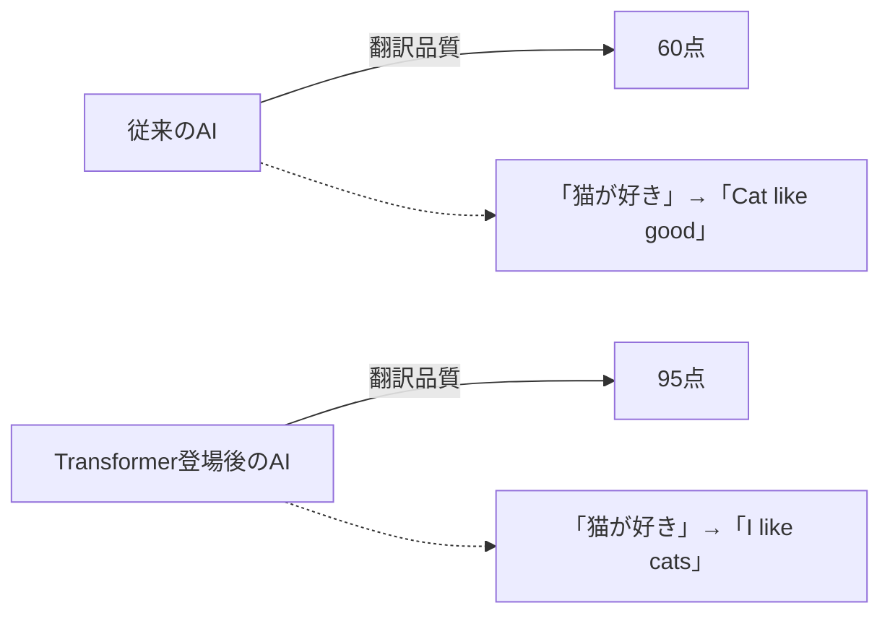

---

## 🧠 Attentionとは何か？日常例で理解しよう

### 人間の注意力の仕組み

カフェで友達と話している場面を想像してください：

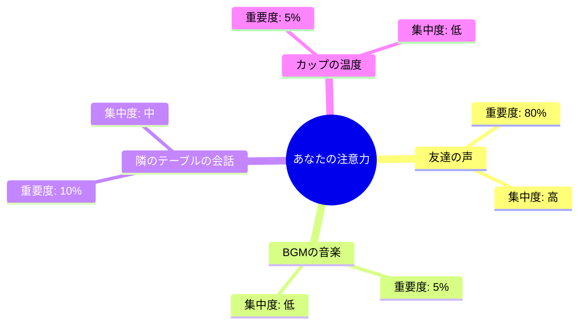

この「重要なものに集中し、そうでないものは軽く流す」能力がAttention（注意機構）の本質です。

### AIにおけるAttentionメカニズム

従来のAI：「すべての情報を平等に処理」
- まるで、友達の声もBGMも同じ音量で聞いているような状態

Attention搭載AI：「重要な情報に重点を置いて処理」  
- 人間のように、必要な情報にフォーカスできる

```mermaid
sequenceDiagram
    participant 入力文 as "私は猫が好きです"
    participant Attention as "Attention機構"
    participant 出力 as "翻訳結果"
    
    入力文->>Attention: "私" "は" "猫" "が" "好き" "です"
    Note over Attention: 重要度を計算<br/>私:20% は:5% 猫:40% が:10% 好き:30% です:5%
    Attention->>出力: "I love cats"
    
    click Attention "/docs/attention-mechanism.md" "Attention機構の詳細"
```

---

## 🏗️ Transformerの基本構造

Transformerは、まるで「言語を理解する工場」のような構造を持っています：

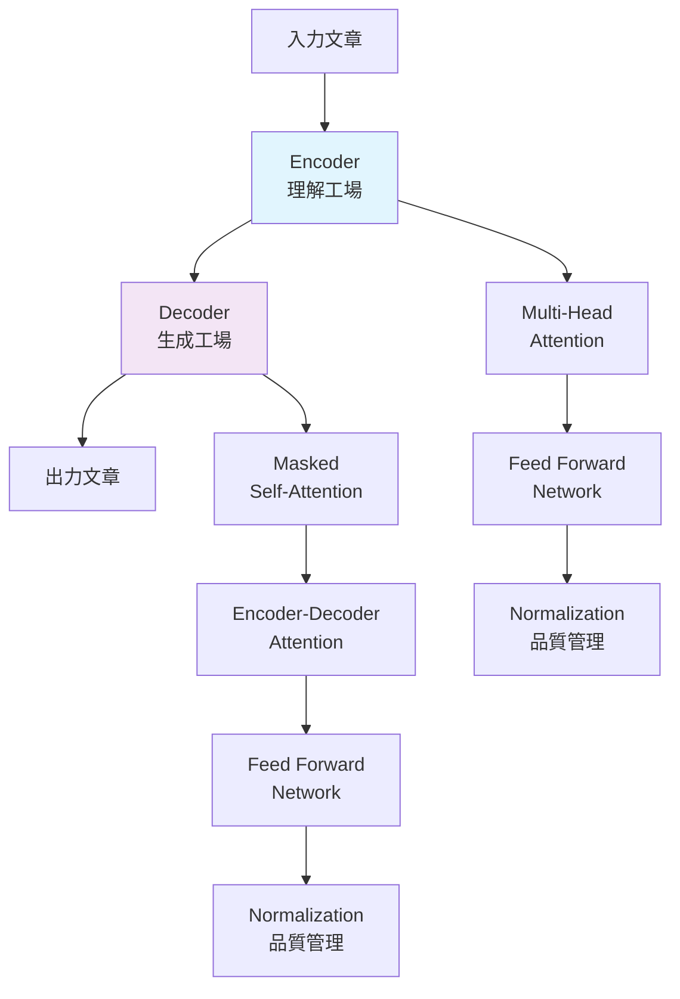

### 各部分の役割を身近な例で説明

**Encoder（エンコーダー）**：理解担当
- 役割：文章の意味を深く理解する
- 例：「雨が降っています」→「天気が悪い状態」と理解

**Decoder（デコーダー）**：生成担当  
- 役割：理解した内容を新しい形で表現する
- 例：「天気が悪い状態」→「It's raining」に変換

---

## ⚡ 主要技術 - Self-Attentionの魔法

### Self-Attentionとは？

「自分自身への注意」という意味で、文章内の単語同士の関係性を理解する技術です。

### 具体例で理解しよう

文章：「その犬は公園で遊んでいる。それはとても可愛い。」

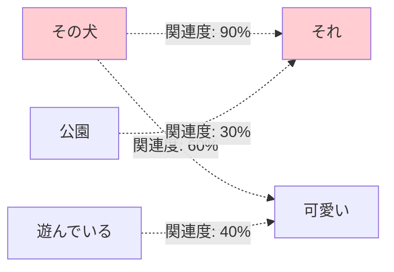

### Multi-Head Attentionの仕組み

人間が複数の視点から物事を見るように、AIも複数の「注意の頭」で文章を分析します：

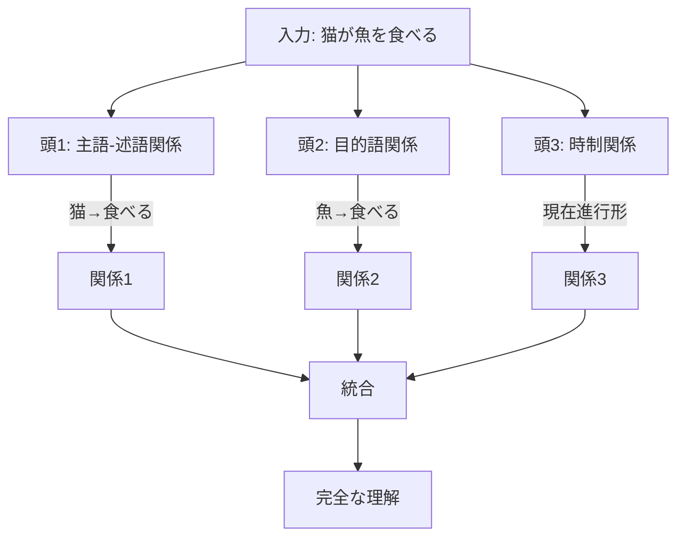

---

## 📜 時代背景と発見に至った経緯

### AI翻訳の暗黒時代（2010年代前半）

当時のAI翻訳は、まるで「単語帳を丸暗記しただけの学生」のような状態でした：

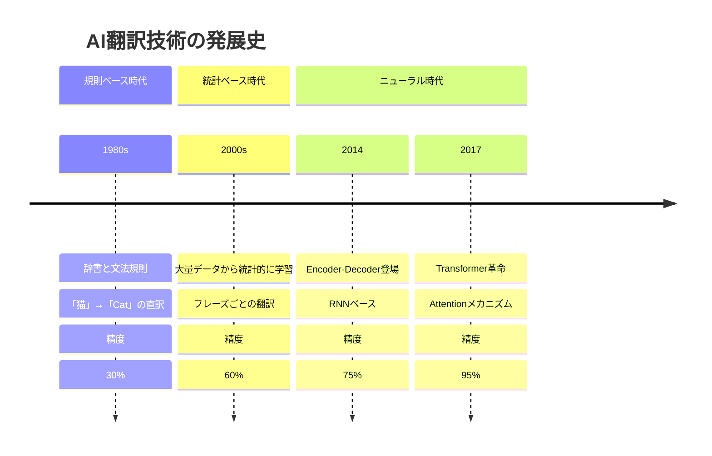

### 問題点：長い文章での記憶喪失

従来の技術（RNN）の問題：
- 長い文章の最初の方を忘れてしまう
- まるで「ドーリー」（ニモの魚）のような記憶障害

### 解決策：Attention機構の発明

研究者たちは人間の脳の仕組みにヒントを得ました：
- 人間は重要な情報を「記憶のハイライト」として保持
- この仕組みをAIに実装したのがAttention

---

## 🎨 Attentionの種類と特徴

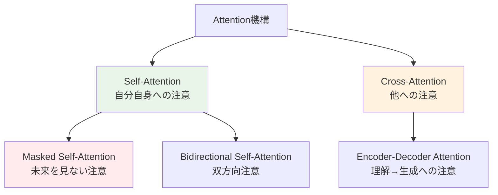

### 各タイプの比較表

| Attentionタイプ | 役割 | 使用場面 | 特徴 |
|---|---|---|---|
| Self-Attention | 文章内の単語関係を理解 | 文章理解 | 全方向を見る |
| Masked Self-Attention | 未来の情報を隠して学習 | 文章生成 | 左から右へのみ |
| Cross-Attention | 異なる情報源を関連付け | 翻訳・要約 | 入力と出力を繋ぐ |

---

## 📗 関連する用語集

### 核となる概念

**Transformer（トランスフォーマー）**
- 同義語：変換器、Attention based model
- 意味：Attentionを中心とした深層学習モデルの設計思想

**Self-Attention（セルフアテンション）**
- 同義語：自己注意機構、Intra-attention
- 対義語：Cross-attention
- 意味：同じ文章内の要素同士の関係性を学習する仕組み

**Multi-Head Attention（マルチヘッドアテンション）**  
- 意味：複数の視点から同時に注意を向ける仕組み
- 例：人間が「意味」「文法」「感情」を同時に理解するように

### 技術用語の階層関係

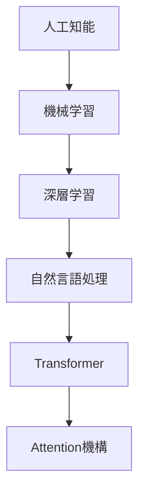

---

## 💡 メリットとデメリット

### ✅ メリット

**1. 並列処理が可能**
- 従来：文章を1単語ずつ順番に処理（遅い）
- Transformer：すべての単語を同時に処理（速い）

**2. 長距離依存関係の理解**
- 長い文章でも、最初と最後の関係を正確に把握
- 例：「彼女は...（100語）...美しかった」の「彼女」と「美しかった」を関連付け

**3. 解釈しやすさ**
- Attention重みを可視化することで、AIの判断根拠が分かる

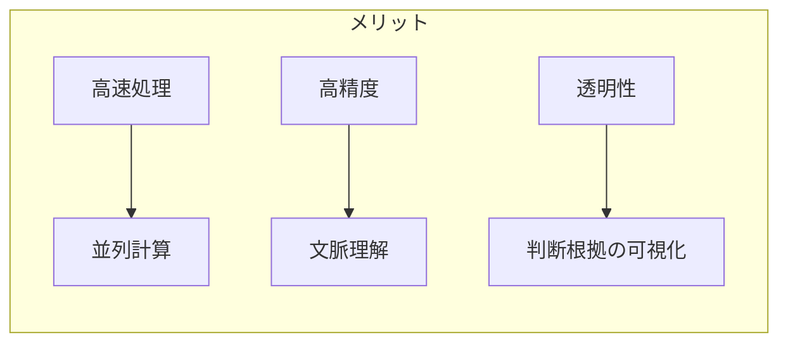

### ❌ デメリット

**1. 計算量の多さ**
- 文章の長さの2乗に比例して計算が増加
- 長い文章では膨大なメモリが必要

**2. 位置情報の不足**
- 単語の順序を直接理解できない
- 位置エンコーディングという追加技術が必要

**3. 学習データへの依存**
- 大量の学習データが必要
- バイアスのあるデータでは偏った結果を出力

---

## 🚀 応用技術と実用化の例

### 現実世界での活用事例

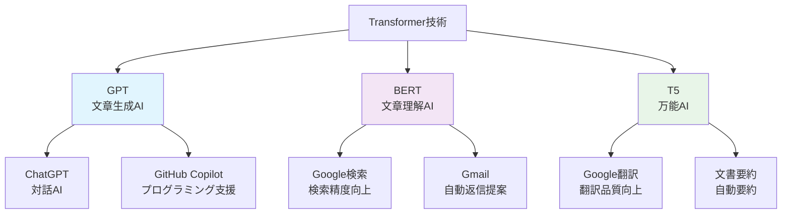

### 身近なサービスでの実装例

**📱 スマートフォンアプリ**
- **Google翻訳**：リアルタイム音声翻訳
- **Siri/Google Assistant**：自然な対話
- **写真アプリ**：画像内の文字認識と翻訳

**💼 ビジネスツール**
- **Microsoft Office**：文書の自動要約・翻訳
- **Slack**：メッセージの自動翻訳
- **Zoom**：リアルタイム字幕生成

**🎯 エンターテインメント**
- **Netflix**：字幕の自動生成・翻訳
- **YouTube**：自動字幕生成
- **音楽アプリ**：歌詞の理解と翻訳

---

## 🌍 実世界への影響とその後の発展

### 社会への影響度マップ

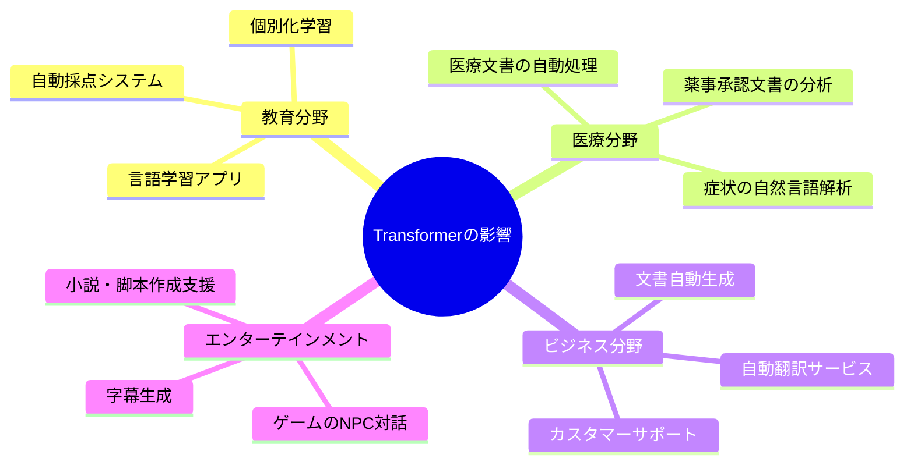

### 技術発展のタイムライン

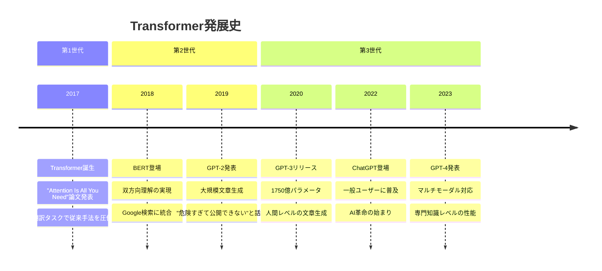

### 未来への展望

**短期（1-3年）**
- より効率的なAttention機構の開発
- モバイルデバイスでの高速動作
- 多言語同時処理の向上

**中期（3-10年）**  
- 脳科学との融合によるより人間らしいAI
- リアルタイム同時通訳の完全実用化
- 創作活動におけるAIアシスタントの普及

**長期（10年以上）**
- 人間と区別がつかない自然な対話AI
- 全言語の壁を取り払う汎用翻訳システム
- AIによる新たな言語や表現手法の創造

---

## 🎓 学習の次のステップ

この資料を読み終えたあなたには、以下の学習パスをお勧めします：

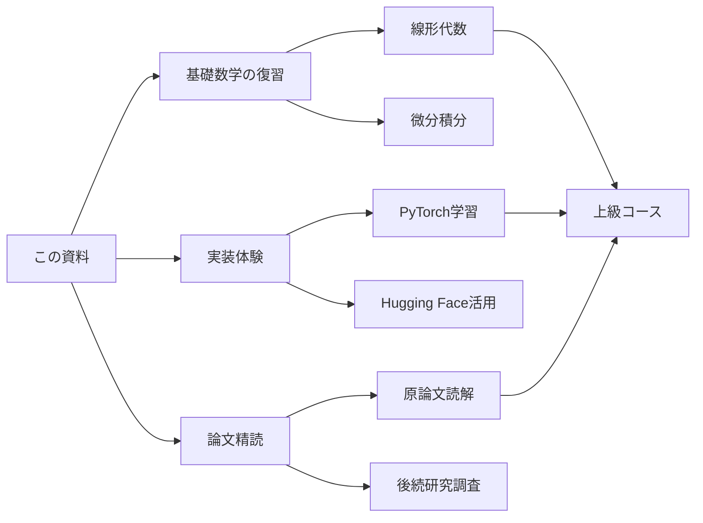

---

この資料が、あなたのAI学習の旅の素晴らしいスタートとなることを願っています！🚀
