AI（人工知能）における、（深層学習 = ディープラーニング = Deep Learning）のうち、注意機構（attention mechanism）について

# 注意機構（Attention Mechanism） - 初学者のための完全ガイド

## 🔍 一言要約
**AIが「大切な部分に集中する力」を手に入れた革命的技術**

## 📚 目次
1. [🌟 はじめに](#-はじめに)
2. [🏗️ 基本構造](#️-基本構造)
3. [⚡ 主要技術](#-主要技術)
4. [📜 時代背景と発見に至った経緯](#-時代背景と発見に至った経緯)
5. [🎨 種類と特徴](#-種類と特徴)
6. [📗 関連する用語](#-関連する用語)
7. [💡 メリットとデメリット](#-メリットとデメリット)
8. [🚀 応用と実例](#-応用と実例)
9. [🔄 置換、変遷](#-置換変遷)
10. [⚔️ 代替、競合](#️-代替競合)
11. [🌍 実世界への影響とその後の発展](#-実世界への影響とその後の発展)

## 🌟 はじめに

想像してみてください。あなたが図書館で重要な本を探しているとき、全ての本を同じ注意力で見るでしょうか？違いますよね。タイトルや目次、重要そうな章に**集中的に注意を向ける**はずです。

注意機構（Attention Mechanism）は、まさにこの人間の「注意を向ける能力」をAIに教えた画期的な技術です。従来のAIは「全ての情報を平等に扱う」という制限がありましたが、注意機構により「本当に大切な部分だけに集中する」ことが可能になりました。

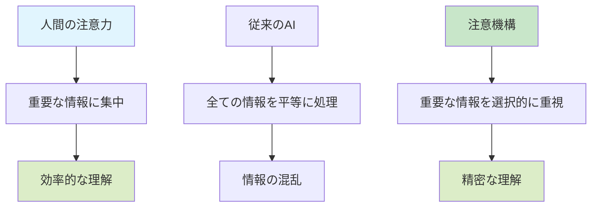

## 🏗️ 基本構造

注意機構の仕組みを、レストランの注文システムで例えてみましょう。

### 🍽️ レストラン注文システムとの比較

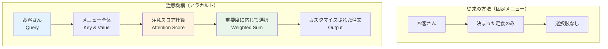

### 🧮 数学的な仕組み（わかりやすく）

注意機構は3つの要素で構成されています：

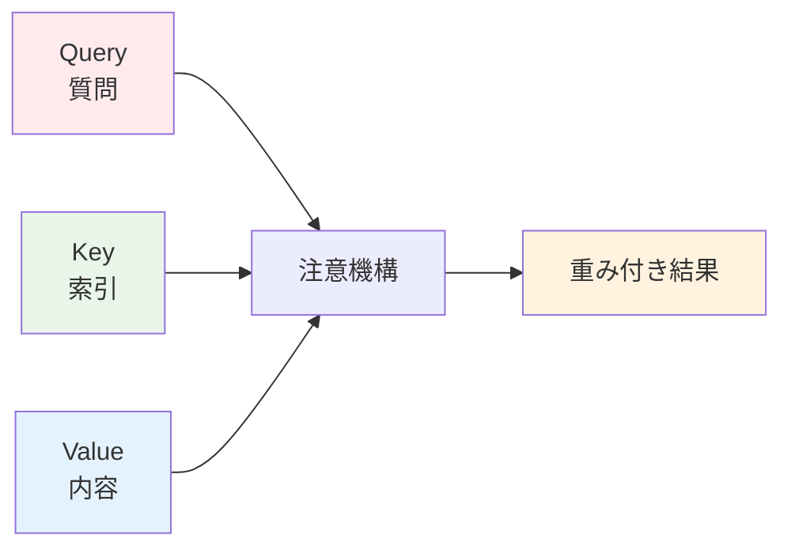

1. **Query（質問）**: 「何を探しているの？」
2. **Key（索引）**: 「これは何について？」
3. **Value（内容）**: 「実際の情報」

まるで図書館司書が、あなたの質問（Query）に対して、本の索引（Key）を確認し、最適な内容（Value）を提供してくれるようなものです。

## ⚡ 主要技術

### 🔍 注意スコアの計算

注意機構の心臓部分である「注意スコア」の計算を、採点システムで例えてみましょう：

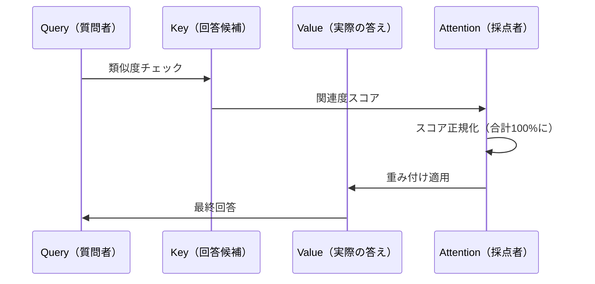

### 🎯 重要度の決定プロセス

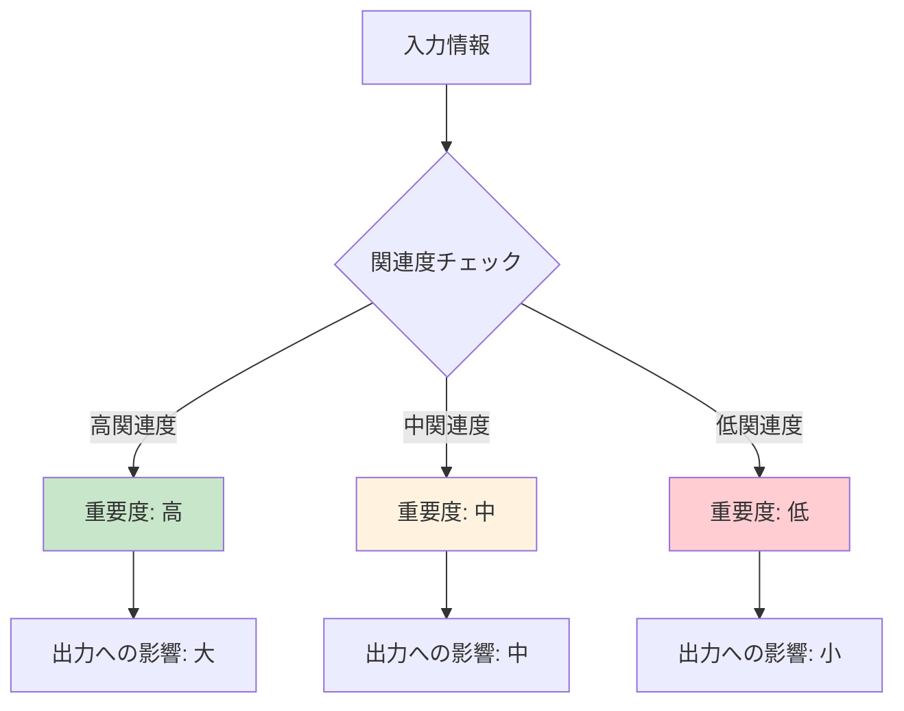

## 📜 時代背景と発見に至った経緯

### 🕰️ 注意機構誕生の物語

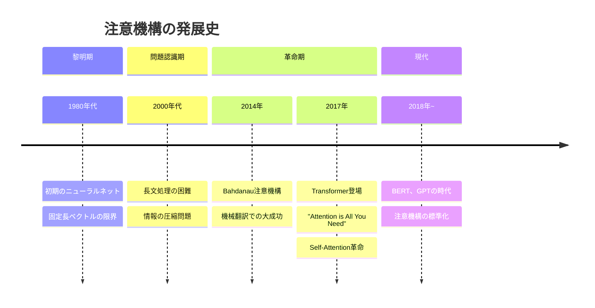

### 💡 発明のきっかけ

注意機構が生まれた背景には、**「情報の詰め込み問題」**がありました。

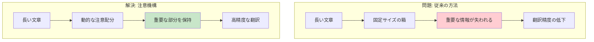

この発明により、「**長い文章でも重要な部分を忘れない**」AIが誕生しました。

## 🎨 種類と特徴

### 🌈 注意機構の種類

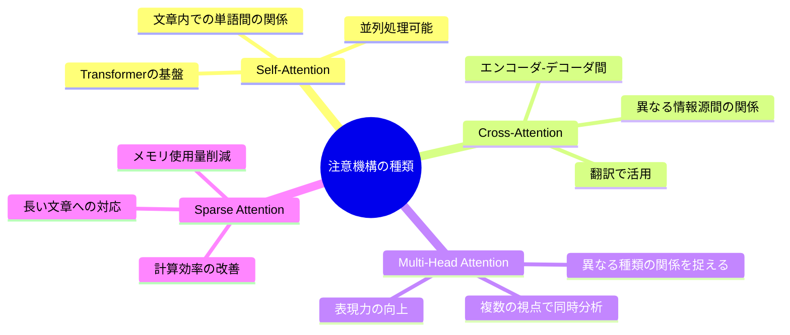

### 📊 特徴比較表

| 種類 | 特徴 | 用途 | 計算量 |
|------|------|------|--------|
| **Self-Attention** | 自分自身への注意 | 文章理解 | O(n²) |
| **Cross-Attention** | 異なる情報への注意 | 翻訳・要約 | O(n×m) |
| **Multi-Head** | 複数視点の注意 | 高度な理解 | O(h×n²) |
| **Sparse** | 選択的注意 | 長文処理 | O(n×k) |

## 📗 関連する用語

### 🔤 同義語・類義語
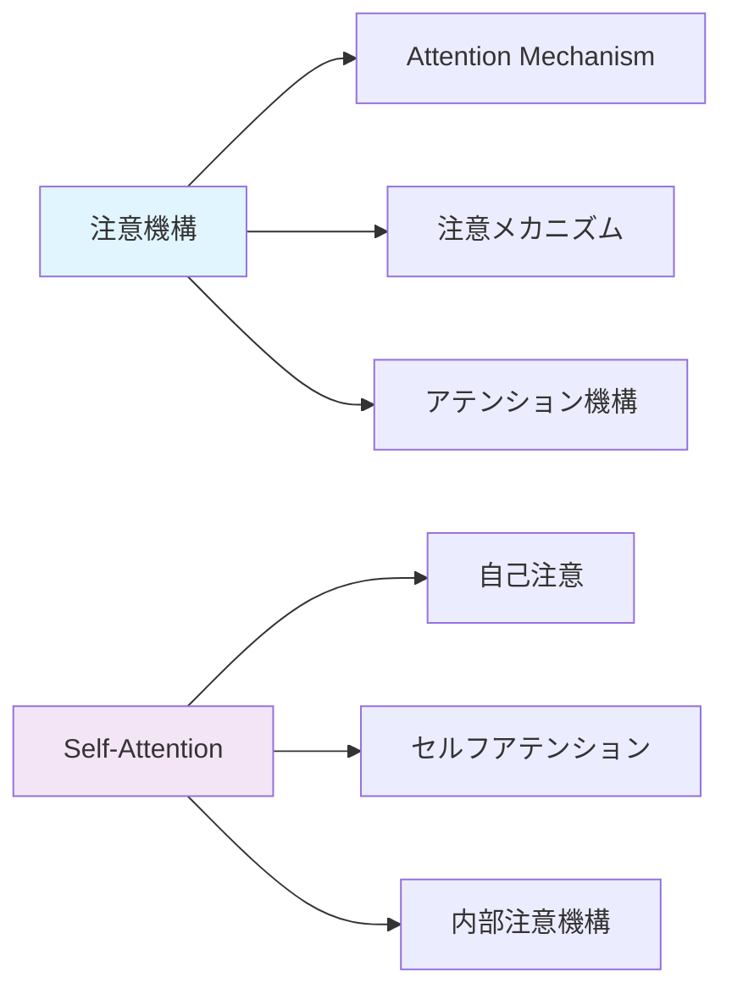

### 🔄 対義語・補完概念
- **注意機構** ↔ **均等重み付け**（全ての情報を同等に扱う）
- **動的注意** ↔ **静的処理**（固定されたパターンでの処理）
- **選択的集中** ↔ **全面的処理**（すべてを同時に処理）

### 📚 多義語の整理
「注意（Attention）」という言葉は文脈によって意味が変わります：

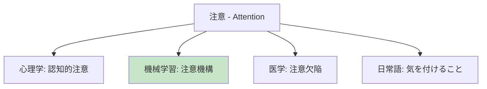

## 💡 メリットとデメリット

### ✅ メリット

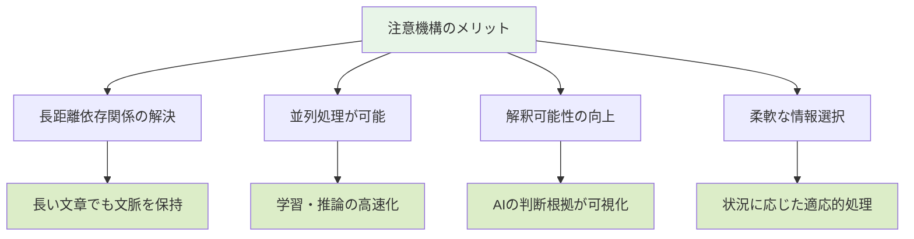

### ❌ デメリット

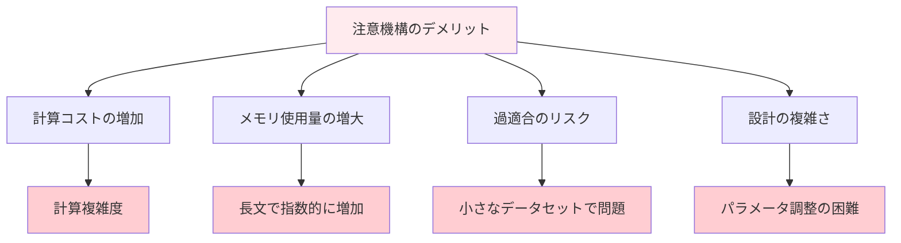

## 🚀 応用と実例

### 🌟 身近な実例

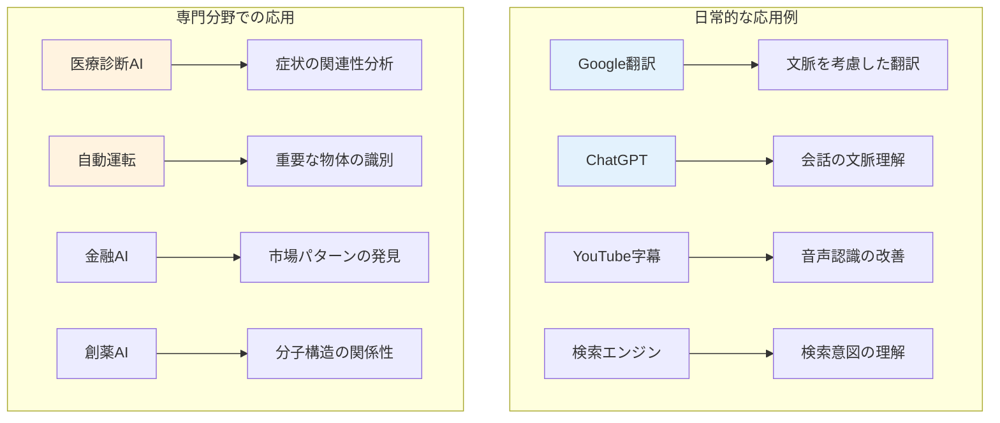

### 📱 具体的な使用例

1. **機械翻訳**: 「彼は銀行で働いている」→ 文脈から「bank（金融機関）」を選択
2. **文書要約**: 長い論文から重要な部分だけを抽出
3. **画像認識**: 写真の中で重要な物体に注意を集中
4. **音声認識**: 雑音の中から人の声に注意を向ける

## 🔄 置換、変遷

### 🔄 何を置き換えたか

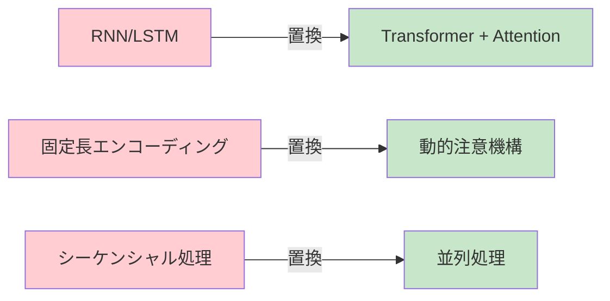

### 📈 何に置き換えられる可能性があるか

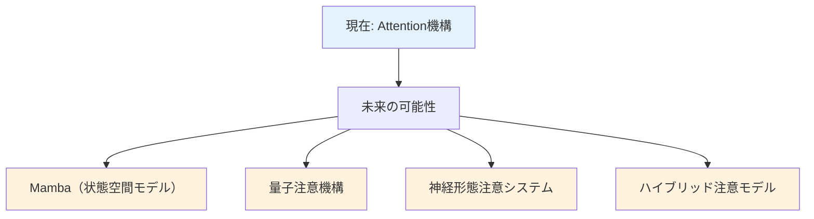

### 🔗 継承関係

**継承したもの**: 人間の認知的注意メカニズム
**継承されるもの**: 次世代AI システムの基盤技術

## ⚔️ 代替、競合

### 🔄 代替可能な技術

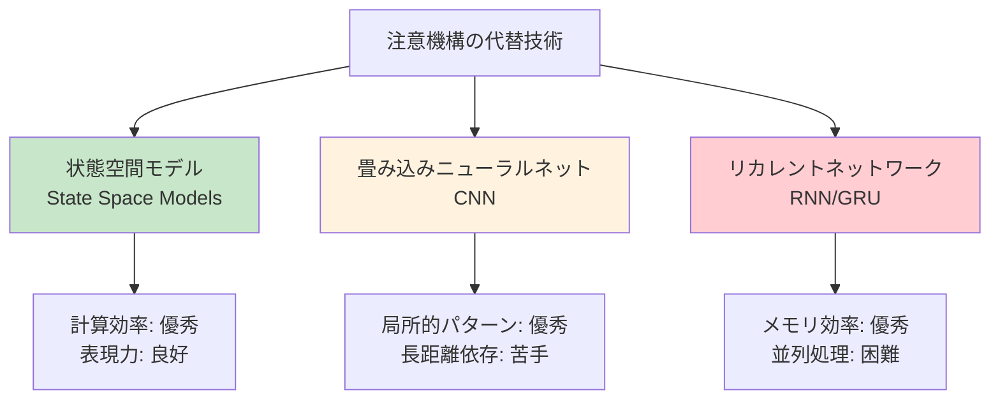

### ⚔️ 競合する技術分野

1. **効率性重視**: Mamba、RetNet
2. **専門特化**: CNN（画像）、RNN（時系列）
3. **ハイブリッド**: ConvLSTM、Transformer-XL

## 🌍 実世界への影響とその後の発展

### 🌟 社会への影響

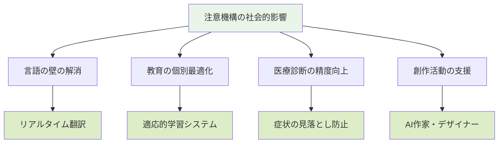

### 🚀 未来展望

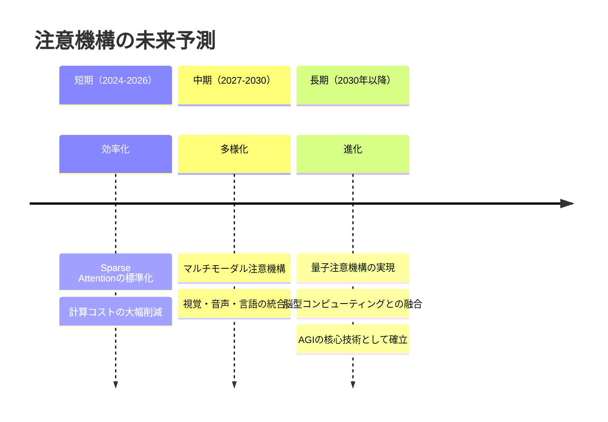

### 💡 研究開発の方向性

1. **効率性の改善**: より少ない計算で同じ性能を実現
2. **解釈可能性**: なぜその注意パターンになったかの説明
3. **多様性**: 異なる種類のデータ間での注意機構
4. **生物学的妥当性**: 人間の注意システムとの整合性

---

- 初学者が注意機構を体系的に理解できる包括的なガイドとして完成
