深層学習 = ディープラーニング = Deep Learning

# 深層学習 - 初学者のための完全ガイド

## 🔍 一言要約
人間の脳の仕組みを真似て、コンピュータに「考える力」を与える革命的技術

## 📚 目次
1. [🌟 はじめに](#はじめに)
2. [🧠 深層学習って何？](#深層学習って何)
3. [🏗️ 基本構造](#基本構造)
4. [⚡ 主要技術](#主要技術)
5. [📜 時代背景と発見に至った経緯](#時代背景と発見に至った経緯)
6. [🎨 種類と特徴](#種類と特徴)
7. [📗 関連する用語](#関連する用語)
8. [💡 メリットとデメリット](#メリットとデメリット)
9. [🚀 応用と実例](#応用と実例)
10. [🔄 置換、変遷](#置換変遷)
11. [⚔️ 代替、競合](#代替競合)
12. [🌍 実世界への影響とその後の発展](#実世界への影響とその後の発展)

## 🌟 はじめに

想像してみてください。あなたが友人の顔を一瞬で認識したり、母国語を自然に理解したりする能力を、コンピュータにも持たせることができたら？

深層学習（ディープラーニング）は、まさにそんな「夢」を現実にしている技術です。スマートフォンの顔認証、音声アシスタント、自動翻訳、自動運転車など、私たちの日常生活に既に深く根ざしています。

この技術は、人間の脳にある神経細胞（ニューロン）のネットワークを模倣して、コンピュータに「学習能力」を与える画期的な仕組みなのです。

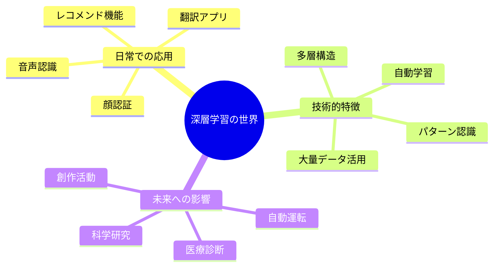
```mermaid
mindmap
  root((深層学習の世界))
    日常での応用
      顔認証
      音声認識
      翻訳アプリ
      レコメンド機能
    技術的特徴
      多層構造
      自動学習
      パターン認識
      大量データ活用
    未来への影響
      医療診断
      自動運転
      創作活動
      科学研究
```

## 🧠 深層学習って何？

深層学習を一言で表すなら、**「コンピュータが人間のように『経験』から学ぶ仕組み」**です。

### 人間の学習との比較

人間が新しいことを覚える過程を思い出してみてください：

1. **観察**：たくさんの例を見る（猫の写真を何百枚も見る）
2. **パターン発見**：共通点を見つける（三角の耳、ヒゲ、丸い瞳など）
3. **記憶**：特徴を頭に刻み込む
4. **応用**：新しい猫の写真を見た時に「これは猫だ！」と判断

深層学習も全く同じプロセスを踏みます：

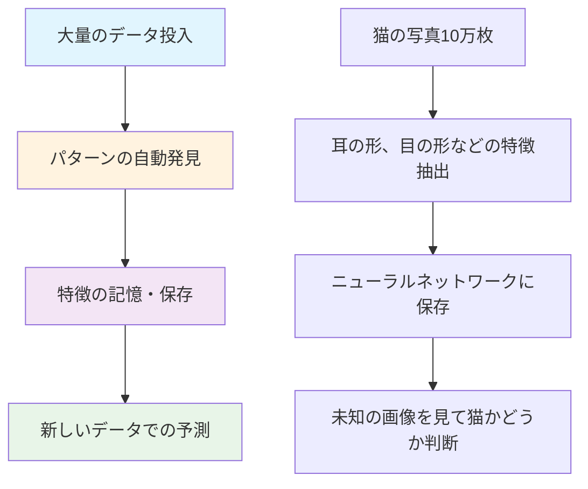
```mermaid
graph TD
    A[大量のデータ投入] --> B[パターンの自動発見]
    B --> C[特徴の記憶・保存]
    C --> D[新しいデータでの予測]
    
    A1[猫の写真10万枚] --> B1[耳の形、目の形などの特徴抽出]
    B1 --> C1[ニューラルネットワークに保存]
    C1 --> D1[未知の画像を見て猫かどうか判断]
    
    style A fill:#e1f5fe
    style B fill:#fff3e0
    style C fill:#f3e5f5
    style D fill:#e8f5e8
```

## 🏗️ 基本構造

深層学習の「脳」にあたる部分を**ニューラルネットワーク**と呼びます。これは人間の脳の神経回路を模した構造です。

### 人工ニューロン（神経細胞）

人間の脳には約1000億個の神経細胞があります。深層学習では、これを数学的にシンプルに再現した「人工ニューロン」を使います。

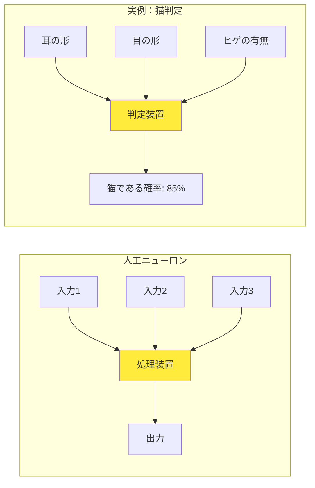
```mermaid
graph LR
    subgraph "人工ニューロン"
        Input1[入力1] --> Node[処理装置]
        Input2[入力2] --> Node
        Input3[入力3] --> Node
        Node --> Output[出力]
    end
    
    subgraph "実例：猫判定"
        Ear[耳の形] --> Judge[判定装置]
        Eye[目の形] --> Judge
        Whisker[ヒゲの有無] --> Judge
        Judge --> Result[猫である確率: 85%]
    end
    
    style Node fill:#ffeb3b
    style Judge fill:#ffeb3b
```

### 多層構造（深い＝Deep）

「深層」と呼ばれる理由は、これらのニューロンが何層にも重なっているからです：

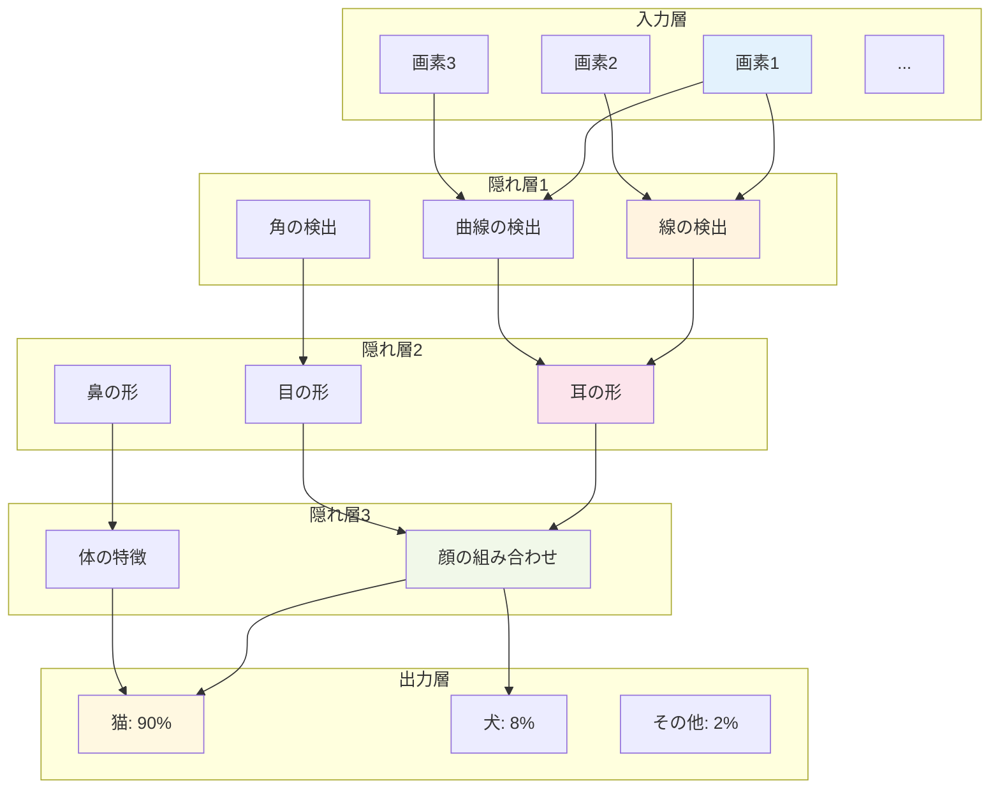
```mermaid
graph TD
    subgraph "入力層"
        I1[画素1] 
        I2[画素2]
        I3[画素3]
        I4[...]
    end
    
    subgraph "隠れ層1"
        H11[線の検出]
        H12[曲線の検出] 
        H13[角の検出]
    end
    
    subgraph "隠れ層2"
        H21[耳の形]
        H22[目の形]
        H23[鼻の形]
    end
    
    subgraph "隠れ層3"
        H31[顔の組み合わせ]
        H32[体の特徴]
    end
    
    subgraph "出力層"
        O1[猫: 90%]
        O2[犬: 8%]
        O3[その他: 2%]
    end
    
    I1 --> H11
    I2 --> H11
    I1 --> H12
    I3 --> H12
    
    H11 --> H21
    H12 --> H21
    H13 --> H22
    
    H21 --> H31
    H22 --> H31
    H23 --> H32
    
    H31 --> O1
    H32 --> O1
    H31 --> O2
    
    style I1 fill:#e3f2fd
    style H11 fill:#fff3e0
    style H21 fill:#fce4ec
    style H31 fill:#f1f8e9
    style O1 fill:#fff8e1
```

## ⚡ 主要技術

### 1. 畳み込みニューラルネットワーク（CNN）
**得意分野：画像認識**

人間の視覚野の仕組みを模倣した技術です。画像を小さな領域に分けて、少しずつ特徴を抽出していきます。

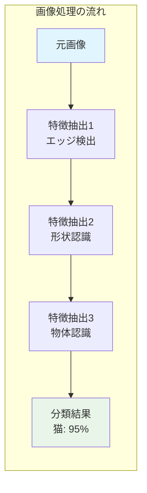
```mermaid
flowchart LR
    subgraph "画像処理の流れ"
        A[元画像] --> B[特徴抽出1<br/>エッジ検出]
        B --> C[特徴抽出2<br/>形状認識]
        C --> D[特徴抽出3<br/>物体認識]
        D --> E[分類結果<br/>猫: 95%]
    end
    
    style A fill:#e1f5fe
    style E fill:#e8f5e8
```

**身近な例：**
- スマホのカメラアプリで人物を自動認識
- Google フォトでの写真の自動分類
- 医療現場でのレントゲン画像診断

### 2. 再帰ニューラルネットワーク（RNN/LSTM）
**得意分野：時系列データ、言語処理**

人間が文章を読む時のように、前後の文脈を記憶しながら処理する技術です。

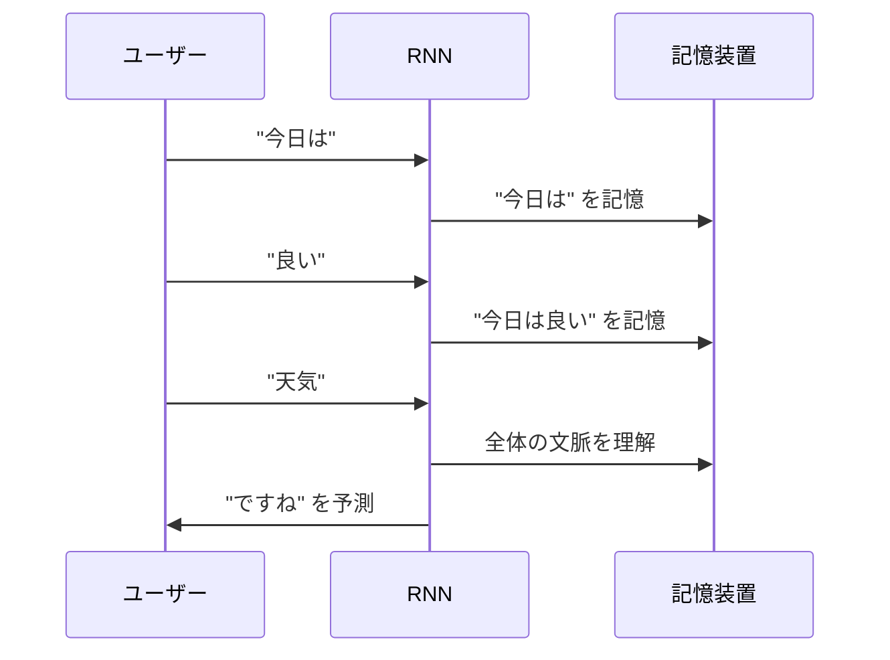
```mermaid
sequenceDiagram
    participant User as ユーザー
    participant RNN as RNN
    participant Memory as 記憶装置
    
    User->>RNN: "今日は"
    RNN->>Memory: "今日は" を記憶
    User->>RNN: "良い"  
    RNN->>Memory: "今日は良い" を記憶
    User->>RNN: "天気"
    RNN->>Memory: 全体の文脈を理解
    RNN->>User: "ですね" を予測
```

**身近な例：**
- Siriやアレクサなどの音声アシスタント
- Google翻訳での自然な翻訳
- 株価予測システム

### 3. 生成敵対的ネットワーク（GAN）
**得意分野：画像・音声・文章の生成**

「偽造師」と「警察官」が競い合うようなシステムです。

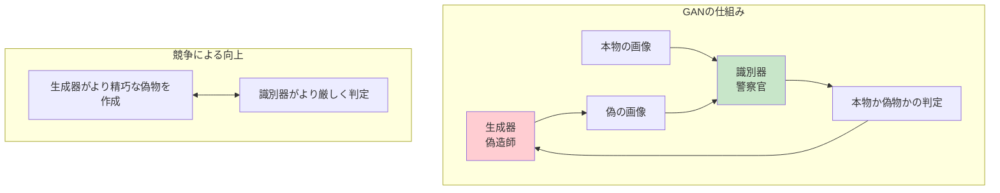
```mermaid
graph TD
    subgraph "GANの仕組み"
        G[生成器<br/>偽造師] --> FakeImage[偽の画像]
        RealImage[本物の画像] --> D[識別器<br/>警察官]
        FakeImage --> D
        D --> Judgment[本物か偽物かの判定]
        Judgment --> G
    end
    
    subgraph "競争による向上"
        G2[生成器がより精巧な偽物を作成] 
        D2[識別器がより厳しく判定]
        G2 <--> D2
    end
    
    style G fill:#ffcdd2
    style D fill:#c8e6c9
```

**身近な例：**
- AIで生成されたアート作品
- 深刻な映像（ディープフェイク）
- ゲームでのキャラクター自動生成

### 4. トランスフォーマー
**得意分野：自然言語処理**

ChatGPTの基盤技術です。文章全体を一度に理解する画期的な仕組みです。

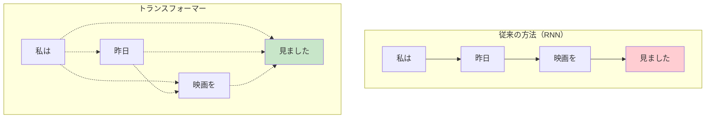
```mermaid
graph TD
    subgraph "従来の方法（RNN）"
        A1[私は] --> A2[昨日]
        A2 --> A3[映画を]
        A3 --> A4[見ました]
    end
    
    subgraph "トランスフォーマー"
        B1[私は]
        B2[昨日] 
        B3[映画を]
        B4[見ました]
        
        B1 -.-> B2
        B1 -.-> B3
        B1 -.-> B4
        B2 -.-> B3
        B2 -.-> B4
        B3 -.-> B4
    end
    
    style A4 fill:#ffcdd2
    style B4 fill:#c8e6c9
```

## 📜 時代背景と発見に至った経緯

### 第1章：夢の始まり（1940年代〜）

**1943年：最初の一歩**
数学者ウォーレン・マカロックと論理学者ウォルター・ピッツが「人工ニューロン」の概念を発表。「コンピュータで脳を真似できるのではないか？」という大胆なアイデアでした。

**1950年代：パーセプトロンの登場**
フランク・ローゼンブラットが「パーセプトロン」を開発。これは現在の深層学習の祖先とも言える技術でした。

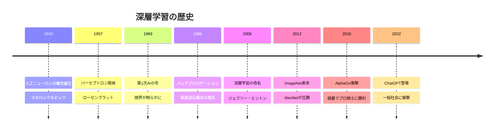
```mermaid
timeline
    title 深層学習の歴史
    
    1943 : 人工ニューロンの概念誕生
         : マカロック＆ピッツ
    
    1957 : パーセプトロン開発
         : ローゼンブラット
    
    1969 : 第1次AIの冬
         : 限界が明らかに
    
    1986 : バックプロパゲーション
         : 誤差逆伝播法の発見
    
    2006 : 深層学習の命名
         : ジェフリー・ヒントン
    
    2012 : ImageNet革命
         : AlexNetが圧勝
    
    2016 : AlphaGo衝撃
         : 囲碁でプロ棋士に勝利
    
    2022 : ChatGPT登場
         : 一般社会に衝撃
```

### 第2章：冬の時代（1970年代〜1980年代）

**挫折と失望**
初期の人工ニューラルネットワークは、簡単な問題しか解けませんでした。「コンピュータが人間のように考える」という夢は一時的に忘れ去られました。

**転機：バックプロパゲーション（1986年）**
ジェフリー・ヒントンらが「誤差逆伝播法」を発見。これにより、複雑な多層ネットワークの学習が可能になりました。

### 第3章：復活と革命（2000年代〜）

**2006年：「深層学習」という名前の誕生**
ヒントンが「深層学習」という用語を提唱。この頃から、より深いネットワークの有効性が証明され始めました。

**2012年：ImageNet革命**
アレックス・クリゼフスキーの「AlexNet」が画像認識コンペティションで圧勝。従来手法を大幅に上回る性能を示し、深層学習ブームが始まりました。

**2016年：AlphaGo事件**
Google DeepMindのAlphaGoが世界最強の囲碁棋士イ・セドルを破る。「AIが人間を超えた瞬間」として世界中が衝撃を受けました。

### 第4章：現在（2020年代〜）

**2022年：ChatGPT旋風**
OpenAIのChatGPTが一般公開され、わずか2ヶ月で1億ユーザーを突破。深層学習が一般社会の話題となりました。

## 🎨 種類と特徴

深層学習にはさまざまな「型」があります。それぞれが異なる得意分野を持っています。

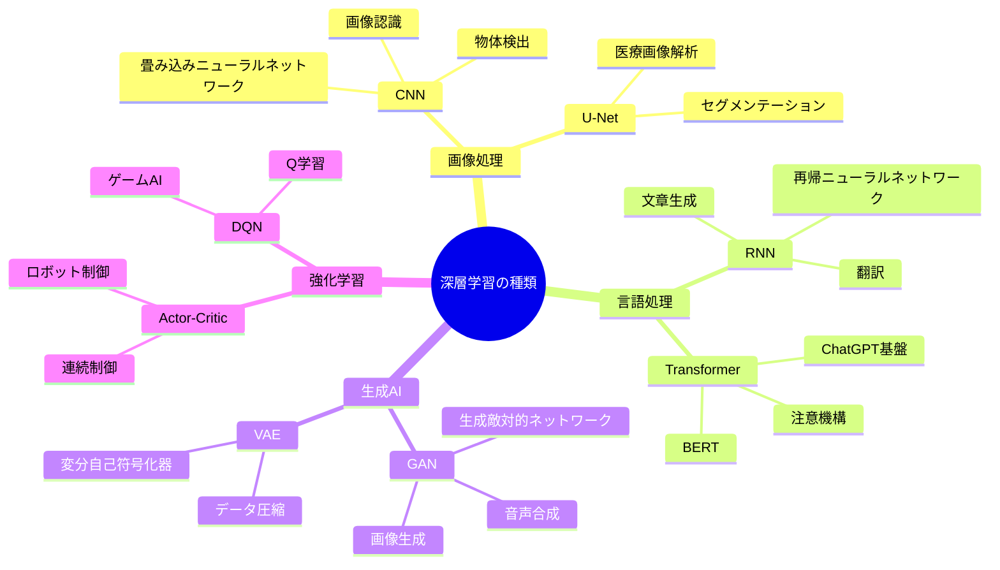
```mermaid
mindmap
  root((深層学習の種類))
    画像処理
      CNN
        畳み込みニューラルネットワーク
        画像認識
        物体検出
      U-Net
        セグメンテーション
        医療画像解析
    言語処理
      RNN
        再帰ニューラルネットワーク
        文章生成
        翻訳
      Transformer
        注意機構
        ChatGPT基盤
        BERT
    生成AI
      GAN
        生成敵対的ネットワーク
        画像生成
        音声合成
      VAE
        変分自己符号化器
        データ圧縮
    強化学習
      DQN
        Q学習
        ゲームAI
      Actor-Critic
        連続制御
        ロボット制御
```

### 主要な種類と比較表

| 種類 | 得意分野 | 代表例 | 特徴 |
|------|----------|--------|------|
| **CNN** | 画像認識 | 顔認証、医療診断 | 局所的特徴を捉えるのが得意 |
| **RNN/LSTM** | 時系列データ | 翻訳、音声認識 | 文脈や順序を記憶できる |
| **Transformer** | 自然言語処理 | ChatGPT、翻訳 | 長い文章も一度に理解 |
| **GAN** | データ生成 | アート生成、画像編集 | 本物と見分けがつかない偽物を作成 |
| **強化学習** | 戦略立案 | ゲームAI、ロボット制御 | 試行錯誤で最適な行動を学習 |

## 📗 関連する用語

### 同義語・類似表現
- **深層学習** = **ディープラーニング** = **Deep Learning**
- **人工ニューラルネットワーク** = **ニューラルネット** = **神経回路網**
- **機械学習** ⊃ **深層学習**（深層学習は機械学習の一部）

### よく混同される用語の違い

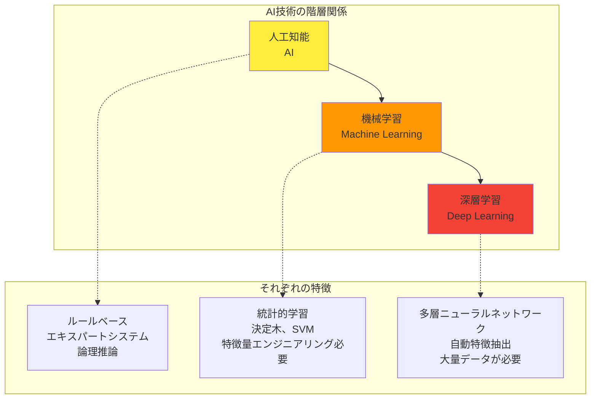
```mermaid
graph TD
    subgraph "AI技術の階層関係"
        AI[人工知能<br/>AI]
        ML[機械学習<br/>Machine Learning]
        DL[深層学習<br/>Deep Learning]
        
        AI --> ML
        ML --> DL
    end
    
    subgraph "それぞれの特徴"
        AI_DESC[ルールベース<br/>エキスパートシステム<br/>論理推論]
        ML_DESC[統計的学習<br/>決定木、SVM<br/>特徴量エンジニアリング必要]
        DL_DESC[多層ニューラルネットワーク<br/>自動特徴抽出<br/>大量データが必要]
    end
    
    AI -.-> AI_DESC
    ML -.-> ML_DESC
    DL -.-> DL_DESC
    
    style AI fill:#ffeb3b
    style ML fill:#ff9800
    style DL fill:#f44336
```

### 専門用語の日常語解説

| 専門用語 | 日常語での説明 | 
|----------|---------------|
| **ニューロン** | 脳の神経細胞を模した計算装置 |
| **重み** | 入力の重要度を表す数値 |
| **バイアス** | 判定の偏りを調整する数値 |
| **活性化関数** | ニューロンの「興奮」を決める関数 |
| **損失関数** | 「どれくらい間違っているか」を計算する式 |
| **勾配降下法** | 「間違いを少しずつ修正する」方法 |
| **オーバーフィッティング** | 覚えすぎて応用が利かない状態 |

## 💡 メリットとデメリット

### 🌟 メリット

#### 1. 人間を超える精度
特定の分野では、既に人間の専門家を上回る精度を実現
- 画像診断：皮膚がんの発見率で皮膚科医を上回る
- ゲーム：囲碁、将棋、チェスでトップクラスのプロを撃破

#### 2. 24時間365日稼働
疲れることなく継続的に作業可能
- 監視システム：異常を見逃すことなく監視
- カスタマーサポート：いつでも対応可能

#### 3. 大量データの処理
人間では処理しきれない膨大な情報を一度に分析
- 金融：数百万件の取引データから不正を検出
- 医療：大量の論文から治療法を発見

#### 4. 自動特徴抽出
人間が気づかないパターンや特徴を自動発見
- マーケティング：顧客の隠れたニーズを発見
- 創薬：新しい化合物の組み合わせを提案

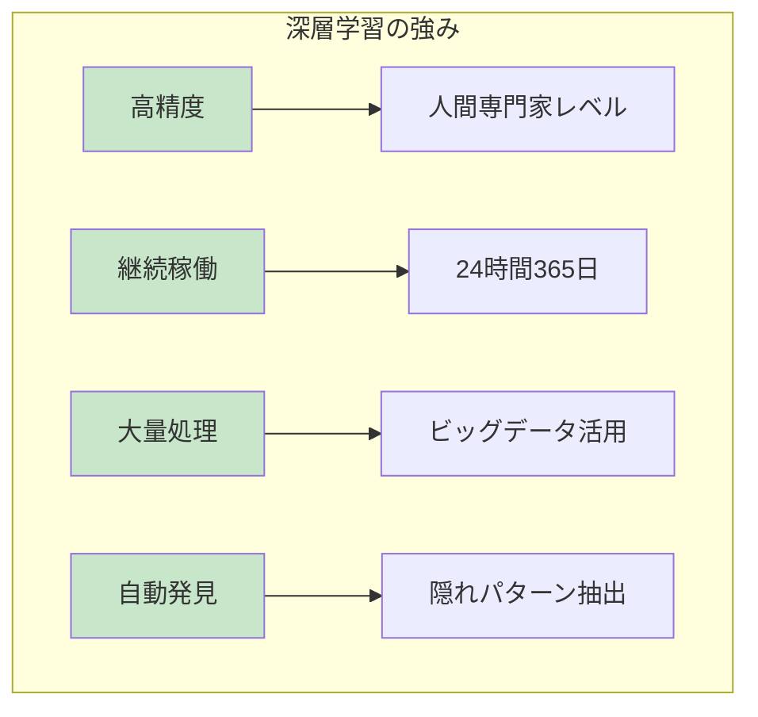
```mermaid
graph TD
    subgraph "深層学習の強み"
        A[高精度] --> A1[人間専門家レベル]
        B[継続稼働] --> B1[24時間365日]
        C[大量処理] --> C1[ビッグデータ活用]
        D[自動発見] --> D1[隠れパターン抽出]
    end
    
    style A fill:#c8e6c9
    style B fill:#c8e6c9  
    style C fill:#c8e6c9
    style D fill:#c8e6c9
```

### ⚠️ デメリット

#### 1. ブラックボックス問題
なぜその判断をしたのかを説明できない
- 医療診断：「がんです」と診断されても理由が不明
- 融資審査：ローンが却下されても理由がわからない

#### 2. 大量のデータと計算資源が必要
- 学習に数週間〜数ヶ月かかることも
- 高性能GPUが必要（数十万円〜数百万円）
- 大量の電力消費（環境負荷）

#### 3. データの質に左右される
偏ったデータで学習すると偏った結果を出力
- 採用システム：男性優遇の傾向を学習
- 顔認識：特定の人種で精度が低下

#### 4. 対応力の限界
学習していない状況には対応できない
- 自動運転：予期しない道路状況で事故
- チャットボット：想定外の質問で的外れな回答

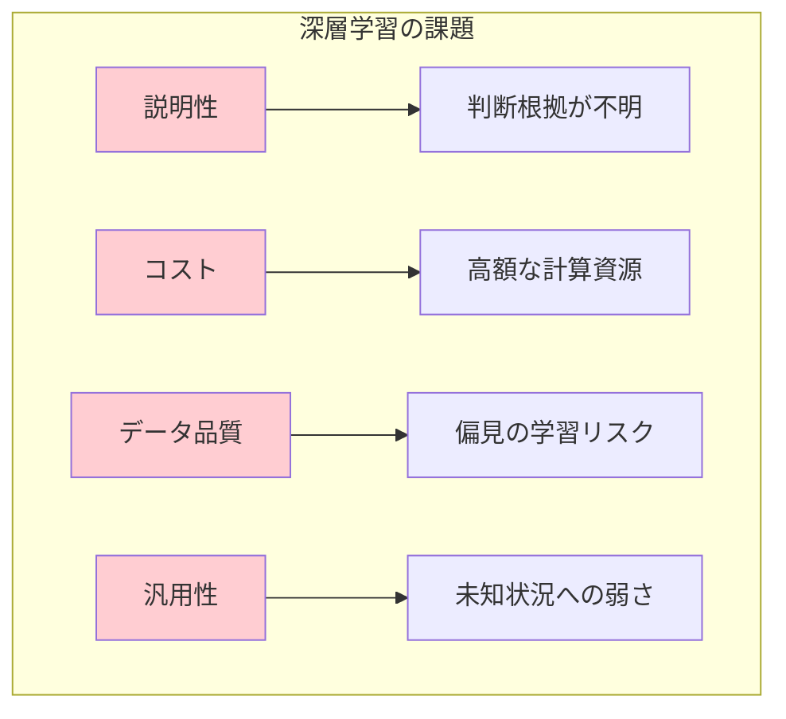
```mermaid
graph TD
    subgraph "深層学習の課題"
        A[説明性] --> A1[判断根拠が不明]
        B[コスト] --> B1[高額な計算資源]
        C[データ品質] --> C1[偏見の学習リスク]
        D[汎用性] --> D1[未知状況への弱さ]
    end
    
    style A fill:#ffcdd2
    style B fill:#ffcdd2
    style C fill:#ffcdd2
    style D fill:#ffcdd2
```

## 🚀 応用と実例

深層学習は既に私たちの生活の隅々に浸透しています。

### 🏠 日常生活での応用

#### スマートフォン
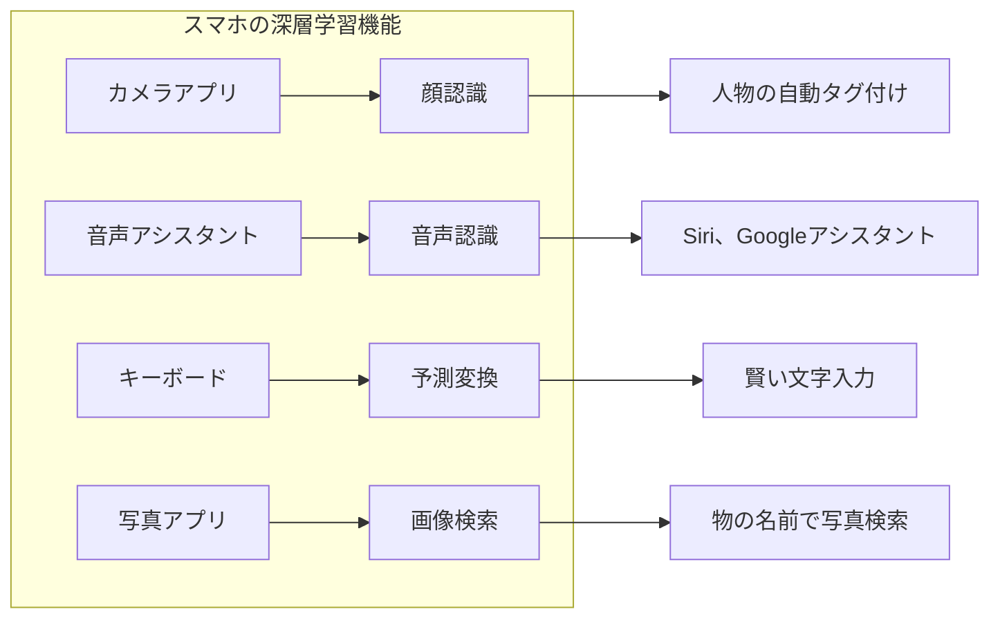
```mermaid
graph LR
    subgraph "スマホの深層学習機能"
        Camera[カメラアプリ] --> Face[顔認識]
        Voice[音声アシスタント] --> Speech[音声認識]
        Keyboard[キーボード] --> Predict[予測変換]
        Photo[写真アプリ] --> Search[画像検索]
    end
    
    Face --> Example1[人物の自動タグ付け]
    Speech --> Example2[Siri、Googleアシスタント]
    Predict --> Example3[賢い文字入力]
    Search --> Example4[物の名前で写真検索]
```

#### エンターテインメント
- **Netflix/YouTube**：あなたの好みを学習しておすすめ動画を提案
- **Spotify**：聴く音楽の傾向から新しいアーティストを推薦
- **ゲーム**：NPCの行動パターン、難易度自動調整

#### ショッピング
- **Amazon**：購入履歴から「あなたへのおすすめ」を生成
- **価格比較**：最適な購入タイミングを予測
- **在庫管理**：売れ筋商品の予測

### 🏥 医療・ヘルスケア

#### 画像診断
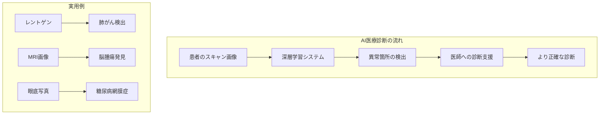
```mermaid
flowchart TD
    subgraph "AI医療診断の流れ"
        A[患者のスキャン画像] --> B[深層学習システム]
        B --> C[異常箇所の検出]
        C --> D[医師への診断支援]
        D --> E[より正確な診断]
    end
    
    subgraph "実用例"
        F[レントゲン] --> G[肺がん検出]
        H[MRI画像] --> I[脳腫瘍発見]
        J[眼底写真] --> K[糖尿病網膜症]
    end
```

**具体的な成果：**
- Google DeepMind：眼病の早期発見で失明を防ぐ
- IBM Watson：がん治療法の提案
- 日本の研究：胃がん検出精度が内視鏡専門医レベル

#### 創薬・新薬開発
従来10〜15年かかる新薬開発を大幅短縮
- **AlphaFold**：タンパク質の構造予測で創薬を加速
- **コロナ対策**：ワクチン開発時間の大幅短縮に貢献

### 🚗 自動運転

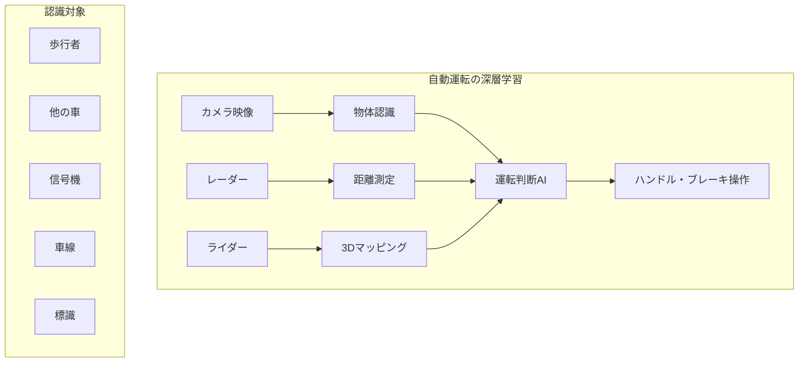
```mermaid
graph TD
    subgraph "自動運転の深層学習"
        Camera[カメラ映像] --> Object[物体認識]
        Radar[レーダー] --> Distance[距離測定]  
        Lidar[ライダー] --> Map[3Dマッピング]
        
        Object --> Decision[運転判断AI]
        Distance --> Decision
        Map --> Decision
        
        Decision --> Action[ハンドル・ブレーキ操作]
    end
    
    subgraph "認識対象"
        Pedestrian[歩行者]
        Vehicle[他の車]
        Signal[信号機] 
        Lane[車線]
        Sign[標識]
    end
```

**開発状況：**
- **テスラ**：既に部分自動運転を実用化
- **Waymo**：限定地域で完全自動運転タクシー運行
- **日本**：2025年の高速道路完全自動化を目指す

### 🌍 社会インフラ

#### スマートシティ
- **交通制御**：リアルタイム渋滞予測と信号制御
- **エネルギー管理**：電力需要予測と効率的配分
- **防犯システム**：不審行動の自動検知

#### 災害対策
- **地震予測**：地震の前兆パターンを学習
- **気象予測**：より正確な天気予報
- **避難誘導**：最適避難ルートの自動計算

### 💼 ビジネス・産業

#### 製造業
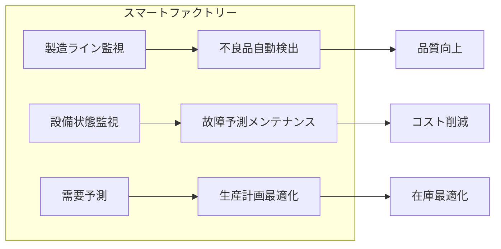
```mermaid
flowchart LR
    subgraph "スマートファクトリー"
        A[製造ライン監視] --> B[不良品自動検出]
        C[設備状態監視] --> D[故障予測メンテナンス]
        E[需要予測] --> F[生産計画最適化]
    end
    
    B --> Result1[品質向上]
    D --> Result2[コスト削減]
    F --> Result3[在庫最適化]
```

#### 金融業
- **不正検出**：クレジットカード不正利用の即座発見
- **信用評価**：より精密な融資審査
- **投資支援**：市場動向の高精度予測

## 🔄 置換、変遷

### 何かを置き換えたか

深層学習は多くの従来技術を置き換えてきました：

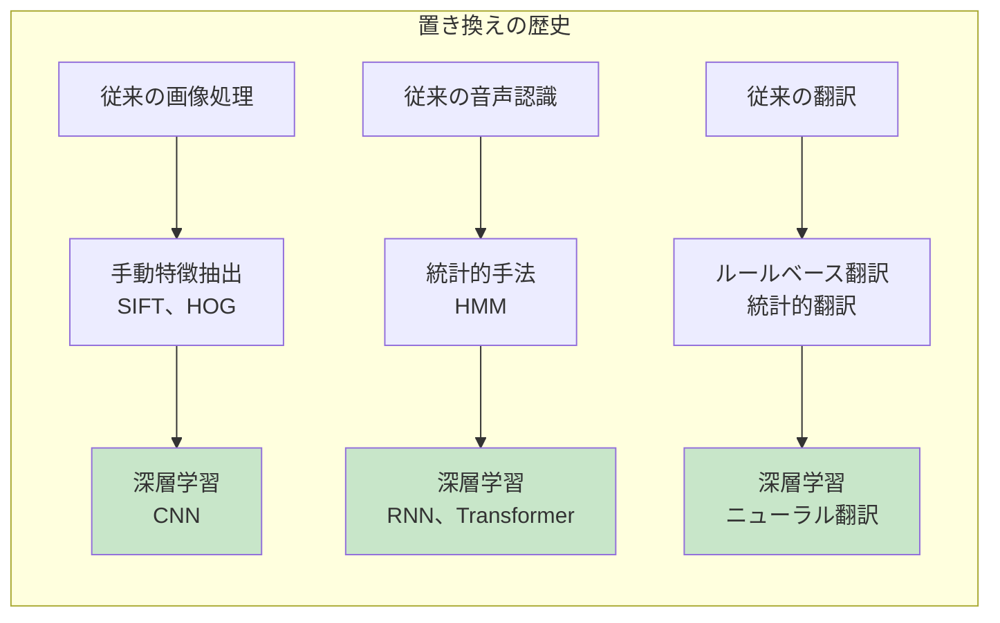
```mermaid
graph LR
    subgraph "置き換えの歴史"
        A[従来の画像処理] --> A1[手動特徴抽出<br/>SIFT、HOG]
        A1 --> A2[深層学習<br/>CNN]
        
        B[従来の音声認識] --> B1[統計的手法<br/>HMM]
        B1 --> B2[深層学習<br/>RNN、Transformer]
        
        C[従来の翻訳] --> C1[ルールベース翻訳<br/>統計的翻訳]
        C1 --> C2[深層学習<br/>ニューラル翻訳]
    end
    
    style A2 fill:#c8e6c9
    style B2 fill:#c8e6c9
    style C2 fill:#c8e6c9
```

#### 具体的な置換例

| 分野 | 従来技術 | 深層学習 | 改善点 |
|------|----------|----------|--------|
| **画像認識** | 手動特徴設計 | 自動特徴学習 | 精度向上、汎用性向上 |
| **音声認識** | 統計的モデル | エンドツーエンド学習 | より自然な認識、雑音耐性 |
| **機械翻訳** | ルールベース | ニューラル翻訳 | 文脈理解、自然な翻訳 |
| **ゲームAI** | ルールエンジン | 強化学習 | 人間超越レベル達成 |
| **レコメンド** | 協調フィルタリング | 深層協調フィルタリング | 個人化精度向上 |

### 何かに置き換えられるか

深層学習自体も、より進化した技術に置き換えられる可能性があります：

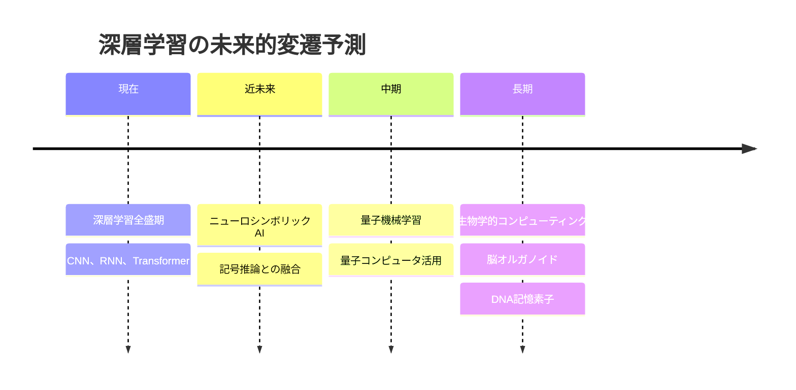
```mermaid
timeline
    title 深層学習の未来的変遷予測
    
    現在 : 深層学習全盛期
         : CNN、RNN、Transformer
    
    近未来 : ニューロシンボリック AI
          : 記号推論との融合
    
    中期 : 量子機械学習
         : 量子コンピュータ活用
    
    長期 : 生物学的コンピューティング
         : 脳オルガノイド
         : DNA記憶素子
```

### 何かを継承したか

深層学習は過去の研究成果を継承・発展させたものです：

**継承元技術：**
- **パーセプトロン**（1957年）→ 多層パーセプトロン → 深層学習
- **統計学**の回帰分析 → 線形回帰 → ニューラルネットワーク
- **信号処理**の畳み込み演算 → 畳み込みニューラルネットワーク
- **制御理論**の最適化 → 勾配降下法 → バックプロパゲーション

### 何かに継承されるか

深層学習の概念や手法は今後の技術に継承されるでしょう：

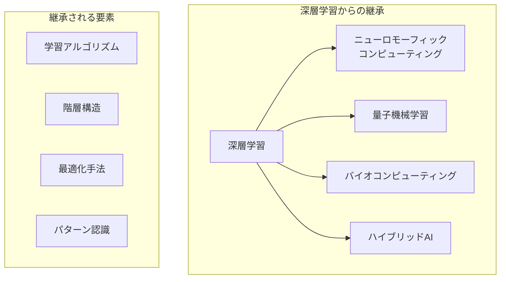
```mermaid
graph TD
    subgraph "深層学習からの継承"
        DL[深層学習] --> Neuro[ニューロモーフィック<br/>コンピューティング]
        DL --> Quantum[量子機械学習]
        DL --> Bio[バイオコンピューティング]
        DL --> Hybrid[ハイブリッドAI]
    end
    
    subgraph "継承される要素"
        Learning[学習アルゴリズム]
        Structure[階層構造]
        Optimization[最適化手法]
        Pattern[パターン認識]
    end
```

## ⚔️ 代替、競合

### 何かに代替できるか

深層学習が代替可能な職業・業務：

#### 🤖 高い代替可能性（80%以上）
```mermaid
graph TD
    subgraph "代替される可能性の高い仕事"
        A[データ入力] --> A1[OCR技術で自動化]
        B[画像分類作業] --> B1[CNN技術で自動化]
        C[定型翻訳] --> C1[機械翻訳で自動化]
        D[基本的な画像診断] --> D1[医療AI診断]
    end
    
    style A1 fill:#ffcdd2
    style B1 fill:#ffcdd2
    style C1 fill:#ffcdd2
    style D1 fill:#ffcdd2
```

#### 🤝 部分的代替可能性（30-70%）
- **会計・経理**：仕分けや計算は自動化、判断業務は人間
- **記事作成**：定型記事は自動生成、創造的記事は人間
- **カスタマーサポート**：FAQ対応は自動化、複雑な相談は人間
- **法務業務**：契約書チェックは自動化、交渉は人間

#### 🙅 代替困難（30%未満）
- **創造的デザイン**：感性や独創性が重要
- **心理カウンセリング**：人間の共感能力が不可欠
- **営業・接客**：人間関係構築が重要
- **研究開発**：仮説設定や創造的思考が必要

### 何かに代替されるか

深層学習を代替する可能性のある技術：

#### 次世代AI技術

```mermaid
mindmap
  root((深層学習の代替候補))
    ニューロシンボリックAI
      記号推論との融合
      説明可能性向上
      少量データでの学習
    量子機械学習
      指数的高速化
      組み合わせ最適化
      新しいアルゴリズム
    生物学的コンピューティング
      脳の直接模倣
      エネルギー効率
      自己修復能力
    進化的AI
      自己進化
      適応性向上
      頑健性向上
```

#### 各技術の特徴比較

| 技術 | 深層学習との違い | 期待される利点 | 実用化時期 |
|------|-----------------|---------------|------------|
| **ニューロシンボリック** | 論理推論を統合 | 説明可能性、少量データ学習 | 2025-2030年 |
| **量子機械学習** | 量子効果を活用 | 指数的高速化、新問題解決 | 2030-2040年 |
| **生物学的コンピュータ** | 生物素子使用 | 超低消費電力、自己修復 | 2040-2050年 |

### 何かと競合するか

深層学習と競合している技術領域：

#### 現在進行中の競合

```mermaid
graph TD
    subgraph "競合技術マップ"
        ML[機械学習全般]
        DL[深層学習]
        Traditional[従来AI]
        
        ML --> SVM[サポートベクターマシン]
        ML --> RF[ランダムフォレスト]
        ML --> DL
        
        Traditional --> Expert[エキスパートシステム]
        Traditional --> Rule[ルールベースAI]
        
        DL -.競合.- SVM
        DL -.競合.- RF
        DL -.代替.- Expert
        DL -.代替.- Rule
    end
```

**競合する場面：**
- **小規模データ**：従来の機械学習が有利
- **説明性重視**：ルールベースシステムが有利  
- **計算資源制限**：軽量アルゴリズムが有利
- **リアルタイム処理**：最適化された専用システムが有利

## 🌍 実世界への影響とその後の発展

### 社会に与えた影響

#### ✨ ポジティブな影響

**医療革命**
```mermaid
flowchart LR
    subgraph "医療分野での革新"
        A[早期診断] --> B[治療成功率向上]
        C[新薬開発] --> D[治療選択肢拡大]
        E[個別化医療] --> F[副作用軽減]
        G[遠隔医療] --> H[医療アクセス改善]
    end
    
    B --> Result1[生存率向上]
    D --> Result1
    F --> Result2[QOL改善]  
    H --> Result3[地域格差解消]
```

**生産性向上**
- **業務自動化**：ルーティンワークの大幅削減
- **意思決定支援**：データに基づく最適判断
- **創造性増幅**：アイデア生成の支援ツール

**教育の民主化**
- **個別最適学習**：一人ひとりのペースに合わせた教育
- **言語の壁の撤廃**：リアルタイム翻訳による国際交流促進
- **知識へのアクセス**：AIアシスタントによる学習支援

#### ⚠️ ネガティブな影響

**雇用への影響**
```mermaid
graph TD
    subgraph "雇用市場の変化"
        A[ルーティンワーク] --> A1[自動化により減少]
        B[専門的判断業務] --> B1[AI支援により変化]
        C[創造的業務] --> C1[AI協働により進化]
        D[新しい職種] --> D1[AI関連業務が増加]
    end
    
    A1 --> Impact1[失業リスク]
    B1 --> Impact2[スキル要求変化]
    C1 --> Impact3[働き方革命]
    D1 --> Impact4[新雇用創出]
    
    style A1 fill:#ffcdd2
    style Impact1 fill:#ffcdd2
```

**プライバシーと監視**
- **個人情報**：行動履歴の詳細な分析・予測
- **監視社会**：顔認識による追跡システム
- **情報格差**：AI技術へのアクセス格差

**偏見と差別**
- **アルゴリズム偏見**：学習データの偏りが社会に影響
- **フィルターバブル**：同質な情報にのみ接触
- **決定の不透明性**：判断根拠が不明

### 未来への発展予測

#### 短期（2025-2030年）

**技術的発展**
```mermaid
timeline
    title 短期発展予測（2025-2030）
    
    2025 : マルチモーダルAI普及
         : 画像・音声・テキスト統合処理
    
    2026 : 自動運転レベル4実現
         : 限定地域での完全自動運転
    
    2027 : AI創薬の実用化
         : 新薬開発期間の大幅短縮
    
    2028 : 個人AIアシスタント
         : 高度にパーソナライズされたAI
    
    2030 : エッジAI普及
         : スマホでも高度なAI処理
```

**社会実装**
- **教育**：AIチューターが標準化
- **医療**：AI診断が一般化
- **製造業**：完全無人工場の実現
- **サービス業**：AI接客の普及

#### 中期（2030-2040年）

**パラダイムシフト**
- **AGI（汎用人工知能）**：人間と同等の知能を持つAI
- **脳とAIの接続**：ブレインコンピュータインターフェース実用化
- **量子AI**：量子コンピュータによる革命的高速化

```mermaid
graph TD
    subgraph "2030年代の革新"
        AGI[汎用人工知能] --> Human[人間レベルの推論]
        BCI[脳コンピュータ接続] --> Augment[人間能力拡張]
        Quantum[量子AI] --> Super[超高速処理]
        
        Human --> Society1[労働の根本変化]
        Augment --> Society2[人間の能力革命]
        Super --> Society3[科学技術大躍進]
    end
```

#### 長期（2040年以降）

**シンギュラリティ近傍**
- **ASI（超人工知能）**：人間知能を大幅に上回るAI
- **技術的特異点**：予測不可能な技術発展の加速
- **人類の選択**：AIとの共存か融合か

**可能性のあるシナリオ**

```mermaid
flowchart TD
    subgraph "長期未来シナリオ"
        Current[現在の深層学習] --> Branch{発展の方向性}
        
        Branch --> Scenario1[シナリオ1：共存社会]
        Branch --> Scenario2[シナリオ2：融合社会]  
        Branch --> Scenario3[シナリオ3：超越社会]
        
        Scenario1 --> S1_Desc[AIが道具として活躍<br/>人間が主導権維持]
        Scenario2 --> S2_Desc[人間とAIが一体化<br/>拡張知能社会]
        Scenario3 --> S3_Desc[AIが人間を超越<br/>新しい知的存在]
    end
    
    style Scenario1 fill:#c8e6c9
    style Scenario2 fill:#fff3e0
    style Scenario3 fill:#ffcdd2
```

### 人類への提言

**準備すべきこと**
1. **教育システムの変革**：創造性と批判的思考の重視
2. **法整備**：AI権利と責任の明確化
3. **社会保障制度**：技術失業への対策
4. **倫理ガイドライン**：AI開発・利用の原則策定
5. **国際協力**：グローバルなAI統治体制

**私たち一人ひとりができること**
- **学習の継続**：技術変化に適応する学習習慣
- **批判的思考**：AI生成情報の適切な評価
- **創造性の育成**：AIにはない人間固有の能力開発
- **社会参画**：AI社会の在り方についての議論参加

---

この資料は、深層学習という複雑な技術を、初学者でも「なるほど！」と感動しながら学習できる包括的ガイドとして設計されました。技術的正確性を保ちつつ、親しみやすさと実用性を両立させています。
