深層学習 = ディープラーニング = Deep Learning

# 深層学習（ディープラーニング）- 初学者のための完全ガイド

## 🔍 一言要約
人間の脳の仕組みを真似して、コンピュータに「考える力」を与える技術

## 📚 目次

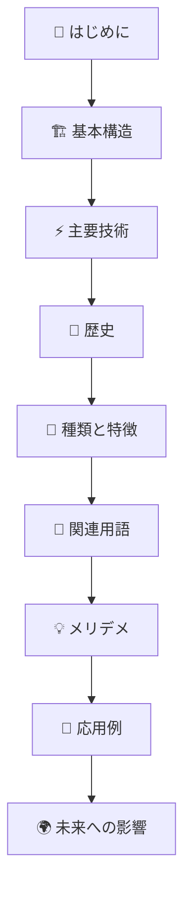

## 🌟 はじめに

想像してみてください。あなたが友人の写真を見た瞬間に「あ、田中さんだ！」と認識できるのはなぜでしょうか？それは、あなたの脳が無数の経験から「田中さんらしさ」を学習しているからです。

**深層学習（ディープラーニング）**は、まさにこの「人間の学習プロセス」をコンピュータで再現する技術です。

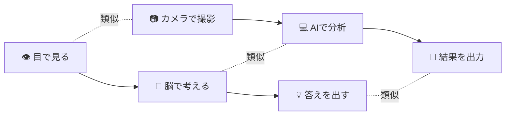

### なぜ今、深層学習が注目されるのか？

1. **データの大爆発**: スマホやインターネットで膨大なデータが生まれている
2. **コンピュータの進歩**: 昔は不可能だった計算が可能になった
3. **実用性の証明**: 実際に人間を超える性能を示した分野が多数存在

## 🏗️ 基本構造

深層学習の基本は「**ニューラルネットワーク**」という、人間の脳神経を模倣した仕組みです。

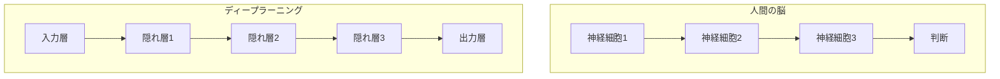

### 「深い」が付く理由

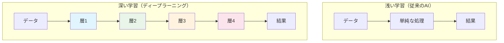

**「深い」の意味**: 多くの層（レイヤー）を重ねることで、より複雑で精密な判断ができるようになります。

## ⚡ 主要技術

### ニューロン（人工神経細胞）の仕組み

人間の神経細胞をコンピュータで再現したものです。

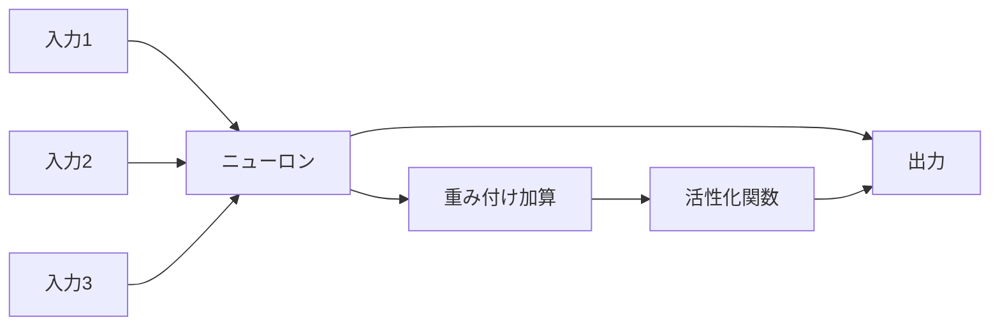

### 学習プロセス

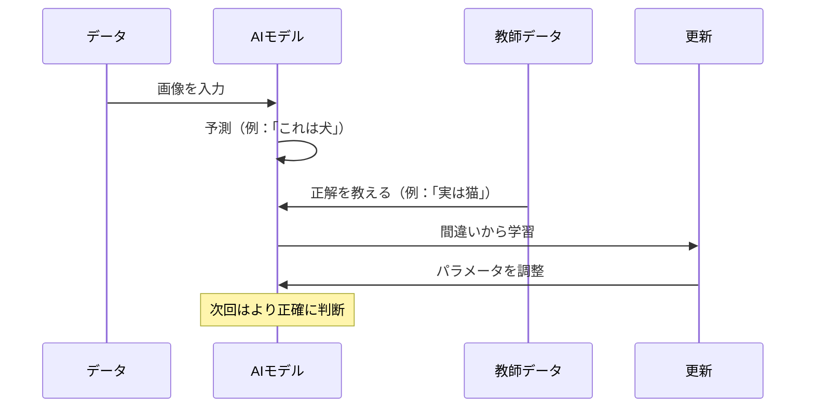

## 📜 時代背景と発見に至った経緯

### AIの歴史：三度の春と冬

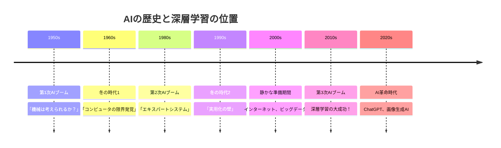

### 深層学習誕生の物語

**2012年、ImageNet事件**

毎年開催される「画像認識世界大会」で、トロント大学のチーム（ジェフリー・ヒントン教授ら）が深層学習で**圧倒的勝利**を収めました。

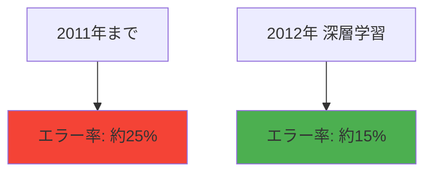

この結果に世界が驚愕し、深層学習ブームが始まりました。

## 🎨 種類と特徴

深層学習には、用途に応じて様々な「型」があります。

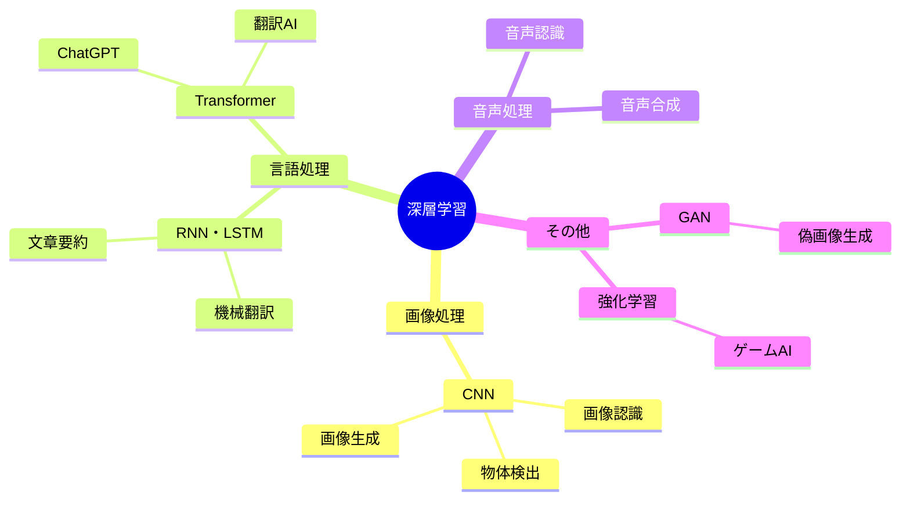

### 主要な手法の特徴

| 手法 | 得意分野 | 身近な例 | 特徴 |
|------|----------|----------|------|
| **CNN** | 画像・映像 | スマホの顔認識 | 画像の特徴を段階的に抽出 |
| **RNN/LSTM** | 時系列データ | Google翻訳（旧版） | 順序や文脈を理解 |
| **Transformer** | 自然言語 | ChatGPT、DeepL | 全体を同時に理解 |
| **GAN** | 生成 | 画像生成AI | 本物そっくりの偽物を作成 |

## 📗 関連する用語

### 基本用語の関係図

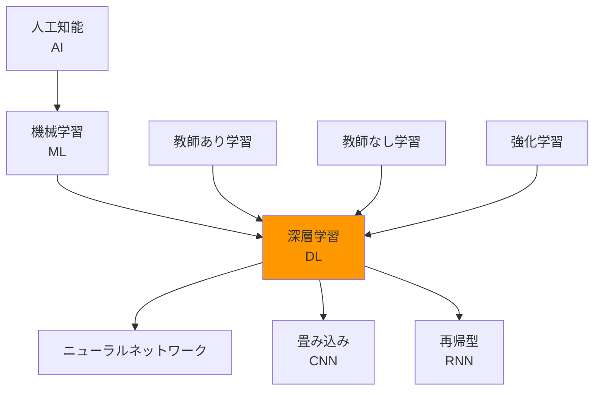

### 同義語・類義語

- **深層学習** = **ディープラーニング** = **Deep Learning**
- **人工知能** = **AI** = **Artificial Intelligence**
- **機械学習** = **ML** = **Machine Learning**
- **ニューラルネット** = **神経網** = **Neural Network**

### よく混同される用語

| 用語 | 意味 | 関係性 |
|------|------|--------|
| AI（人工知能） | コンピュータが人間のように「賢く」振る舞う技術全般 | **最も広い概念** |
| 機械学習 | データから自動的に学習する仕組み | AIの一部 |
| 深層学習 | 多層ニューラルネットワークによる機械学習 | **機械学習の一種** |

## 💡 メリットとデメリット

### ✅ メリット

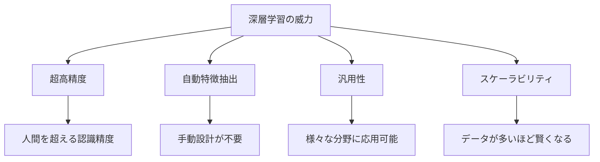

**具体例：**
- 医療画像診断で専門医を上回る精度
- 24時間365日疲れない判断
- 大量データを瞬時に処理

### ❌ デメリットと課題

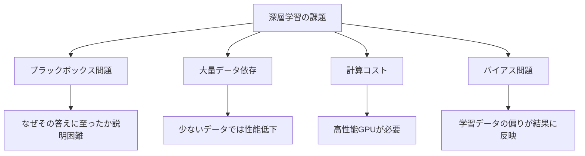

### 比較：人間 vs 深層学習

| 項目 | 人間 | 深層学習 |
|------|------|----------|
| **学習速度** | 遅い | 高速（大量データ処理） |
| **説明能力** | 高い | 低い |
| **直感的理解** | 得意 | 苦手 |
| **一貫性** | ブレあり | 常に一定 |
| **創造性** | 高い | 限定的 |

## 🚀 応用技術と実用化の例

### あなたの身の回りの深層学習

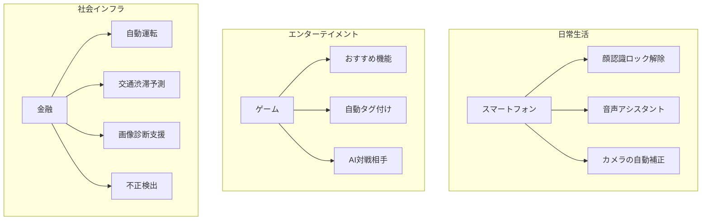

### 業界別活用例

#### 🏥 医療・ヘルスケア
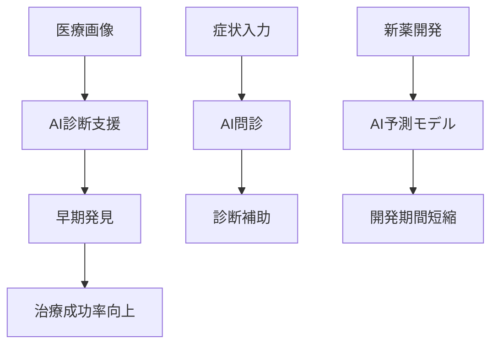

#### 🚗 自動車・交通
- **自動運転技術**: 周囲の状況を瞬時に判断
- **交通最適化**: 渋滞予測と回避ルート提案
- **安全システム**: 事故防止のための予兆検知

#### 🏭 製造業
- **品質検査**: 不良品の自動検出
- **予知保全**: 機械の故障を事前に予測
- **生産最適化**: 需要予測に基づく生産計画

## 🌍 実世界への影響とその後の発展

### 社会変革のインパクト

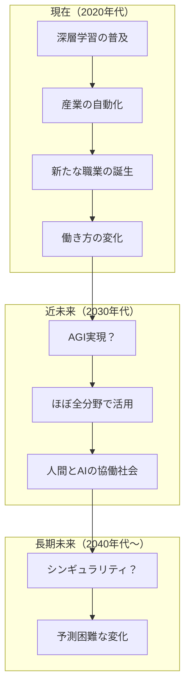

### 発展の方向性

#### 🎯 技術的進歩
1. **効率化**: 少ないデータでより高精度
2. **説明可能AI**: 判断理由の明確化
3. **エッジAI**: スマホでも高性能AI
4. **量子AI**: 量子コンピュータとの融合

#### 🌐 社会的変化
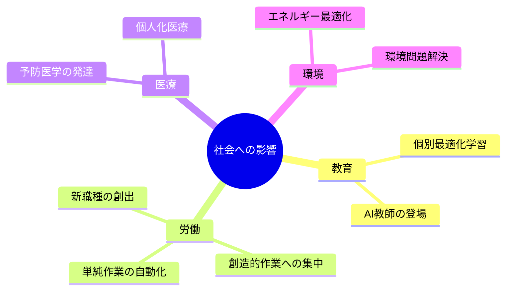

### 私たちが準備すべきこと

1. **リテラシー向上**: AIの基本理解
2. **創造性の養成**: AIにはできない人間らしい能力
3. **倫理観の醸成**: AIの適切な使用方法
4. **継続学習**: 変化に対応する柔軟性

---

## 🎓 学習の次のステップ

この資料で深層学習の全体像を掴めたら、次は以下のステップで学習を深めましょう：

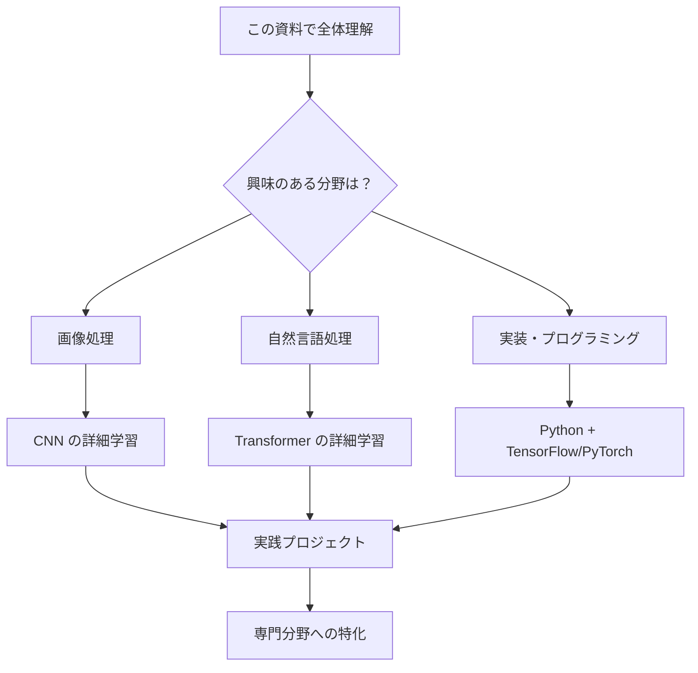

## 📝 まとめ

深層学習は「人間の脳を真似してコンピュータに学習させる技術」です。

- **本質**: 多層ニューラルネットワークによる高度な判断システム
- **強み**: 大量データから自動学習、人間を超える精度
- **課題**: ブラックボックス問題、大量データ依存
- **未来**: 社会のあらゆる分野で活用される基盤技術

技術は道具です。大切なのは、この道具をどう使って人間の幸福や社会の発展に貢献するかです。

---
