AI（人工知能）における、（深層学習 = ディープラーニング = Deep Learning）のうち、RNN（Recurrent neural network） = リカレントニューラルネットワーク について

# RNN（リカレントニューラルネットワーク）- 初学者のための完全ガイド

## 🔍 一言要約
**過去の記憶を持つAI** - 人間が会話で前の言葉を覚えているように、データの「流れ」を記憶できるAI技術

## 📚 目次

1. [🌟 はじめに](#-はじめに)
2. [🏗️ 基本構造](#️-基本構造)
3. [⚡ 主要技術](#-主要技術)
4. [📜 時代背景と発見に至った経緯](#-時代背景と発見に至った経緯)
5. [🎨 種類と特徴](#-種類と特徴)
6. [📗 関連する用語](#-関連する用語)
7. [💡 メリットとデメリット](#-メリットとデメリット)
8. [🚀 応用技術と実用化の例](#-応用技術と実用化の例)
9. [🌍 実世界への影響とその後の発展](#-実世界への影響とその後の発展)

## 🌟 はじめに

想像してください。友達と電話で話しているとき、あなたは前に話した内容を覚えながら会話を続けますよね？「そういえばさっき言った映画の話だけど...」といった感じで。

**RNN（リカレントニューラルネットワーク）** は、まさにこの「記憶を保ちながら処理を続ける」能力を持ったAI技術です。従来のAIが「一問一答」しかできなかったのに対し、RNNは「続きもの」の情報を理解できる革命的な仕組みなのです。

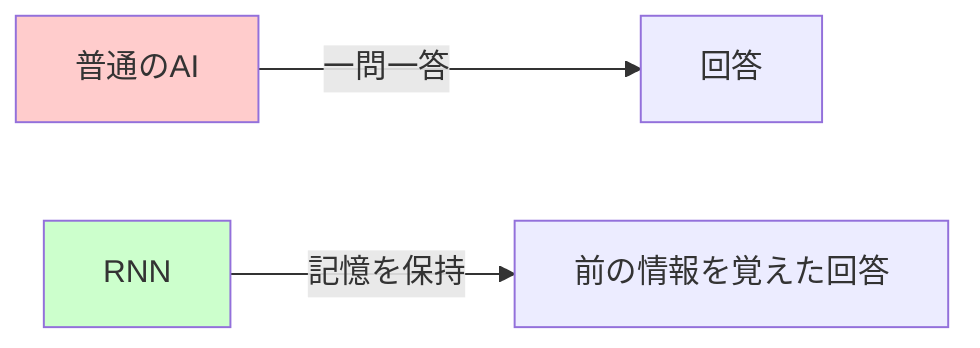

なぜこれが重要なのでしょうか？私たちの世界の多くの情報は「時間の流れ」や「順序」が意味を持ちます。文章、音楽、株価、天気予報... これらすべてを理解するために、RNNは欠かせない技術となっているのです。

## 🏗️ 基本構造

RNNを理解する最も簡単な方法は、**「記憶付きの連鎖反応」** として考えることです。

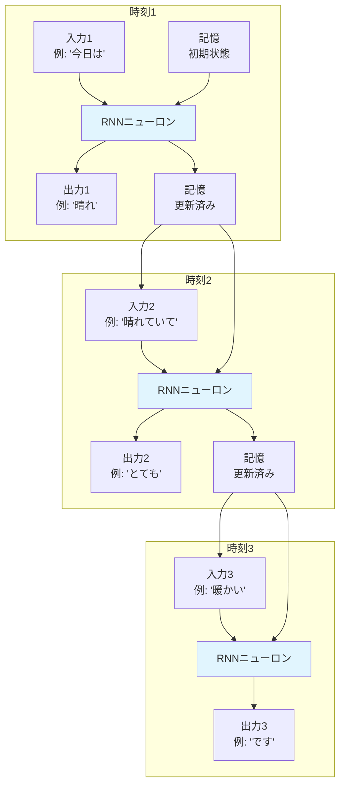

### 🧠 人間の脳との比較

| 特徴 | 人間の脳 | RNN |
|------|----------|-----|
| 記憶保持 | 短期記憶で前の情報を保持 | 隠れ状態で前の情報を保持 |
| 情報処理 | 順序立てて理解 | 時系列データを順次処理 |
| 学習方法 | 経験から学習 | 過去のデータから学習 |

この仕組みにより、RNNは文章の文脈、音楽のメロディー、時系列データの傾向を「理解」できるようになります。

## ⚡ 主要技術

RNNの核となる技術を、料理のレシピに例えて説明しましょう。

### 1. 隠れ状態（Hidden State）- 「記憶のメモ帳」

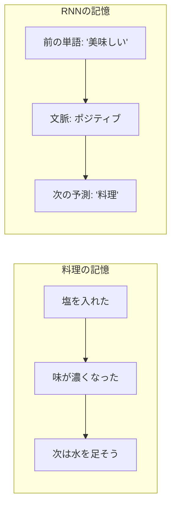

**隠れ状態** とは、RNNが前の情報を覚えておく「メモ帳」のようなものです。料理をするとき、「さっき塩を入れたから次は甘みを足そう」と考えるのと同じように、RNNも前の処理結果を記憶して次の判断に活かします。

### 2. バックプロパゲーション・スルー・タイム（BPTT）- 「時間を遡る学習法」

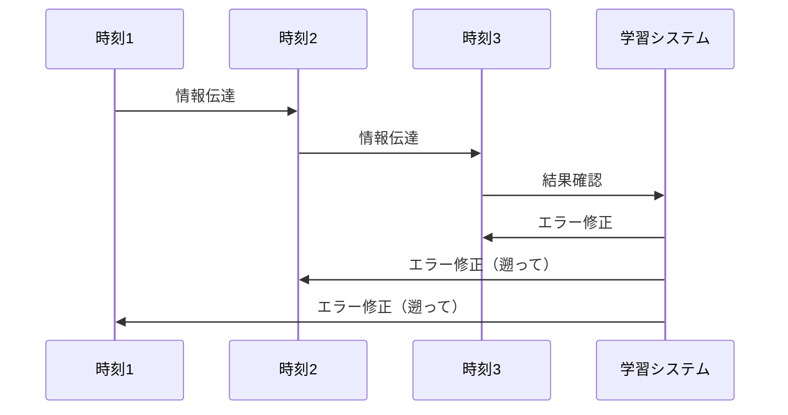

これは「間違いから学ぶ」仕組みです。試験で間違えた問題があったとき、どこで判断を誤ったか最初から見直すように、RNNも時間を遡って「どの時点で間違えたか」を特定し、修正します。

### 3. ゲート機構 - 「情報の交通整理」

従来のRNNには「勾配消失問題」という課題がありました。これを解決するために生まれたのが、**LSTM**や**GRU**などのゲート機構付きRNNです。

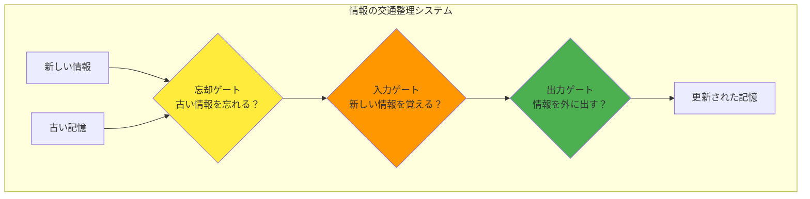

これは駅の改札のような仕組みで、「重要な情報だけを通し、不要な情報は通さない」という賢い判断をします。

## 📜 時代背景と発見に至った経緯

### 🏛️ AIの歴史における位置づけ

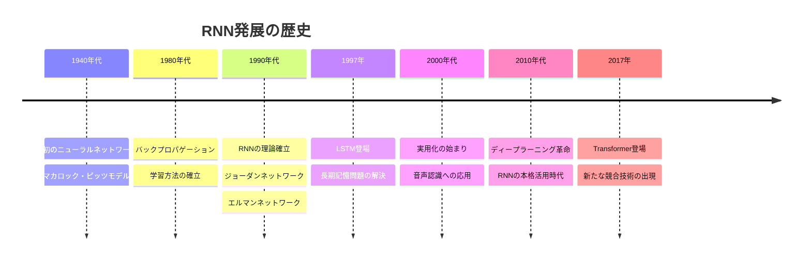

### 📖 発見のストーリー

**第1章：問題の発見（1980年代）**

研究者たちは、従来のニューラルネットワークに大きな制限があることに気づきました。それは「過去を忘れる」ということでした。

例えば、「私は昨日、美味しいラーメンを食べに行きました。その店は...」という文章を読むとき、人間は「その店」が「ラーメン店」のことだと理解できます。しかし、従来のAIは「その店」だけを見て「何の店？」と混乱してしまうのです。

**第2章：解決への挑戦（1990年代）**

ジェフリー・エルマンやマイケル・ジョーダンなどの研究者が、「記憶を持つニューラルネットワーク」の研究を始めました。彼らは「前の情報を次の処理に使う」というアイデアを形にしました。

**第3章：実用化への道のり（2000年代以降）**

しかし、初期のRNNには「短期記憶しかできない」という問題がありました。これを解決したのがユルゲン・シュミットフーバーらが開発した**LSTM**です。これにより、RNNは「長期記憶」を持てるようになり、実用的なAIアプリケーションで使われるようになりました。

## 🎨 種類と特徴

RNNには多くの種類があります。それぞれの特徴を、楽器のオーケストラに例えて説明しましょう。

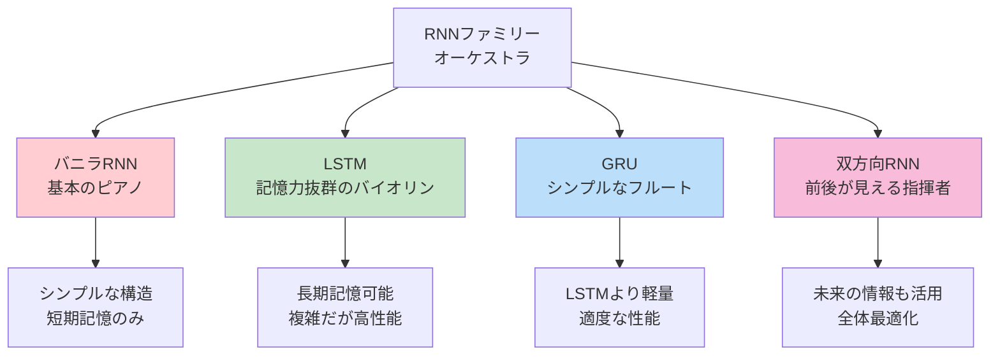

### 🎼 各種類の詳細比較

| 種類 | 特徴 | 向いている用途 | 例え |
|------|------|---------------|------|
| **バニラRNN** | 基本形、シンプル | 短い文章の処理 | 童謡を歌うピアノ |
| **LSTM** | 長期記憶が可能 | 長文、複雑な時系列 | 交響曲を奏でるバイオリン |
| **GRU** | LSTMの軽量版 | 効率重視のアプリ | 軽やかなフルート |
| **双方向RNN** | 未来も見える | 翻訳、文章要約 | 全体を把握する指揮者 |

### 📊 性能比較グラフ

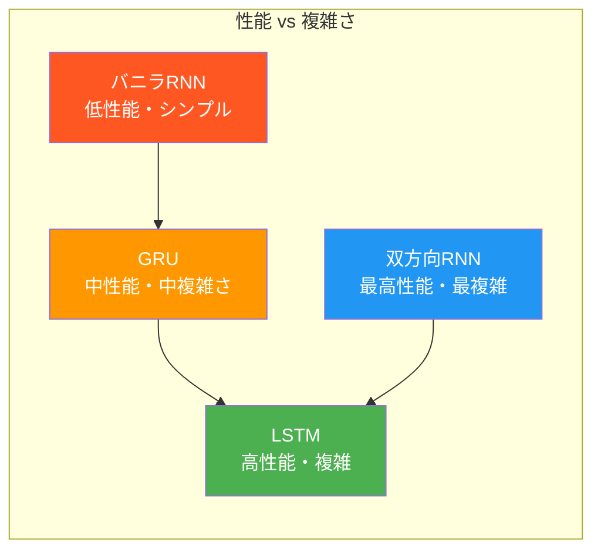

## 📗 関連する用語

RNNを理解するために重要な用語を、日常生活の例で説明します。

### 🔤 基本用語集

| 専門用語 | 日常での例え | 意味 |
|----------|--------------|------|
| **時系列データ** | 日記の記録 | 時間順に並んだデータ（気温、株価など） |
| **シーケンス** | 物語の章立て | 順序のある情報の連なり |
| **エンコーダー・デコーダー** | 通訳者 | 情報を変換する仕組み |
| **アテンション機構** | 重要部分にマーカー | 大切な情報に注目する仕組み |

### 🔄 同義語・類義語の整理

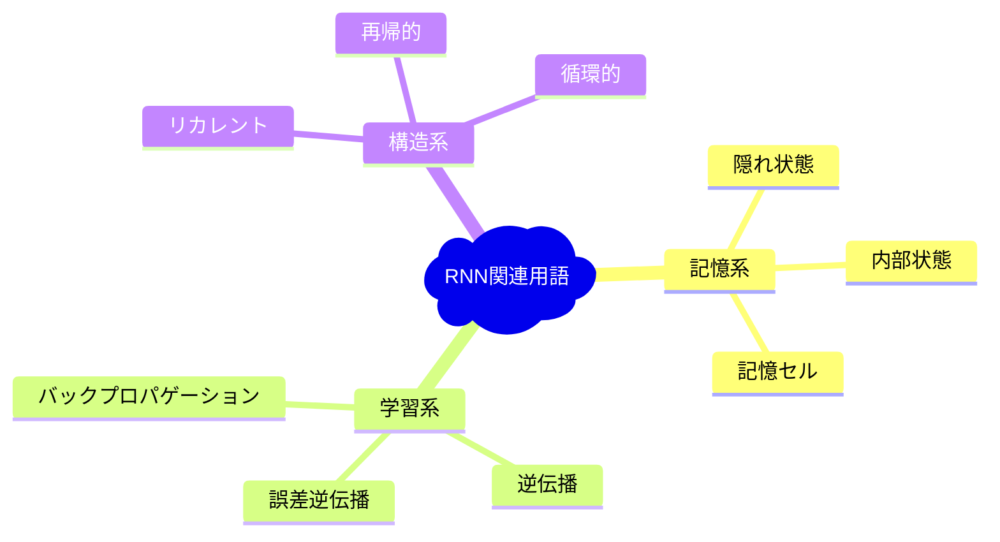

### 🆚 よく混同される用語の比較

| よく混同される用語 | 違い | 覚え方 |
|-------------------|------|--------|
| **RNN vs CNN** | RNN=時系列、CNN=画像 | RNN=Record（記録）、CNN=Camera（カメラ） |
| **LSTM vs GRU** | LSTM=高性能複雑、GRU=軽量シンプル | LSTM=Luxury（高級）、GRU=Good（良い） |
| **エンコーダー vs デコーダー** | エンコーダー=圧縮、デコーダー=展開 | 圧縮ファイルの作成と展開 |

## 💡 メリットとデメリット

RNNの長所と短所を、人間の記憶と比較して説明します。

### ✅ メリット - 「記憶の魔法使い」

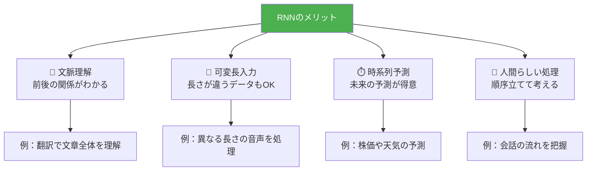

**1. 文脈理解能力**
- 「その映画はとても面白かった」→「その映画」が何を指すか理解
- 前の会話内容を覚えている賢いアシスタントのような働き

**2. 柔軟なデータ処理**
- 短い文章「こんにちは」から長い文章まで対応
- 人間が様々な長さの話を理解するのと同じ

**3. 未来予測能力**
- 過去のパターンから未来を予測
- 経験豊富な占い師のような予測力

### ❌ デメリット - 「記憶の限界」

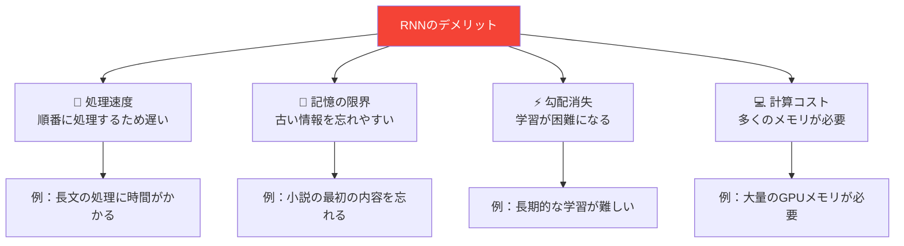

**1. 逐次処理の制限**
- 並列処理ができないため、大量データ処理が遅い
- 一人で大きな本を読むようなもの（チームワークできない）

**2. 長期依存性の問題**
- 長い文章の最初の内容を忘れてしまう
- 人間も長い話の最初の部分を忘れるのと似ている

**3. 計算資源の要求**
- 高性能なコンピューターが必要
- 高級車のように維持費が高い

### ⚖️ メリット・デメリット比較表

| 観点 | メリット | デメリット | 解決策 |
|------|----------|------------|--------|
| **処理速度** | 順序理解 | 遅い処理 | Transformerの併用 |
| **記憶力** | 短期記憶 | 長期記憶の限界 | LSTMの活用 |
| **学習能力** | パターン学習 | 勾配消失 | 適切な初期化 |
| **実用性** | 多様な応用 | 高い計算コスト | 効率的なアーキテクチャ |

## 🚀 応用技術と実用化の例

RNNは私たちの日常生活の様々な場面で活躍しています。身近な例から最先端の応用まで見てみましょう。

### 📱 日常生活での活用

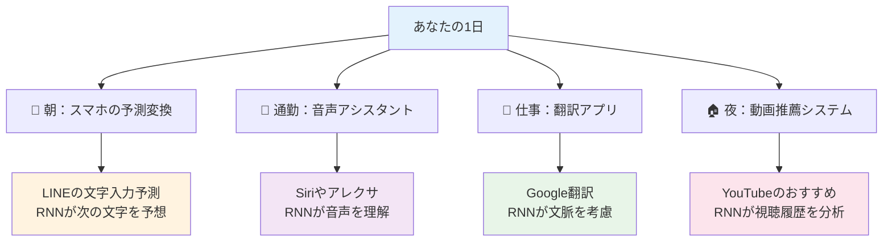

### 🏭 産業界での革新的活用

#### 1. 金融業界 - 「AIトレーダー」

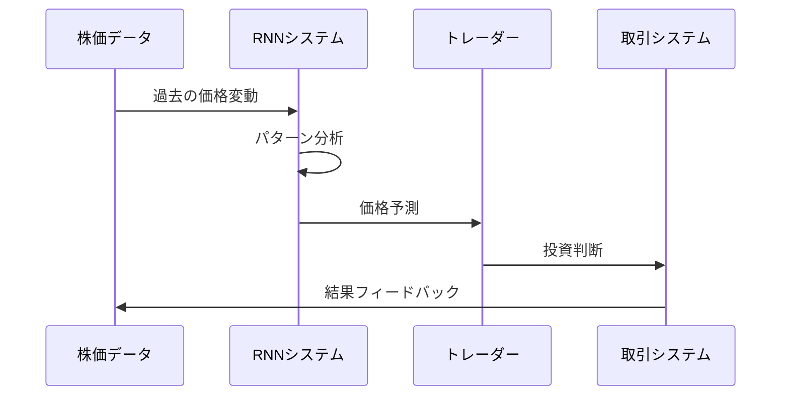

**具体例：**
- **株価予測**: 過去の値動きから明日の株価を予測
- **リスク管理**: 異常な取引パターンを検出
- **アルゴリズム取引**: 自動で最適なタイミングで売買

#### 2. 医療業界 - 「AIドクター」

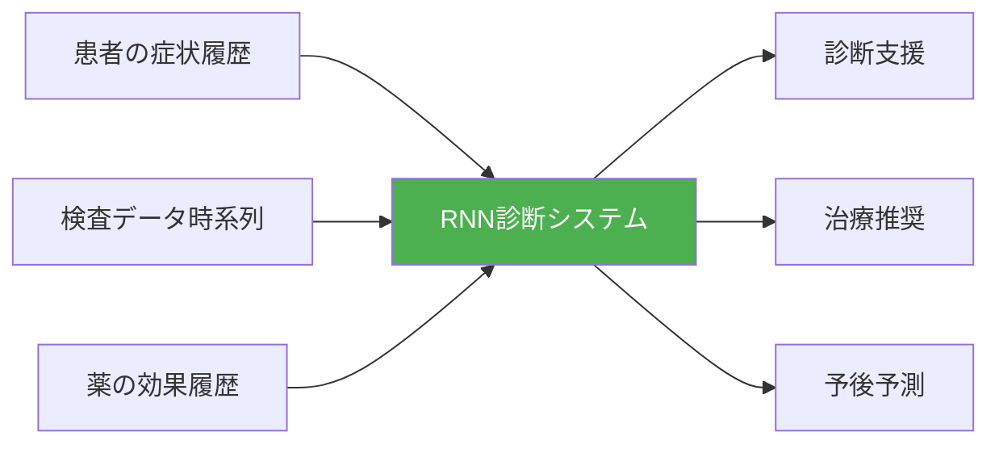

**具体例：**
- **病気の進行予測**: 患者の症状変化から病気の進行を予測
- **薬の効果分析**: 治療履歴から最適な薬を推奨
- **早期診断**: 微細な変化から病気の兆候を発見

#### 3. 製造業界 - 「予知保全システム」

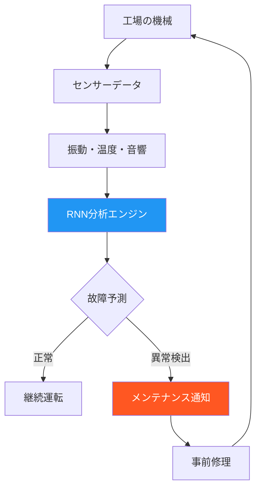

### 🌟 最先端の研究応用

#### 🎵 音楽生成AI
- **作曲AI**: バッハ風の楽曲を自動生成
- **伴奏システム**: リアルタイムで演奏に合わせた伴奏を生成

#### 🎮 ゲームAI  
- **NPCの会話**: プレイヤーとの自然な対話を実現
- **ゲーム攻略AI**: プレイヤーの行動パターンから戦略を立案

#### 🚗 自動運転
- **行動予測**: 他の車や歩行者の次の行動を予測
- **ルート最適化**: 交通状況の時系列変化を考慮した最適ルート

### 📈 市場への影響度

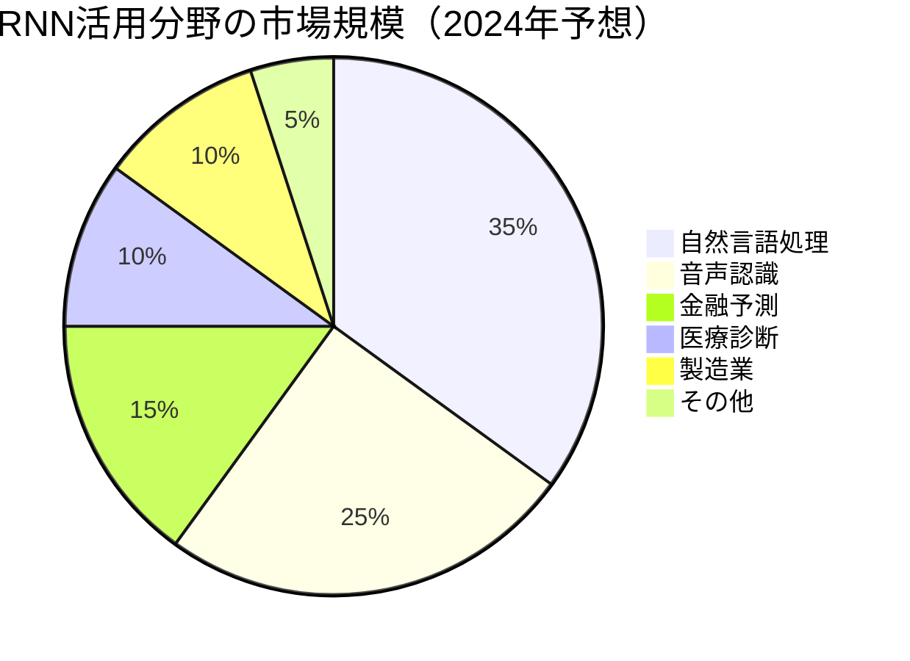

## 🌍 実世界への影響とその後の発展

RNNの登場は、AI技術に革命をもたらしただけでなく、私たちの社会全体に大きな変化をもたらしました。

### 🌊 社会への波及効果

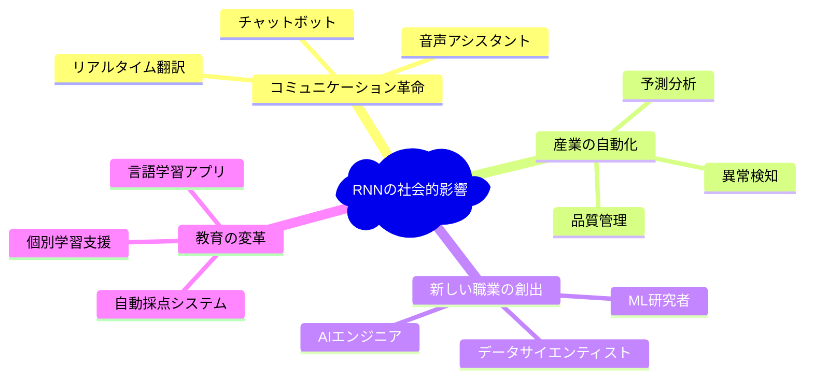

### 📊 技術発展のタイムライン

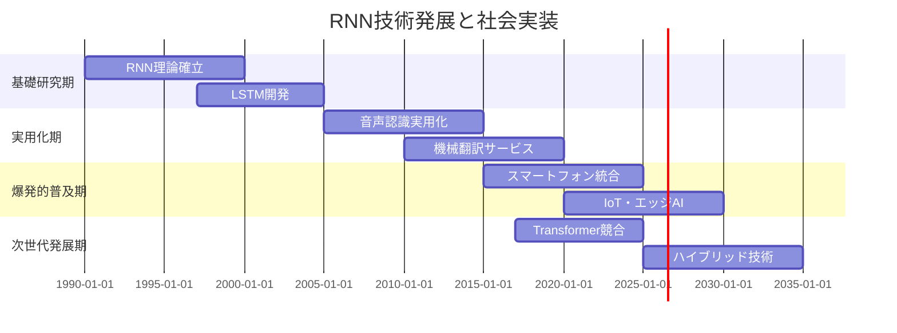

### 🔮 未来への展望

#### 短期展望（2025-2030年）
- **エッジAI**: スマートフォンやIoTデバイスでのリアルタイムRNN処理
- **マルチモーダル**: 文字・音声・画像を統合した理解システム
- **省エネルギー化**: より効率的なRNNアーキテクチャの開発

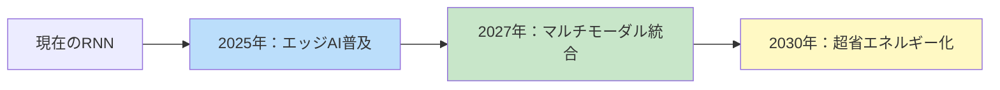

#### 長期展望（2030年以降）
- **量子RNN**: 量子コンピュータとの融合による革命的性能向上
- **生物学的統合**: 脳科学との融合による新しいAIアーキテクチャ
- **汎用AI**: RNNを基盤とした汎用人工知能の実現

### 🏗️ Transformerとの共存・競合関係

2017年に登場したTransformer技術は、RNNの強力なライバルとなりました。しかし、完全に置き換わるのではなく、互いの長所を活かした **ハイブリッド時代** に入っています。
- 提示された応用事例（自然言語処理、音声認識、時系列予測など）は、RNNが実際に活用されてきた分野として広く知られている。
- しかし、Transformerとの関係に関する記述は「RNNの強力なライバル」であり「ハイブリッド時代」に入っているという点が正確である一方、現在の大規模言語モデル（LLM）の主流はほぼTransformerであり、RNN単独の応用は限定的になっているという文脈の補足が必要。
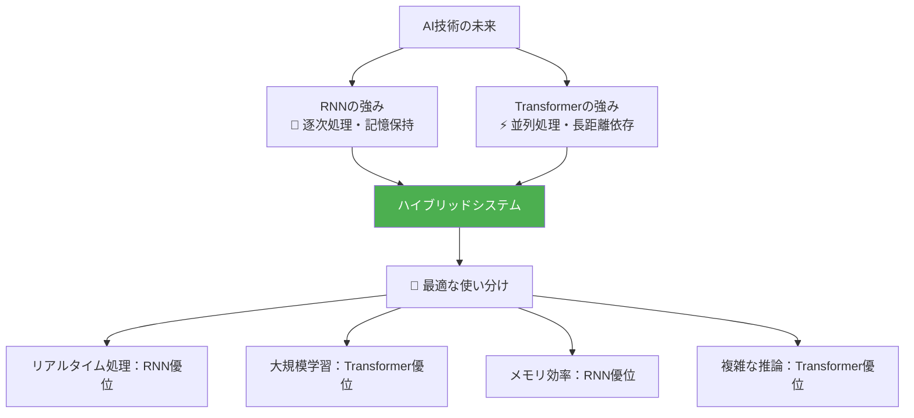

### 🎓 学習への次のステップ

RNNをマスターしたあなたが次に学ぶべき技術：

1. **LSTM・GRUの詳細実装** → [/docs/lstm-gru-implementation.md](./lstm-gru-implementation.md)
2. **Transformer技術との比較** → [/docs/transformer-vs-rnn.md](./transformer-vs-rnn.md)
3. **実践的なRNNプロジェクト** → [/docs/rnn-projects.md](./rnn-projects.md)
4. **最新のRNN研究動向** → [/docs/latest-rnn-research.md](./latest-rnn-research.md)

---
