AI（人工知能）における、（深層学習 = ディープラーニング = Deep Learning）のうち、RNN（Recurrent neural network） = リカレントニューラルネットワーク について

# RNN（リカレントニューラルネットワーク） - 初学者のための完全ガイド

## 🔍 一言要約
記憶力を持った人工の脳が、時系列データを理解する技術

## 📚 目次
1. [🌟 はじめに](#-はじめに)
2. [🏗️ 基本構造](#️-基本構造)
3. [⚡ 主要技術](#-主要技術)
4. [📜 時代背景と発見に至った経緯](#-時代背景と発見に至った経緯)
5. [🎨 種類と特徴](#-種類と特徴)
6. [📗 関連する用語](#-関連する用語)
7. [💡 メリットとデメリット](#-メリットとデメリット)
8. [🚀 応用と実例](#-応用と実例)
9. [🔄 置換、変遷](#-置換変遷)
10. [⚔️ 代替、競合](#️-代替競合)
11. [🌍 実世界への影響とその後の発展](#-実世界への影響とその後の発展)

## 🌟 はじめに

「昨日何を食べましたか？」と聞かれたとき、あなたの脳は過去の記憶を呼び出して答えます。では、コンピューターが文章を読むとき、前に読んだ単語を覚えていられるでしょうか？

普通のニューラルネットワーク（脳の神経を真似た仕組み）は、まるで**記憶喪失の人**のように、一つ前の情報すら覚えていません。「私は」という単語を見ても、次に「学生」が来るのか「先生」が来るのか判断できないのです。

そこで生まれたのが**RNN（リカレントニューラルネットワーク）**です。これは「**記憶力を持った人工の脳**」と考えてください。過去の情報を記憶しながら、現在の情報と組み合わせて判断する、まさに人間の思考に近い仕組みです。

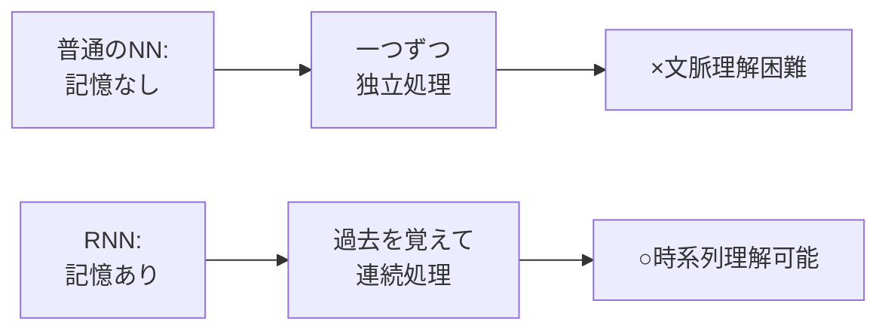

## 🏗️ 基本構造

RNNの基本構造を、**リレーランナー**に例えて説明しましょう。

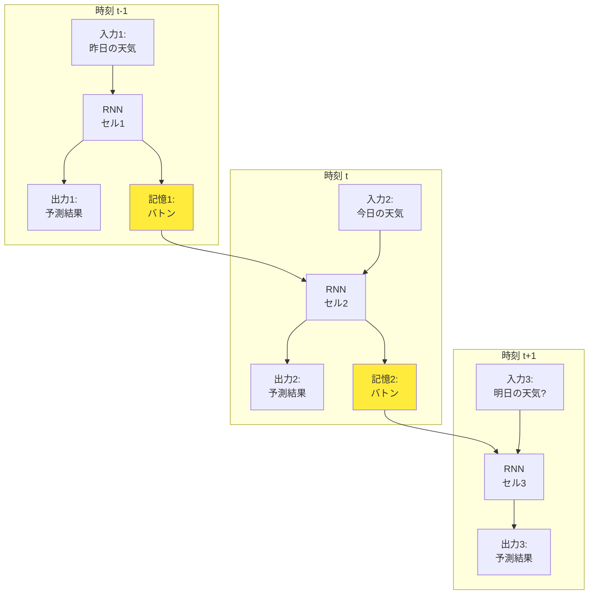

### 構造の特徴

1. **リレーのバトン（隠れ状態）**: 前の時刻の記憶を次に渡す
2. **同じランナー（重み共有）**: すべての時刻で同じ処理ルールを使用
3. **連続処理**: 時系列データを順番に処理

この仕組みにより、RNNは「昨日は雨、今日は曇り、だから明日は...」のような**時間的な流れ**を理解できるのです。

## ⚡ 主要技術

### 1. 隠れ状態（Hidden State）
**記憶の本体**です。まるで人間の**短期記憶**のように働きます。

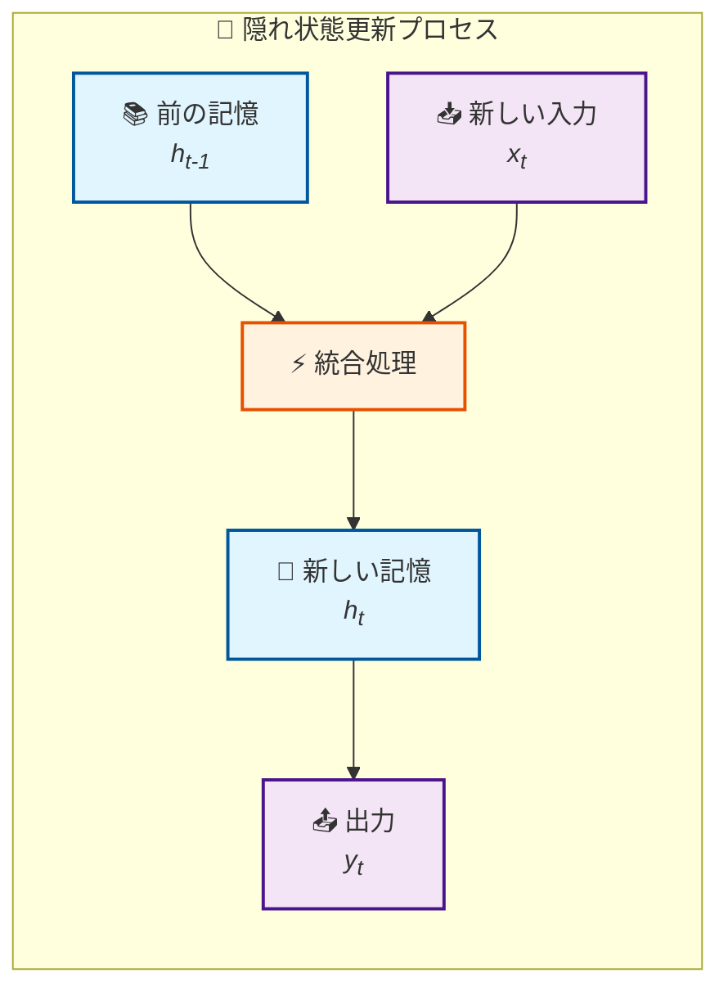

### 2. 重み共有（Weight Sharing）
**同じ学習内容を全時刻で共有**する仕組み。例えば、「雨の後は晴れやすい」というルールを覚えたら、データのどの部分でも同じルールを適用します。

### 3. バックプロパゲーション・スルー・タイム（BPTT）
RNNの学習方法で、**時間を遡って間違いを修正**する仕組み。まるで「あの時の判断が間違っていた」と過去を振り返るように学習します。

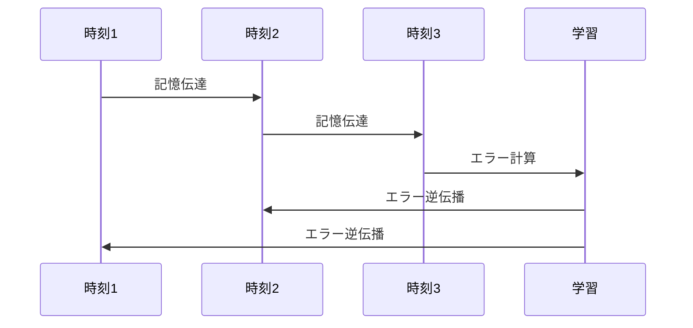

## 📜 時代背景と発見に至った経緯

### 1980年代：記憶のないAIの限界

当時のニューラルネットワークは、まるで**写真を一枚ずつ見る人**のようでした。文章「私は学生です」を処理するとき：
- 「私」→ わからない
- 「は」→ わからない  
- 「学生」→ わからない
- 「です」→ わからない

### 1982年：ホップフィールドの発見
ジョン・ホップフィールドが「**記憶を持つネットワーク**」のアイデアを提案。これが現代RNNの祖先となりました。

### 1986年：エルマンネットワーク
ジェフリー・エルマンが**「時間的な文脈を理解するネットワーク」**を開発。これが現在のRNNの直接の起源です。

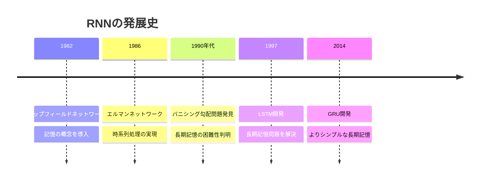

### 背景となった課題
- **機械翻訳**：「I love you」を「私はあなたを愛しています」に翻訳するには、文全体の文脈理解が必要
- **音声認識**：「こんにちは」という音声の「こ」「ん」「に」「ち」「は」を順番に理解する必要
- **株価予測**：過去の値動きから未来を予測する必要

## 🎨 種類と特徴

### 1. 基本RNN（バニラRNN）
**最もシンプルな記憶機能**を持つRNN。短期記憶は得意ですが、長期記憶は苦手です。

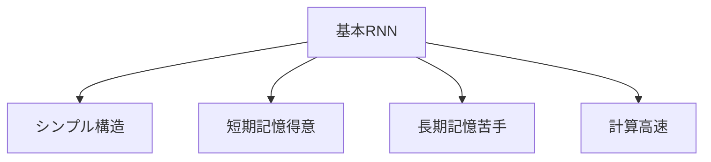

### 2. LSTM（Long Short-Term Memory）
**選択的記憶機能**を持つRNN。重要な情報は長期間覚え、不要な情報は忘れる「**賢い記憶システム**」です。

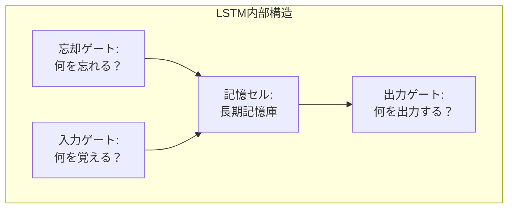

### 3. GRU（Gated Recurrent Unit）
**LSTMの簡単版**。LSTMより構造は単純ですが、多くの場合で同等の性能を発揮します。

### 4. 双方向RNN（Bidirectional RNN）
**未来も過去も見る**RNN。文章の途中で判断するとき、後の文脈も参考にできます。

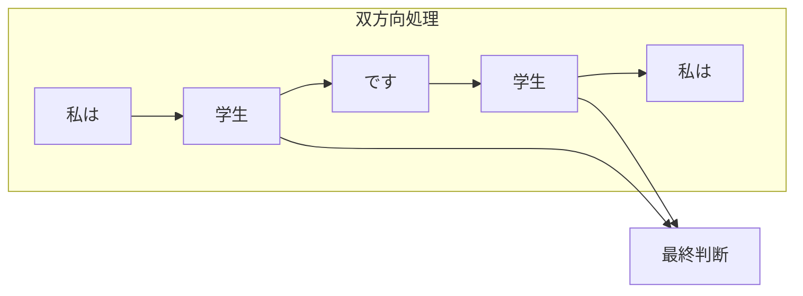

| 種類 | 記憶期間 | 計算速度 | 適用場面 |
|------|----------|----------|----------|
| 基本RNN | 短期 | 高速 | 簡単な予測 |
| LSTM | 長期 | 中程度 | 複雑な文章理解 |
| GRU | 長期 | 高速 | LSTM代替 |
| 双方向RNN | 文全体 | 低速 | 文章解析 |

## 📗 関連する用語

### 同義語・類似語
- **リカレントニューラルネットワーク** = **RNN** = **循環神経網**
- **隠れ状態** = **記憶状態** = **内部状態**
- **時系列データ** = **シーケンスデータ** = **連続データ**

### 対義語・関連語
| RNN用語 | 対義語 | 説明 |
|---------|--------|------|
| 時系列処理 | 独立処理 | 順序ありvs順序なし |
| 記憶あり | 記憶なし | 過去情報の利用有無 |
| 動的 | 静的 | 時間変化への対応 |

### 専門用語の日常語変換
- **勾配消失問題** → 遠い記憶ほど薄れる問題
- **勾配爆発問題** → 記憶が強すぎて混乱する問題  
- **ゲート機構** → 情報の出入りを制御する門
- **アテンション機構** → 重要な部分に注目する機能

## 💡 メリットとデメリット

### ✅ メリット

#### 1. 時系列理解能力
**人間のような連続思考**が可能です。
- 例：「天気が悪いから、傘を...」→「持っていこう」

#### 2. 可変長データ対応
**異なる長さのデータ**を扱えます。
- 短文：「こんにちは」
- 長文：「おはようございます。今日はいい天気ですね。」

#### 3. パターン学習
**時間的なパターン**を発見できます。
- 株価の周期的変動
- 音楽のメロディーライン
- 言語の文法構造

### ❌ デメリット

#### 1. 計算時間の長さ
**順次処理**のため、並列化が困難です。

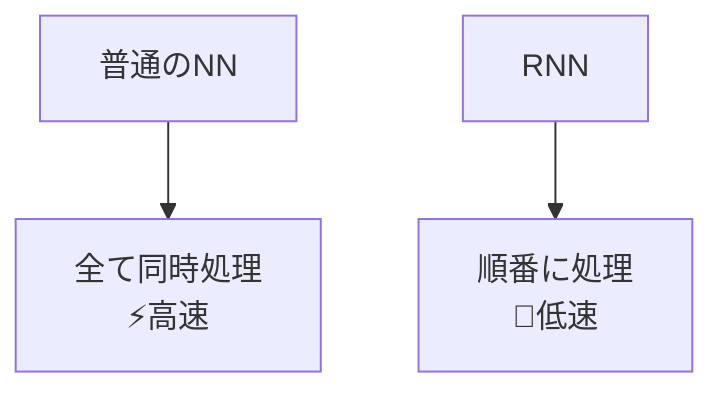

#### 2. 長期記憶の困難
**基本RNNは長い記憶が苦手**です。
- 100語前の情報は忘れがち
- 文章全体の理解が困難

#### 3. 学習の不安定性
**勾配問題**により学習が困難になることがあります。

## 🚀 応用と実例

### 1. 身近な応用例

#### スマートフォン
- **音声認識**：「Hey Siri」「OK Google」
- **文字予測**：メール入力時の候補表示
- **翻訳アプリ**：Google翻訳など

#### 日常サービス
- **Netflix推薦**：視聴履歴から次の作品を予測
- **株価アプリ**：過去データから将来予測
- **天気予報**：気象データの時系列解析

### 2. 産業応用

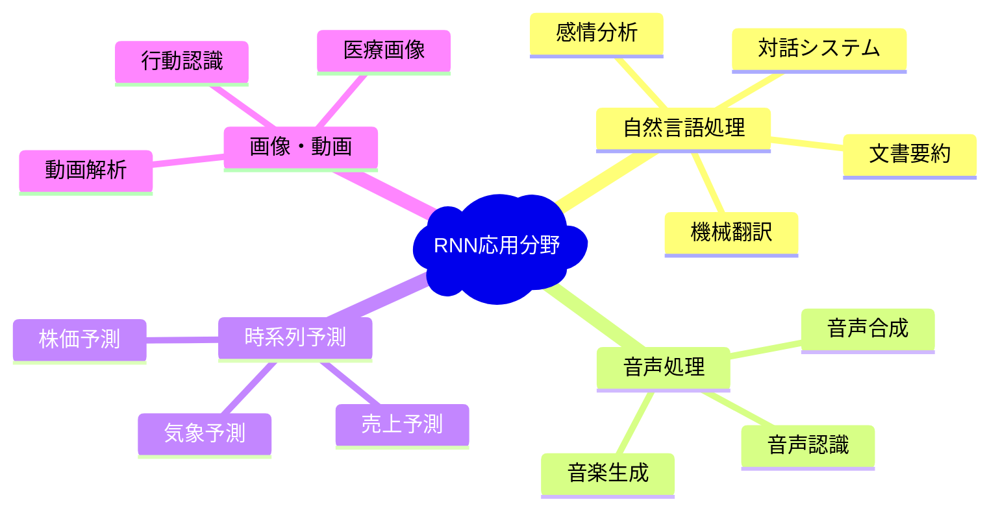

### 3. 具体的な成功事例

#### Google翻訳（2016年改善）
RNN導入により翻訳精度が**大幅向上**：
- 従来：単語ごとの直訳
- RNN後：文脈を理解した自然な翻訳

#### 音声アシスタント
- **Siri**：自然な会話理解
- **Alexa**：文脈を考慮した応答

## 🔄 置換、変遷

### 何を置き換えたか

#### 1. 統計的手法の置き換え
**従来**：n-gramモデル（直前のn個の単語のみで予測）
```
"I love" → "you"（直前2語のみで判断）
```

**RNN**：文全体の文脈で予測
```
"Yesterday I met my girlfriend and told her I love" → "her"
```

#### 2. ルールベースシステムの置き換え
**従来**：専門家が作った固定ルール
**RNN**：データから自動学習するルール

### 何かに置き換えられたか

#### 1. Transformerによる置き換え（2017年〜）
**問題**：RNNの順次処理による速度低下
**解決**：Transformer（並列処理可能）

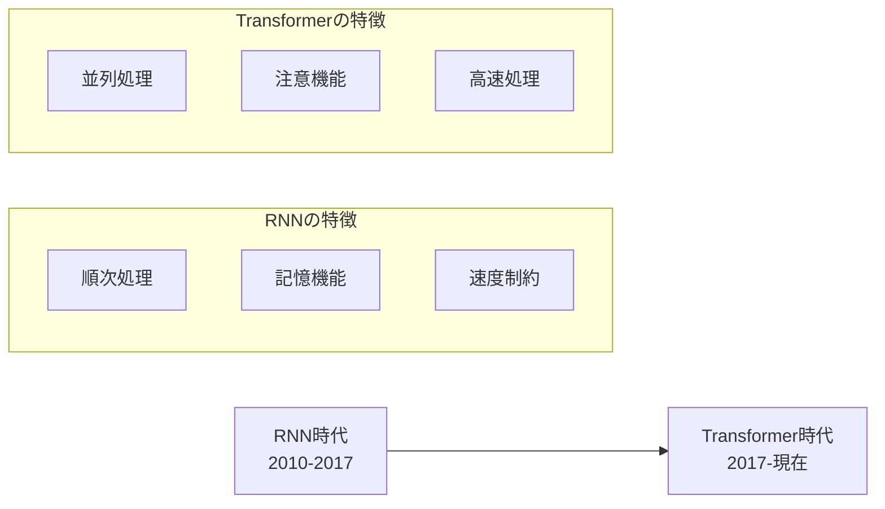

#### 2. 部分的な生き残り
- **軽量アプリ**：スマートフォンなど計算資源が限られた環境
- **リアルタイム処理**：即座の応答が必要な場合
- **特定用途**：時系列予測など特化分野

## ⚔️ 代替、競合

### 代替可能な技術

#### 1. CNN（畳み込みニューラルネットワーク）
**適用範囲**：1次元時系列データに対して
**例**：音声データ、センサーデータ

#### 2. Transformer
**適用範囲**：自然言語処理、長い系列データ
**優位性**：並列処理可能、長距離依存関係の処理

#### 3. Graph Neural Networks
**適用範囲**：構造化データの時系列変化
**例**：ソーシャルネットワークの変化

### 競合関係

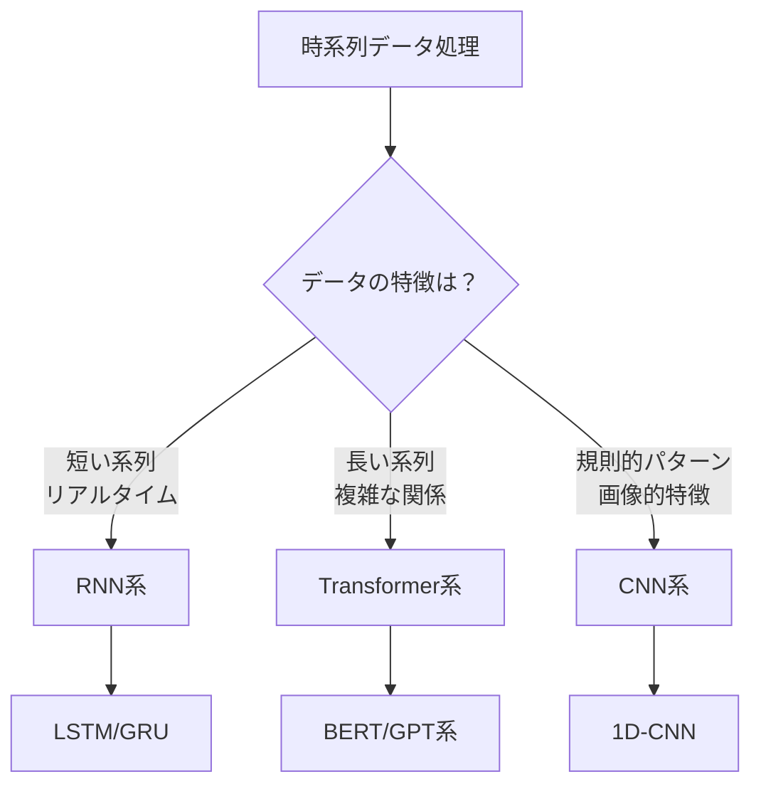

### 使い分けの基準

| 技術 | 得意分野 | 計算コスト | 精度 |
|------|----------|------------|------|
| RNN | 短〜中期時系列 | 低 | 中 |
| Transformer | 長期依存関係 | 高 | 高 |
| CNN | パターン認識 | 中 | 中 |

## 🌍 実世界への影響とその後の発展

### 社会への影響

#### 1. コミュニケーション革命
**機械翻訳の普及**により：
- 言語の壁が低下
- 国際的なビジネス・交流が活性化
- 翻訳者の役割変化（精緻な翻訳により特化）

#### 2. 情報アクセスの民主化
**音声認識の普及**により：
- 文字入力が困難な人でも情報アクセス可能
- 高齢者のデジタルデバイド解消
- ハンズフリー操作の普及

#### 3. 予測技術の向上
**時系列予測の精度向上**により：
- より正確な気象予報
- 効率的な在庫管理
- エネルギー需要の最適化

### 技術的発展と未来展望

#### 現在の発展方向（2020年代〜）

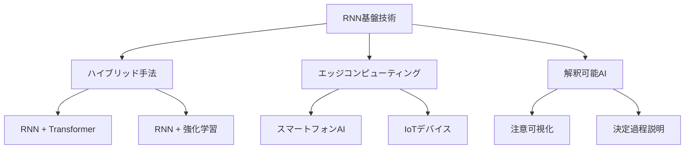

#### 未来への展望

1. **量子RNN**：量子コンピュータを活用した超高速処理
2. **脳型RNN**：人間の脳により近い情報処理方式
3. **自己改良RNN**：自分自身を改善し続けるシステム

### 学術・産業への長期的影響

#### 学術分野
- **認知科学**：人間の記憶・学習メカニズム理解の深化
- **言語学**：言語の統計的性質の新発見
- **心理学**：時系列認知プロセスの解明

#### 産業分野  
- **金融**：高精度リスク予測モデル
- **医療**：患者の状態変化予測
- **製造業**：予知保全システム

### まとめ：RNNが切り開いた未来

RNNは「**記憶を持つAI**」という概念を実現し、コンピュータに**時間的思考**を与えました。現在はTransformerに主役を譲りましたが、その基本思想は現代AIの基盤となっています。

まるで人間が過去の経験を活かして判断するように、AIも過去の情報を記憶し活用する──この当たり前に思える能力を初めて実現したのがRNNなのです。

そして今もなお、軽量で効率的な記憶システムとして、私たちの身の回りのデバイスで活躍し続けています。スマートフォンのキーボード予測、音声認識、リアルタイム翻訳など、RNNの恩恵は日常生活に深く浸透しているのです。

---

**学習の次のステップ**：
- [LSTM詳細ガイド](/docs/lstm-guide.md) - より高度な記憶機構を学ぶ
- [Transformer入門](/docs/transformer-basics.md) - 現代AIの主流技術を理解する
- [時系列データ分析](/docs/time-series-analysis.md) - 実践的な応用を学ぶ
