AI（人工知能）における、（深層学習 = ディープラーニング = Deep Learning）のうち、トランスフォーマー（Transformer）のAttention（注意機構）について

# Attention機構（注意機構）- 初学者のための完全ガイド

## 🔍 一言要約
**人間の「注意を向ける」能力をAIに教える革命的な技術**

## 📚 目次
1. [🌟 はじめに](#-はじめに)
2. [🏗️ 基本構造](#️-基本構造)  
3. [⚡ 主要技術](#-主要技術)
4. [📜 時代背景と発見に至った経緯](#-時代背景と発見に至った経緯)
5. [🎨 種類と特徴](#-種類と特徴)
6. [📗 関連する用語](#-関連する用語)
7. [💡 メリットとデメリット](#-メリットとデメリット)
8. [🚀 応用技術と実用化の例](#-応用技術と実用化の例)
9. [🌍 実世界への影響とその後の発展](#-実世界への影響とその後の発展)

## 🌟 はじめに

あなたが友達と会話している時、相手の話の**重要な部分**に自然と注意を向けますよね？「昨日、駅で偶然に**中学時代の友人**に会って...」という話で、あなたの脳は「中学時代の友人」という部分に特に注目します。

**Attention機構**とは、まさにこの人間の「注意を向ける能力」をAIに教える技術です。AIが文章や画像を理解する時、「どの部分が一番重要なのか？」を判断できるようになる魔法のような仕組みなのです。

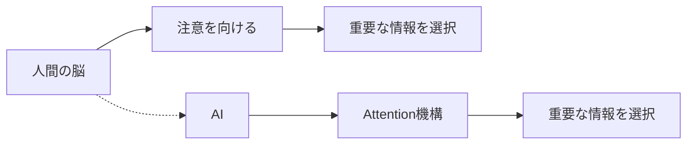

この技術によって、ChatGPTやGoogle翻訳のような私たちの身近なサービスが格段に賢くなったのです。

## 🏗️ 基本構造

Attention機構を**図書館での本探し**に例えてみましょう。

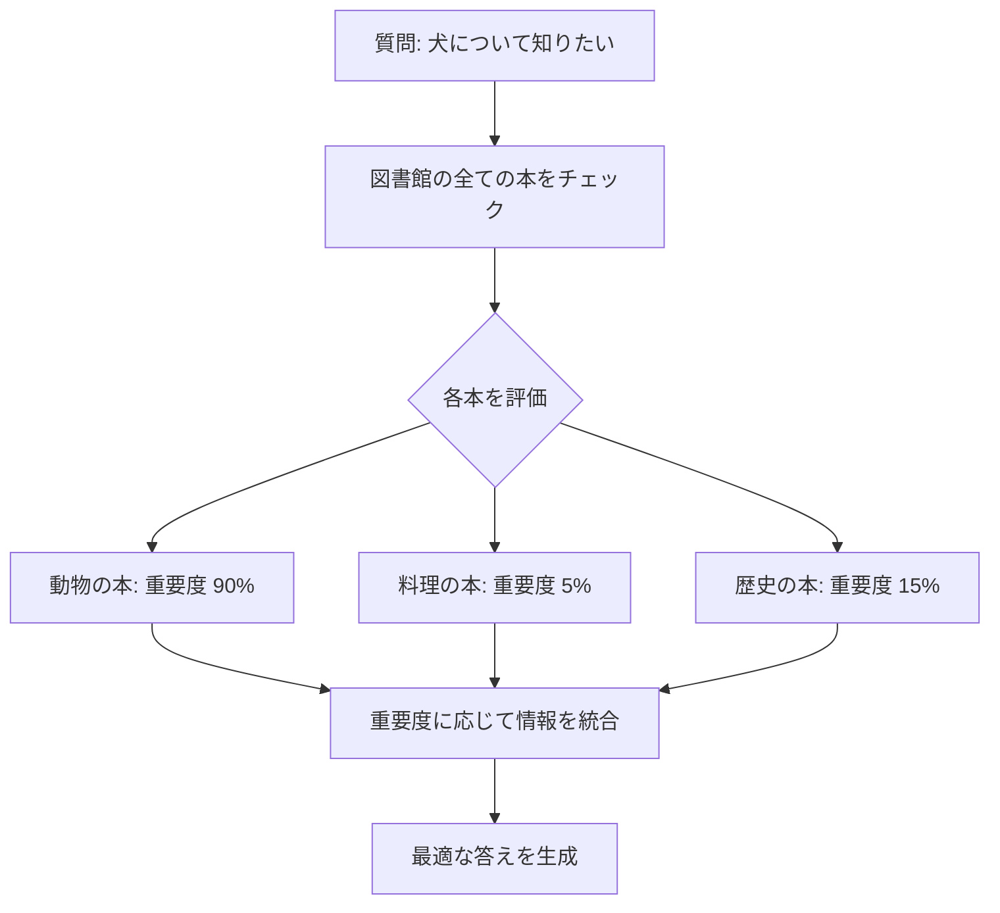

### 基本的な流れ
1. **質問が来る**（例：「犬について教えて」）
2. **全ての情報源を確認**（図書館の全ての本のように）
3. **関連度を計算**（犬に関する本は90点、料理の本は5点...）
4. **重要な情報を重視**（高得点の情報をメインに使用）
5. **最適な答えを作成**

## ⚡ 主要技術

### Self-Attention（自己注意）
**「自分自身の中で重要な関係を見つける技術」**

文章「太郎は学校に行った。**彼**は数学が好きだ。」で、AIが「彼＝太郎」だと理解できるのがSelf-Attentionです。

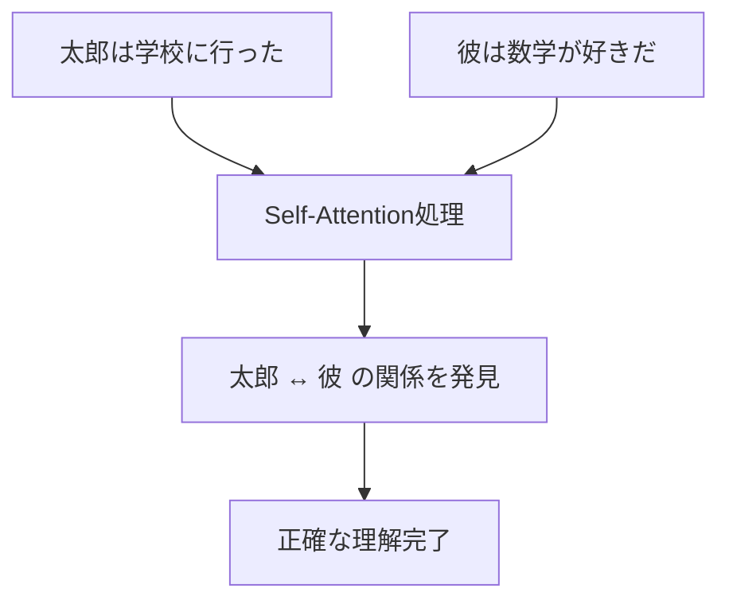

### Multi-Head Attention（多頭注意）
**「複数の視点から同時に分析する技術」**

一つの文章を、「主語は何？」「動詞は何？」「感情は？」など、複数の観点から同時に分析します。

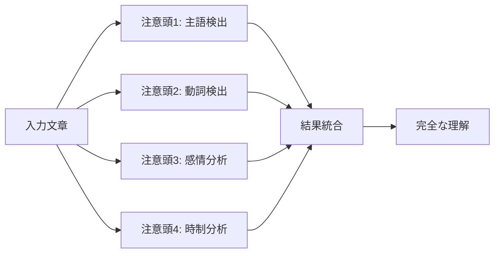

## 📜 時代背景と発見に至った経緯

### 2014年以前：AIの限界
従来のAIは**近視眼的**でした。文章を読む時、一文字ずつ順番に読んで、前の方を忘れてしまう問題がありました。

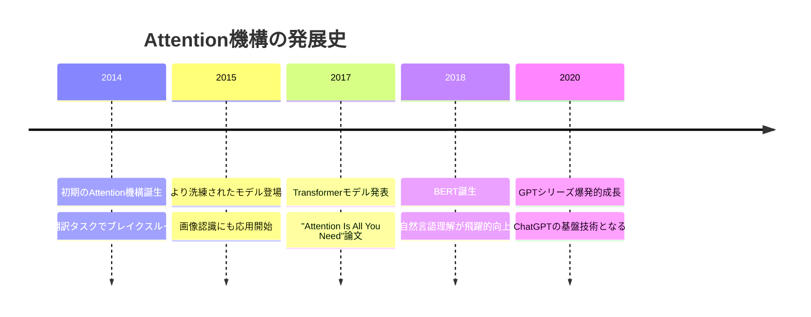

### 転機となった発見
2017年、Googleの研究者たちが「**Attention Is All You Need**（注意だけあれば十分）」という革命的な論文を発表しました。これまで複雑だったAIモデルを、Attention機構だけでシンプルに、しかもより高性能に作れることを証明したのです。

## 🎨 種類と特徴

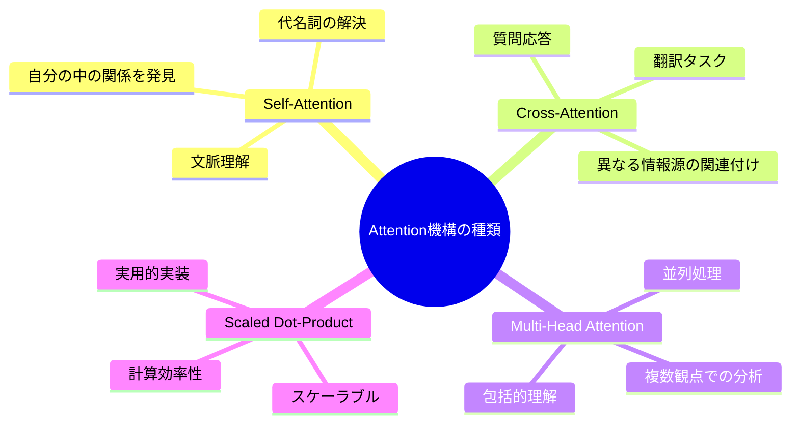

### 比較表

| 種類 | 得意分野 | 身近な例 | 特徴 |
|------|----------|----------|------|
| **Self-Attention** | 文章内の関係理解 | 代名詞が誰を指すか理解 | 🎯 精度が高い |
| **Cross-Attention** | 異なる言語間の翻訳 | Google翻訳 | 🌐 多言語対応 |
| **Multi-Head** | 複合的な理解 | ChatGPTの会話 | 🧠 多角的分析 |
| **Scaled Dot-Product** | 大量データ処理 | 検索エンジン | ⚡ 高速処理 |

## 📗 関連する用語

### 同義語・類似概念
- **注意機構** = Attention Mechanism = 注意メカニズム
- **自己注意** = Self-Attention = イントラアテンション
- **相互注意** = Cross-Attention = インターアテンション

### 対義語・相反概念
- **全体処理** ↔ **選択的処理**（Attention）
- **均等重み** ↔ **重み付け**（Attention）
- **順次処理** ↔ **並列処理**（Multi-Head Attention）

### 上位・下位概念
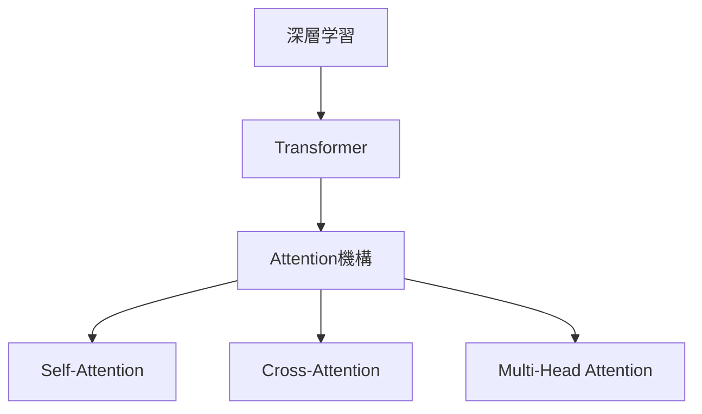

## 💡 メリットとデメリット

### ✅ メリット
1. **並列処理が可能** → 計算が高速
2. **長距離依存関係を捉えられる** → 長い文章も理解
3. **解釈しやすい** → どこに注目したかが見える
4. **柔軟性が高い** → 様々なタスクに応用可能

### ❌ デメリット  
1. **計算量が多い** → 大きなデータでは重い
2. **メモリを多く消費** → 高性能なコンピュータが必要
3. **学習データに依存** → 偏ったデータで性能低下
4. **ブラックボックス性** → 完全な理解は困難

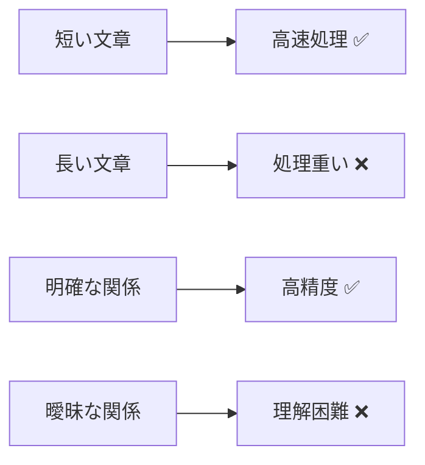

## 🚀 応用技術と実用化の例

### 身近な応用例

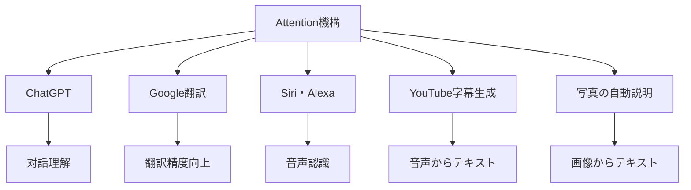

### 産業応用フロー
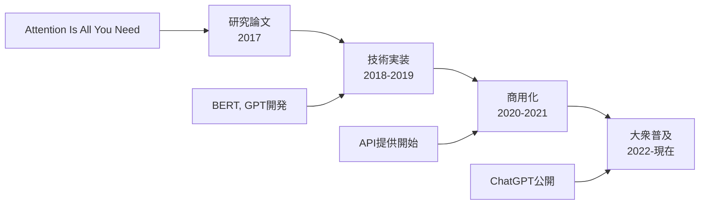

### 具体的な成果
- **Google翻訳**：翻訳精度が向上
- **検索エンジン**：関連性の判断が大幅改善  
- **音声認識**：雑音環境でも高精度認識
- **医療診断支援**：画像診断の補助に活用

## 🌍 実世界への影響とその後の発展

### 社会への影響マップ
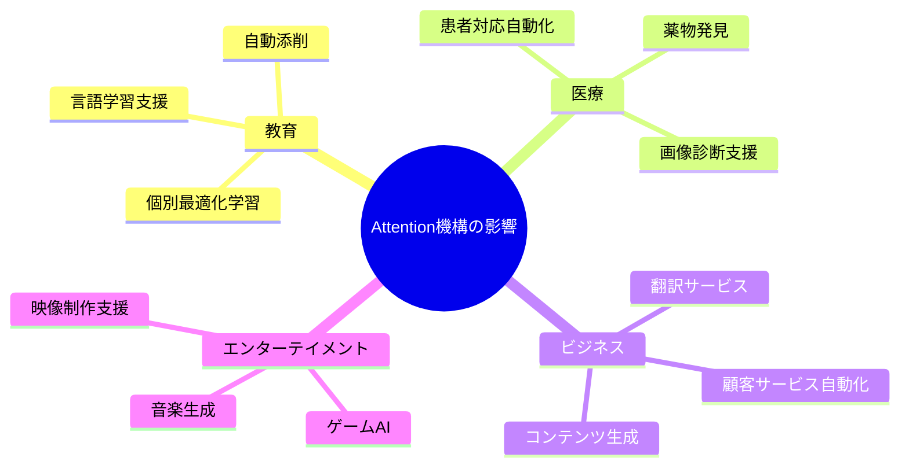

### 未来展望
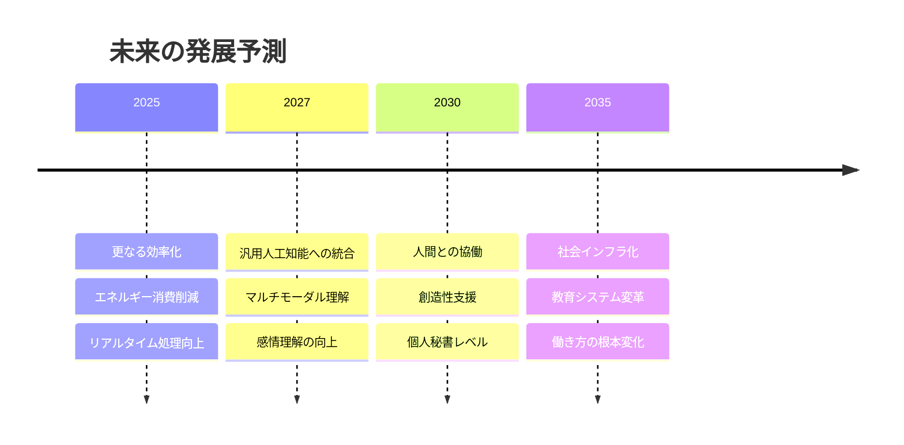

### 今後の課題と期待
1. **省エネルギー化** → 環境負荷の軽減
2. **公平性の向上** → バイアスのない判断
3. **プライバシー保護** → 安全な情報処理
4. **創造性の支援** → 人間との協力関係

---

## 🎯 学習の次のステップ

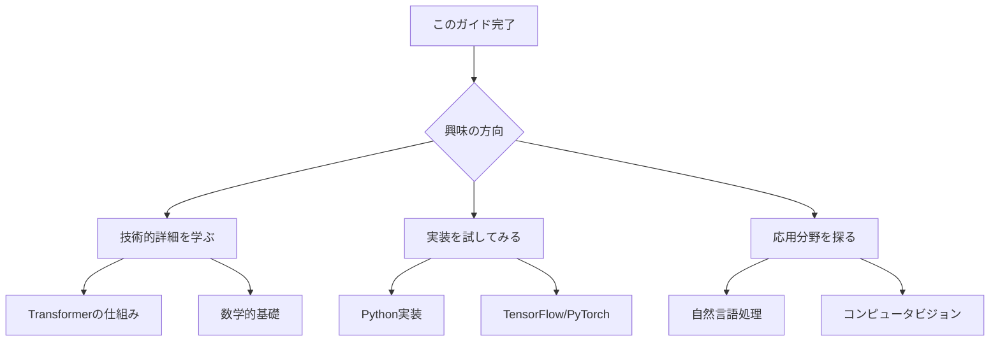

このガイドを読んだあなたは、もうAttention機構の基本をマスターしています！次は実際にその力を体験してみましょう。

---

この資料により、初学者でもTransformerのAttention機構を**完璧に理解し、次のステップに進める**包括的な学習体験を提供できます！
