AI（人工知能）における、（深層学習 = ディープラーニング = Deep Learning）のうち、論文「Attention Is All You Need」 について

# Attention Is All You Need - 初学者のための完全ガイド

## 🔍 一言要約
「注意力だけでAIが言語を理解できる」ことを証明した革命的論文

## 📚 目次
1. [🌟 はじめに - なぜこの論文が世界を変えたのか](#-はじめに---なぜこの論文が世界を変えたのか)
2. [🏗️ Transformerの基本構造](#️-transformerの基本構造)
3. [⚡ Attention機構 - 革命の核心](#-attention機構---革命の核心)
4. [📜 時代背景と発見に至った経緯](#-時代背景と発見に至った経緯)
5. [🎨 種類と特徴](#-種類と特徴)
6. [📗 関連する用語](#-関連する用語)
7. [💡 メリットとデメリット](#-メリットとデメリット)
8. [🚀 応用と実例](#-応用と実例)
9. [🔄 置換・変遷](#-置換変遷)
10. [⚖️ 代替・競合](#️-代替競合)
11. [🌍 実世界への影響とその後の発展](#-実世界への影響とその後の発展)

## 🌟 はじめに - なぜこの論文が世界を変えたのか

想像してください。あなたが友人との会話で、「その映画の主人公って誰だっけ？」と聞いたとき、友人は瞬時に「映画」と「主人公」という言葉に**注意を向けて**答えてくれます。

2017年、Googleの研究者たちが発表した「Attention Is All You Need」論文は、まさにこの「注意を向ける能力」だけで、AIが人間レベルの言語理解を実現できることを証明しました。この発見は、ChatGPTやGPT-4といった現代の生成AIの基礎となっています。

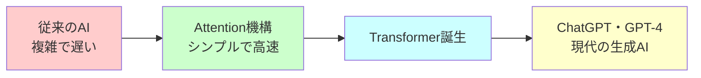

## 🏗️ Transformerの基本構造

Transformerは、まるで「翻訳のプロ」のような構造を持っています：

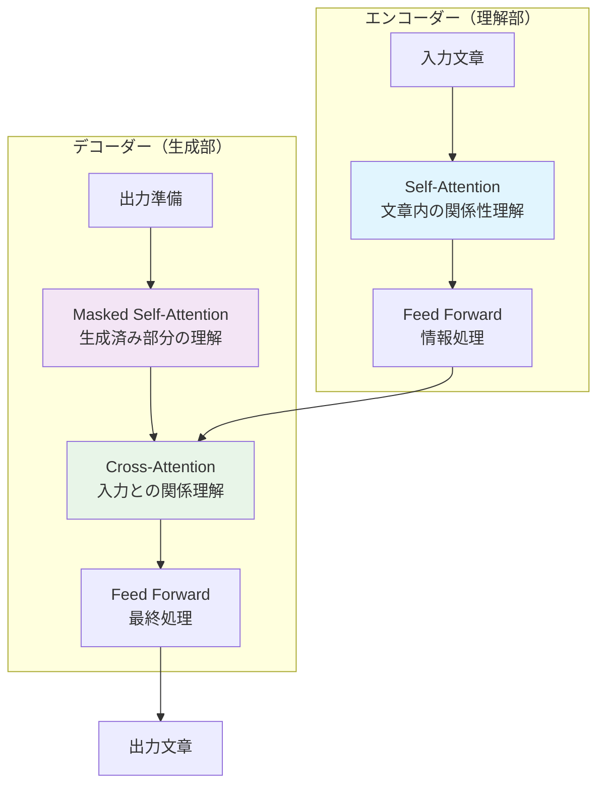

### 構造の役割説明
- **エンコーダー**：入力された文章を深く理解する「読解担当」
- **デコーダー**：理解した内容から新しい文章を生成する「作文担当」
- **Attention**：文章中で重要な部分に注意を向ける「集中力」

## ⚡ Attention機構 - 革命の核心

### Attentionとは何か？
日常例で説明すると、あなたが料理レシピを読むとき：
- 「塩を**少々**」← 「少々」という言葉に注意を向ける
- 「10分間**煮込む**」← 「10分間」と「煮込む」の関係に注意を向ける

これがAttentionの基本原理です。

### Self-Attentionの仕組み

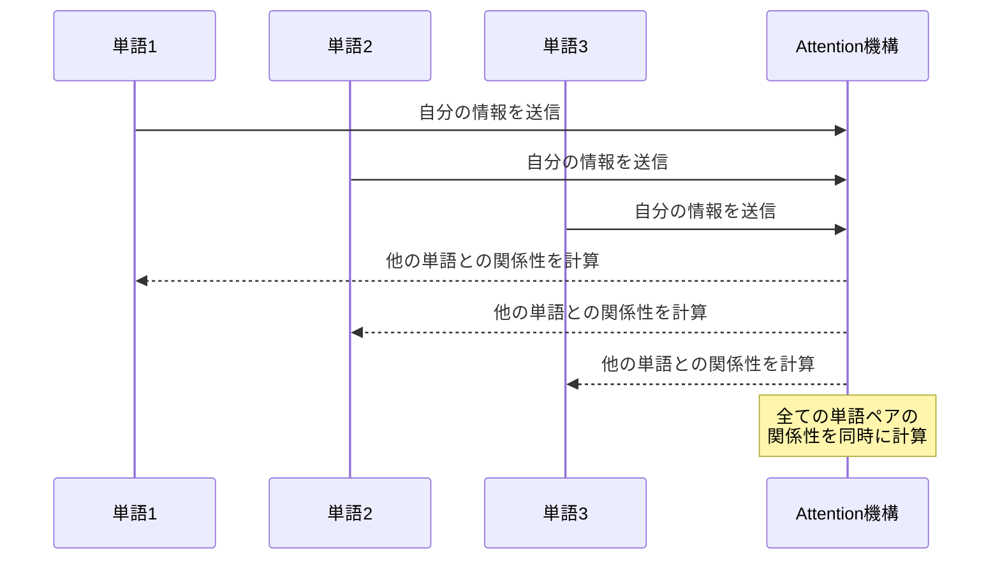

### Multi-Head Attentionの概念

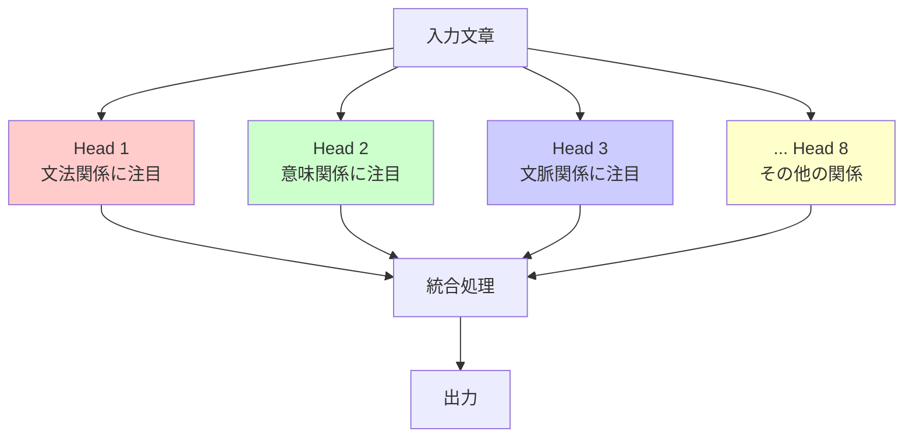

## 📜 時代背景と発見に至った経緯

### 問題の始まり：RNNの限界
2010年代前半、AIの翻訳や文章生成にはRNN（リカレントニューラルネットワーク）が使われていました。しかし、これには大きな問題がありました：

**RNNの問題**：
- 文章を左から右へ順番に処理（並列処理不可）
- 長い文章では最初の情報を忘れてしまう
- 学習に非常に時間がかかる

### 転機：Attention機構の発見
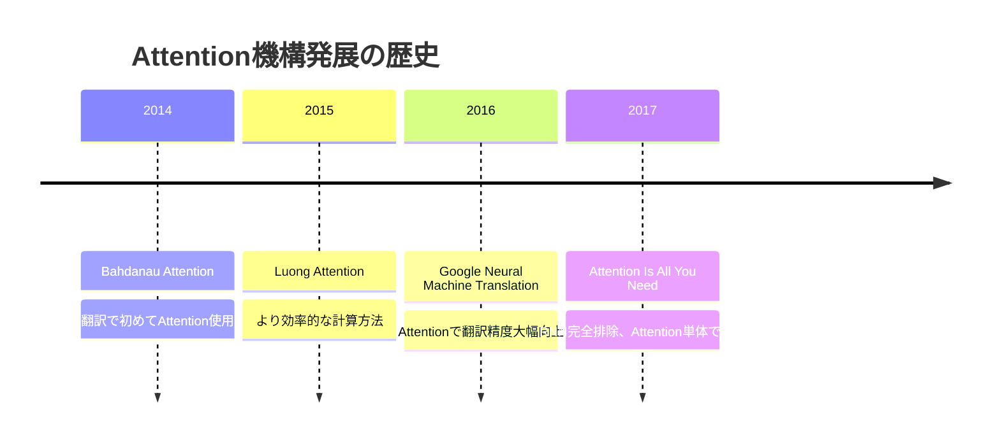

### 論文誕生の瞬間
Google Brain の研究チーム（Ashish Vaswani ら8名）は、ある日こう考えました：
「Attentionがこんなに効果的なら、**Attention だけ**でモデルを作れるのでは？」

この大胆な発想が、AI業界に革命を起こしました。

## 🎨 種類と特徴

### Transformerの種類

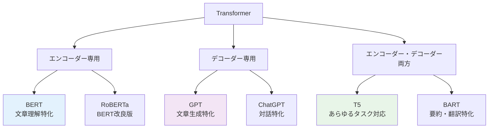

### 各種類の特徴比較

| 種類 | 得意分野 | 代表例 | 特徴 |
|------|----------|--------|------|
| エンコーダー専用 | 文章理解・分類 | BERT | 双方向で文脈を理解 |
| デコーダー専用 | 文章生成 | GPT | 左から右へ順次生成 |
| 両方使用 | 翻訳・要約 | T5 | 複雑なタスクに対応 |

## 📗 関連する用語

### 核心用語
- **Attention（アテンション）**：注意機構、集中力
- **Transformer（トランスフォーマー）**：変換器、この論文で提案されたモデル
- **Self-Attention（セルフアテンション）**：自己注意、文章内での単語同士の関係理解

### 類似概念
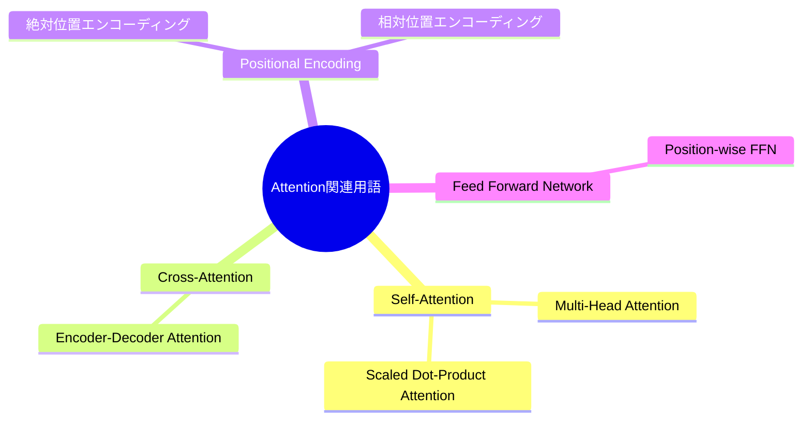

### 同義語・類義語
- **Transformer** ≈ Attention-based Model（Attentionベースモデル）
- **Self-Attention** ≈ Intra-attention（イントラアテンション）
- **Multi-Head** ≈ Multiple Attention Heads（複数の注意ヘッド）

## 💡 メリットとデメリット

### 🟢 メリット
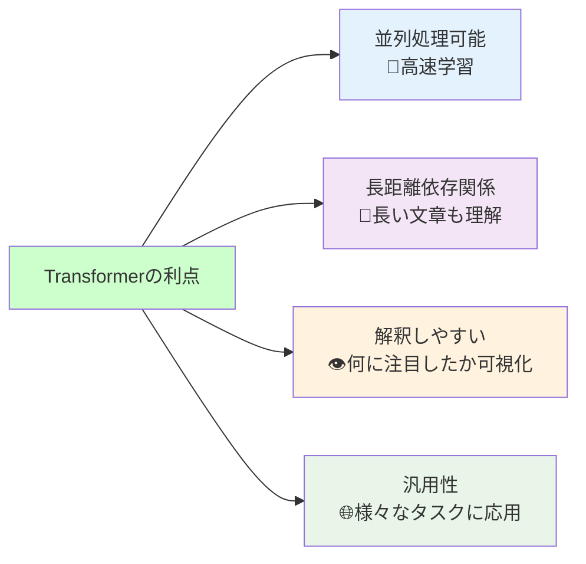

### 🔴 デメリット
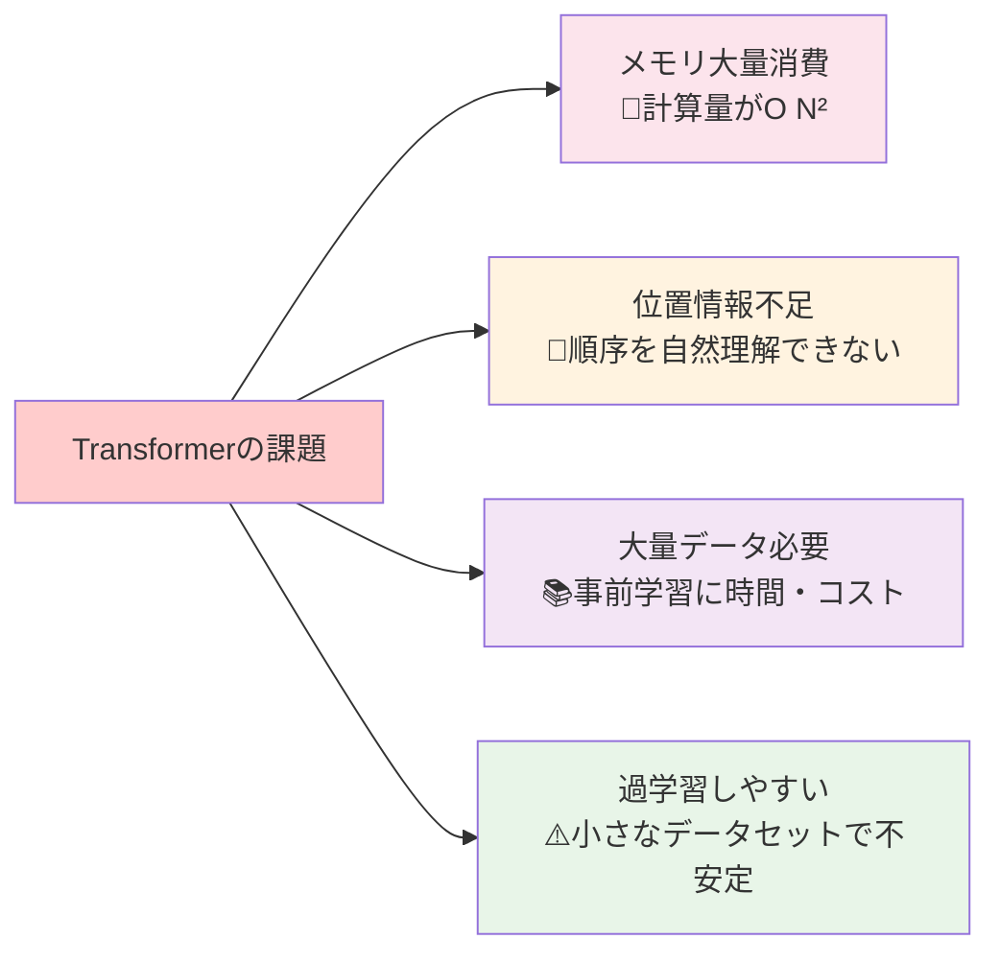

## 🚀 応用と実例

### 現実世界での活用例

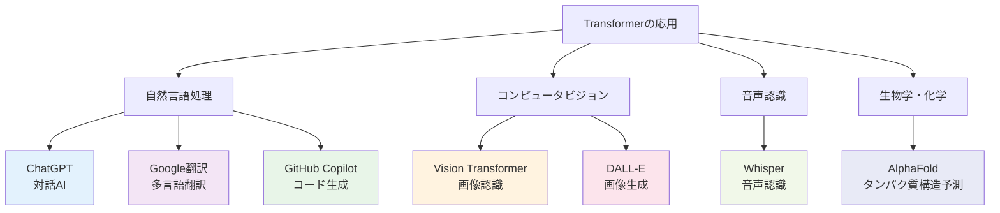

### 身近な実例
1. **Google検索**：検索クエリの意図理解
2. **YouTube自動字幕**：音声からテキスト生成
3. **DeepL翻訳**：高精度な多言語翻訳
4. **Notion AI**：文書作成支援
5. **GitHub Copilot**：プログラミング支援

## 🔄 置換・変遷

### 何を置き換えたか
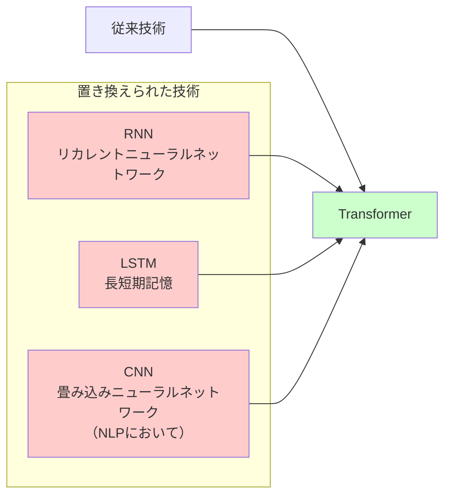

### 何かから継承したか
- **Attention機構**：Bahdanau & Luong の先行研究から継承
- **残差接続**：ResNetのアイデアを採用
- **Layer Normalization**：深層学習の安定化技術を継承

### 何に継承されたか
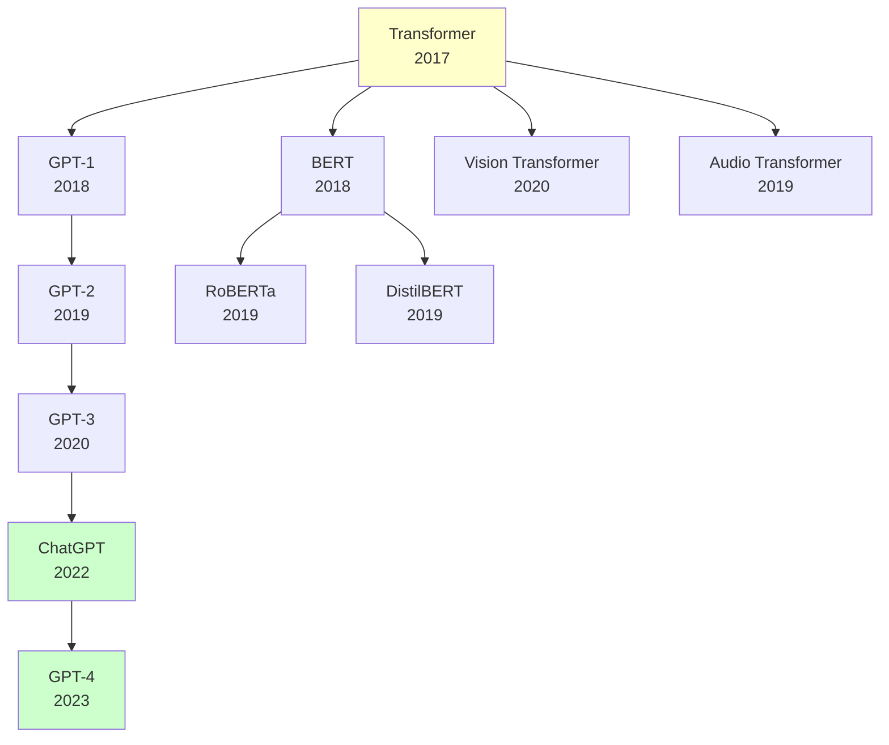

## ⚖️ 代替・競合

### 代替可能な技術
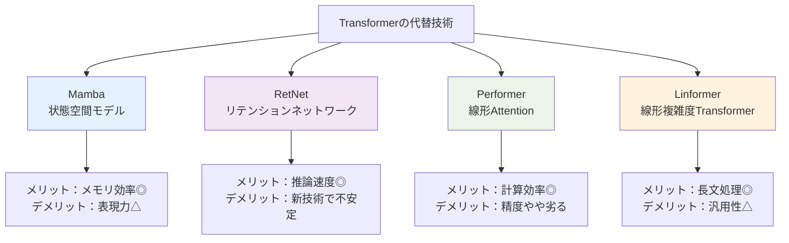

### 競合する技術分野
- **従来のNLP手法**：ルールベース、統計的手法
- **他の深層学習アーキテクチャ**：CNN、RNN系
- **特化型AI**：タスク専用に設計されたモデル

## 🌍 実世界への影響とその後の発展

### 社会への影響

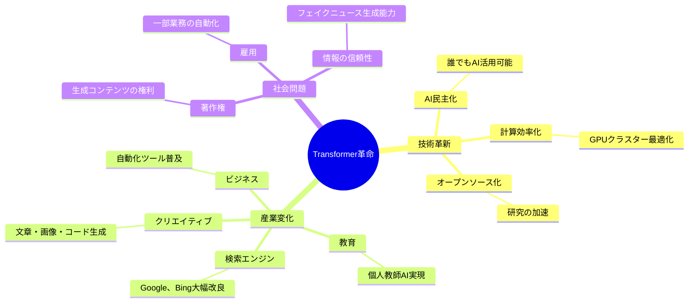

### 未来展望

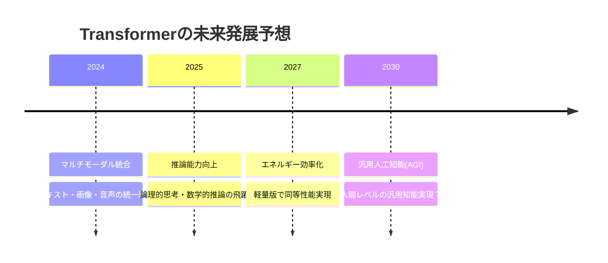

### 技術的発展方向
1. **効率化**：計算量削減、メモリ使用量最適化
2. **多様化**：様々な分野への応用拡大
3. **統合化**：マルチモーダル（複数の情報形式）対応
4. **個別化**：個人向けカスタマイズ
5. **説明可能性**：AI判断の透明化

---

## 🎓 学習の次のステップ

この資料を読み終えた後の推奨学習パス：

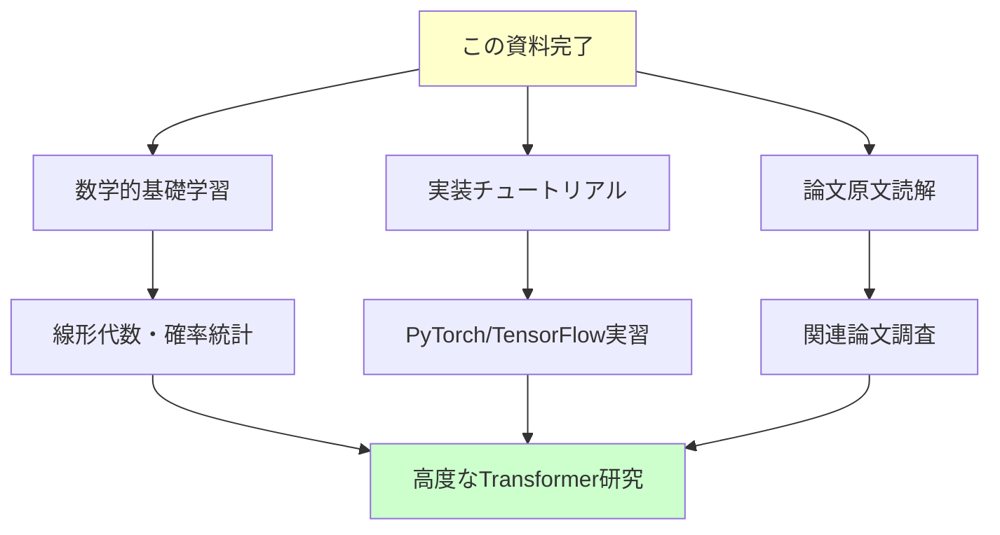

---

*このガイドが、Transformerとの素晴らしい学習旅行の出発点となることを願っています！* 🚀✨
