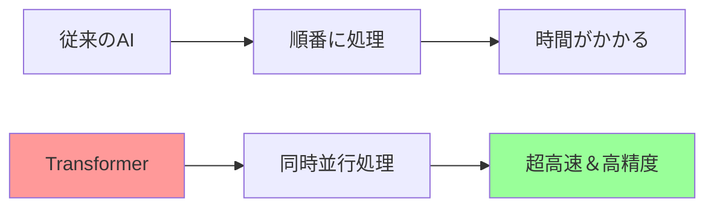
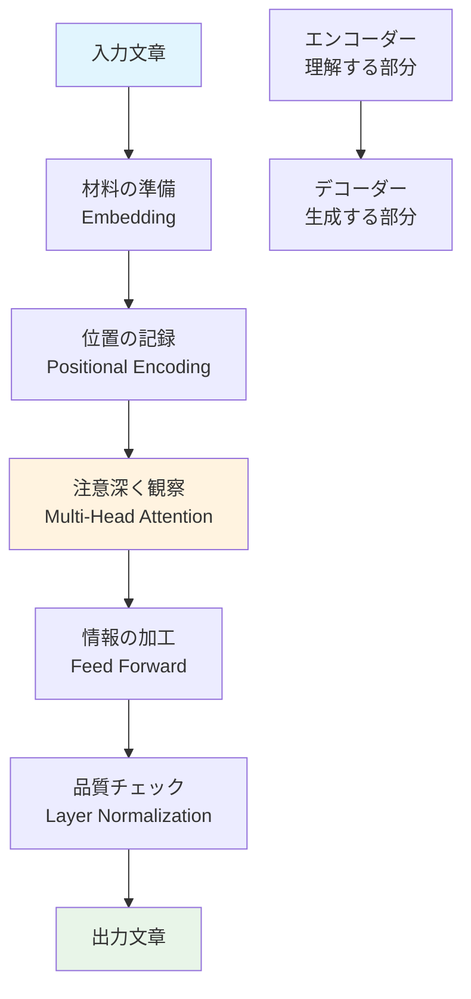
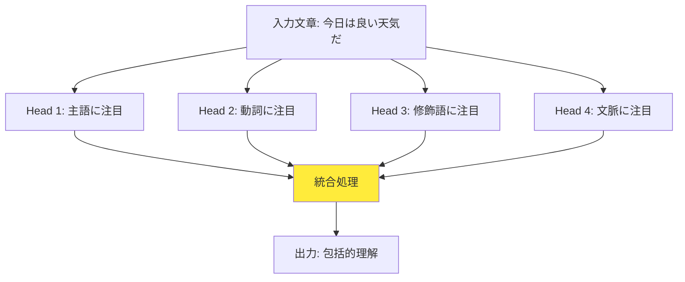
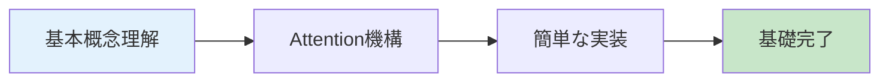
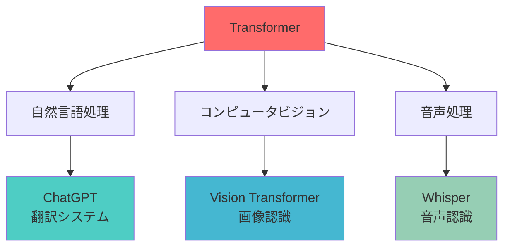

AI（人工知能）における、（深層学習 = ディープラーニング = Deep Learning）のうち、トランスフォーマー（Transformer）について

# 🚀 Transformerアーキテクチャ 完全理解ガイド

## 🌟 一言要約
**「注意を向ける場所を学習する」革命的なAI技術 - 人間の集中力をコンピュータで再現した画期的発明**

## 📖 目次
- [🚀 はじめに](#はじめに)
- [🏗️ アーキテクチャ概要](#アーキテクチャ概要)
- [🛠️ 主要機能](#主要機能)
- [📚 学習ロードマップ](#学習ロードマップ)
- [💡 実践応用](#実践応用)
- [🔗 関連リソース](#関連リソース)

## 🚀 はじめに

### 日常例えで理解するTransformer
Transformerは、**パーティーでの会話術の達人**のようなものです：

🎉 **パーティーシーン**: 騒がしいパーティーで、あなたは複数の会話を同時に聞いています
- 恋人の話（最重要）
- 友人の仕事話（重要）
- 隣の知らない人の話（軽く聞き流し）

この「**どの会話にどれくらい注意を向けるか**」を自動的に判断する仕組み—これがTransformerの核心「**Attention（注意機構）**」です！

### なぜ革命的なのか？

## 🏗️ アーキテクチャ概要

### 全体構造：料理のレシピに例えると

## 🛠️ 主要機能

### 1. 🎯 Multi-Head Attention（マルチヘッド注意機構）

**例え**: レストランの**超優秀なウェイター**
- 👀 **8つの目**を持っていて、同時に8つのテーブルを観察
- 🧠 各テーブルの状況を**並列処理**で把握
- ⚡ 一番重要な客に**瞬時に注意を向ける**

### 2. 🔄 Self-Attention（自己注意）

**例え**: **日記を読み返す人**
- 📖 文章の各単語が、**他のすべての単語との関係**を学習
- 💭 「この『彼』は誰を指しているの？」を自動判断
- 🔍 文脈の中で最も重要な単語を自動発見

### 3. 🎚️ Positional Encoding（位置エンコーディング）

**例え**: **住所システム**
- 🏠 同じ単語でも「文の最初」と「文の最後」では意味が違う
- 📍 各単語に「GPS座標」のような位置情報を付与
- 📝 「私は学校に行く」vs「学校に私は行く」の違いを理解

## 📚 学習ロードマップ

### 初級者コース（1-2週間）

1. **🎯 基本概念**: 「注意」とは何か？
2. **🔧 仕組み理解**: なぜ並列処理が可能？
3. **💻 簡単実装**: PyTorchで10行コード体験

### 中級者コース（3-4週間）
1. **🏗️ アーキテクチャ詳細**: EncoderとDecoderの役割
2. **⚙️ 最適化技術**: Layer Normalization、Residual Connection
3. **🎨 実践プロジェクト**: 簡単な翻訳システム構築

### 上級者コース（2-3ヶ月）
1. **🚀 最新発展**: BERT、GPT、T5の比較
2. **🔬 研究トピック**: Sparse Attention、Performer
3. **🏢 産業応用**: 大規模システム設計

## 💡 実践応用

### 現実世界での活用例

## 🎉 次のステップ

**今すぐできること**：
1. 🔥 [**Hugging Face**](https://huggingface.co/)でGPT-2を5分で試す
2. 📚 「Attention Is All You Need」論文の図1を理解
3. 💻 Google Colabで簡単なTransformer実装

**1週間後の目標**：
- Attentionの仕組みを友人に説明できる
- 簡単なTransformerモデルをゼロから実装
- ChatGPTの技術的背景を理解

**1ヶ月後のビジョン**：
- 独自のTransformerモデル設計
- 最新研究論文の理解
- AIエンジニアとしての第一歩

---

**🚀 Transformerの世界へようこそ！この革命的技術で、AI の未来を一緒に創造しましょう！**
