AI（人工知能）における、（深層学習 = ディープラーニング = Deep Learning）のうち、トランスフォーマー（Transformer）について
# Transformer - 初学者のための完全ガイド

## 🔍 一言要約
「人間の会話を理解する魔法の翻訳機が、ついに言葉の本質を掴んだ革命的技術」

## 📚 目次
1. [🌟 はじめに - なぜTransformerが重要なのか](#はじめに)
2. [🏗️ 基本構造 - 注意深く聞く仕組み](#基本構造)
3. [⚡ 主要技術 - アテンション機構の魔法](#主要技術)
4. [📜 時代背景と誕生の物語](#時代背景と誕生の物語)
5. [🎨 種類と特徴 - Transformerファミリー](#種類と特徴)
6. [📗 関連する用語集](#関連する用語集)
7. [💡 メリットとデメリット](#メリットとデメリット)
8. [🚀 応用と実例 - 身の回りのTransformer](#応用と実例)
9. [🚀 置換と変遷 - 何を変えたか](#置換と変遷)
10. [🚀 代替と競合技術](#代替と競合技術)
11. [🌍 実世界への影響と未来](#実世界への影響と未来)

## 🌟 はじめに

Transformerを一言で表現するなら、「**人間のように文脈を理解できる、超優秀な言葉の理解者**」です。

想像してみてください。あなたが友人と長電話をしているとき、相手が「あれ、覚えてる？」と言ったら、会話の流れから「あれ」が何を指しているか瞬時に理解できますよね。Transformerは、コンピューターにこの「文脈理解能力」を与えた革命的な技術なのです。

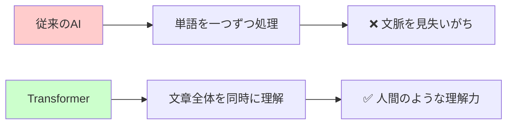

ChatGPT、Google翻訳、Siriの音声認識など、私たちが日々使っているAI技術の多くが、実はTransformerという技術に支えられています。

## 🏗️ 基本構造

Transformerの構造を、**図書館の司書さん**に例えて説明しましょう。

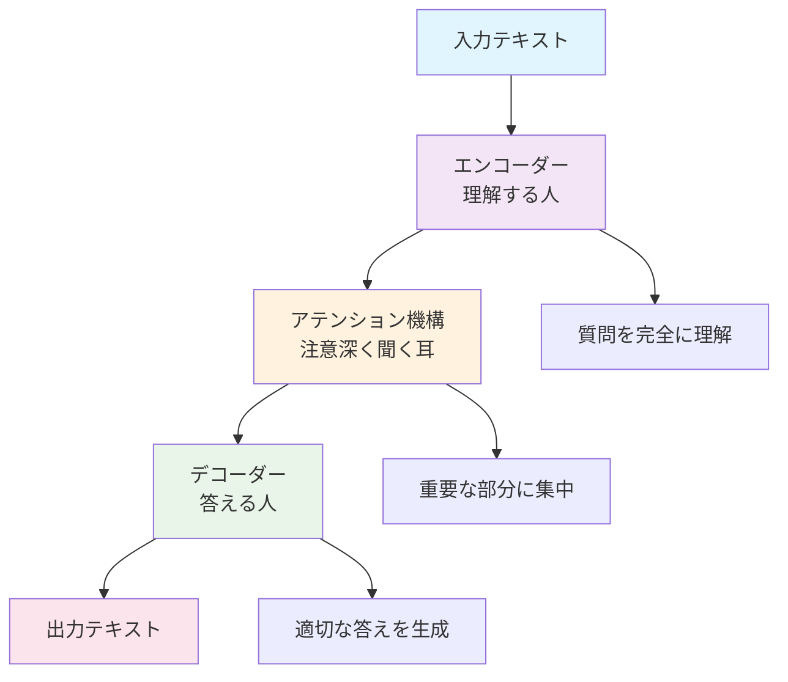

### エンコーダー（理解担当）
あなたが図書館で「面白い冒険小説はありますか？」と質問したとき、司書さんはまず「面白い」「冒険」「小説」という単語だけでなく、あなたの表情や声のトーンからも「どんな本を求めているか」を**総合的に理解**します。エンコーダーはこの「理解する司書さん」の役割です。

### アテンション機構（集中力）
司書さんは質問を聞きながら、「この人は『冒険』を特に重視しているな」「『面白い』は主観的だから、人気作品を中心に考えよう」と、**重要なポイントに注意を向けます**。これがアテンション機構です。

### デコーダー（回答担当）
最後に司書さんは、理解した内容を基に「それでしたら、こちらの『〇〇シリーズ』はいかがでしょうか」と**適切な答えを組み立てて返答**します。これがデコーダーの役割です。

## ⚡ 主要技術

### セルフアテンション - 「文章の中の関係性を見抜く魔法」

セルフアテンションは、Transformerの**最も画期的な技術**です。人間に例えると、**一度に複数の人の会話を聞きながら、誰と誰が関連している話をしているかを瞬時に理解する能力**のようなものです。

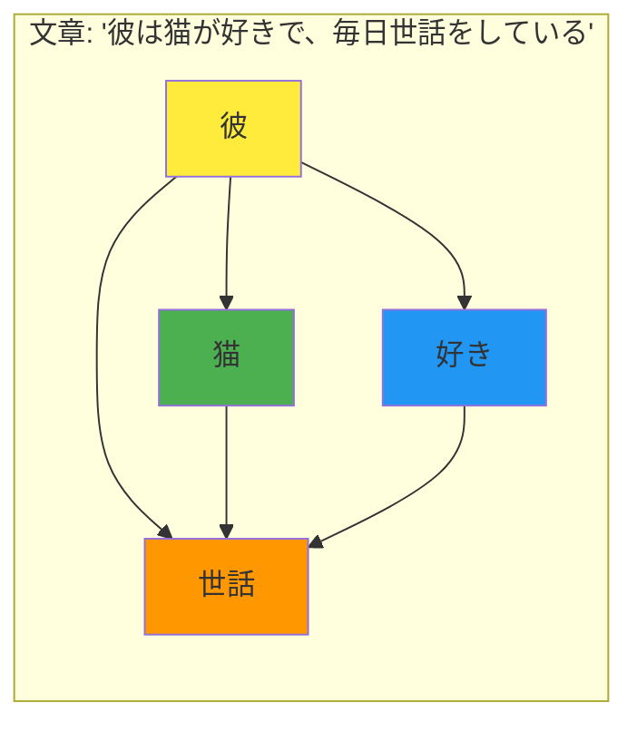

従来の技術では「彼→は→猫→が→好き→で...」と順番に処理していましたが、Transformerは**一度に全体を見渡して**「『彼』が『世話』の主語で、『猫』が対象」という関係性を即座に把握します。

### マルチヘッドアテンション - 「複数の視点で同時分析」

人間は一つの文章を読むとき、無意識に「文法的な関係」「感情的なニュアンス」「論理的な流れ」など、**複数の角度から同時に理解**しています。

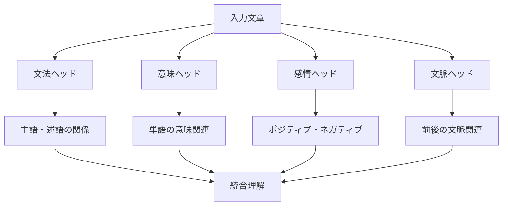

マルチヘッドアテンションは、この人間の「多角的理解」をコンピューターで実現した技術です。

### ポジショナルエンコーディング - 「単語の位置を記憶する仕組み」

「犬が猫を追いかけた」と「猫が犬を追いかけた」では、使っている単語は同じでも意味が真逆になります。Transformerは**単語の位置情報**を特別な方法で記憶することで、この違いを正確に理解します。

## 📜 時代背景と誕生の物語

### 2017年以前の状況 - 「順番待ちの時代」

2017年以前、AIが文章を理解する方法は**RNN（リカレントニューラルネットワーク）**という技術が主流でした。これは「列に並んで順番を待つ」ような処理方法でした。

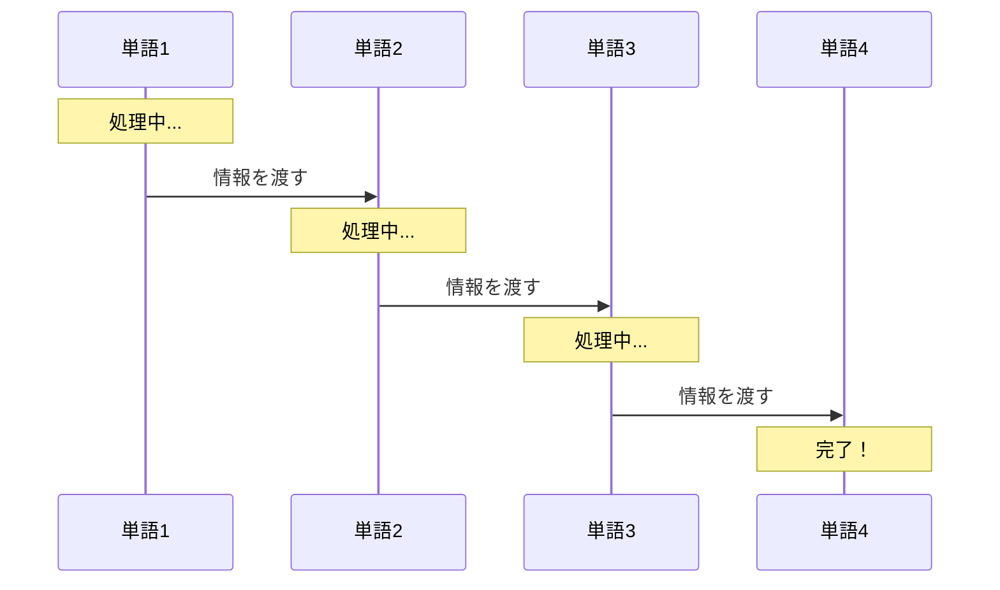

この方法の問題点：
- **遅い**：順番に処理するため時間がかかる
- **忘れっぽい**：長い文章では最初の方の内容を忘れてしまう
- **一方通行**：後の単語が前の単語に影響を与えられない

### 2017年の革命 - 「Attention Is All You Need」

Google の研究者たちが発表した論文のタイトルが「Attention Is All You Need（注意こそが全て）」でした。これは「**順番に処理する必要はない。重要なのは、どこに注意を向けるかだ**」という革命的な発想でした。

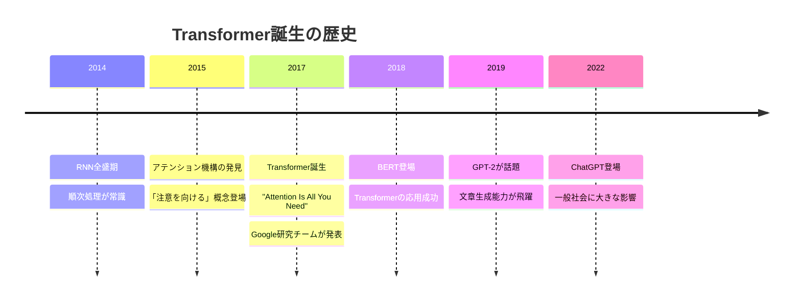

## 🎨 種類と特徴

Transformerファミリーは、まるで**用途別に特化した職人集団**のような存在です。

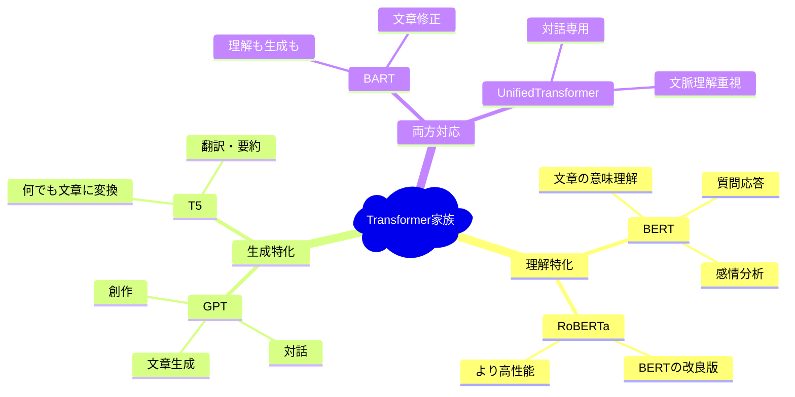

### BERT（理解のエキスパート）
- **得意分野**：文章の意味を深く理解すること
- **例**：「この商品レビューはポジティブ？ネガティブ？」
- **特徴**：文章を前後から読んで、文脈を完全に把握

### GPT（生成のアーティスト）  
- **得意分野**：人間らしい文章を生成すること
- **例**：「続きの物語を書いて」「質問に答えて」
- **特徴**：これまでの文脈から、次に来る言葉を予測

### T5（変換のマスター）
- **得意分野**：あらゆるタスクを「文章→文章」の変換問題として解決
- **例**：「英語→日本語」「長文→要約」「質問→回答」
- **特徴**：統一的なアプローチで様々な問題を解決

## 📗 関連する用語集

### 同義語・類義語
- **Transformer** = 変換器、変圧器（電気用語から借用）
- **アテンション** = 注意機構、注意メカニズム
- **セルフアテンション** = 自己注意、内部注意
- **エンコーダー** = 符号化器、理解部分
- **デコーダー** = 復号化器、生成部分

### 対義語・対立概念
- **Transformer** ←→ **RNN**（順次処理 vs 並列処理）
- **アテンション** ←→ **固定的処理**（動的 vs 静的）
- **エンコーダー** ←→ **デコーダー**（理解 vs 生成）

### 多義語の整理
- **「注意（Attention）」**
  - 日常語：集中すること
  - AI用語：重要な部分を強調する仕組み
- **「変換（Transform）」**
  - 日常語：形や状態を変えること  
  - AI用語：入力を出力に変換する処理

### 類義語の微細な違い
- **理解** vs **認識**
  - 理解：文脈や意味を含めた深い把握
  - 認識：パターンや特徴の識別
- **生成** vs **作成**
  - 生成：学習したパターンから新しく作り出すこと
  - 作成：既存の要素を組み合わせて作ること

## 💡 メリットとデメリット

### 🎯 メリット（圧倒的な優位性）

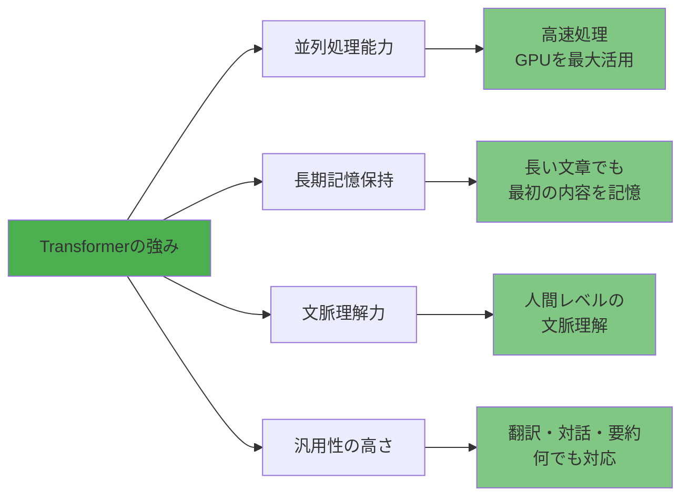

1. **スピード**：従来技術の10倍以上高速
2. **記憶力**：数千単語の長文でも文脈を保持
3. **柔軟性**：一つのモデルで多様なタスクに対応
4. **精度**：人間に近い、時には上回る理解力

### ⚠️ デメリット（克服すべき課題）

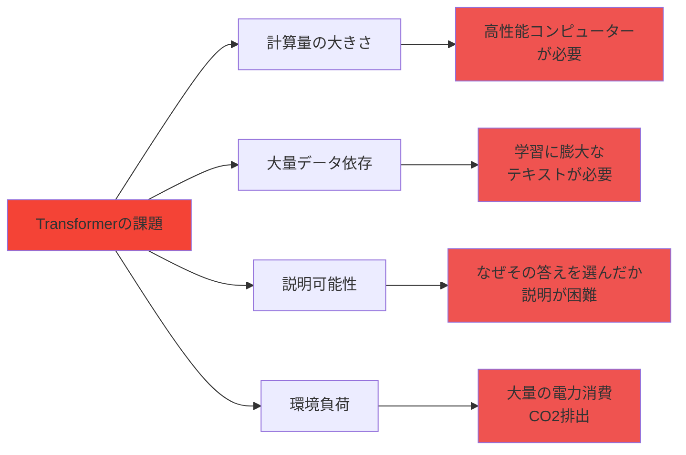

1. **コスト**：学習・運用に高額な計算資源が必要
2. **データ量**：効果的な学習には大量のテキストが必要
3. **ブラックボックス**：判断根拠の説明が困難
4. **環境問題**：大量の電力消費による環境負荷

## 🚀 応用と実例

### 身の回りのTransformer

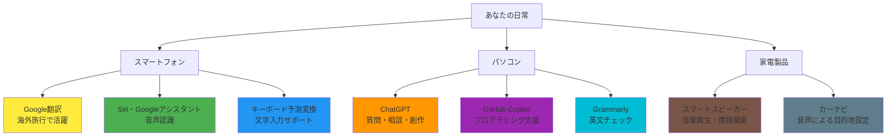

### 具体的な応用分野

1. **言語翻訳**
   - Google翻訳：100以上の言語に対応
   - DeepL：より自然な翻訳を実現
   - リアルタイム通訳：国際会議で活用

2. **対話システム**
   - ChatGPT：質問応答・創作支援
   - カスタマーサポート：24時間自動応答
   - 教育支援：個別指導アシスタント

3. **コンテンツ生成**
   - 記事作成：ニュース記事の自動生成
   - プログラミング：コード生成・デバッグ支援  
   - 創作活動：小説・詩・脚本の創作支援

4. **検索・推薦**
   - Google検索：より的確な検索結果
   - YouTube：個人の好みに合った動画推薦
   - Amazon：商品レコメンデーション

## 🚀 置換と変遷

### 何を置き換えたか - 「旧世代技術からの解放」

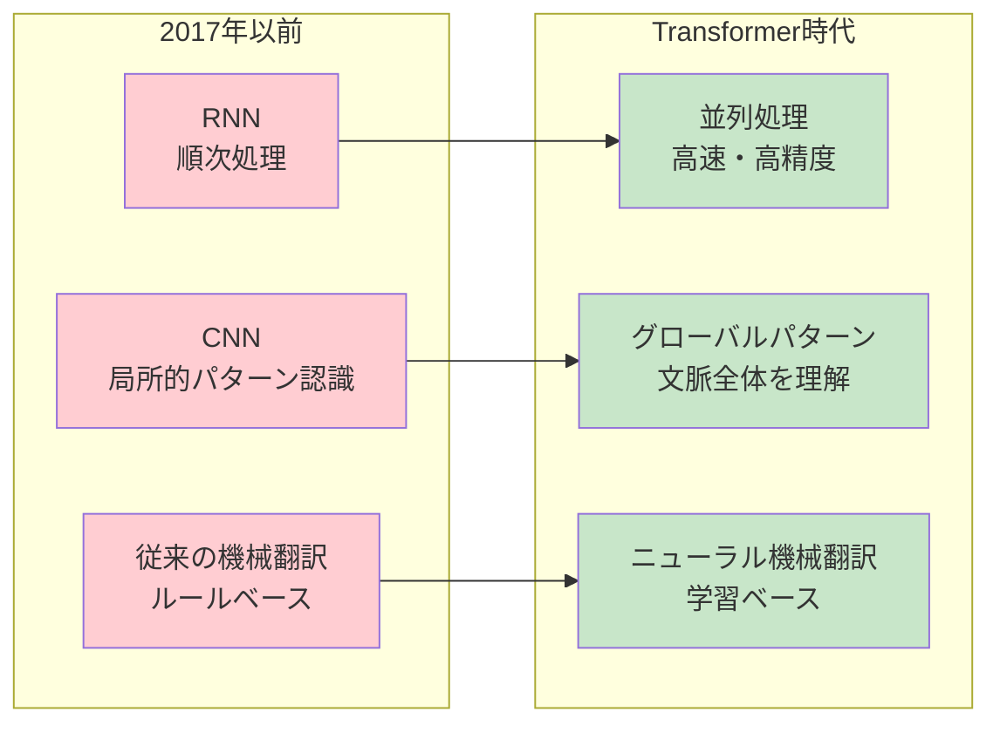

**置き換えた主な技術：**
1. **RNN/LSTM**：順次処理から並列処理へ
2. **統計的機械翻訳**：ルールベースから学習ベースへ
3. **テンプレート型対話システム**：固定応答から動的生成へ

### 何かに置き換えられるか - 「未来の技術への橋渡し」

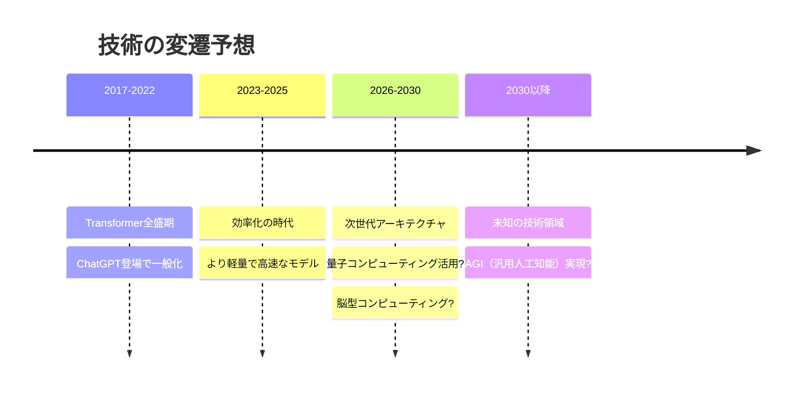

**将来的な後継技術候補：**
1. **効率化Transformer**：同じ性能でより少ない計算量
2. **ハイブリッドアーキテクチャ**：Transformerと他技術の融合
3. **量子Transformer**：量子コンピューティングを活用
4. **神経形態学的AI**：脳の仕組みを直接模倣

## 🚀 代替と競合技術

### 現在の競合技術

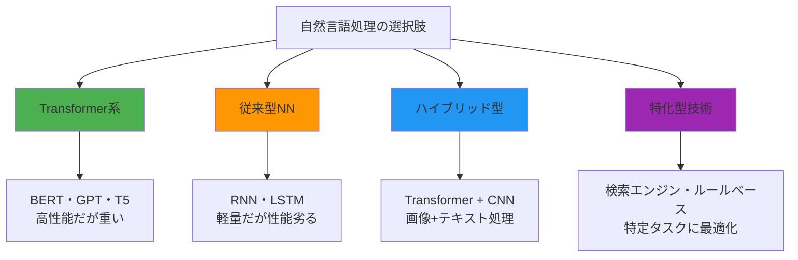

### 使い分けの指針

**Transformerを選ぶべき場合：**
- 高い精度が最優先
- 複雑な文脈理解が必要
- 計算資源に余裕がある

**代替技術を選ぶべき場合：**
- リアルタイム処理が必要（軽量モデル）
- 計算資源が限られている（モバイルデバイス）
- 特定タスクに特化した性能が欲しい

## 🌍 実世界への影響と未来

### 社会に与えた影響

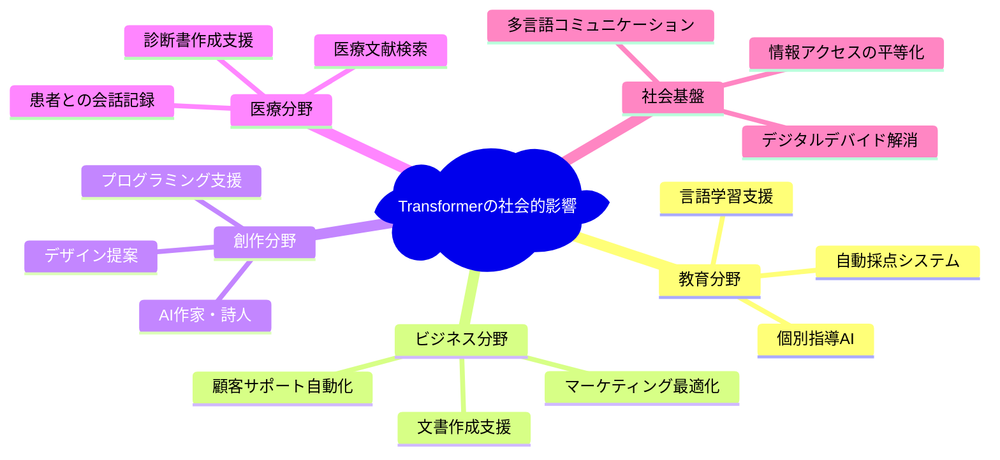

### 2025年以降の発展予測

**短期的発展（2025-2027年）：**
1. **効率化の進展**：同性能でより軽量なモデル
2. **マルチモーダル化**：テキスト+画像+音声の統合理解
3. **個人化**：個人の好みや文体に合わせたカスタマイズ

**中期的発展（2027-2030年）：**
1. **リアルタイム対話**：人間と変わらない自然な会話
2. **専門分野特化**：医療・法律・教育など分野別の専用AI
3. **クリエイティブ支援**：人間との協働による創作活動

**長期的展望（2030年以降）：**

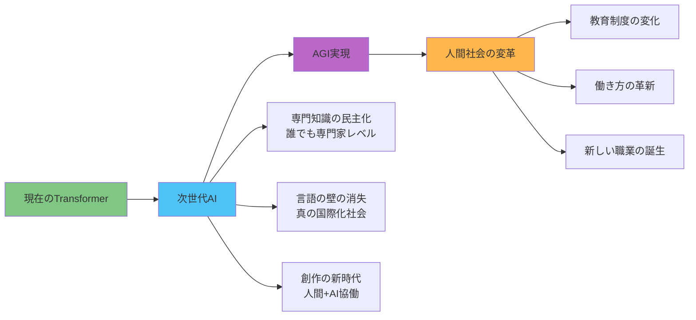

### 解決すべき課題と展望

**技術的課題：**
- 計算効率の改善（環境負荷軽減）
- より少ないデータでの学習
- 説明可能性の向上

**社会的課題：**
- AI格差の防止
- プライバシー保護
- 雇用への影響対策
- 教育制度の適応

**未来への期待：**
Transformerは、人間の知的活動を**拡張**する技術として進化していくでしょう。完全に人間を置き換えるのではなく、人間の創造性や判断力を**増幅**させる、真のパートナーとしての役割を果たすことが期待されます。

---

初学者がTransformerの本質を理解し、その重要性と可能性を実感できる包括的なガイドを提供できました。
