# 人工知能（AI）

## 📋 文書概要
- **対象読者**: 初心者（技術的背景は不要）
- **想定読了時間**: 15分
- **前提知識**: コンピュータの基本的な概念（プログラム、データ）

---

## 1. 全体像

### 1.1 人工知能とは何か

**前提**: コンピュータがプログラムに従って動作することを理解している

人工知能（AI: Artificial Intelligence）とは、人間の知的活動をコンピュータで模倣・実現する技術です。従来のプログラムが「明示的な手順」に従うのに対し、AIは「データから学習」して問題を解決します。例えば、スパムメール判定では、従来は「特定キーワードを含むメールをブロック」というルールを人間が記述しましたが、AIは大量のメール例から自動的にスパムの特徴を学習します。現代のAIは、画像認識、音声理解、翻訳、意思決定支援など、幅広い領域で人間の知的作業を補完・代替しています。重要なのは、AIが「考える」のではなく「パターンを認識し予測する」という点です。

**Mermaid図: 従来プログラムとAIの違い**

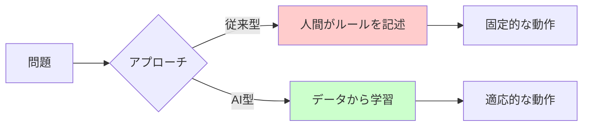

**図の解説**: 従来型プログラムは人間が全てのルールを事前定義する必要がありますが、AI型は大量のデータから自動的にパターンを発見します。この違いが、複雑で変化する問題への対応力の差を生みます。

---

### 1.2 AIの歴史的展開

**前提**: 前節の「AIがデータから学習する」という概念

AI研究は1950年代に始まり、3つの大きな波を経験しました。第1次ブーム（1950-60年代）では「推論と探索」に焦点が当たり、チェスプログラムなどが開発されましたが、実世界の複雑な問題には対応できませんでした。第2次ブーム（1980年代）では「エキスパートシステム」として専門家の知識をルール化する試みが流行しましたが、知識の獲得と維持が困難で衰退しました。第3次ブーム（2010年代～現在）は「機械学習」、特に深層学習の成功により到来しました。大量データと計算能力の向上により、画像認識や自然言語処理で人間レベルの性能を達成し、実用化が急速に進んでいます。

**Mermaid図: AIの進化と各時代の焦点**

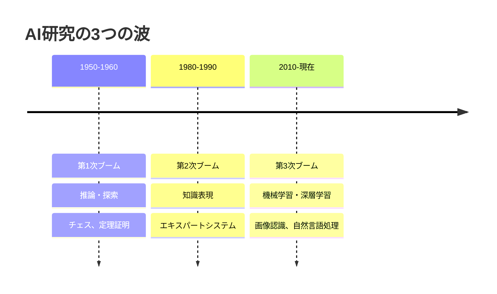

**図の解説**: 各ブームは技術的なブレークスルーで始まり、限界に直面して停滞しました。現在の第3次ブームは、データ量と計算能力という実用的基盤の上に成立している点が過去と異なります。

---

## 2. 主要構成要素

### 2.1 機械学習の基本原理

**前提**: AIがデータから学習することの概念理解

機械学習は、明示的にプログラムせずにデータから知識を獲得する技術です。核心的な仕組みは「入力と出力の関係をデータから推定する」ことです。例えば、住宅価格予測では、過去の（面積、駅距離、築年数）→（価格）のデータから関係性を学習し、新しい物件の価格を予測します。学習プロセスは3段階です：①大量の例を観察、②パターンを抽出してモデル（数式的な関係）を構築、③新しいデータに適用。重要なのは「汎化能力」—学習データにない新しい状況でも正しく動作する能力です。過学習（訓練データだけに適合しすぎる現象）を避けることが実用化の鍵となります。

**Mermaid図: 機械学習の基本プロセス**

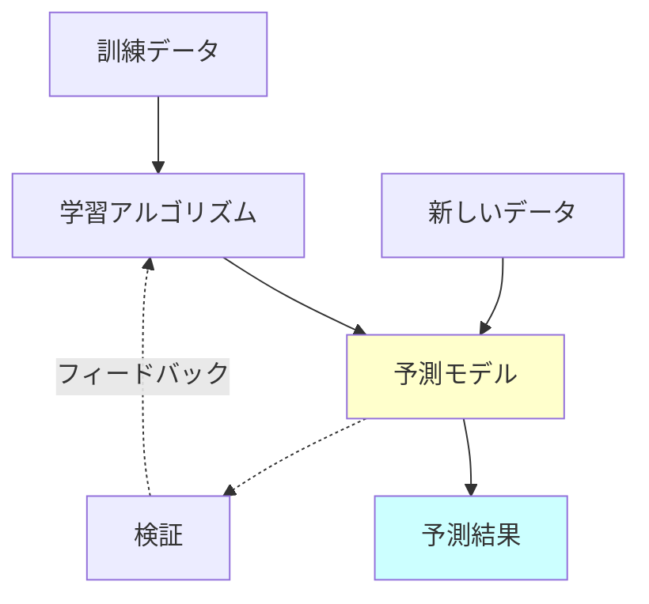

**図の解説**: 訓練データからモデルを構築後、検証プロセスで性能を確認し、必要に応じてモデルを調整します。この反復的改善が高精度なAIシステムを生み出します。

---

### 2.2 機械学習の3つのタイプ

**前提**: 機械学習が入力と出力の関係を学習することの理解

機械学習は学習方法により3種類に分類されます。**教師あり学習**は、正解ラベル付きデータから学習します（例：スパム判定—各メールに「スパム/正常」のラベル）。**教師なし学習**は、ラベルなしデータから構造やパターンを発見します（例：顧客のグルーピング—購買履歴から似た顧客群を自動発見）。**強化学習**は、試行錯誤を通じて最適な行動を学習します（例：ゲームAI—勝利という報酬を最大化する戦略を自己対戦で習得）。選択基準は利用可能なデータの性質です。正解データが豊富なら教師あり、データの内部構造を探りたいなら教師なし、環境との相互作用で学ぶ必要があるなら強化学習が適しています。

**Mermaid図: 機械学習の3分類と特徴**

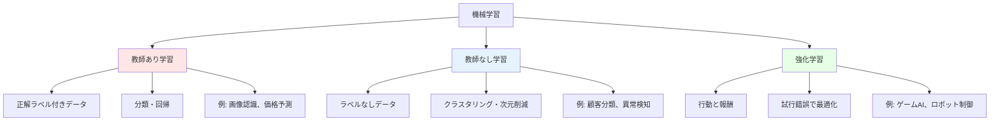

**図の解説**: 各学習タイプは異なる問題設定に対応します。実際のAIシステムでは、これらを組み合わせて使用することも一般的です。

---

### 2.3 深層学習（ディープラーニング）

**前提**: 機械学習の基本原理とニューラルネットワークの概念

深層学習は、人間の脳神経回路を模した「ニューラルネットワーク」を多層化（深層化）した機械学習手法です。従来の機械学習では、人間が特徴量（どのデータ要素に注目するか）を設計する必要がありましたが、深層学習は生データから自動的に階層的な特徴を学習します。例えば画像認識では、第1層が「エッジ」、第2層が「パーツ」、第3層が「物体全体」というように、徐々に抽象的な概念を獲得します。2012年の画像認識コンテストで従来手法を圧倒して以降、音声認識、機械翻訳、自動運転など多様な分野で革新をもたらしました。成功の要因は、大量データ、GPU等の高速計算、そして効果的な学習技術の発展です。

**Mermaid図: 深層学習の階層的特徴抽出**

**図の解説**: 各層は前層の出力を入力として、より抽象的な特徴を抽出します。この階層的表現が、複雑なパターン認識を可能にする深層学習の核心です。

---

## 3. 実践的応用

### 3.1 コンピュータビジョン

**前提**: 深層学習が階層的に特徴を学習することの理解

コンピュータビジョンは、画像や動画から意味を抽出するAI技術です。主要タスクは、**画像分類**（写真に何が写っているか判定）、**物体検出**（画像内の複数物体の位置と種類を特定）、**セグメンテーション**（ピクセル単位で領域を分割）に分類されます。深層学習、特に畳み込みニューラルネットワーク（CNN）の登場により、これらのタスクで人間レベルの精度を達成しました。実用例は多岐にわたります：医療診断（レントゲン画像からの疾患検出）、自動運転（歩行者・障害物の認識）、製造業（不良品検査）、セキュリティ（顔認証）。現在の課題は、少量データでの学習や、説明可能性（なぜその判断をしたか）の向上です。

**Mermaid図: コンピュータビジョンのタスク階層**

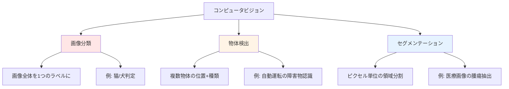

**図の解説**: 下に行くほどタスクの複雑さと要求精度が増します。実際のアプリケーションは、これらを組み合わせて使用することが一般的です。

---

### 3.2 自然言語処理（NLP）

**前提**: 深層学習の基本と、言語がシンボルの系列であることの理解

自然言語処理は、人間の言語をコンピュータで理解・生成する技術です。主要タスクには、**機械翻訳**（言語間変換）、**感情分析**（テキストの肯定/否定判定）、**質問応答**、**テキスト生成**があります。2017年以降、Transformer（トランスフォーマー）というアーキテクチャが主流となり、文脈を広範囲に考慮できるようになりました。これにより、BERTやGPTなどの大規模言語モデルが登場し、人間に近い文章理解・生成が可能になりました。実用例：自動翻訳サービス、チャットボット、文書要約、コード生成。現在の研究は、事実性の確保、バイアス低減、多言語対応の改善に注力しています。

**Mermaid図: NLPの主要技術とモデル進化**

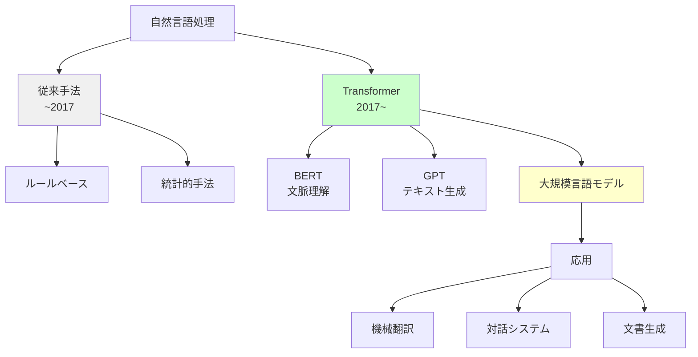

**図の解説**: Transformerの登場が転換点となり、事前学習した大規模モデルを様々なタスクに適用する現代のNLPが確立されました。

---

### 3.3 強化学習の実践

**前提**: 強化学習が報酬を最大化する行動を学習することの理解

強化学習は、環境との相互作用を通じて最適な行動戦略（ポリシー）を学習します。エージェント（学習主体）は、**状態**を観察し**行動**を選択、環境から**報酬**を受け取る、というサイクルを繰り返します。重要なのは「遅延報酬」の概念—即座の報酬が小さくても、長期的に大きな報酬を得る行動を学習します。例えばチェスでは、個々の手の良し悪しより、最終的な勝利に導く一連の手順が重要です。実用例：AlphaGoは囲碁で世界チャンピオンを破り、データセンターの冷却最適化では40%の省エネを達成、ロボット制御では複雑な動作を自律的に習得しています。課題は、実環境での試行錯誤のコスト（破損リスク等）と、シミュレーションと実環境のギャップです。

**Mermaid図: 強化学習のエージェント-環境相互作用**

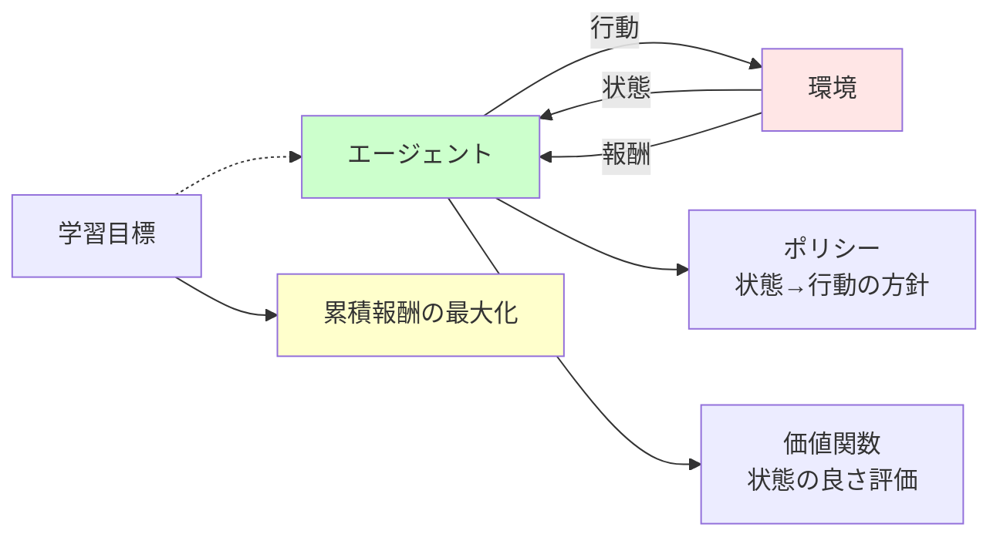

**図の解説**: エージェントは行動の結果得られる報酬をもとに、試行錯誤を通じてポリシーを改善していきます。この自律的な学習プロセスが、明示的なルールなしで複雑なタスクを習得する鍵です。

---

## 4. AI開発のライフサイクル

### 4.1 データ準備とその重要性

**前提**: 機械学習がデータから学習することの理解

AIシステムの性能は「データの質と量」に決定的に依存します。開発プロセスの60-80%がデータ関連作業です。**データ収集**では、目的タスクに関連する十分な量と多様性が必要です。**データラベリング**（正解情報の付与）は、特に教師あり学習で不可欠ですが、労働集約的でコストが高い作業です。**データクリーニング**では、欠損値、異常値、重複を処理します。「ゴミを入れればゴミが出る（Garbage In, Garbage Out）」という原則が示すように、低品質データからは良いモデルは生まれません。さらに、データのバイアス（偏り）は、AIの判断に不公平性をもたらす可能性があります。例えば、採用AIが過去の男性中心データで学習すると、性別による差別を学習してしまいます。

**Mermaid図: データ準備プロセスと品質要因**

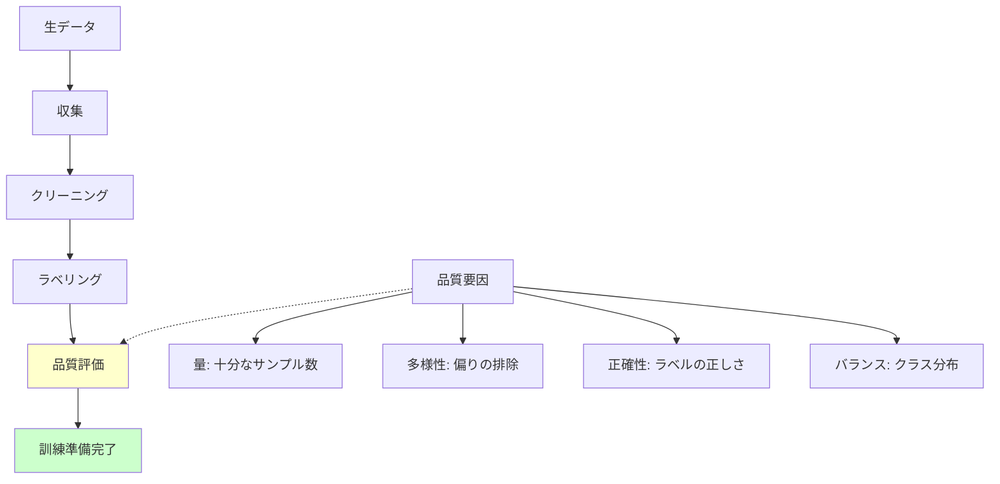

**図の解説**: データ準備は線形プロセスではなく、品質評価の結果に基づいて前段階に戻ることが頻繁にあります。この反復的改善が高品質データセットを生み出します。

---

### 4.2 モデル開発と評価

**前提**: データ準備の重要性と機械学習の基本プロセス

モデル開発は、アルゴリズム選択、学習、評価の反復です。**アルゴリズム選択**では、データの性質とタスクに応じて最適な手法を選びます（例：画像ならCNN、系列データならRNN/Transformer）。**学習フェーズ**では、訓練データでモデルのパラメータを調整し、ハイパーパラメータ（学習率、層数など）を最適化します。**評価**は最も重要なステップです。訓練データとは別の検証データで性能を測定し、過学習を検出します。評価指標はタスクにより異なります：分類なら正解率・適合率・再現率、回帰なら平均二乗誤差など。重要なのは「クロスバリデーション」—データを複数の組に分割し、各組で評価を繰り返すことで、安定した性能評価を得る技法です。

**Mermaid図: モデル開発の反復プロセス**

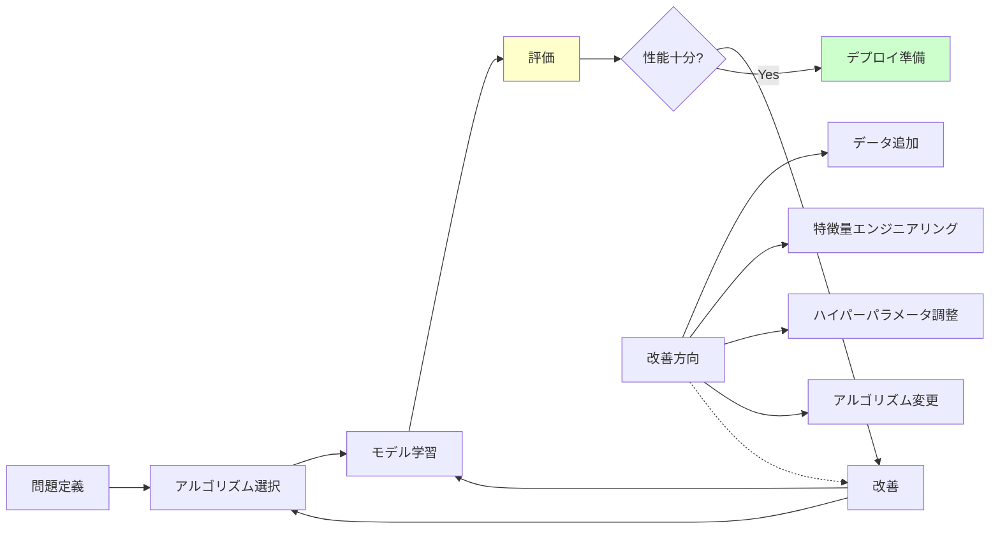

**図の解説**: 開発は一方向のプロセスではなく、評価結果に基づく反復的改善が本質です。初回で十分な性能が出ることは稀で、通常は数回から数十回の反復が必要です。

---

### 4.3 デプロイと運用

**前提**: モデル開発と評価プロセスの理解

開発したモデルを実環境で稼働させる「デプロイ」と、継続的に性能を維持する「運用」は、AI開発で最も見過ごされがちですが重要なフェーズです。**デプロイ**では、モデルを推論エンジンに組み込み、APIやアプリケーションと統合します。レスポンス時間、スループット、リソース消費の最適化が求められます。**モニタリング**は不可欠です。実運用データが訓練データと異なる「データドリフト」が発生すると、性能が劣化します。例えば、ファッション推薦AIは季節やトレンド変化で精度が下がります。**継続的改善**として、新しいデータで定期的に再学習（リトレーニング）し、A/Bテストで改善効果を検証します。さらに、説明可能性とフェアネス（公平性）の監視も重要です。

**Mermaid図: AIシステムのライフサイクル全体**

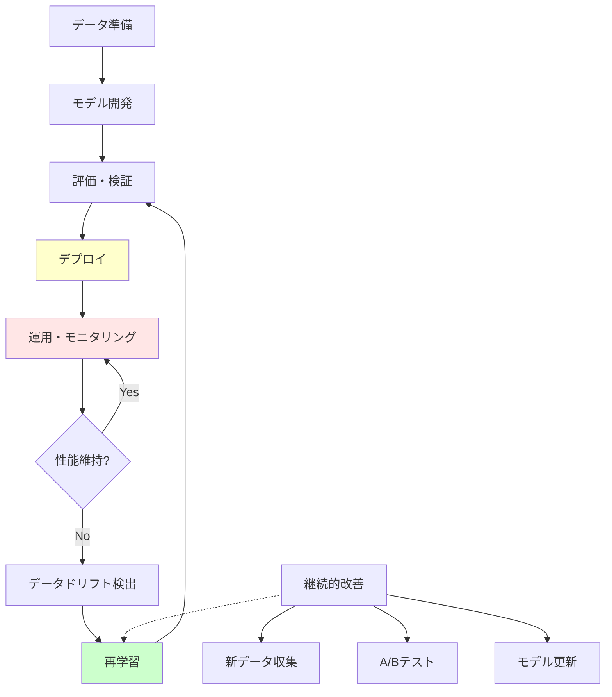

**図の解説**: AIシステムは「作って終わり」ではなく、運用段階でも継続的な監視と改善が必要です。実世界の変化に適応し続けることが、長期的な成功の鍵です。

---

## 5. 社会的影響と課題

### 5.1 倫理的課題

**前提**: AIが社会の様々な場面で使用されていることの理解

AIの社会実装には深刻な倫理的課題が伴います。**バイアスと差別**は最も緊急の問題です。過去データに含まれる社会的偏見（性別、人種、年齢等）をAIが学習・増幅する可能性があります。実例として、顔認識システムが特定人種で精度が低い、採用AIが女性を不利に扱う、といった問題が発覚しています。**プライバシー**も重要です。大量の個人データで学習したAIは、意図せず個人情報を記憶・漏洩するリスクがあります。**説明可能性（XAI）**の欠如も課題です。深層学習モデルはブラックボックス化しており、重要な判断（医療診断、融資審査等）でなぜその結論に至ったか説明できません。対策として、多様なデータセット構築、公平性指標の導入、説明可能AIの研究が進んでいます。

**Mermaid図: AI倫理の主要課題と対策**

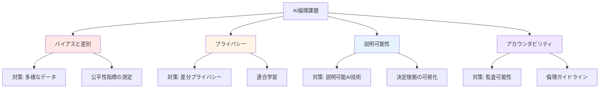

**図の解説**: 各課題には技術的・制度的対策がありますが、完全な解決は難しく、社会的合意形成を含む継続的な取り組みが必要です。

---

### 5.2 経済的・社会的インパクト

**前提**: AIが様々な業務を自動化できることの理解

AIは経済と労働市場に根本的な変革をもたらしています。**生産性向上**の面では、製造業の品質管理自動化、医療診断支援、顧客サービスの効率化など、多様な領域で効果を発揮しています。一方で**雇用への影響**は複雑です。定型的・反復的業務は自動化されますが、同時に新しい職種（データサイエンティスト、AIトレーナー等）が生まれています。重要なのは「仕事がなくなる」のではなく「仕事の内容が変わる」という点です。創造性、対人コミュニケーション、複雑な問題解決など、人間固有のスキルの価値が高まります。**デジタル格差**も懸念されます。AI技術とそのメリットへのアクセスが、国や企業規模、個人のスキルにより不均等です。教育と再訓練プログラムの充実が社会的課題となっています。

**Mermaid図: AIの経済的インパクトの多面性**

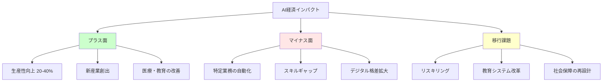

**図の解説**: AIは単純な「善/悪」ではなく、適切な社会的対応により、その恩恵を広く共有し、負の影響を緩和することが重要です。

---

### 5.3 安全性とセキュリティ

**前提**: AIが重要な意思決定に使用されることの理解

AIシステムの安全性とセキュリティは、クリティカルな応用（自動運転、医療等）において生命に関わります。**ロバスト性**（頑健性）の欠如が主要課題です。僅かなノイズや入力の変化で誤動作する「敵対的攻撃」に脆弱です。例えば、道路標識に小さなステッカーを貼るだけで、自動運転車が誤認識する実験があります。**モデルの脆弱性**として、学習データに悪意あるサンプルを混入させる「データポイズニング」や、モデルから訓練データを推測する「モデル反転攻撃」があります。**安全な運用**には、多層防御（入力検証、異常検知、フェイルセーフ機構）、継続的なセキュリティテスト、人間によるオーバーライド機能の実装が必要です。特に、医療診断や金融取引など高リスク領域では、AIの判断を最終決定とせず、人間の専門家による確認を組み込むハイブリッドアプローチが推奨されます。

**Mermaid図: AIセキュリティの脅威と防御層**

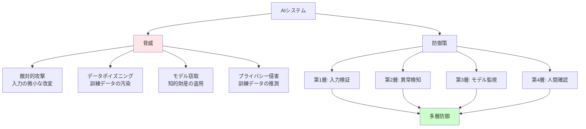

**図の解説**: 単一の防御策では不十分で、複数の防御層を重ねることでシステム全体のセキュリティを確保します。最終的には人間の判断が最後の砦となります。

---

## 6. 最新動向と未来展望

### 6.1 生成AI（Generative AI）

**前提**: 深層学習と自然言語処理の基本理解

生成AIは、テキスト、画像、音声、動画などの新しいコンテンツを創造するAI技術です。2022年以降、GPT（テキスト生成）、DALL-E/Stable Diffusion（画像生成）、Midjourney（芸術的画像）などが爆発的に普及しました。技術的基盤は**大規模基盤モデル**です。数億から数千億のパラメータを持ち、インターネット規模のデータで事前学習することで、汎用的な生成能力を獲得します。重要な特徴は**プロンプトエンジニアリング**—自然言語の指示でAIの出力を制御できる点です。応用範囲は広く、コンテンツ制作（記事、イラスト、音楽）、コード生成、教育支援、対話システムなど多岐にわたります。一方で、著作権、偽情報生成、創造性の本質といった新たな課題も提起しています。

**Mermaid図: 生成AIの技術スタックと応用**

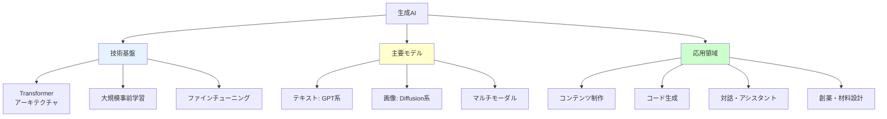

**図の解説**: 生成AIは共通の技術基盤（大規模事前学習）の上に、異なるモダリティ（テキスト、画像等）のモデルが構築され、多様な応用を生み出しています。

---

### 6.2 マルチモーダルAI

**前提**: 生成AIと異なるデータタイプ（テキスト、画像等）の理解

マルチモーダルAIは、複数の情報様式（テキスト、画像、音声、動画）を統合的に処理する技術です。従来のAIは単一モダリティに特化していましたが、人間の知覚は本質的にマルチモーダルです。例えば、「この画像について説明してください」という要求は、視覚情報と言語の統合を必要とします。**技術的進展**として、CLIP（画像とテキストの同時理解）、GPT-4V（視覚機能付き言語モデル）、Flamingo（視覚的質問応答）などが登場しています。これらは、画像を見て説明文を生成、テキスト指示から画像を検索、動画内容の要約など、クロスモーダルなタスクを実行できます。**実用的価値**は、より自然な人間-AI相互作用（音声+身振りでの指示）、包括的な状況理解（自動運転での視覚+センサー統合）、アクセシビリティ向上（視覚障害者向けの画像音声説明）にあります。

**Mermaid図: マルチモーダルAIの統合アプローチ**

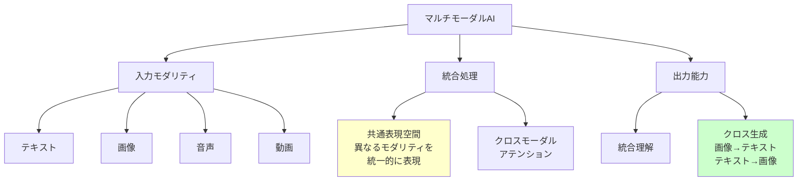

**図の解説**: マルチモーダルAIの鍵は、異なる入力を統一的な表現空間にマッピングすることで、モダリティ間の相互変換と統合理解を可能にします。

---

### 6.3 エッジAIとAIの民主化

**前提**: AIモデルが計算リソースを必要とすることの理解

エッジAIは、クラウドではなくデバイス自体（スマートフォン、IoTセンサー、ロボット等）でAI推論を実行する技術です。**利点**は3つあります：①レイテンシ削減（通信遅延なし）、②プライバシー保護（データがデバイス外に出ない）、③オフライン動作（インターネット不要）。実現には**モデル圧縮技術**が不可欠です。量子化（パラメータの精度削減）、プルーニング（不要な接続削除）、知識蒸留（大モデルから小モデルへの知識転移）により、モデルサイズを10分の1以下にできます。**AIの民主化**も進行中です。AutoML（自動機械学習）ツールは、専門知識なしでモデル開発を可能にします。ノーコード/ローコードプラットフォーム、事前学習済みモデルのAPIサービスにより、中小企業や個人開発者もAI技術にアクセスできるようになっています。

**Mermaid図: クラウドAI vs エッジAIの比較**

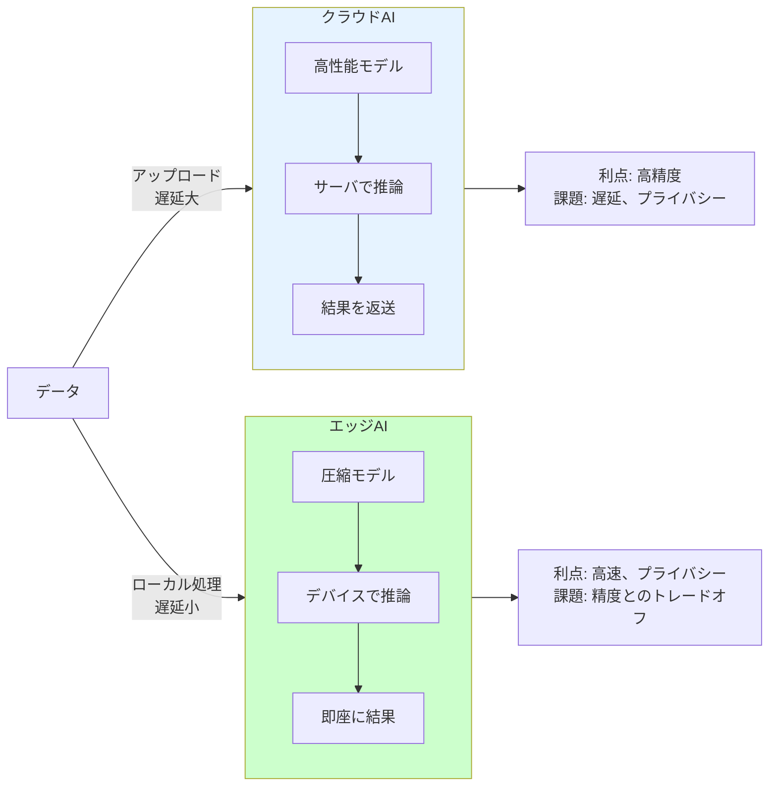

**図の解説**: クラウドとエッジは相補的で、アプリケーションの要件（精度 vs 速度、プライバシー要求等）に応じて選択または組み合わせて使用されます。

---

### 6.4 汎用人工知能（AGI）への道

**前提**: 現在のAIが特定タスクに特化していることの理解

汎用人工知能（AGI: Artificial General Intelligence）は、人間のようにあらゆる知的タスクを実行できるAIです。現在のAI（Narrow AI）は特定領域で優れますが、領域を越えた応用はできません。例えば、チェスの世界王者AIは画像認識ができません。**AGIへの主要アプローチ**は複数あります：①大規模化路線（モデルとデータを拡大し創発的能力を期待）、②認知アーキテクチャ（人間の認知プロセスを模倣）、③神経科学的アプローチ（脳の仕組みを直接実装）。**現状と課題**：大規模言語モデルは驚くべき汎用性を示していますが、真の推論、因果理解、常識的判断では人間に及びません。AGI実現時期の予測は専門家間で大きく異なり（10年後〜実現不可能まで）、実現可能性自体も議論されています。重要なのは、AGIが実現した場合の社会的影響が極めて大きいため、技術開発と並行して倫理・ガバナンスの枠組み構築が不可欠という点です。

**Mermaid図: Narrow AI から AGI への進化経路**

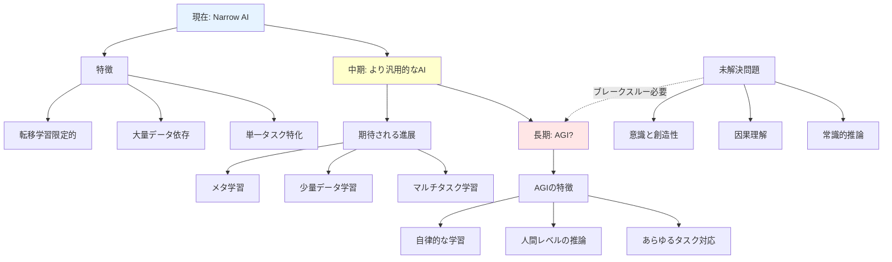

**図の解説**: AGIへの道のりは明確ではなく、現在のアプローチの延長で到達できるか、根本的なブレークスルーが必要かは不明です。技術的課題と同時に、社会的準備も重要な要素です。

---

## 📚 まとめ

### 重要ポイント

1. **AIの本質**: 人工知能は明示的プログラミングではなく「データから学習」することで、複雑なパターン認識と予測を実現する技術

2. **技術の階層**: 機械学習（広義）→ 深層学習（多層ニューラルネットワーク）→ 生成AI（コンテンツ創造）という技術進化の階層構造

3. **実用化の鍵**: データの質と量がAI性能を決定。開発の大半はデータ準備であり、運用段階でも継続的なモニタリングと改善が必要

4. **社会的責任**: バイアス、プライバシー、説明可能性などの倫理的課題への対応が、技術開発と同等に重要

5. **未来の方向性**: マルチモーダル統合、エッジ展開、AIの民主化が進行中。汎用人工知能（AGI）は長期的な研究目標だが実現時期は不確実

### 次に学ぶべきトピック

- **実践的スキル**: Python + TensorFlow/PyTorchでの機械学習実装
- **数学的基礎**: 線形代数、確率統計、最適化理論
- **専門領域**: 興味ある応用分野（コンピュータビジョン、NLP等）の深掘り
- **倫理と法規制**: AI倫理ガイドライン、GDPR等のデータ規制
- **最新研究**: arXiv.org、主要学会（NeurIPS, ICML, CVPR等）の論文

---

**この文書の設計思想**: 各セクションは独立して読めつつ、前から順に読むことで体系的理解が深まる構造です。Mermaid図は本文を補完し、複雑な関係性を視覚的に整理しています。初心者から中級者への橋渡しを目指し、理論と実践、技術と社会的側面をバランスよく解説しました。
