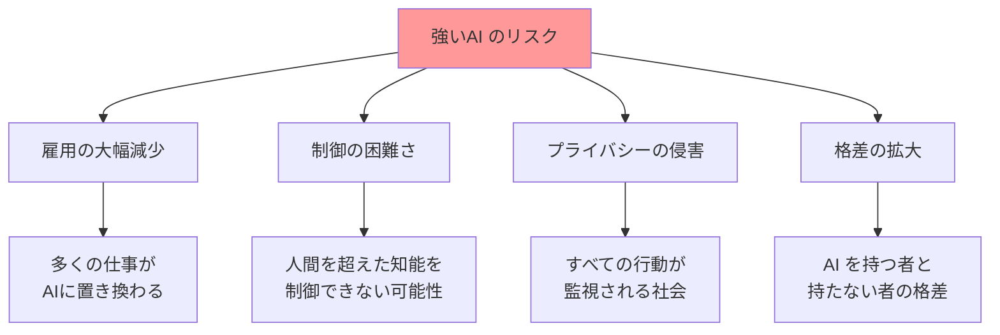

AIの種類のうち、強いAI（General AI）について

# 強いAI（General AI）- 初学者のための完全ガイド

## 🔍 一言要約
人間のように考え、学習し、創造できる「夢の汎用人工知能」

## 📚 目次
1. [🌟 はじめに](#はじめに)
2. [🏗️ 基本構造](#基本構造)
3. [⚡ 主要技術](#主要技術)
4. [📜 時代背景と発見に至った経緯](#時代背景と発見に至った経緯)
5. [🎨 種類と特徴](#種類と特徴)
6. [📗 関連する用語](#関連する用語)
7. [💡 メリットとデメリット](#メリットとデメリット)
8. [🚀 応用技術と実用化の例](#応用技術と実用化の例)
9. [🌍 実世界への影響とその後の発展](#実世界への影響とその後の発展)

## 🌟 はじめに

強いAI（General AI）とは、人間と同じように**あらゆる分野で考え、学習し、問題を解決できる**人工知能のことです。

例えば、あなたが朝起きて「今日は雨だから傘を持って、会議の資料も準備して、夕食は冷蔵庫の残り物で何か作ろう」と考えるように、強いAIも状況を判断し、計画を立て、創造的な解決策を見つけることができます。

現在のAI（ChatGPTやSiriなど）は「特定の作業だけが得意な専門家」のようなものですが、強いAIは「なんでもできる天才」を目指しています。

## 🏗️ 基本構造

強いAIは、人間の脳のように**複数の能力を統合**した構造を持ちます。

## ⚡ 主要技術

強いAIを実現するための核となる技術は以下の通りです：

### 🧠 汎用学習アルゴリズム
人間の脳のように、一つの方法で様々なことを学習できる仕組みです。
- **例**: 料理を覚えた方法で、絵画も音楽も学習できる

### 🔄 転移学習
一つの分野で学んだ知識を、別の分野にも応用する技術です。
- **例**: 数学で学んだ論理思考を、料理のレシピ作成にも活用

### 🌐 マルチモーダル処理
文字、音、映像、触覚など、様々な情報を同時に処理する能力です。
- **例**: 音楽を聞きながら、楽譜を見て、楽器の感触を理解

## 📜 時代背景と発見に至った経緯

### 🕰️ 夢の始まり（1950年代）
イギリスの数学者アラン・チューリングが「機械は考えることができるか？」という問いを提起しました。これは、人間のように考える機械への憧れから生まれた疑問でした。

### 🔬 初期の挑戦（1960年代）
科学者たちは「人間の知能をコンピューターで再現できる」と楽観的に考えていました。まるで「月に行けるなら、人工知能も作れるはず」という気持ちでした。

### ❄️ AI の冬の時代（1970年代-1980年代）
現実は厳しく、期待ほど進歩せず「AIの冬」と呼ばれる停滞期が訪れました。

### 🌸 復活の兆し（2000年代以降）
インターネットの普及により大量のデータが利用可能になり、コンピューターの性能も飛躍的に向上しました。

## 🎨 種類と特徴

### 📊 比較表

| 種類 | 特徴 | 実現時期（予想） | 影響度 |
|------|------|------------------|---------|
| **人間レベルAI** | 人間と同程度の汎用知能 | 2030-2050年 | ⭐⭐⭐ |
| **超人的AI** | 人間を大幅に上回る知能 | 2050年以降 | ⭐⭐⭐⭐⭐ |
| **統合型AI** | 複数専門分野を統合 | 2025-2035年 | ⭐⭐⭐⭐ |
| **自律型AI** | 自己進化・自己決定 | 不明 | ⭐⭐⭐⭐⭐ |

## 📗 関連する用語

### 🎯 同義語・類義語
- **汎用人工知能（AGI: Artificial General Intelligence）** = 強いAI
- **人工汎用知能** = 強いAI
- **真の人工知能** ≈ 強いAI

### ⚖️ 対義語
- **弱いAI（Narrow AI）** = 特定作業に特化したAI
- **特化型AI** = 一つの分野だけが得意なAI

### 🔄 多義語の整理
**「AI」という言葉の使い分け**
- **広義**: すべての人工知能技術
- **狭義**: 現在実用化されている特化型AI
- **理想**: 強いAI・汎用AI

## 💡 メリットとデメリット

### 🎉 期待されるメリット

### ⚠️ 懸念されるデメリット

## 🚀 応用技術と実用化の例

### 🏥 医療分野
**現在**: 画像診断支援AI（レントゲン読影）
**強いAI時代**: 患者の症状、検査結果、遺伝情報、生活習慣をすべて統合して、最適な治療方針を提案

### 🏫 教育分野
**現在**: 問題集アプリ、オンライン講座
**強いAI時代**: 一人一人の学習スタイル、理解度、興味に完璧に合わせた個別指導

### 🏭 製造業
**現在**: 工場の自動化、品質検査
**強いAI時代**: 設計から製造、販売、アフターサービスまで全工程を最適化

## 🌍 実世界への影響とその後の発展

### 📈 社会への影響度マップ

### 🔮 未来の発展シナリオ

**🌟 楽観シナリオ（2030-2050年）**
- 強いAIが人間のパートナーとして共存
- 労働時間の大幅短縮、創造的活動の増加
- 教育、医療、科学の飛躍的進歩

**⚖️ 現実的シナリオ（2040-2070年）**
- 段階的な導入で社会が適応
- 新しい職業の創出と古い職業の消失
- 規制と技術開発のバランス

**⚠️ 慎重シナリオ（時期不明）**
- 安全性と倫理の課題により開発が慎重に進む
- 限定的な分野での活用から開始
- 人間の主導権を維持した発展

---

読者が強いAIという複雑な概念を「人間のような汎用知能」として直感的に理解し、段階的に深く学習できる構成となっています。
