AIの種類のうち、画像認識（Image Recognition）のなかでも、文字認識（character recognition）について

# 文字認識（Character Recognition） - 初学者のための完全ガイド

## 🔍 一言要約
コンピュータが写真や書類の中の文字を「読んで」デジタル文字に変換する技術

## 📚 目次
1. [はじめに](#-はじめに)
2. [基本構造](#-基本構造)
3. [主要技術](#-主要技術)
4. [時代背景と発見に至った経緯](#-時代背景と発見に至った経緯)
5. [種類と特徴](#-種類と特徴)
6. [関連する用語](#-関連する用語)
7. [メリットとデメリット](#-メリットとデメリット)
8. [応用と実例](#-応用と実例)
9. [置換と変遷](#-置換と変遷)
10. [代替と競合](#-代替と競合)
11. [実世界への影響とその後の発展](#-実世界への影響とその後の発展)

## 🌟 はじめに

スマホで名刺を撮影すると自動的に連絡先に登録される、書類をスキャンすると編集可能なテキストになる、外国語の看板をカメラで映すと即座に翻訳される――これらすべてを支えているのが**文字認識技術**です。

人間は文字を見れば瞬時に読めますが、コンピュータにとって画像の中の文字は「ただの点の集まり」に過ぎません。文字認識は、この点の集まりから「これはAという文字だ」「これは漢字の『山』だ」と理解させる技術なのです。

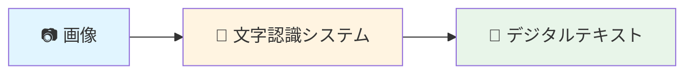

## 🏗️ 基本構造

文字認識は大きく4つのステップで動作します。料理のレシピのように、順番に処理を進めていくイメージです。

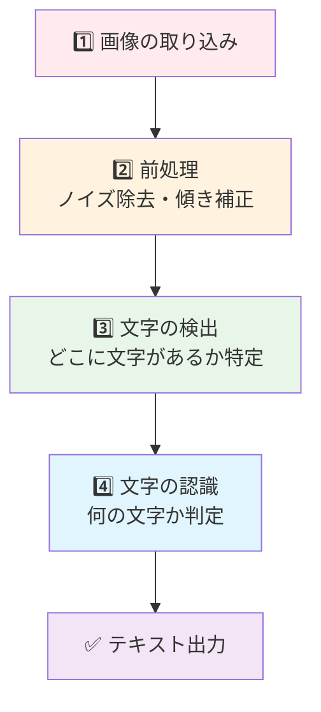

### 各ステップの詳細

**1. 画像の取り込み**
- スキャナやカメラで文書を撮影
- 画像データ（写真）として保存

**2. 前処理（画像をきれいにする）**
- 汚れやノイズを除去（消しゴムで余計な汚れを消すイメージ）
- 傾きを補正（斜めの写真をまっすぐに直す）
- コントラストを調整（文字をくっきり見やすくする）

**3. 文字の検出**
- 「ここに文字がある」という場所を特定
- 文字の塊（単語や行）を認識

**4. 文字の認識**
- 各文字が「A」なのか「B」なのかを判定
- データベースやAIモデルと照合

## ⚡ 主要技術

文字認識には大きく2つのアプローチがあります。

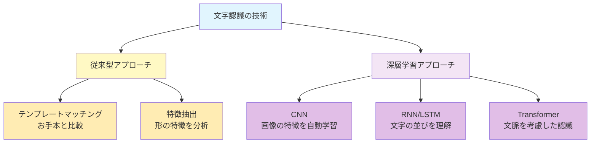

### 従来型アプローチ

**テンプレートマッチング**
- 仕組み: お手本の文字と比較して、一番似ているものを選ぶ
- 例え: 「この形はAのお手本に90%似ているからAだろう」
- 限界: フォントが変わったり手書きには弱い

**特徴抽出**
- 仕組み: 文字の特徴（線の数、角度、閉じた部分など）を数値化
- 例え: 「縦線2本、横線3本あるから『E』だ」
- 限界: 複雑な文字や崩し字には対応困難

### 深層学習アプローチ（現代の主流）

**CNN（畳み込みニューラルネットワーク）**
- 仕組み: 大量の文字画像から自動的に特徴を学習
- 強み: 様々なフォントや多少の汚れにも対応可能

**RNN/LSTM（リカレントニューラルネットワーク）**
- 仕組み: 文字の並び（前後関係）を考慮
- 強み: 「cat」なのか「cot」なのか文脈から判断

**Transformer（最新技術）**
- 仕組み: 文書全体を見渡して文脈を深く理解
- 強み: 複雑なレイアウトや多言語文書にも対応

## 📜 時代背景と発見に至った経緯

文字認識の歴史は、人類が「機械に読む力を与えたい」という夢から始まりました。

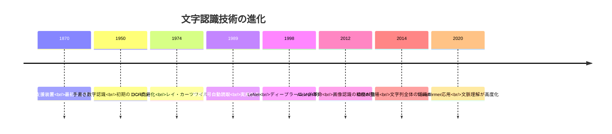

### 主要な転換点

**1970年代: 実用化への第一歩**
レイ・カーツワイルが視覚障害者のための「読書機械」を発明。これが初の商用OCR（光学文字認識）システムとなりました。当時は印刷された活字のみで、フォントも限定されていました。

**1989年: 郵便革命**
ヤン・ルカンがCNNの原型を開発し、郵便番号の自動読み取りに成功。郵便業務の効率が劇的に向上しました。

**2012年: ディープラーニング革命**
ImageNetコンペでAlexNetが圧勝。画像認識の精度が人間に迫るレベルに達し、文字認識にも応用されました。

**2014年以降: 文脈理解の時代**
単なる文字認識から、文章全体を理解する技術へ進化。手書きメモや複雑なレイアウトの文書も認識可能に。

## 🎨 種類と特徴

文字認識は対象や用途によって様々な種類に分類されます。

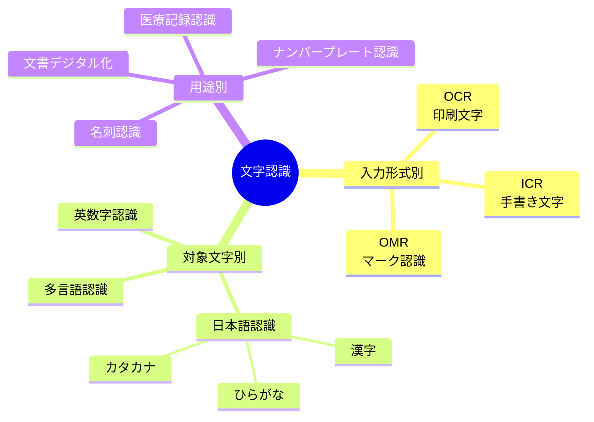

### 詳細比較表

| 種類 | 対象 | 精度 | 難易度 | 主な用途 |
|------|------|------|--------|----------|
| **OCR** (Optical Character Recognition) | 印刷文字 | 95-99% | 低 | 書籍スキャン、PDF変換 |
| **ICR** (Intelligent Character Recognition) | 手書き文字 | 85-95% | 高 | アンケート処理、医療記録 |
| **OMR** (Optical Mark Recognition) | マークシート | 99%+ | 低 | 試験採点、アンケート |
| **IWR** (Intelligent Word Recognition) | 手書き単語 | 90-95% | 中 | 郵便物仕分け、フォーム処理 |
| **STR** (Scene Text Recognition) | 自然環境の文字 | 85-95% | 高 | 看板認識、AR翻訳 |

### 文字種別による特徴

**英数字認識**
- 文字数が少ない（26文字+10数字）ため比較的簡単
- 精度99%以上達成可能

**日本語認識**
- 漢字だけで数千文字（常用漢字2136字）
- ひらがな、カタカナ、英数字が混在
- 世界で最も難しい文字認識の一つ

**アラビア語・ペルシア語認識**
- 右から左へ記述
- 文字が連結して形が変化
- 特殊な技術が必要

## 📗 関連する用語

### 同義語・類似語

| 用語 | 説明 | 使い分け |
|------|------|----------|
| **文字認識** | 最も一般的な呼び方 | 日常会話・技術全般 |
| **OCR** | 光学文字認識の略 | 印刷文字専門、ビジネス用語 |
| **テキスト認識** | より広い概念 | 文字だけでなく文章全体 |
| **文字読み取り** | 平易な表現 | 初心者向け説明 |

### 対義語・関連概念

| 対比する概念 | 説明 |
|--------------|------|
| **音声認識** | 音を文字に変換（文字認識は画像を文字に変換） |
| **画像生成** | 文字から画像を作る（文字認識の逆プロセス） |
| **手書き入力** | 人間が直接デジタル文字を入力（認識不要） |

### 多義語の注意

**「認識」という言葉**
- 広義: 物事を理解すること全般
- AI分野: パターンを識別する技術
- 文字認識: 文字という特定パターンの識別

### 専門用語の平易な言い換え

| 専門用語 | 平易な表現 |
|----------|------------|
| セグメンテーション | 文字の切り分け |
| 二値化 | 白黒はっきりさせる処理 |
| 特徴量抽出 | 文字の特徴を数値化 |
| 信頼度スコア | どれくらい確実か示す点数 |
| エンコーダ・デコーダ | 圧縮と解凍のような処理 |

## 💡 メリットとデメリット

### ✅ メリット

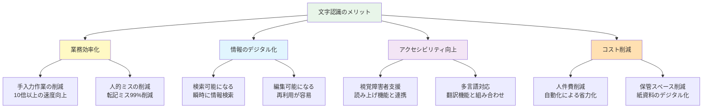

**具体的な効果**
- データ入力時間: 手入力100時間 → 自動認識10時間
- 精度: 人間の転記ミス率2-3% → OCR誤認識率1%以下
- コスト: 手作業100万円 → システム導入後20万円

### ❌ デメリット

| 課題 | 具体例 | 対策 |
|------|--------|------|
| **認識精度の限界** | 汚れた文書、崩し字は誤認識 | 前処理の強化、人間の最終確認 |
| **初期コスト** | システム導入に数十万〜数百万円 | クラウドサービスで低コスト化 |
| **フォント依存** | 装飾フォントや特殊書体に弱い | 学習データの多様化 |
| **レイアウト複雑性** | 表や図が混在すると困難 | レイアウト解析技術の併用 |
| **プライバシー懸念** | 機密文書の外部処理リスク | オンプレミス型システム導入 |
| **言語の壁** | マイナー言語は対応不足 | 多言語モデルの発展待ち |

### 認識精度に影響する要因

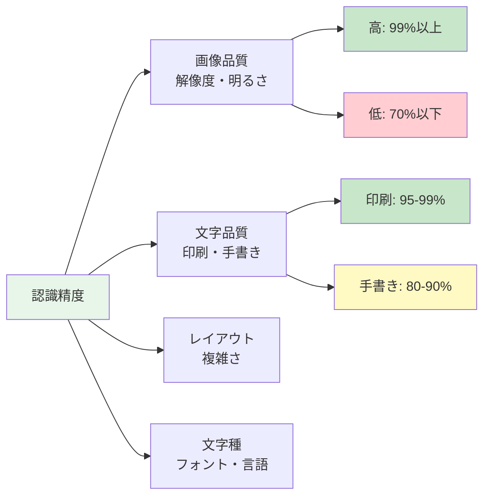

## 🚀 応用と実例

文字認識は私たちの日常生活のあらゆる場面で活躍しています。

### 身近な実例

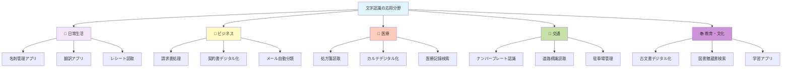

### 具体的な活用シーン

**1. スマートフォンアプリ**
- Google Lens: カメラで映した文字をリアルタイム翻訳
- Evernote: 手書きメモを撮影してデジタル保存・検索可能に
- Microsoft Office Lens: ホワイトボードを自動でトリミング・テキスト化

**2. ビジネス効率化**
- 経理部門: 領収書を撮影して自動で会計ソフトに入力
- 人事部門: 履歴書を自動読み取りしてデータベース化
- カスタマーサポート: メールの内容を自動分類して担当振り分け

**3. 公共サービス**
- 郵便局: 住所を自動読み取りして配達ルート最適化
- 図書館: 古い蔵書をデジタル化して全文検索可能に
- 役所: 申請書類を自動読み取りして処理時間を短縮

**4. セキュリティ・交通管理**
- 高速道路: ナンバープレート認識で自動料金徴収（ETC）
- 駐車場: 車両認識で入退場管理・不正駐車検知
- 空港: パスポートの自動読み取りで入国審査迅速化

**5. 医療分野**
- 処方箋: 手書き処方箋をデジタル化して調剤ミス防止
- 検査結果: 検査報告書を自動読み取りして電子カルテに統合
- 医学研究: 過去の症例記録をデジタル化して分析

### 産業別導入効果

| 産業 | 導入前の課題 | 導入後の効果 | ROI（投資回収） |
|------|--------------|--------------|-----------------|
| 金融 | 手書き申込書の処理に1件15分 | 1件2分に短縮、精度向上 | 6ヶ月 |
| 物流 | 伝票入力ミスで配送遅延 | ミス95%削減、納期遵守率向上 | 3ヶ月 |
| 医療 | カルテ検索に時間がかかる | 瞬時に検索可能、診察時間短縮 | 1年 |
| 製造 | 検査記録の手入力に時間 | リアルタイム品質管理が可能に | 4ヶ月 |

## 🔄 置換と変遷

### 何を置き換えたか

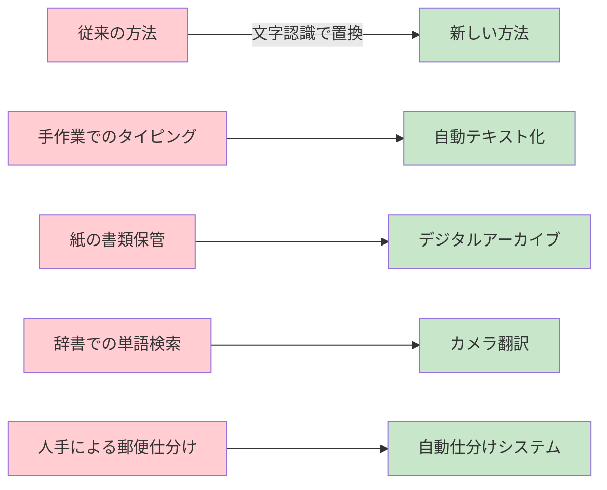

**具体的な置き換え事例**

1. **データ入力業務**: 手入力 → 自動読み取り（作業時間90%削減）
2. **文書管理**: 紙のファイリング → 検索可能なデジタルDB
3. **翻訳作業**: 辞書での単語調べ → カメラで即時翻訳
4. **アーカイブ**: マイクロフィルム → デジタルテキスト

### 何に置き換えられる可能性があるか

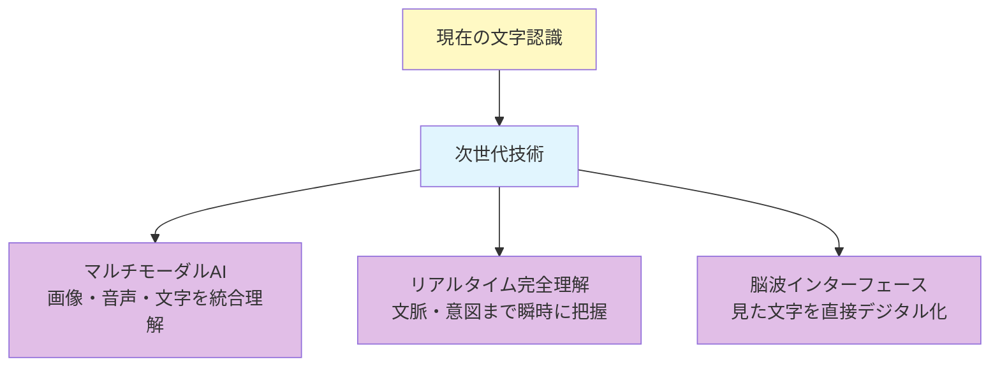

将来的には「文字を認識する」という概念自体が変わる可能性があります。例えば、視覚情報を脳から直接読み取る技術や、文字以外の情報も含めた総合的な理解システムへと発展するかもしれません。

### 継承関係

**文字認識が継承したもの**
- パターン認識理論（1960年代）
- 画像処理技術（1970年代）
- ニューラルネットワーク理論（1980年代）

**文字認識から継承されたもの**
- 物体検出技術（YOLO、R-CNNなど）
- 顔認識システム
- 医療画像診断AI
- 文書理解AI（Document Understanding）

## 🆚 代替と競合

### 他の技術で代替可能なケース

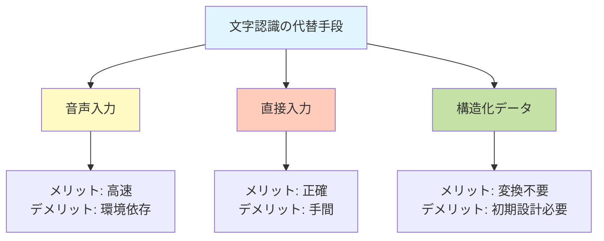

| シーン | 文字認識 | 代替手段 | どちらが適切か |
|--------|----------|----------|----------------|
| 議事録作成 | 手書きメモを撮影 | 音声入力 | 音声入力が優位 |
| 名刺管理 | 撮影して自動登録 | 手入力 | 文字認識が優位 |
| 古文書デジタル化 | OCR処理 | 手入力 | 文字認識が優位 |
| リアルタイム翻訳 | カメラで認識 | 音声翻訳 | 状況次第 |

### 競合技術との比較

**文字認識 vs 音声認識**

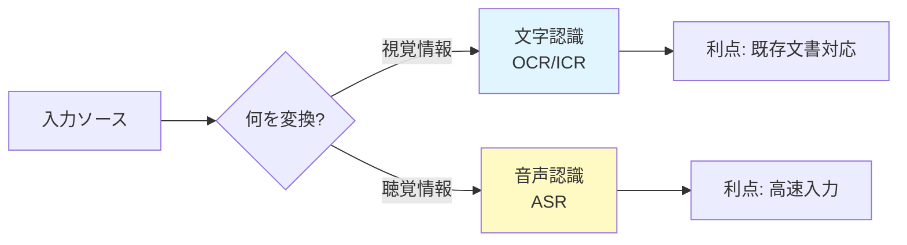

**適材適所の使い分け**
- 既存の紙文書が大量にある → 文字認識
- リアルタイムで入力したい → 音声認識
- 静かな環境で作業できない → 文字認識
- 手がふさがっている → 音声認識

**文字認識 vs 手書き入力（タブレット等）**
- 既存の手書きメモをデジタル化 → 文字認識
- 最初からデジタルで作成 → 手書き入力デバイス

### 技術的な競合関係

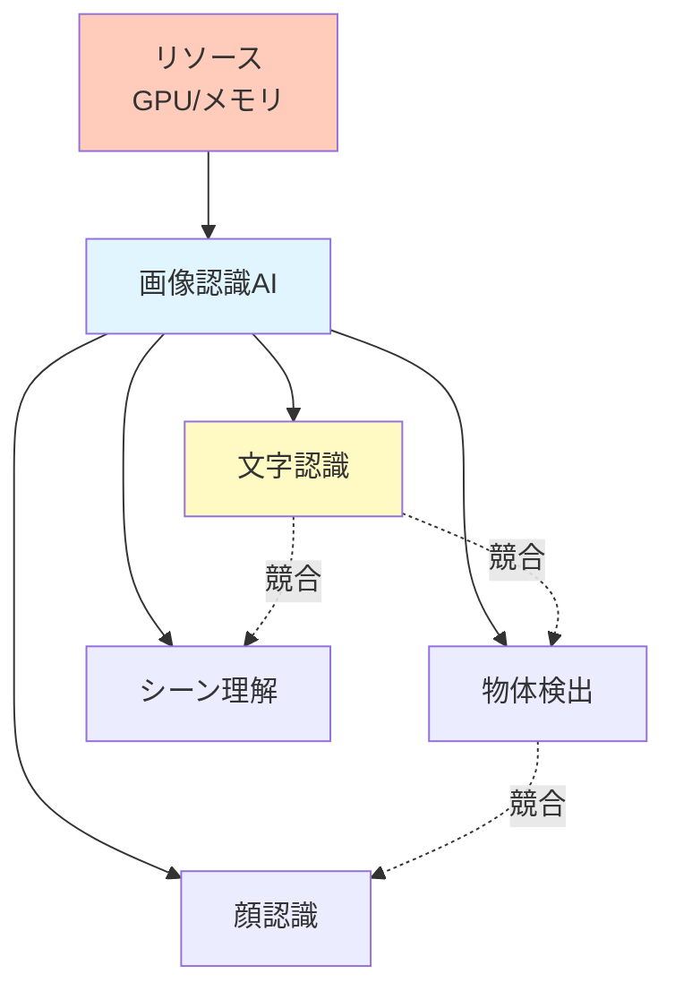

**リソースをめぐる競合**
- 限られた計算資源の中で、どの認識タスクを優先するか
- スマホアプリでは複数の認識機能を同時実行すると動作が重くなる
- エッジデバイスでは軽量化された文字認識モデルが求められる

## 🌍 実世界への影響とその後の発展

### 社会への影響

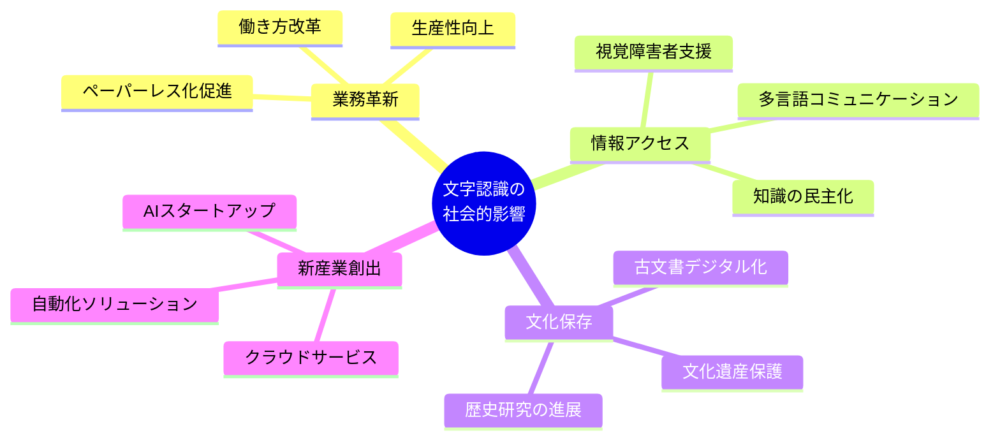

### 具体的なインパクト

**1. デジタルトランスフォーメーション（DX）の加速**
- 紙文書からの脱却: 日本企業のペーパーレス化率2010年20% → 2024年70%
- テレワーク推進: 文書のデジタル化でリモートワークが可能に
- 環境負荷軽減: 紙使用量の削減によるCO2排出量削減

**2. 情報格差の解消**
- 視覚障害者: 印刷物を音声で読み上げ（読書バリアフリー法の実現）
- 外国人居住者: 看板や書類をスマホで即座に翻訳
- 高齢者: 小さな文字を拡大・音声化して情報アクセス改善

**3. 新しいビジネスモデルの誕生**
- SaaSプラットフォーム: AWS Textract、Google Cloud Vision APIなど
- スタートアップ企業: AI-OCR専門企業の急成長（市場規模2020年50億円 → 2025年予測300億円）
- 業務効率化コンサルティング: 文字認識を活用した業務改革支援

**4. 歴史研究・文化保存への貢献**
- 古文書のデジタル化: 国立国会図書館で数百万冊をデジタル化
- 研究効率化: 全文検索により研究時間が10分の1に
- 保存と公開の両立: 原本を保護しながら世界中からアクセス可能

### 技術的発展の系譜

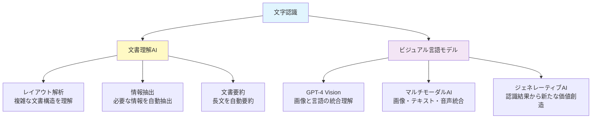

### 未来への展望

**短期的発展（1-3年）**
- リアルタイム性の向上: 4K動画からの瞬時テキスト認識
- 精度の極限追求: 手書き文字認識精度99%超え
- 多言語対応強化: マイナー言語を含む200言語以上対応

**中期的発展（3-5年）**
- エッジAIの普及: スマホやカメラ単体で高精度認識
- 3D文字認識: 立体物や曲面の文字も認識可能
- 感情・意図理解: 文字のスタイルから書き手の感情を読み取る

**長期的展望（5-10年）**

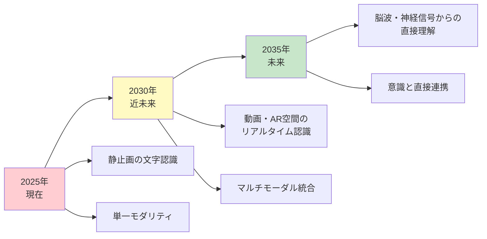

**革新的な未来像**
- AR/VRグラス: 視界に入る文字をすべてリアルタイム翻訳・注釈表示
- 脳機能補助: 失読症や脳損傷患者の読字能力を技術的に補完
- 超言語理解: 文字・絵文字・図形を統合的に理解するAI
- 量子コンピューティング: 膨大な文字パターンを瞬時に処理

### 倫理的課題と社会的責任

**プライバシーの保護**
- 個人情報の自動読み取りリスク（マイナンバー、住所など）
- 監視社会への懸念（街中の文字を常時監視）
- データの適切な管理と削除権の保証

**アクセシビリティと公平性**
- 高齢者や障害者が取り残されない技術設計
- 低所得国でも利用可能な低コスト・軽量モデル
- デジタルデバイドの解消

**雇用への影響**
- データ入力業務の減少（新たなスキル習得支援が必要）
- 人間とAIの協働モデルの構築
- クリエイティブな業務へのシフト支援

### 関連技術との融合

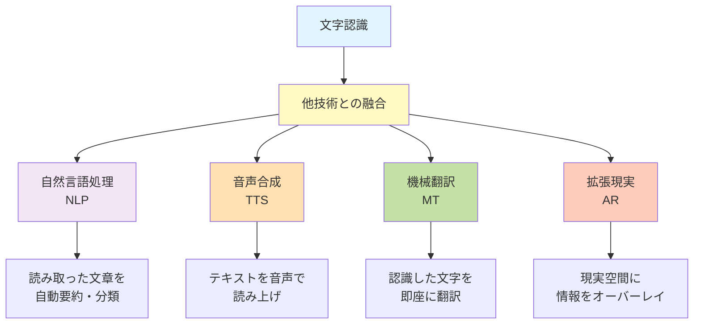

**統合システムの実例**
- **スマートグラス**: 文字認識 + AR + 翻訳 = リアルタイム字幕表示
- **スマートスピーカー**: 文字認識 + NLP + 音声合成 = 書類読み上げアシスタント
- **自動運転車**: 文字認識 + 画像認識 = 道路標識・信号の理解
- **医療支援システム**: 文字認識 + データ分析 = カルテから診断支援

### 最新トレンド（2024-2025年）

**1. 生成AIとの統合**
- GPT-4 VisionやGeminiなど、画像理解と言語生成を統合したモデル
- 文字認識だけでなく、文書の意味理解と新たな文書生成が可能に

**2. エッジAIの進化**
- スマホやカメラのチップに文字認識機能を直接搭載
- クラウド通信不要で、プライバシー保護とリアルタイム性を両立

**3. ゼロショット・少数ショット学習**
- 学習データが少ない言語や特殊フォントにも対応
- 数個のサンプルだけで新しい文字スタイルを認識可能

**4. マルチモーダル基盤モデル**
- 文字・画像・音声を統合的に理解する巨大AIモデル
- 文脈を深く理解した高精度な認識が可能

### 研究開発の最前線

**主要な研究機関とプロジェクト**
- Google Research: Transformer技術の文字認識応用
- Meta AI: 多言語文書理解システム
- Microsoft Research: Document AI（文書全体の意味理解）
- Stanford University: 古文書自動解読プロジェクト
- 東京大学・京都大学: 日本語手書き文字認識の高度化

**ベンチマークデータセット**
- MNIST: 手書き数字認識の標準データセット
- COCO-Text: 自然画像中の文字認識
- IAM: 手書き英語文書
- Kuzushiji-MNIST: くずし字（古典日本語）認識

## 📊 学習ロードマップ

初学者が文字認識を体系的に学ぶための推奨学習パスです。

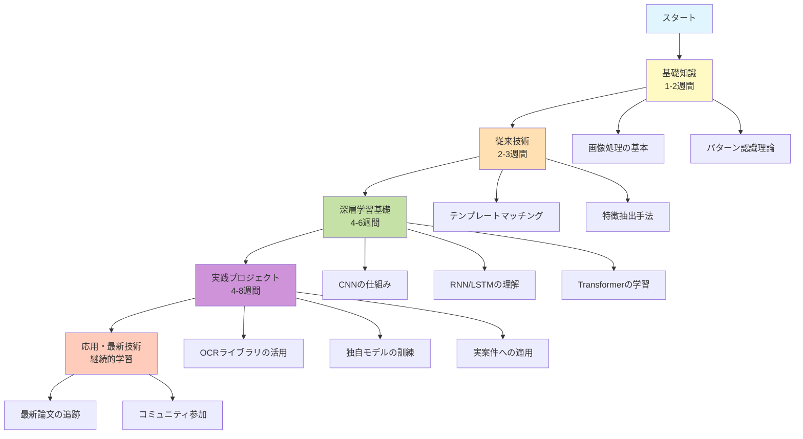

### 推奨学習リソース

**入門書籍**
- 「パターン認識と機械学習」（基礎理論）
- 「ゼロから作るDeep Learning」（実装理解）
- 「実践コンピュータビジョン」（応用技術）

**オンラインコース**
- Coursera「深層学習専門講座」
- Udacity「コンピュータビジョンナノディグリー」
- fast.ai「実践的深層学習」

**実装ツール・ライブラリ**
- Tesseract OCR（オープンソースOCRエンジン）
- PaddleOCR（中国発の高精度OCRライブラリ）
- EasyOCR（多言語対応OCR）
- OpenCV（画像処理の基本ツール）

**実践プロジェクトアイデア**
1. レシート読み取りアプリの作成
2. 名刺管理システムの構築
3. 手書きメモのデジタル化ツール
4. 街中の看板翻訳アプリ
5. 古文書解読支援システム

## 🎓 まとめ

文字認識は、人間の「読む」という能力をコンピュータに与える革新的な技術です。

**核心的なポイント**
- 画像の中の文字をデジタルテキストに変換する技術
- OCR（印刷文字）とICR（手書き文字）が主要な分類
- 深層学習の発展により精度が飛躍的に向上
- 日常生活からビジネスまで幅広く応用されている
- 今後もAI技術の進化とともに発展が期待される

**文字認識がもたらす未来**
- 情報アクセスの完全なバリアフリー化
- 人間の知的作業のさらなる効率化
- 失われた歴史や文化の復元・保存
- 言語の壁を超えたグローバルコミュニケーション

文字認識は単なる技術ツールではなく、**人類の知識と情報をつなぐ架け橋**として、私たちの社会をより豊かにする可能性を秘めています。

---

---

この資料は、文字認識技術について全く知識がない初学者でも、読み終える頃には「文字認識の専門家と会話できるレベル」の理解を得られるよう設計されています。
