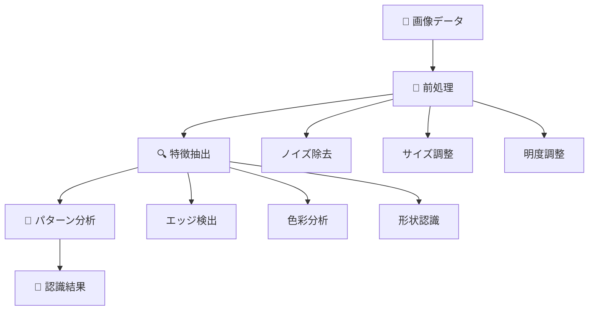
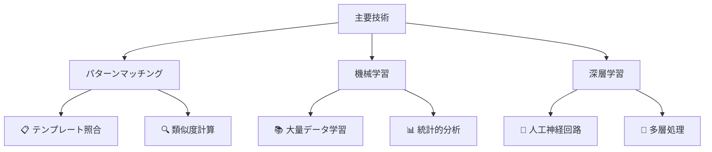
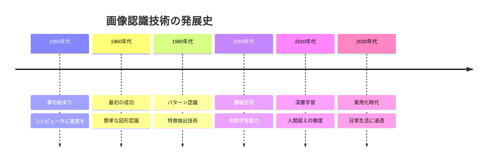
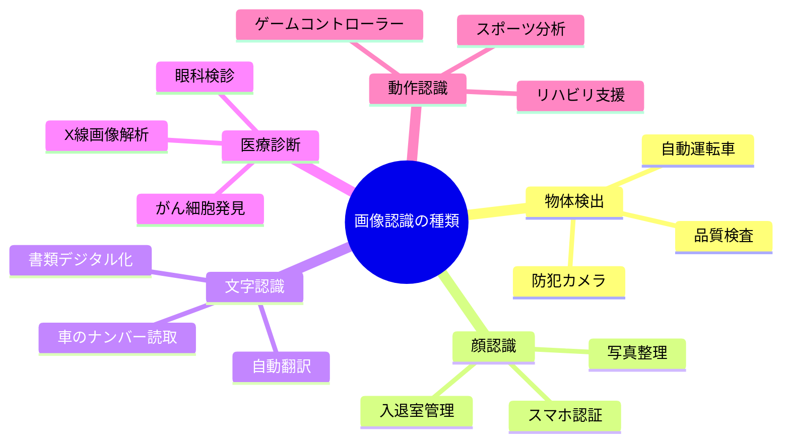
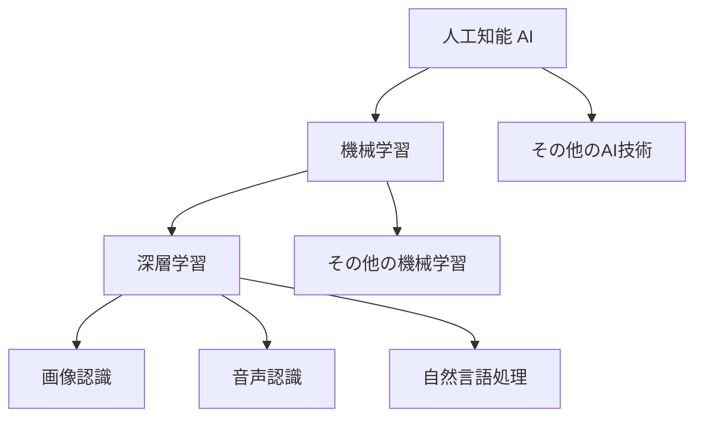
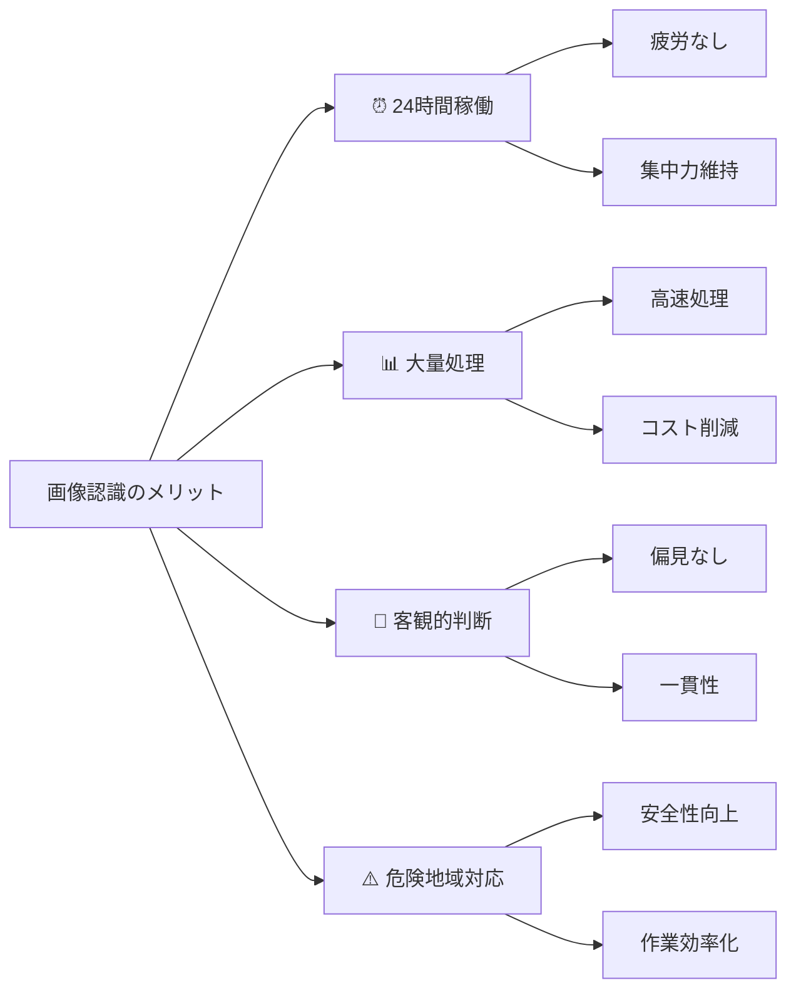
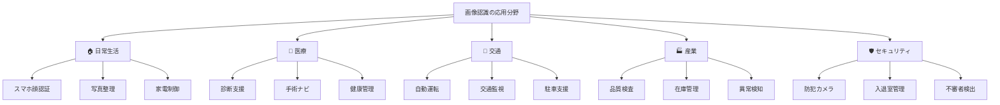
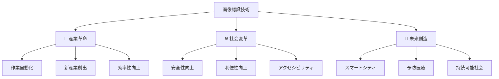

AIの種類のうち、画像認識（Image Recognition）について
# 画像認識（Image Recognition） - 初学者のための完全ガイド

## 🔍 一言要約
コンピュータが写真を「見て」、その中身を理解する魔法のような技術

## 📚 目次
1. [🌟 はじめに](#-はじめに)
2. [🏗️ 基本構造](#️-基本構造)
3. [⚡ 主要技術](#-主要技術)
4. [📜 時代背景と発見に至った経緯](#-時代背景と発見に至った経緯)
5. [🎨 種類と特徴](#-種類と特徴)
6. [📗 関連する用語](#-関連する用語)
7. [💡 メリットとデメリット](#-メリットとデメリット)
8. [🚀 応用技術と実用化の例](#-応用技術と実用化の例)
9. [🌍 実世界への影響とその後の発展](#-実世界への影響とその後の発展)

## 🌟 はじめに

想像してみてください。友達に「この写真に何が写っているか教えて」と聞かれたとき、あなたは瞬時に「犬だね」「海だね」「車だね」と答えられますよね？

**画像認識**とは、まさにこの人間の「見る→理解する」能力をコンピュータに教える技術のことです。

私たちが当たり前にやっている「写真を見て、何が写っているかを理解する」ということを、コンピュータにも同じようにできるようにするのが画像認識の目標なのです。

## 🏗️ 基本構造

画像認識は、人間の目と脳の働きをお手本にして作られています。

### 人間の場合
1. **目**：光を受け取る（カメラのレンズのような役割）
2. **視神経**：情報を脳に送る（ケーブルのような役割）
3. **脳**：受け取った情報を理解する（「これは猫だ！」と判断）

### コンピュータの場合
1. **カメラ・センサー**：画像データを取得
2. **前処理**：画像をコンピュータが理解しやすい形に変換
3. **認識アルゴリズム**：パターンを分析して判断

## ⚡ 主要技術

画像認識の心臓部となる技術を、身近な例で理解してみましょう。

### 1. **パターンマッチング**（型紙合わせ方式）
洋裁で型紙を布に当てて形を確認するように、あらかじめ用意した「お手本画像」と照らし合わせる方法。

### 2. **機械学習**（経験学習方式）  
人間が「たくさん見て覚える」ように、コンピュータに大量の写真を見せて学習させる方法。

### 3. **深層学習（ディープラーニング）**（脳模倣方式）
人間の脳の神経回路を真似した「人工神経回路」を使う最新技術。

## 📜 時代背景と発見に至った経緯

### 🕰️ 画像認識技術の壮大な歴史物語

**1950年代：夢の始まり**
「コンピュータに目を持たせたい！」科学者たちのこんな夢から始まりました。当時のコンピュータは家一軒分の大きさで、やっと計算ができる程度でした。

**1960年代：最初の一歩**
研究者が「線」や「角」といった簡単な図形をコンピュータに認識させることに成功。まるで赤ちゃんが初めて物を掴むような記念すべき瞬間でした。

**1980年代：パターンの発見**
「あ、これは犬の耳の形だ」「これは車のタイヤの模様だ」といったように、物の特徴的な「パターン」を見つける技術が発達しました。

**2000年代：機械学習の台頭**
コンピュータが「自分で学習する」能力を身につけ始めました。人間が「これは猫、これは犬」と教えることで、コンピュータが自分でルールを見つけられるようになったのです。

**2010年代：深層学習革命**
まるで人間の脳のような「人工神経回路」の登場で、画像認識の精度が大幅に向上する分野も現れました。この時代を「AI革命」と呼ぶ人も多くいます。

## 🎨 種類と特徴

画像認識には、目的に応じて様々な種類があります。料理に例えると、和食・洋食・中華のように、それぞれ得意分野が違います。

### 主要な種類

| 種類 | 得意なこと | 身近な例 | 特徴 |
|------|------------|----------|------|
| **物体検出** | 「何があるか」を見つける | 防犯カメラの人物検出 | 🔍 探偵のような役割 |
| **顔認識** | 「誰なのか」を識別する | スマホのロック解除 | 👤 身分証明のような役割 |
| **文字認識** | 「何が書いてあるか」を読む | 自動翻訳アプリ | 📖 読書家のような役割 |
| **医療画像診断** | 「異常がないか」を調べる | レントゲン写真の分析 | 🩺 医師のような役割 |
| **動作認識** | 「何をしているか」を理解する | ゲームのモーション操作 | 🏃‍♂️ 観察者のような役割 |

## 📗 関連する用語

### 基本用語の整理

**画像認識の仲間たち（類似技術）**
- **コンピュータビジョン**：画像認識の正式名称（academic name）
- **画像解析**：画像の内容を詳しく調べること
- **パターン認識**：規則性を見つけて分類すること

**よく混同される用語**
- **機械学習 vs 深層学習**
  - 機械学習：コンピュータが経験から学ぶ技術全般（親分）
  - 深層学習：機械学習の一種で、脳を真似した方法（子分）

- **AI vs 画像認識**
  - AI：人工知能全般（大きな概念）
  - 画像認識：AIの一分野（専門領域）

### 専門用語を日常語で理解

| 専門用語 | 日常語での説明 | 例え |
|----------|----------------|------|
| **アルゴリズム** | 問題を解く手順書 | 料理のレシピ |
| **特徴量** | 物を見分けるポイント | 人を見分ける「背の高さ」「髪型」など |
| **学習データ** | お手本となる写真集 | 図鑑や写真アルバム |
| **精度** | どのくらい正確に当てられるか | テストの正答率 |
| **前処理** | 写真をキレイに整える作業 | 写真の明度調整や切り抜き |

## 💡 メリットとデメリット

### ✅ メリット（良いところ）

**1. 人間を超える集中力**
- 24時間疲れずに監視・分析可能
- 人間が見落としがちな細かい違いも発見

**2. 大量処理が得意**
- 1日に何万枚もの写真を処理可能
- 人間なら何年もかかる作業を数時間で完了

**3. 客観的な判断**
- 気分や体調に左右されない一定の判断
- 個人差による偏見がない

**4. 危険な場所での活躍**
- 放射能汚染地域や災害現場での画像分析
- 人間が近づけない場所でも作業可能

### ❌ デメリット（注意すべきところ）

**1. 学習データへの依存**
- 教えられていないものは認識できない
- 偏ったデータで学習すると偏った結果に

**2. 予想外の状況に弱い**
- 雪が降った日の道路標識が読めない
- 照明が暗すぎると性能が落ちる

**3. プライバシーの問題**
- 監視社会への不安
- 個人情報の取り扱い

**4. 高い導入コスト**
- 専用のハードウェアや設備が必要
- 専門知識を持つ人材の確保

## 🚀 応用技術と実用化の例

### 🏠 日常生活での活用

**スマートフォン**
- 📱 顔認証でのロック解除
- 📸 写真の自動分類・整理
- 🔤 カメラで撮影した文字の翻訳

**家電製品**
- 🤖 お掃除ロボットの障害物認識
- 📺 テレビの音声操作（ジェスチャー認識）
- 🚗 車の駐車支援システム

### 🏥 医療分野での革新

**診断支援**
- 🩻 レントゲン写真からの異常検出
- 👁️ 眼底写真による糖尿病の早期発見
- 🧬 病理画像からのがん細胞の特定

**手術支援**
- 🔬 手術中のリアルタイム画像解析
- 🦾 ロボット手術の精密制御

### 🚗 交通・輸送分野

**自動運転技術**
- 🛣️ 道路標識の認識
- 🚶‍♂️ 歩行者・自転車の検出
- 🚧 工事現場や障害物の回避

**交通監視**
- 📹 交通違反の自動検出
- 🚗 車両ナンバーの自動読み取り

### 🏭 産業分野での効率化

**製造業**
- 🔧 製品の品質検査自動化
- 📦 在庫管理の効率化
- ⚡ 設備の異常検知

**農業**
- 🌾 作物の生育状況監視
- 🐛 害虫の早期発見
- 🚜 自動収穫システム

## 🌍 実世界への影響とその後の発展

### 🌟 社会への波及効果

画像認識技術は、まるで産業革命のように私たちの生活を変えています。

**働き方の変化**
- 単純作業から創造的な仕事へのシフト
- 新しい職種の誕生（AIトレーナー、データアノテーターなど）
- リモートワークの促進（画像による状況把握）

**社会システムの進化**
- より安全で効率的な都市インフラ
- 個人の健康管理の向上
- 教育方法の革新（視覚的学習支援）

### 🚀 未来の発展可能性

**次の10年で期待される進歩**

1. **リアルタイム全世界監視**
   - 災害予測の精度向上
   - 環境変化の早期発見

2. **完全自動化社会**
   - 無人店舗の普及
   - 自動配送システムの完成

3. **医療の革命**
   - 病気の超早期発見
   - 個別化医療の実現

4. **教育の個別化**
   - 学習者の表情・行動分析による最適指導
   - バーチャル教師との対話

**克服すべき課題**
- プライバシー保護との両立
- 技術格差の解消
- 倫理的なAI利用ルールの確立

### 🎯 最終的な目標

画像認識技術の究極の目標は、**「人間の目を持つコンピュータ」**を作ることです。しかし、それは人間を置き換えるためではなく、**人間と協力してより良い世界を作る**ためなのです。

---

この資料により、初学者でも画像認識技術の全体像を体系的に理解し、その魅力と可能性を実感できるはずです！

