機械学習について

# 機械学習 - 初学者のための完全ガイド

## 🔍 一言要約
コンピューターが人間のように「経験から学ぶ」技術

## 📚 目次
1. [🌟 はじめに](#はじめに)
2. [🏗️ 基本構造](#基本構造)
3. [⚡ 主要技術](#主要技術)
4. [📜 時代背景と発見に至った経緯](#時代背景と発見に至った経緯)
5. [🎨 種類と特徴](#種類と特徴)
6. [📗 関連する用語](#関連する用語)
7. [💡 メリットとデメリット](#メリットとデメリット)
8. [🚀 応用技術と実用化の例](#応用技術と実用化の例)
9. [🌍 実世界への影響とその後の発展](#実世界への影響とその後の発展)

## 🌟 はじめに

機械学習とは、**コンピューターが人間の子どもと同じように経験から学ぶ技術**です。

想像してみてください。あなたが子どもの頃、りんごを見分けることを覚えた時のことを。最初は親に「これがりんご」と教えてもらい、たくさんのりんごを見るうちに、形や色、大きさから自然に「これもりんご」と判断できるようになりましたよね。

機械学習は、まさにこれと同じことをコンピューターにさせる技術なのです。

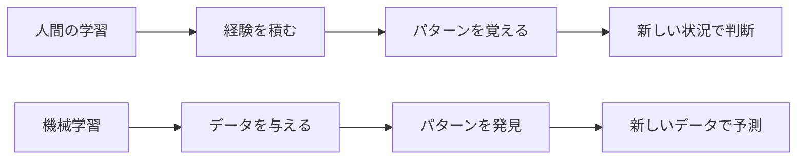

## 🏗️ 基本構造

機械学習は、まるで**料理のレシピを覚える過程**のようなものです。

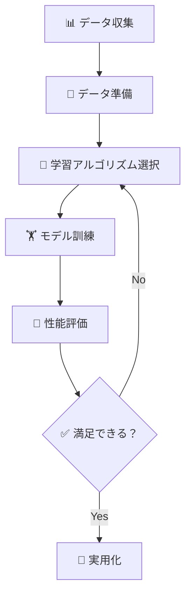

### 構成要素の詳細

| 要素 | 料理での例 | 機械学習での役割 |
|------|------------|------------------|
| **データ** | 材料 | 学習のための情報 |
| **アルゴリズム** | 調理法 | データからパターンを見つける方法 |
| **モデル** | 完成したレシピ | 学習した知識 |
| **予測** | 新しい料理を作る | 新しい問題を解決する |

## ⚡ 主要技術

機械学習の世界には、**3つの主要な学習スタイル**があります。これは人間の学習方法ととてもよく似ています。

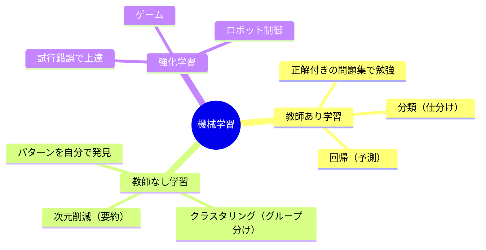

### 🎓 教師あり学習（Supervised Learning）
**正解を見ながら勉強する方法**

- **例**: 数学の問題集で勉強する時と同じ
- **使い道**: メール分類、株価予測、病気診断
- **特徴**: 大量の「問題と正解のセット」が必要

### 🔍 教師なし学習（Unsupervised Learning）
**データの中から隠れたパターンを自分で見つける方法**

- **例**: 友達の趣味を観察して、似たような人をグループ分けする
- **使い道**: 顧客分析、推薦システム、異常検知
- **特徴**: 正解がない状態でパターンを発見

### 🎮 強化学習（Reinforcement Learning）
**試行錯誤を繰り返して上達する方法**

- **例**: ゲームで何度も挑戦して上手くなる
- **使い道**: 自動運転、ゲームAI、ロボット制御
- **特徴**: 行動の結果から良い・悪いを学習

## 📜 時代背景と発見に至った経緯

### 🕰️ 機械学習の壮大な歴史ストーリー

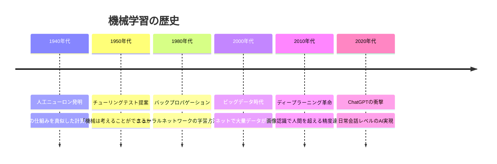

### 🧠 発見の物語

**1943年**: ウォルター・ピッツとウォーレン・マカロックが、人間の脳神経細胞（ニューロン）の働きを数学的に表現することに成功しました。これが現在の機械学習の原点となりました。

**「なぜ脳を真似しようと思ったのか？」**

当時の科学者たちは考えました：
- 人間の脳は複雑な問題を瞬時に解決できる
- コンピューターも同じような仕組みを持てば、知的になれるのでは？
- 特に、パターン認識（顔を見分ける、音声を理解するなど）は脳の得意分野

この発想から生まれたのが「ニューラルネットワーク」という技術です。

## 🎨 種類と特徴

機械学習は、**問題の種類**によって使い分けます。まるで道具箱から適切な工具を選ぶように。

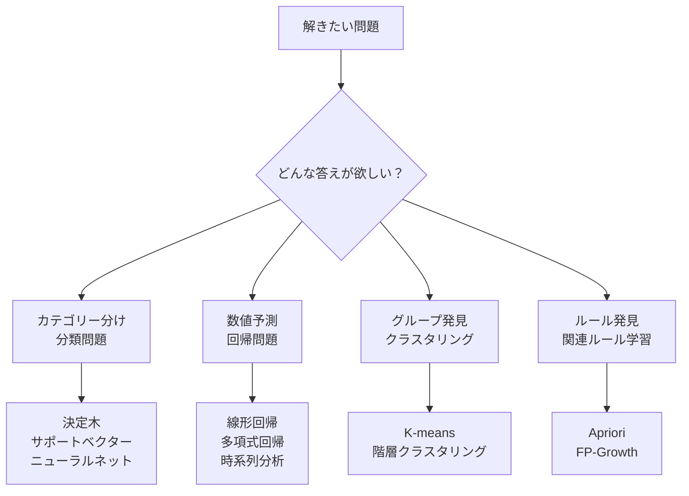

### 📊 主要アルゴリズムの特徴比較

| アルゴリズム | 得意分野 | 日常例 | 難易度 |
|-------------|----------|--------|--------|
| **決定木** | ルール作り | 「もし雨なら傘、晴れなら帽子」 | ⭐⭐ |
| **線形回帰** | 数値予測 | 「勉強時間から点数予測」 | ⭐ |
| **ニューラルネット** | 複雑パターン | 「写真から物体認識」 | ⭐⭐⭐⭐ |
| **サポートベクター** | 境界線作り | 「スパムメール判定」 | ⭐⭐⭐ |

## 📗 関連する用語

### 🔤 同義語・関連語
- **機械学習** = **マシンラーニング** = **ML**
- **人工知能** = **AI** = **Artificial Intelligence**
- **深層学習** = **ディープラーニング** = **Deep Learning**

### 🔄 類似概念の比較

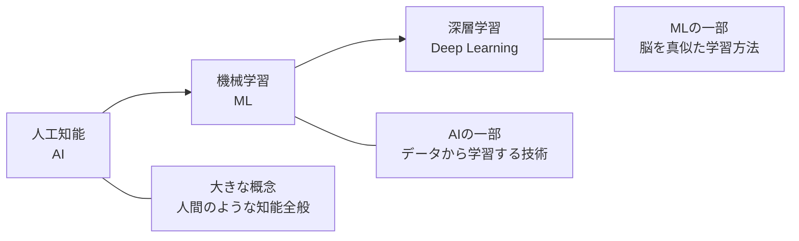

### 📚 重要用語集

| 用語 | 簡単な意味 | 身近な例 |
|------|------------|----------|
| **アルゴリズム** | 問題を解く手順 | 料理のレシピ |
| **データセット** | 学習用の情報集合 | 教科書 |
| **特徴量** | データの特徴を数値化 | 人の身長・体重 |
| **モデル** | 学習した結果 | 覚えた知識 |
| **訓練** | 学習させること | 勉強すること |
| **予測** | 新しい答えを出すこと | テストで答える |

## 💡 メリットとデメリット

### ✅ メリット（良い点）

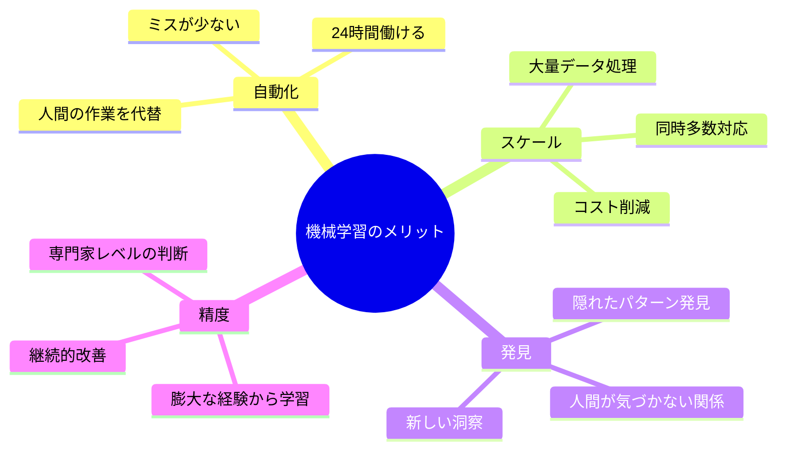

**具体例**：
- **自動化**: レジの無人化、自動翻訳
- **スケール**: 何百万人の同時サービス
- **発見**: 新薬の候補物質発見
- **精度**: 医師より正確ながん診断

### ❌ デメリット（課題）

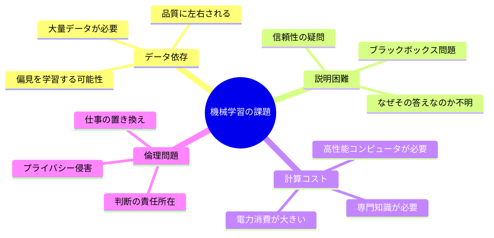

**対策例**：
- **データ偏見**: 多様なデータを集める
- **説明性**: 解釈可能なAIの開発
- **コスト**: クラウドサービスの活用
- **倫理**: 法規制と業界ガイドラインの整備

## 🚀 応用技術と実用化の例

### 🏠 日常生活での活用

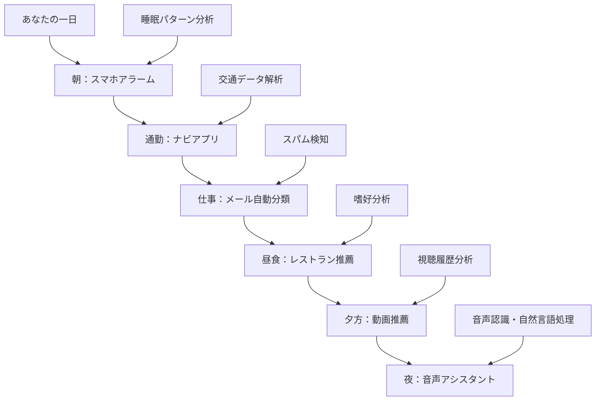

### 🏭 産業別活用事例

| 業界 | 活用例 | 効果 | 身近な例 |
|------|--------|------|----------|
| **医療** | 画像診断、新薬開発 | 診断精度向上 | レントゲン解析 |
| **金融** | 与信審査、不正検知 | リスク軽減 | クレジットカード審査 |
| **製造** | 品質管理、予知保全 | 不良品削減 | 工場の異常検知 |
| **小売** | 需要予測、価格最適化 | 売上向上 | Amazonの推薦システム |
| **エンターテイメント** | コンテンツ推薦 | ユーザー満足度向上 | Netflix、Spotify |

### 🌟 次世代応用技術

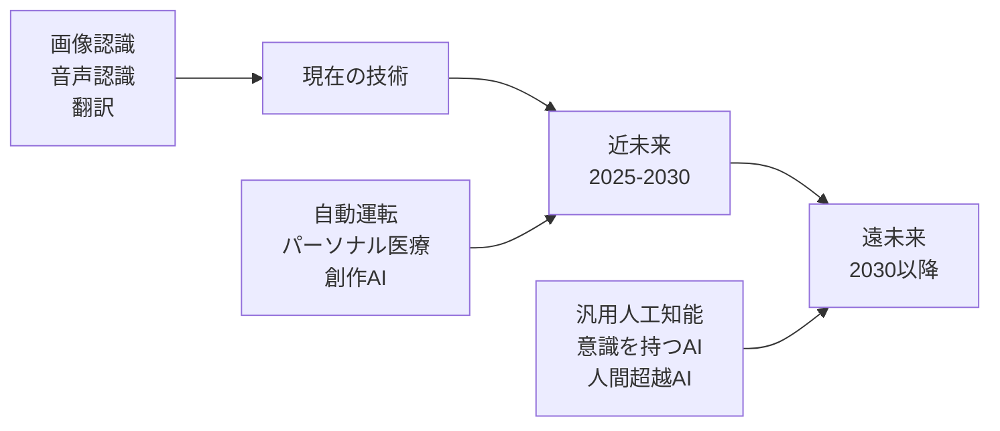

## 🌍 実世界への影響とその後の発展

### 📈 社会への影響度マップ

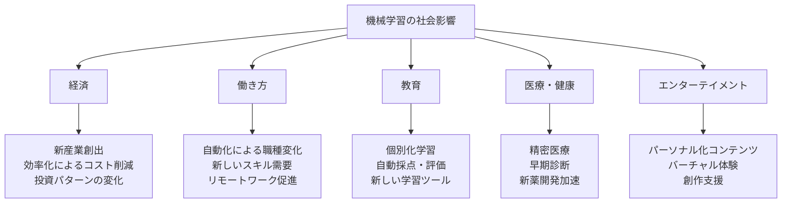

### 🔮 未来展望（2025-2050年）

**短期（2025-2030年）**：
- 自動運転車の普及
- パーソナル化医療の実現
- 創作活動のAI支援が当たり前に

**中期（2030-2040年）**：
- 汎用人工知能（AGI）の登場
- ほとんどの知的作業がAI化
- 人間とAIの協働が標準に

**長期（2040-2050年）**：
- 人間の能力を超えるAI（ASI）の可能性
- 社会システムの根本的変革
- 新しい人間の役割の定義

### 🚧 解決すべき課題

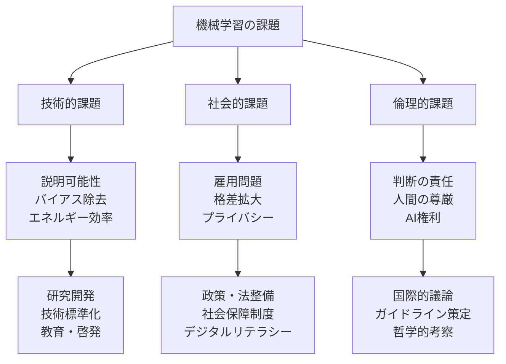

---

## 🎯 学習ロードマップ

### 初学者向け推奨学習順序

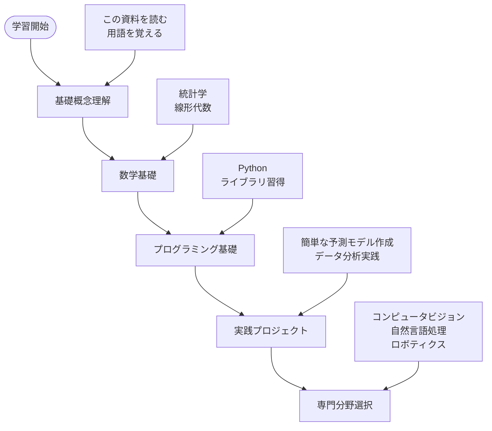

---

## ✨ まとめ

機械学習は、**人間の学習能力をコンピューターに与える革命的な技術**です。

🔑 **重要なポイント**：
- 人間と同じように「経験から学ぶ」仕組み
- データがあれば、様々な問題を解決可能
- すでに私たちの日常に深く浸透している
- 未来の社会を大きく変える可能性を秘めている

🚀 **次のステップ**：
1. 身の回りの機械学習技術を意識してみる
2. 簡単なプログラミングに挑戦してみる
3. データサイエンスの基礎を学んでみる

機械学習の世界は広大で、まだまだ発展し続けています。この資料が、あなたの学習の第一歩となることを願っています！

---

*この資料は継続的に更新される予定です。最新情報については、関連リンクをご確認ください。*
