機械学習について

# 機械学習 - 初学者のための完全ガイド

## 🔍 一言要約
**コンピュータが人間のように経験から学び、賢くなる技術**

## 📚 目次
1. [🌟 はじめに - なぜ機械学習が革命的なのか](#はじめに)
2. [🧠 機械学習の本質 - コンピュータの「学習」とは](#機械学習の本質)
3. [🏗️ 基本構造 - 学習システムの仕組み](#基本構造)
4. [⚡ 3つの主要学習方法](#主要学習方法)
5. [📜 誕生秘話 - 人工知能の夢から現実へ](#誕生秘話)
6. [🎨 アルゴリズムの種類と特徴](#アルゴリズムの種類)
7. [💡 メリットとデメリット](#メリットとデメリット)
8. [🚀 身近な応用例と実用化](#応用例)
9. [🌍 世界への影響と未来展望](#世界への影響)

---

## 🌟 はじめに - なぜ機械学習が革命的なのか {#はじめに}

想像してみてください。赤ちゃんが歩き方を覚える過程を。最初はバランスを崩して転んでしまいますが、何度も繰り返すうちに上手に歩けるようになります。

**機械学習**とは、まさにこの「経験から学ぶ」プロセスをコンピュータで再現する技術です。従来のプログラムは「こうしたら、ああしろ」という明確な指示が必要でしたが、機械学習では「たくさんの例を見せて、パターンを自分で発見させる」のです。

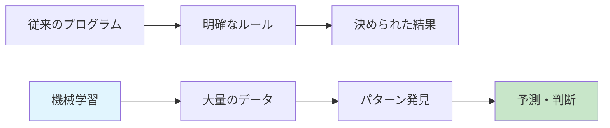

---

## 🧠 機械学習の本質 - コンピュータの「学習」とは {#機械学習の本質}

人間の学習とコンピュータの学習は、実は驚くほど似ています。

### 人間の学習プロセス
1. **経験** → たくさんの猫を見る
2. **パターン認識** → 「耳が三角」「ひげがある」「鳴き声はニャー」
3. **一般化** → 新しい動物を見ても「これは猫だ」と判断できる

### コンピュータの学習プロセス
1. **データ入力** → 何千枚もの猫の画像
2. **特徴抽出** → ピクセルパターン、形状、色の組み合わせを分析
3. **モデル構築** → 新しい画像でも猫を識別できる「判断基準」を作成

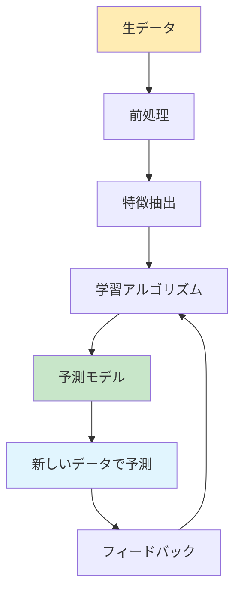

---

## 🏗️ 基本構造 - 学習システムの仕組み {#基本構造}

機械学習システムは、料理のレシピ作りに例えることができます。

### 機械学習の基本要素

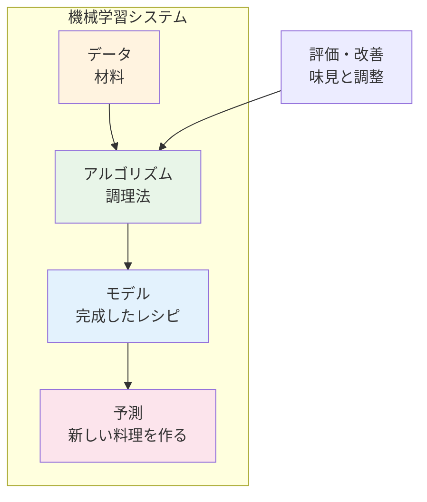

1. **データ（材料）**: 学習に使用する情報
2. **アルゴリズム（調理法）**: データからパターンを見つける方法
3. **モデル（完成レシピ）**: 学習結果として得られる判断基準
4. **予測（新しい料理）**: 未知のデータに対する判断や予測

---

## ⚡ 3つの主要学習方法 {#主要学習方法}

機械学習には、学習スタイルによって3つの主要な方法があります。

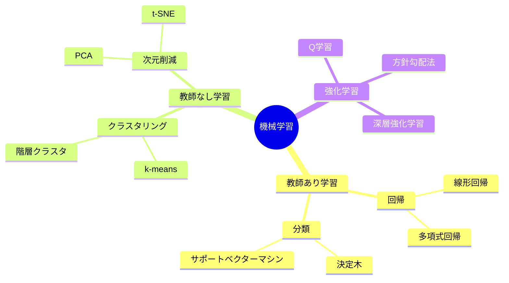

### 🎓 教師あり学習（Supervised Learning）
**例**: 家庭教師と一緒に勉強
- **正解付きの問題集**で学習
- 「この画像は猫、この画像は犬」と教えてもらう
- **用途**: 画像認識、株価予測、医療診断

### 🔍 教師なし学習（Unsupervised Learning）
**例**: 図書館で自分で規則性を発見
- **正解のないデータ**から隠れたパターンを発見
- 顧客の購買データから「似たような買い物をするグループ」を見つける
- **用途**: 顧客セグメント分析、異常検知

### 🎮 強化学習（Reinforcement Learning）
**例**: ゲームで試行錯誤しながら上達
- **報酬とペナルティ**を通じて最適な行動を学習
- AlphaGoが囲碁で人間を上回ったのもこの方法
- **用途**: ゲームAI、自動運転、ロボット制御

---

## 📜 誕生秘話 - 人工知能の夢から現実へ {#誕生秘話}

機械学習の歴史は、人類の「賢い機械を作りたい」という夢から始まりました。

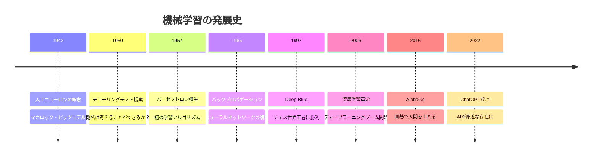

### 重要な転機
1. **1940年代**: 脳の仕組みを数学で表現する試み
2. **1980年代**: 「AIの冬」を経て実用的アルゴリズムが登場
3. **2000年代**: インターネットによる大量データの蓄積
4. **2010年代**: GPU技術の発展で計算能力が飛躍的向上
5. **2020年代**: 生成AIの登場で一般社会への普及が加速

---

## 🎨 アルゴリズムの種類と特徴 {#アルゴリズムの種類}

機械学習のアルゴリズムは、それぞれ得意分野が異なります。適材適所で使い分けることが重要です。

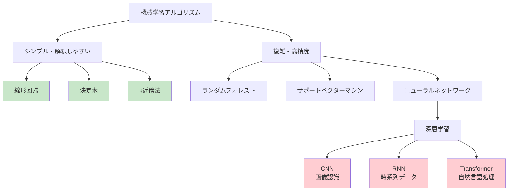

### 📊 アルゴリズム比較表

| アルゴリズム | 得意分野 | 精度 | 解釈性 | 計算時間 | 具体例 |
|--------------|----------|------|---------|----------|--------|
| 線形回帰 | 数値予測 | ⭐⭐⭐ | ⭐⭐⭐⭐⭐ | ⭐⭐⭐⭐⭐ | 家賃予測 |
| 決定木 | 分類・解釈 | ⭐⭐⭐ | ⭐⭐⭐⭐⭐ | ⭐⭐⭐⭐ | ローン審査 |
| ランダムフォレスト | 汎用性高 | ⭐⭐⭐⭐ | ⭐⭐⭐ | ⭐⭐⭐ | 顧客分析 |
| SVM | 分類精度 | ⭐⭐⭐⭐ | ⭐⭐ | ⭐⭐ | スパム検出 |
| 深層学習 | 画像・音声 | ⭐⭐⭐⭐⭐ | ⭐ | ⭐ | 画像認識 |

---

## 💡 メリットとデメリット {#メリットとデメリット}

### ✅ メリット

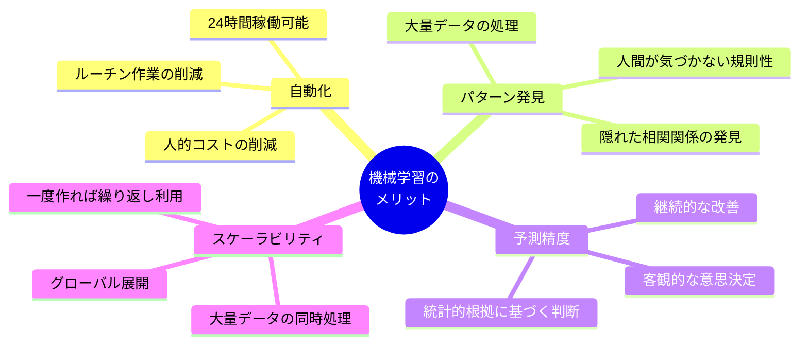

1. **自動化による効率化**: 人間の作業時間を大幅短縮
2. **パターン発見力**: 人間では見逃す複雑な関係性を発見
3. **継続的改善**: データが増えるほど賢くなる
4. **客観性**: 感情に左右されない判断

### ⚠️ デメリット・課題

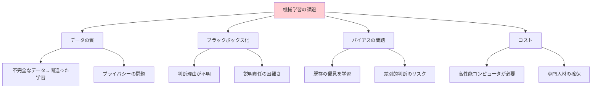

1. **データ依存**: 質の悪いデータでは良い結果が得られない
2. **ブラックボックス問題**: なぜその判断をしたか説明できない場合がある
3. **バイアスの継承**: 人間の偏見をそのまま学習してしまう
4. **導入・維持コスト**: 初期投資と継続的な改善が必要

---

## 🚀 身近な応用例と実用化 {#応用例}

機械学習は、実は私たちの日常生活の至る所で活躍しています。

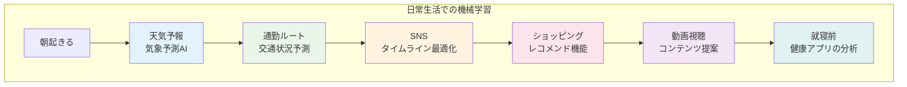

### 🏭 業界別活用例

| 業界 | 活用例 | 効果 |
|------|--------|------|
| **医療** | MRI画像診断、創薬支援 | 診断精度向上、治療期間短縮 |
| **金融** | 不正検知、信用評価 | リスク軽減、審査時間短縮 |
| **製造** | 品質検査、予知保全 | 不良品削減、ダウンタイム減少 |
| **交通** | 自動運転、渋滞予測 | 事故削減、移動時間最適化 |
| **エンタメ** | コンテンツ推薦、ゲームAI | ユーザー満足度向上 |
| **農業** | 作物診断、収穫予測 | 収量増加、資源効率化 |

### 🔮 近未来の応用例

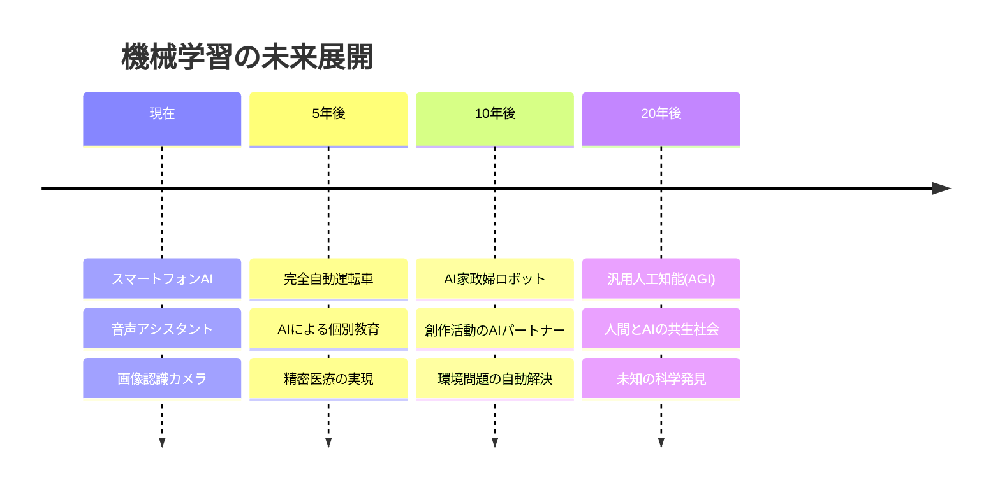

---

## 🌍 世界への影響と未来展望 {#世界への影響}

機械学習は単なる技術革新を超え、人類社会全体に深刻な変革をもたらしています。

### 📈 社会変革の影響度

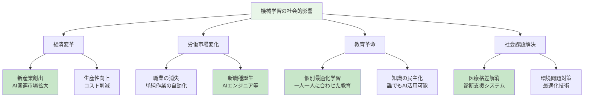

### 🚧 課題と対策

**主要な懸念事項**
1. **雇用への影響**: 一部職業の自動化による失業
2. **プライバシー問題**: 個人データの大量収集・利用
3. **倫理的判断**: AI の決定に対する責任の所在
4. **技術格差**: AI を活用できる人・組織とできない人・組織の差

**対策の方向性**
- 教育制度の改革（AI リテラシー向上）
- 法的枠組みの整備（AI倫理ガイドライン）
- セーフティネットの充実（職業訓練支援）
- 国際協調の推進（グローバルルール策定）

### 🌟 期待される未来像

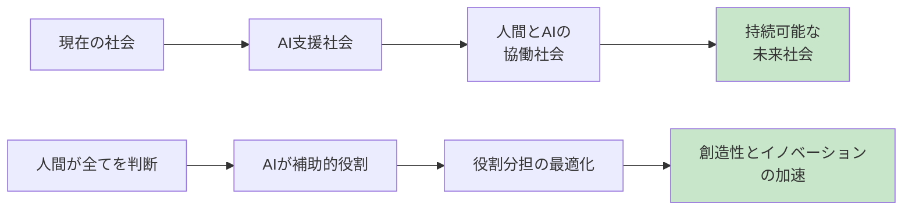

機械学習は、人間の能力を置き換えるのではなく、**人間の可能性を拡張する技術**として発展していくことが期待されています。

---

## 🎓 学習のネクストステップ

機械学習について理解が深まったら、以下のステップで実践的な学習を始めてみましょう：

1. **プログラミング基礎** → Python の基本文法を学習
2. **数学基礎** → 統計学・線形代数の基本概念
3. **実践演習** → Kaggle等の競技プラットフォームに参加
4. **専門分野** → 興味のある領域（画像認識、自然言語処理等）を深堀り

機械学習は、私たちの未来を形作る重要な技術です。この知識を出発点として、ぜひ実際に体験してみてください！

---
