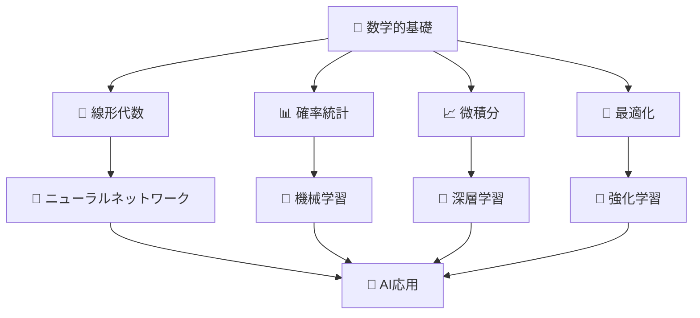
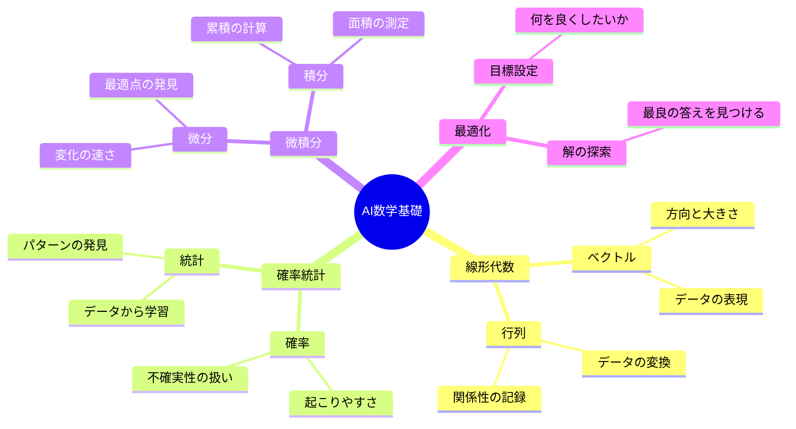
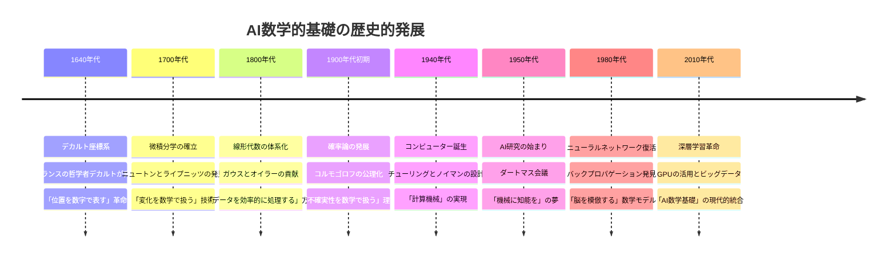
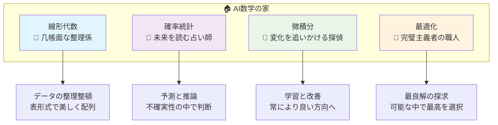
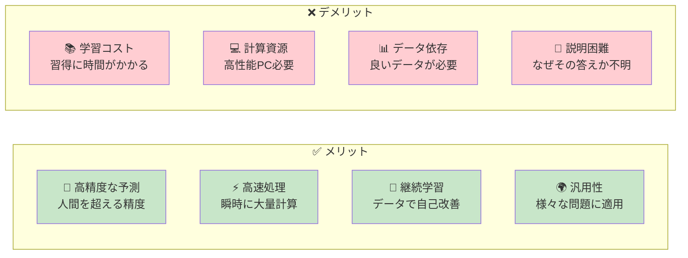
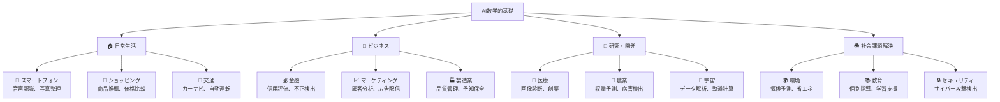
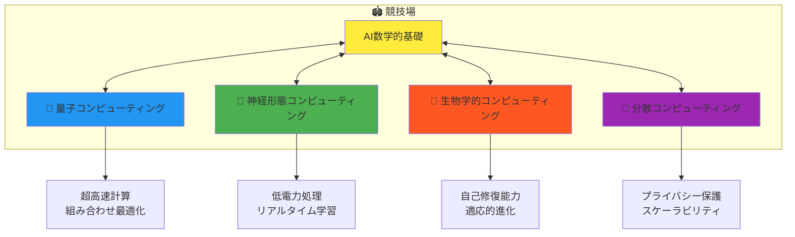
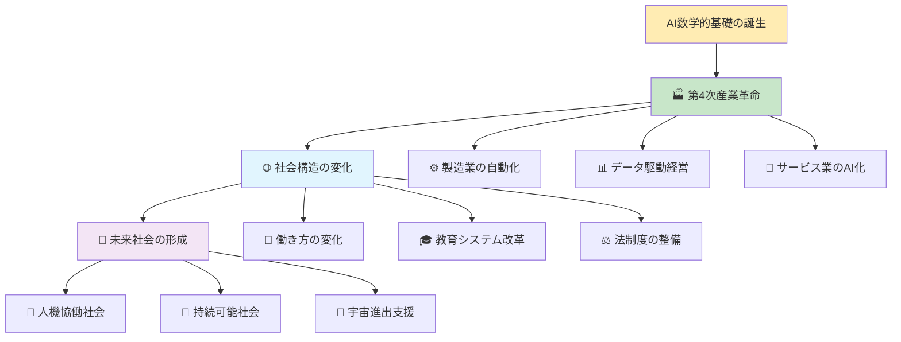

人工知能（AI）における数学的基礎（mathematical foundations）について

# AI数学的基礎 - 初学者のための完全ガイド

## 🔍 一言要約
コンピューターが人間のように考えるための「算数のルール」を学ぶ道しるべ

## 📚 目次
1. [🌟 はじめに](#-はじめに)
2. [🏗️ 基本構造](#️-基本構造)
3. [⚡ 主要数学分野](#-主要数学分野)
4. [📜 時代背景と発見に至った経緯](#-時代背景と発見に至った経緯)
5. [🎨 数学分野の種類と特徴](#-数学分野の種類と特徴)
6. [📗 関連する用語](#-関連する用語)
7. [💡 メリットとデメリット](#-メリットとデメリット)
8. [🚀 応用と実例](#-応用と実例)
9. [🔄 置換、変遷](#-置換変遷)
10. [⚔️ 代替、競合](#️-代替競合)
11. [🌍 実世界への影響とその後の発展](#-実世界への影響とその後の発展)

## 🌟 はじめに

人工知能（AI）って、まるで魔法のようですよね。でも実は、その裏側には「数学」という強力な土台があります。

例えば、あなたがスマートフォンの写真アプリで「犬」と検索すると、何千枚もの写真から犬の写真だけが出てきます。これは偶然ではありません。コンピューターが**数学的な計算**を使って、写真の中の模様や形を分析し、「これは犬だ！」と判断しているのです。

AI数学的基礎とは、この「コンピューターが賢くなるための算数のルール」を体系的に学ぶ分野です。料理のレシピのように、決まった手順と材料（数学的概念）を組み合わせることで、コンピューターに知恵を授けることができるのです。

## 🏗️ 基本構造

AI数学的基礎は、まるで**知恵の建築物**のような構造をしています：



この構造を家の建築に例えると：
- **基礎工事**：数学的基礎（土台となる考え方）
- **柱と梁**：各数学分野（建物を支える主要構造）
- **内装**：AI技術（実際に使える機能）
- **完成した家**：AI応用（私たちが体験するサービス）

## ⚡ 主要数学分野

AI数学的基礎は、4つの「魔法の道具」から構成されています：



### 🔢 線形代数：データの整理術
**日常例**：エクセルの表のようなもの
- 大量のデータを整理整頓する方法
- 例：1000人の身長・体重データを効率的に処理

### 📊 確率統計：未来予測の技術
**日常例**：天気予報のようなもの
- 「明日雨が降る確率は30%」という予測を数学的に計算
- 過去のデータから未来を推測する方法

### 📈 微積分：変化を捉える技術
**日常例**：車のスピードメーターのようなもの
- 「今、どのくらいの速さで変化しているか」を測る
- AIが学習する過程で「どう改善すればいいか」を知る方法

### 🎯 最適化：最良の答えを見つける技術
**日常例**：カーナビの最短ルート検索のようなもの
- 無数の選択肢から「一番良い答え」を見つける
- AIが自分で「正解」を探し出す方法

## 📜 時代背景と発見に至った経緯

AI数学的基礎の物語は、まるで冒険小説のように波乱万丈です：



**物語の核心**：
18世紀の数学者たちは、まさか自分たちが考えた「数の遊び」が、21世紀にコンピューターに知恵を授ける鍵になるとは夢にも思わなかったでしょう。しかし、300年の時を経て、これらの数学的発見が現代AIの心臓部となったのです。

## 🎨 数学分野の種類と特徴

AI数学的基礎における各分野は、それぞれ独特な「個性」を持っています：



| 分野 | 性格 | 得意なこと | 苦手なこと | 実用例 |
|------|------|------------|------------|--------|
| **線形代数** | 几帳面・整理好き | 大量データの効率処理 | 非線形な複雑な関係 | 画像認識、推薦システム |
| **確率統計** | 慎重・分析的 | 不確実性の定量化 | 完全に新しい状況 | スパム検出、医療診断 |
| **微積分** | 敏感・変化に敏感 | 最適化、学習過程 | 離散的な問題 | ニューラルネットワーク訓練 |
| **最適化** | 完璧主義・目標志向 | 最良解の発見 | 計算時間の制約 | 自動運転、ゲームAI |

## 📗 関連する用語

### 🔤 同義語・類義語
- **AI数学的基礎** ≈ 機械学習数学、人工知能数学、データサイエンス数学
- **アルゴリズム** ≈ 計算手順、処理方法、解法
- **モデル** ≈ 数式、関数、予測器

### ⚖️ 対義語・反対概念
- **決定論的** ⇔ **確率的**（結果が決まっている vs 運の要素がある）
- **線形** ⇔ **非線形**（単純な比例関係 vs 複雑な関係）
- **教師あり学習** ⇔ **教師なし学習**（答えを教える vs 自分で発見）

### 🌈 多義語の使い分け
- **「学習」**: 
  - 人間の学習：知識を身につける
  - AI学習：データからパターンを発見する計算処理
- **「ネットワーク」**:
  - 社会ネットワーク：人のつながり
  - ニューラルネットワーク：脳を模倣した計算モデル

## 💡 メリットとデメリット



### ✨ 主要なメリット
1. **超人的な能力**：人間では不可能な速度と精度での計算
2. **24時間稼働**：疲れることなく継続的な作業が可能
3. **客観的判断**：感情に左右されない一貫した判断
4. **スケーラビリティ**：一度作れば無限にコピー可能

### ⚠️ 主要なデメリット
1. **ブラックボックス問題**：なぜその判断をしたか説明が困難
2. **データ品質依存**：偏ったデータで偏った結果
3. **創造性の限界**：既存パターンの組み合わせに依存
4. **倫理的課題**：プライバシーや雇用への影響

## 🚀 応用と実例

AI数学的基礎は、私たちの生活のあらゆる場面で活用されています：



### 🎯 具体的な成功事例

**1. 医療診断AIの革命**
- **問題**：レントゲン写真から病気を見つけるのに医師の熟練技術が必要
- **数学的解決**：畳み込みニューラルネットワーク（CNN）で画像パターンを学習
- **結果**：放射線科医と同等以上の診断精度を実現

**2. 翻訳サービスの進化**
- **問題**：言語の壁による国際コミュニケーションの困難
- **数学的解決**：トランスフォーマーモデルで文章の意味を数値化
- **結果**：リアルタイムで自然な翻訳が可能

**3. 金融不正検出システム**
- **問題**：クレジットカード不正利用の早期発見
- **数学的解決**：異常検知アルゴリズムで正常パターンからの逸脱を検出
- **結果**：不正利用を数秒以内で検出し、被害を最小化

## 🔄 置換、変遷

AI数学的基礎の発展は、まさに「知的革命」の連続でした：

```mermaid
sankey-beta
    統計学,AI数学基礎,30
    線形代数,AI数学基礎,25
    微積分学,AI数学基礎,20
    最適化理論,AI数学基礎,15
    情報理論,AI数学基礎,10
    
    AI数学基礎,機械学習,40
    AI数学基礎,深層学習,35
    AI数学基礎,強化学習,15
    AI数学基礎,量子AI,10
```

### 🏛️ 何を置き換えたか
- **手作業による計算** → **自動化された数値処理**
- **経験と勘による判断** → **データ駆動型意思決定**
- **専門家の直感** → **数学的最適化**

### 🔮 何に置き換えられる可能性があるか
- **従来のAI数学** → **量子コンピューティング数学**
- **中央集権的計算** → **分散・連合学習**
- **決定論的モデル** → **因果推論モデル**

### 🧬 何を継承したか
- **古典数学の厳密性**：証明と論理的推論
- **統計学の不確実性処理**：確率的思考
- **物理学の最適化思想**：最小作用原理

### 🌱 何に継承されるか
- **量子機械学習**：量子力学と機械学習の融合
- **神経形態学的コンピューティング**：脳の構造を模倣したハードウェア
- **因果AI**：原因と結果の関係を理解するAI

## ⚔️ 代替、競合

AI数学的基礎をめぐる「技術戦争」の現状：



### 🆚 主要な競合関係

**AI数学的基礎 vs 量子コンピューティング**
- **AI数学**：現在主流、豊富な実績
- **量子**：理論上は圧倒的高速、まだ実験段階
- **勝負の行方**：融合による共存が有力

**AI数学的基礎 vs 生物学的コンピューティング**
- **AI数学**：論理的、予測可能
- **生物学的**：適応的、創発的
- **勝負の行方**：用途に応じた使い分け

### 🤝 代替可能性の分析
現在のAI数学的基礎は、完全に代替されるよりも、他の技術と**融合**して進化する方向に向かっています。それぞれの技術が得意分野を持ち、補完し合う関係を築いています。

## 🌍 実世界への影響とその後の発展

AI数学的基礎がもたらした変化は、人類史上最大級の技術革命の一つです：



### 🌟 現在進行中の影響

**経済面での変革**
- **GDP成長**: AI関連産業が世界経済を牽引
- **雇用構造**: 単純作業から創造的作業へのシフト
- **新産業創出**: データサイエンス、AIエンジニアリングなど

**社会面での変革**
- **教育**: プログラミング・数学教育の重要性増大
- **医療**: 個別化医療、予防医学の実現
- **交通**: 自動運転による交通事故削減

**文化面での変革**
- **芸術**: AIアートの登場、新しい創造性
- **エンターテインメント**: 個人向けカスタマイズサービス
- **コミュニケーション**: 言語の壁の消滅

### 🔭 未来への展望（2025-2035年）

**技術的発展予測**
1. **量子-古典ハイブリッドAI**: 2028年頃に実用化開始
2. **脳-コンピュータインタフェース**: 2030年頃に医療応用
3. **汎用人工知能(AGI)**: 2035年頃に実現の可能性

**社会的変化予測**
1. **AI憲法の制定**: AI権利と人間の権利の明文化
2. **ベーシックインカム導入**: AI効率化による富の再分配
3. **教育革命**: 個別最適化された学習システム

### 🎯 長期的ビジョン（2050年以降）

AI数学的基礎は、人類の知的活動を根本的に拡張し、**「第二の認知革命」**を引き起こすと予測されています。数学という普遍言語を通じて、人間とAIが真のパートナーシップを築き、宇宙規模の課題解決に取り組む時代が到来するでしょう。

---


この資料により、初学者でもAI数学的基礎の全体像を把握し、次に何を学ぶべきかが明確になることを目指しました。数学の美しさとAIの可能性を同時に感じていただければ幸いです！
