自然言語処理（NLP）

# 自然言語処理（NLP）- 初学者のための完全ガイド

## 🔍 一言要約
コンピュータに人間の言葉を理解・生成させる魔法のような技術

## 📚 目次

1. [🌟 はじめに](#-はじめに)
2. [🏗️ 基本構造](#️-基本構造)
3. [⚡ 主要技術](#-主要技術)
4. [📜 時代背景と発見に至った経緯](#-時代背景と発見に至った経緯)
5. [🎨 種類と特徴](#-種類と特徴)
6. [📗 関連する用語](#-関連する用語)
7. [💡 メリットとデメリット](#-メリットとデメリット)
8. [🚀 応用技術と実用化の例](#-応用技術と実用化の例)
9. [🌍 実世界への影響とその後の発展](#-実世界への影響とその後の発展)

## 🌟 はじめに

想像してみてください。あなたが外国を旅行中に、言葉の通じない相手と会話をしなければならない状況を。そんな時、リアルタイムで翻訳してくれる装置があったら...？

実は、これがまさに**自然言語処理（NLP：Natural Language Processing）**の世界なのです！

NLPとは、私たち人間が日常的に使っている「自然な言葉」（日本語、英語、中国語など）を、コンピュータが理解し、操作し、生成できるようにする技術の総称です。

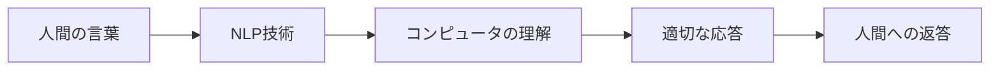

なぜこの技術が重要なのでしょうか？私たちの生活を考えてみると：

- **スマホの音声アシスタント**（Siri、Google Assistant）
- **翻訳アプリ**（Google翻訳、DeepL）
- **検索エンジン**（Google、Bing）
- **SNSの自動投稿フィルタ**
- **チャットボット**によるカスタマーサポート

これらすべてにNLP技術が使われています！

## 🏗️ 基本構造

NLPの処理は、まるで料理のレシピのように段階的に進行します：

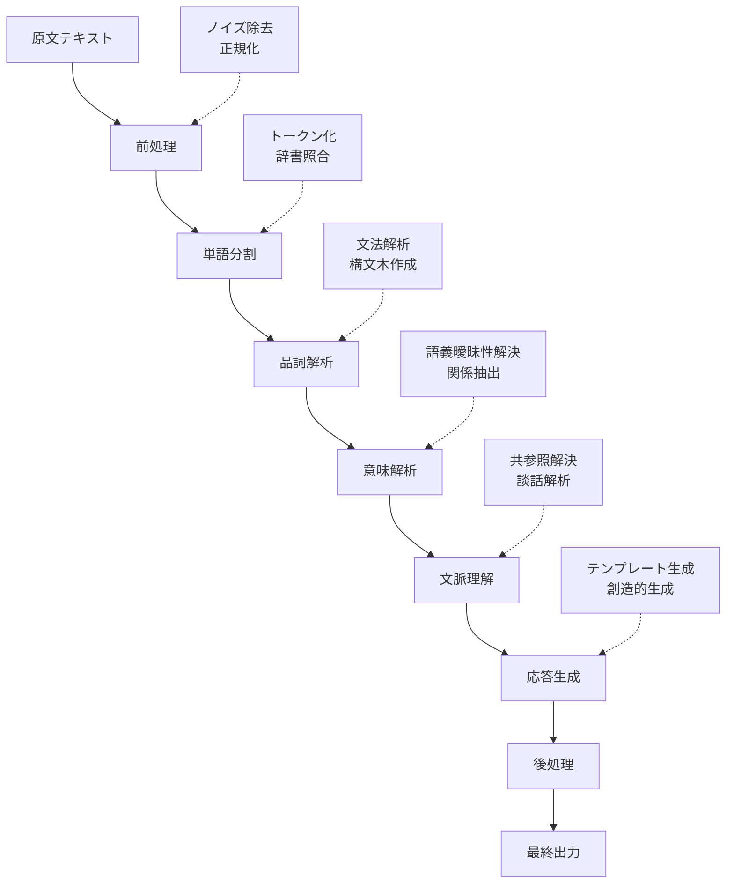

### 各段階の役割（日常例で理解）

1. **前処理**：料理前の材料の下準備（余分な皮を剥く、洗う）
2. **単語分割**：文章を単語ごとに切り分ける（野菜を一口サイズに切る）
3. **品詞解析**：各単語の役割を特定（調味料、メイン食材、薬味を分ける）
4. **意味解析**：単語の意味を理解（「辛い」が「spicy」か「painful」かを判断）
5. **文脈理解**：前後の関係を把握（前の会話の流れを踏まえる）
6. **応答生成**：適切な返答を作成（相手に合わせた言葉選び）

## ⚡ 主要技術

NLPの世界には、様々な「道具」があります。それぞれに特徴と得意分野があります：

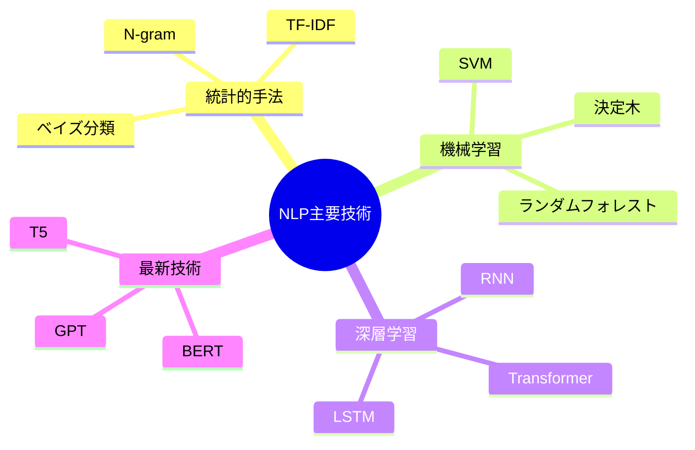

### 🎯 技術の発展段階

| 時代 | 主要技術 | 特徴 | 身近な例 |
|------|----------|------|----------|
| 1950s-1980s | ルールベース | 人間が規則を手作りで定義 | 初期の文法チェッカー |
| 1990s-2000s | 統計的手法 | データから確率的に学習 | スパムフィルター |
| 2000s-2010s | 機械学習 | より柔軟な学習能力 | 音声認識システム |
| 2010s-現在 | 深層学習 | 人間レベルの理解力 | ChatGPT、Google翻訳 |

### 🧠 深層学習の革命

特に2017年に登場した**Transformer**という技術は、NLPの世界を一変させました：

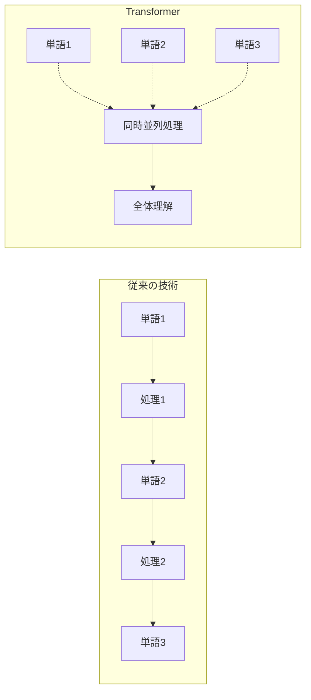

## 📜 時代背景と発見に至った経緯

### 🚀 NLPの壮大な歴史物語

#### 第一章：夢の始まり（1950年代）

1950年、天才数学者**アラン・チューリング**が「チューリングテスト」を提案しました。これは「機械が人間と区別がつかないほど自然に会話できるか？」という挑戦状でした。

同じ頃、**ジョージタウン大学**とIBMが共同で、世界初の機械翻訳実験を実施。わずか60のロシア語文を英語に翻訳しただけでしたが、世界中が熱狂しました！

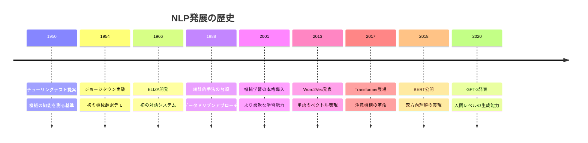

#### 第二章：挫折と再起（1960-1980年代）

最初の熱狂の後、研究者たちは現実の壁にぶつかりました。言葉には**文脈**や**曖昧性**があることを発見したのです。

例えば：
- 「彼女は銀行に向かった」
  - 金融機関の銀行？川の土手（bank）？
- 「昨日の会議は重かった」
  - 物理的に重い？内容が深刻？

この時期は「AIの冬」と呼ばれ、多くの研究が停滞しました。

#### 第三章：統計の力（1990年代）

1990年代、研究者たちは新しいアプローチを発見しました：**大量のデータから統計的に学習する**方法です。

IBMの研究チームが開発した統計的機械翻訳システムは、従来の手作りルールを大きく上回る性能を示しました。

#### 第四章：深層学習の奇跡（2010年代〜）

2010年代に入ると、**深層学習**という新しい技術が登場。特に2017年のTransformerの発明は、まさに「革命」でした。

そして2020年、OpenAIが発表した**GPT-3**は、1750億個のパラメータを持つ巨大なモデルで、人間と見分けがつかないレベルの文章を生成できるようになりました。

## 🎨 種類と特徴

NLPには様々な「専門分野」があります。それぞれが異なる役割を持っています：

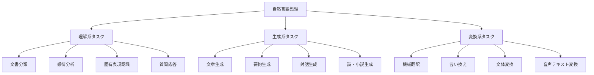

### 📊 タスク別特徴比較

| カテゴリ | タスク | 難易度 | 身近な応用例 |
|----------|--------|---------|--------------|
| **理解系** | 感情分析 | ⭐⭐⭐ | SNS投稿の感情判定 |
| | 質問応答 | ⭐⭐⭐⭐ | Siri、Alexa |
| | 固有表現認識 | ⭐⭐⭐⭐ | 人名・地名の抽出 |
| **生成系** | 文章生成 | ⭐⭐⭐⭐⭐ | ChatGPT |
| | 要約生成 | ⭐⭐⭐⭐ | ニュース記事要約 |
| | 対話生成 | ⭐⭐⭐⭐⭐ | チャットボット |
| **変換系** | 機械翻訳 | ⭐⭐⭐⭐ | Google翻訳 |
| | 音声認識 | ⭐⭐⭐⭐ | 音声入力 |

### 🎯 処理レベル別分類

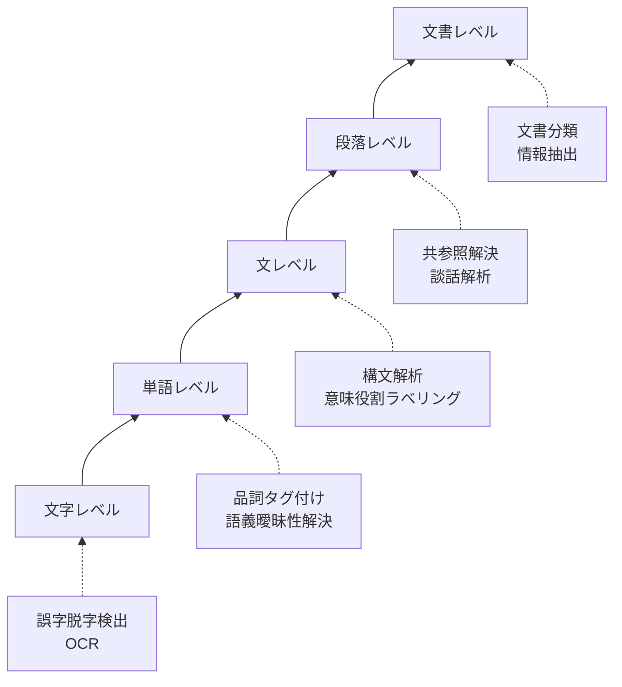

## 📗 関連する用語

NLPの世界には、似ているようで微妙に異なる用語がたくさんあります：

### 🔤 基本用語の整理

| 日本語 | 英語 | 簡単な説明 | 身近な例 |
|--------|------|------------|----------|
| **自然言語処理** | Natural Language Processing (NLP) | 人間の言葉をコンピュータが扱う技術全般 | 音声アシスタント |
| **計算言語学** | Computational Linguistics | 言語学の知識を計算で実現する学問 | 文法チェッカー |
| **テキストマイニング** | Text Mining | 大量のテキストから有用な情報を発見 | レビュー分析 |
| **情報検索** | Information Retrieval | 必要な情報を効率的に見つける技術 | Google検索 |

### 🤖 AI関連用語との関係

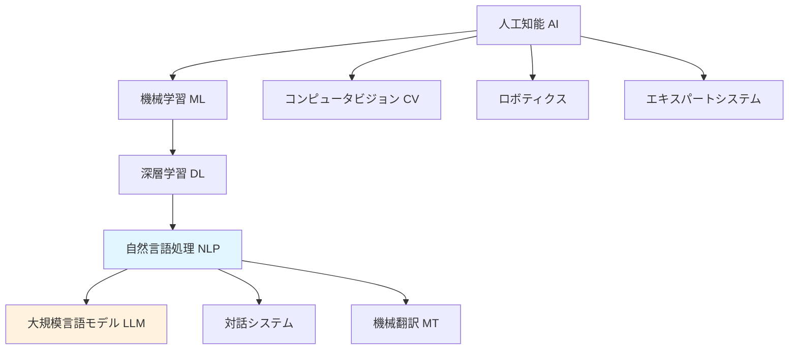

### 🔄 類似概念の比較

**よく混同される概念**：

| 概念 | 焦点 | 目的 | 例 |
|------|------|------|-----|
| **NLP** | 言語理解・生成 | 人間の言葉を処理 | ChatGPT |
| **音声認識** | 音から文字へ | 音声を文字に変換 | 音声入力 |
| **音声合成** | 文字から音へ | 文字を音声に変換 | 読み上げソフト |
| **画像認識** | 画像理解 | 画像の内容を理解 | 写真の自動タグ付け |

### 🏷️ 専門用語解説

**トークン化（Tokenization）**
- 「今日は良い天気です」→「今日」「は」「良い」「天気」「です」
- 文章を意味のある最小単位に分割すること

**エンベディング（Embedding）**
- 単語を数値ベクトルで表現する技術
- 「王様 - 男性 + 女性 = 女王」のような計算が可能

**注意機構（Attention Mechanism）**
- 文章の中で重要な部分に「注意」を向ける仕組み
- 人間が文章を読む時の視線の動きをモデル化

## 💡 メリットとデメリット

### 🌟 メリット：NLPがもたらす恩恵

#### 1. **効率性の革命**
- **24時間365日稼働**：疲れ知らずの言語処理
- **大量処理能力**：人間の何倍ものスピードで文書処理
- **一貫性**：感情に左右されない安定した判断

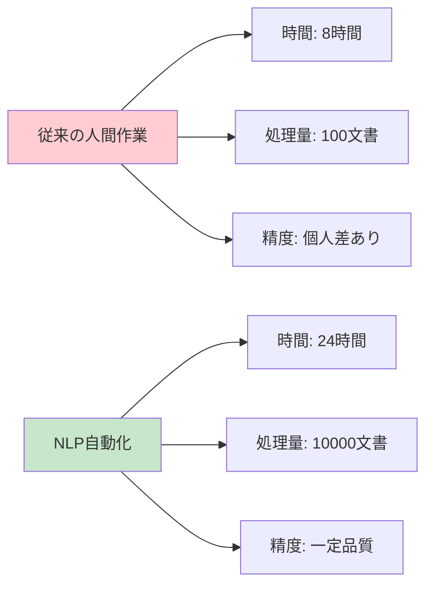

#### 2. **コスト削減**
- 翻訳費用：人間翻訳者の1/10以下
- カスタマーサポート：人件費70%削減
- 文書作成時間：50%短縮

#### 3. **新しい可能性の創出**
- **個人化されたサービス**：一人ひとりに最適化
- **バリアフリー支援**：言語・視聴覚障害者への支援
- **教育革命**：個別指導AIの実現

### ⚠️ デメリット：現在の限界と課題

#### 1. **理解の浅さ**
人間のような深い理解ではなく、パターン認識に依存

**例：文脈の誤解**
- 「昨日のパーティーは爆弾だった」
  - 人間：「とても楽しかった」
  - AI：「危険な爆発物があった」

#### 2. **バイアスと偏見**
学習データに含まれる偏見を学習してしまう

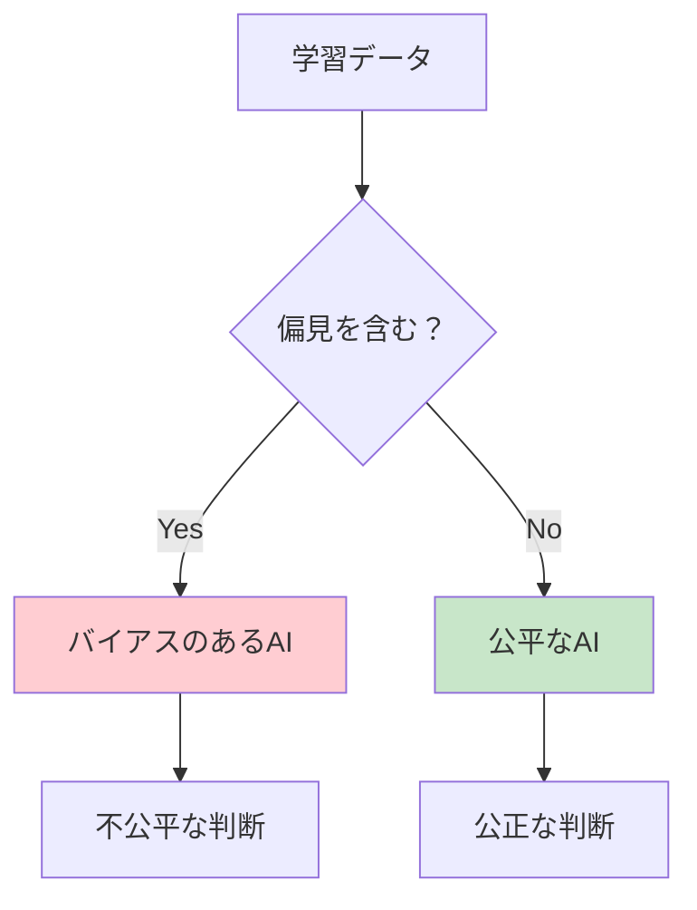

#### 3. **プライバシーの懸念**
- **データ収集**：大量の個人情報が必要
- **分析結果の悪用**：感情分析結果の商業利用
- **監視社会化**：言論の自由への影響

#### 4. **技術的限界**

| 課題 | 現状 | 影響 |
|------|------|------|
| **創造性** | 既存の組み合わせ | 真の革新的アイデアは困難 |
| **常識推論** | データベース依存 | 当たり前のことが理解できない |
| **感情理解** | 表面的な分析 | 人間の微妙な感情は読み取れない |
| **多言語対応** | 主要言語に偏重 | マイナー言語の精度が低い |

## 🚀 応用技術と実用化の例

### 📱 身近なNLP応用例

私たちの日常生活に、NLPは既に深く浸透しています：

```mermaid
graph TD
    subgraph "朝の日課"
        A1[スマホのアラーム] --> A2["Hey Siri, 今日の天気は？"]
        A2 --> A3[音声認識 + 質問応答]
    end
    
    subgraph "通勤中"
        B1[ニュースアプリ] --> B2[記事の自動要約]
        B2 --> B3[感情分析によるレコメンド]
    end
    
    subgraph "仕事中"
        C1[メール作成] --> C2[文法チェック + 提案]
        C2 --> C3[多言語対応の翻訳]
    end
    
    subgraph "帰宅後"
        D1[SNS閲覧] --> D2[スパム・有害投稿フィルタ]
        D2 --> D3[友人の投稿感情分析]
    end
    
    click A3 "/docs/voice-assistant.md" "音声アシスタントの仕組み"
    click B2 "/docs/auto-summarization.md" "自動要約技術"
    click C3 "/docs/translation-api.md" "翻訳APIの活用"
```

### 🏢 業界別活用事例

#### 🏥 医療・ヘルスケア
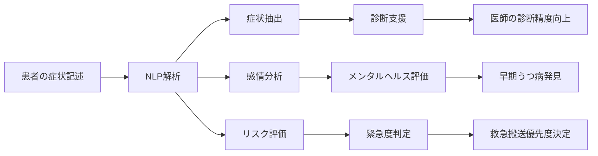

**具体例**：
- **電子カルテ分析**：症状から病名候補を自動提示
- **薬事監査**：副作用報告書の自動分析
- **メンタルヘルス**：SNS投稿から悩み相談者を早期発見

#### 🏛️ 法務・金融
- **契約書分析**：リスク条項の自動検出
- **法律相談チャットボット**：基本的な法律質問への回答
- **金融詐欺検出**：不正なメール・メッセージの識別
- **信用評価**：SNS投稿から人物の信用度を分析

#### 🎓 教育
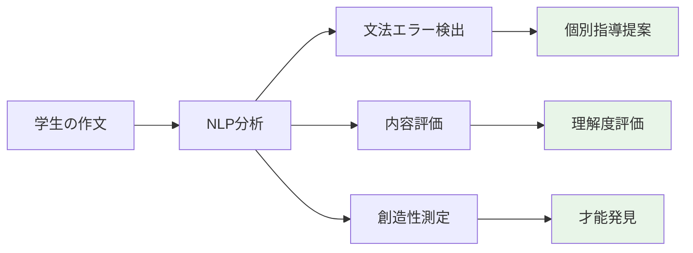

#### 🛒 Eコマース・マーケティング
- **レビュー分析**：商品の評判を自動集計
- **カスタマーサポート**：FAQ自動応答システム
- **パーソナライゼーション**：個人の好みに合わせた商品推薦
- **価格最適化**：市場感情に基づく動的価格設定

### 🔮 最先端の応用研究

#### 🧬 創薬・バイオテクノロジー
- **文献マイニング**：膨大な研究論文から新しい薬の候補を発見
- **分子記述**：化学構造を自然言語で記述・検索
- **臨床試験最適化**：患者記録から最適な被験者選定

#### 🌍 社会課題解決
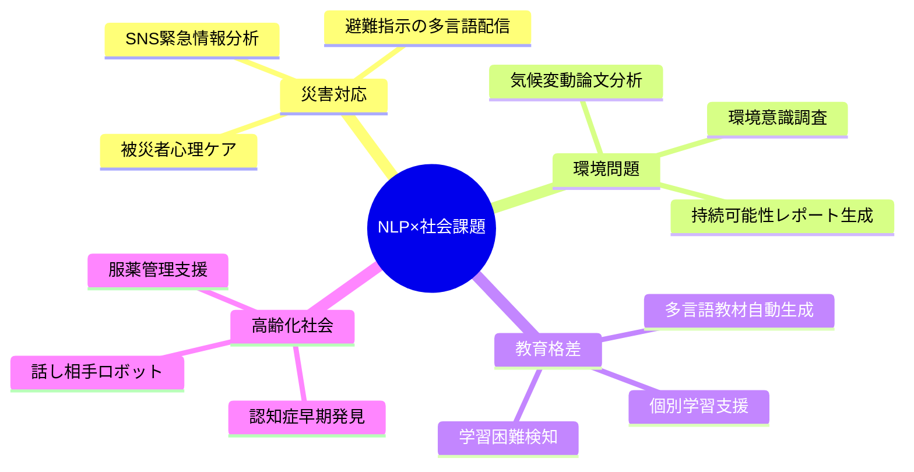

## 🌍 実世界への影響とその後の発展

### 📈 社会への変革的影響

NLPは単なる技術革新を超えて、社会全体を変革しています：

#### 🗣️ コミュニケーションの民主化

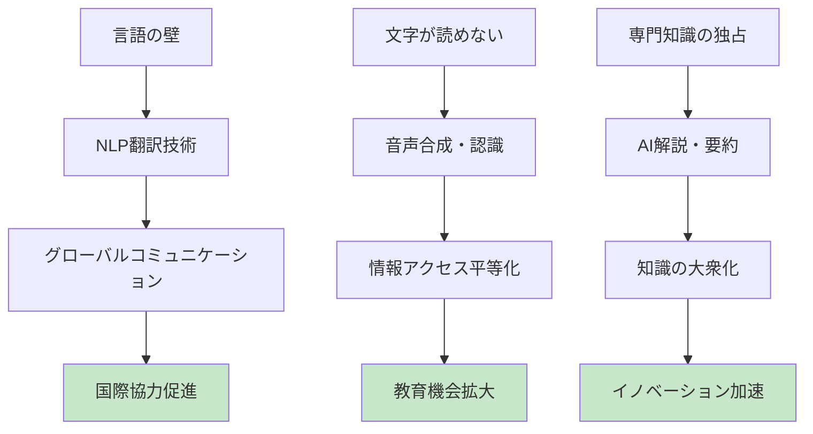

#### 📊 経済への波及効果

**市場規模の急成長**：
- 2020年：150億ドル
- 2025年予測：350億ドル
- 2030年予測：800億ドル

**新職業の創出**：
- NLPエンジニア
- データサイエンティスト
- AI倫理コンサルタント
- 人機協働デザイナー

**既存職業の変化**：

| 職業 | 変化の内容 | 新しい役割 |
|------|------------|------------|
| **翻訳者** | 機械翻訳との協働 | 文化的ニュアンスの調整 |
| **記者** | 記事作成の効率化 | 深い取材・分析に集中 |
| **カスタマーサポート** | 基本対応の自動化 | 複雑な問題解決に特化 |
| **教師** | 個別指導の支援 | 創造性・批判的思考の育成 |

### 🔮 未来の発展予測

### ⚡ 技術的特異点への道筋

