AIの種類のうち、弱いAI（Narrow AI）について
# 弱いAI（Narrow AI）- 初学者のための完全ガイド

## 🔍 一言要約
**特定の作業だけを得意とする、今私たちの身の回りにある実用的なAI**

## 📚 目次
1. [🌟 はじめに - なぜ弱いAIを理解すべきか](#はじめに)
2. [🏗️ 基本構造 - 弱いAIの仕組み](#基本構造)
3. [⚡ 主要技術 - 動作原理を理解しよう](#主要技術)
4. [📜 時代背景と発見に至った経緯](#時代背景)
5. [🎨 種類と特徴 - 様々な弱いAI](#種類と特徴)
6. [📗 関連する用語集](#関連用語)
7. [💡 メリットとデメリット](#メリットデメリット)
8. [🚀 応用技術と実用化の例](#応用技術)
9. [🌍 実世界への影響とその後の発展](#実世界への影響)

## 🌟 はじめに

弱いAI（Narrow AI）とは、**料理の専門家のようなAI**です。一流のシェフが料理は完璧でも、車の運転や楽器演奏は得意でないように、弱いAIは特定の分野だけで人間を超える能力を発揮します。

あなたが毎日使っているスマートフォンの音声認識、YouTubeのおすすめ機能、写真アプリの顔認識。これらすべてが弱いAIなのです。

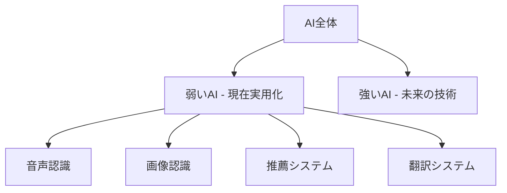

## 🏗️ 基本構造

弱いAIは**専門店のような構造**を持っています。パン屋さんがパンづくりに特化しているように、それぞれの弱いAIは一つの作業に特化して設計されています。

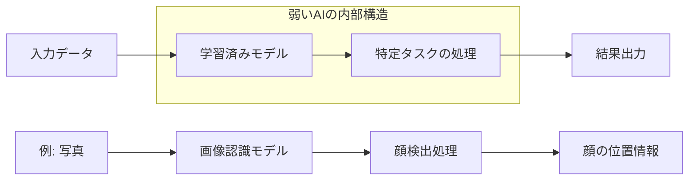

**重要な特徴：**
- **単一目的設計**：一つの仕事だけを完璧に行う
- **専門知識の蓄積**：その分野の大量データで訓練済み
- **即座の判断**：学習済みなので瞬時に結果を出力

## ⚡ 主要技術

弱いAIの動作原理は**パターン認識の達人**として理解できます。

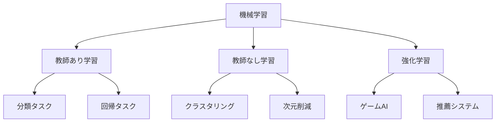

### 学習方法の比喩理解

1. **教師あり学習** = 家庭教師付きの勉強
   - 正解を教えてもらいながら学習
   - 例：スパムメール判定（「これはスパム」と教える）

2. **教師なし学習** = 自主学習
   - データから自分でパターンを発見
   - 例：顧客グループ分析（似た購買傾向を自動発見）

3. **強化学習** = 試行錯誤での上達
   - 結果の良し悪しから学習
   - 例：チェスAI（勝敗から戦略を学習）

## 📜 時代背景と発見に至った経緯

弱いAIの歴史は**職人技の機械化の物語**です。

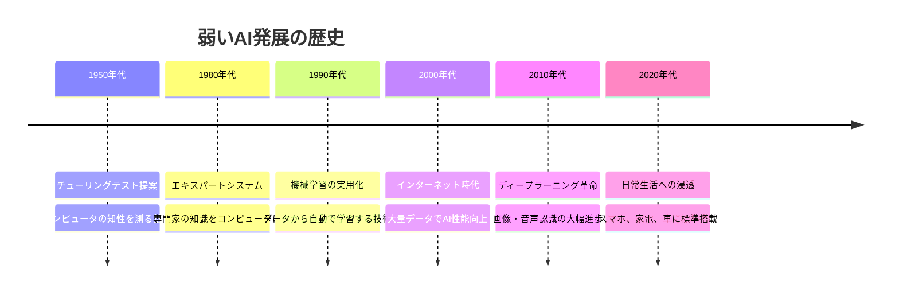

### 発見の転換点

**1990年代の大転換：**
従来の「ルールを教え込む方式」から「データから学習する方式」への転換が、弱いAIの実用化を可能にしました。これは、料理のレシピを一つ一つ覚えさせるのではなく、料理の動画を大量に見せて自分で技術を習得させる方法に似ています。

## 🎨 種類と特徴

弱いAIは**専門職のような多様性**を持っています。

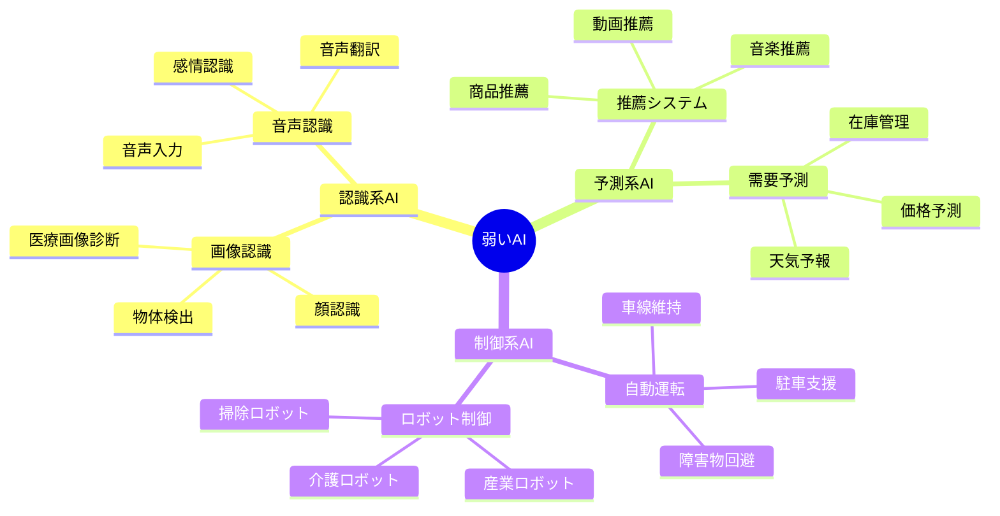

### 特徴比較表

| 種類 | 得意分野 | 身近な例 | 限界 |
|------|----------|----------|------|
| **画像認識AI** | 写真の内容理解 | スマホの顔認証 | 見たことないものは認識困難 |
| **音声認識AI** | 話し言葉の理解 | Siri、Alexa | 方言や雑音に弱い |
| **推薦AI** | 好みの予測 | Netflix、Amazon | 新しい趣味は提案できない |
| **翻訳AI** | 言語の変換 | Google翻訳 | 文脈や文化的ニュアンス理解が困難 |

## 📗 関連する用語集

### 基本用語

**弱いAI（Narrow AI）**
- **同義語**: 特化型AI、限定的AI
- **対義語**: 強いAI（汎用人工知能）
- **英語**: Artificial Narrow Intelligence (ANI)

**機械学習（Machine Learning）**
- **簡単説明**: コンピュータがデータから自動で学習する技術
- **身近な例**: 写真アプリが顔を覚える仕組み

**ディープラーニング（Deep Learning）**
- **簡単説明**: 人間の脳神経を真似した学習方法
- **特徴**: より複雑なパターンを認識可能

### 関連概念の整理

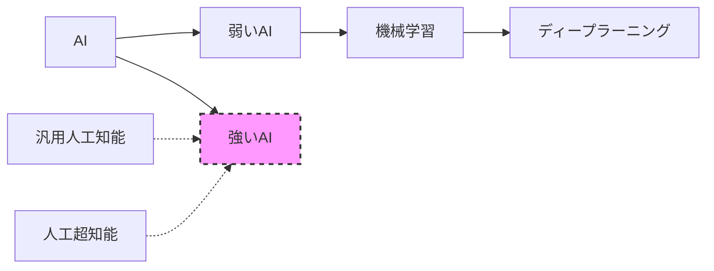

## 💡 メリットとデメリット

### 🌟 メリット（なぜ弱いAIが普及したのか）

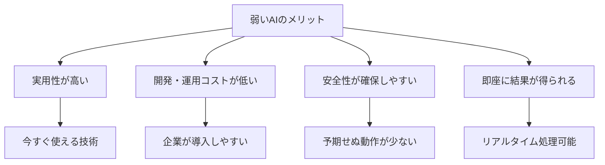

**日常生活での恩恵：**
- **時短効果**: 音声入力で文字打ちが不要
- **精度向上**: 人間より正確な画像診断
- **利便性向上**: 個人に最適化された推薦
- **安全性向上**: 自動運転支援による事故防止

### ⚠️ デメリット（現在の限界）

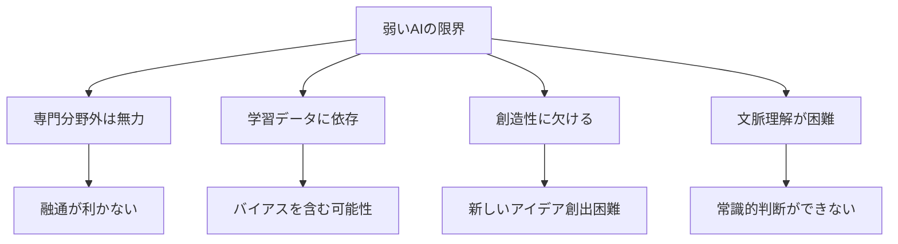

**具体例での理解：**
- 顔認識AIは顔は完璧に識別するが、その人の感情や性格は理解できない
- 翻訳AIは文章は翻訳するが、ジョークや皮肉のニュアンスは理解困難
- 推薦AIは過去の行動は分析するが、人生の転換期は予測できない

## 🚀 応用技術と実用化の例

### 身近な実用例マップ

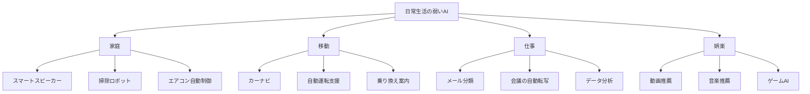

### 産業別応用フロー

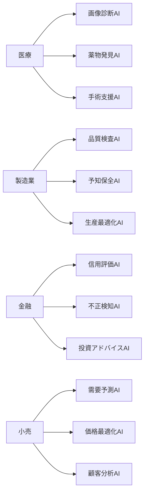

## 🌍 実世界への影響とその後の発展

### 社会への影響度マップ

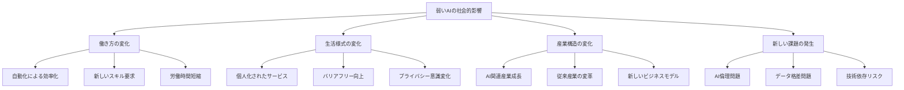

### 未来への発展展望

**短期展望（2025-2030年）：**
- より高精度な専門AI の普及
- 複数の弱いAIの連携システム
- リアルタイム学習機能の向上

**中期展望（2030-2040年）：**
- 弱いAI同士の自動連携
- 個人専用AIアシスタントの実現
- 予測精度の飛躍的向上

**長期展望（2040年以降）：**
- 弱いAIから強いAIへの進化の可能性
- 人間とAIの協働体制確立
- 新たな社会システムの構築

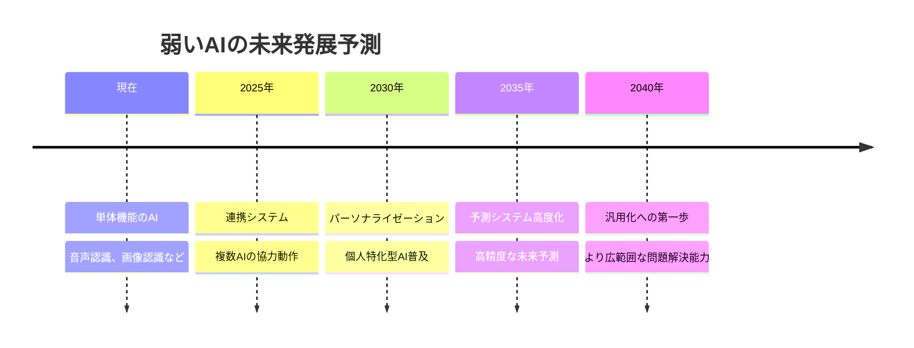

---

## 🎯 学習チェックリスト

弱いAIの理解度をチェックしましょう：

- [ ] 弱いAIと強いAIの違いを説明できる
- [ ] 身の回りの弱いAI を3つ以上挙げられる
- [ ] 機械学習の3つの方法の違いを理解している
- [ ] 弱いAIのメリット・デメリットを説明できる
- [ ] 弱いAIが社会に与える影響を考察できる

---

## 📖 次に学ぶべきトピック

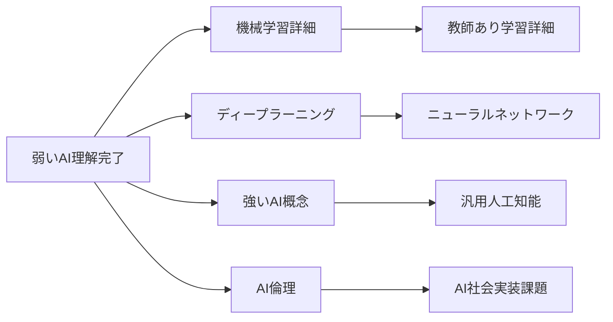

---

**🎊 おめでとうございます！**
あなたは弱いAIの基本から応用まで、包括的な理解を獲得しました。次は上記の関連トピックで学習を深め、AI時代をリードする知識を身につけましょう！
