自然言語処理（NLP：Natural Language Processing）に関連する技術のうち、意図理解（ Natural Language Understanding）とNatural Language Generation (NLG): 自然言語生成 の融合について

# NLU×NLG融合技術 - 初学者のための完全ガイド

## 🔍 一言要約
人間の言葉を理解し、適切な返答を生成する技術の融合

## 📚 目次
1. [はじめに](#-はじめに)
2. [基本構造](#-基本構造)
3. [主要技術](#-主要技術)
4. [時代背景と発見に至った経緯](#-時代背景と発見に至った経緯)
5. [種類と特徴](#-種類と特徴)
6. [関連する用語](#-関連する用語)
7. [メリットとデメリット](#-メリットとデメリット)
8. [応用と実例](#-応用と実例)
9. [置換、変遷](#-置換変遷)
10. [代替、競合](#-代替競合)
11. [実世界への影響とその後の発展](#-実世界への影響とその後の発展)

## 🌟 はじめに

レストランで「何か温かいものが食べたい」と言ったとき、店員さんは「ラーメンはいかがですか？」と提案してくれます。この一連の流れ—あなたの希望を理解し、適切な提案を言葉にする—がNLUとNLGの融合です。

**NLU（意図理解）**は人間の言葉の裏にある「本当の意味」を読み取る技術。**NLG（自然言語生成）**はコンピュータが人間らしい文章を作り出す技術。この2つが組み合わさることで、AIは私たちと自然に会話できるようになります。

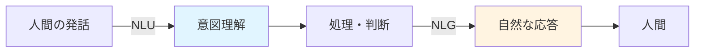
```mermaid
graph LR
    A[人間の発話] -->|NLU| B[意図理解]
    B --> C[処理・判断]
    C -->|NLG| D[自然な応答]
    D --> E[人間]
    
    style B fill:#e1f5ff
    style D fill:#fff4e1
```

## 🏗️ 基本構造

NLU×NLG融合システムは、人間の脳の「聞く→考える→話す」プロセスを模倣しています。

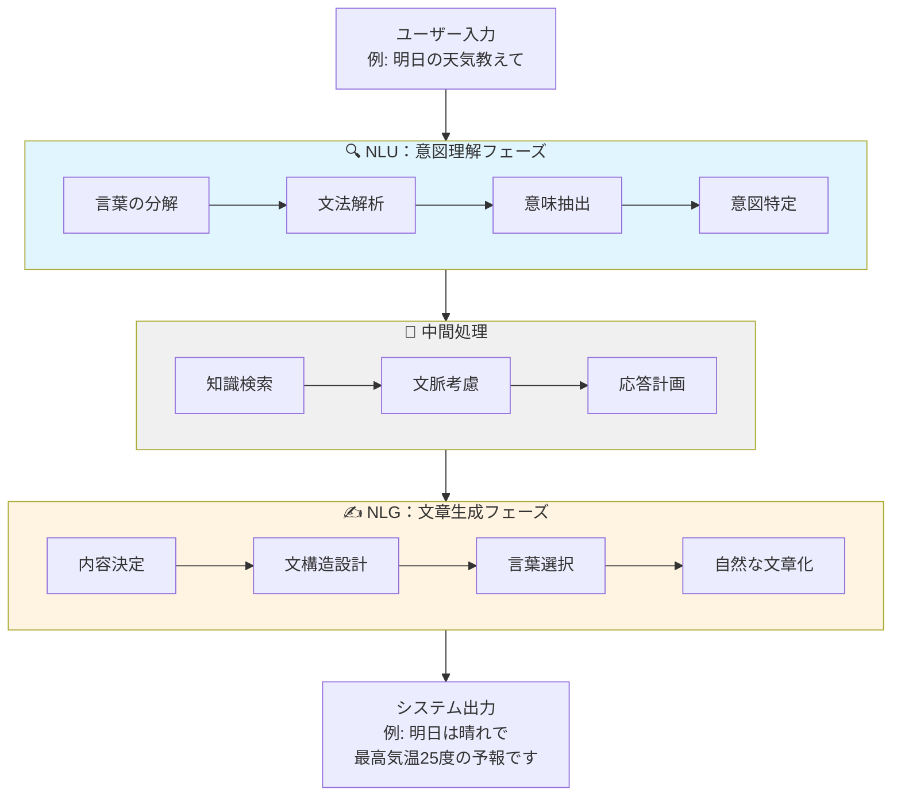
```mermaid
flowchart TD
    Input[ユーザー入力<br/>例: 明日の天気教えて] 
    
    subgraph NLU["🔍 NLU：意図理解フェーズ"]
        A1[言葉の分解]
        A2[文法解析]
        A3[意味抽出]
        A4[意図特定]
    end
    
    subgraph Brain["🧠 中間処理"]
        B1[知識検索]
        B2[文脈考慮]
        B3[応答計画]
    end
    
    subgraph NLG["✍️ NLG：文章生成フェーズ"]
        C1[内容決定]
        C2[文構造設計]
        C3[言葉選択]
        C4[自然な文章化]
    end
    
    Output[システム出力<br/>例: 明日は晴れで<br/>最高気温25度の予報です]
    
    Input --> NLU
    A1 --> A2 --> A3 --> A4
    NLU --> Brain
    B1 --> B2 --> B3
    Brain --> NLG
    C1 --> C2 --> C3 --> C4
    NLG --> Output
    
    style NLU fill:#e1f5ff
    style NLG fill:#fff4e1
    style Brain fill:#f0f0f0
```

### 各フェーズの役割

**NLUフェーズ（理解）：**
- 「明日の天気教えて」という文を解析
- 「天気情報を知りたい」という意図を特定
- 「明日」という時間情報を抽出

**中間処理（思考）：**
- 天気データベースを検索
- 現在地や過去の会話を考慮
- どんな情報をどう伝えるか計画

**NLGフェーズ（表現）：**
- 天気データを文章に変換
- 「晴れ」「25度」などを自然な形で配置
- 人間らしい口調で完成

## ⚡ 主要技術

NLU×NLG融合を支える核心技術を、料理に例えて説明します。

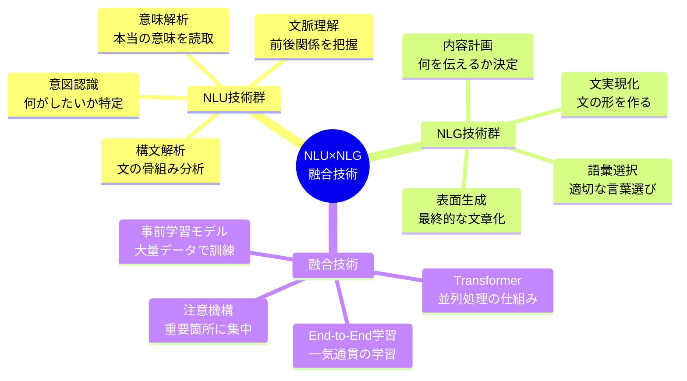
```mermaid
mindmap
  root((NLU×NLG<br/>融合技術))
    NLU技術群
      構文解析<br/>文の骨組み分析
      意味解析<br/>本当の意味を読取
      文脈理解<br/>前後関係を把握
      意図認識<br/>何がしたいか特定
    NLG技術群
      内容計画<br/>何を伝えるか決定
      文実現化<br/>文の形を作る
      語彙選択<br/>適切な言葉選び
      表面生成<br/>最終的な文章化
    融合技術
      End-to-End学習<br/>一気通貫の学習
      Transformer<br/>並列処理の仕組み
      注意機構<br/>重要箇所に集中
      事前学習モデル<br/>大量データで訓練
```

### 🔑 核心技術の詳細

**1. Transformer（変換器）**
新聞記事を一度に全体像を把握しながら読むように、文章全体を同時に処理する技術。従来の「1単語ずつ順番に読む」方式より圧倒的に高速で文脈を理解できます。

**2. 注意機構（Attention）**
「彼はリンゴを食べた。それは美味しかった」という文で、「それ」が「リンゴ」を指すと分かる能力。重要な単語に「注意」を向ける仕組みです。

**3. 事前学習モデル**
インターネット上の膨大な文章で「言葉の使い方」を学習済みのAI。料理人が基本技術を習得した状態で、あとは特定料理の練習だけすればよい状態に似ています。

**4. End-to-End学習**
従来は「理解」「判断」「生成」を別々に訓練していましたが、一連の流れを一度に学習させる手法。人間が会話を学ぶ自然なプロセスに近い方法です。

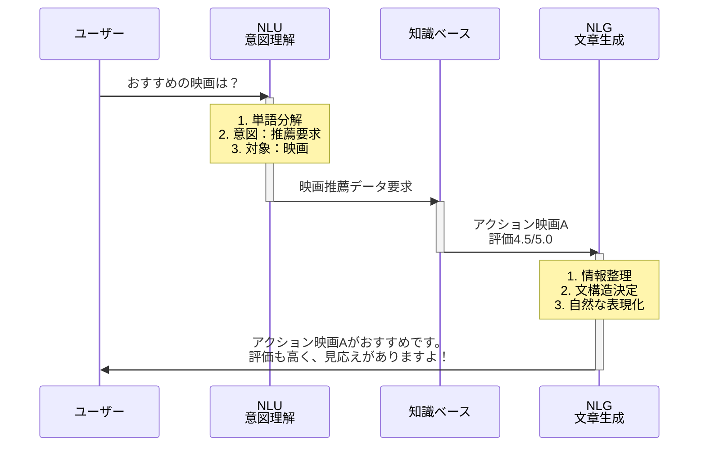
```mermaid
sequenceDiagram
    participant User as ユーザー
    participant NLU as NLU<br/>意図理解
    participant DB as 知識ベース
    participant NLG as NLG<br/>文章生成
    
    User->>NLU: おすすめの映画は？
    activate NLU
    Note over NLU: 1. 単語分解<br/>2. 意図：推薦要求<br/>3. 対象：映画
    NLU->>DB: 映画推薦データ要求
    deactivate NLU
    
    activate DB
    DB->>NLG: アクション映画A<br/>評価4.5/5.0
    deactivate DB
    
    activate NLG
    Note over NLG: 1. 情報整理<br/>2. 文構造決定<br/>3. 自然な表現化
    NLG->>User: アクション映画Aがおすすめです。<br/>評価も高く、見応えがありますよ！
    deactivate NLG
```

## 📜 時代背景と発見に至った経緯

### 🕰️ 技術進化の物語

**1950年代：チューリングの問いかけ**
アラン・チューリングが「機械は考えることができるか？」と問いました。これがAIと人間の会話研究の始まりです。

**1966年：最初の対話システムELIZA誕生**
精神科医の会話を模倣したプログラム。ただし、本当の理解はせず、パターンマッチングで応答していました。

- ユーザー：「頭が痛いです」
- ELIZA：「頭が痛いことについて、もっと教えてください」（単純な言い換え）

**1980-90年代：ルールベースの時代**
言語学者が手作業で文法規則を作成。NLUとNLGは完全に別々のシステムとして開発されていました。

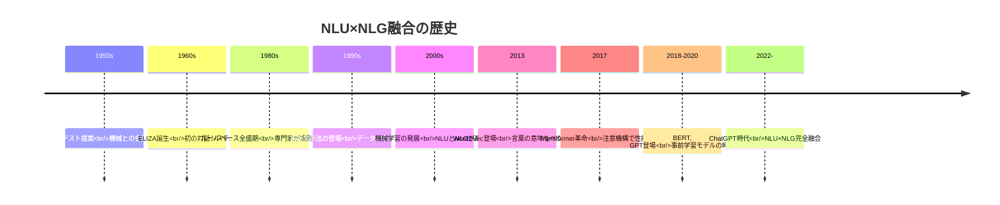
```mermaid
timeline
    title NLU×NLG融合の歴史
    1950s : チューリングテスト提案<br/>機械との会話可能性を提示
    1960s : ELIZA誕生<br/>初の対話システム
    1980s : ルールベース全盛期<br/>専門家が規則を手作り
    1990s : 統計的手法の登場<br/>データから学習開始
    2000s : 機械学習の発展<br/>NLUとNLGが高度化
    2013 : Word2Vec登場<br/>言葉の意味をベクトル化
    2017 : Transformer革命<br/>注意機構で性能飛躍
    2018-2020 : BERT, GPT登場<br/>事前学習モデルの時代
    2022- : ChatGPT時代<br/>NLU×NLG完全融合
```

**2013年：Word2Vec（言葉の地図）**
「王様 - 男性 + 女性 = 女王」のような計算ができる技術が登場。言葉を数値（ベクトル）で表現する革命が起きました。

**2017年：Transformerの衝撃**
Googleが「Attention is All You Need（注意こそが全て）」という論文を発表。この技術により、NLUとNLGを統一的に扱えるようになりました。

**2018年：BERTとGPTの登場**
- **BERT**：文章の穴埋め問題を大量に解いて言葉の関係を学習
- **GPT**：次の単語を予測し続けることで文章生成能力を獲得

**2022年以降：ChatGPT時代**
NLUとNLGが完全に融合。人間と区別がつかないレベルの会話が可能になりました。

### 💡 なぜ融合が必要だったのか

従来の別々のシステムでは、こんな問題がありました：

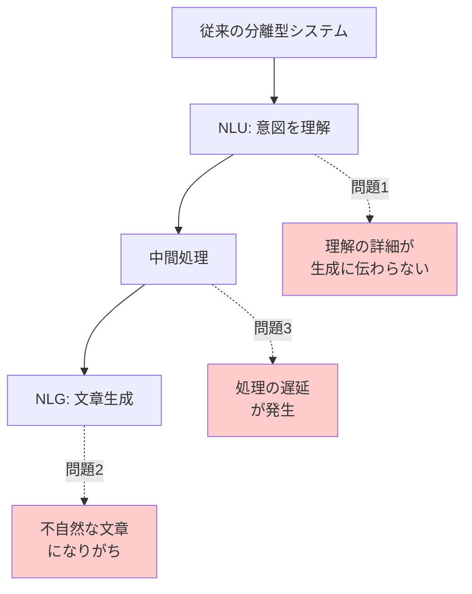
```mermaid
graph TD
    A[従来の分離型システム] --> B[NLU: 意図を理解]
    B --> C[中間処理]
    C --> D[NLG: 文章生成]
    
    B -.問題1.-> E[理解の詳細が<br/>生成に伝わらない]
    D -.問題2.-> F[不自然な文章<br/>になりがち]
    C -.問題3.-> G[処理の遅延<br/>が発生]
    
    style E fill:#ffcccc
    style F fill:#ffcccc
    style G fill:#ffcccc
```

融合により、これらの問題が解決：理解と生成が連携し、文脈を保ちながら自然な応答が可能になりました。

## 🎨 種類と特徴

NLU×NLG融合システムには、目的に応じた様々なタイプがあります。

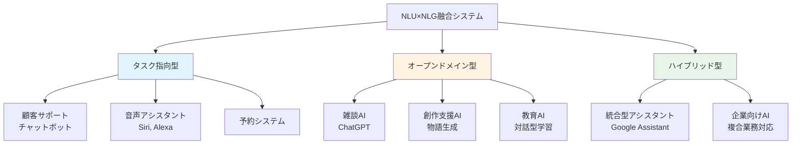
```mermaid
graph TB
    Root[NLU×NLG融合システム]
    
    Root --> Type1[タスク指向型]
    Root --> Type2[オープンドメイン型]
    Root --> Type3[ハイブリッド型]
    
    Type1 --> T1A[顧客サポート<br/>チャットボット]
    Type1 --> T1B[音声アシスタント<br/>Siri, Alexa]
    Type1 --> T1C[予約システム]
    
    Type2 --> T2A[雑談AI<br/>ChatGPT]
    Type2 --> T2B[創作支援AI<br/>物語生成]
    Type2 --> T2C[教育AI<br/>対話型学習]
    
    Type3 --> T3A[統合型アシスタント<br/>Google Assistant]
    Type3 --> T3B[企業向けAI<br/>複合業務対応]
    
    style Type1 fill:#e1f5ff
    style Type2 fill:#fff4e1
    style Type3 fill:#e8f5e8
```

### 📊 タイプ別比較表

| タイプ | 主な目的 | NLU特徴 | NLG特徴 | 具体例 |
|--------|----------|---------|---------|--------|
| **タスク指向型** | 特定業務の遂行 | 狭く深い理解 | 定型的で正確 | 「ピザのMサイズを注文」 |
| **オープンドメイン型** | 自由な会話 | 広く浅い理解 | 創造的で多様 | 「人生について語ろう」 |
| **ハイブリッド型** | 両方を柔軟に | 状況判断型 | 適応的 | 「天気教えて→雨なら傘の話題」 |

### 🔍 詳細な特徴分析

**1. タスク指向型（ゴール達成重視）**
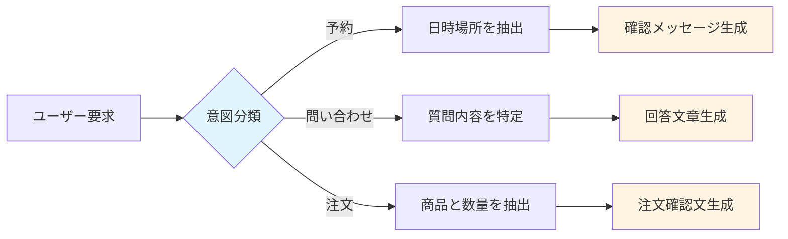
```mermaid
flowchart LR
    A[ユーザー要求] --> B{意図分類}
    B -->|予約| C[日時場所を抽出]
    B -->|問い合わせ| D[質問内容を特定]
    B -->|注文| E[商品と数量を抽出]
    
    C --> F[確認メッセージ生成]
    D --> G[回答文章生成]
    E --> H[注文確認文生成]
    
    style B fill:#e1f5ff
    style F fill:#fff4e1
    style G fill:#fff4e1
    style H fill:#fff4e1
```

**強み：** 高精度、信頼性、業務効率化
**弱み：** 想定外の質問に弱い、柔軟性が低い

**2. オープンドメイン型（会話の自然さ重視）**
どんな話題でも対応できる汎用性が特徴。大量のインターネットテキストで学習し、人間らしい応答を生成します。

**強み：** 柔軟性、創造性、幅広い知識
**弱み：** 時々不正確、専門性に欠ける場合がある

**3. ハイブリッド型（いいとこ取り）**
状況に応じてモードを切り替え。明確なタスクがあれば正確に、雑談モードなら自由に対応します。

## 📗 関連する用語

### 同義語・類義語
- **意図理解 ≒ 意図認識 ≒ Intent Recognition**
- **自然言語生成 ≒ テキスト生成 ≒ Text Generation**
- **対話システム ≒ 会話AI ≒ Conversational AI ≒ チャットボット**

### 対義語的な概念
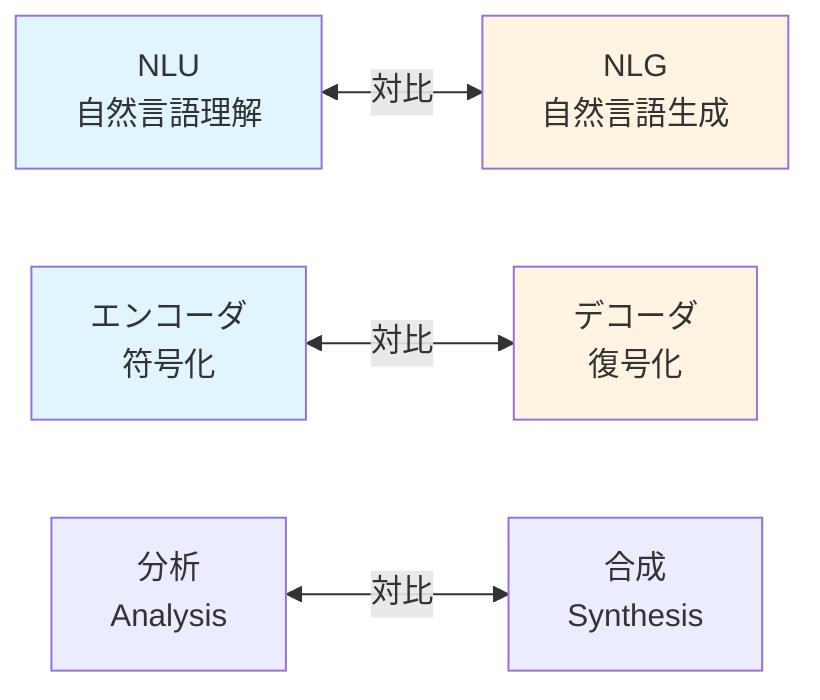
```mermaid
graph LR
    A[NLU<br/>自然言語理解] <-->|対比| B[NLG<br/>自然言語生成]
    C[エンコーダ<br/>符号化] <-->|対比| D[デコーダ<br/>復号化]
    E[分析<br/>Analysis] <-->|対比| F[合成<br/>Synthesis]
    
    style A fill:#e1f5ff
    style B fill:#fff4e1
    style C fill:#e1f5ff
    style D fill:#fff4e1
```

### 多義語の整理

**「モデル」の3つの意味：**
1. **統計モデル：** データから学習したパターン（例：予測モデル）
2. **言語モデル：** 文章の確率を計算する仕組み（例：GPT）
3. **機械学習モデル：** AIの訓練された状態全体

**「文脈」の2つの意味：**
1. **会話文脈：** 過去の発言内容（例：「それ」が何を指すか）
2. **状況文脈：** 周囲の状況（例：レストランでの会話）

### 類義語の微妙な違い

| 用語 | 焦点 | ニュアンス |
|------|------|------------|
| NLU | 意味理解 | 深い理解を強調 |
| 意図認識 | 目的把握 | ユーザーの目標に注目 |
| 言語解析 | 構造分析 | 文法的な側面を強調 |

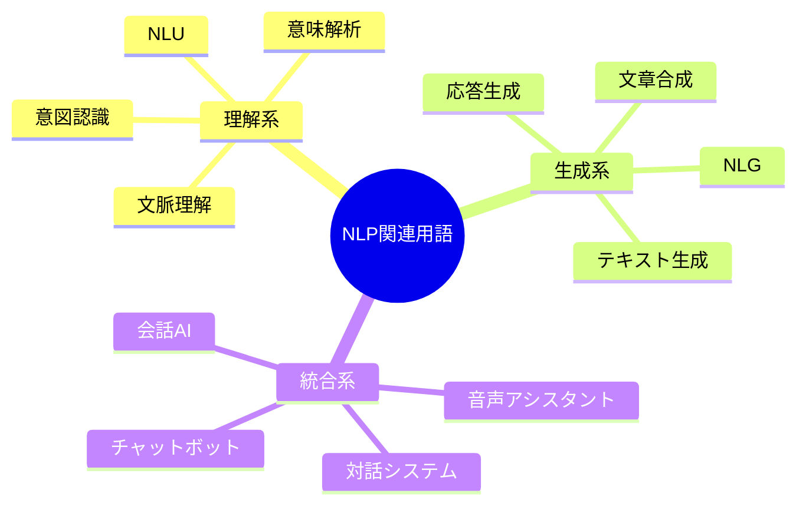
```mermaid
mindmap
  root((NLP関連用語))
    理解系
      NLU
      意図認識
      意味解析
      文脈理解
    生成系
      NLG
      テキスト生成
      応答生成
      文章合成
    統合系
      対話システム
      会話AI
      チャットボット
      音声アシスタント
```

## 💡 メリットとデメリット

### ✅ メリット

**1. 自然な会話体験**
人間同士の会話のように、文脈を理解しながら適切に応答できます。

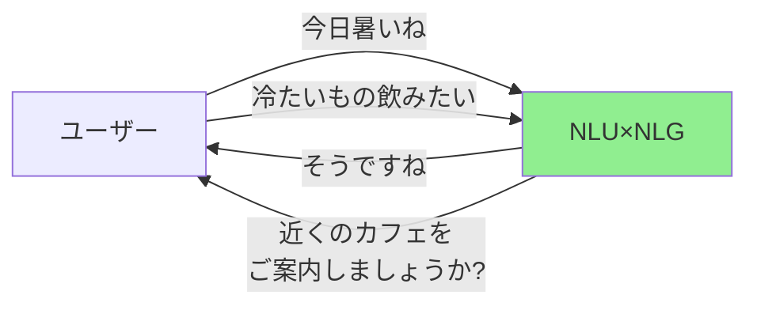
```mermaid
graph LR
    A[ユーザー] -->|今日暑いね| B[NLU×NLG]
    B -->|そうですね| A
    A -->|冷たいもの飲みたい| B
    B -->|近くのカフェを<br/>ご案内しましょうか?| A
    
    style B fill:#90EE90
```

**2. 24時間対応可能**
人間のオペレーターが休んでいる時間でも、顧客対応が可能です。

**3. 大量処理能力**
同時に何千人ものユーザーと会話でき、待ち時間がありません。

**4. 学習による継続的改善**
使えば使うほど賢くなり、応答品質が向上します。

**5. 多言語対応**
一度学習すれば、複数の言語で同等のサービスを提供できます。

### ❌ デメリット

**1. 誤解のリスク**
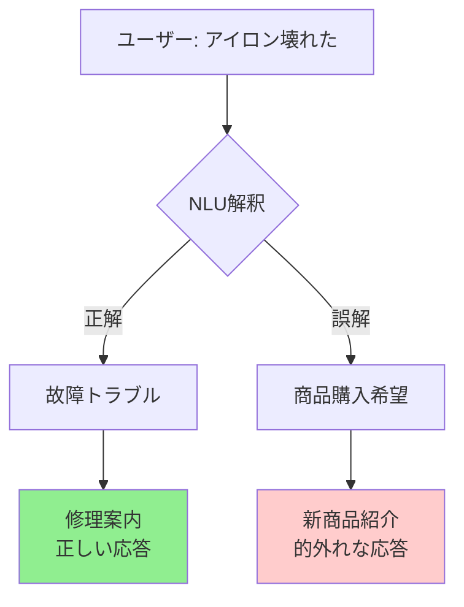
```mermaid
flowchart TD
    A[ユーザー: アイロン壊れた] --> B{NLU解釈}
    B -->|正解| C[故障トラブル]
    B -->|誤解| D[商品購入希望]
    
    C --> E[修理案内<br/>正しい応答]
    D --> F[新商品紹介<br/>的外れな応答]
    
    style E fill:#90EE90
    style F fill:#ffcccc
```

言葉のあいまいさや皮肉、比喩を誤解することがあります。

**2. プライバシーとセキュリティ懸念**
会話内容が記録され、個人情報漏洩のリスクがあります。

**3. 高コストな開発と運用**
- 大量の学習データが必要
- 高性能なコンピュータが必要
- 専門知識を持つ技術者が必要

**4. 倫理的課題**
- 偏見を含んだ応答の生成
- 不適切な内容の生成リスク
- 人間の仕事を奪う可能性

**5. 感情理解の限界**
人間の微妙な感情やニュアンスを完全には理解できません。

### ⚖️ メリット・デメリット比較表

| 側面 | メリット | デメリット | 対策 |
|------|----------|------------|------|
| **精度** | 大量データで高精度 | 未知の表現に弱い | 継続的な学習更新 |
| **コスト** | 長期的にはコスト削減 | 初期投資が高額 | 段階的導入 |
| **対応力** | 24時間無休対応 | 複雑な問題は苦手 | 人間へのエスカレーション |
| **言語** | 多言語展開が容易 | 言語ごとの調整必要 | 多言語学習データ拡充 |

## 🚀 応用と実例

NLU×NLG融合技術は、私たちの日常生活のあらゆる場面で活躍しています。

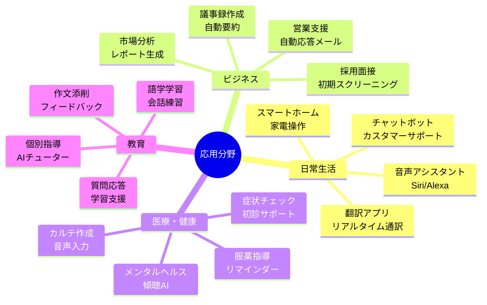
```mermaid
mindmap
  root((応用分野))
    日常生活
      スマートホーム<br/>家電操作
      音声アシスタント<br/>Siri/Alexa
      チャットボット<br/>カスタマーサポート
      翻訳アプリ<br/>リアルタイム通訳
    ビジネス
      営業支援<br/>自動応答メール
      議事録作成<br/>自動要約
      採用面接<br/>初期スクリーニング
      市場分析<br/>レポート生成
    医療・健康
      症状チェック<br/>初診サポート
      服薬指導<br/>リマインダー
      メンタルヘルス<br/>傾聴AI
      カルテ作成<br/>音声入力
    教育
      個別指導<br/>AIチューター
      作文添削<br/>フィードバック
      語学学習<br/>会話練習
      質問応答<br/>学習支援
```

### 🏠 実例1：スマートホーム

**シナリオ：** 帰宅時の音声操作

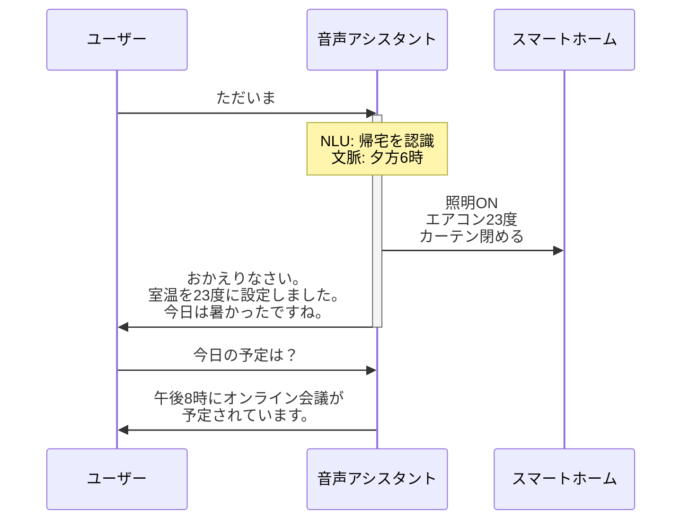
```mermaid
sequenceDiagram
    participant User as ユーザー
    participant VA as 音声アシスタント
    participant Home as スマートホーム
    
    User->>VA: ただいま
    activate VA
    Note over VA: NLU: 帰宅を認識<br/>文脈: 夕方6時
    VA->>Home: 照明ON<br/>エアコン23度<br/>カーテン閉める
    VA->>User: おかえりなさい。<br/>室温を23度に設定しました。<br/>今日は暑かったですね。
    deactivate VA
    
    User->>VA: 今日の予定は？
    VA->>User: 午後8時にオンライン会議が<br/>予定されています。
```

**技術ポイント：**
- 「ただいま」から帰宅という状況を理解（NLU）
- 時間帯と過去の設定を考慮して最適な環境を判断
- 親しみやすい応答文を生成（NLG）

### 💼 実例2：カスタマーサポート

**シナリオ：** ECサイトの問い合わせ

```
ユーザー：「注文した商品がまだ届かないんですけど」

チャットボットの処理：
【NLU】
- 意図：配送状況確認
- 感情：不安・不満
- 要求：情報提供

【中間処理】
- 注文履歴を検索
- 配送追跡情報を取得
- 標準配送日数と比較

【NLG】
- 共感表現を含める
- 具体的な情報を提示
- 次のアクションを明示

チャットボット：「ご心配をおかけして申し訳ございません。
注文番号123456を確認しましたところ、
現在配送センターを出発し、明日午前中にお届け予定です。
配送状況はこちらのリンクからリアルタイムで確認できます。」
```

### 🏥 実例3：医療サポート

**症状チェックAI**

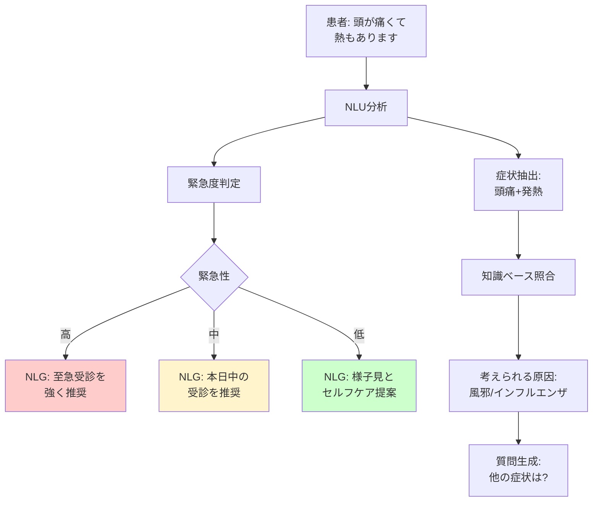
```mermaid
flowchart TD
    A[患者: 頭が痛くて<br/>熱もあります] --> B[NLU分析]
    B --> C[症状抽出:<br/>頭痛+発熱]
    B --> D[緊急度判定]
    
    C --> E[知識ベース照合]
    D --> F{緊急性}
    
    F -->|高| G[NLG: 至急受診を<br/>強く推奨]
    F -->|中| H[NLG: 本日中の<br/>受診を推奨]
    F -->|低| I[NLG: 様子見と<br/>セルフケア提案]
    
    E --> J[考えられる原因:<br/>風邪/インフルエンザ]
    J --> K[質問生成:<br/>他の症状は?]
    
    style G fill:#ffcccc
    style H fill:#fff4cc
    style I fill:#ccffcc
```

**注意：** 医療AIは診断ではなく、あくまで参考情報の提供と受診サポートを行います。

### 🎓 実例4：教育支援

**AIチューターとの対話**

```
生徒：「二次方程式が全然わからない」

AI分析（NLU）：
- トピック：数学・二次方程式
- レベル：基礎理解が不足
- 感情：困惑・挫折感
- 学習スタイル：過去ログから視覚的学習者と判定

AI応答（NLG）：
「大丈夫、一緒に解決しましょう！
二次方程式は難しく感じるかもしれませんが、
実は『放物線を描くボールの軌道』のような身近なものなんです。

まず、最も基本的な形 x² = 4 から始めてみましょう。
これは『何かを2回かけたら4になる数』を探す問題です。
答えは2と-2ですね。図で見てみましょう！」

[グラフを表示]

「どうですか？イメージできましたか？」
```

**技術ポイント：**
- 学習者の感情に配慮した応答
- 抽象概念を具体例で説明
- 段階的な難易度設定
- 視覚的補助の活用

## 🔄 置換、変遷

### 📤 何を置き換えたか

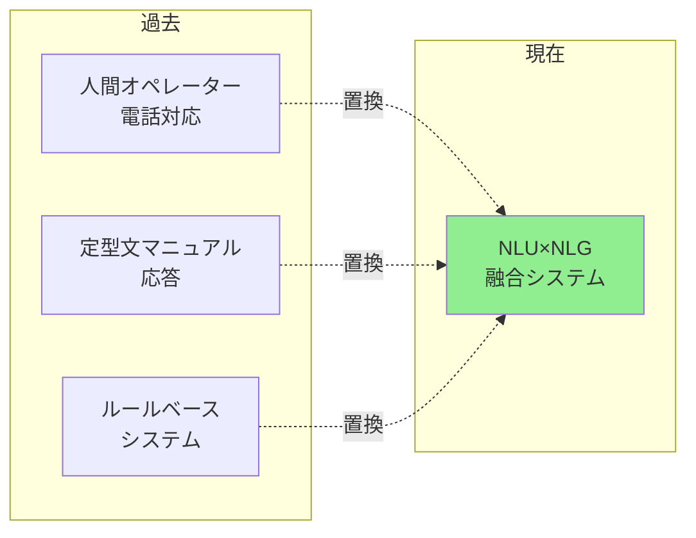
```mermaid
graph LR
    subgraph 過去
        A1[人間オペレーター<br/>電話対応]
        A2[定型文マニュアル<br/>応答]
        A3[ルールベース<br/>システム]
    end
    
    subgraph 現在
        B[NLU×NLG<br/>融合システム]
    end
    
    A1 -.置換.-> B
    A2 -.置換.-> B
    A3 -.置換.-> B
    
    style B fill:#90EE90
```

**1. 人間のオペレーター業務の一部**
- 定型的な問い合わせ対応
- 情報提供業務
- 初期対応・振り分け

**2. 従来のルールベースシステム**
```
【旧システム】
IF 「注文」を含む THEN "ご注文ですね"
IF 「キャンセル」を含む THEN "キャンセルですね"

【新システム（NLU×NLG）】
文脈と意図を理解し、柔軟に応答
「昨日注文したけど、やっぱりキャンセルしたい」
→ 注文特定 → キャンセル手続き → 自然な確認文生成
```

**3. 辞書ベースの翻訳システム**
単語ごとの置換から、文脈を考慮した自然な翻訳へ進化


# NLU×NLG融合技術 - 初学者のための完全ガイド（続き）

## 🔄 置換、変遷（続き）

### 📥 何に置き換えられる可能性があるか（続き）

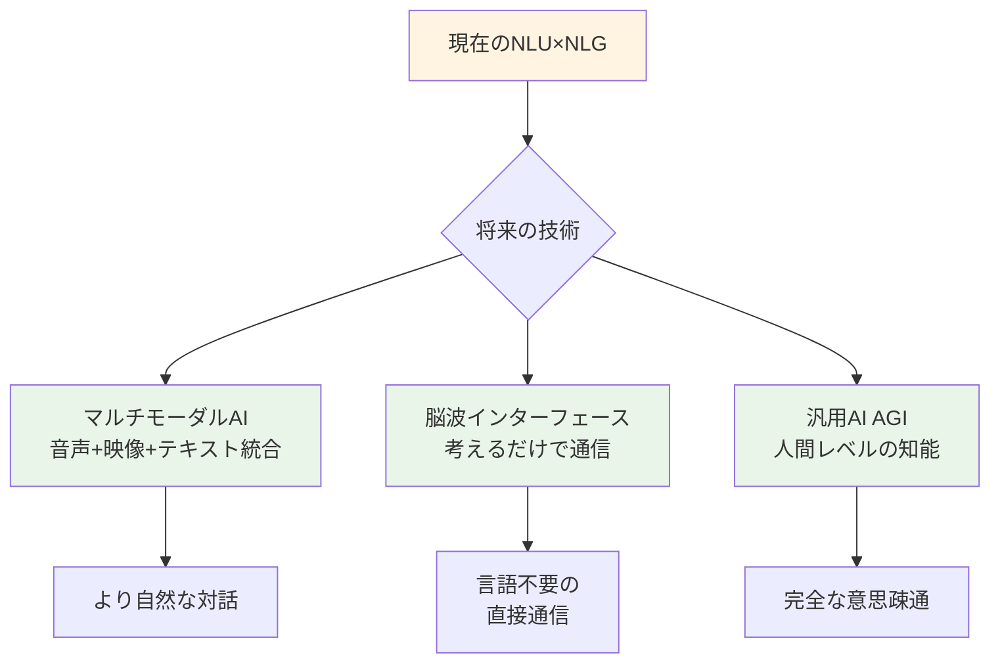
```mermaid
flowchart TD
    A[現在のNLU×NLG] --> B{将来の技術}
    
    B --> C[マルチモーダルAI<br/>音声+映像+テキスト統合]
    B --> D[脳波インターフェース<br/>考えるだけで通信]
    B --> E[汎用AI AGI<br/>人間レベルの知能]
    
    C --> F[より自然な対話]
    D --> G[言語不要の<br/>直接通信]
    E --> H[完全な意思疎通]
    
    style A fill:#fff4e1
    style C fill:#e8f5e8
    style D fill:#e8f5e8
    style E fill:#e8f5e8
```

**1. マルチモーダルAI（複数感覚統合型）**
テキストだけでなく、音声・映像・ジェスチャーを同時に理解し、より豊かなコミュニケーションを実現

**2. 脳コンピュータインターフェース**
言語を経由せず、思考を直接理解し応答する技術

**3. 汎用人工知能（AGI）**
人間と同等以上の理解力を持つ、完全な対話システム

### 🔗 何を継承したか

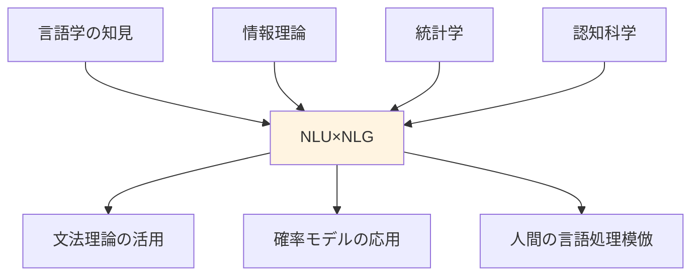
```mermaid
graph TD
    A[言語学の知見] --> E[NLU×NLG]
    B[情報理論] --> E
    C[統計学] --> E
    D[認知科学] --> E
    
    E --> F[文法理論の活用]
    E --> G[確率モデルの応用]
    E --> H[人間の言語処理模倣]
    
    style E fill:#fff4e1
```

**継承した主要な要素：**

1. **言語学から：**
   - 構文解析理論（文の構造理解）
   - 意味論（言葉の意味体系）
   - 語用論（文脈での意味）

2. **統計学から：**
   - 確率モデル（言葉の出現確率）
   - ベイズ推定（不確実性の扱い）

3. **認知科学から：**
   - 人間の言語処理プロセス
   - 記憶と学習のメカニズム

### 🌱 何に継承されたか

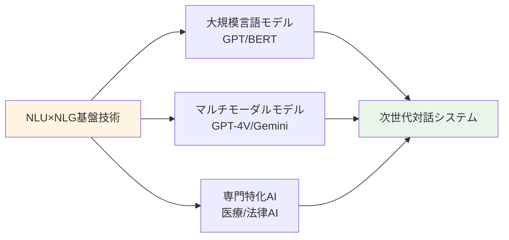
```mermaid
flowchart LR
    A[NLU×NLG基盤技術] --> B[大規模言語モデル<br/>GPT/BERT]
    A --> C[マルチモーダルモデル<br/>GPT-4V/Gemini]
    A --> D[専門特化AI<br/>医療/法律AI]
    
    B --> E[次世代対話システム]
    C --> E
    D --> E
    
    style A fill:#fff4e1
    style E fill:#e8f5e8
```

現在のNLU×NLG技術は、より高度なAIシステムの基盤として継承されています。

## 🔀 代替、競合

### 🔄 何に代替できるか

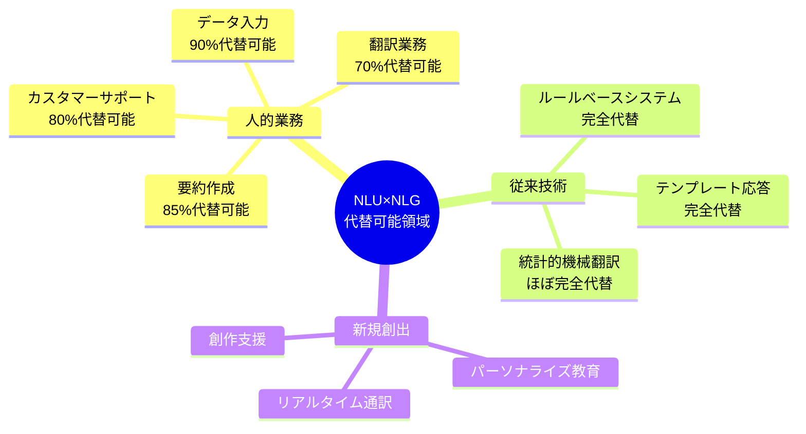
```mermaid
mindmap
  root((NLU×NLG<br/>代替可能領域))
    人的業務
      カスタマーサポート<br/>80%代替可能
      データ入力<br/>90%代替可能
      翻訳業務<br/>70%代替可能
      要約作成<br/>85%代替可能
    従来技術
      ルールベースシステム<br/>完全代替
      テンプレート応答<br/>完全代替
      統計的機械翻訳<br/>ほぼ完全代替
    新規創出
      パーソナライズ教育
      リアルタイム通訳
      創作支援
```

**代替可能性の評価：**

| 業務タイプ | 代替率 | 理由 |
|-----------|--------|------|
| 定型問い合わせ | 90% | パターン化された業務に強い |
| 複雑な相談 | 30% | 人間の判断が必要 |
| 創造的作業 | 50% | 支援は可能、最終判断は人間 |
| 感情的対応 | 40% | 共感表現は限定的 |

### 🆚 何に代替されるか

```mermaid
graph TD
    A[現在のNLU×NLG] --> B{代替技術}
    
    B --> C[End-to-Endニューラル<br/>より統合的]
    B --> D[マルチエージェント<br/>複数AI協調]
    B --> E[量子NLP<br/>超高速処理]
    
    C --> F[シームレスな対話]
    D --> G[複雑タスク対応]
    E --> H[リアルタイム処理]
    
    style A fill:#fff4e1
```

**将来的な代替技術：**

1. **完全End-to-Endシステム**
   - NLUとNLGの境界が消失
   - 中間ステップなしの直接変換

2. **マルチエージェントシステム**
   - 専門AIが協力して対応
   - より複雑な問題解決が可能

3. **量子コンピュータベースNLP**
   - 膨大な並列処理で超高速化
   - より深い意味理解

### ⚔️ 何と競合するか

```mermaid
graph LR
    subgraph 競合技術群
        A[NLU×NLG]
        B[検索エンジン<br/>Google]
        C[人間オペレーター]
        D[専門家システム]
    end
    
    A <-.競合.-> B
    A <-.競合.-> C
    A <-.競合.-> D
    
    E[ユーザーの<br/>情報ニーズ] --> A
    E --> B
    E --> C
    E --> D
    
    style A fill:#fff4e1
```

**主要な競合関係：**

| 競合相手 | 競合領域 | NLU×NLGの優位性 | 相手の優位性 |
|---------|---------|----------------|-------------|
| **検索エンジン** | 情報検索 | 対話的・文脈理解 | 網羅性・最新性 |
| **人間** | 対話・相談 | 速度・コスト | 共感・創造性 |
| **専門家システム** | 専門判断 | 柔軟性・学習能力 | 精度・信頼性 |
| **従来AI** | 自動化 | 自然さ・適応性 | シンプルさ |

**協調の可能性：**
実際には完全な代替ではなく、それぞれの強みを活かした**ハイブリッドシステム**が主流になっています。

```mermaid
graph TD
    A[ユーザー質問] --> B{NLU×NLG初期対応}
    
    B -->|簡単な質問| C[AI完結]
    B -->|複雑| D[検索エンジン連携]
    B -->|専門的| E[専門家システム照会]
    B -->|感情的| F[人間にエスカレーション]
    
    D --> G[統合回答生成]
    E --> G
    
    style B fill:#fff4e1
    style G fill:#90EE90
```

## 🌍 実世界への影響とその後の発展

### 🌟 社会への影響

```mermaid
mindmap
  root((社会的影響))
    経済
      業務効率化<br/>コスト削減
      新産業創出<br/>AI関連ビジネス
      雇用構造変化<br/>スキル要求変化
    生活
      利便性向上<br/>24時間サービス
      情報アクセス<br/>言語障壁低下
      孤独解消<br/>対話相手
    教育
      個別最適学習<br/>AIチューター
      学習機会拡大<br/>地理的制約解消
      言語学習革新<br/>実践的練習
    医療
      医療アクセス<br/>初期相談容易化
      診療支援<br/>記録自動化
      メンタルケア<br/>傾聴AI
```

### 📊 産業別影響度

| 産業 | 影響度 | 主な変化 | 時期 |
|------|--------|----------|------|
| **カスタマーサービス** | ★★★★★ | チャットボット標準化 | 既に進行中 |
| **教育** | ★★★★☆ | AIチューター普及 | 2025-2030 |
| **医療** | ★★★★☆ | 診療補助・記録自動化 | 2025-2035 |
| **金融** | ★★★★☆ | 相談業務自動化 | 既に進行中 |
| **製造** | ★★☆☆☆ | 品質管理レポート | 2030以降 |

### 🚀 技術的発展の方向性

```mermaid
timeline
    title NLU×NLG融合技術の未来展望
    2025 : マルチモーダル統合<br/>テキスト+音声+画像
    2027 : リアルタイム同時通訳<br/>自然な会話レベル
    2030 : 感情認識統合<br/>共感的応答の実現
    2035 : 脳波インターフェース<br/>思考レベルの通信
    2040 : AGI実現<br/>完全な対話知能
```

### 🔮 近未来の発展（2025-2030）

**1. マルチモーダル統合**
```mermaid
graph LR
    A[ユーザー入力] --> B[テキスト]
    A --> C[音声<br/>声色・抑揚]
    A --> D[表情<br/>感情認識]
    A --> E[ジェスチャー]
    
    B --> F[統合理解<br/>エンジン]
    C --> F
    D --> F
    E --> F
    
    F --> G[総合的な<br/>応答生成]
    
    style F fill:#fff4e1
    style G fill:#90EE90
```

声のトーン、表情、ジェスチャーも同時に理解し、より人間らしい対話を実現

**2. パーソナライゼーションの深化**
個人の学習履歴、嗜好、文脈を完全に理解し、一人ひとりに最適化された応答

**3. リアルタイム多言語対応**
言語の壁が完全に消失し、世界中の人々が母国語で自由にコミュニケーション

### 🌈 中長期の発展（2030-2040）

**1. 感情と共感の進化**
```mermaid
flowchart TD
    A[ユーザー発話] --> B[言語内容分析]
    A --> C[感情状態推定]
    A --> D[文脈理解]
    
    B --> E[総合判断]
    C --> E
    D --> E
    
    E --> F{応答戦略}
    
    F -->|共感必要| G[寄り添い型応答]
    F -->|情報必要| H[解決型応答]
    F -->|励まし必要| I[支援型応答]
    
    style E fill:#fff4e1
    style G fill:#ffcccc
    style H fill:#ccccff
    style I fill:#ccffcc
```

人間の微妙な感情の変化を読み取り、適切に共感できるAI

**2. 創造性との融合**
単なる応答生成を超え、芸術作品、文学作品レベルの創造的生成

**3. 汎用知能への統合**
NLU×NLGが汎用人工知能（AGI）の一部として統合され、人間と同等の知的対話が実現

### 🎯 解決すべき課題

```mermaid
graph TD
    A[技術的課題] --> A1[精度向上]
    A --> A2[計算効率化]
    A --> A3[多言語対応]
    
    B[社会的課題] --> B1[プライバシー保護]
    B --> B2[雇用影響緩和]
    B --> B3[デジタル格差]
    
    C[倫理的課題] --> C1[バイアス除去]
    C --> C2[透明性確保]
    C --> C3[責任所在明確化]
    
    D[法的課題] --> D1[法規制整備]
    D --> D2[著作権問題]
    D --> D3[責任範囲定義]
    
    style A fill:#e1f5ff
    style B fill:#fff4e1
    style C fill:#ffe1e1
    style D fill:#f0f0f0
```

### 🌏 グローバルな展開

**地域別の発展状況：**

```mermaid
graph TB
    World[世界市場]
    
    World --> NA[北米<br/>先進的実装]
    World --> EU[欧州<br/>規制重視]
    World --> Asia[アジア<br/>大規模展開]
    World --> Other[その他地域<br/>普及段階]
    
    NA --> NA1[ChatGPT<br/>Google]
    EU --> EU1[GDPR準拠<br/>プライバシー重視]
    Asia --> Asia1[中国：独自発展<br/>日本：応用重視]
    
    style World fill:#90EE90
```

---
