自然言語処理（NLP：Natural Language Processing）に関連する技術のうち、意図理解（ Natural Language Understanding）とNatural Language Generation (NLG): 自然言語生成 の分解点について。

# NLU(意図理解)とNLG(自然言語生成)の分岐点 - 初学者完全ガイド

## 🔍 一言要約
AIが「人間の言葉を理解する」と「人間の言葉を作る」は全く別の技術

## 📚 目次
1. [はじめに - なぜ2つに分かれるのか](#-はじめに)
2. [NLPの全体像](#-nlpの全体像)
3. [NLUとNLGの本質的違い](#-nluとnlgの本質的違い)
4. [分解点の技術的背景](#-分解点の技術的背景)
5. [歴史的発展経緯](#-歴史的発展経緯)
6. [関連用語と比較](#-関連用語と比較)
7. [メリット・デメリット](#-メリットデメリット)
8. [実例と応用](#-実例と応用)
9. [技術的変遷](#-技術的変遷)
10. [未来展望](#-未来展望)

## 🌟 はじめに

**日常例で理解する**

友達から「お腹空いた」とLINEが来たとき、あなたの脳は2つの作業をしています：

1. **理解する**：「この子は食事を提案してほしいんだな」（NLU）
2. **返答を作る**：「駅前のラーメン屋どう？」（NLG）

AIも同じです。人間の言葉を処理するには、この2つの能力が必要です。

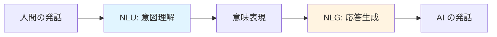

## 🏗️ NLPの全体像

NLP（自然言語処理）は大きな傘のような概念です。

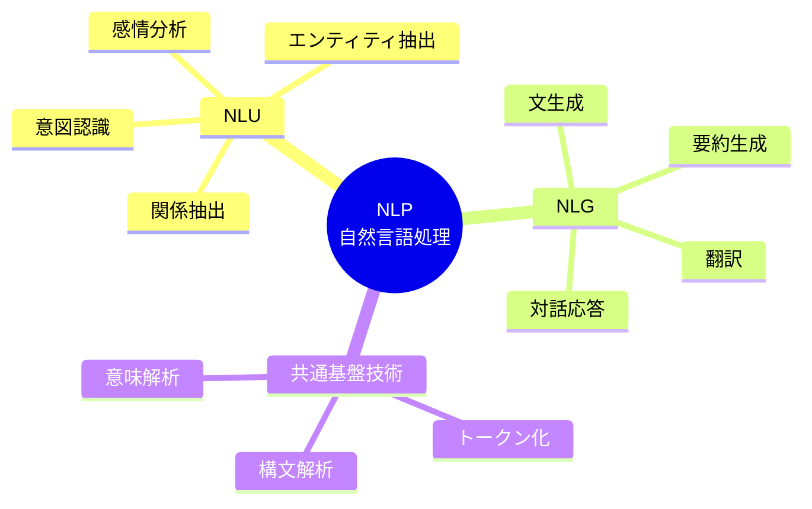

**ポイント**：NLUとNLGは「入力→処理→出力」の流れで分かれます。

## ⚡ NLUとNLGの本質的違い

### 🔍 NLU（Natural Language Understanding）

**目的**：人間の言葉から「意味」を取り出す

**例**：
- 入力：「明日の天気は？」
- NLUの仕事：
  - 「明日」= 時間情報（日付）
  - 「天気」= 問い合わせ対象（気象情報）
  - 「？」= 質問意図

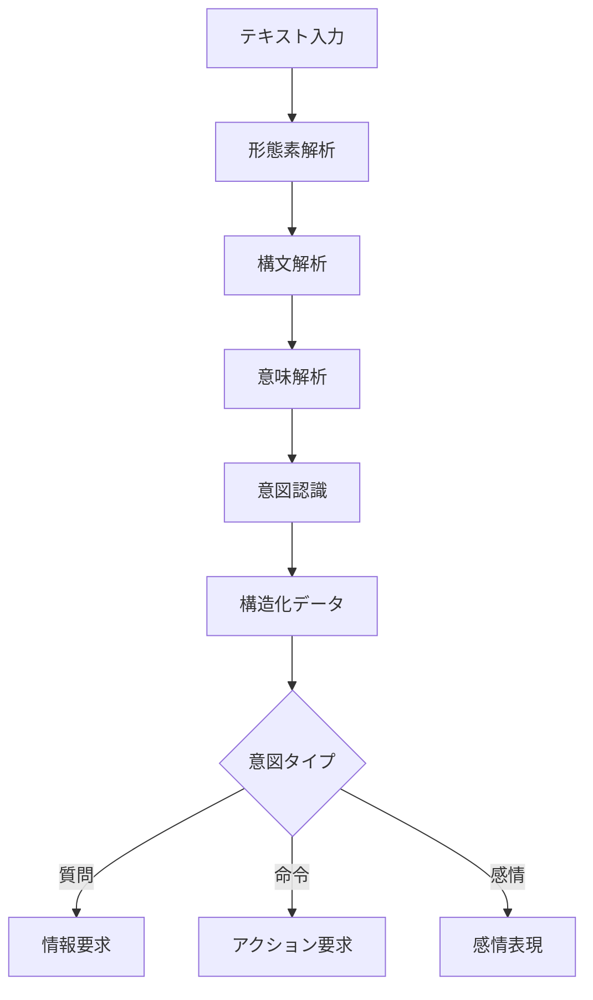

### ✍️ NLG（Natural Language Generation）

**目的**：データや意図から「人間が読める文章」を作る

**例**：
- 入力データ：`{date: "明日", weather: "晴れ", temp: 25}`
- NLGの仕事：「明日は晴れで気温は25度です」

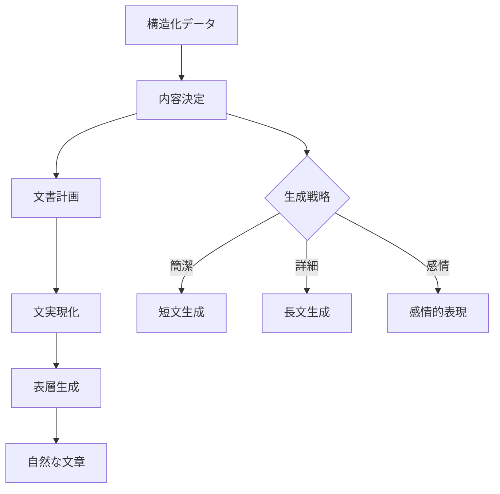

### 🔑 決定的な違い

| 観点 | NLU | NLG |
|------|-----|-----|
| **方向** | 言葉→意味 | 意味→言葉 |
| **入力** | 自由な文章 | 構造化データ |
| **出力** | 構造化データ | 自由な文章 |
| **難しさ** | 曖昧性の解消 | 自然さの実現 |
| **例え** | 暗号解読 | 作文 |

## 🔬 分解点の技術的背景

### なぜ2つに分ける必要があるのか？

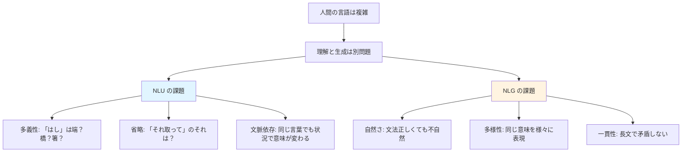

### 技術的な分解点

**中間表現**が分岐ポイントです。

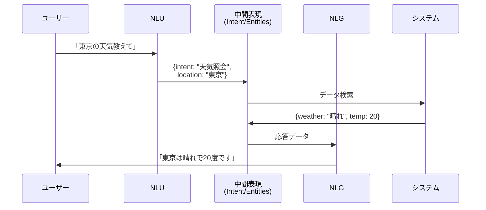

## 📜 時代背景と発展経緯

### 1950-1980年代：ルールベース時代

**NLUの誕生**
- 1950年：チューリングテスト提案（「機械は考えられるか？」）
- 1960年代：ELIZA（最初の対話システム）
  - パターンマッチングで「理解」を模倣
  - 実際には表面的な言い換えのみ

**NLGの誕生**
- 1970年代：テンプレート方式
  - 「天気は[データ]です」のような穴埋め

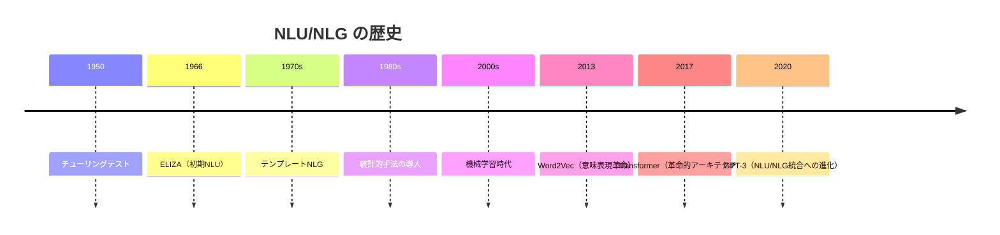

### 1980-2000年代：統計的手法時代

**分離の明確化**
- NLU：品詞タグ付け、構文解析が独立技術に
- NLG：統計的言語モデルで自然な文生成

### 2010年代：深層学習革命

**分離と統合の並行**
- Seq2Seq（2014）：エンコーダ（NLU）とデコーダ（NLG）を明示的に分離
- Transformer（2017）：両者を統一アーキテクチャで処理

### 2020年代：大規模言語モデル

**境界の曖昧化**
- GPT系：NLUとNLGを単一モデルで実現
- ただし概念的には依然として区別が重要

## 📗 関連用語と比較

### 同義語・類似概念

| 用語 | 関係性 | 説明 |
|------|--------|------|
| **NLI** (Natural Language Interaction) | 上位概念 | NLU + NLG + 対話管理 |
| **Reading Comprehension** | NLUの一種 | 文章を読んで質問に答える |
| **Text Generation** | NLGの別名 | より広義の文章生成 |
| **Semantic Parsing** | NLU技術 | 文を論理形式に変換 |

### 対義語・対比概念

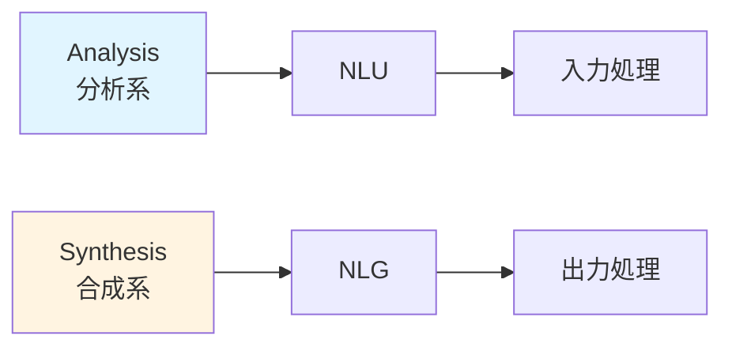

### 多義語の注意

**「理解」の2つの意味**
1. **狭義**：NLUのこと（テキスト→意味）
2. **広義**：NLP全体（人間の言語を扱うこと）

## 💡 メリットとデメリット

### 分離することのメリット

| メリット | 説明 | 実例 |
|----------|------|------|
| **専門化** | 各タスクに最適な技術を使用 | NLUには分類器、NLGには言語モデル |
| **再利用性** | 異なる応用で共通部品を使える | チャットボットと音声アシスタントで同じNLU |
| **デバッグ容易** | どこで失敗したか特定しやすい | 「理解は正しいが応答が不自然」と判断可能 |
| **並行開発** | 別チームで同時開発可能 | NLUチームとNLGチームの分業 |

### 分離することのデメリット

| デメリット | 説明 | 対策 |
|----------|------|------|
| **中間表現の制約** | NLUの出力がNLGの入力として不完全 | End-to-Endモデルの採用 |
| **情報損失** | 構造化で微妙なニュアンスが失われる | リッチな意味表現の設計 |
| **エラー伝播** | NLUの誤りがNLGに影響 | 信頼度スコアの活用 |
| **開発コスト** | 2つのモデルを別々に訓練 | マルチタスク学習 |

## 🚀 実例と応用

### 実例1：スマートスピーカー

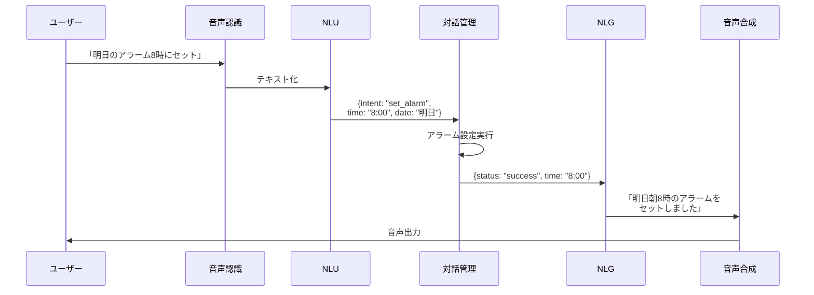

### 実例2：カスタマーサポートチャット

**NLUの役割**：
- 顧客の問い合わせカテゴリ分類
- 商品名・注文番号の抽出
- 感情分析（怒っている？困っている？）

**NLGの役割**：
- 適切な敬語での応答生成
- 顧客の感情に応じた表現調整
- FAQデータからの自然な回答作成

### 実例3：機械翻訳

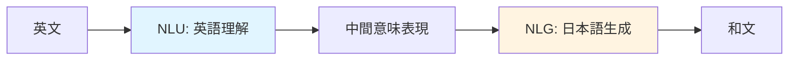

**ポイント**：同じ意味を言語間で受け渡し

## 🔄 技術的変遷

### 何を置き換えたか

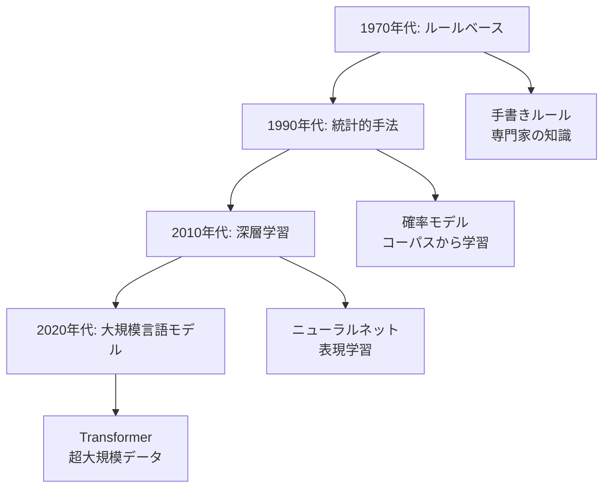

### 継承と発展

**NLUの進化**
- パターンマッチング → 機械学習分類器 → BERT等の事前学習モデル

**NLGの進化**
- テンプレート → 統計的言語モデル → GPT等の生成モデル

**統合への流れ**
- 初期：完全分離
- 中期：Seq2Seqで接続
- 現在：単一モデルで両方（GPT、Claude等）

## 🆚 代替・競合技術

### NLU代替技術

| 技術 | 特徴 | 使い分け |
|------|------|----------|
| **キーワードマッチ** | シンプル、高速 | 単純な検索・フィルタリング |
| **ルールエンジン** | 確実性高い | ドメイン限定の高精度が必要 |
| **画像認識** | 視覚情報から | テキストがない場合 |

### NLG代替技術

| 技術 | 特徴 | 使い分け |
|------|------|----------|
| **テンプレート** | 安定、制御可能 | 定型文・報告書 |
| **検索ベース** | 既存文から選択 | FAQ、チャットボット |
| **ルールベース** | 確実性高い | 法律文書・契約書 |

### 競合関係

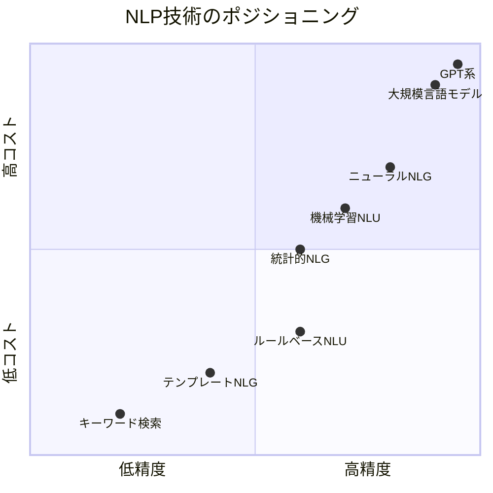

## 🌍 実世界への影響と未来展望

### 現在の影響

**産業への影響**
1. **カスタマーサービス**：24時間対応チャットボット
2. **医療**：患者記録の自動要約（NLU）と報告書生成（NLG）
3. **教育**：自動採点（NLU）とフィードバック生成（NLG）
4. **金融**：市場レポート自動生成

**社会への影響**
- アクセシビリティ向上（音声アシスタント）
- 多言語コミュニケーション（翻訳）
- 情報過多の解決（要約技術）

### 未来の展望

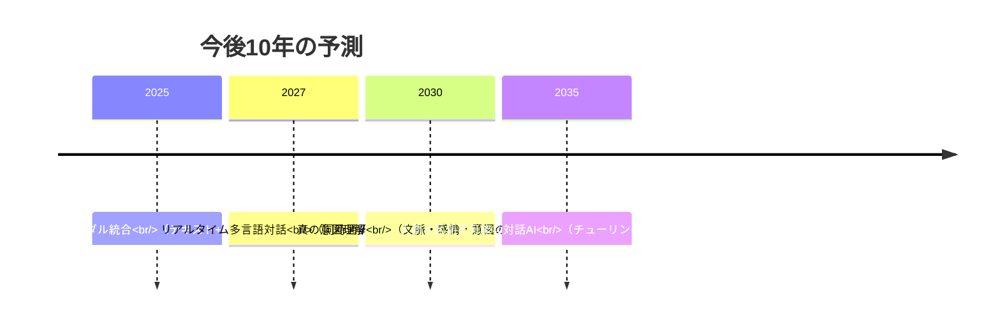

### 技術的課題と方向性

**課題1：真の理解**
- 現状：パターン認識
- 目標：世界知識に基づく理解

**課題2：制御可能性**
- 現状：生成が予測困難
- 目標：意図通りの出力を確実に

**課題3：倫理と安全性**
- 偏見の除去
- 誤情報生成の防止
- プライバシー保護

### 統合の未来

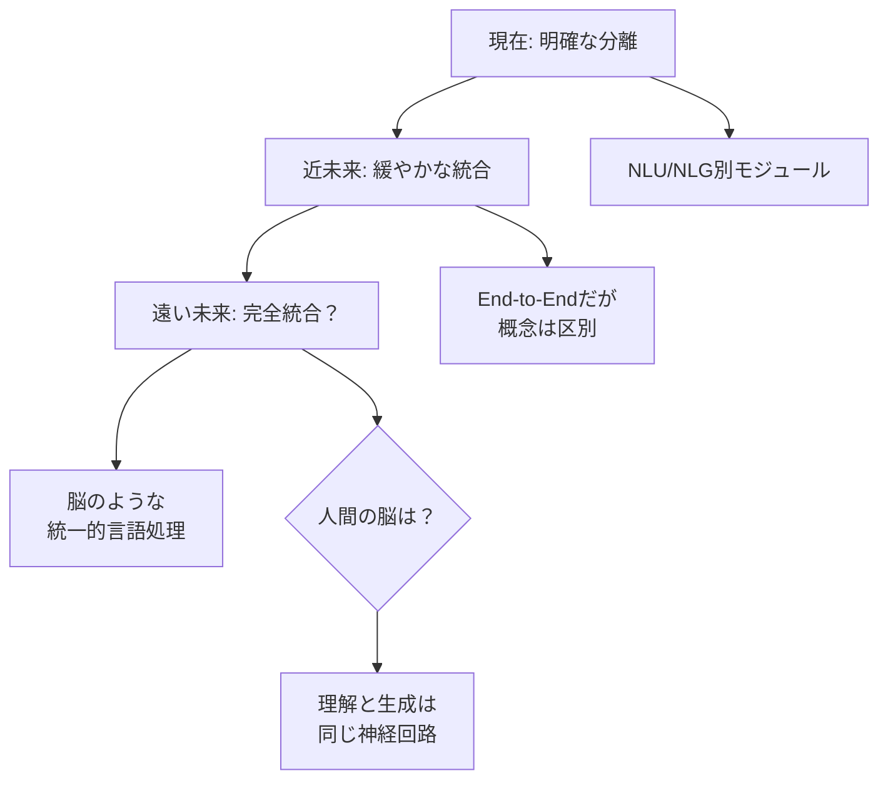

## 🎓 まとめ：学習の次のステップ

### 理解度チェック

以下の質問に答えられますか？

1. ✅ NLUとNLGの違いを日常例で説明できる
2. ✅ なぜ2つに分ける必要があるのか理解している
3. ✅ 中間表現（Intent/Entities）の役割を説明できる
4. ✅ 自分が使っているAIサービスでNLU/NLGを見分けられる

### さらに学ぶには

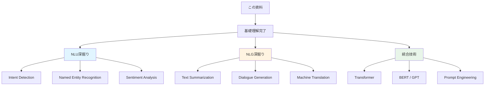

---

**初学者へのメッセージ**：
NLUとNLGの分離は「理解すること」と「表現すること」という人間の認知の基本を反映しています。この2つを区別して学ぶことで、AIの仕組みがぐっと見通しやすくなります！
