自然言語処理（NLP：Natural Language Processing）に関連する技術のうち、意図理解（ Natural Language Understanding）とNatural Language Generation (NLG): 自然言語生成 との間に存在する中間処理について、大規模言語モデル登場以前のあり方と、大規模言語モデル内におけるあり方と、大規模言語モデル登場以後のあり方について、それぞれ

# 自然言語処理の中間処理層 - 理解から生成への架け橋

## 🔍 一言要約
言葉の「意味を理解する処理」と「文章を作る処理」の間で、情報を整理・変換する技術

## 📚 目次
1. [はじめに](#-はじめに)
2. [中間処理とは何か](#-中間処理とは何か)
3. [大規模言語モデル登場以前](#-大規模言語モデル登場以前)
4. [大規模言語モデル内部](#-大規模言語モデル内部)
5. [大規模言語モデル登場以後](#-大規模言語モデル登場以後)
6. [技術の変遷と比較](#-技術の変遷と比較)
7. [関連用語](#-関連用語)
8. [実世界への影響](#-実世界への影響)

## 🌟 はじめに

翻訳アプリを想像してください。日本語を英語に変換する際、アプリは以下の3段階を経ています：

1. **理解**：「明日は雨です」の意味を把握
2. **？？？**：意味を英語の構造に合わせて整理
3. **生成**：「It will rain tomorrow」と出力

この「？？？」の部分が**中間処理**です。料理で例えるなら、食材（理解）と完成料理（生成）の間にある「下ごしらえ・調理」の工程にあたります。

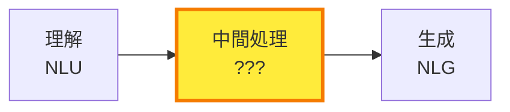

## 🏗️ 中間処理とは何か

中間処理は「意味の表現形式を変換する」役割を担います。

**日常例**：レシピを見て料理を作る過程
- **理解**：レシピを読んで理解（NLU）
- **中間処理**：材料を切る、調味料を計量、手順を整理
- **生成**：実際に調理して料理完成（NLG）

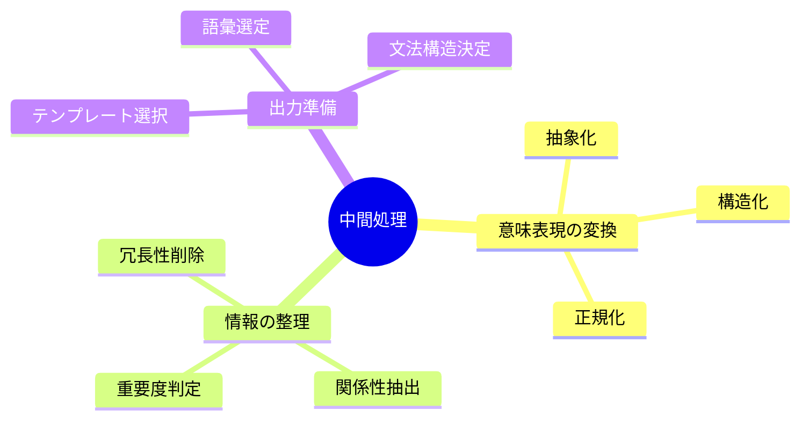

## 📜 大規模言語モデル登場以前

### 古典的パイプライン方式（1980-2010年代）

**特徴**：各処理が独立したモジュールとして明確に分離

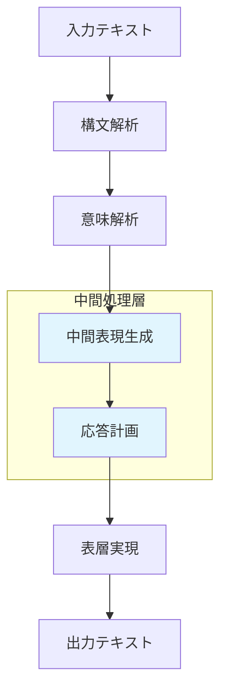

### 主要な中間処理技術

#### 1. **中間表現（Intermediate Representation）**
人間の言語を機械が扱いやすい構造に変換

**例**：「太郎が花子にリンゴをあげた」
```
論理形式（FOL）：
give(Taro, Apple, Hanako)

意味フレーム：
[動作: 授与]
 - 主体: 太郎
 - 対象: リンゴ
 - 受取人: 花子
```

#### 2. **対話管理（Dialogue Management）**
会話の流れを制御し、次の応答を計画

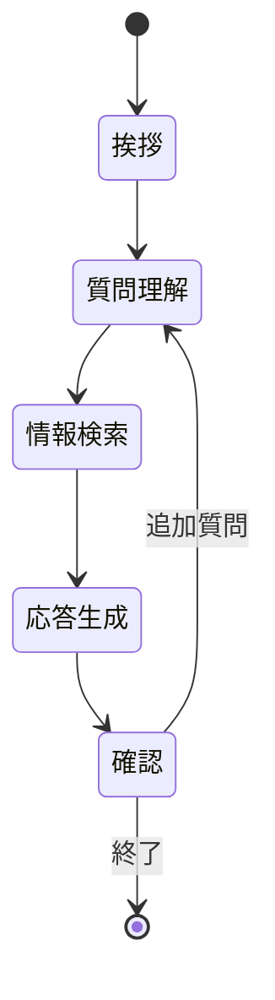

#### 3. **文書計画（Document Planning）**
何をどの順番で伝えるかを決定

**例**：天気予報システム
```
入力データ：気温28℃、降水確率80%、風速12m/s
↓
重要度判定：降水 > 風 > 気温
↓
構造決定：警告 → 詳細 → 助言
↓
出力計画：「大雨警報」→「傘必須」→「強風注意」
```

### 技術的課題

- **硬直性**：ルールベースのため柔軟性に欠ける
- **メンテナンス困難**：新しいパターン追加に大量の手作業
- **エラー伝播**：前段階のミスが後段階に累積
- **スケーラビリティ**：多言語・多領域対応が困難

## 🔋 大規模言語モデル内部

### 暗黙的な統合処理（2017年～）

Transformer登場後、中間処理は明示的なモジュールではなく、**ニューラルネットワークの隠れ層内で暗黙的に実行**されるようになりました。

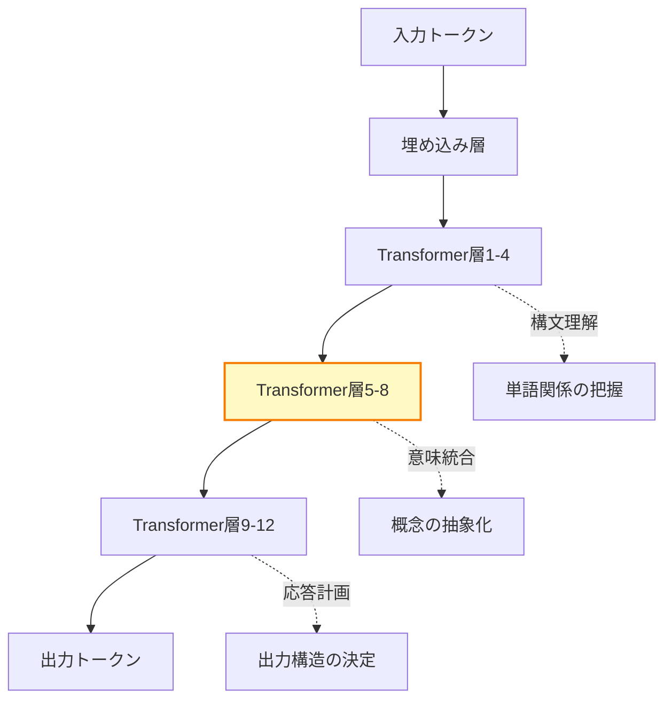

### 中間層での処理内容

#### レイヤーごとの役割分化

**初期層（1-4層）**：構文・表面的パターン
- 品詞認識
- 依存関係解析
- 固有表現抽出

**中間層（5-8層）**：意味・概念レベル ⭐
- 同義語の統合
- 関係性の抽出
- 推論の実行

**後期層（9-12層）**：タスク特化・出力準備
- 応答戦略の選択
- 文体・トーンの調整
- 単語選択の最適化

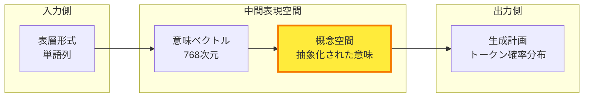

### 注意機構（Attention）の役割

中間処理の核心は**注意機構**にあります。

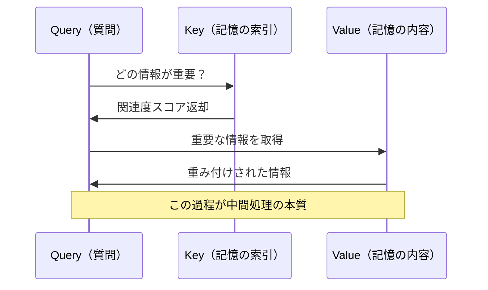

**例**：「銀行で働く彼女は…」
- 「銀行」に注目 → 金融機関の文脈
- 「働く」に注目 → 職業的関係
- 両者を統合 → 銀行員という概念形成

### 暗黙的処理のメリット

- **柔軟性**：学習データから自動で最適化
- **エラー耐性**：確率的処理により部分的エラーを吸収
- **スケーラビリティ**：同じ構造で多言語・多タスク対応

### デメリット

- **解釈困難性**：何が起きているか説明できない（ブラックボックス）
- **制御困難性**：特定の処理を強制できない
- **予測不可能性**：時折予期しない出力

## 🚀 大規模言語モデル登場以後

### ハイブリッド時代（2020年～）

LLMの弱点を補うため、**外部モジュールとの組み合わせ**が主流に。

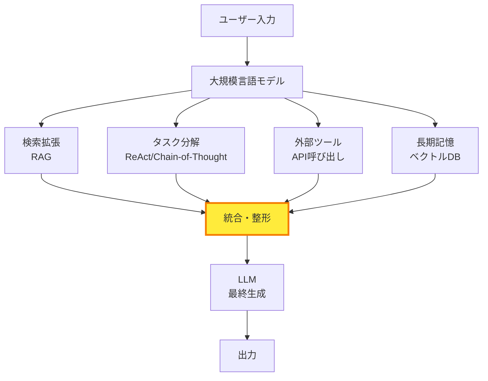

### 新たな中間処理技術

#### 1. **RAG（Retrieval-Augmented Generation）**
外部知識を検索して統合

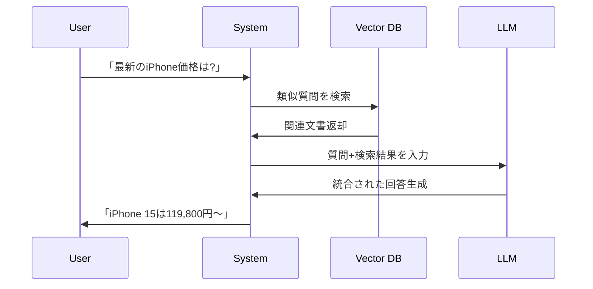

#### 2. **Chain-of-Thought（思考の連鎖）**
段階的推論を明示化

**従来**：
```
質問：「72 ÷ 8 × 3 = ?」
答え：「27」
```

**CoT**：
```
質問：「72 ÷ 8 × 3 = ?」
ステップ1：72 ÷ 8 = 9
ステップ2：9 × 3 = 27
答え：「27」
```

#### 3. **ReAct（推論+行動）**
思考と行動を交互に実行

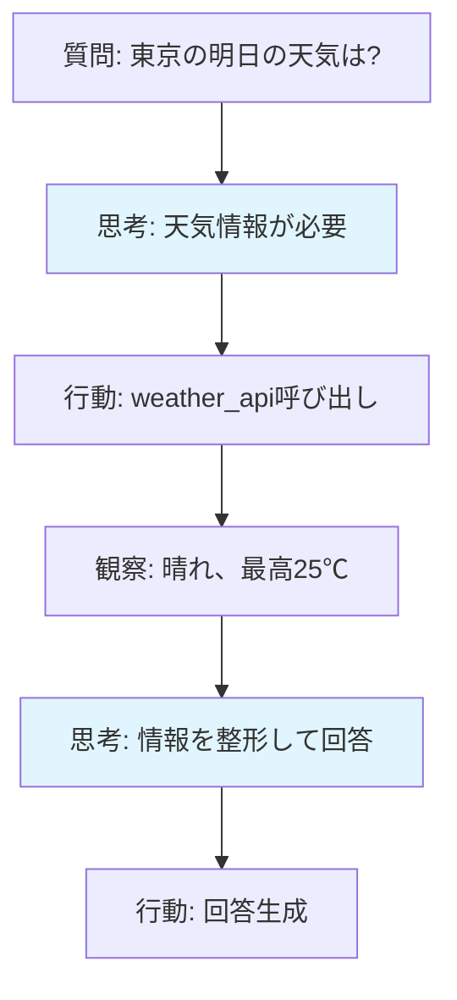

#### 4. **プロンプトエンジニアリング**
LLMの挙動を制御する新技術

**Few-Shot学習**：
```
例1：入力「嬉しい」→ 出力「ポジティブ」
例2：入力「悲しい」→ 出力「ネガティブ」
例3：入力「普通」→ 出力「中立」
---
入力「楽しい」→ 出力「?」
```

**ロールプレイ**：
```
あなたは親切な図書館司書です。
専門用語を使わず、優しく説明してください。
```

### 外部記憶システム

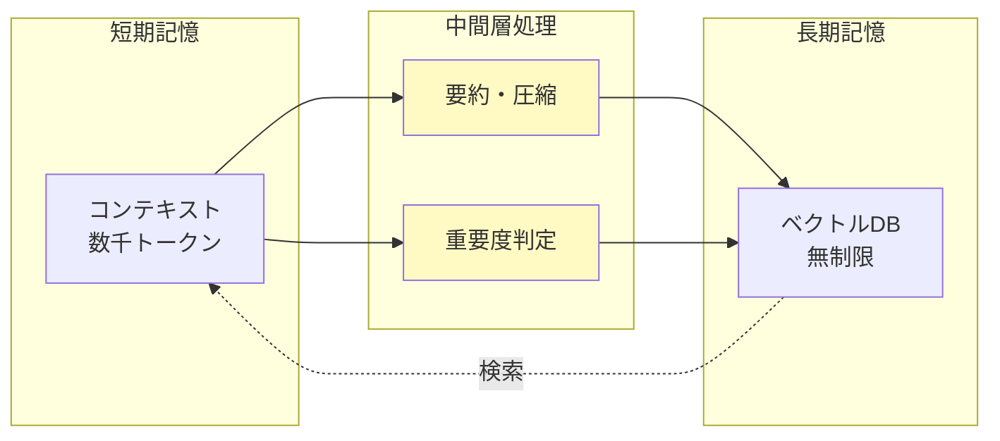

## 🔄 技術の変遷と比較

### 時代別特徴マトリクス

| 観点 | 登場以前<br/>(~2017) | モデル内部<br/>(2017-2020) | 登場以後<br/>(2020~) |
|------|---------------------|--------------------------|---------------------|
| **処理の可視性** | ⭐⭐⭐⭐⭐ 明示的 | ⭐ ブラックボックス | ⭐⭐⭐ 部分的に可視化 |
| **柔軟性** | ⭐⭐ 硬直的 | ⭐⭐⭐⭐ 高い | ⭐⭐⭐⭐⭐ 非常に高い |
| **制御性** | ⭐⭐⭐⭐⭐ 完全制御 | ⭐⭐ 困難 | ⭐⭐⭐⭐ 外部制御可能 |
| **スケール** | ⭐⭐ 小規模 | ⭐⭐⭐⭐ 大規模 | ⭐⭐⭐⭐⭐ 超大規模 |
| **開発コスト** | ⭐⭐ 高い | ⭐⭐⭐ 中程度 | ⭐⭐⭐⭐ 低い |

### アーキテクチャ比較図

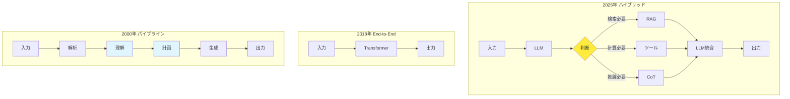

## 📗 関連用語

### 同義語・類似概念
- **中間表現** = 意味表現（Semantic Representation）
- **対話管理** ≈ 会話制御（Conversation Control）
- **文書計画** ≈ コンテンツ選択（Content Selection）

### 対照的概念
- **表層実現（Surface Realization）** ⟷ **深層理解（Deep Understanding）**
- **End-to-End学習** ⟷ **モジュラーシステム**
- **暗黙的処理** ⟷ **明示的処理**

### 時代別用語

**登場以前**：
- 論理形式（Logical Form）
- 談話表現理論（DRT）
- スロットフィリング（Slot Filling）

**モデル内部**：
- アテンション（Attention）
- 隠れ状態（Hidden States）
- 埋め込み空間（Embedding Space）

**登場以後**：
- プロンプトチェーン（Prompt Chaining）
- オーケストレーション（Orchestration）
- エージェント（Agent）

## 💡 メリットとデメリット

### 各時代の長所・短所

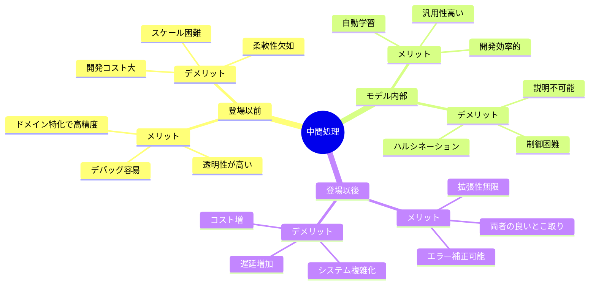

## 🌍 実世界への影響

### 産業別応用例

#### カスタマーサポート
**以前**：決められた質問にのみ対応
```
FAQ検索 → テンプレート選択 → 穴埋め応答
```

**現在**：文脈理解して柔軟対応
```
質問理解 → [RAG: 社内文書検索] → [CoT: 段階的推論] → 自然な回答生成
```

#### 医療記録作成
**以前**：定型フォーム入力
```
症状選択 → コード変換 → 定型文出力
```

**現在**：音声から自動レポート
```
音声認識 → [LLM: 医療用語整理] → [ツール: 電子カルテ検索] → 構造化レポート生成
```

### 未来展望

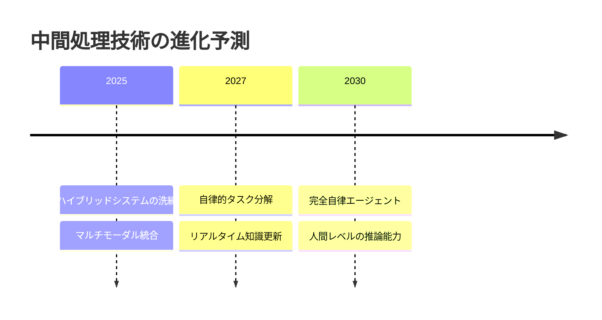

**予測される発展**：
1. **自己改善型システム**：自動でプロンプトを最適化
2. **説明可能AI**：中間処理の可視化技術
3. **省エネルギー化**：効率的な処理アーキテクチャ

---
