自然言語処理（NLP：Natural Language Processing）に関連する技術のうち、Natural Language Generation (NLG): 自然言語生成 について

# 自然言語生成（NLG） - 初学者のための完全ガイド

## 🔍 一言要約
コンピュータが人間の言葉で文章を自動的に書く技術

## 📚 目次
1. [はじめに](#-はじめに)
2. [基本構造](#-基本構造)
3. [主要技術](#-主要技術)
4. [時代背景と発展経緯](#-時代背景と発展経緯)
5. [種類と特徴](#-種類と特徴)
6. [関連用語](#-関連する用語)
7. [メリットとデメリット](#-メリットとデメリット)
8. [応用と実例](#-応用と実例)
9. [置換と変遷](#-置換と変遷)
10. [代替と競合](#-代替と競合)
11. [実世界への影響](#-実世界への影響とその後の発展)

## 🌟 はじめに

天気予報の文章、商品レビューの要約、チャットボットの返答――これらすべてに共通するのは「機械が人間の言葉で文章を生成している」という点です。

NLGは、データや情報を入力すると、それを自然な日本語や英語などの文章に変換する技術です。まるで料理人が食材（データ）を使って料理（文章）を作るように、コンピュータが情報を「調理」して読みやすい文章にします。

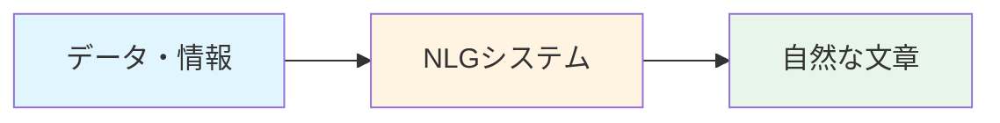

## 🏗️ 基本構造

NLGシステムは3つの主要な段階で文章を生成します：

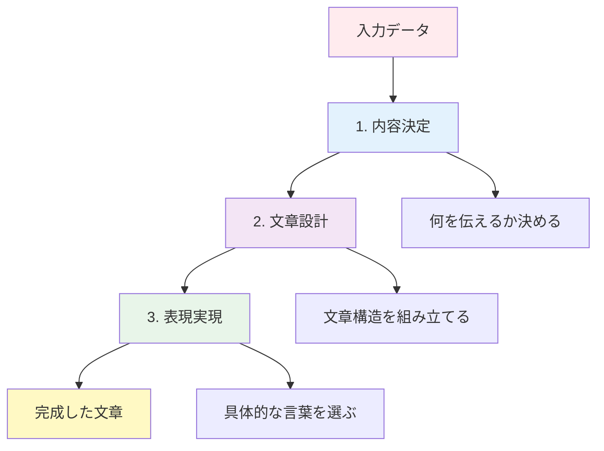

### 各段階の役割

**1. 内容決定（Content Determination）**
レストランで例えると「メニューを決める」段階。大量の情報から「何を文章にするか」を選びます。

**2. 文章設計（Document Planning）**
「料理の順番を決める」段階。選んだ情報をどの順序で、どう構成するかを計画します。

**3. 表現実現（Surface Realization）**
「実際に調理する」段階。計画に基づいて具体的な単語や文法を使って文章を完成させます。

## ⚡ 主要技術

NLGを支える3つの技術アプローチがあります：

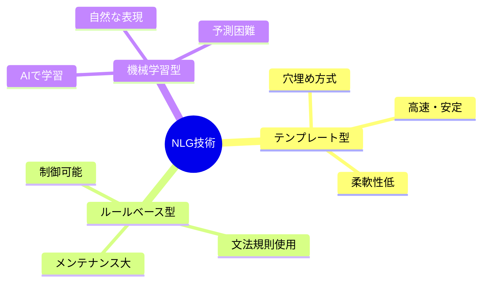

### テンプレート型
「今日の天気は＿＿＿で、気温は＿＿＿度です」のように、あらかじめ文章の型を用意し、空欄にデータを埋め込む方式。シンプルで確実ですが、表現のバリエーションが限られます。

### ルールベース型
文法や言語のルールをプログラムに組み込み、そのルールに従って文章を組み立てます。専門家の知識を反映できますが、ルールの作成と維持に手間がかかります。

### 機械学習型（ニューラルNLG）
大量の文章例からAIが自動で学習し、新しい文章を生成します。人間らしい自然な表現が可能ですが、時々予想外の出力をすることがあります。

## 📜 時代背景と発展経緯

NLGの歴史は、人類の「機械に言葉を話させたい」という夢から始まりました：

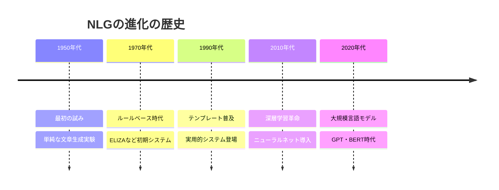

### 各時代の転換点

**1950-60年代：夢の始まり**
コンピュータ科学の黎明期。研究者たちは「機械が人間のように話せたら」と想像しました。最初の試みは単純な文章の組み立てでした。

**1970-80年代：知識工学の時代**
専門家の知識をルール化してシステムに組み込む手法が主流に。ELIZAという心理療法を模したプログラムが話題を呼びました。

**1990-2000年代：実用化の波**
天気予報や株価レポートなど、特定分野での実用システムが登場。テンプレート方式が広く使われました。

**2010年代：AI革命**
深層学習の登場でNLGが飛躍的に進化。機械が文脈を理解し、より人間らしい文章を生成できるように。

**2020年代：言語モデルの時代**
GPT、BERTなどの大規模言語モデルが登場。数億〜数千億のパラメータを持つAIが、驚くほど自然な文章を生成できるようになりました。

## 🎨 種類と特徴

NLGシステムは目的や技術によって分類できます：

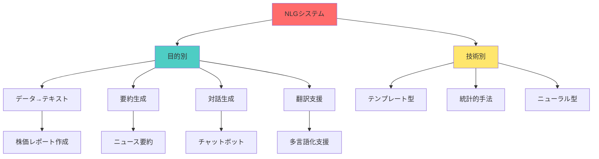

### 目的別分類

| 種類 | 説明 | 身近な例 |
|------|------|----------|
| データ→テキスト | 数値データを文章化 | 天気予報、試合結果 |
| 要約生成 | 長い文章を短く | ニュース要約、論文要旨 |
| 対話生成 | 会話の応答作成 | カスタマーサポートBot |
| 翻訳支援 | 言語間の変換補助 | 機械翻訳の後処理 |

## 📗 関連する用語

### 同義語・類似概念
- **テキスト生成**：より広い概念。NLGは構造化データから生成する点が特徴
- **自動作文**：教育分野での呼び方
- **Text-to-Text Generation**：テキストを入力として別のテキストを生成

### 対義語・補完概念
- **NLU（自然言語理解）**：人間の言葉を機械が理解する技術。NLGの逆方向
- **Speech Recognition（音声認識）**：音声を文字化。NLGは文字から文章化

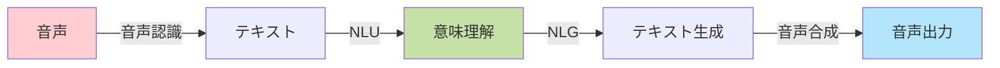

### 関連用語の比較

| 用語 | 入力 | 出力 | 主な用途 |
|------|------|------|----------|
| NLG | データ/意味 | 文章 | レポート生成 |
| NLU | 文章 | データ/意味 | 質問応答 |
| 機械翻訳 | 言語A文章 | 言語B文章 | 翻訳 |
| 要約 | 長文 | 短文 | 要約 |

## 💡 メリットとデメリット

### メリット

**1. 大規模な自動化が可能**
人間が手作業で書くと何時間もかかる数千件のレポートを数秒で生成できます。例えば、全国の天気予報を各地域向けに同時作成できます。

**2. 一貫性の保証**
人間が書くと表現が変わりますが、NLGは同じルールで生成するため、文体や形式が統一されます。企業のマニュアルや定型文書に最適です。

**3. 24時間稼働**
人間のように休憩が不要。夜中でも休日でも、必要な時に即座に文章を生成できます。

**4. 多言語対応**
同じデータから複数の言語で文章を生成可能。国際展開している企業にとって大きな利点です。

**5. 人間の負担軽減**
定型的な文書作成から解放され、人間はより創造的な仕事に集中できます。

### デメリット

**1. 創造性の限界**
決められたパターンやルールに従うため、人間のような独創的な表現や感情を込めた文章は苦手です。

**2. 文脈理解の困難さ**
複雑な状況や微妙なニュアンスを完全に理解するのは難しく、不自然な表現が生まれることがあります。

**3. 初期コストと開発期間**
高品質なシステムを構築するには、大量のデータ、専門知識、時間が必要です。

**4. エラーの説明困難性**
特に機械学習型では、なぜその表現を選んだのか説明が難しく、予期しない出力への対処が困難です。

**5. バイアスのリスク**
学習データに偏りがあると、偏った表現や不適切な内容を生成する可能性があります。

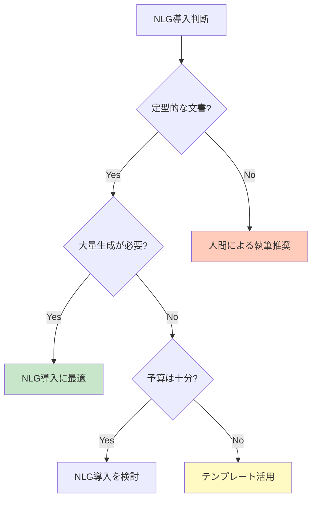

## 🚀 応用と実例

NLGは私たちの日常生活の至る所で活躍しています：

### 1. メディア・ニュース業界
**AP通信の自動記事生成**
企業の決算発表データから、数秒で記事を生成。人間の記者は分析記事に専念できるようになりました。

**スポーツ速報**
試合のスコアデータから、リアルタイムで試合経過を文章化します。

### 2. ビジネス分野
**営業レポート自動作成**
CRMシステムのデータから、週次・月次レポートを自動生成。営業担当者は顧客対応により多くの時間を使えます。

**株価・市場分析レポート**
金融データを解析し、投資家向けのレポートを毎日自動作成します。

### 3. カスタマーサポート
**チャットボット**
顧客の質問を理解し、適切な回答文を生成。24時間対応が可能になり、人間のオペレーターは複雑な問題に集中できます。

**自動メール返信**
問い合わせ内容に応じて、適切な返信メールを自動生成します。

### 4. 医療・ヘルスケア
**診断レポート作成**
検査データから、患者向けの分かりやすい説明文を生成します。

**健康アドバイス生成**
個人の健康データに基づいて、カスタマイズされた健康アドバイスを提供します。

### 5. 教育分野
**個別フィードバック生成**
学生の成績データから、一人ひとりに合わせた学習アドバイスを自動作成します。

**練習問題の解説生成**
問題の解答プロセスを段階的に説明する文章を生成します。

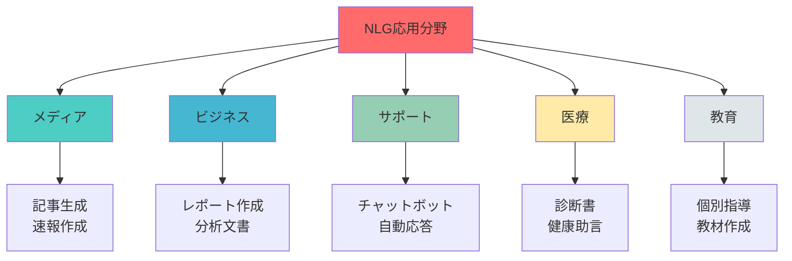

## 🔄 置換と変遷

### 何を置き換えたか

NLGは以下の人間の作業を自動化・補助しています：

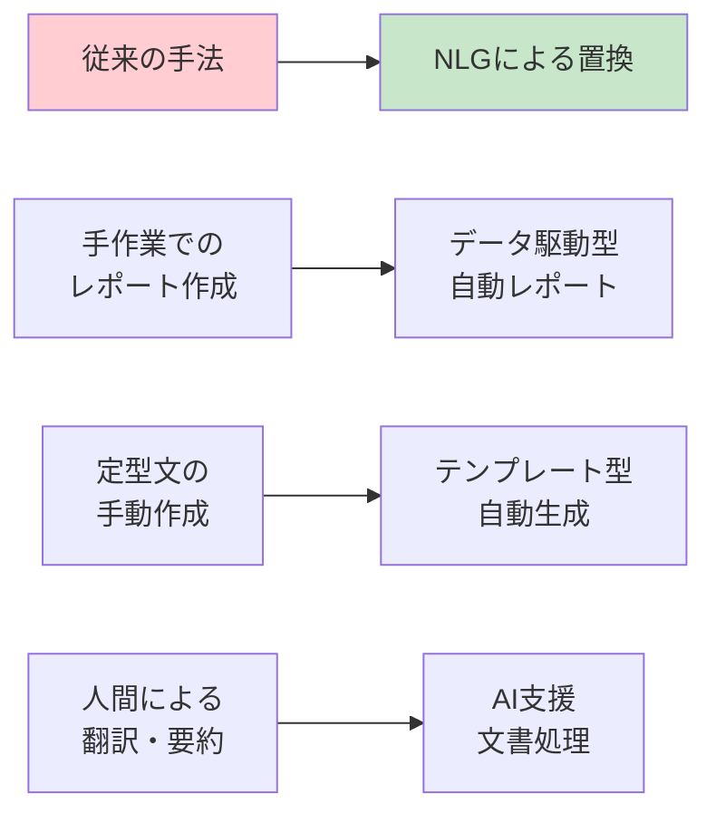

**1. 定型レポート作成者の役割**
天気予報士、スポーツライター、株価アナリストなどの定型的な文書作成業務の一部を代替しました。ただし、専門的な分析や解釈は依然として人間が行います。

**2. カスタマーサポートの初期対応**
単純な問い合わせへの返答を自動化し、人間は複雑な問題解決に専念できるようになりました。

### 何に置き換えられつつあるか

**大規模言語モデル（LLM）への統合**
従来の独立したNLGシステムは、GPTやBERTのような大規模言語モデルに統合されつつあります。これらのモデルはNLG機能を含む包括的な言語処理能力を持ちます。

### 継承と発展

**継承したもの**
- 言語学の文法理論
- 情報検索の技術
- データベース技術

**継承されたもの**
- Transformer技術：現代の大規模言語モデルの基盤
- End-to-Endアプローチ：全プロセスを一つのモデルで処理
- Few-shot Learning：少ないデータで学習する技術

## 🔀 代替と競合

### 代替可能な技術

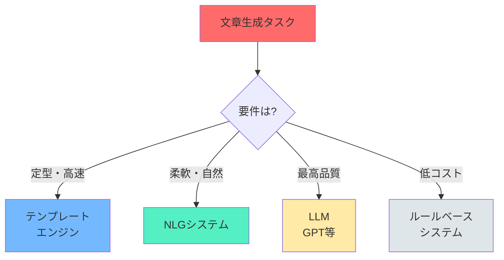

### 技術の選択基準

| シナリオ | 推奨技術 | 理由 |
|----------|----------|------|
| 定型フォーマット、高速処理 | テンプレートエンジン | シンプルで確実 |
| 自然な表現、中規模 | 従来型NLG | バランスが良い |
| 高品質、多様な表現 | LLM（GPT等） | 最も自然 |
| コスト重視、シンプル | ルールベース | 低コスト |

### 競合技術

**1. 大規模言語モデル（LLM）**
GPT-4、Claude、Geminiなど。より広範な能力を持ち、専用NLGシステムの多くの用途を代替しつつあります。

**2. テンプレートエンジン**
シンプルな文書生成では、複雑なNLGより効率的な場合があります。

**3. ハイブリッドアプローチ**
NLGとテンプレート、LLMの組み合わせ。それぞれの長所を活かした手法が注目されています。

## 🌍 実世界への影響とその後の発展

### 社会への影響

**1. 情報アクセスの民主化**
複雑なデータを誰もが理解できる文章に変換することで、情報格差を縮小します。

**2. 労働市場の変化**
定型的な文書作成業務が自動化される一方、AIの出力を監修・編集する新しい職種が生まれています。

**3. コミュニケーションの効率化**
企業は顧客とのコミュニケーションを大規模かつパーソナライズして行えるようになりました。

### 未来の発展方向

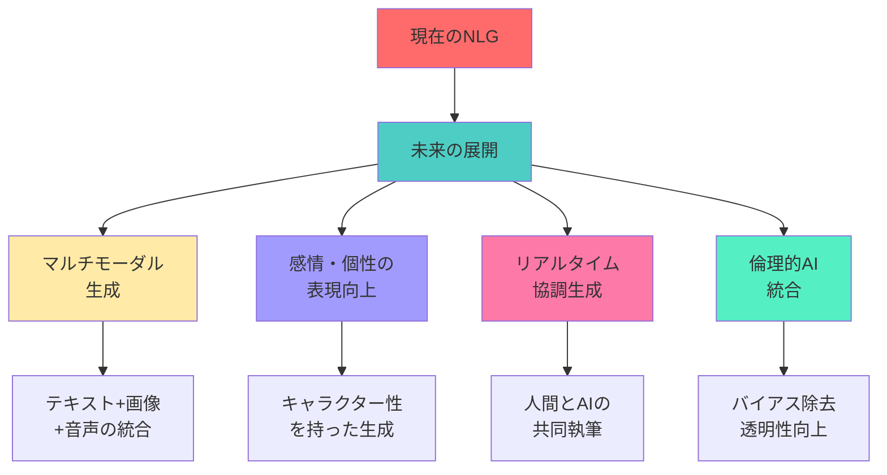

### 期待される進化

**1. マルチモーダル統合（2025-2030年）**
文章だけでなく、画像、音声、動画を組み合わせたコンテンツを自動生成できるようになります。

**2. パーソナライゼーションの深化**
個人の好み、文化的背景、知識レベルに完全に適応した文章生成が可能になります。

**3. 創造性の向上**
AIが単なる模倣を超えて、真に創造的な表現やストーリーテリングができるようになります。

**4. 倫理的配慮の組み込み**
バイアス除去、事実確認、透明性確保が標準機能として組み込まれます。

### 課題と展望

**技術的課題**
- 長文の一貫性維持
- 事実と虚構の区別
- 文化的ニュアンスの理解

**社会的課題**
- 偽情報拡散のリスク
- 著作権と創作性の境界
- 人間の仕事への影響

NLGは、人間の言語能力を補助・拡張する技術として、今後も進化し続けます。重要なのは、技術を適切に活用しながら、人間ならではの創造性や判断力を大切にすることです。

---
