自然言語処理（NLP：Natural Language Processing）に関連する技術のうち、意図理解（ Natural Language Understanding）について

# 自然言語理解（NLU）- 初学者のための完全ガイド

## 🔍 一言要約
人間の言葉の「意味」を機械に理解させる技術

## 📚 目次
1. はじめに
2. 基本構造
3. 主要技術
4. 時代背景と発見に至った経緯
5. 関連する用語
6. メリットとデメリット
7. 応用と実例
8. 置換と変遷
9. 代替と競合
10. 実世界への影響とその後の発展

## 🌟 はじめに

「今日は気分が良い」という言葉を聞いたとき、人間は自動的に「話し手が嬉しい状態にある」と理解します。しかしコンピュータにとって、これは単なる文字の羅列です。

**自然言語理解（NLU）** は、この「文字の羅列」から「話し手の意図や感情」を読み取る技術です。Siriに「近くのカフェを探して」と言えば店を探してくれるのも、チャットボットが質問に答えられるのも、すべてNLUのおかげです。

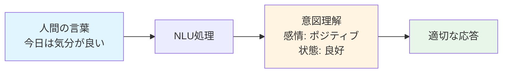

## 🏗️ 基本構造

NLUは「言葉を理解する」ために、段階的に情報を分析します。

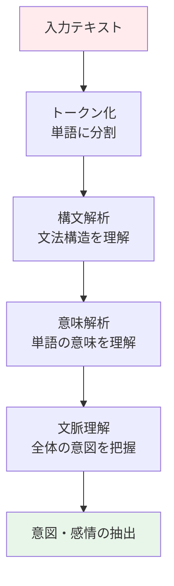

### 処理の流れを日常例で理解

**入力**: 「明日の天気を教えて」

1. **トークン化**: 「明日」「の」「天気」「を」「教えて」に分割
2. **構文解析**: 「明日」が時間、「天気」が対象、「教えて」が依頼と認識
3. **意味解析**: 「教えて」=情報を求めている
4. **文脈理解**: 天気予報を求めている
5. **意図抽出**: 「天気予報の検索」という行動が必要

## ⚡ 主要技術

### 1. 意図認識（Intent Recognition）

「何をしたいのか」を特定する技術。

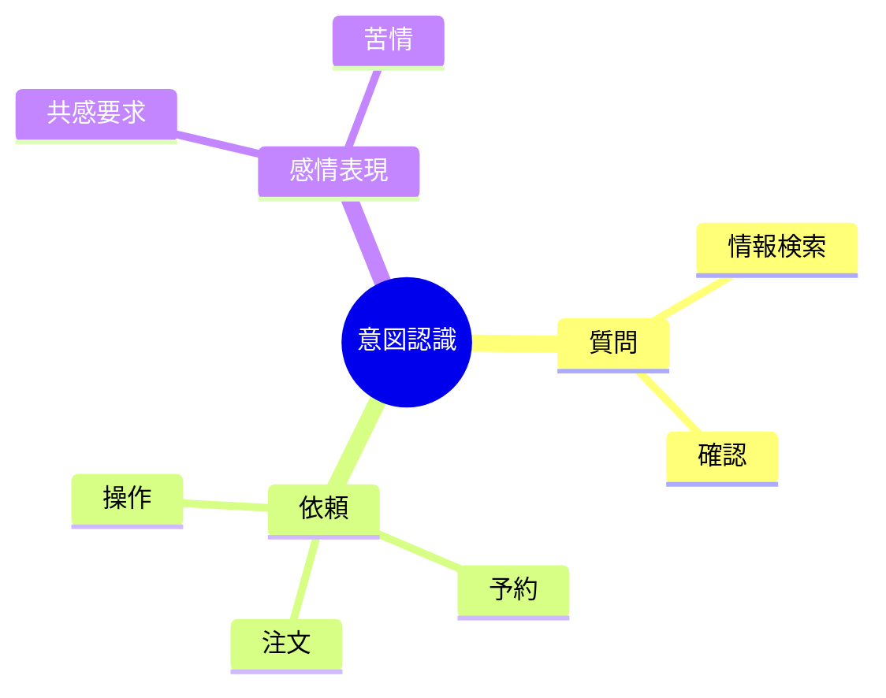

**例**:
- 「レストランを予約したい」→ 意図: 予約
- 「この商品はいくら？」→ 意図: 価格照会
- 「困った…」→ 意図: サポート要求

### 2. エンティティ抽出（Entity Extraction）

文中の重要な情報（人名、場所、日時など）を抜き出す技術。

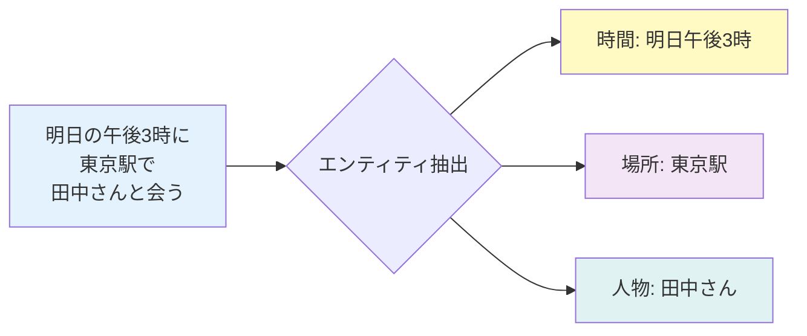

### 3. 感情分析（Sentiment Analysis）

文章が「ポジティブ」「ネガティブ」「中立」のどれかを判定。

**例**:
- 「この映画、最高だった！」→ ポジティブ
- 「配達が遅すぎる」→ ネガティブ
- 「注文番号は12345です」→ 中立

### 4. 文脈理解（Context Understanding）

前後の会話を踏まえた理解。

**会話例**:
- 人: 「ピザを注文したい」
- AI: 「サイズはいかがですか？」
- 人: 「Lで」← AIは「L」が「ピザのサイズ」と理解

## 📜 時代背景と発見に至った経緯

### 1950年代: チューリングテストの提唱

アラン・チューリングが「機械は考えられるか？」という問いを投げかけます。これがNLU研究の出発点でした。

### 1960-70年代: ルールベース時代

「if-then」の規則を大量に作る方法が主流でした。

**例**: 「〜を教えて」という言葉があれば→情報検索と判断

**問題点**: 言い回しは無限にあり、すべてルール化するのは不可能でした。

### 1980-90年代: 統計的手法の登場

大量のテキストデータから「パターン」を学習する方法が生まれました。

### 2000年代: 機械学習の本格化

Google検索の精度向上、スパムフィルターなど、実用的なNLUが登場。

### 2010年代: ディープラーニング革命

**転換点**: Word2Vec（2013年）→ 言葉を数値ベクトルで表現
- 「王様 - 男性 + 女性 = 女王」のような計算が可能に

### 2018年以降: Transformer時代

**BERT、GPTの登場** → 人間レベルの理解が実現

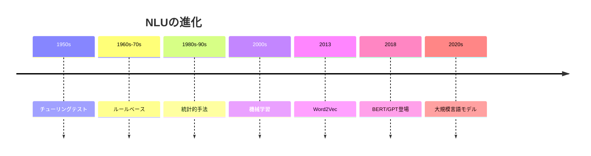

## 📗 関連する用語

### 同義語・関連語
- **自然言語処理（NLP）**: NLUを含む、言葉を扱う技術全般
- **意図理解**: NLUと同じ意味で使われることも
- **意味理解**: NLUの一部機能

### 対義語
- **自然言語生成（NLG）**: 機械が人間の言葉を「作る」技術

### 親子関係

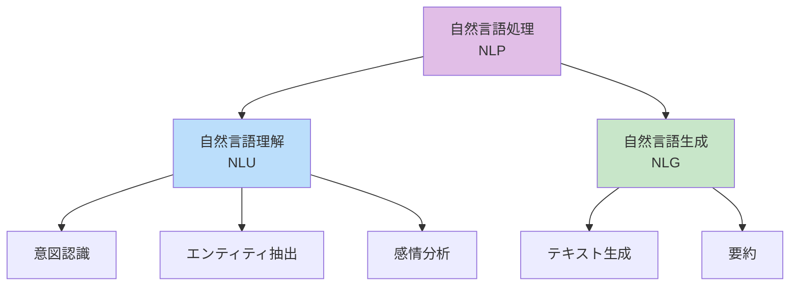

### 類義語の比較

| 用語 | 焦点 | 例 |
|------|------|-----|
| NLU | 意味・意図の理解 | 「予約したい」→予約の意図 |
| 構文解析 | 文法構造の分析 | 主語・述語の特定 |
| 意味解析 | 単語の意味 | 「バンク」=銀行？土手？ |

## 💡 メリットとデメリット

### メリット

1. **人間らしいやり取りが可能**
   - 「ちょっと寒いな」→エアコンをつける（スマートホーム）

2. **大量データの自動処理**
   - カスタマーレビュー1万件を自動で感情分析

3. **多言語対応**
   - 一つのシステムで複数言語に対応可能

4. **24時間対応**
   - チャットボットによる休日・深夜のサポート

### デメリット

1. **文脈の誤解**
   - 「熱い戦いだった」→温度ではなく激しさの意味

2. **皮肉・冗談の理解困難**
   - 「最高だね（皮肉）」をポジティブと誤判定

3. **文化的背景の理解不足**
   - 「空気を読む」のような文化特有の表現

4. **学習データへの依存**
   - 偏ったデータで学習すると偏った理解に

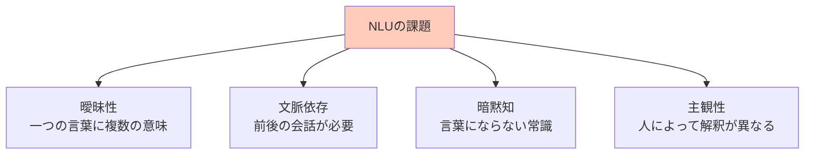

## 🚀 応用と実例

### 身近な応用例

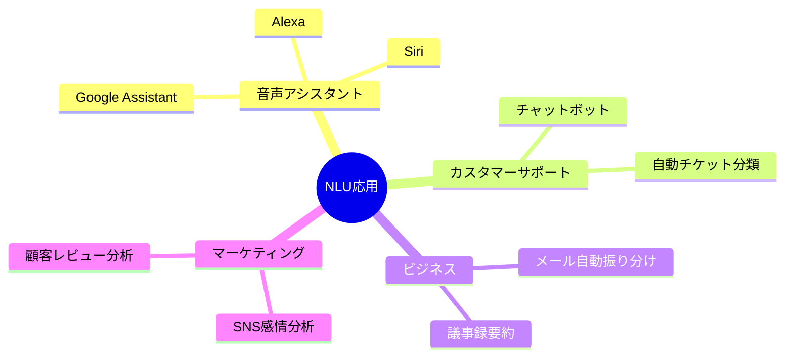

### 1. スマートスピーカー
「タイマー5分」→ タイマー設定の意図 + 5分というエンティティを抽出

### 2. メール自動振り分け
「至急対応をお願いします」→緊急メールと判定し優先フォルダへ

### 3. SNSモニタリング
企業が自社製品への言及を分析
- ポジティブ: 70% → 好調
- ネガティブ: 30% → 改善点を特定

### 4. 医療分野
患者の症状記述から病名候補を提示
「頭が痛くて吐き気がする」→偏頭痛、脳震盪などの可能性

### 5. 金融
ニュース記事から株価への影響を予測
「○○社が新製品発表」→ポジティブニュースと判定

## 🔄 置換と変遷

### 何を置き換えたか

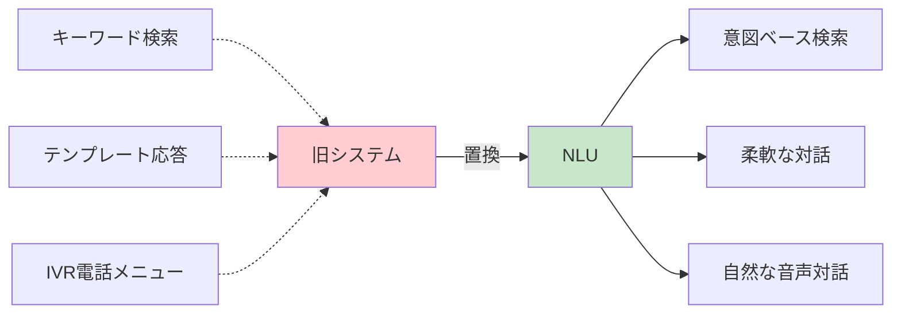

**具体例**:
- **キーワード検索** → **意図ベース検索**
  - 従来: 「パスワード リセット」と正確に入力
  - NLU: 「ログインできない」で意図を理解

- **IVR（音声ガイダンス）** → **自然な対話**
  - 従来: 「予約は1を、キャンセルは2を押してください」
  - NLU: 「予約したいんだけど」で直接理解

### 何に置き換えられつつあるか

**マルチモーダル理解**へ進化中
- NLU（テキストのみ）→ 画像+音声+テキストの統合理解

**例**: 「これ美味しそう（写真を見せながら）」
- NLU単独: 「これ」が何か不明
- マルチモーダル: 写真を見て料理と理解

### 継承と発展

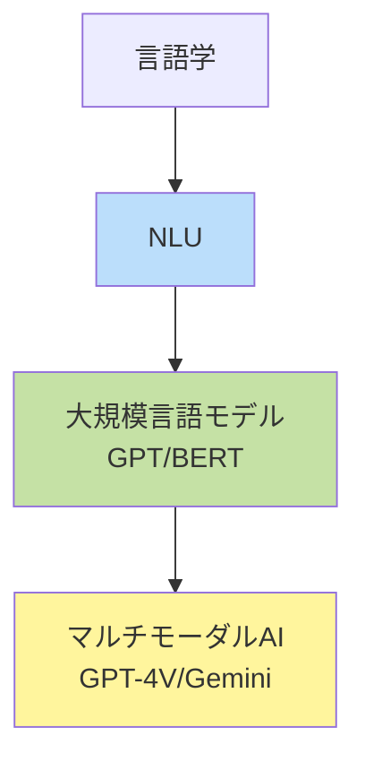

## 🌐 代替と競合

### 代替可能性

| シナリオ | NLU | 代替手段 | 優劣 |
|----------|-----|----------|------|
| 簡単な問い合わせ | ○ | FAQページ | NLUが便利 |
| 複雑な相談 | △ | 人間オペレーター | 人間が確実 |
| 定型業務 | ○ | RPAツール | 使い分け |

### 競合技術

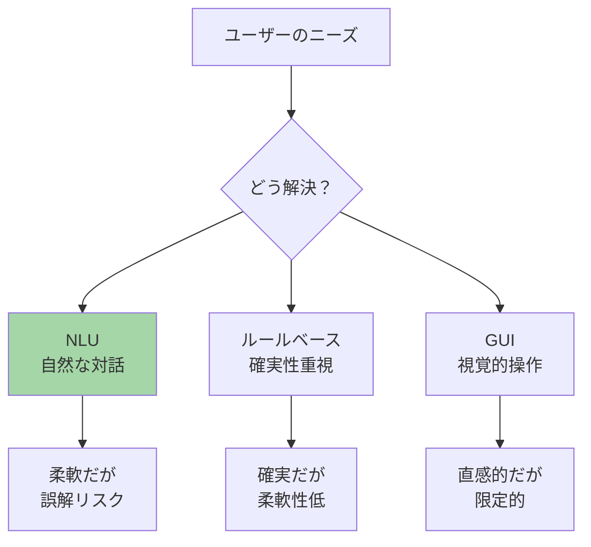

**競合例**:
1. **ルールベースシステム**
   - 金融取引など、誤解が許されない分野では依然として主流

2. **GUI（グラフィカルユーザーインターフェース）**
   - ボタンやメニューでの操作の方が明確な場合も

3. **音声認識（Speech Recognition）**
   - NLUと組み合わせて使うが、単独でも動作可能

## 🌍 実世界への影響とその後の発展

### 社会への影響

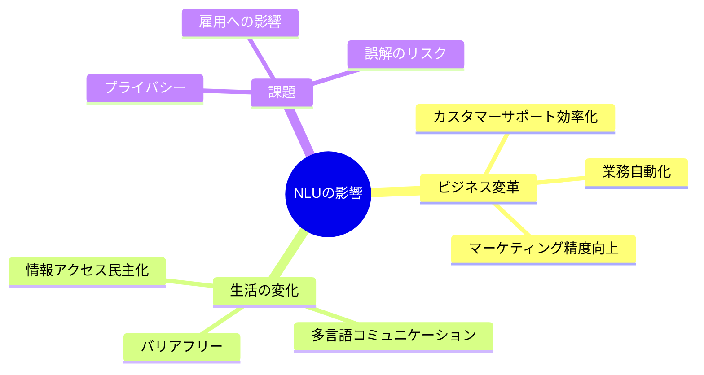

### 具体的な変化

1. **カスタマーサポート革命**
   - 対応時間: 48時間 → 即時
   - コスト削減: 人件費の30-50%削減

2. **アクセシビリティ向上**
   - 視覚障害者が音声で情報検索
   - 高齢者が複雑な操作なしにサービス利用

3. **言語の壁を越える**
   - リアルタイム翻訳で国際ビジネスが円滑に

### 今後の発展予測

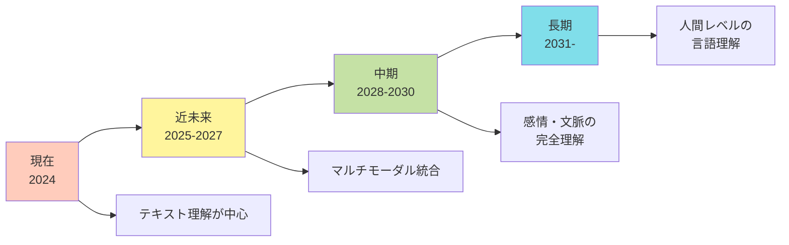

### 期待される進化

1. **感情のニュアンス理解**
   - 「大丈夫」が本当に大丈夫か、気を遣っているかを判別

2. **文化的文脈の理解**
   - 「恐れ入ります」のような日本特有の表現を正確に理解

3. **個人化**
   - ユーザーごとの言い回しや好みを学習

4. **倫理的AI**
   - 偏見を排除し、公平な理解を実現

### 未解決の課題

- **常識の理解**: 「氷は冷たい」のような当たり前の知識
- **創造的言語**: 新語、造語、詩的表現
- **深い推論**: 「なぜそう思うか」の理由まで理解

---

## 🎓 次のステップ

NLUを理解したあなたは、次にこれらを学ぶと良いでしょう:
1. **機械学習の基礎** - NLUの仕組みをより深く
2. **Transformerアーキテクチャ** - 最新NLUの心臓部
3. **プロンプトエンジニアリング** - NLUを活用する技術
