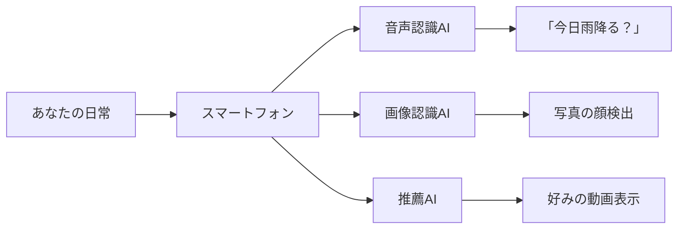
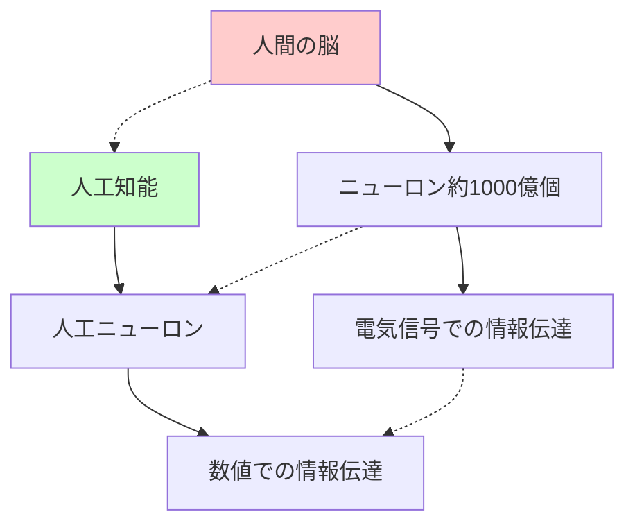
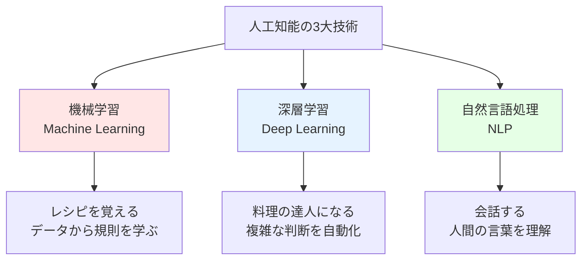
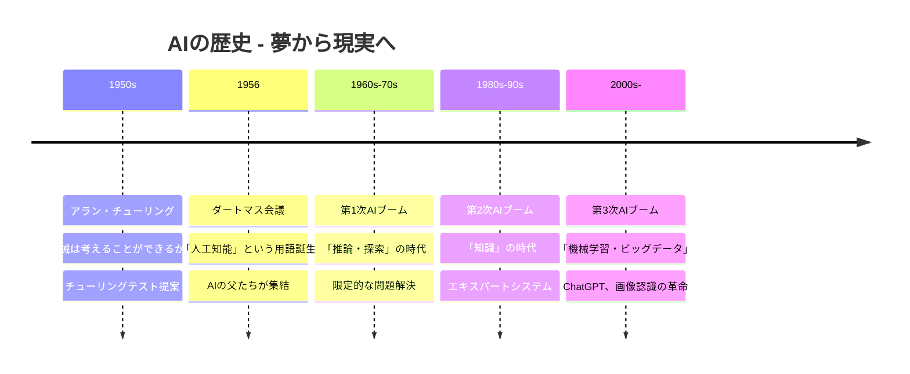
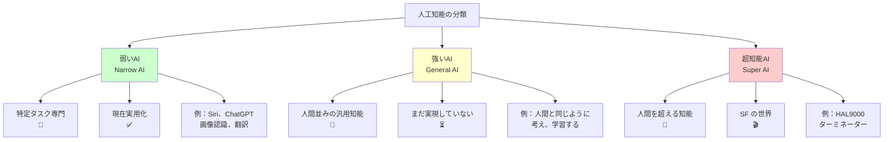
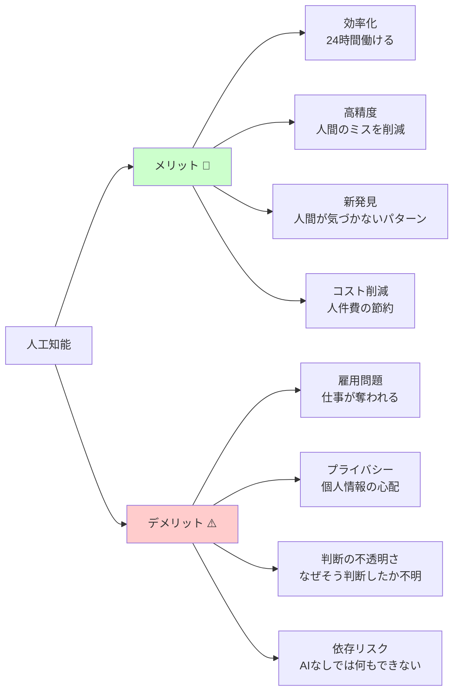
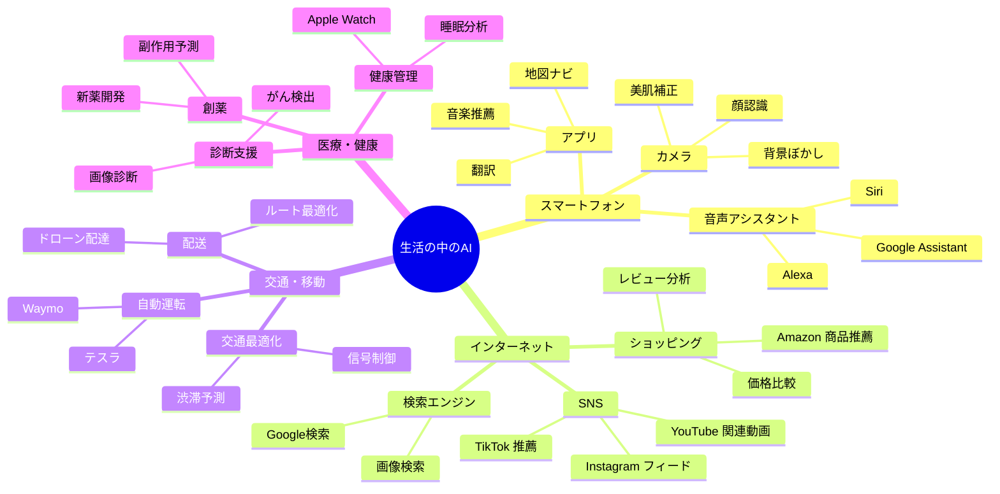
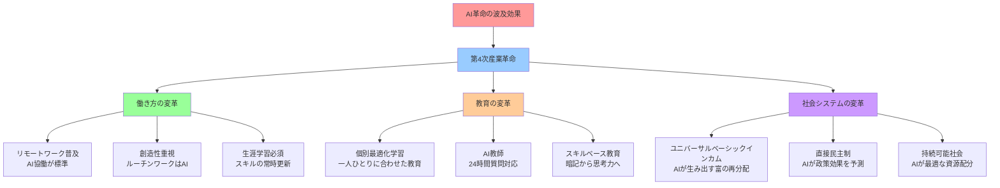

# 人工知能 - 初学者のための完全ガイド

## 🔍 一言要約
**人間の知能を模倣して、学習・推論・判断を行うコンピュータ技術**

## 📚 目次
1. [🌟 はじめに - AIって実は身近にある](#はじめに)
2. [🏗️ AIの基本構造 - 脳の真似事から始まった](#基本構造)
3. [⚡ 主要技術 - 3つの魔法の技術](#主要技術)
4. [📜 歴史 - 夢想家たちの70年間の挑戦](#歴史)
5. [🎨 AIの種類 - 弱いAIから強いAIまで](#種類)
6. [💡 メリットとデメリット - 光と影](#メリットデメリット)
7. [🚀 実用化の例 - あなたの生活を変えるAI](#実用化)
8. [🌍 未来への影響 - 人類の次のステップ](#未来影響)

## 🌟 はじめに {#はじめに}

「人工知能（AI）」と聞くと、SF映画のロボットを想像するかもしれません。でも実際は、**あなたが毎日使っているスマートフォン**の中にもうAIが住んでいます。

音声アシスタントに「今日の天気は？」と聞いたり、写真アプリが自動で人の顔を認識したり、YouTubeがあなたの好みに合った動画を勧めてくれる――これらすべてがAIの仕事です。

## 🏗️ AIの基本構造 - 脳の真似事から始まった {#基本構造}

AIの基本的な仕組みは、意外にも**人間の脳を真似る**ことから始まりました。

人間の脳には約1000億個の神経細胞（ニューロン）があり、それらが電気信号でやり取りして、考えたり記憶したりしています。AIは、この神経細胞のネットワークをコンピュータで再現したものです。

### AIの3つの基本能力

1. **学習能力** - たくさんのデータから規則性を見つける
2. **推論能力** - 学んだことを使って新しい問題を解く
3. **判断能力** - 複数の選択肢から最適なものを選ぶ

## ⚡ 主要技術 - 3つの魔法の技術 {#主要技術}

AIには大きく分けて3つの主要技術があります。これらは**料理に例える**とわかりやすいでしょう。

### 🍳 機械学習（Machine Learning）
**料理のレシピを覚えるようなもの**

たとえば、「美味しいケーキの作り方」を覚えるとき、人間は何度も作って失敗と成功を繰り返します。機械学習も同じで、大量のデータ（レシピ）を見て、「どんな材料の組み合わせが美味しいケーキになるか」を学習します。

### 🧠 深層学習（Deep Learning）
**ミシュランシェフになるようなもの**

普通の料理人が基本的なレシピを覚えるのに対し、深層学習は「食材を見ただけで最適な調理法を判断できる達人シェフ」のようなものです。画像認識や音声認識で驚異的な性能を発揮します。

### 💬 自然言語処理（NLP）
**多言語で会話できるようなもの**

人間が話す言葉（日本語、英語など）をコンピュータが理解し、適切に応答する技術です。ChatGPTやGoogle翻訳などがこの技術を使っています。

## 📜 歴史 - 夢想家たちの70年間の挑戦 {#歴史}

AIの歴史は、まるで**冒険小説**のようにドラマチックです。

### 🧔 アラン・チューリング - AIの預言者（1950年）
**「コンピュータが人間のように考えることができるだろうか？」**

第二次世界大戦中、ドイツの暗号「エニグマ」を解読した天才数学者チューリングは、この壮大な疑問を世界に投げかけました。彼が提案した「チューリングテスト」は、今でもAIの知能を測る基準として使われています。

### 👨‍🔬 ダートマス会議 - AIの誕生日（1956年）
ダートマス大学で開かれたこの会議で、「Artificial Intelligence（人工知能）」という言葉が正式に生まれました。まるで新しい生命体に名前をつける瞬間のような、歴史的な出来事でした。

### 🎢 3回のブーム - 期待と失望の波
AIの歴史は**ジェットコースター**のようです。大きな期待で始まり、技術の限界で失望され、また新しい技術で復活する――これを3回繰り返して、今の時代にたどり着きました。

## 🎨 AIの種類 - 弱いAIから強いAIまで {#種類}

AIには大きく分けて2つのレベルがあります。現在私たちが使っているAIは、すべて「弱いAI」と呼ばれるものです。

### 🎯 弱いAI（Narrow AI）- 専門家タイプ
**「一つのことだけ、でも人間よりずっと上手」**

- **将棋AI**: 将棋だけなら世界チャンピオンに勝てるが、オセロのルールは知らない
- **翻訳AI**: 100ヶ国語を瞬時に翻訳するが、翻訳した内容の意味は理解していない
- **画像認識AI**: 数万枚の写真から猫を見つけるのは得意だが、その猫がかわいいかは判断できない

### 🧠 強いAI（General AI）- 天才タイプ
**「人間と同じように、何でもできる」**

まだ実現していませんが、人間のように様々な分野で学習し、判断し、創造できるAIです。これが実現すれば、人間の知的作業のほとんどをAIが代替できるようになります。

### 🚀 超知能AI（Super AI）- 神タイプ
**「人間の知能を遥かに超越」**

現在はSFの世界の話ですが、もし実現すれば、人間が理解できないレベルの知能を持つことになります。

## 💡 メリットとデメリット - 光と影 {#メリットデメリット}

AIは私たちの生活を豊かにする一方で、新しい課題も生み出しています。

### 🌟 メリット：人間を超える能力
- **疲れ知らず**: 24時間365日、休憩なしで働ける
- **完璧な記憶**: 一度学んだことは絶対に忘れない
- **高速処理**: 人間が1時間かかることを1秒で完了
- **客観的判断**: 感情に左右されない冷静な判断

### ⚠️ デメリット：新しい課題
- **雇用への影響**: 単純作業から専門職まで、多くの仕事がAIに置き換わる可能性
- **プライバシーの問題**: AIが個人データを大量に収集・分析する
- **ブラックボックス問題**: なぜAIがその判断をしたのか、人間には理解できない
- **依存のリスク**: AIに頼りすぎて、人間の能力が退化する可能性

## 🚀 実用化の例 - あなたの生活を変えるAI {#実用化}

AIはもはや未来の技術ではありません。今この瞬間も、あなたの身の回りで活躍しています。

### 📱 身近なAI体験
**今すぐできるAI体験チェックリスト：**

- [ ] スマホで「OK Google」や「Hey Siri」と話しかける
- [ ] 写真アプリで人の顔が自動で囲まれるのを確認する
- [ ] YouTubeの「関連動画」を見てみる（これもAI！）
- [ ] Google翻訳で外国語を日本語に変換する
- [ ] Amazonで「この商品を買った人はこんな商品も見ています」を確認
- [ ] Google Mapsで最短ルートを検索する

### 🏥 医療分野での革命
AIは医療の世界を大きく変えています：

- **がんの早期発見**: AIが医師よりも早く、正確にがんを見つける
- **新薬開発**: 通常10年かかる新薬開発を3年に短縮
- **個別化医療**: 患者一人ひとりに最適な治療法を提案

### 🚗 交通の未来
- **自動運転車**: 2030年代には完全自動運転が実用化予定
- **交通渋滞ゼロ**: AIが信号を制御し、最適な交通フローを実現
- **事故の激減**: 人間のミスによる交通事故を大幅に削減

## 🌍 未来への影響 - 人類の次のステップ {#未来影響}

AIの発展は、産業革命に匹敵する、いや、それを超える変革をもたらすと予測されています。

### 🔮 10年後の世界予測（2035年）
**あなたの一日はこう変わる：**

**朝6:00** - AIアシスタントがあなたの体調、天気、スケジュールを分析して最適な起床時間を決定

**朝8:00** - 自動運転車があなたを迎えに来て、移動中にAIが今日の重要情報をブリーフィング

**朝9:00** - オフィスで人間は創造的な仕事に集中、データ分析や報告書作成はAIが担当

**昼12:00** - AIが栄養バランスと好み、予算を考慮してランチを提案

**午後** - AIが会議の議事録を自動作成、重要なポイントを整理して共有

**夕方** - AIが最適な帰宅ルートと夕食メニューを提案

**夜** - AIが一日の活動データを分析して、健康アドバイスと明日の予定を最適化

### 🎓 教育革命
**学校はこう変わる：**

- **個別指導教師AI**: 各生徒に専用のAI教師がつき、理解度に合わせて説明
- **実践的学習**: 知識の暗記ではなく、問題解決能力と創造性を重視
- **グローバル教室**: 世界中の生徒とAI翻訳でリアルタイム交流

---

## 🎯 学習の次のステップ

このガイドを読んだあなたは、もうAI初心者ではありません！次は以下のステップで学習を深めてください：

### 🚀 すぐにできること
1. **ChatGPT** や **Claude** を使って、AIとの対話を体験
2. **Google Colab** で簡単なPythonコードを動かしてみる
3. **Coursera** や **edX** でAIの無料講座を受講

### 📖 深く学ぶなら
1. **機械学習の数学的基礎**（統計学、線形代数）
2. **プログラミング言語**（Python、R）
3. **AIの社会的影響**（倫理、法律、経済）

### 🔗 おすすめリソース
- [機械学習入門](/docs/ml-introduction.md)
- [AI倫理ガイド](/docs/ai-ethics-guide.md)
- [プログラミング不要のAI活用法](/docs/no-code-ai.md)

---

