# 人工知能 完全理解ガイド 2025 🧠✨

## 🌟 一言要約
**「AIは現代の魔法 - 人間の知能をコンピューターで再現し、私たちの生活を革命的に変える技術」**

## 📖 目次

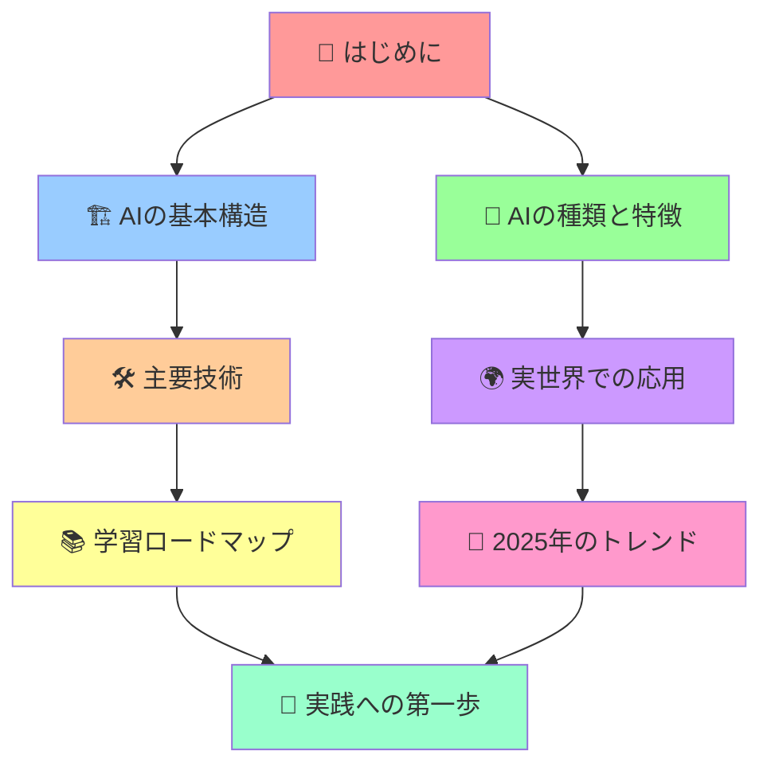

## 🚀 はじめに - AIって結局何なの？

### 日常例えで理解する AI

想像してください。あなたが毎朝コーヒーを淹れるとき、以下のようなプロセスを経ていませんか？

1. **情報収集**: 今日の気分、天気、時間を確認
2. **判断**: どんなコーヒーが良いかを決定
3. **実行**: 実際にコーヒーを淹れる
4. **学習**: 「今日のは美味しかった/まずかった」を記憶

**AI（人工知能）は、まさにこの人間の思考プロセスをコンピューターで再現する技術です！**

### 🔥 なぜ今AIが熱いのか？

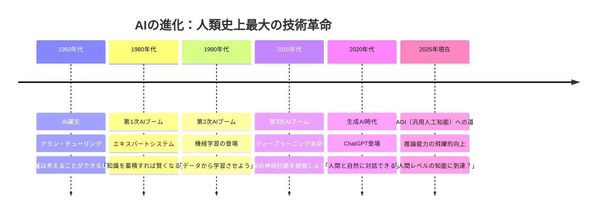

## 🏗️ AIの基本構造 - 料理に例えると

AIを料理に例えると、以下のようになります：

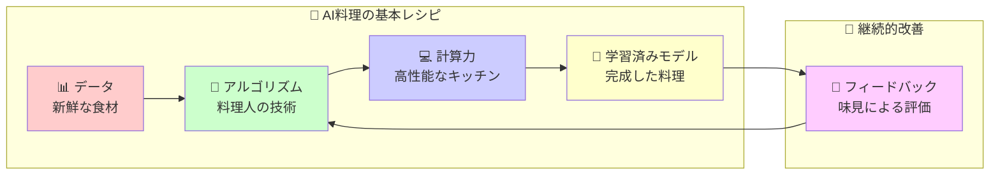

### 🧩 AIの4つの基本要素

1. **データ（食材）** 📊
   - 例：写真、テキスト、音声、数値
   - 品質が良いほど、AIの性能も向上

2. **アルゴリズム（レシピ）** 🧠
   - 例：ニューラルネットワーク、決定木
   - データから規則性を見つける方法

3. **計算力（キッチン設備）** 💻
   - 例：GPU、クラウドコンピューティング
   - 大量の計算を高速で処理

4. **学習済みモデル（完成品）** 🎯
   - 例：ChatGPT、画像認識AI
   - 実際に問題を解決してくれるAI

## 🤖 AIの種類と特徴 - AIファミリーを知ろう

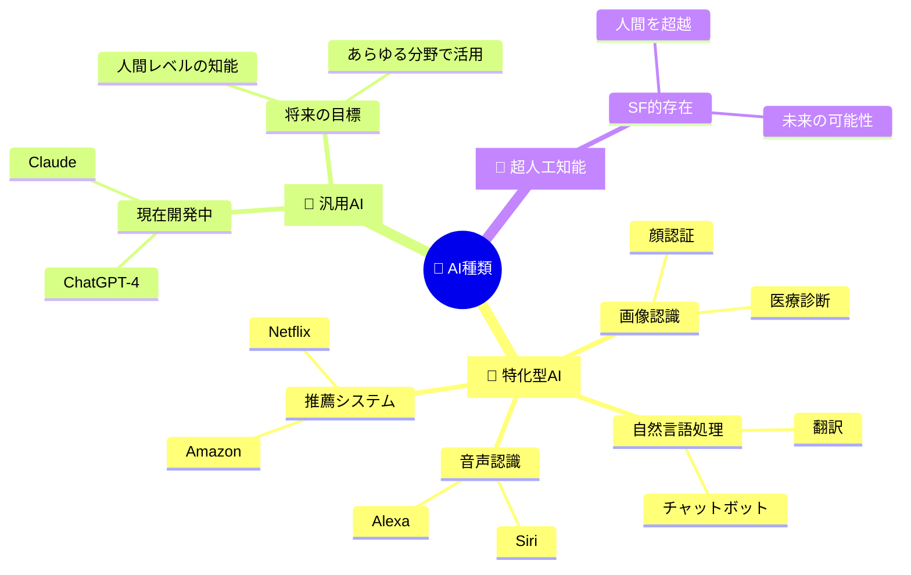

### 📊 AI技術の比較表

| AI技術 | 得意分野 | 身近な例 | 理解しやすい例え |
|--------|----------|----------|------------------|
| 🖼️ 画像認識 | 写真の内容理解 | Instagram自動タグ | 瞬時に写真を見て説明できる友達 |
| 🗣️ 音声認識 | 話し言葉の理解 | Google音声検索 | 完璧な聞き取り能力を持つ秘書 |
| 📝 自然言語処理 | 文章の理解・生成 | ChatGPT | 何でも知ってる博識な先生 |
| 🎯 推薦システム | 好みの予測 | Netflix映画推薦 | あなたの好みを完璧に理解する友人 |
| 🎮 強化学習 | 試行錯誤による学習 | AlphaGo | ゲームを練習して上達する子供 |

## 🛠️ 主要技術 - AIの魔法の正体

### 🧠 機械学習の3つのスタイル

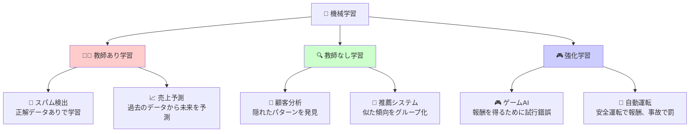

### 🌐 ディープラーニング - AIの最強技術

**人間の脳の神経回路を模倣した革命的技術！**

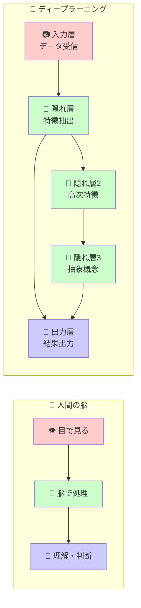

## 🌍 実世界での応用 - もうAIなしでは生きられない！

### 🏠 日常生活でのAI活用

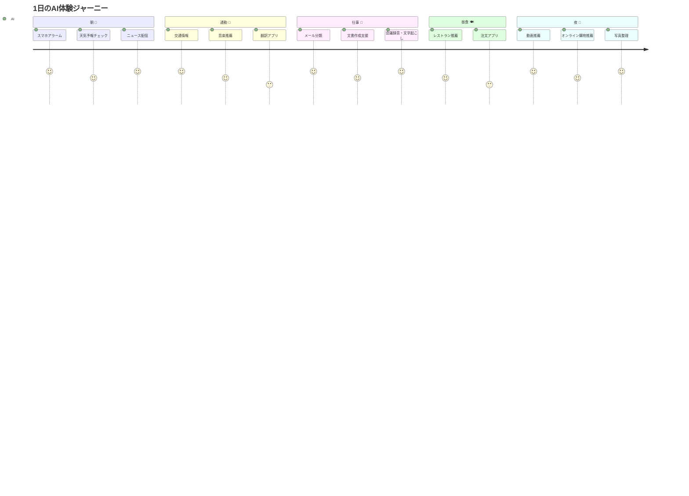

### 🏭 産業別AI革命

| 産業分野 | AI活用例 | 革命的効果 |
|----------|----------|------------|
| 🏥 医療 | 診断支援、新薬開発 | 早期発見率向上、治療期間短縮 |
| 🚗 交通 | 自動運転、交通最適化 | 事故削減、渋滞解消 |
| 🏭 製造業 | 品質管理、予知保全 | 不良品削減、コスト削減 |
| 💰 金融 | 不正検出、投資判断 | リスク削減、収益向上 |
| 🛍️ 小売業 | 需要予測、個別推薦 | 在庫最適化、売上向上 |
| 🎓 教育 | 個別学習、自動採点 | 学習効果向上、教師負担軽減 |

## 📚 学習ロードマップ - 0から専門家になる道筋

### 🎯 学習レベル別ガイド

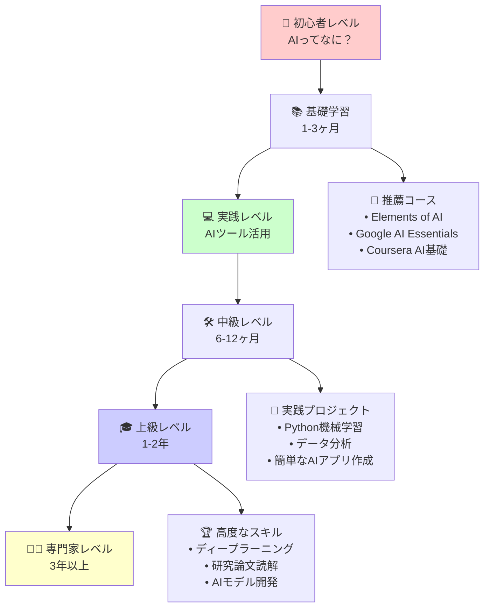

### 📚 レベル別詳細学習プラン

#### 🌱 **初心者レベル（1-3ヶ月）**
**目標**: AIの基本概念を理解し、日常的にAIツールを活用できる

**学習内容**:
- AI、機械学習、ディープラーニングの違い
- ChatGPT、Gemini等の生成AIツール活用
- AIの歴史と社会への影響

**実践課題**:
- ChatGPTで資料作成補助
- AI画像生成ツールでアート作成
- AI翻訳ツールで多言語コミュニケーション

#### 💻 **実践レベル（3-6ヶ月）**
**目標**: 基本的なデータ分析とAIツールのカスタマイズ

**学習内容**:
- Excel/Google SheetsでのAI機能活用
- ノーコード/ローコードAIツール
- データの可視化基礎

#### 🛠️ **中級レベル（6-12ヶ月）**
**目標**: プログラミングを使ったAI活用とモデル理解

**学習内容**:
- Python基礎とライブラリ（pandas, scikit-learn）
- 機械学習アルゴリズムの実装
- データ前処理と特徴量エンジニアリング

#### 🎓 **上級レベル（1-2年）**
**目標**: オリジナルAIモデルの開発と研究

**学習内容**:
- ディープラーニング（TensorFlow, PyTorch）
- 最新研究論文の理解と実装
- クラウドAIサービスの活用

#### 👨‍💼 **専門家レベル（3年以上）**
**目標**: AI戦略の立案と複雑なAIシステムの設計

**学習内容**:
- AI倫理とガバナンス
- 大規模AIシステムの設計
- ビジネスへのAI導入戦略

## 🔮 2025年のトレンド - 今起きている革命

### ⚡ 最新トレンド分析

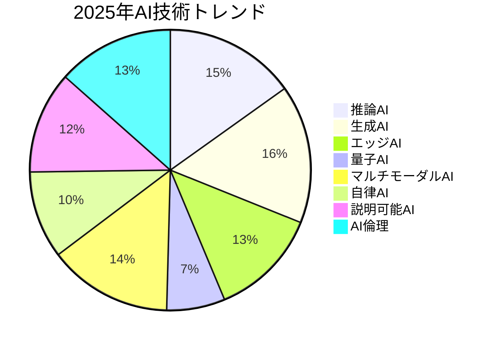

#### 🚀 **5大革命的トレンド**

1. **🧠 推論AI - 考える力の飛躍**
   - <cite index="5-1">AI reasoning技術の急速な発展</cite>
   - 単なる情報処理から論理的思考へ
   - 数学問題、複雑な問題解決が可能に

2. **⚡ エッジAI - スマートデバイス革命**
   - <cite index="2-1">ハードウェアコスト削減とエネルギー効率向上</cite>
   - スマートフォンでの高性能AI処理
   - リアルタイム応答、プライバシー保護

3. **🎭 マルチモーダルAI - 五感を持つAI**
   - テキスト、画像、音声、動画を統合理解
   - より人間らしい対話と理解
   - リッチなクリエイティブ創作

4. **🏢 企業AI導入加速**
   - <cite index="6-1">2025年までにAI市場規模が年120%成長予測</cite>
   - <cite index="9-1">企業のAIガバナンス体制構築が必須に</cite>
   - 業務効率化から戦略的競争優位へ

5. **⚖️ AI倫理・責任あるAI**
   - <cite index="1-1">AIの感情知能向上によりより自然な交流が可能</cite>
   - プライバシー保護とパーソナライゼーションの両立
   - AI開発における透明性と説明可能性

### 📊 注目すべき統計データ

## 🎯 実践への第一歩 - 今日からできること

### 🚀 **今すぐ始められる7つのアクション**

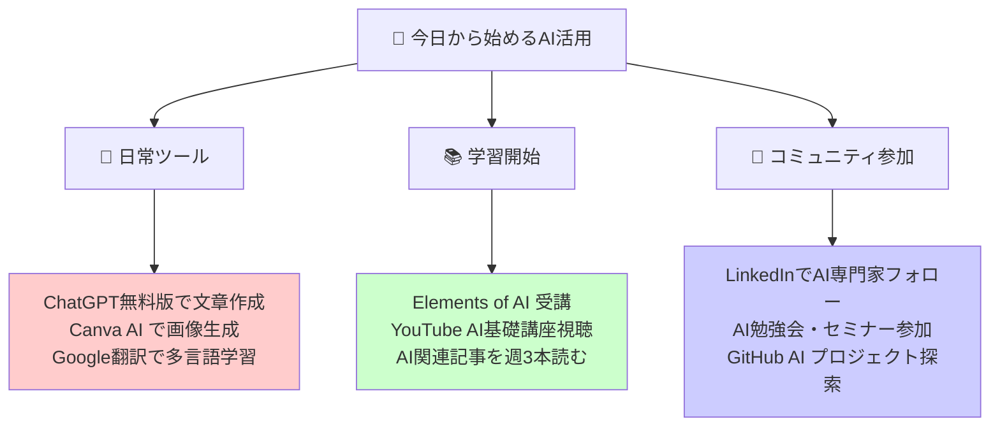

### 🎪 **実践チャレンジ - 30日間AIマスタープラン**

#### **第1週: AI体験ウィーク** 🎮
- [ ] ChatGPTで履歴書を改善
- [ ] AI画像生成でSNSアイコン作成  
- [ ] 音声AIでプレゼン練習
- [ ] AI翻訳で外国語記事読解

#### **第2週: AIツール探検ウィーク** 🔍
- [ ] 業務に使えるAIツール5個を試用
- [ ] AI搭載アプリを3個ダウンロード
- [ ] Excelの AI機能を活用
- [ ] AI ニュースアプリで情報収集習慣化

#### **第3週: AI学習ウィーク** 📖
- [ ] Elements of AI コース開始
- [ ] YouTube AI講座を毎日1本視聴
- [ ] AI関連書籍を1冊読破開始
- [ ] オンラインAI勉強会に参加

#### **第4週: AI創造ウィーク** 🎨
- [ ] AIと協力して創作活動
- [ ] 简単な分析レポート作成
- [ ] AI活用アイデアを10個考案
- [ ] 学習成果をSNSでシェア

### 🌐 **おすすめリソース集**

#### 📚 **無料学習プラットフォーム**

#### 🎓 **専門コース**

#### 📰 **最新情報源**

### 🎪 **コミュニティと交流**

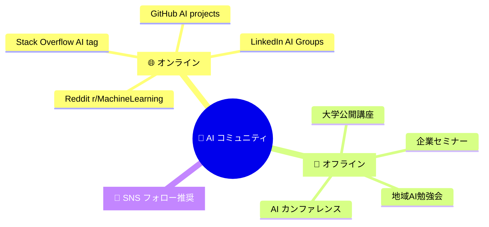

## 🌟 まとめ - AI時代を生き抜く知恵

**人工知能は、もはや遠い未来の技術ではありません。今この瞬間も、私たちの生活のあらゆる場面でAIが活躍しています。**

### 🎯 **覚えておきたい3つの真実**

1. **🚀 AIは道具である** - 包丁と同じで、使い方次第で料理も殺人もできる
2. **📈 AIは加速している** - <cite index="1-1,2-1">2025年はAI推論能力とエネルギー効率が飛躍的向上</cite>
3. **🤝 AIと共存する時代** - 敵対ではなく協働がキーワード

### 🌈 **あなたの AI ジャーニーは今日から始まる**

AI学習は筋トレと同じ。毎日少しずつでも継続することで、気がつけば専門的な知識とスキルを身につけることができます。

**今日という日は、残りの人生で一番若い日です。AIという最強のパートナーと出会うには、まさに今がベストタイミング！**

### 🚀 **次のアクション**

1. この資料をブックマーク 📌
2. 1つでも気になったAIツールを試してみる 🔧
3. AI関連の最新ニュースを購読する 📰
4. 友人とAIの話題で盛り上がる 💬
5. 30日後、自分の成長を振り返る 📈

---

**「AIの未来を予測する最良の方法は、AIを創ることである」**

*さあ、一緒にAIの魔法を学び、未来を創造しましょう！* 🎭✨

---

*最終更新: 2025年8月31日*

  "https://github.com/SparklingDetergent/doc_genai_Exploring_mental_model_cons…ion_visualization_and_extraction/blob/main/AI/README.MD#人工知能-完全理解ガイド-2025-",
  "https://github.com/SparklingDetergent/doc_genai_Exploring_mental_model_construction_visualization_and_extraction/blob/main/AI/README.MD#-一言要約",
  "https://github.com/SparklingDetergent/doc_genai_Exploring_mental_model_construction_visualization_and_extraction/blob/main/AI/README.MD#-目次",
  "https://github.com/SparklingDetergent/doc_genai_Exploring_mental_model_cons…tion_visualization_and_extraction/blob/main/AI/README.MD#-はじめに---aiって結局何なの",
  "https://github.com/SparklingDetergent/doc_genai_Exploring_mental_model_construction_visualization_and_extraction/blob/main/AI/README.MD#日常例えで理解する-ai",
  "https://github.com/SparklingDetergent/doc_genai_Exploring_mental_model_construction_visualization_and_extraction/blob/main/AI/README.MD#-なぜ今aiが熱いのか",
  "https://github.com/SparklingDetergent/doc_genai_Exploring_mental_model_cons…on_visualization_and_extraction/blob/main/AI/README.MD#️-aiの基本構造---料理に例えると",
  "https://github.com/SparklingDetergent/doc_genai_Exploring_mental_model_construction_visualization_and_extraction/blob/main/AI/README.MD#-aiの4つの基本要素",
  "https://github.com/SparklingDetergent/doc_genai_Exploring_mental_model_cons…isualization_and_extraction/blob/main/AI/README.MD#-aiの種類と特徴---aiファミリーを知ろう",
  "https://github.com/SparklingDetergent/doc_genai_Exploring_mental_model_construction_visualization_and_extraction/blob/main/AI/README.MD#-ai技術の比較表",
  "https://github.com/SparklingDetergent/doc_genai_Exploring_mental_model_cons…tion_visualization_and_extraction/blob/main/AI/README.MD#️-主要技術---aiの魔法の正体",
  "https://github.com/SparklingDetergent/doc_genai_Exploring_mental_model_construction_visualization_and_extraction/blob/main/AI/README.MD#-機械学習の3つのスタイル",
  "https://github.com/SparklingDetergent/doc_genai_Exploring_mental_model_cons…n_visualization_and_extraction/blob/main/AI/README.MD#-ディープラーニング---aiの最強技術",
  "https://github.com/SparklingDetergent/doc_genai_Exploring_mental_model_cons…ualization_and_extraction/blob/main/AI/README.MD#-実世界での応用---もうaiなしでは生きられない",
  "https://github.com/SparklingDetergent/doc_genai_Exploring_mental_model_construction_visualization_and_extraction/blob/main/AI/README.MD#-日常生活でのai活用",
  "https://github.com/SparklingDetergent/doc_genai_Exploring_mental_model_construction_visualization_and_extraction/blob/main/AI/README.MD#-産業別ai革命",
  "https://github.com/SparklingDetergent/doc_genai_Exploring_mental_model_cons…isualization_and_extraction/blob/main/AI/README.MD#-学習ロードマップ---0から専門家になる道筋",
  "https://github.com/SparklingDetergent/doc_genai_Exploring_mental_model_construction_visualization_and_extraction/blob/main/AI/README.MD#-学習レベル別ガイド",
  "https://github.com/SparklingDetergent/doc_genai_Exploring_mental_model_construction_visualization_and_extraction/blob/main/AI/README.MD#-レベル別詳細学習プラン",
  "https://github.com/SparklingDetergent/doc_genai_Exploring_mental_model_construction_visualization_and_extraction/blob/main/AI/README.MD#-初心者レベル1-3ヶ月",
  "https://github.com/SparklingDetergent/doc_genai_Exploring_mental_model_construction_visualization_and_extraction/blob/main/AI/README.MD#-実践レベル3-6ヶ月",
  "https://github.com/SparklingDetergent/doc_genai_Exploring_mental_model_construction_visualization_and_extraction/blob/main/AI/README.MD#️-中級レベル6-12ヶ月",
  "https://github.com/SparklingDetergent/doc_genai_Exploring_mental_model_construction_visualization_and_extraction/blob/main/AI/README.MD#-上級レベル1-2年",
  "https://github.com/SparklingDetergent/doc_genai_Exploring_mental_model_construction_visualization_and_extraction/blob/main/AI/README.MD#-専門家レベル3年以上",
  "https://github.com/SparklingDetergent/doc_genai_Exploring_mental_model_cons…visualization_and_extraction/blob/main/AI/README.MD#-2025年のトレンド---今起きている革命",
  "https://github.com/SparklingDetergent/doc_genai_Exploring_mental_model_construction_visualization_and_extraction/blob/main/AI/README.MD#-最新トレンド分析",
  "https://github.com/SparklingDetergent/doc_genai_Exploring_mental_model_construction_visualization_and_extraction/blob/main/AI/README.MD#-5大革命的トレンド",
  "https://github.com/SparklingDetergent/doc_genai_Exploring_mental_model_construction_visualization_and_extraction/blob/main/AI/README.MD#-注目すべき統計データ",
  "https://github.com/SparklingDetergent/doc_genai_Exploring_mental_model_cons…n_visualization_and_extraction/blob/main/AI/README.MD#-実践への第一歩---今日からできること",
  "https://github.com/SparklingDetergent/doc_genai_Exploring_mental_model_cons…tion_visualization_and_extraction/blob/main/AI/README.MD#-今すぐ始められる7つのアクション",
  "https://github.com/SparklingDetergent/doc_genai_Exploring_mental_model_cons…sualization_and_extraction/blob/main/AI/README.MD#-実践チャレンジ---30日間aiマスタープラン",
  "https://github.com/SparklingDetergent/doc_genai_Exploring_mental_model_construction_visualization_and_extraction/blob/main/AI/README.MD#第1週-ai体験ウィーク-",
  "https://github.com/SparklingDetergent/doc_genai_Exploring_mental_model_cons…ction_visualization_and_extraction/blob/main/AI/README.MD#第2週-aiツール探検ウィーク-",
  "https://github.com/SparklingDetergent/doc_genai_Exploring_mental_model_construction_visualization_and_extraction/blob/main/AI/README.MD#第3週-ai学習ウィーク-",
  "https://github.com/SparklingDetergent/doc_genai_Exploring_mental_model_construction_visualization_and_extraction/blob/main/AI/README.MD#第4週-ai創造ウィーク-",
  "https://github.com/SparklingDetergent/doc_genai_Exploring_mental_model_construction_visualization_and_extraction/blob/main/AI/README.MD#-おすすめリソース集",
  "https://github.com/SparklingDetergent/doc_genai_Exploring_mental_model_construction_visualization_and_extraction/blob/main/AI/README.MD#-無料学習プラットフォーム",
  "https://github.com/SparklingDetergent/doc_genai_Exploring_mental_model_construction_visualization_and_extraction/blob/main/AI/README.MD#-専門コース",
  "https://github.com/SparklingDetergent/doc_genai_Exploring_mental_model_construction_visualization_and_extraction/blob/main/AI/README.MD#-最新情報源",
  "https://github.com/SparklingDetergent/doc_genai_Exploring_mental_model_construction_visualization_and_extraction/blob/main/AI/README.MD#-コミュニティと交流",
  "https://github.com/SparklingDetergent/doc_genai_Exploring_mental_model_cons…ion_visualization_and_extraction/blob/main/AI/README.MD#-まとめ---ai時代を生き抜く知恵",
  "https://github.com/SparklingDetergent/doc_genai_Exploring_mental_model_construction_visualization_and_extraction/blob/main/AI/README.MD#-覚えておきたい3つの真実",
  "https://github.com/SparklingDetergent/doc_genai_Exploring_mental_model_cons…visualization_and_extraction/blob/main/AI/README.MD#-あなたの-ai-ジャーニーは今日から始まる",
  "https://github.com/SparklingDetergent/doc_genai_Exploring_mental_model_construction_visualization_and_extraction/blob/main/AI/README.MD#-次のアクション"

