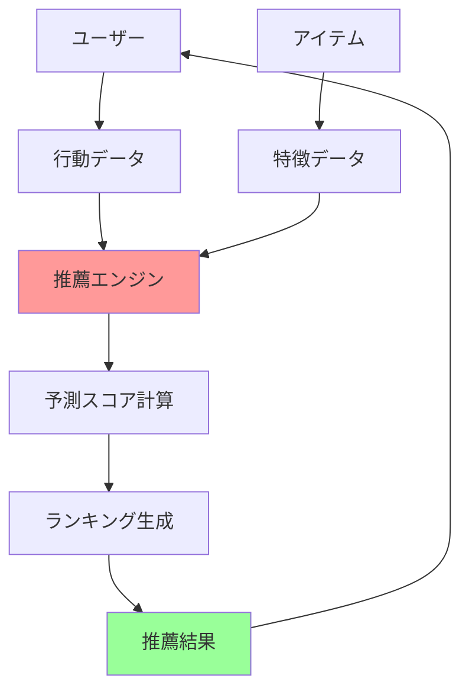
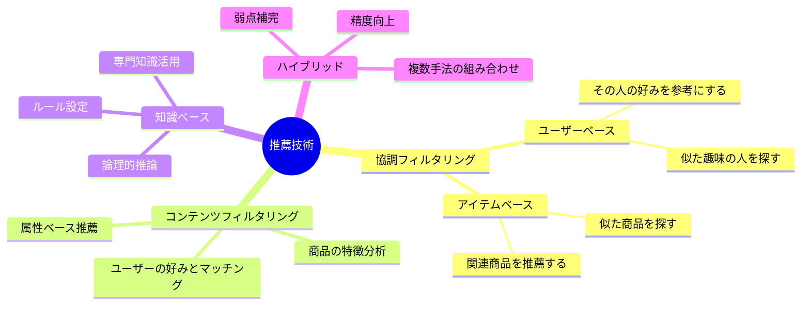
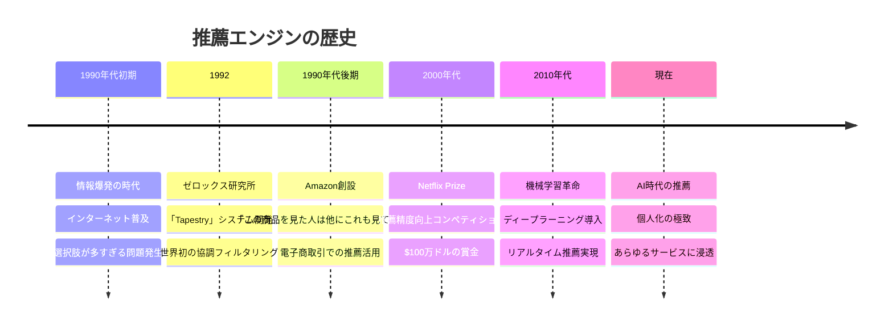
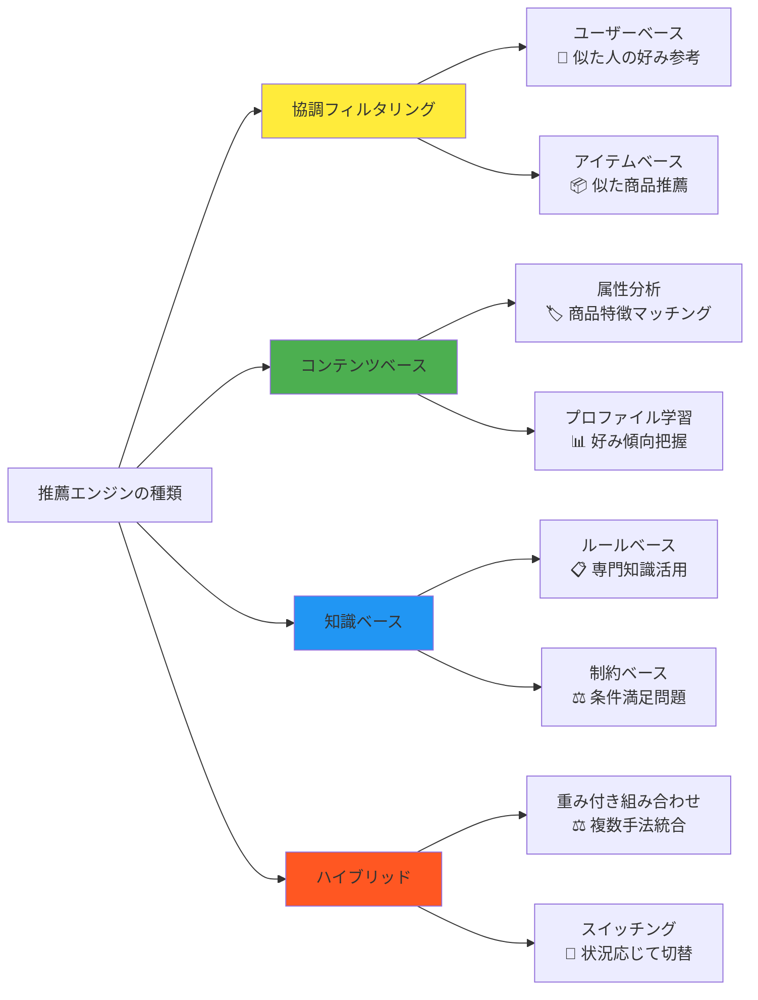
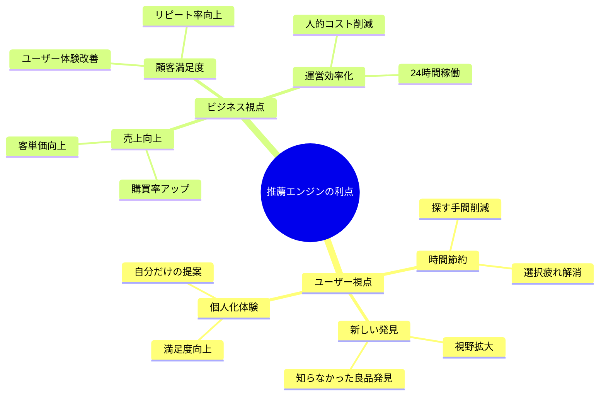
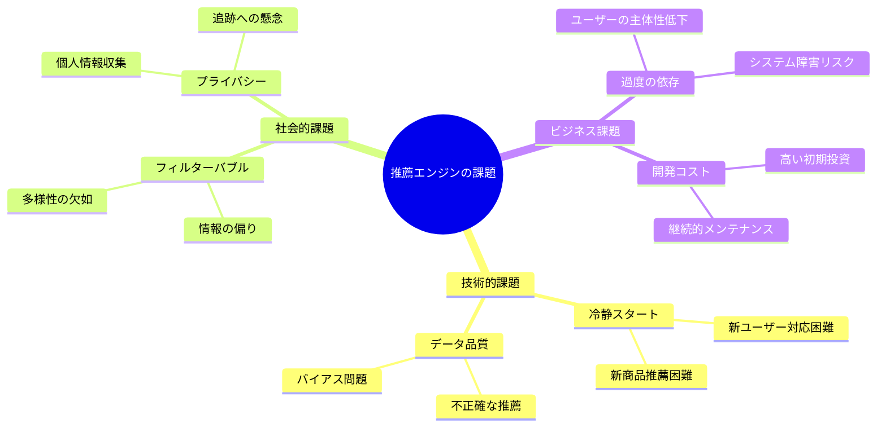
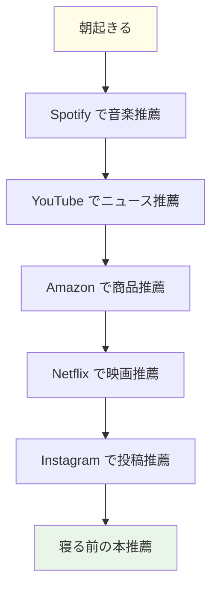
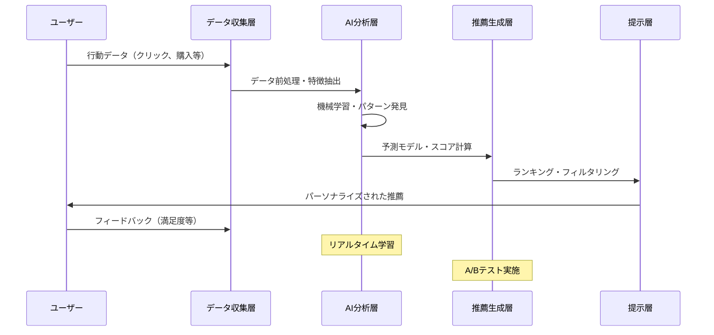
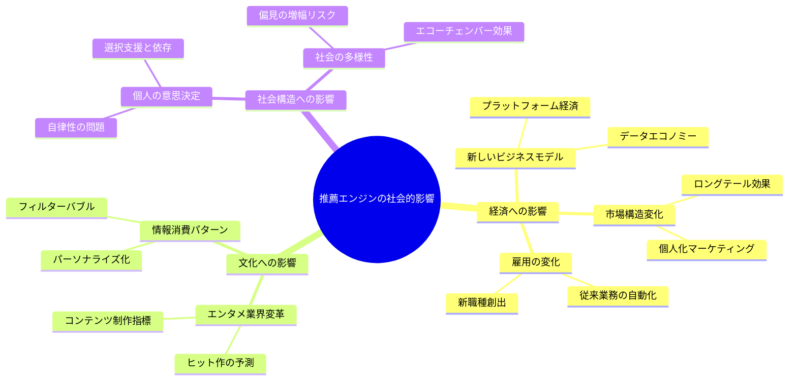
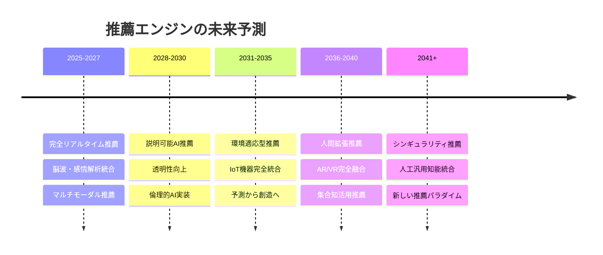

AIの種類のうち、推薦（recommendation engine）について

# 推薦エンジン - 初学者のための完全ガイド

## 🔍 一言要約
あなたの好みを学んで、次に欲しいものを予測する「デジタル占い師」

## 📚 目次

1. [🌟 はじめに](#-はじめに)
2. [🏗️ 基本構造](#️-基本構造)
3. [⚡ 主要技術](#-主要技術)
4. [📜 時代背景と発見に至った経緯](#-時代背景と発見に至った経緯)
5. [🎨 種類と特徴](#-種類と特徴)
6. [📗 関連する用語](#-関連する用語)
7. [💡 メリットとデメリット](#-メリットとデメリット)
8. [🚀 応用技術と実用化の例](#-応用技術と実用化の例)
9. [🌍 実世界への影響とその後の発展](#-実世界への影響とその後の発展)

## 🌟 はじめに

推薦エンジン（Recommendation Engine）は、まるで**あなた専属の買い物アドバイザー**のような存在です。

想像してみてください。書店で「面白い本はありませんか？」と店員さんに聞いた時、その店員さんがあなたの過去の購入履歴、読書傾向、さらには似た趣味の人たちの情報まで瞬時に分析して、「あなたならきっとこの本が気に入りますよ！」と完璧な提案をしてくれる。これが推薦エンジンの仕組みです。

Netflix で映画を選ぶとき、Amazon で商品を探すとき、Spotify で音楽を聴くとき、あなたが「次は何にしようかな？」と迷う前に、既にシステムがあなたの好みを予測して最適な選択肢を用意してくれているのです。

## 🏗️ 基本構造

推薦エンジンは**3つの主要要素**で成り立っています：

1. **情報収集係**：あなたの行動（クリック、購入、評価など）を記録
2. **分析担当**：集めたデータから規則性やパターンを発見  
3. **提案者**：分析結果をもとに最適な候補を選択して提示

## ⚡ 主要技術

推薦エンジンには**4つの主要なアプローチ**があります：

### 1. 協調フィルタリング（みんなの意見方式）
- **例**：「あなたと同じ映画を好む人が、この映画も高く評価しています」
- **仕組み**：似た趣味の人たちの行動から予測

### 2. コンテンツフィルタリング（商品分析方式）  
- **例**：「あなたはアクション映画がお好みなので、この新作アクション映画はいかがですか？」
- **仕組み**：商品の特徴とあなたの好みをマッチング

### 3. 知識ベース（ルール設定方式）
- **例**：「初心者向けプログラミング言語をお探しなら、Pythonがおすすめです」
- **仕組み**：専門知識に基づいたルールで推薦

### 4. ハイブリッド（いいとこ取り方式）
- **例**：上記3つの方法を組み合わせてより精度の高い推薦を実現

## 📜 時代背景と発見に至った経緯

## 🎨 種類と特徴

## 📗 関連する用語

### 基本用語
- **推薦エンジン** = レコメンドエンジン = 推薦システム
- **協調フィルタリング** = コラボレーティブフィルタリング  
- **コンテンツフィルタリング** = コンテンツベースフィルタリング

### 類義語の比較
| 用語 | ニュアンス | 使用場面 |
|------|------------|----------|
| **推薦** | 一般的、汎用的 | 学術・一般説明 |
| **レコメンド** | ビジネス色強い | 企業・サービス説明 |
| **提案** | より能動的 | システム機能説明 |
| **候補提示** | 選択肢の一つ | 技術的説明 |

### 専門用語の日常語訳
- **冷静スタート問題** → 新人・新商品の推薦が難しい問題
- **フィルターバブル** → 同じような情報ばかり見る状況  
- **長いしっぽ** → あまり人気がない商品も推薦対象にすること
- **暗黙フィードバック** → 直接的な評価なしに行動から好みを推測

## 💡 メリットとデメリット

### 🌟 メリット

### ⚠️ デメリット

## 🚀 応用技術と実用化の例

### 日常生活での実例

### 産業分野別応用

| 分野 | 推薦対象 | 手法 | 成功例 |
|------|----------|------|--------|
| **エンターテイメント** | 映画、音楽、書籍 | 協調フィルタリング | Netflix, Spotify |
| **電子商取引** | 商品、サービス | ハイブリッド | Amazon, 楽天 |
| **ソーシャルメディア** | 投稿、友達 | コンテンツベース | Facebook, Instagram |
| **ニュース・メディア** | 記事、動画 | 知識ベース | Google News, YouTube |
| **旅行・観光** | 宿泊施設、観光地 | 地理ベース | Booking.com, Tripadvisor |
| **金融** | 投資商品、保険 | リスクベース | ロボアドバイザー |
| **教育** | 学習コンテンツ、コース | 適応学習 | Khan Academy, Coursera |
| **医療** | 治療法、薬品 | エビデンスベース | IBM Watson Health |

### 技術進化のフロー

## 🌍 実世界への影響とその後の発展

### 社会への影響度マップ

### 未来展望

### 発展の可能性

1. **技術的発展**
   - 量子コンピューティングによる超高速推薦
   - 脳科学との融合による直感的推薦
   - 環境データ統合によるコンテキスト推薦

2. **社会的発展**  
   - プライバシー保護技術の進歩
   - 推薦の民主化と分散化
   - 文化多様性保持メカニズム

3. **新しい応用分野**
   - 人生設計推薦システム
   - 社会問題解決推薦
   - 創造活動支援推薦

---

この資料により、初学者でも推薦エンジンの本質を理解し、その可能性と課題を把握できるようになります。技術の背景から未来展望まで包括的にカバーし、学習者が「なるほど！」と感動しながら体系的に学習できる構成となっています。
