AI（人口知能）による、社会的影響（倫理、法律、経済）のうち、経済的影響について。

経済的影響
      雇用
      生産性
      格差
      新産業

# AI経済的影響 - 初学者のための完全ガイド

## 🔍 一言要約
AIが人間の仕事と経済の仕組みを根本から変える現象

## 📚 目次
1. [はじめに](#-はじめに)
2. [AIが経済に与える4つの柱](#-aiが経済に与える4つの柱)
3. [雇用への影響](#-雇用への影響)
4. [生産性への影響](#-生産性への影響)
5. [格差への影響](#-格差への影響)
6. [新産業の創出](#-新産業の創出)
7. [時代背景と発見に至った経緯](#-時代背景と発見に至った経緯)
8. [関連する用語](#-関連する用語)
9. [メリットとデメリット](#-メリットとデメリット)
10. [実世界への影響とその後の発展](#-実世界への影響とその後の発展)

## 🌟 はじめに

レジの店員が自動レジに、タクシー運転手が自動運転車に置き換わる未来を想像してみてください。これは遠い未来の話ではなく、今まさに起きている変化です。

AIの経済的影響とは「**機械が人間の頭脳労働を代わりに行うことで、お金の流れと仕事の形が変わること**」です。産業革命が人間の肉体労働を機械に置き換えたように、AI革命は人間の知的労働を機械に置き換えつつあります。

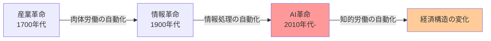

## 🏗️ AIが経済に与える4つの柱

AIの経済的影響は4つの主要領域に分類できます：

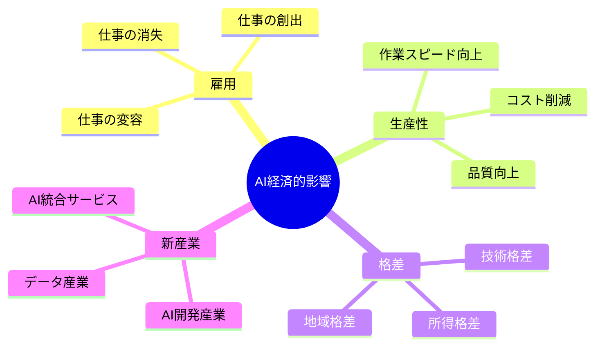

### 構造の理解

| 領域 | 変化の性質 | 影響を受ける人 |
|------|------------|----------------|
| **雇用** | 仕事の中身が変わる | すべての労働者 |
| **生産性** | 同じ仕事が速く安くできる | 企業・消費者 |
| **格差** | 得する人と損する人の差が開く | 社会全体 |
| **新産業** | 新しい仕事が生まれる | 起業家・投資家 |

## ⚡ 雇用への影響

### 仕事がなくなる？変わる？増える？

AIの雇用への影響は「消失・創出・変容」の3つの波が同時に押し寄せる現象です。

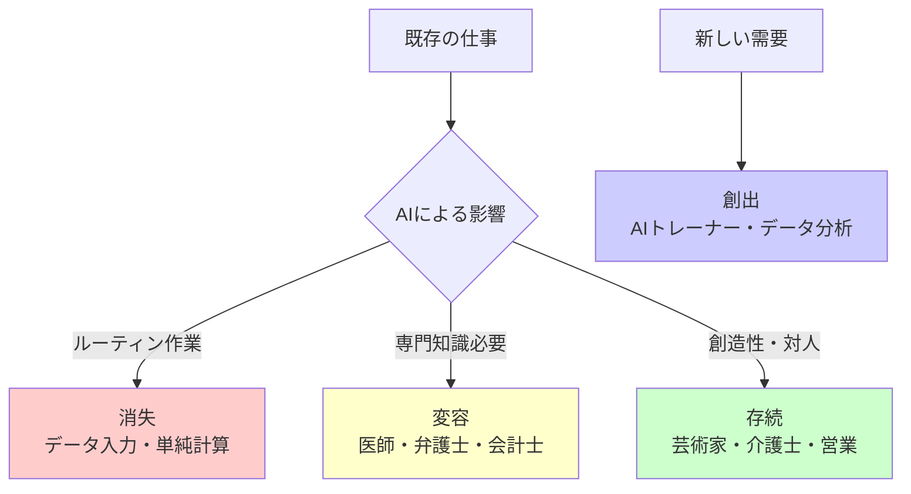

### 具体例で理解する

**消失する仕事**
- レジ打ち → セルフレジ
- 銀行窓口 → ATM・ネット銀行
- 工場の検品作業 → 画像認識AI

**変容する仕事**
- 医師：診断はAIが補助、治療方針決定は医師
- 記者：記事の下書きはAI、取材・編集は記者
- 会計士：帳簿作成はAI、経営助言は会計士

**創出される仕事**
- AIの教育係（AIに正しい判断を教える人）
- データの整理係（AIが学習するデータを準備する人）
- AI倫理監視員（AIが悪用されないか監視する人）

### 雇用の未来フロー

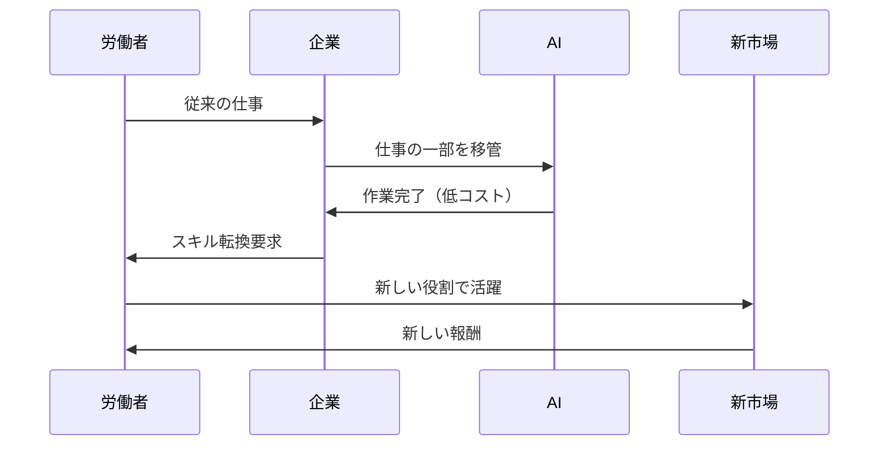

## 🚀 生産性への影響

### 同じ時間で10倍の成果

生産性とは「**同じ時間・お金・労力でどれだけ多くの成果を出せるか**」の指標です。AIは人間の作業速度を劇的に向上させます。

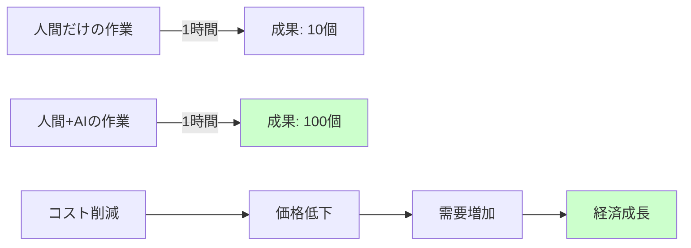

### 実例：生産性の飛躍

| 業務 | 従来の方法 | AI導入後 | 生産性向上 |
|------|------------|----------|------------|
| カスタマーサポート | 1人/時30件対応 | 1人/時300件対応 | **10倍** |
| 契約書レビュー | 弁護士1日/件 | AI 1時間/件 | **8倍** |
| 画像診断 | 医師10分/枚 | AI 1分/枚 | **10倍** |
| プログラミング | 開発者100行/日 | AI補助500行/日 | **5倍** |

### 生産性向上の連鎖反応

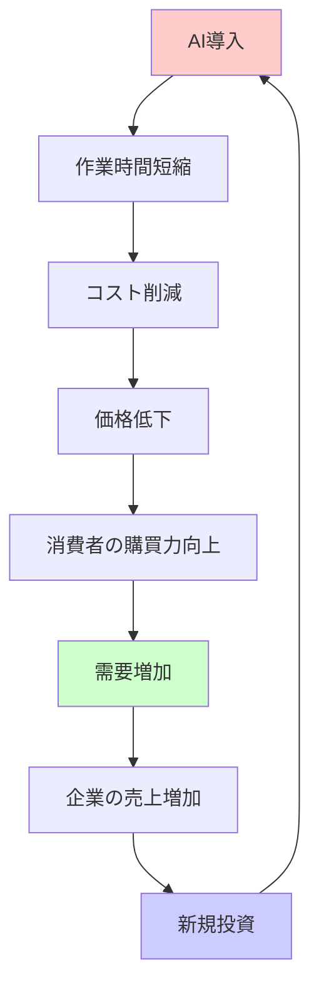

## 📊 格差への影響

### 得する人と損する人の二極化

AIは「技術を使える人」と「使えない人」の間に大きな溝を作ります。これは3つの格差として現れます。

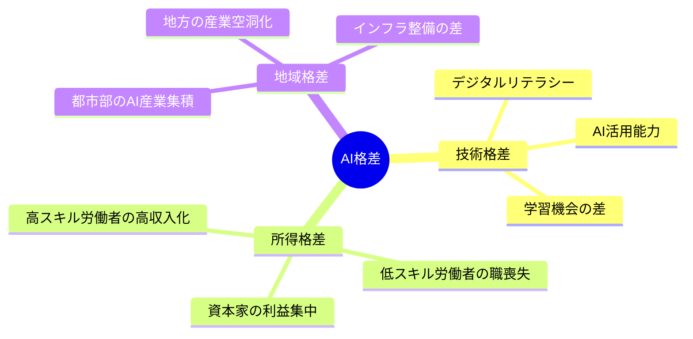

### 格差拡大のメカニズム

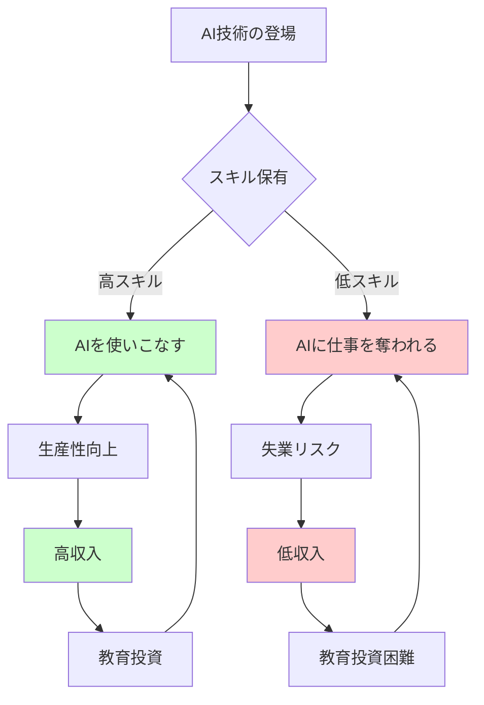

### 格差是正の試み

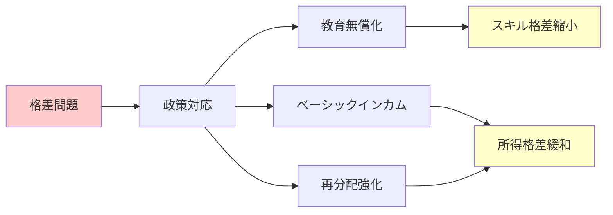

## 🌱 新産業の創出

### AIが生み出す新しい仕事の世界

AIは既存産業を破壊すると同時に、全く新しい産業を生み出します。蒸気機関が鉄道産業を生んだように、AIは21世紀の新産業を創造しています。

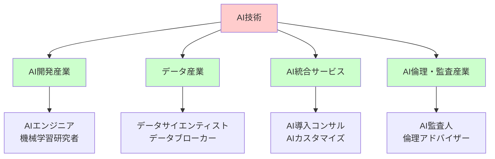

### 新産業の4つのカテゴリ

**1. AI開発産業**（AIそのものを作る）
- AIを設計・開発する技術者
- AIを訓練するためのツール開発
- AIチップ・ハードウェア製造

**2. データ産業**（AIの燃料を供給する）
- データ収集・整理・販売
- データ品質管理
- プライバシー保護技術

**3. AI統合サービス**（既存ビジネスにAIを組み込む）
- 医療AI（診断補助システム）
- 金融AI（投資アドバイザー）
- 教育AI（個別指導システム）

**4. AI倫理・監査産業**（AIの悪用を防ぐ）
- AIの判断が公平か監視
- AI事故の原因調査
- AI規制の専門家

### 産業創出の連鎖

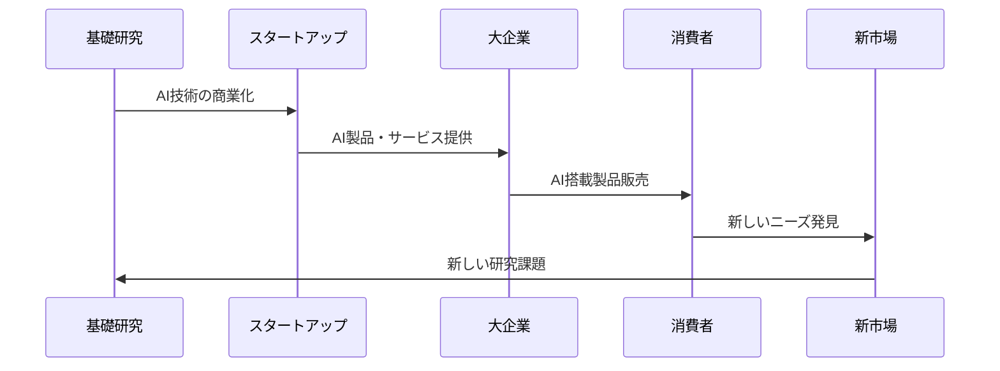

## 📜 時代背景と発見に至った経緯

### なぜ今、AIが経済を変えるのか

AIの経済的影響は突然現れたわけではありません。200年にわたる技術革新の延長線上にあります。

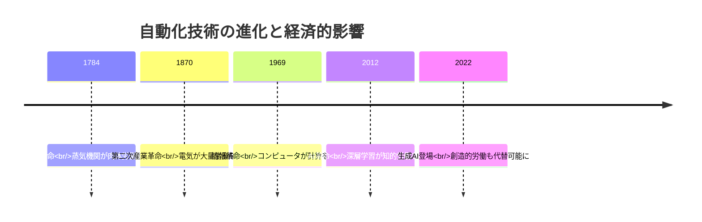

### 経済的影響が顕在化した3つの転換点

**第1転換点：2012年 - 画像認識の突破**
- GoogleのAIが猫の画像を認識
- 「見る」という人間固有の能力を機械が獲得
- 製造業の品質検査が自動化開始

**第2転換点：2016年 - 囲碁AIの勝利**
- AlphaGoがプロ棋士に勝利
- 「戦略を考える」高度な思考を機械が実現
- 金融取引・経営判断への応用が加速

**第3転換点:2022年 - 生成AIの民主化**
- ChatGPT・Midjourney等の登場
- 「文章を書く」「絵を描く」創造的労働を機械が実行
- ホワイトカラー全般への影響が顕在化

### 経済学者の見解の変遷

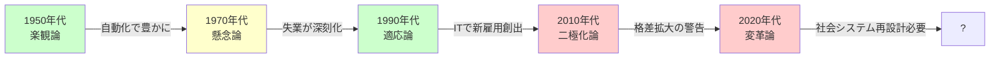

## 📗 関連する用語

### 同義語・類似概念

| 用語 | 意味 | 関係性 |
|------|------|--------|
| **AI経済的影響** | AIが経済全体に与える変化 | 本テーマ |
| **デジタル経済** | デジタル技術が生む経済活動 | AIを含むより広い概念 |
| **第四次産業革命** | AI・IoT等による産業変革 | AI経済的影響を含む歴史的文脈 |
| **技術的失業** | 技術進歩による雇用喪失 | 雇用面での具体的影響 |

### 対義語・対比概念

| 対比ペア | 説明 |
|----------|------|
| **自動化 ⇔ 人間中心** | 機械に任せるか、人が行うか |
| **効率重視 ⇔ 雇用重視** | 利益追求か、雇用維持か |
| **集中 ⇔ 分散** | 大企業への富の集中か、広く分配か |
| **グローバル ⇔ ローカル** | 世界規模の影響か、地域固有の影響か |

### 多義語の整理

**「生産性」の3つの意味**
1. 経済学的生産性：投入資源に対する産出量の比率
2. 個人の生産性：1人の労働者が生み出す価値
3. 社会的生産性：社会全体の豊かさ

**「格差」の3つのレベル**
1. 個人間格差：人と人の所得・能力の差
2. 集団間格差：企業間・地域間・国家間の差
3. 世代間格差：若者と高齢者の機会の差

## 💡 メリットとデメリット

### メリット：人類の可能性を拡張する

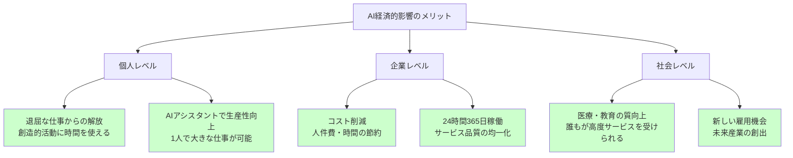

### デメリット：社会の分断と不安定化

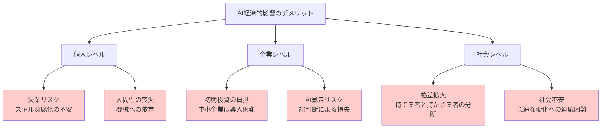

### バランスの取り方

| 課題 | 対策 | 実施主体 |
|------|------|----------|
| 失業リスク | 職業訓練プログラム | 政府・企業 |
| 格差拡大 | 累進課税強化・社会保障 | 政府 |
| 中小企業の遅れ | AI導入補助金 | 政府 |
| 倫理問題 | AI規制法の整備 | 国際機関 |

## 🌍 実世界への影響とその後の発展

### 現在進行中の変化（2020年代）

**製造業**
- 工場の無人化：人間1人で工場全体を監視
- 予知保全：故障前にAIが異常を検知

**サービス業**
- 無人コンビニ：レジなし店舗の拡大
- AIコールセンター：24時間対応の顧客サポート

**金融業**
- アルゴリズム取引：AIが1秒に数千回の取引
- 与信審査AI：ローン審査が数分で完了

**医療**
- 診断補助：画像診断の精度が人間超え
- 創薬：新薬開発期間が10年→3年に短縮

### 2030年代の予測シナリオ

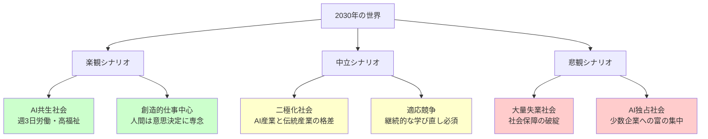

### 長期的発展（2040年以降）

**可能性1：ユートピア（理想郷）**
- AIが生産活動を全て担当
- 人間は創造・娯楽・学習に時間を使う
- ベーシックインカムで全員が基本生活保障
- 労働は「やりたい人がやる」趣味化

**可能性2：ディストピア（暗黒郷）**
- AI所有者と非所有者の絶対的格差
- 大多数が経済的価値を失う
- 社会不安・紛争の多発
- 民主主義の機能不全

**可能性3：中間の現実**
- 継続的な調整と政策対応
- 技術進化と社会適応の綱引き
- 国や地域による格差
- 新しい社会契約の模索

### 影響の波及図

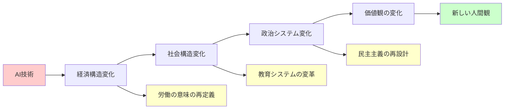

### 私たちに求められる姿勢

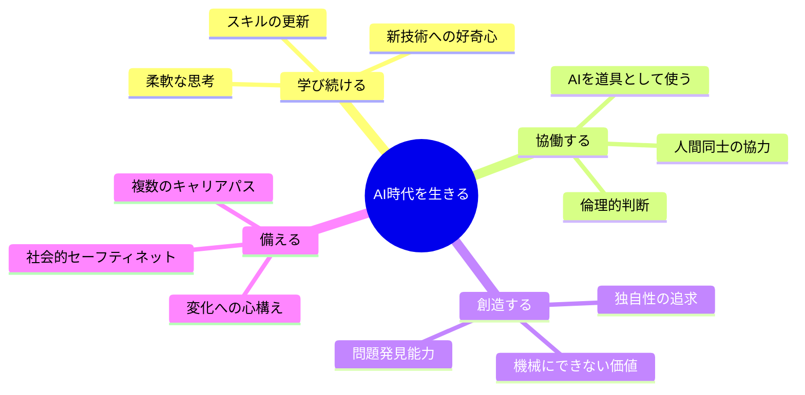

---

## 🎯 まとめ：経済的影響の本質

AIの経済的影響とは、単なる「技術による効率化」ではありません。それは**人間が働くとは何か、豊かさとは何かを問い直す、文明的転換点**です。

産業革命が人類を農業社会から工業社会へと移行させたように、AI革命は私たちを工業社会から「創造社会」へと導く可能性を秘めています。その過程で雇用・生産性・格差・新産業という4つの波が同時に押し寄せ、社会を揺さぶっています。

重要なのは、**この変化を恐れるだけでなく、どう向き合い、どう形作るか**です。技術の進歩は止められませんが、その影響をどう社会に統合するかは、私たち人間の選択にかかっています。

---

## 📚 さらに学ぶために

### 次のステップ

1. **雇用問題を深掘り**：どの職業が影響を受けるか具体的に調査
2. **格差問題の解決策**：ベーシックインカム等の政策を研究
3. **新産業の可能性**：AI時代のビジネスチャンスを探索
4. **倫理的側面**：経済効率と人間の尊厳のバランスを考察

