AI（人口知能）による、社会的影響（倫理、法律、経済）のうち、倫理的影響について
   倫理的影響
      プライバシー
      公平性
      透明性
      責任

# AI倫理的影響 - 初学者のための完全ガイド

## 🔍 一言要約
AIが人間社会で「正しく・公平に・透明に」使われるための道徳的ルールと課題

## 📚 目次
1. [🌟 はじめに](#-はじめに)
2. [🏗️ AI倫理の基本構造](#️-ai倫理の基本構造)
3. [⚡ 4つの主要柱](#-4つの主要柱)
4. [📜 時代背景と問題意識の芽生え](#-時代背景と問題意識の芽生え)
5. [🎨 倫理的課題の種類と特徴](#-倫理的課題の種類と特徴)
6. [📗 関連する用語](#-関連する用語)
7. [💡 メリットとデメリット](#-メリットとデメリット)
8. [🚀 応用と実例](#-応用と実例)
9. [🔄 置換と変遷](#-置換と変遷)
10. [⚔️ 代替と競合](#️-代替と競合)
11. [🌍 実世界への影響とその後の発展](#-実世界への影響とその後の発展)

---

## 🌟 はじめに

### なぜAI倫理が重要なのか？

想像してください。あなたがレストランの予約アプリを使ったとき、なぜか外国人風の名前だと予約が取りにくい。就職活動で、AIが履歴書を自動審査するのですが、女性というだけで評価が下がる。病院でAI診断を受けたが、なぜその診断結果になったのか誰も説明できない――。

これらは**AIの倫理的問題**です。

AIは私たちの生活を便利にする反面、**人間の尊厳、公平性、プライバシーを脅かす危険性**も持っています。AI倫理とは、「AIを使うとき、人間として守るべき道徳的なルールは何か？」を考える分野なのです。

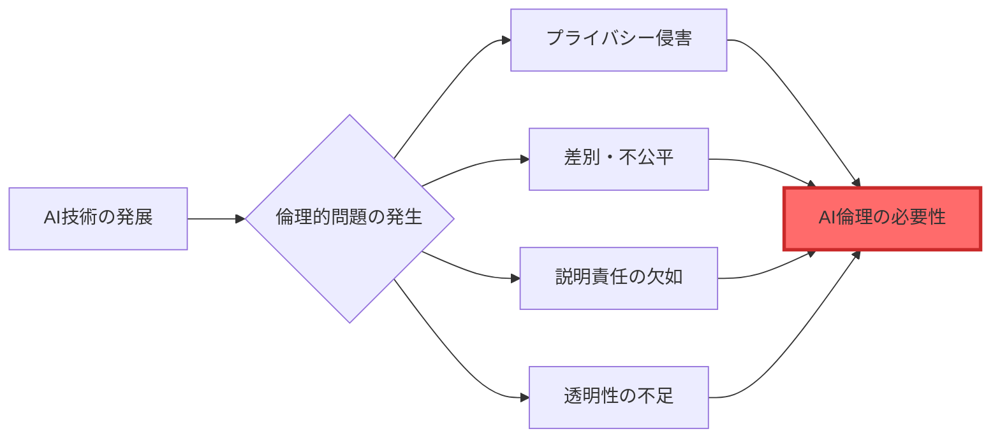
```mermaid
graph LR
    A[AI技術の発展] --> B{倫理的問題の発生}
    B --> C[プライバシー侵害]
    B --> D[差別・不公平]
    B --> E[説明責任の欠如]
    B --> F[透明性の不足]
    
    C --> G[AI倫理の必要性]
    D --> G
    E --> G
    F --> G
    
    style G fill:#ff6b6b,stroke:#c92a2a,stroke-width:3px
```

---

## 🏗️ AI倫理の基本構造

AI倫理は、**4つの柱**で支えられています。これらは建物の柱のように、どれか1つでも崩れるとAIシステム全体が「倫理的に問題あり」となります。

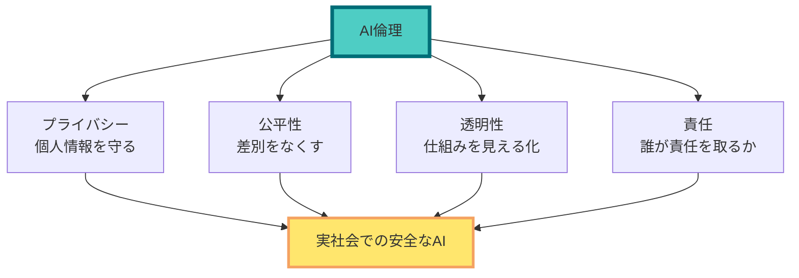
```mermaid
graph TD
    A[AI倫理] --> B[プライバシー<br/>個人情報を守る]
    A --> C[公平性<br/>差別をなくす]
    A --> D[透明性<br/>仕組みを見える化]
    A --> E[責任<br/>誰が責任を取るか]
    
    B --> F[実社会での安全なAI]
    C --> F
    D --> F
    E --> F
    
    style A fill:#4ecdc4,stroke:#006d77,stroke-width:4px
    style F fill:#ffe66d,stroke:#f4a261,stroke-width:3px
```

### 各柱の役割
| 柱 | 役割 | 日常例 |
|------|------|--------|
| **プライバシー** | 個人の秘密を守る | スマホの位置情報を勝手に使われない |
| **公平性** | 誰にでも平等に | 性別・人種で差別されない採用AI |
| **透明性** | 中身が見える | なぜこの広告が表示されたか分かる |
| **責任** | 問題時に責任を取る | AI事故の責任の所在が明確 |

---

## ⚡ 4つの主要柱

### 1️⃣ プライバシー（Privacy）

**日常語で言うと：** 「あなたの秘密を勝手に覗かない、使わない」

AIは大量のデータを学習しますが、その中には**個人のプライベートな情報**（病歴、買い物履歴、位置情報など）が含まれます。

#### 🔍 具体例
- **悪い例**: SNSの投稿から、AIがあなたの精神状態を分析し、保険会社に売る
- **良い例**: 医療AIが患者データを学習するが、個人を特定できないように加工する

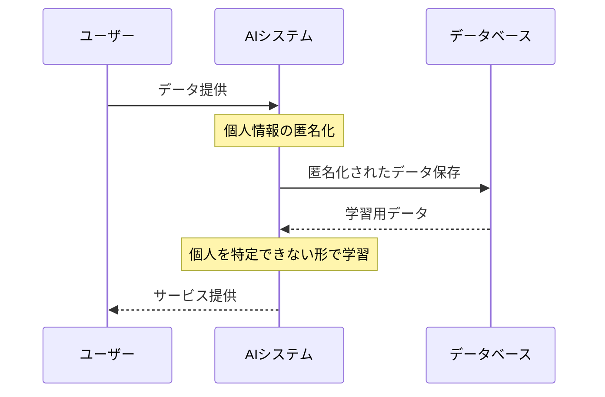
```mermaid
sequenceDiagram
    participant User as ユーザー
    participant AI as AIシステム
    participant Data as データベース
    
    User->>AI: データ提供
    Note over AI: 個人情報の匿名化
    AI->>Data: 匿名化されたデータ保存
    Data-->>AI: 学習用データ
    Note over AI: 個人を特定できない形で学習
    AI-->>User: サービス提供
```

---

### 2️⃣ 公平性（Fairness）

**日常語で言うと：** 「誰に対しても平等に扱う」

AIが特定のグループ（人種、性別、年齢など）に対して不利な判断をしてしまう問題です。

#### 🔍 具体例
- **悪い例**: 採用AIが「過去の採用データ」を学習したら、男性ばかり採用してきた歴史を学んで、女性を低評価
- **良い例**: AIの判断結果を性別・人種ごとに分析し、偏りがないか検証する

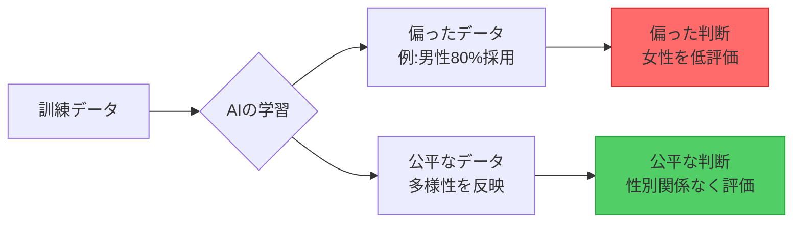
```mermaid
graph LR
    A[訓練データ] --> B{AIの学習}
    B --> C[偏ったデータ<br/>例:男性80%採用]
    C --> D[偏った判断<br/>女性を低評価]
    
    B --> E[公平なデータ<br/>多様性を反映]
    E --> F[公平な判断<br/>性別関係なく評価]
    
    style D fill:#ff6b6b,stroke:#c92a2a
    style F fill:#51cf66,stroke:#2f9e44
```

#### ⚠️ 公平性の難しさ
- **統計的公平性**: 全体として平等
- **個人の公平性**: 似た人には似た扱い
- **機会の公平性**: 全員に同じチャンスを

この3つを同時に満たすのは数学的に不可能な場合もあります！

---

### 3️⃣ 透明性（Transparency）

**日常語で言うと：** 「AIがなぜその判断をしたか説明できる」

現代のAI（特にディープラーニング）は**ブラックボックス**と呼ばれ、なぜその結論に至ったか人間にも分かりません。

#### 🔍 具体例
- **悪い例**: 銀行のローンAIが「あなたは融資不可」と判断するが、理由を一切説明しない
- **良い例**: 「年収・勤続年数・過去の返済履歴から総合的に判断しました」と要因を示す

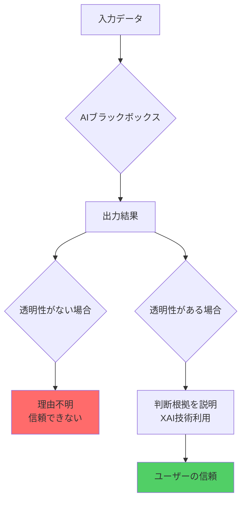
```mermaid
graph TD
    A[入力データ] --> B{AIブラックボックス}
    B --> C[出力結果]
    
    C --> D{透明性がない場合}
    D --> E[理由不明<br/>信頼できない]
    
    C --> F{透明性がある場合}
    F --> G[判断根拠を説明<br/>XAI技術利用]
    G --> H[ユーザーの信頼]
    
    style E fill:#ff6b6b
    style H fill:#51cf66
```

#### 💡 解決策：XAI（説明可能なAI）
- AIの判断プロセスを可視化する技術
- 「この画像が猫と判断された理由は、耳・ヒゲ・目の特徴があるため」と説明

---

### 4️⃣ 責任（Accountability）

**日常語で言うと：** 「AIが失敗したとき、誰が責任を取るのか」

#### 🔍 具体例
- **自動運転車が事故を起こしたら**: 車のメーカー？AI開発者？運転手？
- **AI診断が誤診を出したら**: 病院？AIメーカー？医師？

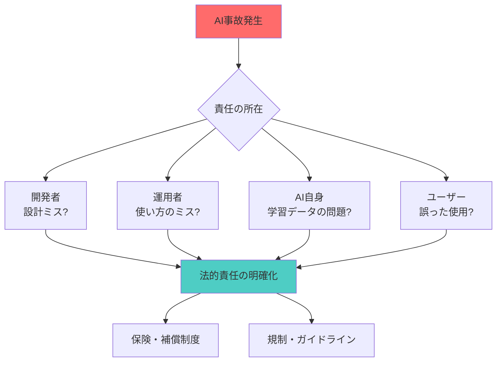
```mermaid
graph TD
    A[AI事故発生] --> B{責任の所在}
    
    B --> C[開発者<br/>設計ミス?]
    B --> D[運用者<br/>使い方のミス?]
    B --> E[AI自身<br/>学習データの問題?]
    B --> F[ユーザー<br/>誤った使用?]
    
    C --> G[法的責任の明確化]
    D --> G
    E --> G
    F --> G
    
    G --> H[保険・補償制度]
    G --> I[規制・ガイドライン]
    
    style A fill:#ff6b6b
    style G fill:#4ecdc4
```

#### ⚠️ 責任のジレンマ
- AIは「自分で判断」するが、「法的責任能力」はない
- 人間とAIの責任をどう分けるか、世界中で議論中

---

## 📜 時代背景と問題意識の芽生え

### 🕰️ AI倫理の歴史年表

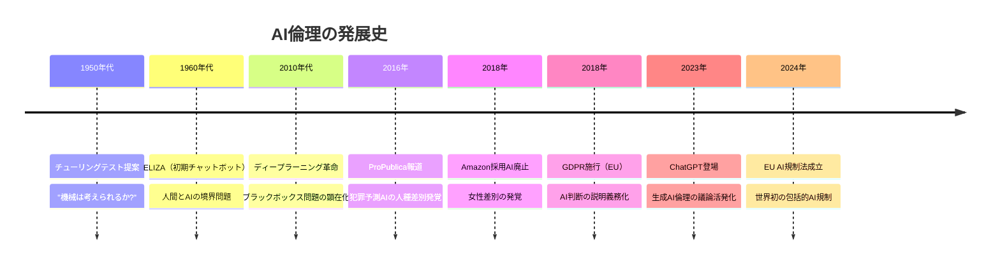
```mermaid
timeline
    title AI倫理の発展史
    1950年代 : チューリングテスト提案
           : "機械は考えられるか?"
    1960年代 : ELIZA（初期チャットボット）
           : 人間とAIの境界問題
    2010年代 : ディープラーニング革命
           : ブラックボックス問題の顕在化
    2016年 : ProPublica報道
           : 犯罪予測AIの人種差別発覚
    2018年 : Amazon採用AI廃止
           : 女性差別の発覚
    2018年 : GDPR施行（EU）
           : AI判断の説明義務化
    2023年 : ChatGPT登場
           : 生成AI倫理の議論活発化
    2024年 : EU AI規制法成立
           : 世界初の包括的AI規制
```

### 📖 問題意識が生まれたきっかけ


---

## 🎨 倫理的課題の種類と特徴

### 📊 課題マップ

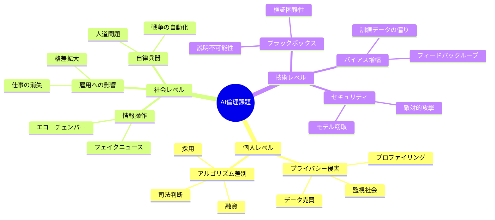
```mermaid
mindmap
  root((AI倫理課題))
    個人レベル
      プライバシー侵害
        監視社会
        データ売買
        プロファイリング
      アルゴリズム差別
        採用
        融資
        司法判断
    社会レベル
      雇用への影響
        仕事の消失
        格差拡大
      情報操作
        フェイクニュース
        エコーチェンバー
      自律兵器
        戦争の自動化
        人道問題
    技術レベル
      ブラックボックス
        説明不可能性
        検証困難性
      バイアス増幅
        訓練データの偏り
        フィードバックループ
      セキュリティ
        敵対的攻撃
        モデル窃取
```

### 🔍 課題の分類表

| 課題カテゴリ | 具体例 | 影響範囲 | 深刻度 |
|--------------|--------|----------|--------|
| **データ倫理** | 同意なきデータ収集 | 個人 | ⭐⭐⭐⭐ |
| **アルゴリズム倫理** | 差別的判断 | 集団 | ⭐⭐⭐⭐⭐ |
| **運用倫理** | 軍事利用 | 社会全体 | ⭐⭐⭐⭐⭐ |
| **設計倫理** | セーフティ機能不足 | 利用者 | ⭐⭐⭐⭐ |

---

## 📗 関連する用語

### 🔤 同義語・類義語

| 用語 | 意味 | 違い・ニュアンス |
|------|------|------------------|
| **AI倫理** | AIの道徳的正しさ | 最も包括的 |
| **AIガバナンス** | AIの統治・管理体制 | 組織的な管理に焦点 |
| **責任あるAI** | 倫理的に配慮されたAI | 実践的なアプローチ |
| **信頼できるAI** | ユーザーが安心して使えるAI | ユーザー視点 |

### ↔️ 対義語

| 倫理的 | 非倫理的 |
|--------|----------|
| 透明性のあるAI | ブラックボックスAI |
| 公平なアルゴリズム | 差別的アルゴリズム |
| プライバシー保護 | 監視・追跡 |
| 説明可能性 | 不透明性 |

### 🔗 多義語に注意

**「バイアス」**
- 統計学：データの偏り
- AI文脈：不公平な判断の原因
- 日常語：先入観・偏見

**「透明性」**
- AI倫理：アルゴリズムの説明可能性
- 企業倫理：情報公開
- 物理学：光を通す性質

---

## 💡 メリットとデメリット

### ✅ AI倫理を重視するメリット

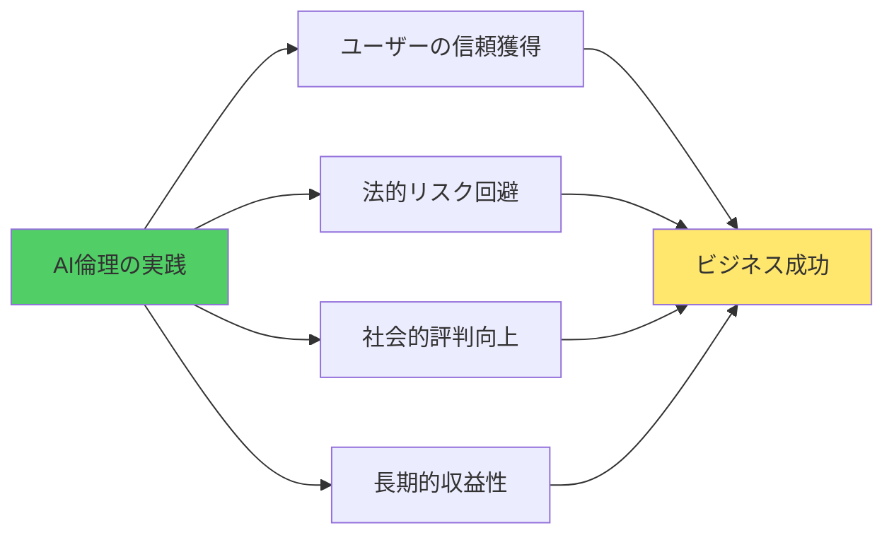
```mermaid
graph LR
    A[AI倫理の実践] --> B[ユーザーの信頼獲得]
    A --> C[法的リスク回避]
    A --> D[社会的評判向上]
    A --> E[長期的収益性]
    
    B --> F[ビジネス成功]
    C --> F
    D --> F
    E --> F
    
    style A fill:#51cf66
    style F fill:#ffe66d
```

1. **信頼構築**: ユーザーが安心して使える
2. **リスク回避**: 訴訟・炎上・規制違反を防ぐ
3. **イノベーション**: 倫理的制約が創造性を促す
4. **持続可能性**: 長期的に社会に受け入れられる

### ❌ AI倫理を無視するデメリット

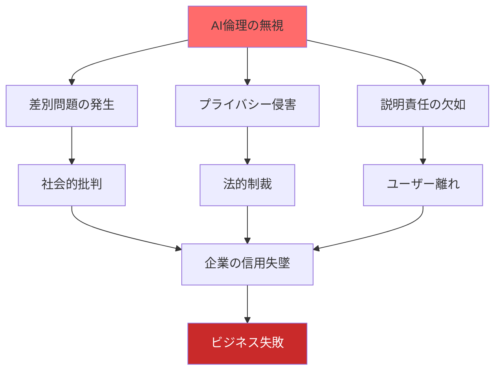
```mermaid
graph TD
    A[AI倫理の無視] --> B[差別問題の発生]
    A --> C[プライバシー侵害]
    A --> D[説明責任の欠如]
    
    B --> E[社会的批判]
    C --> F[法的制裁]
    D --> G[ユーザー離れ]
    
    E --> H[企業の信用失墜]
    F --> H
    G --> H
    
    H --> I[ビジネス失敗]
    
    style A fill:#ff6b6b
    style I fill:#c92a2a,color:#fff
```

1. **炎上リスク**: SNSで拡散され企業イメージ悪化
2. **法的制裁**: EU・米国で巨額の罰金
3. **人材流出**: 倫理的でない企業から優秀な人材が去る
4. **技術的負債**: 後から倫理対応すると莫大なコスト

---

## 🚀 応用と実例

### 🏥 医療分野

**事例**: AI診断システム

- **倫理的課題**: 
  - 誤診の責任は誰が取る？（責任）
  - 患者データのプライバシー保護（プライバシー）
  - なぜこの診断になったか説明が必要（透明性）

- **解決策**:
  - 医師の最終判断を必須とする「AI支援」設計
  - 差分プライバシー技術でデータ匿名化
  - 診断根拠を可視化するXAI導入

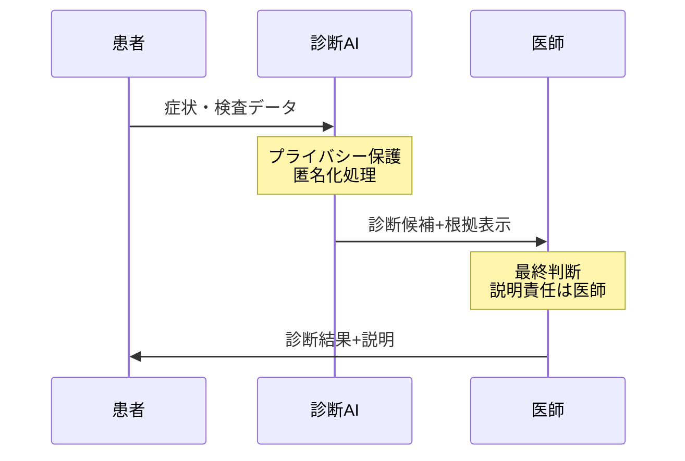
```mermaid
sequenceDiagram
    participant Patient as 患者
    participant AI as 診断AI
    participant Doctor as 医師
    
    Patient->>AI: 症状・検査データ
    Note over AI: プライバシー保護<br/>匿名化処理
    AI->>Doctor: 診断候補+根拠表示
    Note over Doctor: 最終判断<br/>説明責任は医師
    Doctor->>Patient: 診断結果+説明
```

---

### 🏢 採用分野

**事例**: AI履歴書スクリーニング

- **倫理的課題**:
  - 性別・人種・年齢差別（公平性）
  - 選考理由の不透明性（透明性）

- **解決策**:
  - 公平性監査ツール導入
  - センシティブ属性（性別等）を学習データから除去
  - 不合格理由を候補者に通知

---

### 🚗 自動運転分野

**事例**: トロッコ問題のAI版

**シナリオ**: 
- 自動運転車が事故回避不可能な状況に
- 選択肢A: 直進して歩行者5人をはねる
- 選択肢B: 急ハンドルで壁に激突、乗客1人が犠牲

**倫理的ジレンマ**:
- AIはどちらを選ぶべきか？
- その判断基準を誰が決めるのか？

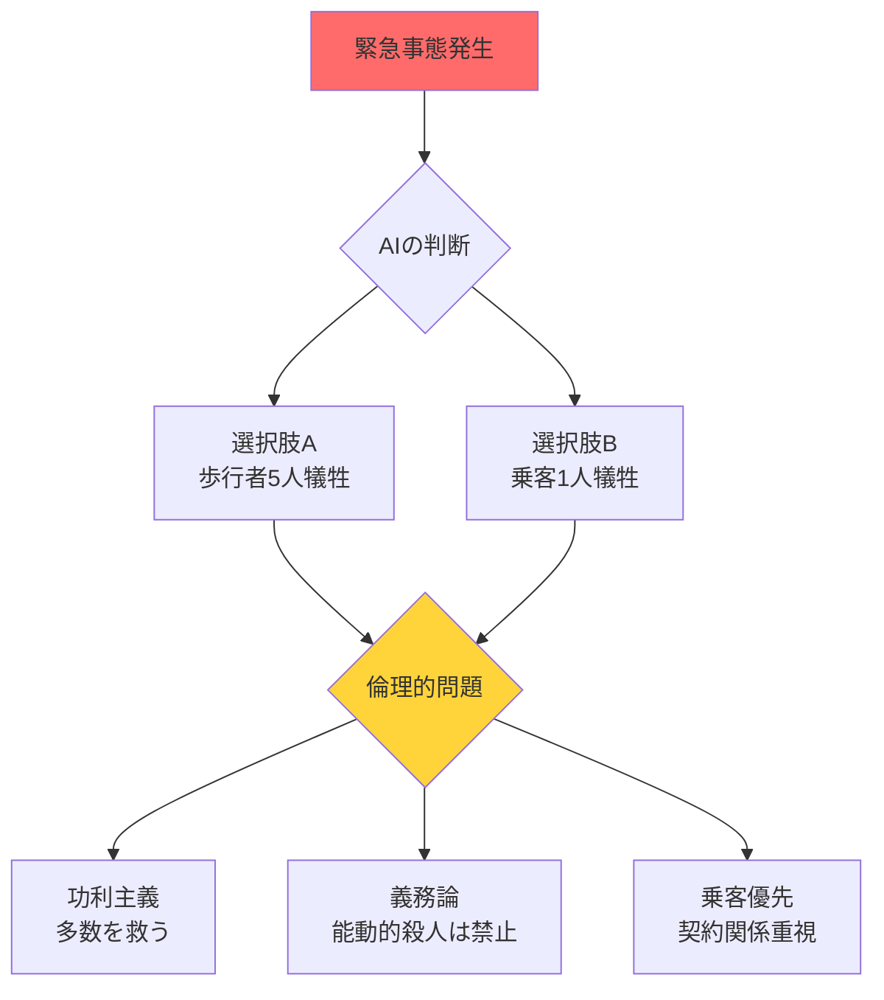
```mermaid
graph TD
    A[緊急事態発生] --> B{AIの判断}
    B --> C[選択肢A<br/>歩行者5人犠牲]
    B --> D[選択肢B<br/>乗客1人犠牲]
    
    C --> E{倫理的問題}
    D --> E
    
    E --> F[功利主義<br/>多数を救う]
    E --> G[義務論<br/>能動的殺人は禁止]
    E --> H[乗客優先<br/>契約関係重視]
    
    style A fill:#ff6b6b
    style E fill:#ffd43b
```

---

### 🌐 SNS・プラットフォーム分野

**事例**: レコメンドアルゴリズム

- **倫理的課題**:
  - エコーチェンバー（同じ意見だけ表示）
  - フェイクニュース拡散
  - ユーザー操作（依存症促進）

- **解決策**:
  - 多様な視点の情報を意図的に混ぜる
  - ファクトチェック機能
  - 利用時間制限機能

---

## 🔄 置換と変遷

### 📋 何を置き換えたか

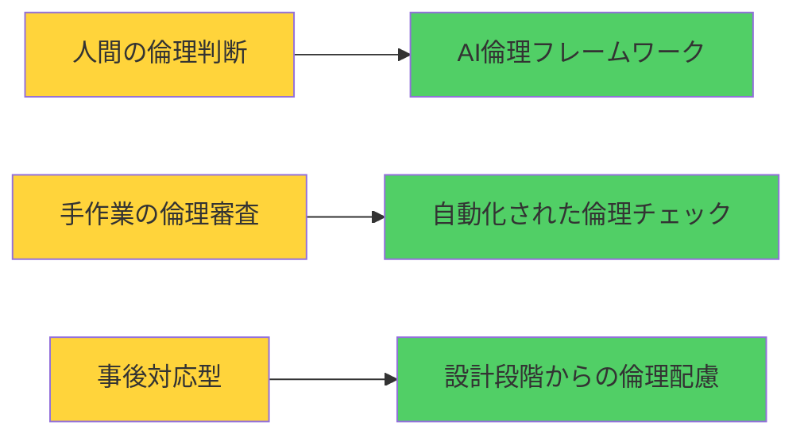
```mermaid
graph LR
    A[人間の倫理判断] --> B[AI倫理フレームワーク]
    C[手作業の倫理審査] --> D[自動化された倫理チェック]
    E[事後対応型] --> F[設計段階からの倫理配慮]
    
    style A fill:#ffd43b
    style B fill:#51cf66
    style C fill:#ffd43b
    style D fill:#51cf66
    style E fill:#ffd43b
    style F fill:#51cf66
```

| 以前 | 現在（AI倫理） |
|------|----------------|
| 人間が全ての倫理判断 | AIが一部判断、人間が監督 |
| 問題発生後に対応 | 設計段階から予防（Privacy by Design） |
| 企業ごとの基準 | 国際ガイドライン（OECD AI原則等） |
| 倫理は「おまけ」 | 倫理は「競争力」 |

---

### 🔄 何に置き換えられるか

AI倫理は**進化し続けている**分野です。

**第1世代（現在）**: 人間がルールを作る
- 倫理ガイドライン策定
- 人間による監査

**第2世代（近未来）**: AIが倫理を学習
- AIが過去の倫理的判断から学習
- 自動的に倫理的判断を下す

**第3世代（未来）**: AIが倫理を創造
- AIが人間の想像しない新しい倫理基準を提案
- 人間とAIの対話で倫理が進化

⚠️ **しかし**: 最終的な倫理判断は人間が持つべき、という考えが主流

---

## ⚔️ 代替と競合

### 🔀 代替可能性

**AI倫理 vs 従来の倫理学**

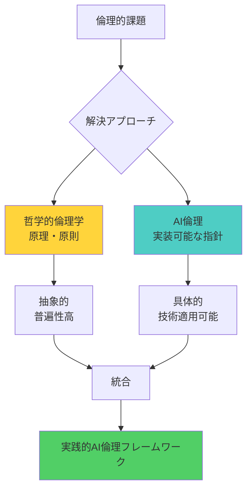
```mermaid
graph TD
    A[倫理的課題] --> B{解決アプローチ}
    
    B --> C[哲学的倫理学<br/>原理・原則]
    B --> D[AI倫理<br/>実装可能な指針]
    
    C --> E[抽象的<br/>普遍性高]
    D --> F[具体的<br/>技術適用可能]
    
    E --> G[統合]
    F --> G
    
    G --> H[実践的AI倫理フレームワーク]
    
    style C fill:#ffd43b
    style D fill:#4ecdc4
    style H fill:#51cf66
```

**結論**: 代替ではなく**補完関係**
- 哲学的倫理学：理論的基盤
- AI倫理：実装可能な具体策

---

### ⚔️ 競合する考え方

#### 1️⃣ ビジネス効率 vs AI倫理

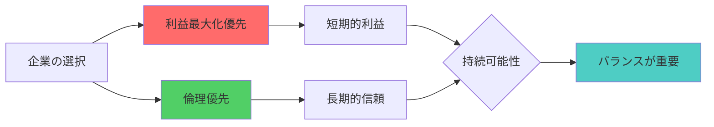
```mermaid
graph LR
    A[企業の選択] --> B[利益最大化優先]
    A --> C[倫理優先]
    
    B --> D[短期的利益]
    C --> E[長期的信頼]
    
    D --> F{持続可能性}
    E --> F
    
    F --> G[バランスが重要]
    
    style B fill:#ff6b6b
    style C fill:#51cf66
    style G fill:#4ecdc4
```

**競合点**:
- 倫理対応はコストがかかる
- 市場の競争圧力
- 短期的利益と長期的信頼のトレードオフ

---

#### 2️⃣ 国家安全保障 vs プライバシー

| 立場 | 主張 | 具体例 |
|------|------|--------|
| **国家** | テロ防止のため監視必要 | 顔認識AI全面導入 |
| **個人** | プライバシーは基本的人権 | 監視社会の拒否 |

**現実**: 国ごとに異なるバランス

---

#### 3️⃣ イノベーション vs 規制

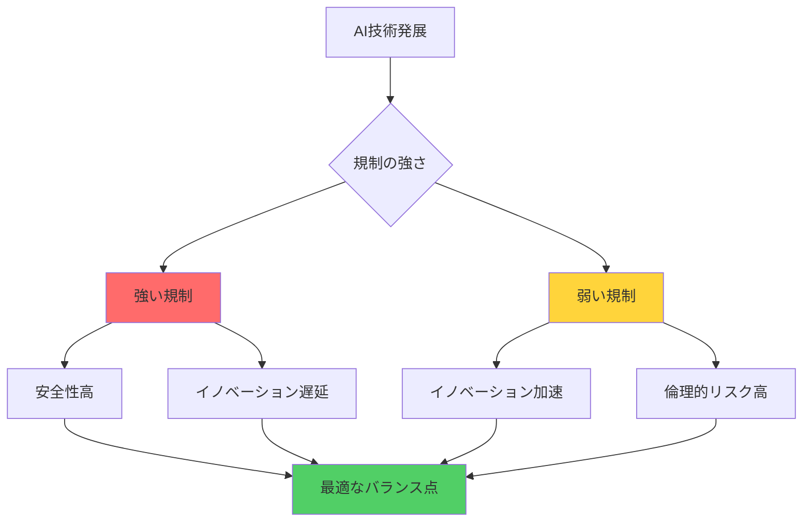
```mermaid
graph TD
    A[AI技術発展] --> B{規制の強さ}
    
    B --> C[強い規制]
    C --> D[安全性高]
    C --> E[イノベーション遅延]
    
    B --> F[弱い規制]
    F --> G[イノベーション加速]
    F --> H[倫理的リスク高]
    
    D --> I[最適なバランス点]
    E --> I
    G --> I
    H --> I
    
    style C fill:#ff6b6b
    style F fill:#ffd43b
    style I fill:#51cf66
```

---

## 🌍 実世界への影響とその後の発展

### 🌏 現在の影響

---

### 🚀 未来の発展

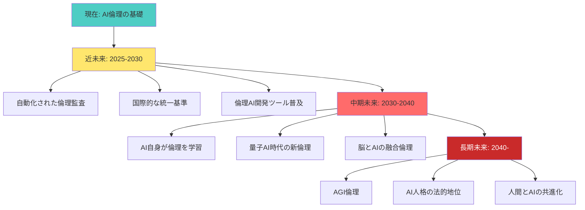
```mermaid
graph TD
    A[現在: AI倫理の基礎] --> B[近未来: 2025-2030]
    B --> C[自動化された倫理監査]
    B --> D[国際的な統一基準]
    B --> E[倫理AI開発ツール普及]
    
    B --> F[中期未来: 2030-2040]
    F --> G[AI自身が倫理を学習]
    F --> H[量子AI時代の新倫理]
    F --> I[脳とAIの融合倫理]
    
    F --> J[長期未来: 2040-]
    J --> K[AGI倫理]
    J --> L[AI人格の法的地位]
    J --> M[人間とAIの共進化]
    
    style A fill:#4ecdc4
    style B fill:#ffe66d
    style F fill:#ff6b6b
    style J fill:#c92a2a,color:#fff
```

---

### 🔮 予測される発展シナリオ

#### シナリオ1: 倫理最優先社会（楽観）

- AI開発は厳格な倫理審査を経て実施
- 差別・プライバシー侵害は過去のもの
- 人間とAIが調和的に共存
- 倫理的AIが社会的信頼の基盤に

#### シナリオ2: 倫理格差社会（中立）

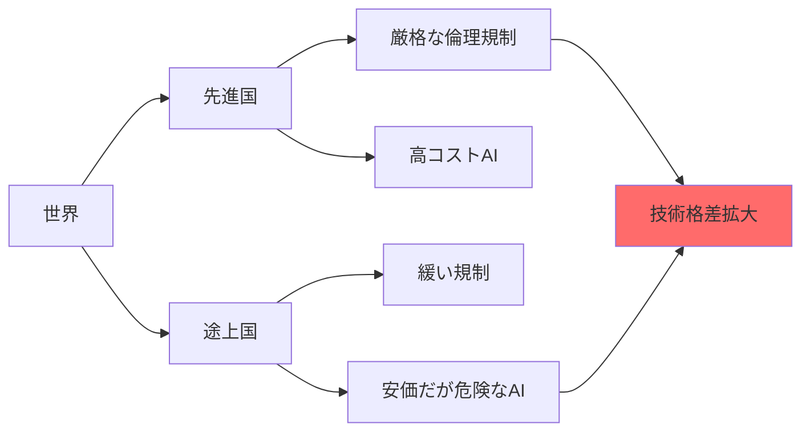
```mermaid
graph LR
    A[世界] --> B[先進国]
    A --> C[途上国]
    
    B --> D[厳格な倫理規制]
    B --> E[高コストAI]
    
    C --> F[緩い規制]
    C --> G[安価だが危険なAI]
    
    D --> H[技術格差拡大]
    G --> H
    
    style H fill:#ff6b6b
```

- 先進国：高度な倫理的AI
- 途上国：コストを優先し倫理軽視
- グローバルな倫理格差が問題化

#### シナリオ3: AI倫理の形骸化（悲観）

- 規制が厳しすぎてイノベーション停滞
- または、企業が形式的対応だけで実質的改善なし
- 「倫理ウォッシング」（見せかけだけの倫理対応）が横行

---

### 🌟 期待される技術的発展

#### 1. 自動倫理監査システム

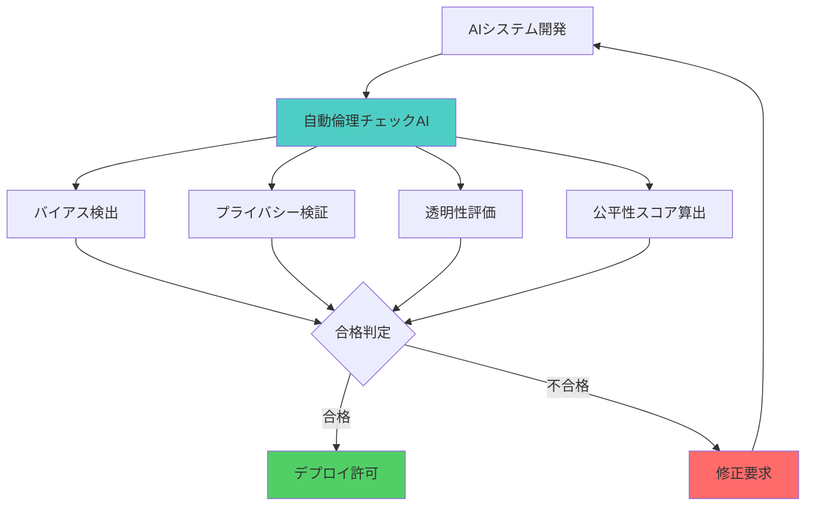
```mermaid
graph TD
    A[AIシステム開発] --> B[自動倫理チェックAI]
    
    B --> C[バイアス検出]
    B --> D[プライバシー検証]
    B --> E[透明性評価]
    B --> F[公平性スコア算出]
    
    C --> G{合格判定}
    D --> G
    E --> G
    F --> G
    
    G -->|合格| H[デプロイ許可]
    G -->|不合格| I[修正要求]
    
    I --> A
    
    style B fill:#4ecdc4
    style H fill:#51cf66
    style I fill:#ff6b6b
```

**特徴**:
- 人間の監査よりも高速・客観的
- リアルタイムで倫理違反を検出
- 開発コストの大幅削減

---

#### 2. 説明可能AI（XAI）の進化

**現在**: 「なぜこの判断？」を事後説明
**未来**: AIが判断しながらリアルタイムで説明生成

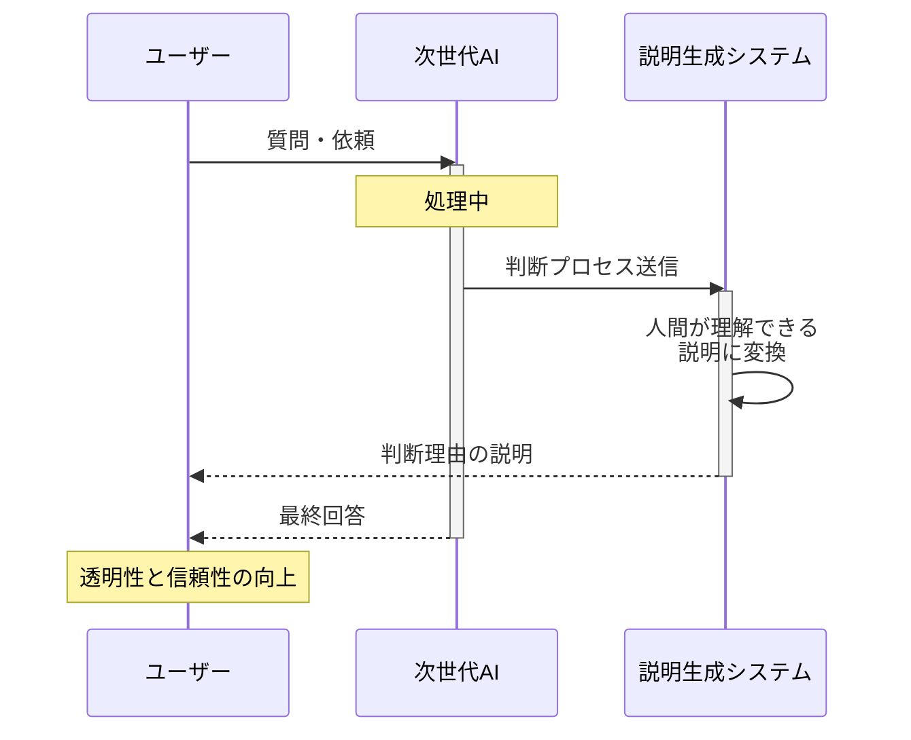
```mermaid
sequenceDiagram
    participant User as ユーザー
    participant AI as 次世代AI
    participant XAI as 説明生成システム
    
    User->>AI: 質問・依頼
    activate AI
    Note over AI: 処理中
    AI->>XAI: 判断プロセス送信
    activate XAI
    XAI->>XAI: 人間が理解できる<br/>説明に変換
    XAI-->>User: 判断理由の説明
    deactivate XAI
    AI-->>User: 最終回答
    deactivate AI
    
    Note over User: 透明性と信頼性の向上
```

---

#### 3. プライバシー保護技術の革新

**連合学習（Federated Learning）**

```mermaid
graph TD
    A[中央AIモデル] --> B[病院A]
    A --> C[病院B]
    A --> D[病院C]
    
    B --> E[ローカル学習<br/>データは外に出さない]
    C --> F[ローカル学習<br/>データは外に出さない]
    D --> G[ローカル学習<br/>データは外に出さない]
    
    E --> H[学習結果だけ共有]
    F --> H
    G --> H
    
    H --> I[中央モデル更新]
    
    style E fill:#51cf66
    style F fill:#51cf66
    style G fill:#51cf66
```

**メリット**:
- 個人データを外部に送らず学習可能
- 病院間でデータ共有なしに協力
- GDPRなど規制にも準拠

---

#### 4. 公平性保証アルゴリズム

**アルゴリズムの数学的証明**

将来は、「このAIは性別・人種に対して数学的に公平である」と証明できるアルゴリズムが主流に。

```mermaid
graph LR
    A[AI設計] --> B[公平性の数学的定義]
    B --> C[アルゴリズムに組み込み]
    C --> D[形式検証]
    D --> E{証明成功?}
    E -->|YES| F[公平性保証AI]
    E -->|NO| G[再設計]
    G --> A
    
    style F fill:#51cf66
    style G fill:#ff6b6b
```

---

### 📊 社会への長期的影響

#### ポジティブな影響

| 分野 | 影響 | 具体例 |
|------|------|--------|
| **医療** | 誰もが平等に高度医療を受けられる | AI診断が途上国でも利用可能 |
| **教育** | 個別最適化された学習 | 各生徒の理解度に合わせたAI教師 |
| **司法** | 人間の偏見を排除 | 量刑判断の公平性向上 |
| **雇用** | 能力本位の採用 | 学歴・性別によらない評価 |

---

#### ネガティブな影響（対策必要）

```mermaid
mindmap
  root((AI倫理の課題))
    監視社会化
      顔認識の濫用
      行動追跡
      思想統制
    雇用の二極化
      高度AI人材の需要増
      単純労働の消失
      中間層の消失
    責任の空白
      AI事故の責任所在不明
      法整備の遅れ
      保険制度の未整備
    倫理の相対化
      国ごとの基準の違い
      文化的価値観の衝突
      グローバル企業の対応困難
```

---

### 🧭 これから私たちがすべきこと

#### 個人レベル

1. **AI倫理リテラシーを高める**
   - AIの仕組みを理解する
   - プライバシー設定を確認する
   - 不当な判断に声を上げる

2. **データの自己管理**
   - どのアプリが何のデータを取得しているか把握
   - 不要なアプリの権限を削除
   - プライバシー重視サービスを選ぶ

---

#### 企業・開発者レベル

```mermaid
graph TD
    A[AI開発プロセス] --> B[1. 倫理影響評価]
    B --> C[2. 多様なチーム編成]
    C --> D[3. 公平性テスト]
    D --> E[4. 透明性確保]
    E --> F[5. 継続的監視]
    
    F --> G{問題発見}
    G -->|YES| H[即座に修正]
    G -->|NO| I[運用継続]
    
    H --> F
    
    style A fill:#4ecdc4
    style H fill:#ff6b6b
    style I fill:#51cf66
```

**ベストプラクティス**:
- 設計段階から倫理専門家を参加させる
- レッドチーム（攻撃者役）を設置
- ユーザーフィードバックを積極的に収集
- 定期的な倫理監査を実施

---

#### 社会・政府レベル

1. **国際的な倫理基準の統一**
   - OECD AI原則の実装
   - 国境を越えたデータ流通ルール
   - AI犯罪への国際協力

2. **教育システムの変革**
   - 小学校からのAI倫理教育
   - 批判的思考力の育成
   - STEAM教育にEthics（倫理）を追加

3. **法的枠組みの整備**
   ```mermaid
   graph LR
       A[現行法] --> B[AI特化型法律]
       B --> C[AI責任法]
       B --> D[AI透明性法]
       B --> E[AI公平性法]
       
       C --> F[統合的AI規制]
       D --> F
       E --> F
       
       style F fill:#51cf66
   ```

---

### 🌈 理想的な未来像

**2050年のビジョン**

```mermaid
graph TD
    A[人間とAIの共生社会] --> B[倫理的AIの普及]
    
    B --> C[個人のプライバシー完全保護]
    B --> D[差別のない社会]
    B --> E[透明で信頼できるシステム]
    B --> F[明確な責任体制]
    
    C --> G[人間の尊厳が守られる世界]
    D --> G
    E --> G
    F --> G
    
    G --> H[持続可能な発展]
    G --> I[誰も取り残さない社会]
    G --> J[技術と倫理の調和]
    
    style A fill:#4ecdc4
    style G fill:#ffe66d
    style H fill:#51cf66
    style I fill:#51cf66
    style J fill:#51cf66
```

**この未来を実現するために**:
- 技術者だけでなく、全ての人がAI倫理を理解する
- 企業は短期利益より長期信頼を重視する
- 政府は先見的な規制を整備する
- 市民は積極的に議論に参加する

---

## 🎓 まとめ：AI倫理の本質

### 🔑 重要ポイント

1. **AI倫理は技術問題ではなく、人間の問題**
   - AIは道具、使い方を決めるのは人間

2. **4つの柱はバランスが重要**
   - プライバシー、公平性、透明性、責任のどれか1つでも欠けると崩壊

3. **完璧な解決策は存在しない**
   - 倫理的ジレンマは常に存在する
   - 継続的な対話と改善が必要

4. **全員が当事者**
   - 開発者だけでなく、ユーザー、社会全体の課題

---
---

### 🌟 最後のメッセージ

AI倫理は「AIを規制する」ことではなく、**「AIと人間が共に繁栄する未来を創る」**ことです。

技術の進歩は止められません。だからこそ、私たち一人ひとりが倫理的な視点を持ち、「どんな未来を望むのか」を考え続けることが重要なのです。

```mermaid
graph LR
    A[あなた] --> B[AI倫理の理解]
    B --> C[日常での実践]
    C --> D[周囲への啓発]
    D --> E[社会の変化]
    E --> F[より良い未来]
    
    style A fill:#4ecdc4
    style F fill:#51cf66,stroke:#2f9e44,stroke-width:4px
```

**あなたの行動が未来を創ります。**

---


この資料が、AI倫理という複雑なテーマを「なるほど！」と理解する助けになれば幸いです。技術と倫理が調和した未来を、一緒に創造していきましょう！🚀
