AI（人口知能）による、社会的影響（倫理、法律、経済）のうち、法的影響について。

法的影響
      規制
      権利
      責任
      国際協調

# AI（人工知能）の法的影響 - 初学者のための完全ガイド

## 🔍 一言要約
AI技術の発展が既存の法律体系に挑戦し、新たなルール作りを迫っている現象

## 📚 目次
1. [はじめに](#-はじめに)
2. [AI法的課題の全体像](#-ai法的課題の全体像)
3. [4つの核心領域](#-4つの核心領域)
4. [規制の現在地](#-規制の現在地)
5. [権利をめぐる問題](#-権利をめぐる問題)
6. [責任の所在](#-責任の所在)
7. [国際協調の動き](#-国際協調の動き)
8. [関連用語](#-関連用語)
9. [メリットとデメリット](#-メリットとデメリット)
10. [実世界への影響](#-実世界への影響)

## 🌟 はじめに

自動運転車が事故を起こしたら誰が責任を負うのか？AIが生成した絵画の著作権は誰のものか？採用AIが差別的判断をしたら違法か？

AIは「人間が作った道具」という従来の枠組みを超え、**自律的に判断・創造する存在**として登場しました。これにより、人間とモノを前提に作られた既存の法律では対応できない問題が噴出しています。

法的影響とは、この**「法律の想定外」を埋める作業**全体を指します。

## 🏗️ AI法的課題の全体像

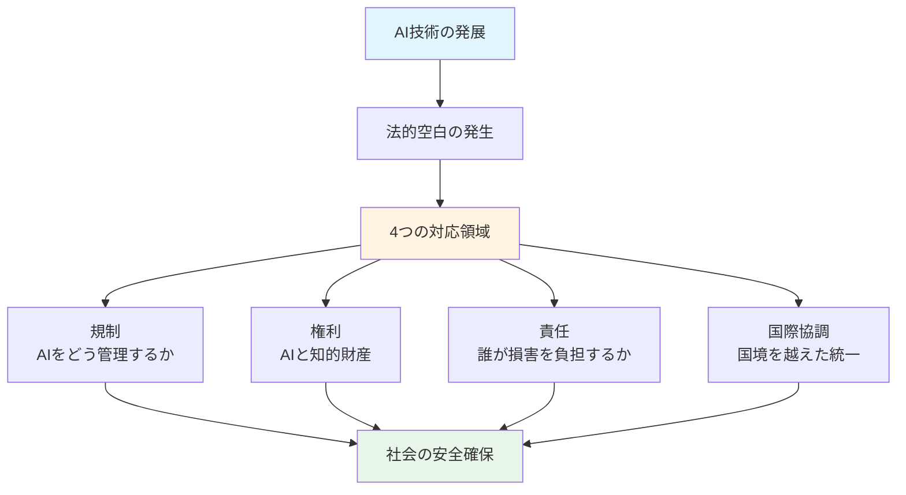

## 🔥 4つの核心領域

### 構造的関係

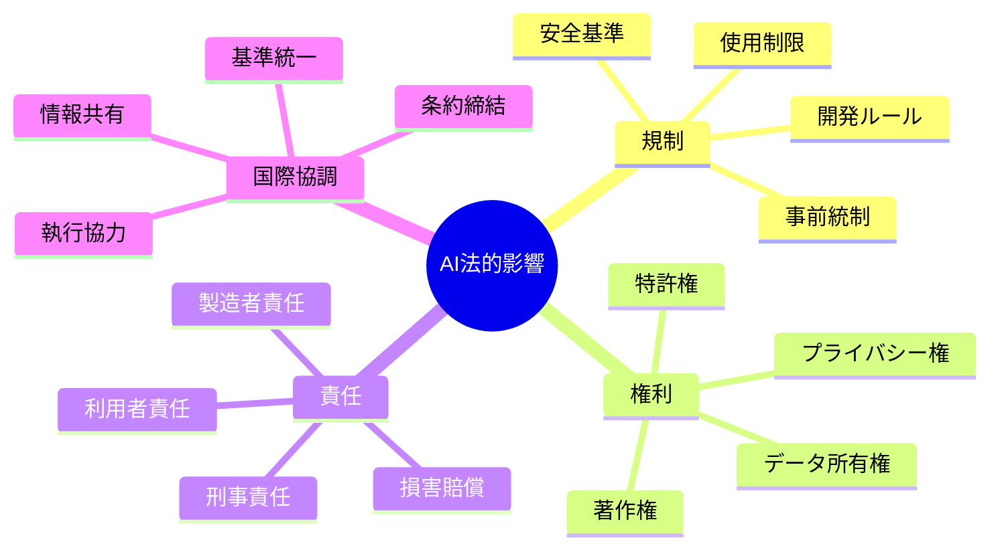

各領域は独立しているようで密接に関連しています。例えば、**規制が弱い**と責任問題が増え、**権利保護が不十分**だと国際的な競争力を失います。

## 📋 規制の現在地

### 規制とは何か
「危険なAIを社会に出さない仕組み」です。食品に賞味期限があるように、AIにも安全基準が必要という考え方です。

### 主な規制アプローチ

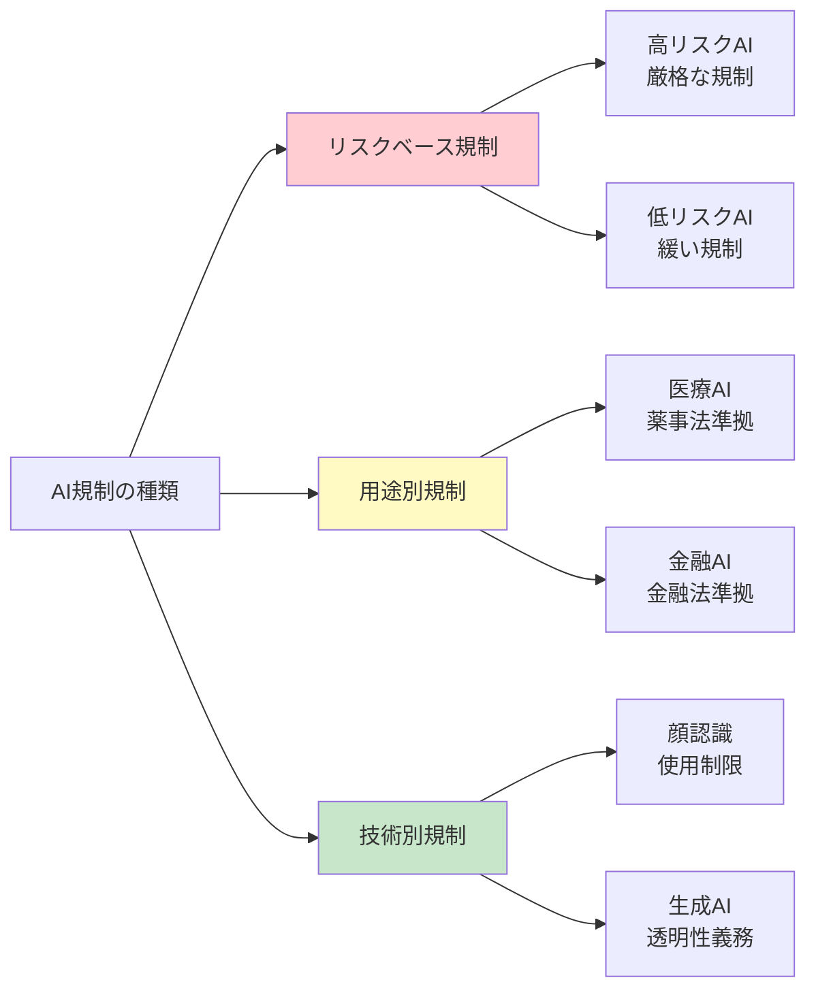

**具体例**：

### 規制の発展プロセス

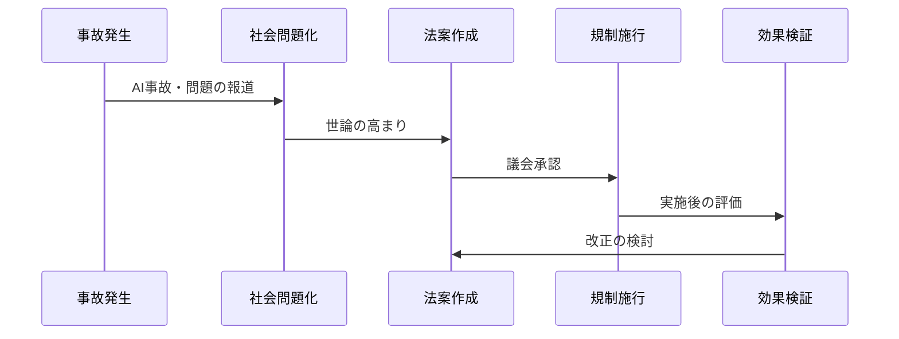

## 🎨 権利をめぐる問題

### AIと著作権の複雑な関係

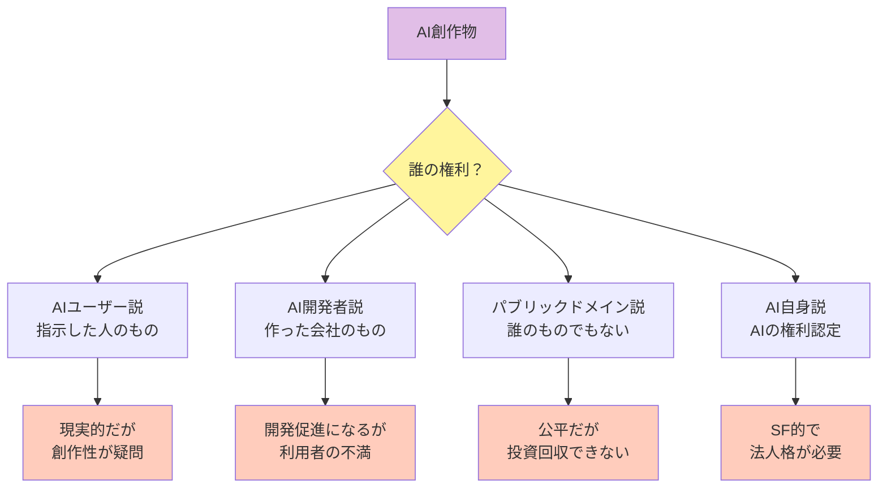

**現実の問題**：
- AIが生成した小説は著作権で守られるか？
- AI学習用データの著作物使用は侵害か？
- AIが既存作品に似た作品を作ったら？

**各国の現状**：

## ⚖️ 責任の所在

### 従来の責任論の限界

自動車事故なら「運転者の過失」で片付きました。しかしAIの場合：

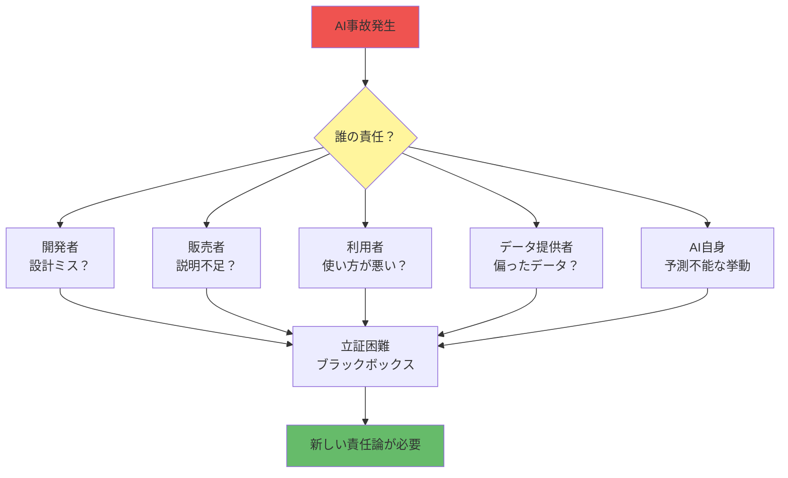

### 新しい責任の考え方

| 責任モデル | 内容 | メリット | デメリット |
|------------|------|----------|------------|
| **厳格責任** | 理由を問わず製造者が賠償 | 被害者保護が強力 | イノベーション抑制 |
| **過失責任** | 過失があった者が賠償 | 従来法と整合的 | AI特性で立証困難 |
| **保険制度** | 強制保険で補償 | 迅速な被害回復 | 保険料高騰リスク |
| **リスク分担** | 関係者全員で按分 | 現実的 | 複雑で不明確 |

**具体例**：
- **医療AIの誤診**：医師とAI開発者の責任割合は？
- **自動運転事故**：レベル3以上で運転者の責任は？
- **採用AIの差別**：企業が知らずに使っていたら？

## 🌍 国際協調の動き

### なぜ国際協調が必要か

AIは**国境を越えて瞬時に移動**します。A国で禁止されたAIがB国から使える状況では規制が無意味になります。

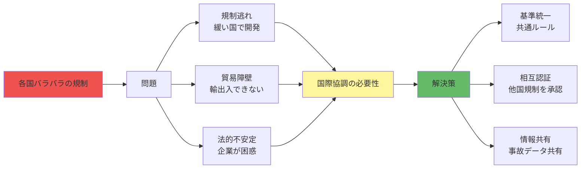

### 主要な国際的取り組み

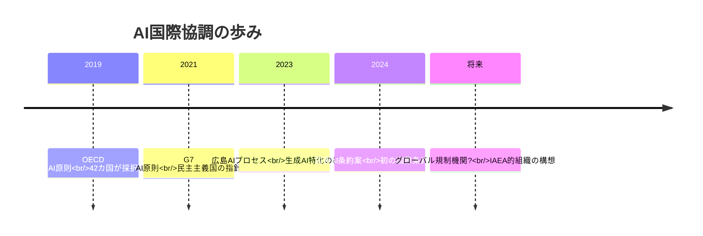

**協調の難しさ**：
- **価値観の違い**：プライバシー（欧州重視）vs イノベーション（米国重視）
- **経済競争**：自国産業を守りたい各国の思惑
- **技術格差**：先進国と途上国の対立

## 📗 関連用語

### 核心用語の理解

| 用語 | 意味 | 日常での言い換え |
|------|------|------------------|
| **AI規制** | AIの開発・使用に関する法的制限 | 危険なAIを市場に出さない仕組み |
| **アルゴリズム説明責任** | AIの判断理由を説明する義務 | ブラックボックスをガラス張りに |
| **AI人格** | AIに法的な権利義務を認めるか | AIを「法律上の人」として扱うか |
| **データ主権** | 個人データの自己決定権 | 自分の情報は自分で管理 |
| **予測的取締り** | AIによる犯罪予測と事前介入 | マイノリティ・リポート的世界 |

### 混同しやすい用語

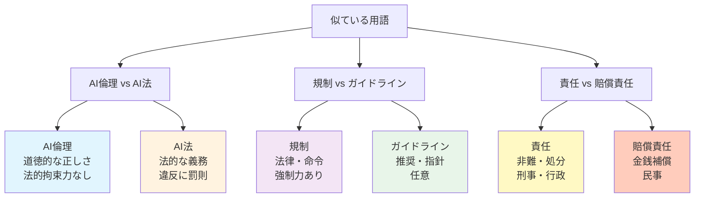

## 💡 メリットとデメリット

### AI法規制のメリット

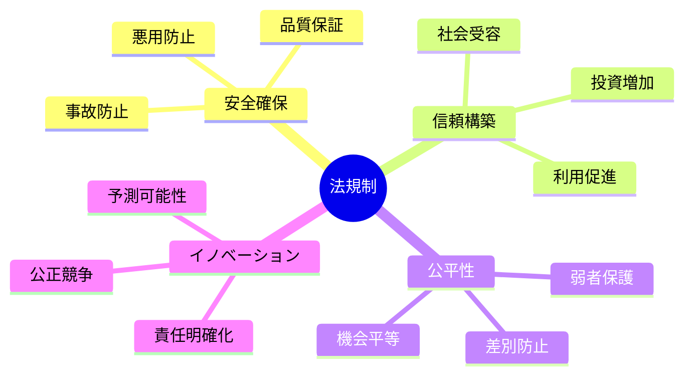

1. **社会の安全網**：危険なAIから市民を守る
2. **企業の予測可能性**：何が合法か明確になり投資しやすい
3. **国際競争力**：先進的な規制は輸出基準になる（EUのGDPR効果）
4. **被害者救済**：責任が明確だと損害回復が早い

### AI法規制のデメリット

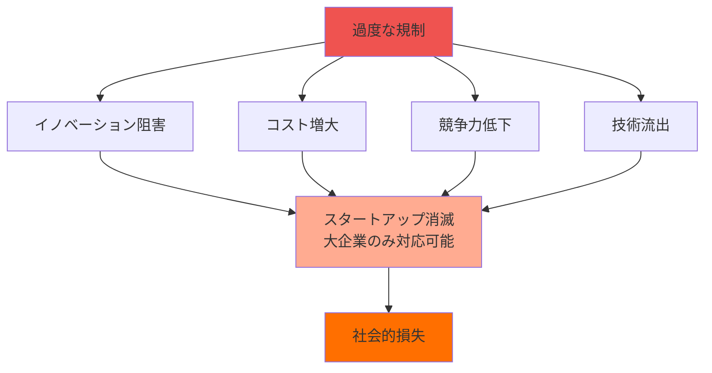

1. **イノベーション抑制**：規制遵守に資源を奪われる
2. **中小企業の不利**：法務コストを負担できない
3. **規制の陳腐化**：技術進化に法律が追いつかない
4. **グローバルな不均衡**：厳しい国から緩い国へ開発移転

### バランスの模索

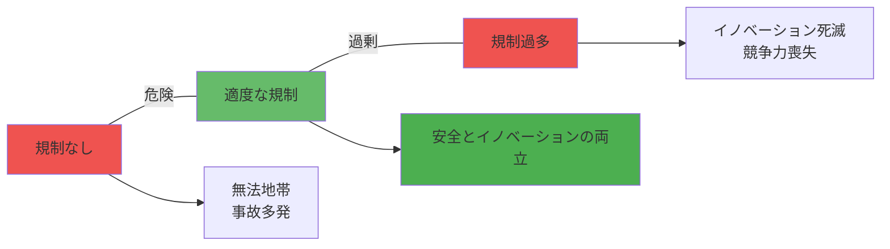

## 🚀 実世界への影響とその後の発展

### 現在進行中の変化

| 分野 | 従来の法律 | AI時代の課題 | 新しい方向性 |
|------|------------|--------------|--------------|
| **雇用** | 労働基準法で保護 | AIによる採用・評価の公平性 | アルゴリズム監査義務化 |
| **医療** | 医師法で医療行為を制限 | AI診断の法的位置づけ | AI医療機器の承認制度 |
| **金融** | 金融商品取引法で規制 | AIトレーディングの責任 | アルゴリズム開示義務 |
| **刑事司法** | 証拠法則 | AI証拠の信頼性 | AI鑑定の基準策定 |
| **知財** | 著作権法・特許法 | AI創作物の保護 | 新しい権利カテゴリー検討 |

### 未来シナリオ

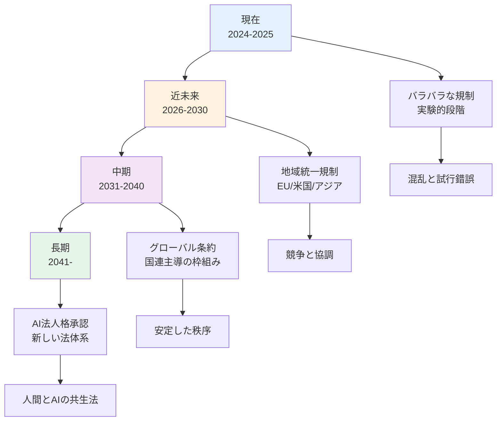

### 技術変遷と法の関係

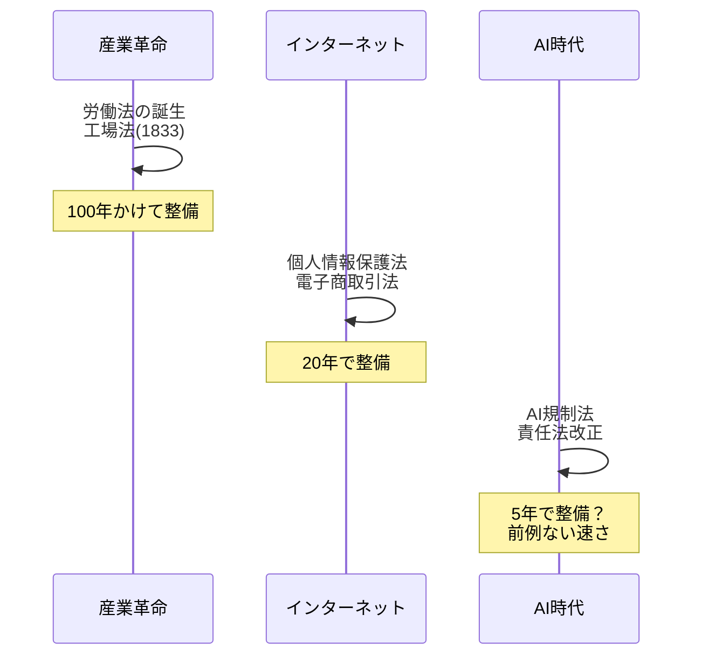

### 置換・変遷関係

**AIが置き換えたもの**：
- 人間の判断 → アルゴリズムの判断（与信審査、採用など）
- 専門家の判断 → AI診断・予測

**AIが変えた法の役割**：
- 事後的な紛争解決 → 事前的なリスク管理
- 人間中心の責任 → システム全体の責任

**継承関係**：
- 製造物責任法（PL法）→ AI製造者責任
- 著作権法 → AI創作物保護法（検討中）

### 競合・代替関係

| 従来の仕組み | AIによる代替 | 競合状況 |
|--------------|--------------|----------|
| **契約書レビュー** | リーガルテックAI | 弁護士業務の一部を代替 |
| **判例検索** | AI法律データベース | 完全に代替進行中 |
| **裁判官の判断** | AI判決支援 | 補助にとどまる（倫理的抵抗） |
| **法律相談** | チャットボット | 簡易相談は代替、複雑案件は人間 |

## 🎓 まとめ：なぜ今、AI法が重要なのか

AIの法的影響は、単なる「新しい技術への対応」ではありません。

**それは人類が直面する根本的な問い**です：
- 「法律」は人間のためだけのものか？
- 「責任」は意識ある存在だけが負うものか？
- 「権利」は生物学的人間だけのものか？

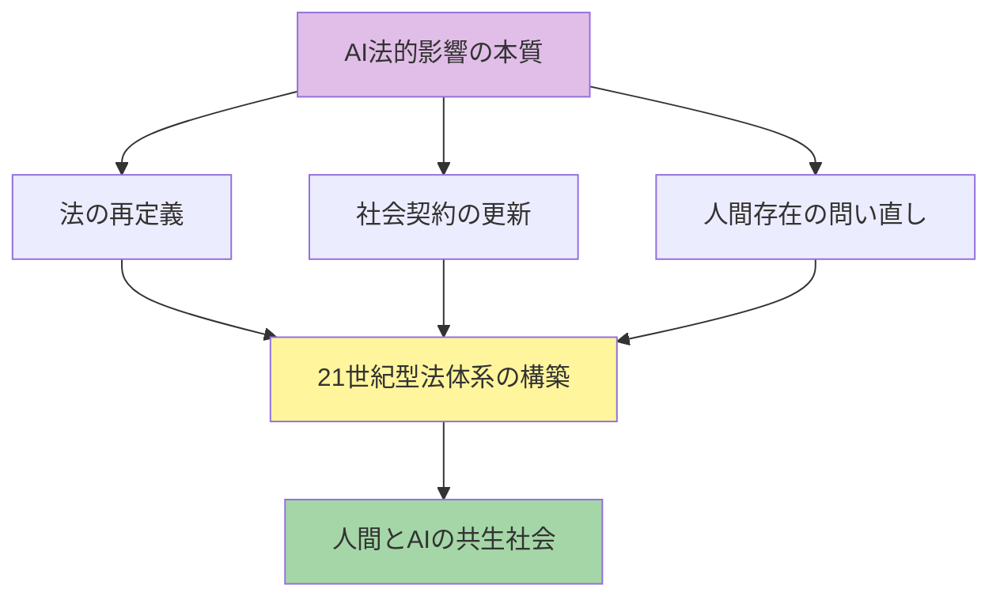

今後数年の法整備が、今世紀の社会の姿を決定します。この変革期に立ち会えることは、歴史の目撃者になることを意味します。

---
