AIの社会的影響（倫理、法律、経済）について

# AI社会的影響 - 初学者のための完全ガイド

## 🔍 一言要約
AIが私たちの生活を変える「光と影」を知り、賢く付き合うための羅針盤

## 📚 目次
1. [🌟 はじめに](#-はじめに)
2. [🏗️ AI社会的影響の基本構造](#️-ai社会的影響の基本構造)  
3. [⚖️ 倫理的影響](#️-倫理的影響)
4. [📝 法的影響](#-法的影響)
5. [💰 経済的影響](#-経済的影響)
6. [📜 時代背景と発見に至った経緯](#-時代背景と発見に至った経緯)
7. [🎨 影響の種類と特徴](#-影響の種類と特徴)
8. [📗 関連する用語](#-関連する用語)
9. [💡 メリットとデメリット](#-メリットとデメリット)
10. [🚀 応用と実例](#-応用と実例)
11. [🔄 置換、変遷](#-置換変遷)
12. [⚡ 代替、競合](#-代替競合)
13. [🌍 実世界への影響とその後の発展](#-実世界への影響とその後の発展)

## 🌟 はじめに

AIの社会的影響を理解することは、まるで「新しい隣人」が引っ越してきたときのようなものです。この隣人は非常に能力が高く、私たちの生活を便利にしてくれますが、同時に私たちの暮らし方や働き方、そして社会のルールまでも変えてしまう力を持っています。

スマートフォンが私たちのコミュニケーションを変えたように、AIは倫理観、法律、経済活動という社会の三本柱に大きな変化をもたらしています。この変化を理解することで、私たちはAIの恩恵を最大限に受けながら、リスクを最小限に抑えることができるのです。

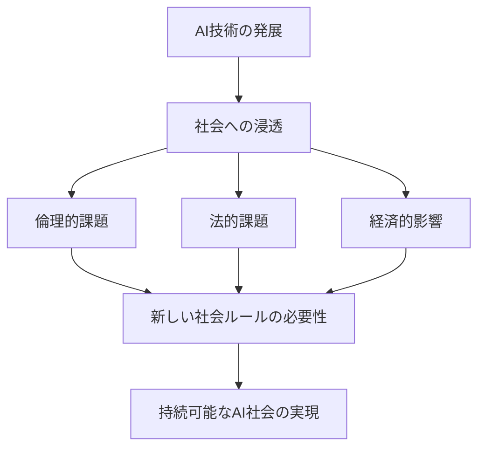

## 🏗️ AI社会的影響の基本構造

AI社会的影響は、まるで池に石を投げ込んだときの波紋のように広がります。中心にあるAI技術から始まり、個人、組織、社会全体へと影響の輪が広がっていきます。

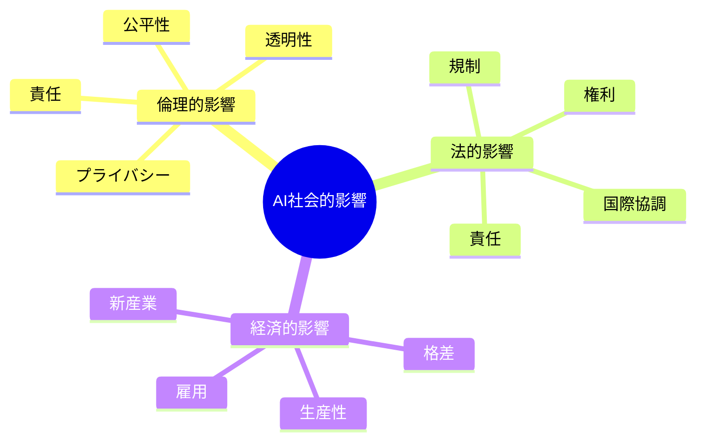

この構造を理解することで、AI導入時に考慮すべき要素を体系的に把握できます。

## ⚖️ 倫理的影響

### プライバシーの変化
AIは私たちの行動パターンを学習するため、まるで「透明人間になったような状態」を作り出します。これは便利さと引き換えに、私たちの内面的な世界が見透かされるリスクを抱えています。

### 公平性への挑戦
AIの判断は、まるで「色眼鏡をかけた審査員」のように、学習データに含まれる偏見を反映してしまうことがあります。これにより、特定のグループが不当に扱われる可能性があります。

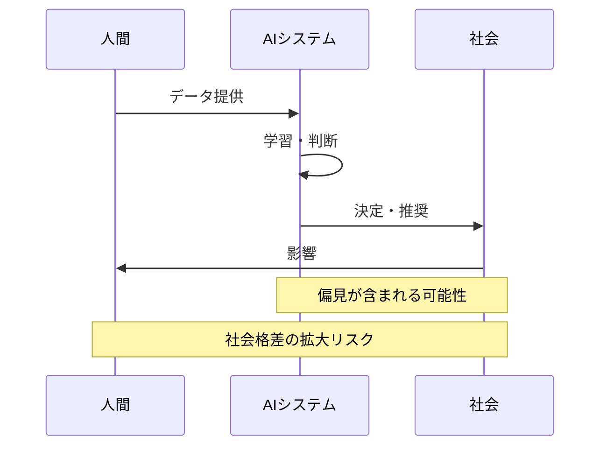

## 📝 法的影響

### 新しいルールの必要性
AIの普及は、まるで「自動車が発明されて交通ルールが必要になった」ときのように、新しい法的枠組みを必要としています。従来の法律では対応できない問題が次々と生まれているのです。

### 責任の所在
AIが間違いを犯したとき、「誰が責任を取るのか」という問題は、まるで「自動運転車が事故を起こしたとき」の責任問題と同じように複雑です。

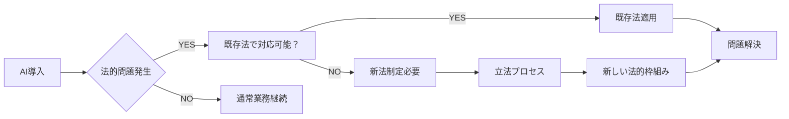

## 💰 経済的影響

### 雇用への影響
AIの導入は「産業革命の現代版」ともいえる変化をもたらしています。一部の仕事は機械に置き換えられますが、同時に新しい種類の仕事も生まれています。

### 経済格差の拡大
AIの恩恵を受けられる企業や個人と、そうでない人々との間に「デジタル格差」が生まれ、これが経済格差を拡大させる可能性があります。

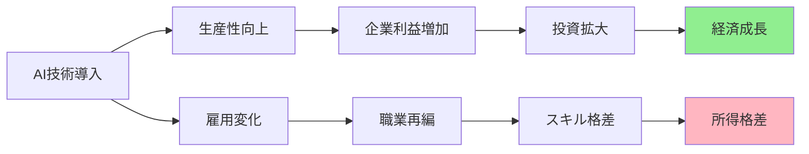

## 📜 時代背景と発見に至った経緯

### AIの社会実装の始まり（2010年代前半）
まるで「スマートフォンが普及し始めた頃」のように、AIが実用化され始めると、人々はその便利さに驚きました。しかし、同時に「これは社会を変えてしまうのではないか」という不安も生まれました。

### 最初の警鐘（2014-2016年）
著名な科学者たちが「AI発展の危険性」について警告を発し始めました。

### 社会的影響の顕在化（2016-2020年）
選挙への影響、雇用の変化、偏見の問題など、AIの社会的影響が現実のものとなり、「理論から実践」の段階に入りました。

### 規制とガイドラインの時代（2020年以降）
各国がAI規制法案を検討し始め、「自動車に安全基準ができた」ように、AIにも社会的なルールが必要だという認識が広まりました。

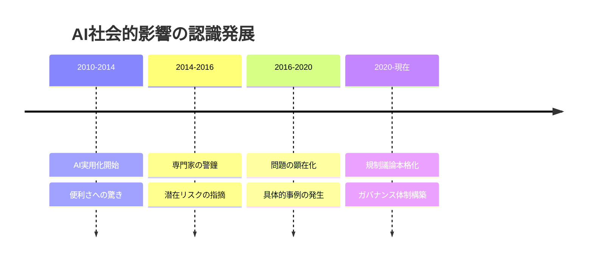

## 🎨 影響の種類と特徴

### 直接的影響 vs 間接的影響
- **直接的影響**: AIが直接個人に与える影響（個人情報の使用、雇用の代替）
- **間接的影響**: AIが社会システムを通じて与える影響（法制度の変化、文化の変化）

### 短期的影響 vs 長期的影響
- **短期的影響**: すぐに現れる影響（効率化、コスト削減）
- **長期的影響**: 時間をかけて現れる影響（社会構造の変化、価値観の変化）

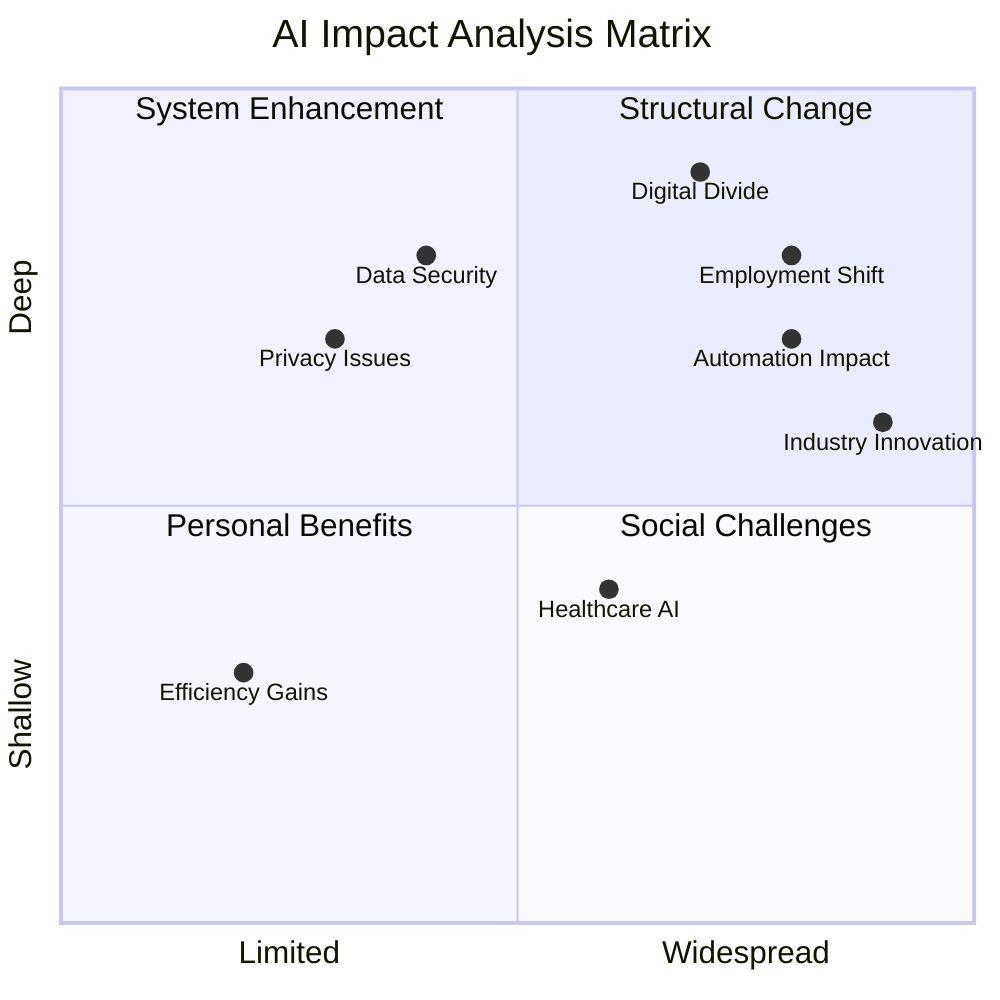

## 📗 関連する用語

### 基本用語
- **AI倫理（AI Ethics）**: AIの開発・利用において守るべき道徳的原則
- **アルゴリズムバイアス**: AIの判断に含まれる偏見や不公平性
- **デジタル格差**: 技術の恩恵を受けられる人とそうでない人の差

### 同義語・類義語
- **AI統治 ≈ AIガバナンス**: AI技術を適切に管理・運用すること
- **機械学習の透明性 ≈ 説明可能AI**: AIの判断過程を人間が理解できるようにすること
- **技術的失業 ≈ 自動化失業**: AIや自動化により仕事を失うこと

### 対義語
- **AI楽観論 ⇔ AI悲観論**: AIの将来に対する前向き/後ろ向きな見方
- **規制推進 ⇔ 自由放任**: AI発展に対する介入の度合い

## 💡 メリットとデメリット

### メリット（光の部分）
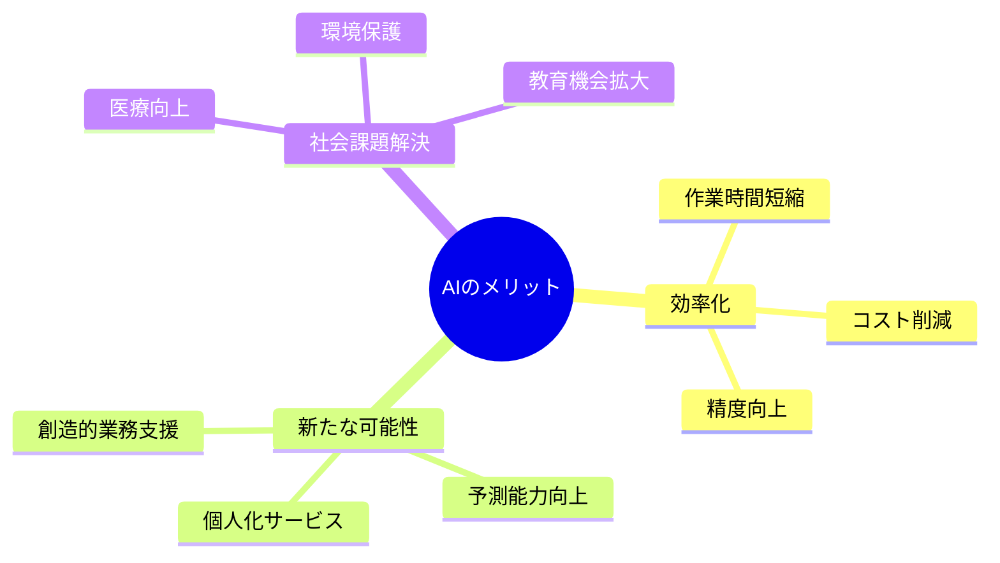

### デメリット（影の部分）
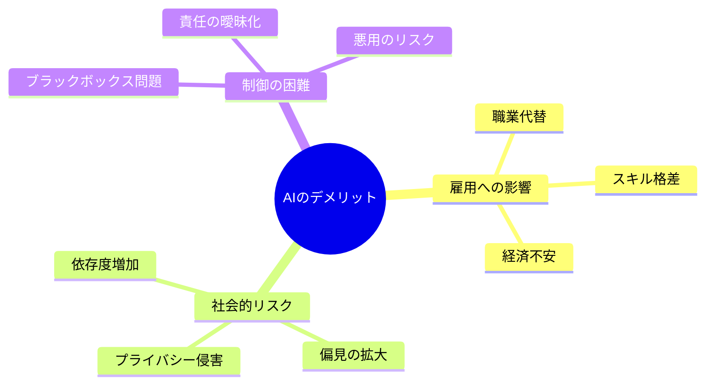

## 🚀 応用と実例

### 身近な実例

**採用活動でのAI利用**
まるで「履歴書を読む人事担当者」のように、AIが応募者を評価します。効率的ですが、AIの判断基準に偏見が含まれていれば、特定のグループが不当に評価される可能性があります。

**金融業界での与信判断**
「銀行の融資担当者」の役割をAIが果たします。大量のデータを分析して正確な判断を下せますが、過去のデータに基づく判断のため、社会的偏見を反映してしまうリスクがあります。

**医療診断支援**
「専門医の第二意見」として、AIが病気の診断を支援します。診断精度は向上しますが、AIの判断を過信することで、医師の診断能力が低下するリスクもあります。

### 実社会での応用パターン
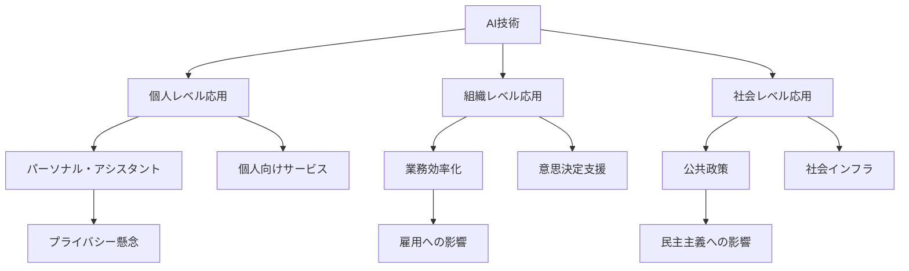

## 🔄 置換、変遷

### 何かを置き換えたもの
AIは「人間の判断」の一部を置き換えています。まるで「計算機が暗算を置き換えた」ように、複雑な分析や決定の一部をAIが担うようになりました。

### 何かに置き換えられる可能性
現在のAIベースの判断システムは、将来的により高度な「汎用人工知能（AGI）」に置き換えられる可能性があります。これは「電話がスマートフォンに進化した」ような変化かもしれません。

### 継承したもの
AIは人間社会の「意思決定プロセス」を継承しています。人間の判断パターンをデータから学習し、それを自動化したものです。

### 継承されるもの
AIの判断メカニズムは、将来の「自律的システム」に継承される可能性があります。現在のAI倫理や法的枠組みが、未来のAI社会の基礎となるでしょう。

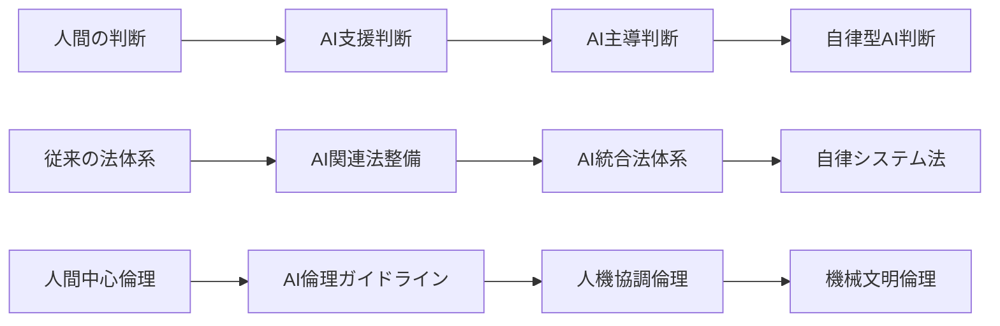

## ⚡ 代替、競合

### 代替できるもの
- **単純な判断業務**: ルールベースの決定を自動化
- **データ分析業務**: 人間よりも高速・正確な分析
- **予測業務**: パターン認識による将来予測

### 代替されるもの
- **創造的判断**: 人間の直感や創造性が必要な分野
- **倫理的判断**: 複雑な価値判断が必要な決定
- **対人的業務**: 共感や人間関係が重要な仕事

### 競合するもの
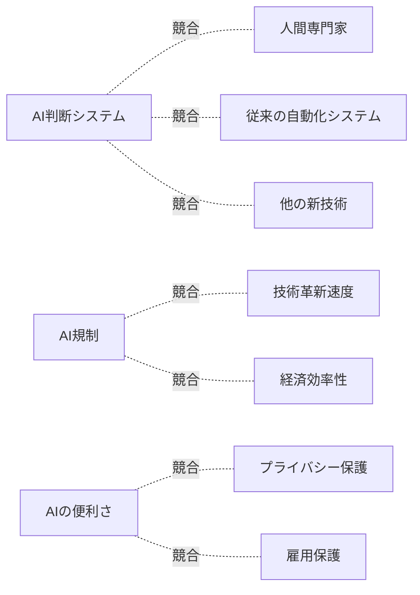

## 🌍 実世界への影響とその後の発展

### 現在の影響

**労働市場の変化**
まるで「コンピューターが普及したとき」のように、一部の職業は消失し、新しい職業が生まれる可能性があります。データサイエンティストやAIエンジニアのような新しい専門職が注目されています。

**教育システムの変化**
学校教育でも「AI時代に必要なスキル」が重視されるようになりました。これは「インターネット普及時に情報リテラシー教育が始まった」ときと似ています。

**法制度の発展**
各国でAI規制法案が検討され、「自動車に安全基準ができた」ように、AIにも社会的なルールが整備されつつあります。

### 未来展望

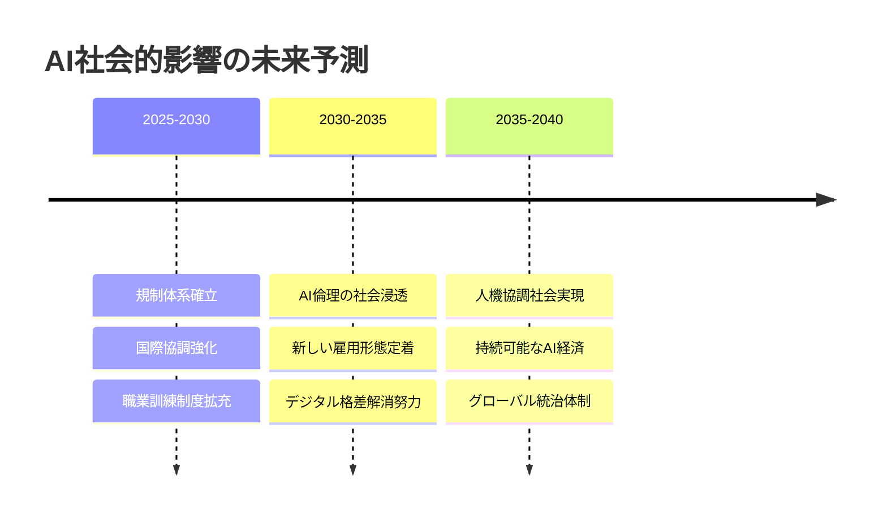

**持続可能なAI社会の実現**
未来のAI社会は、「技術と人間が協調する社会」になると予想されます。AIの恩恵を全ての人が享受できるよう、教育制度や社会保障制度の改革が進むでしょう。

**グローバルな統治体制**
「気候変動対策のような国際協力」が必要になり、AI技術の開発と利用に関する国際的なルールづくりが進むでしょう。

**新しい価値観の醸成**
AI時代には「効率性だけでなく、人間らしさの価値」が再認識され、テクノロジーと人間性のバランスを重視する新しい価値観が生まれるでしょう。

---

この資料は、AI社会的影響という複雑なテーマを、初学者でも理解できるよう体系的に整理しました。技術的側面だけでなく、人間社会への影響を多角的に捉え、未来への展望まで含めた包括的なガイドとなっています。
