AIの種類のうち、音声認識（SpeechRecognition）のなかでも、音楽認識について

# 音楽認識 - 初学者のための完全ガイド

## 🔍 一言要約
音が鳴っている曲を聴かせるだけで、曲名やアーティストを自動的に識別するAI技術

## 📚 目次
1. [はじめに](#-はじめに)
2. [基本構造](#-基本構造)
3. [主要技術](#-主要技術)
4. [時代背景と発見に至った経緯](#-時代背景と発見に至った経緯)
5. [種類と特徴](#-種類と特徴)
6. [関連する用語](#-関連する用語)
7. [メリットとデメリット](#-メリットとデメリット)
8. [応用と実例](#-応用と実例)
9. [置換と変遷](#-置換変遷)
10. [代替と競合](#-代替競合)
11. [実世界への影響とその後の発展](#-実世界への影響とその後の発展)

## 🌟 はじめに

カフェで流れている曲が気になったとき、スマホを取り出して数秒聴かせるだけで曲名が分かる──これが音楽認識です。

**日常の例え**：人間の顔認識と似ています。友人の顔を見て誰か分かるように、音楽認識は「曲の顔」を覚えて識別します。膨大な曲のデータベースの中から、ノイズだらけの環境でも正確に曲を見つけ出せる驚異的な技術です。

## 🏗️ 基本構造

音楽認識は3つの段階で動作します。

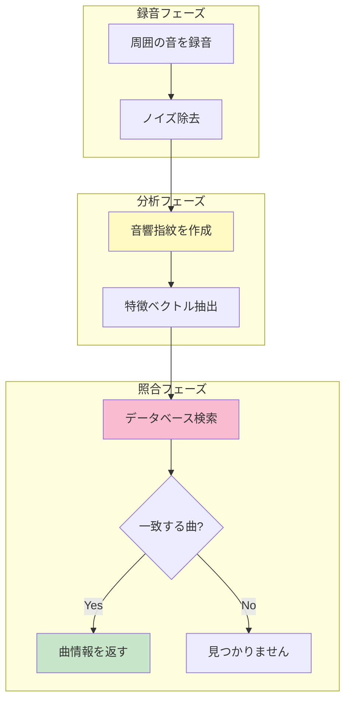

**わかりやすく言うと**：
1. **録音**：周りの音を拾う（雑音も含む）
2. **指紋作成**：曲の「DNA」のような固有の特徴を抽出
3. **照合**：何百万曲の中から一致する曲を探す

## ⚡ 主要技術

### 1. 音響指紋（Audio Fingerprinting）

**日常での例え**：人間の指紋のように、曲にも固有の「音の指紋」があります。

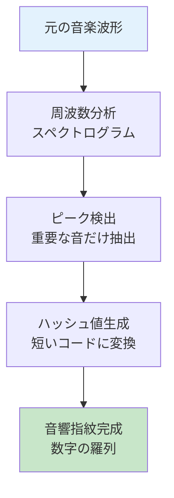

**具体例**：
- 原曲：3分間の音楽ファイル（30MB）
- 指紋：数百バイトの数値データ
- 圧縮率：約100,000分の1に縮小

### 2. スペクトログラム解析

**わかりやすい説明**：音を「時間×周波数」の2次元画像に変換します。虹色の絵のように、どの時間にどの高さの音が鳴っているかが視覚的に分かります。

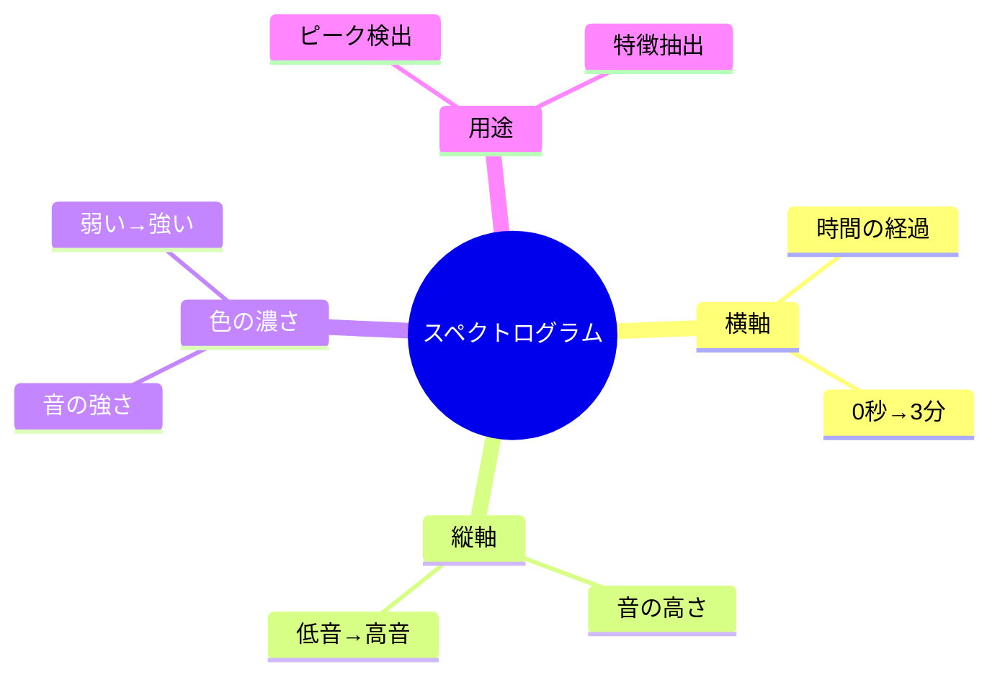

### 3. ハッシュ関数とデータベース検索

**例え話**：図書館で本を探すとき、全ての本を1冊ずつ確認しません。分類番号（ハッシュ）を使えば一瞬で見つかります。

| 技術要素 | 役割 | 速度 |
|---------|------|------|
| ハッシュテーブル | 高速検索用の索引 | 0.1秒以内 |
| 近似一致アルゴリズム | ノイズがあっても照合 | リアルタイム |
| 分散データベース | 数億曲を管理 | 並列処理 |

## 📜 時代背景と発見に至った経緯

### 時系列で見る音楽認識の歴史

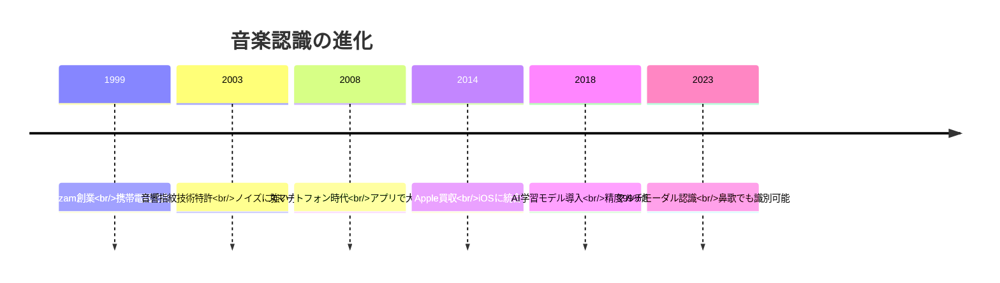

### 開発のきっかけ

**創業者の実体験**：
1999年、Shazam創業者クリス・バートンは、バーで流れている曲が気になっても誰も曲名を知らない状況に直面しました。

**当時の課題**：
- CD店で店員に「ラララ♪」と歌って聞く
- ラジオ局に電話して問い合わせる
- 運が良ければDJが曲名を言う

**技術的ブレイクスルー**：
音響研究者アブリル・ワンが、人間の耳では聞き取れないほど小さなノイズの中でも、曲の特徴を数学的に抽出できることを発見しました。

## 🎨 種類と特徴

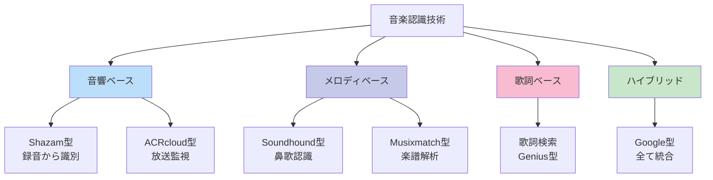

## 📗 関連する用語

### 同義語・類似表現
- **音楽認識** = Music Recognition
- **音響指紋** = Audio Fingerprinting = Acoustic Fingerprint
- **オーディオマッチング** = Audio Matching
- **曲識別** = Song Identification

### 対義語的概念
- **音楽生成**：認識の逆で、AIが新しい曲を作る
- **音楽推薦**：好みに基づいて曲を提案（識別ではない）

### 多義語の注意
- **音声認識（Speech Recognition）**：人の話し言葉をテキスト化
- **音楽認識（Music Recognition）**：楽曲を識別
- 両者は全く異なる技術です

### 類義語の比較

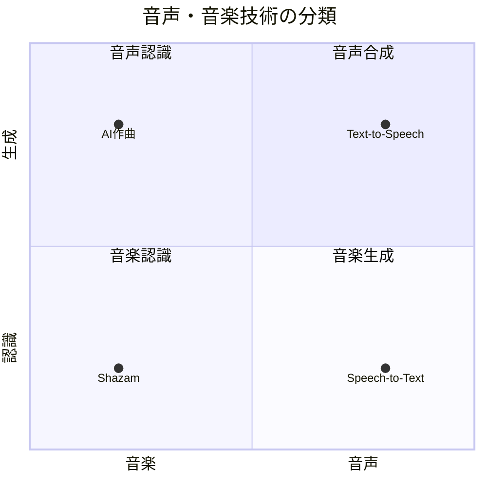

## 💡 メリットとデメリット

### メリット

| 利点 | 具体例 |
|------|--------|
| 🚀 **即座に識別** | 数秒で数億曲から検索 |
| 🎧 **ノイズに強い** | 騒がしいカフェでも動作 |
| 🌍 **言語不要** | 歌詞が分からなくてもOK |
| 📱 **手軽** | スマホ1つで完結 |
| 💰 **無料** | 多くのアプリが無料提供 |

### デメリット

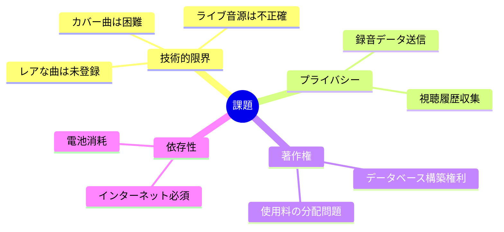

**具体例**：
- ❌ 友人が歌ったカバーは認識できない（原曲と波形が違う）
- ❌ インディーズバンドの曲は登録されていない
- ❌ クラシックは演奏者で違う録音が多数存在

## 🚀 応用と実例

### 身近な実例

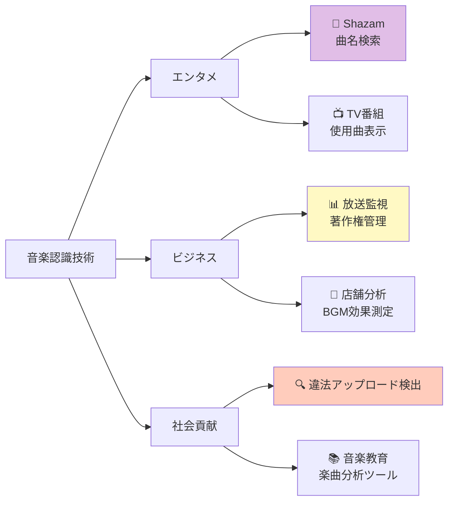

### 応用分野の詳細

1. **著作権管理**
   - YouTubeのContent ID
   - ラジオ・TV局での楽曲使用料計算
   - 違法コピーの自動検出

2. **マーケティング**
   - 店舗のBGM効果分析
   - CMで流れた曲の特定
   - 音楽トレンド分析

3. **アクセシビリティ**
   - 視覚障害者向け音楽情報
   - 音楽教育での楽曲分析
   - カラオケの採点システム

## 🔄 置換、変遷

### 何を置き換えたか

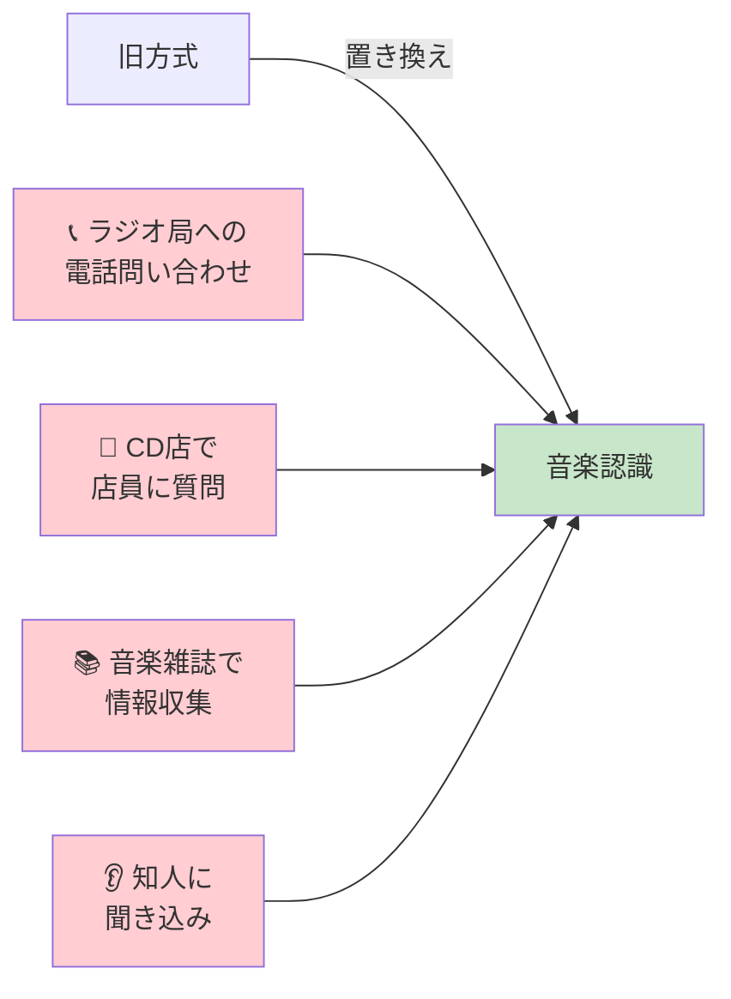

### 何に置き換えられつつあるか

**現在進行中の変化**：
- 単純な曲識別 → **文脈理解型認識**
  - 「悲しい曲」「運動向けの曲」など感情・用途での検索
- 録音必須 → **環境統合型**
  - スマートスピーカーが常時リスニング
  - 「今流れている曲」を自動記録

### 継承関係

**何を継承したか**：
- **信号処理技術**：1960年代のFFT（高速フーリエ変換）
- **パターン認識理論**：1980年代の画像認識研究
- **ハッシュ技術**：1970年代のデータベース技術

**何に継承されたか**：
- **マルチモーダルAI**：音声・画像・テキストを統合認識
- **環境音認識**：鳥の鳴き声、機械音の識別へ応用
- **感情認識AI**：音楽から感情を読み取る技術

## 🔀 代替、競合

### 代替可能な技術

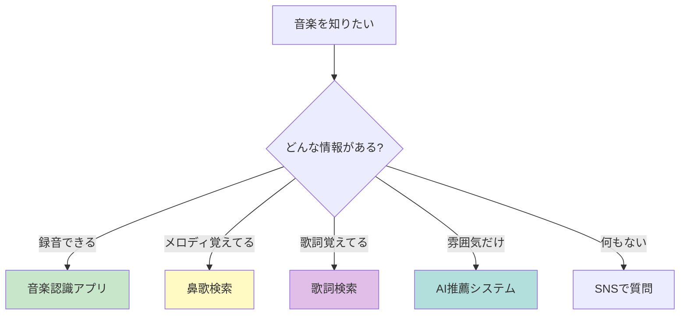

### 競合サービス比較

| サービス | 強み | 弱み | シェア |
|---------|------|------|--------|
| **Shazam** | 認識精度最高 | 鼻歌不可 | 40% |
| **SoundHound** | 鼻歌対応 | データベース小 | 25% |
| **Google音声検索** | 統合性高い | 専門性低い | 20% |
| **Musixmatch** | 歌詞に強い | 音響認識弱い | 10% |
| **その他** | - | - | 5% |

### 技術的競合

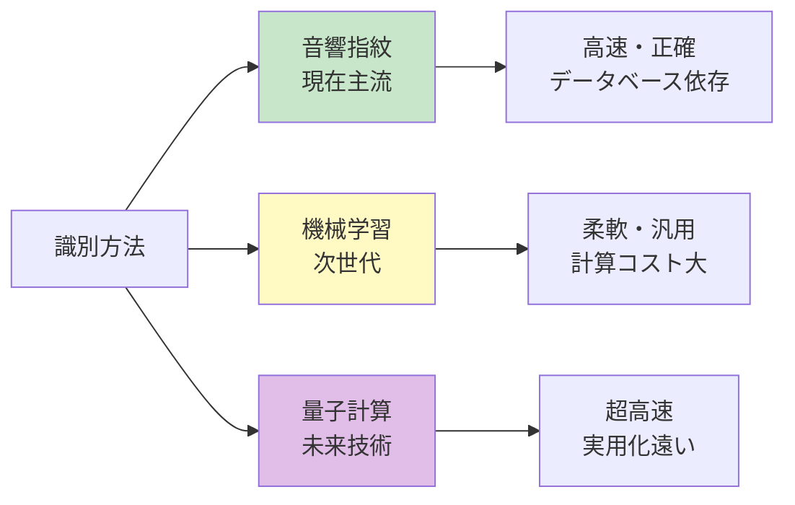

## 🌍 実世界への影響とその後の発展

### 音楽業界への影響

**ポジティブな変化**：
1. **新曲発見の民主化**
   - 無名アーティストも発見されやすく
   - Shazamランキングがヒットチャートに影響

2. **著作権管理の効率化**
   - 使用楽曲の自動追跡
   - 適正なロイヤリティ分配

3. **マーケティング革命**
   - リアルタイム人気度測定
   - ターゲット広告の精度向上

**ネガティブな側面**：
- プライバシー懸念（常時リスニング）
- 小規模アーティストのデータ未登録問題
- 技術独占による市場支配

### 今後の発展予測

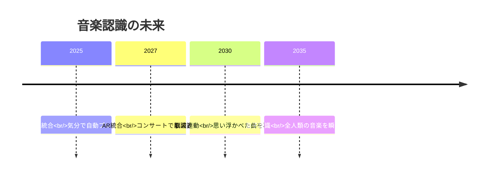

### 次世代技術への橋渡し

**発展方向**：

1. **コンテキスト理解型AI**
   - 場所・時間・気分を考慮した音楽推薦
   - 「雨の日の午後に合う曲」を自動選曲

2. **マルチモーダル統合**
   - 音楽+映像+テキストの統合認識
   - 映画シーンから使用曲を特定

3. **生成AIとの融合**
   - 認識した曲のアレンジを自動生成
   - 「この曲のピアノ版」を即座に作成

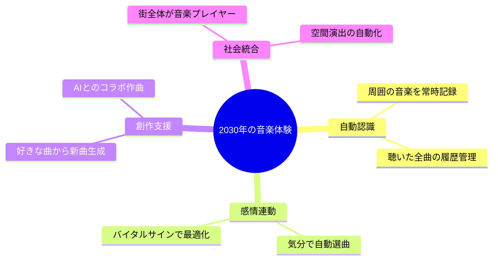

---

