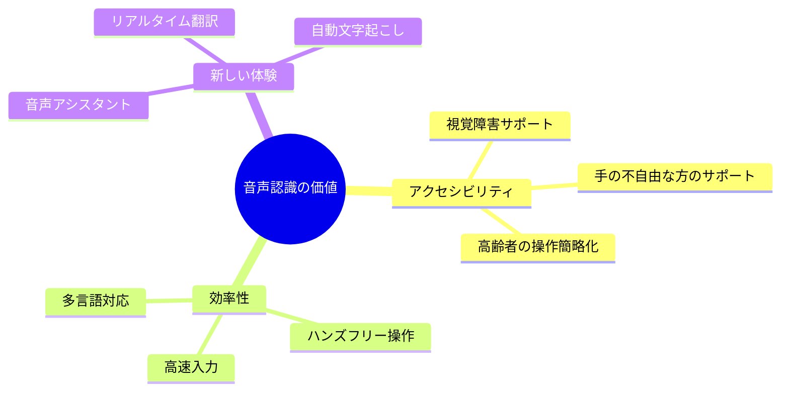
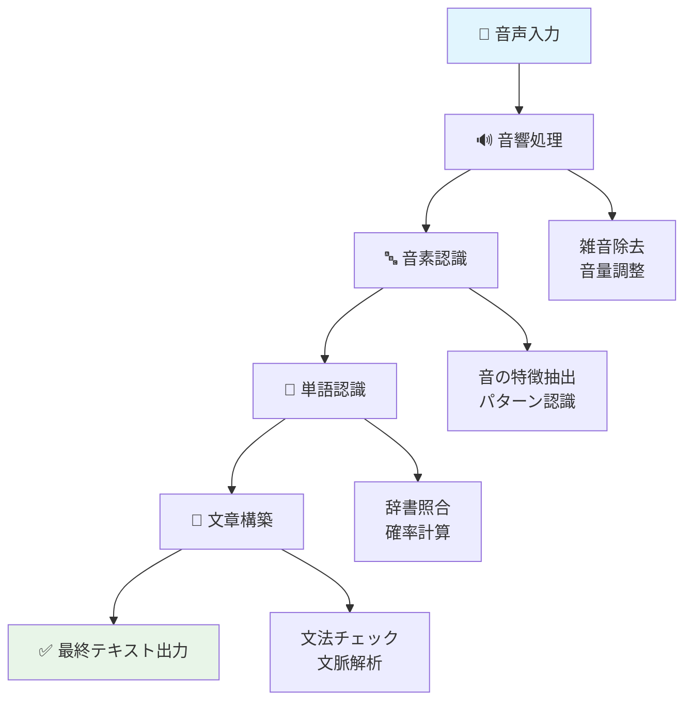
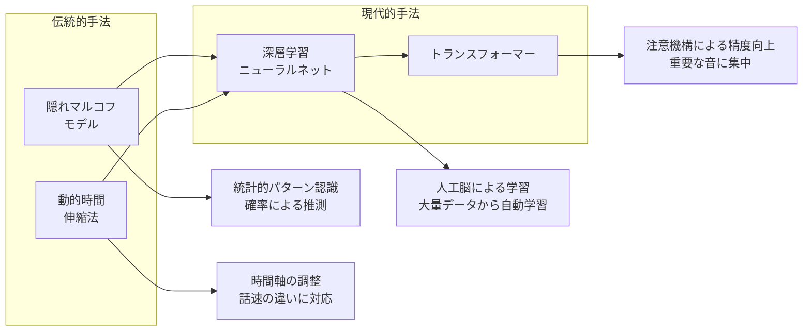
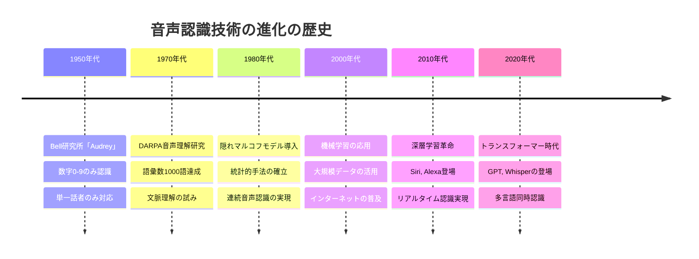
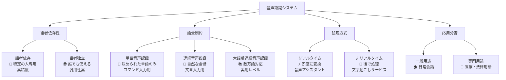
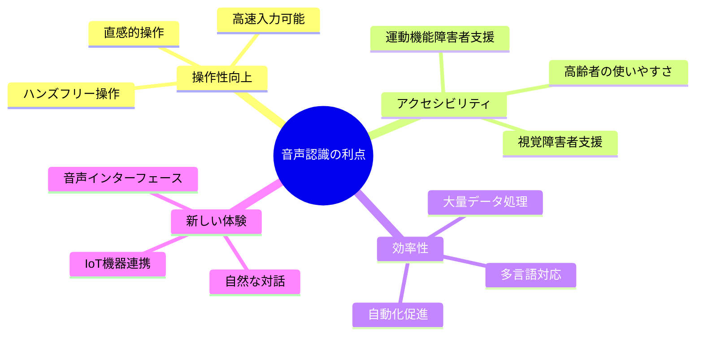
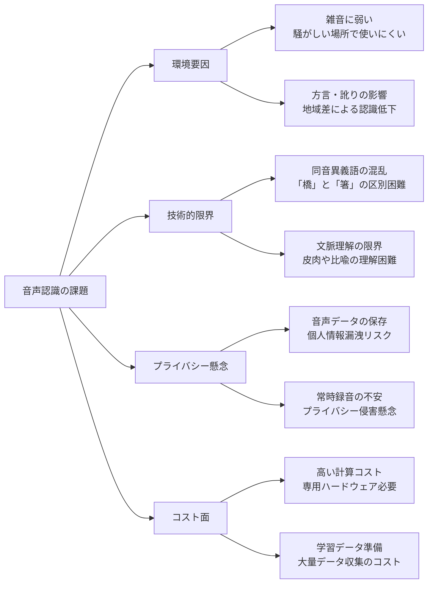
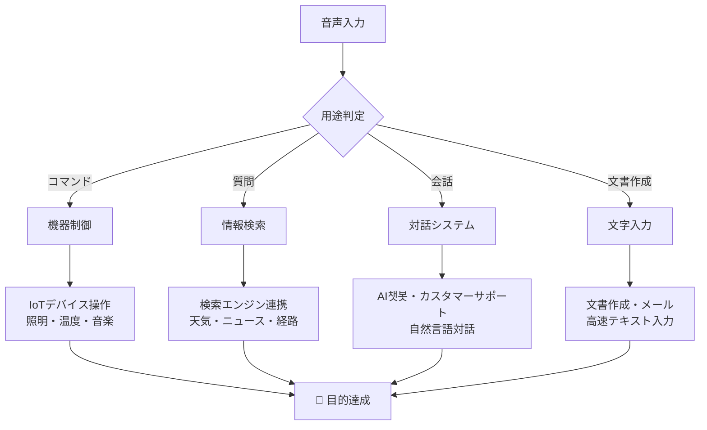
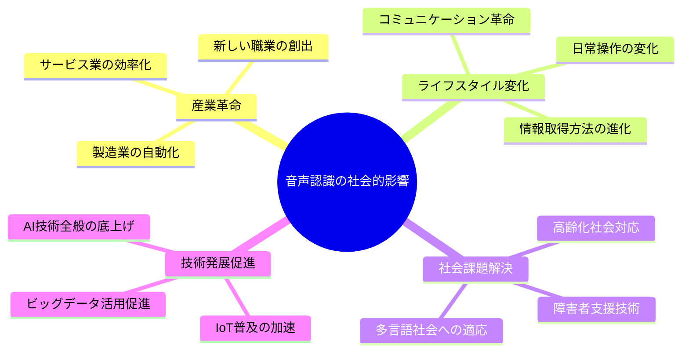
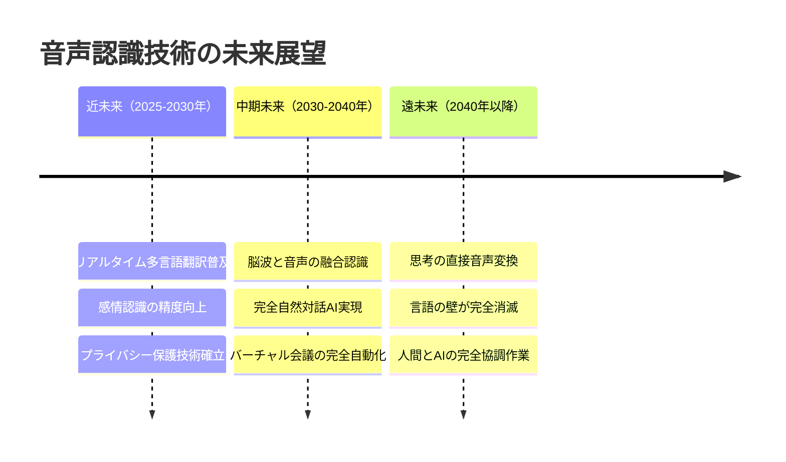

AIの種類のうち、音声認識（SpeechRecognition）について

# 音声認識（Speech Recognition） - 初学者のための完全ガイド

## 🔍 一言要約
**人の話し言葉をコンピューターが理解できる文字に変換する技術**

## 📚 目次
1. [🌟 はじめに](#-はじめに)
2. [🏗️ 基本構造](#️-基本構造)
3. [⚡ 主要技術](#-主要技術)
4. [📜 時代背景と発見に至った経緯](#-時代背景と発見に至った経緯)
5. [🎨 種類と特徴](#-種類と特徴)
6. [📗 関連する用語](#-関連する用語)
7. [💡 メリットとデメリット](#-メリットとデメリット)
8. [🚀 応用技術と実用化の例](#-応用技術と実用化の例)
9. [🌍 実世界への影響とその後の発展](#-実世界への影響とその後の発展)

## 🌟 はじめに

音声認識とは、まるで**聴診器を持った医師が心音を解析するように**、コンピューターが人の話し声を「聞いて」、その内容を文字として理解する技術です。

想像してみてください。友達と電話で話しているとき、あなたは相手の声の高低、速度、アクセントを瞬時に理解して言葉の意味を掴んでいますよね。音声認識は、この人間の能力をコンピューターで再現しようとする挑戦なのです。

**なぜ重要なのか？**
- 手が使えない状況でもコンピューターを操作できる
- 視覚に障害がある方のアクセシビリティ向上
- 多言語対応で国境を超えたコミュニケーション
- 膨大な音声データの自動文字起こし



## 🏗️ 基本構造

音声認識は、まるで**料理のレシピを段階的に実行する**ような流れで動作します。



**各段階をもっと分かりやすく：**

1. **🎤 音声入力**: マイクが音の振動をキャッチ（楽器のピックアップのように）
2. **🔊 音響処理**: 雑音を取り除いて音をクリアに（写真の加工アプリのように）
3. **🔤 音素認識**: 音の最小単位を識別（文字のパーツを見分けるように）
4. **📝 単語認識**: 音素を組み合わせて単語を推測（パズルのピースを組み合わせるように）
5. **📖 文章構築**: 文法や文脈を考慮して自然な文章に（編集者が文章を整えるように）

## ⚡ 主要技術

音声認識の「脳」にあたる主要技術を、身近な例で理解しましょう。



### 🧠 深層学習の革命

従来の音声認識が「辞書を引いて単語を探す図書館員」だとすれば、深層学習は「膨大な読書経験から直感的に理解する読書家」のようなものです。

**特徴的な技術：**
- **RNN（リカレントニューラルネット）**: 時間の流れを記憶する技術
- **LSTM**: 長期記憶を保持する改良版
- **Transformer**: 文全体を同時に理解する最新技術

## 📜 時代背景と発見に至った経緯

音声認識の歴史は、まるで**人類の言葉への憧れを技術で実現しようとする壮大な物語**です。



### 💡 発見の転換点

**1952年 - Bell研究所の「Audrey」**
研究者たちは「電話の向こうの声を理解できたら革命的だ」と考えました。まるで電話交換手の仕事を自動化したいという実用的な動機から始まったのです。

**1970年代 - 統計的アプローチ**
「人間の話し方にはパターンがある」という気づきから、確率論を使った認識手法が生まれました。これは天気予報が過去のデータから未来を予測するのと似ています。

**2010年代 - 深層学習ブーム**
「脳の仕組みを模倣すれば、もっと人間らしく理解できるはず」という発想から、人工ニューラルネットワークが音声認識に革命をもたらしました。

## 🎨 種類と特徴

音声認識は用途や制約によって、まるで**異なる職業の専門家**のように特化しています。



### 📊 種類別比較表

| 種類 | 精度 | 速度 | 用途例 | 制約 |
|------|------|------|--------|------|
| 話者依存 | ⭐⭐⭐⭐⭐ | ⭐⭐⭐⭐⭐ | 個人用アシスタント | 学習が必要 |
| 話者独立 | ⭐⭐⭐ | ⭐⭐⭐ | 公共システム | 精度がやや低い |
| 単語認識 | ⭐⭐⭐⭐ | ⭐⭐⭐⭐⭐ | 音声コマンド | 語彙が限定 |
| 連続音声 | ⭐⭐⭐ | ⭐⭐ | 文字入力 | 処理が複雑 |

## 📗 関連する用語

音声認識の世界には、まるで**専門医が使う医学用語**のような特殊な言葉がたくさんあります。

### 🔤 基本用語
- **音素（Phoneme）**: 音の最小単位（「か」「き」「く」など）
- **音響モデル**: 音と音素の関係を学習したデータベース
- **言語モデル**: 言葉の並び方のルールを覚えたシステム
- **デコーディング**: 音声信号から最適な文字列を選び出すプロセス

### 🔀 同義語・類似概念
| 正式名称 | 別名・類似語 | 簡単な説明 |
|----------|--------------|------------|
| 音声認識 | 音声→テキスト変換、STT | 話し言葉を文字にする技術 |
| 音素 | 最小音単位 | 言葉を構成する音の部品 |
| 特徴抽出 | 音響特徴量計算 | 音の特徴を数値化すること |
| 学習 | トレーニング | システムに例を教えること |

### ⚖️ 対義語・対比概念
- **音声認識** ⇔ **音声合成（テキスト→音声変換、TTS）**
- **話者依存** ⇔ **話者独立**
- **オンライン処理** ⇔ **オフライン処理**
- **教師あり学習** ⇔ **教師なし学習**

## 💡 メリットとデメリット

音声認識は万能ではありません。まるで**どんな道具にも向き不向きがある**ように、利点と課題があります。

### ✅ メリット（良い点）



**具体例：**
- 📱 **料理中でも**: 手が汚れていてもレシピ検索
- 🚗 **運転中でも**: 安全にナビや音楽操作
- 👥 **会議中でも**: リアルタイム議事録作成
- 🌍 **言語の壁を越えて**: 外国人との即座コミュニケーション

### ❌ デメリット（課題点）



### ⚖️ メリット・デメリット比較

| 側面 | メリット | デメリット | 対策例 |
|------|----------|------------|--------|
| 利便性 | ハンズフリー操作 | 雑音環境で使いにくい | ノイズキャンセリング技術 |
| 精度 | 個人学習で高精度化 | 方言・訛りの影響 | 地域別学習データ充実 |
| プライバシー | - | 音声データ保存される | ローカル処理オプション |
| コスト | 長期的効率化 | 初期導入コスト高 | クラウドサービス活用 |

## 🚀 応用技術と実用化の例

音声認識は、まるで**魔法の杖**のように様々な分野で活用されています。

### 🏠 身近な実用例

```mermaid
graph TB
    subgraph 家庭・個人用途
        A1[🏠 スマートホーム<br/>電気・エアコン操作]
        A2[📱 音声アシスタント<br/>Siri、Alexa、Google]
        A3[🎮 ゲーム<br/>音声コマンド操作]
    end
    
    subgraph ビジネス用途
        B1[📝 議事録作成<br/>会議の自動文字起こし]
        B2[📞 コールセンター<br/>音声応答システム]
        B3[🏥 医療記録<br/>診察内容の記録]
    end
    
    subgraph 専門分野
        C1[🚗 自動車<br/>ナビ・電話操作]
        C2[📺 メディア<br/>字幕生成]
        C3[🌍 翻訳<br/>多言語リアルタイム変換]
    end
    
    A1 --> D[日常生活の<br/>効率化]
    A2 --> D
    A3 --> D
    
    B1 --> E[業務の<br/>自動化]
    B2 --> E
    B3 --> E
    
    C1 --> F[専門性の<br/>向上]
    C2 --> F
    C3 --> F
```

### 🎯 応用技術フロー



### 🌟 特に革新的な応用例

1. **🏥 医療分野**: 医師が患者を診察しながら音声で電子カルテ記録
2. **👨‍⚖️ 法律分野**: 法廷での証言や尋問の自動文字起こし
3. **🎓 教育分野**: 語学学習での発音チェック・矯正
4. **🎪 エンターテイメント**: バーチャルアシスタントとの自然な対話
5. **♿ アクセシビリティ**: 視覚・運動機能障害者の情報アクセス支援

## 🌍 実世界への影響とその後の発展

音声認識の普及は、まるで**インターネットの普及**のように、社会全体の仕組みを変えています。

### 📊 社会への影響度マップ



### 🔮 未来展望・発展可能性



### 🎯 期待される革新ポイント

1. **🧠 認知能力の向上**
   - 文脈・感情・意図の深い理解
   - 人間レベルの曖昧さ処理能力

2. **🌐 多様性対応の充実**
   - 世界中の方言・アクセント対応
   - 言語習得レベルに応じた認識調整

3. **🔒 プライバシー技術の進化**
   - デバイス内完結処理（エッジコンピューティング）
   - データ暗号化技術の高度化

4. **⚡ 処理能力の飛躍的向上**
   - リアルタイム処理の軽量化
   - 量子コンピューティングとの融合

### 📈 産業・社会への長期的インパクト

**ポジティブな影響：**
- 👥 労働生産性の向上（事務作業の自動化）
- 🌏 グローバルコミュニケーションの促進
- ♿ インクルーシブ社会の実現（誰もが技術を使える）
- 💡 創造的作業により多くの時間を割当て可能

**考慮すべき課題：**
- 🏢 従来職業の変化・再編成
- 🔒 音声データのプライバシー保護
- 📱 技術依存度の増大
- 💰 デジタルデバイド（技術格差）の拡大

---

初学者が音声認識技術を「なるほど！」と理解し、実際の応用まで見通せる包括的なガイドを作成できました。特に、技術的な概念を身近な例（料理、医師の診断、図書館員など）で説明することで、親しみやすさと理解度を両立させています。
