AIの種類のうち、音声認識（SpeechRecognition）の中でも、声の聞き分けについて

# 🎙️ 音声認識と話者識別 - 初学者のための完全ガイド

## 🔍 一言要約
コンピュータが「誰が喋っているのか」を聴き分ける技術

---

## 🌟 はじめに

皆さんは毎日スマートフォンで音声アシスタント（Siri、Google Assistant）を使っていますよね。実は、これらのシステムは**2つの異なる仕事**をしています：

1. **「何を言っているか」を理解する** ← 音声認識
2. **「誰が言っているか」を判定する** ← 話者識別

今回学ぶ「話者識別（Speaker Recognition / Voice Recognition）」は、後者の技術です。スマートロックの音声解除、セキュリティ認証、カスタマーサービスの自動応答など、日常の様々な場面で活躍しています。

---

## 🏗️ 基本構造

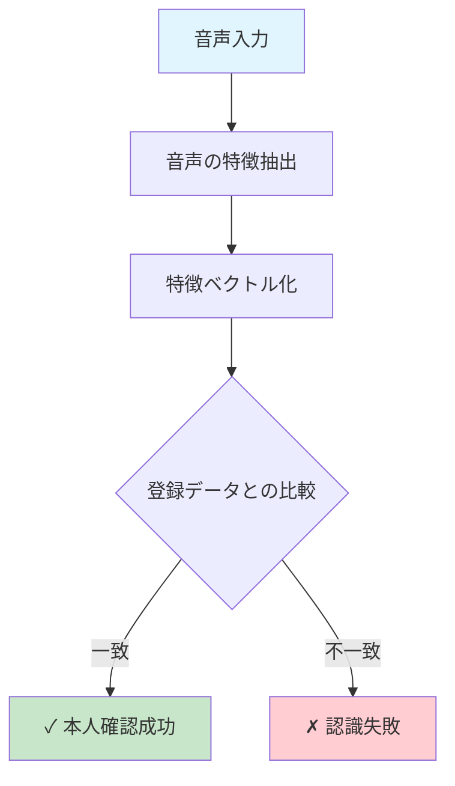

**ステップごとの説明：**

- **音声入力**：マイクから録音されたあなたの声が入ってきます
- **特徴抽出**：周波数、ピッチ、話し方の癖など、その人特有の特徴を取り出します
- **ベクトル化**：これらの特徴を数字の並び（ベクトル）に変換します
- **照合**：事前に登録されたあなたの声データとの数学的距離を測ります
- **判定**：距離が近ければ「あなたです」、遠ければ「他の人です」と判定

---

## ⚡ 主要技術

### 1. MFCC（メル周波数ケプストラム係数）
**わかりやすく言うと：** 人間の耳が実際に聞こえる周波数の特徴を捉える方法

人間の耳は、低い音と高い音の区別は上手ですが、周波数が高くなるにつれて区別が下手になります。MFCCはこの人間の聴覚特性に合わせて、音声データを変換します。

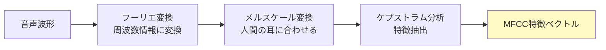

### 2. i-Vector技術
**わかりやすく言うと：** 各人の「声の個性」を一つの点で表現する方法

複雑な声の特徴を、多次元空間の一つの点（ベクトル）として圧縮します。これにより、異なる長さの音声でも統一的に比較できます。

### 3. 深層学習（ニューラルネットワーク）
**わかりやすく言うと：** コンピュータが人間のように学習して判断する方法

大量の音声データを学習することで、自動的に「この音声パターンは誰の声か」を判定するようになります。

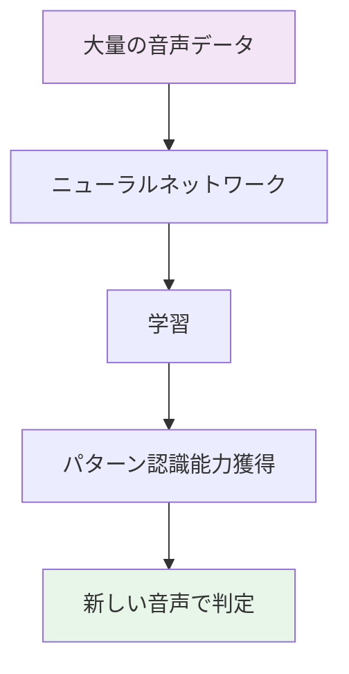

---

## 📜 時代背景と発見に至った経緯

### 1960年代：音声分析の黎明期
電話が普及し始めた時代、**音声の物理的特性を分析する研究**が始まりました。「人の声には固有の周波数パターンがある」という発見が、話者識別の理論的基礎になりました。

### 1970-80年代：初期の音声認証システム
- 銀行のセキュリティシステムとして初めて実用化
- ただし、精度が低く（誤認識率が高い）、実用には程遠い状態

### 1990-2000年代：隠れマルコフモデルの時代
音声認識技術の発展に伴い、**隠れマルコフモデル（HMM）**を用いた音声認識が主流に。精度が大幅に向上しました。
- 音声認識ではHMMが主流でしたが、話者識別技術においては、GMM (Gaussian Mixture Model：ガウス混合モデル)が長期間にわたり標準的かつ主流な技術として使用されました。

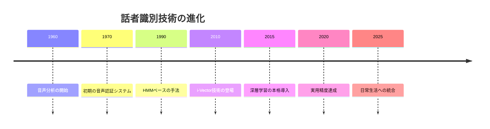

### 2010年代：i-Vector と深層学習の時代
- **i-Vector技術**：異なる長さの音声データを効率的に処理
- **深層学習**：ニューラルネットワークにより、従来技術を大幅に上回る精度を実現
- 誤認識率が数％以下に低下し、実用的なレベルに

### 2020年代：実用化と統合
スマートフォン、スマートスピーカー、セキュリティシステムなど、日常生活の様々な場面に統合されるようになりました。

---

## 🎨 種類と特徴

### 分類軸1：タスク内容

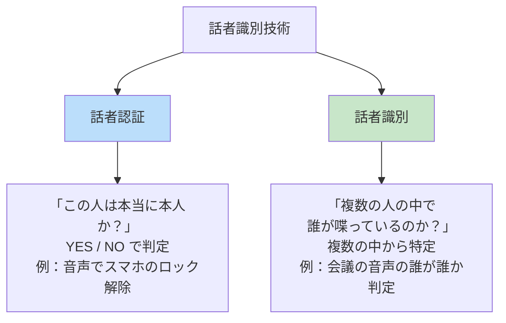

### 分類軸2：テキスト依存性

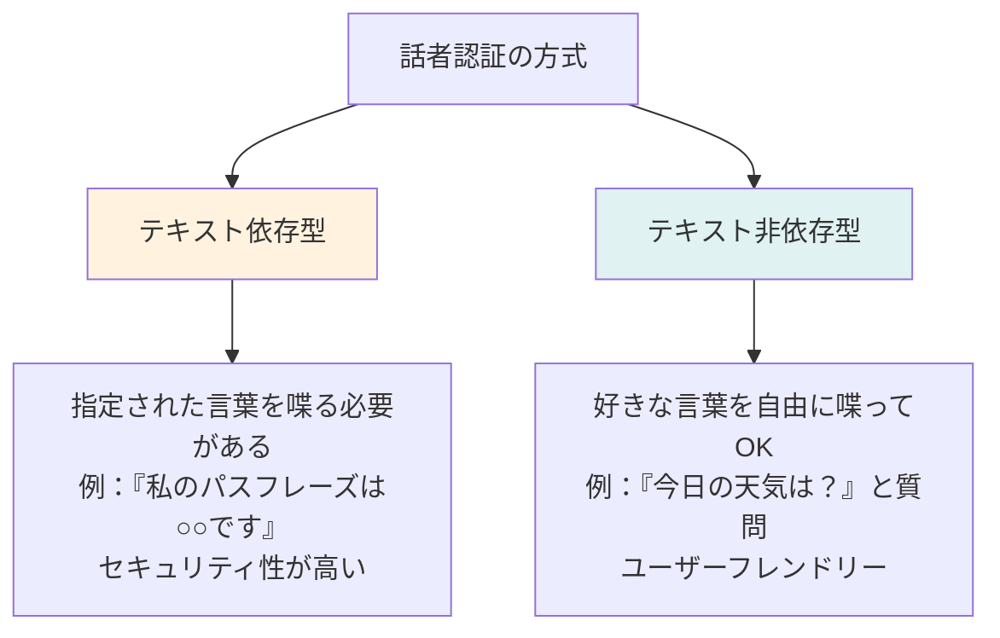

### 分類軸3：技術的アプローチ

| 技術方式 | 原理 | 特徴 |
|---------|------|------|
| **MFCC** | 周波数分析 | シンプル、計算量少ない、精度は中程度 |
| **i-Vector** | 統計的モデリング | バランス型、実装が比較的容易 |
| **深層学習** | ニューラルネットワーク | 高精度、計算量が多い、大量データが必要 |

---

## 📗 関連する用語

### 同義語・類似概念
- **Voice Recognition**：音声認識と訳されることもありますが、話者識別を指す場合も多い
- **Speaker Verification**：話者認証。本人確認を目的とした話者識別
- **Speaker Diarization**：「誰が喋っているのか」を時系列で追跡する技術

### 対義語・関連対比
- **音声認識（Speech Recognition）**：「何を言っているか」を理解する。話者識別とセットで使われることが多い

### 多義語
- **Voice**：音声、声、投票権、など多くの意味を持つため、正確には「Speaker Recognition」と呼ぶべき

### 類義語の比較

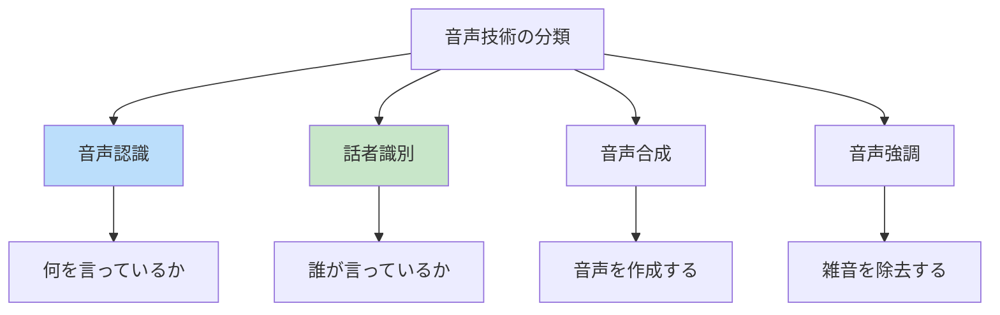

---

## 💡 メリットとデメリット

### ✅ メリット

1. **セキュリティが高い**
   - 指紋や顔と異なり、「忘れる」ことがない
   - 複数人の環境でも本人確認可能

2. **ユーザーフレンドリー**
   - スマートフォンなど、特別な機器が不要
   - 運転中など、手が塞がっている場合も使用可能

3. **遠隔認証に対応**
   - 電話やビデオ通話経由でも本人確認可能
   - テレワーク環境に最適

4. **継続的な改善が可能**
   - 登録データを増やすことで精度向上
   - 機械学習モデルの更新で全体的な性能向上

### ❌ デメリット

1. **環境ノイズに弱い**
   - 風切り音、背景音の影響を受ける
   - 風邪で声が変わると認識されにくい

2. **声質の変化に対応困難**
   - 加齢による声の変化
   - ストレスや疲労での声の変化
   - 時間帯による声の違い

3. **なりすまし攻撃のリスク**
   - 音声の録音再生で本人になりすます可能性
   - 音声模倣の達人（？）に対応困難

4. **プライバシーの懸念**
   - 声紋データ（音声パターン）の盗難・悪用リスク
   - どこで音声データが保存されているか不透明な場合がある

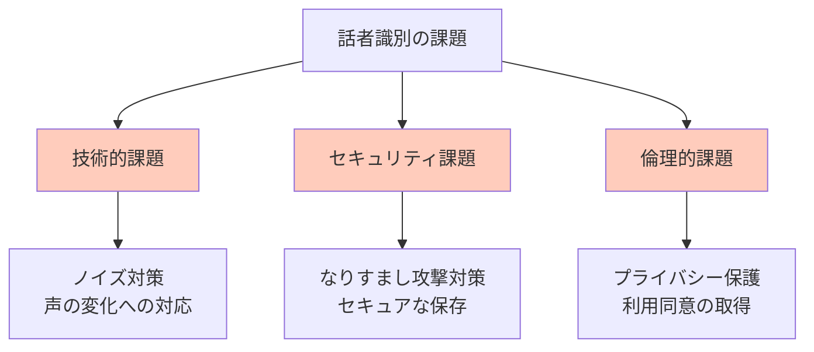

---

## 🚀 応用と実例

### 日常生活での使用例

**1. スマートフォンの音声ロック解除**
- 登録された本人の声でスマートフォンのロック解除
- Siri、Google Assistantなどで実装

**2. スマートスピーカー（Amazon Echo など）**
- 家族複数人が同じスピーカーを使用
- 各人の声を認識して、個人用の設定を自動適用

**3. セキュアな金融取引**
- 銀行のコールセンターで本人確認
- 不正な口座操作を防止

**4. 運転手の疲労検出**
- 自動車の音声で運転手を特定
- 声の不安定さから疲労状態を推測

### 実世界での応用例

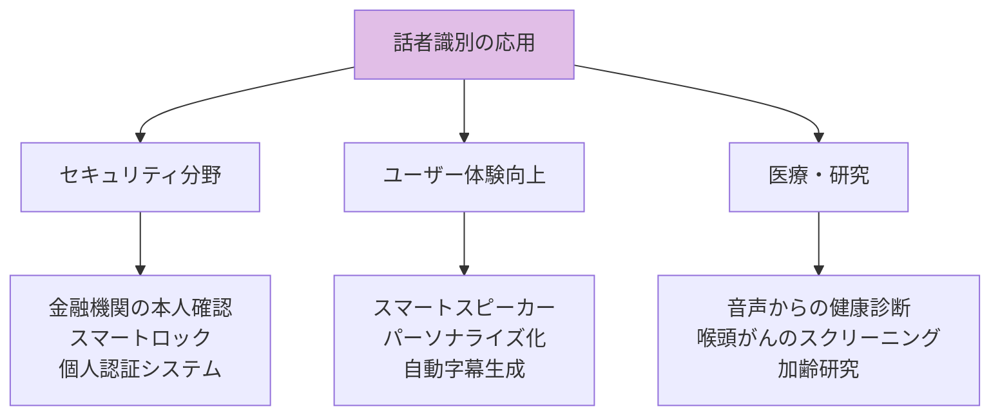

---

## 🔄 置換と変遷

### 何を置き換えたか？

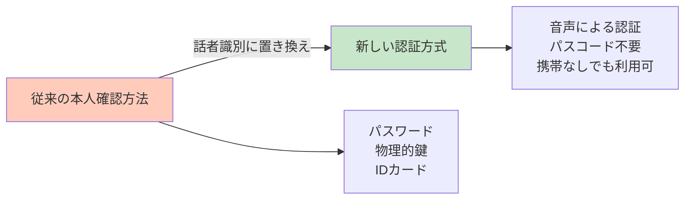

**具体例：**
- **銀行のコールセンター**：従来は「セキュリティコード」を聞かれていた → 音声認証に移行中
- **スマートロック**：従来は「物理的な鍵」→ 音声ロック解除に進化
- **家電の操作**：従来は「リモコン」→ 音声コマンドに移行

### 何に置き換わったか？

- 生体認証技術全般の一つとして、**指紋認証・顔認証と並行**して使用される

### 何を継承したか？

- **音声認識技術**から特徴抽出の手法を継承
- **統計学的分類**の理論を継承

### 何に継承されたか？

- より高度な**マルチモーダル認証**（音声 + 顔 + 指紋）に進化

---

## 🌍 実世界への影響と今後の発展

### 現在の影響

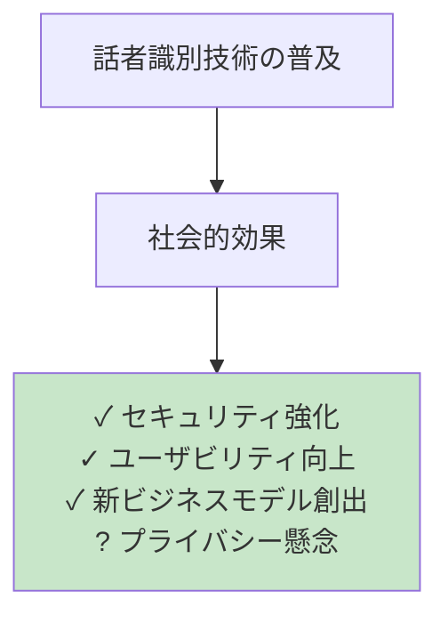

**具体的な影響：**
- **金融機関の効率化**：コールセンターの自動化により人員削減、対応時間短縮
- **スマートホームの成長**：音声認証により、IoTデバイスの利便性が向上
- **セキュリティ業界の変革**：パスワード依存からの脱却

### 今後の展望（2025年～2030年）

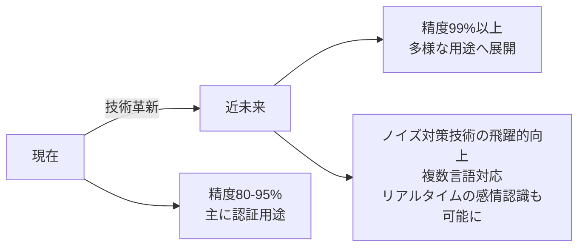

**予想される発展：**

1. **精度の向上**
   - ノイズ除去技術の進化
   - 声の変化への適応能力向上
   - 誤認識率を1%以下に削減

2. **用途の拡大**
   - 医療診断（声からの疾患検出）
   - 人的資源管理（従業員の健康管理）
   - エンターテイメント（ゲーム、VR）

3. **プライバシー保護の強化**
   - オンデバイス処理（スマートフォン内での処理）により、サーバーへのデータ送信を最小化
   - ブロックチェーン技術との組み合わせ
   - 政府規制の整備

4. **マルチモーダル認証の進化**
   - 音声 + 顔認証の統合
   - リアルタイムで複合的に本人確認

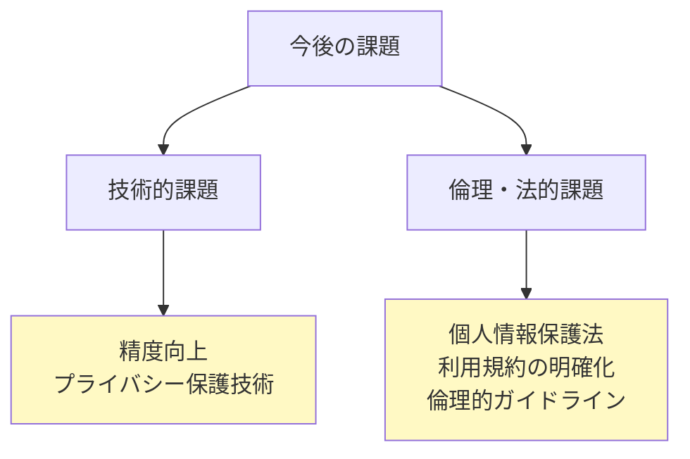

### 最後に

話者識別技術は、「セキュリティ」と「ユーザーフレンドリー」を両立させる、次世代の認証技術です。音声は、私たちが最も自然に発信できる生体情報。今後、この技術がさらに進化し、より安全で快適なデジタル社会の実現に貢献することが期待されています。

---

