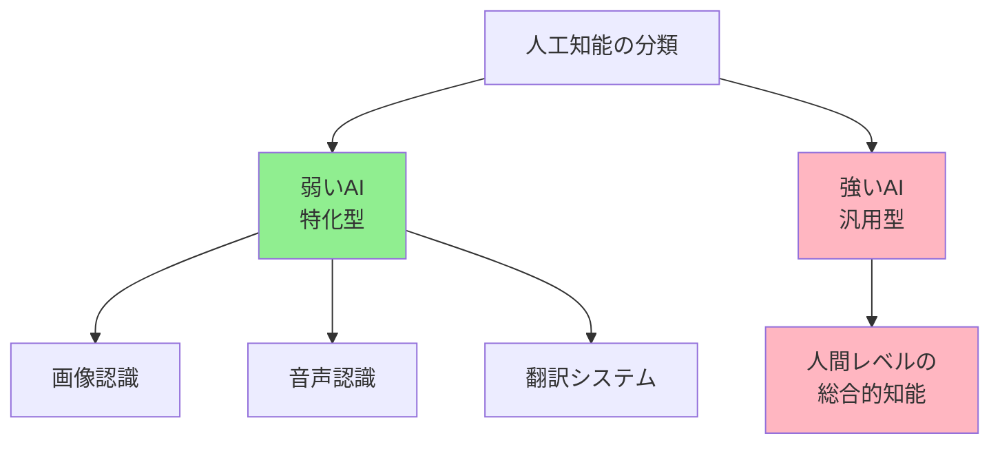
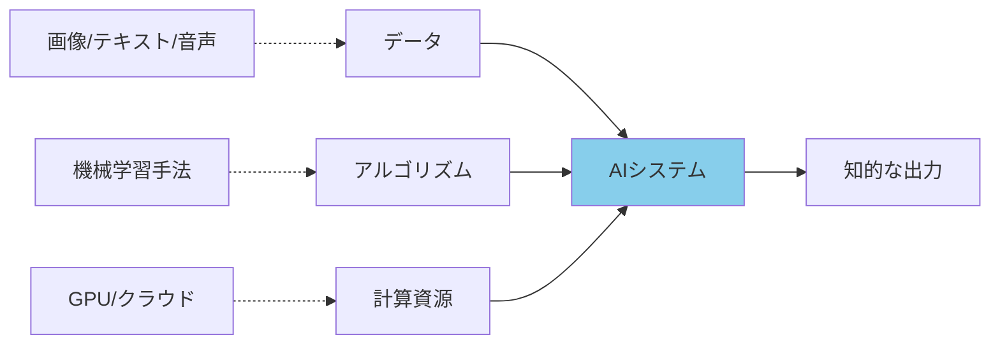
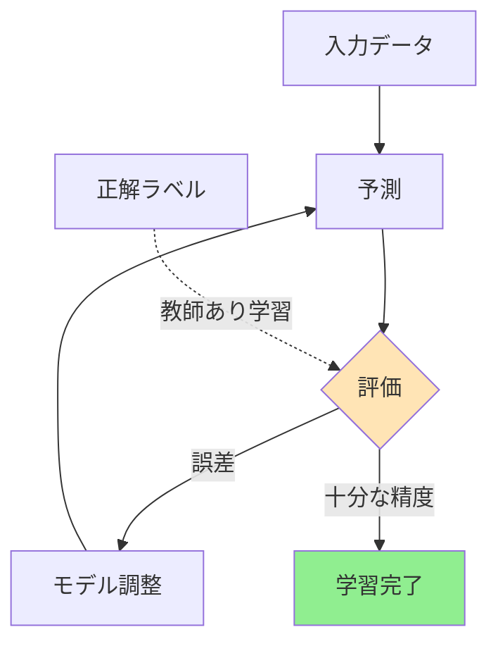
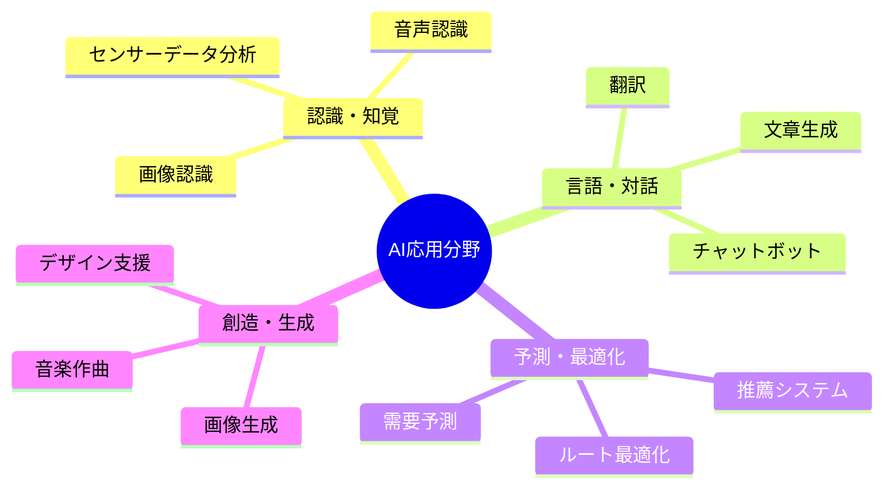

# 人工知能

## 概要

人工知能（AI: Artificial Intelligence）は、人間の知的活動をコンピュータで模倣・実現する技術である。学習、推論、判断といった人間特有の能力を機械に持たせることで、複雑な問題解決や自動化を可能にする。現代では画像認識、自然言語処理、意思決定支援など、多様な分野で実用化されている。

## 1. 基礎概念

### 人工知能の定義

人工知能とは、コンピュータシステムが「知的な振る舞い」を示す技術の総称である。ここで「知的」とは、状況を認識し、情報を処理し、目標達成のための行動を選択する能力を指す。

重要なのは、AIは人間の脳を完全に再現するものではない点だ。むしろ、特定のタスクにおいて人間と同等以上の成果を出すことを目指す。例えば、画像から猫を識別するAIは「猫とは何か」を哲学的に理解しているわけではなく、大量の猫の画像から特徴的なパターンを学習している。

### AIの発展段階

AIの能力は段階的に分類される。**弱いAI（特化型AI）**は特定タスクに限定された能力を持つ。現在実用化されているAIはすべてこの段階にある。一方、**強いAI（汎用AI）**は人間のようにあらゆる知的タスクをこなせる仮想的な存在で、まだ実現していない。

## 2. 構成要素

AIシステムは3つの主要要素から構成される。これらが連携することで、知的な振る舞いが実現される。

### データ

AIの「経験」に相当する要素である。大量のデータからパターンや規則性を抽出することで、AIは学習する。画像認識AIなら数百万枚の画像、翻訳AIなら対訳文のペアが学習データとなる。データの質と量が、AIの性能を大きく左右する。

### アルゴリズム

データを処理する「手順」である。機械学習アルゴリズムは、データから自動的にパターンを見つけ出す。代表的な手法に、脳の神経回路を模した**ニューラルネットワーク**がある。多層化した深層学習（ディープラーニング）は、複雑なパターン認識を可能にした。

### 計算資源

学習と推論を実行する「処理能力」である。GPUやTPUといった専用プロセッサが、膨大な計算を高速に処理する。クラウド環境の発達により、大規模な計算資源へのアクセスが容易になり、AI開発が加速した。

## 3. 学習のメカニズム

AIが「賢くなる」プロセスを理解するには、機械学習の仕組みを知る必要がある。

### 学習の基本サイクル

機械学習は「試行→評価→改善」のサイクルを繰り返す。システムはデータから予測を行い、その精度を評価し、予測を改善するようにモデル（内部パラメータ）を調整する。このサイクルを数千～数百万回反復することで、精度が向上する。

例えば、犬と猫を分類するAIの学習では、まず画像を見て「これは犬」と予測する。正解ラベルと照らし合わせて誤りを測定し、次回はより正確に判断できるようモデルを微調整する。大量の画像で訓練を重ねると、未知の画像でも高精度で判別できるようになる。

### 学習方式の種類

**教師あり学習**は、正解ラベル付きデータで訓練する方式である。「この画像は猫（正解）」という情報を与えることで、システムは正しい判断基準を学ぶ。

**教師なし学習**は、ラベルなしデータから構造やパターンを発見する。顧客データをグループ分けする際などに用いられる。

**強化学習**は、試行錯誤を通じて最適な行動を学ぶ。囲碁AIが何万回も対局を重ねて強くなるのは、この方式による。

### ニューラルネットワークの役割

深層学習の中核をなすニューラルネットワークは、層状に配置された「ニューロン」で構成される。入力層がデータを受け取り、複数の隠れ層で特徴を抽出・変換し、出力層が最終結果を生成する。

各層は前の層から情報を受け取り、重み付けして次の層に渡す。学習とは、この重みを最適化するプロセスである。層が深いほど（多いほど）、より抽象的で複雑な特徴を捉えられる。顔認識AIなら、初期層でエッジを検出し、中間層で目や鼻を認識し、最終層で顔全体を判別する。

## 4. 実用例・応用

AIは既に私たちの日常に深く浸透している。主要な応用分野を見てみよう。

### 画像・映像認識

写真の自動分類、顔認証、医療画像診断、自動運転車の周囲認識などで活用される。スマートフォンのカメラが人物の顔を自動でフォーカスするのも、AIによる顔検出技術である。

### 自然言語処理

機械翻訳、チャットボット、検索エンジン、文章生成で使われる。Webサイトのカスタマーサポートで質問に自動回答するシステムや、メールの自動分類機能がこれに該当する。

### 推薦システム

動画配信サービスの番組推薦、ECサイトの商品提案、SNSのフィード最適化に用いられる。ユーザーの過去の行動パターンから、興味を持ちそうなコンテンツを予測する。

### 意思決定支援

金融取引の異常検知、製造業の品質管理、医療診断の補助として導入されている。人間の専門家を支援し、見落としを減らし、効率を高める役割を果たす。

## 5. 課題と限界

AIは万能ではない。現時点での主要な制約を理解することが重要である。

### データ依存性

AIの性能は学習データの質に強く依存する。偏ったデータで訓練されたシステムは、偏った判断をする。例えば、特定の人種の画像が少ない顔認識データで訓練すると、その人種の認識精度が低下する問題が報告されている。

### 説明可能性の欠如

深層学習モデルは「ブラックボックス」と呼ばれる。なぜその判断をしたのか、内部プロセスを人間が理解しにくい。医療や金融など、判断根拠の説明が求められる分野では、この特性が導入の障壁となる。

### 汎用性の限界

現在のAIは訓練されたタスクしかこなせない。画像認識が得意なAIに突然文章を書かせることはできない。人間のように異なる領域の知識を統合し、未知の状況に柔軟に対応する能力は、まだ実現していない。

### 倫理的課題

AIの判断がプライバシー侵害や差別につながる懸念がある。また、雇用への影響、軍事利用の是非、創作物の著作権など、社会的・法的な問題も議論されている。技術開発と並行して、適切なガイドラインの整備が求められる。

## まとめ

人工知能は、データ駆動型の学習によって特定タスクで人間レベルの性能を達成する技術である。機械学習、特に深層学習の発展により、認識・予測・生成など多様な領域で実用化が進んでいる。

重要なポイントは以下の通りだ。
- AIは大量のデータから自動的にパターンを学習する
- 現在のAIは特定タスクに特化した「弱いAI」である
- 実用化には高品質なデータと計算資源が不可欠
- データの偏りや説明可能性など、解決すべき課題が残る

### 次のステップ

AIへの理解を深めるには、以下のトピックに進むことを推奨する。
- **機械学習の具体的手法**：決定木、サポートベクターマシン、強化学習の詳細
- **深層学習アーキテクチャ**：CNN、RNN、Transformerなどの構造
- **AI倫理とガバナンス**：公平性、透明性、説明責任の確保
- **実践**：PythonとTensorFlow/PyTorchを用いた簡単なモデル構築

AIは急速に進化する分野である。基礎概念を理解した上で、最新動向を追い続けることが、この技術と適切に向き合うための鍵となる。
