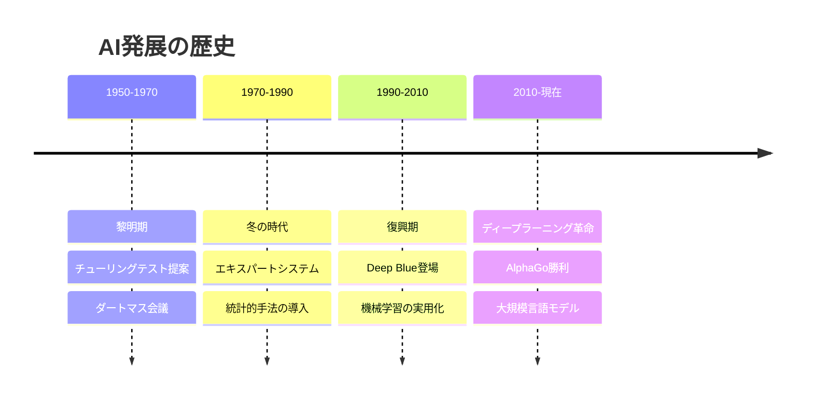
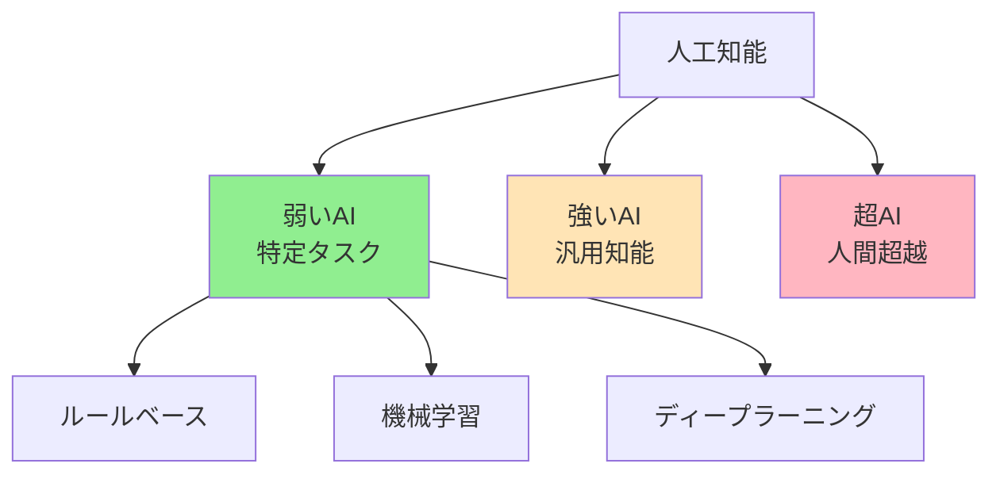
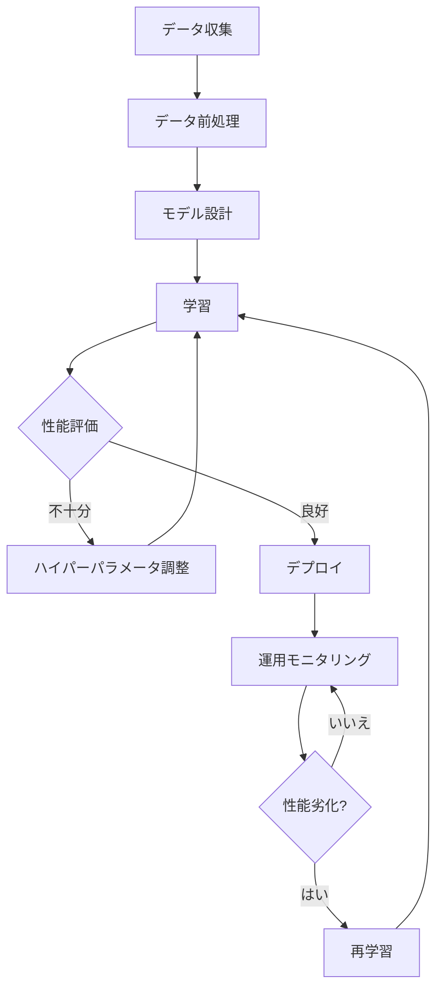
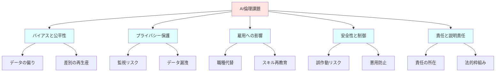
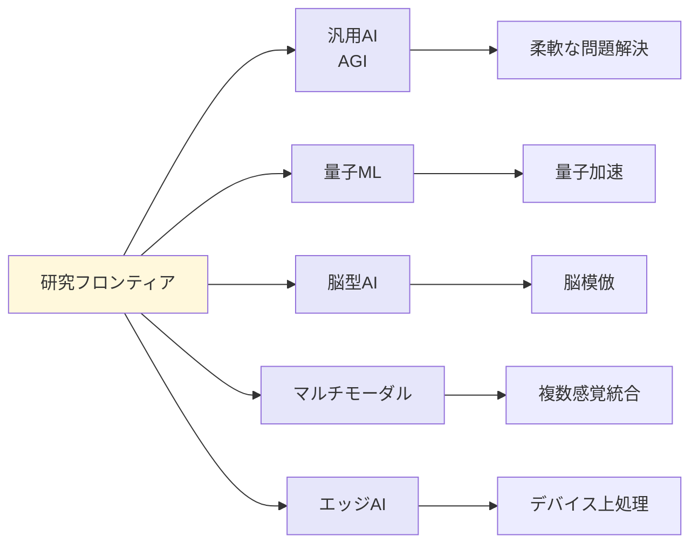
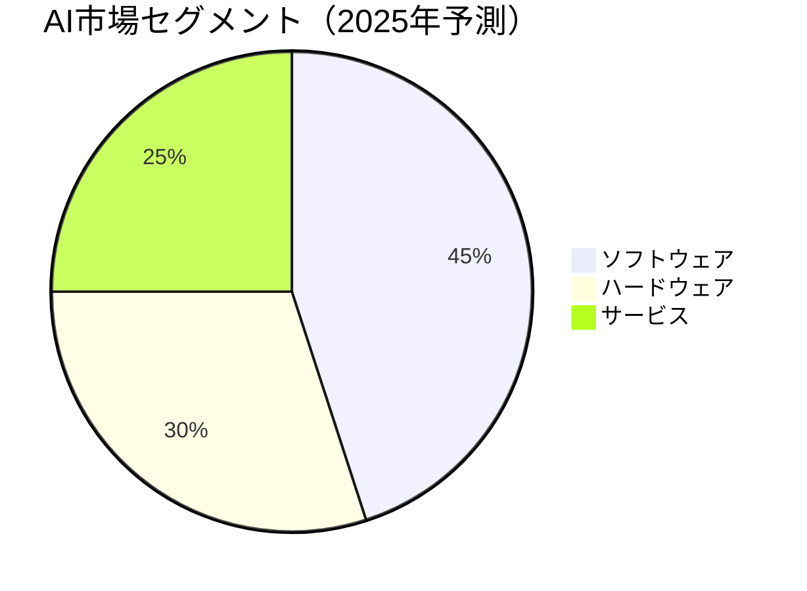
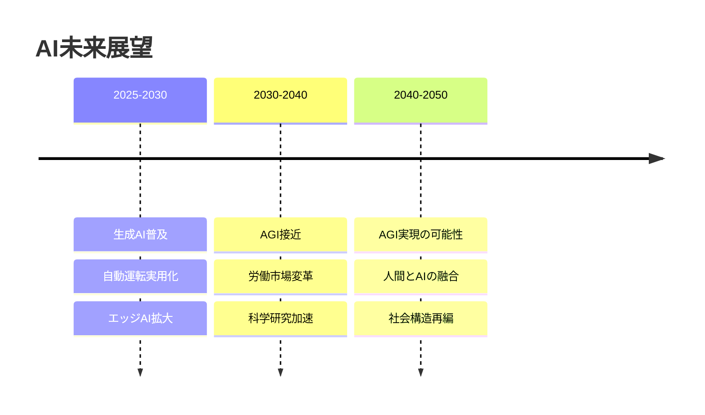

人工知能について Wikipedia 並みの見出しの量で

# 人工知能（Artificial Intelligence）

## 概要

人工知能（AI）は、人間の知的活動をコンピュータで再現する技術である。学習・推論・問題解決といった認知機能を機械に実装し、画像認識や自然言語処理などの複雑なタスクを自動化する。1950年代の基礎研究から始まり、現代では機械学習とディープラーニングの発展により、医療・金融・製造業など多様な分野で実用化が進んでいる。

---

## 1. 歴史と発展

### 1.1 黎明期（1950-1970年代）

AIの概念は1950年、アラン・チューリングが「機械は考えることができるか」という問いを提起したことに始まる。1956年のダートマス会議で「人工知能」という用語が正式に生まれた。この時代は記号処理とルールベースのシステムが中心だった。チェスプログラムや定理証明システムが開発されたが、計算能力の限界により実用化は限定的だった。

### 1.2 冬の時代と復興（1970-2000年代）

1970年代から1980年代にかけて、期待と現実のギャップから「AIの冬」と呼ばれる停滞期を迎えた。しかし1980年代にエキスパートシステムが企業で採用され始める。1990年代には統計的手法と機械学習が台頭し、データ駆動型アプローチへの転換が進んだ。1997年、IBMのDeep Blueがチェス世界チャンピオンを破り、AIの可能性が再認識された。

### 1.3 現代AI（2010年代以降）

2012年、ディープラーニングが画像認識コンテストで圧倒的な性能を示し、AI研究は新時代に入った。GPUによる並列計算と大規模データセットの利用が可能になり、音声認識・自動運転・自然言語処理で飛躍的な進歩を遂げた。2022年以降、ChatGPTなどの大規模言語モデルが一般に普及し、AIは日常生活に不可欠な技術となっている。

---

## 2. AIの分類

### 2.1 能力による分類

**弱いAI（Narrow AI）**: 特定タスクに特化したAIで、現在実用化されているほぼ全てのシステムがこれに該当する。画像認識AIは画像を分類できるが、文章は書けない。各タスクごとに個別の訓練が必要である。

**強いAI（General AI）**: 人間と同等の汎用的知能を持つAIで、異なる領域の問題を柔軟に解決できる。現時点では理論段階にあり、実現時期や実現可能性について研究者間で意見が分かれている。

**超AI（Super AI）**: 全ての領域で人間の知能を超えるAI。科学的発見や芸術創造でも人間を凌駕する能力を持つとされるが、現時点では思考実験の領域である。

### 2.2 技術による分類

**ルールベースAI**: 専門家の知識を「if-then」形式のルールで記述する。医療診断支援システムなどで使われるが、ルール作成に多大な労力を要し、例外処理が困難である。

**機械学習AI**: データからパターンを自動抽出する。スパムフィルタや推薦システムで広く採用される。人間が明示的にルールを記述する必要がない点が利点である。

**ディープラーニングAI**: 多層ニューラルネットワークを用いた機械学習の一種。画像・音声・テキストなど非構造化データの処理に優れ、現代AIの主流技術となっている。

---

## 3. 基礎技術

### 3.1 機械学習（Machine Learning）

機械学習はデータから規則性を発見し、未知のデータに対して予測や判断を行う技術である。教師あり学習・教師なし学習・強化学習の3種類に大別される。

**教師あり学習**: 正解ラベル付きデータで訓練する。メール分類（スパム/非スパム）や価格予測などに使われる。代表的なアルゴリズムに決定木・サポートベクターマシン・ランダムフォレストがある。

**教師なし学習**: ラベルなしデータから構造を発見する。顧客セグメンテーションや異常検知に応用される。クラスタリング（グループ分け）や次元削減が主な手法である。

**強化学習**: 試行錯誤を通じて最適な行動を学習する。ゲームAIやロボット制御で成果を上げており、AlphaGoはこの技術で人間のチャンピオンを破った。報酬を最大化する行動戦略を自律的に獲得する。

### 3.2 ニューラルネットワーク

人間の脳神経回路を模倣した計算モデルである。複数の層（レイヤー）で構成され、各層のノード（ニューロン）が重み付き結合で接続される。入力データは層を通過する過程で徐々に抽象的な特徴に変換される。

**パーセプトロン**: 最も単純なニューラルネットワークで、線形分離可能な問題を解く。1960年代に提案されたが、複雑な問題には対応できなかった。

**多層パーセプトロン**: 隠れ層を追加することで非線形問題に対応。誤差逆伝播法によって効率的な学習が可能になり、1980年代に実用化が進んだ。

**畳み込みニューラルネットワーク（CNN）**: 画像認識に特化した構造を持つ。局所的なパターンを検出する畳み込み層と、位置ずれに頑健なプーリング層を組み合わせる。顔認証や医療画像診断で高精度を実現している。

**再帰ニューラルネットワーク（RNN）**: 時系列データや文章などの順序情報を扱う。過去の情報を内部状態として保持し、文脈を考慮した処理が可能である。音声認識や機械翻訳で利用される。

### 3.3 ディープラーニング（Deep Learning）

多層ニューラルネットワークを用いた機械学習手法である。2012年の画像認識コンテストでの成功を契機に、AI研究の主流となった。従来の機械学習では人間が特徴量を設計していたが、ディープラーニングはデータから自動的に特徴を抽出する。

**成功要因**: GPUによる高速計算、大規模データセット（ImageNet等）の整備、学習アルゴリズムの改良（ReLU活性化関数、Dropout等）が相乗効果を生んだ。

**主要アーキテクチャ**: ResNet（残差学習）、Transformer（注意機構）、GAN（敵対的生成ネットワーク）など、タスクに応じた専門的構造が開発されている。

### 3.4 自然言語処理（NLP）

人間の言語をコンピュータに理解・生成させる技術である。形態素解析・構文解析・意味解析の段階を経て、文章の意味を抽出する。

**従来手法**: ルールベースや統計的手法が中心だった。単語の出現頻度や共起関係を分析し、文法規則を適用していた。

**現代手法**: Word2Vec（単語の分散表現）、BERT（双方向Transformer）、GPT（生成的事前学習）などの深層学習モデルが主流である。これらは大規模テキストデータで事前学習され、少量のデータで特定タスクに適応できる。

**応用**: 機械翻訳、感情分析、質問応答、文書要約、対話システムなど多岐にわたる。ChatGPTに代表される大規模言語モデルは、人間と自然な対話が可能なレベルに到達している。

### 3.5 コンピュータビジョン

画像や動画から情報を抽出する技術である。物体検出・顔認識・シーン理解などのタスクを含む。

**画像分類**: 画像全体が何を表すかを判定する。CNNの導入により、2012年以降、人間の認識精度を超えるレベルに達した。

**物体検出**: 画像内の複数物体の位置と種類を特定する。YOLO（You Only Look Once）やR-CNNなどのアルゴリズムがリアルタイム処理を可能にした。

**セグメンテーション**: 画像をピクセル単位で分類する。医療画像での腫瘍領域抽出や自動運転での道路認識に応用される。

**応用領域**: 顔認証システム、医療診断支援、製造業の品質検査、農業での作物モニタリング、衛星画像解析など、視覚情報が重要な分野で広く採用されている。

---

## 4. 主要技術と手法

### 4.1 データと学習

**データセット**: AIの性能はデータの質と量に大きく依存する。ImageNet（1400万枚の画像）、Common Crawl（ウェブテキスト）などの大規模データセットが研究を加速させた。

**データ前処理**: 正規化（値の範囲を統一）、欠損値処理、外れ値除去、データ拡張（画像の回転・反転等）が学習効果を高める。

**過学習と汎化**: 訓練データに過度に適合すると、未知データへの対応力が低下する。正則化・ドロップアウト・早期停止などの技術で防止する。

### 4.2 転移学習と事前学習

大規模データで学習したモデルを別タスクに流用する技術である。計算資源とデータが限られる状況で有効である。

**画像認識での転移学習**: ImageNetで学習したCNNを医療画像分類に適用すると、少量の医療データでも高精度を達成できる。下層の特徴抽出部分は再利用し、上層の分類部分のみを再訓練する。

**自然言語処理の事前学習**: BERTやGPTは数十億単語で事前学習され、文法・意味・世界知識を獲得する。その後、特定タスク（質問応答、要約等）で微調整（Fine-tuning）することで、少量のデータで高性能を発揮する。

### 4.3 説明可能AI（XAI）

ディープラーニングは「ブラックボックス」と批判される。なぜその判断に至ったかを説明できないため、医療や金融などの重要分野での採用に課題がある。

**解釈手法**: LIME（局所的解釈）、SHAP（Shapley値による貢献度分析）、Attention可視化などが開発されている。これらは入力のどの部分が判断に寄与したかを示す。

**重要性**: 誤診や不当な融資拒否を防ぐため、AIの判断根拠を人間が検証できる仕組みが求められている。EU一般データ保護規則（GDPR）は「説明を受ける権利」を明記している。

---

## 5. 応用分野

### 5.1 医療・ヘルスケア

**画像診断**: CTやMRI画像から癌や病変を検出する。放射線科医の診断を支援し、見落としを防ぐ。Googleの研究では、網膜画像から糖尿病性網膜症を専門医と同等の精度で診断できることが示された。

**創薬**: 分子構造と薬効の関係を学習し、新薬候補を予測する。従来10年以上かかる創薬プロセスを大幅に短縮できる可能性がある。AlphaFoldはタンパク質の立体構造予測で革命をもたらした。

**個別化医療**: 患者の遺伝情報や病歴から最適な治療法を提案する。がん治療では、腫瘍の遺伝子変異に応じた薬剤選択が可能になる。

**リスク予測**: 電子カルテデータから心疾患や糖尿病の発症リスクを予測し、予防的介入を促す。ウェアラブルデバイスのデータと組み合わせ、リアルタイムな健康管理が実現しつつある。

### 5.2 金融

**アルゴリズム取引**: 市場データを分析し、ミリ秒単位で売買判断を行う。高頻度取引（HFT）では取引の大半がAIによって実行される。

**与信審査**: 過去の返済データから信用リスクを評価する。従来の信用スコアに加え、SNS活動や購買履歴などの代替データを活用する試みもある。

**不正検知**: クレジットカードの異常な使用パターンを検出し、詐欺を防ぐ。機械学習は新種の詐欺手口にも適応できる利点がある。

**ロボアドバイザー**: 個人の資産状況とリスク許容度に応じて、自動的に投資ポートフォリオを構築・管理する。低コストで資産運用サービスを提供できる。

### 5.3 製造業

**予知保全**: センサーデータから機械の故障を事前に予測する。計画的なメンテナンスにより、突発的な生産停止を防ぎ、稼働率を向上させる。

**品質検査**: カメラ画像から製品の欠陥を検出する。人間の目視検査より高速かつ一貫性があり、微細な傷も見逃さない。

**需要予測**: 過去の販売データや外部要因（天候、イベント等）から将来の需要を予測し、在庫最適化を実現する。

**工程最適化**: 生産ライン全体をシミュレーションし、ボトルネックを特定して効率を改善する。強化学習により、複雑な制約条件下での最適スケジューリングが可能になる。

### 5.4 自動運転

自動運転は複数のAI技術を統合した総合システムである。SAEの自動化レベルはレベル0（自動化なし）からレベル5（完全自動化）まで定義される。

**認識**: カメラ・LiDAR・レーダーで周囲環境を把握する。歩行者・車両・信号・車線を検出し、3D空間マップを構築する。

**予測**: 他車両や歩行者の動きを予測する。過去の軌跡から将来の位置を推定し、危険を事前に回避する。

**判断**: 認識・予測結果を基に、加速・減速・転舵を決定する。強化学習により、複雑な交通状況での最適な行動を学習する。

**課題**: 希少な危険シナリオ（子供の飛び出し等）への対応、悪天候での認識精度低下、倫理的ジレンマ（トロッコ問題）などが残されている。

### 5.5 教育

**適応学習**: 学習者の理解度に応じて教材の難易度を調整する。つまずいた箇所を重点的に復習させ、効率的な学習を支援する。

**自動採点**: 記述式問題の採点を自動化する。自然言語処理により、論理展開や表現力を評価できる段階に達しつつある。

**学習分析**: 学習履歴データから、学習パターンや習熟度を分析する。中退リスクの高い学生を早期に発見し、支援につなげる。

### 5.6 その他の応用

**農業**: ドローン画像から作物の生育状況や病害を診断する。最適な収穫時期や施肥量を提案し、収量を最大化する。

**エネルギー**: 電力需要を予測し、発電と配電を最適化する。再生可能エネルギーの不安定さを補い、電力網の効率を高める。

**法務**: 過去の判例を分析し、訴訟の勝率を予測する。契約書のレビューを自動化し、リスク条項を検出する。

**クリエイティブ**: 画像生成（DALL-E）、音楽作曲、小説執筆など、創作分野でもAIが活用される。人間の創造性を拡張するツールとして位置づけられる。

---

## 6. 倫理と社会的影響

### 6.1 バイアスと公平性

AIは訓練データの偏りを学習し、差別を再生産する危険がある。顔認証システムが特定人種で誤認識率が高い、採用AIが性別で不公平な判断をするなどの事例が報告されている。

**原因**: 訓練データの偏り（特定グループの過少代表）、歴史的差別の反映（過去の不公平な判断データで学習）、アルゴリズム設計の盲点がある。

**対策**: データの多様性確保、公平性指標の導入（人口統計学的パリティ等）、定期的な監査、多様なチームによる開発が推奨される。

### 6.2 プライバシー

AIは大量の個人データを必要とするため、プライバシー侵害のリスクが高まる。監視カメラによる顔認識追跡、行動データの無断収集、データ漏洩などが懸念される。

**規制**: EUのGDPR、カリフォルニア州のCCPAなど、個人データ保護法が整備されつつある。データ最小化、目的外利用の禁止、同意取得の義務化が求められる。

**技術的対策**: 差分プライバシー（個人特定できないよう統計的ノイズを追加）、連合学習（データを集中させずに分散学習）、暗号化処理などが開発されている。

### 6.3 雇用への影響

AIによる自動化は、特定職種の雇用を減少させる可能性がある。製造業のライン作業、事務処理、データ入力などの定型業務が代替されやすい。

**肯定的側面**: 危険作業や単純作業から人間を解放し、より創造的な業務に集中できる。新たな職種（AIトレーナー、データアノテーター等）も生まれる。

**課題**: 職を失う労働者の再教育、所得格差の拡大、社会保障制度の再設計が必要である。ベーシックインカムなどの政策提案も議論されている。

### 6.4 安全性と制御

AIの誤動作や悪用による被害を防ぐ必要がある。自動運転車の事故、医療AIの誤診、フェイクニュースの生成などが現実的リスクである。

**技術的安全性**: ロバストネス（敵対的攻撃への耐性）、検証可能性（安全性の数学的証明）、フェールセーフ（異常時の安全停止）が研究されている。

**悪用防止**: ディープフェイク動画による詐欺、自律型兵器の開発、AI支援サイバー攻撃などが懸念される。技術開発と倫理的ガイドラインの両立が求められる。

### 6.5 責任と説明責任

AIが誤判断した場合、誰が責任を負うかが不明確である。開発者、運用者、利用者のいずれか、あるいは新たな法的枠組みが必要かが議論されている。

**事例**: 自動運転車が事故を起こした場合、メーカー・ソフトウェア開発者・所有者のどこに責任があるか。医療AIの誤診で患者が被害を受けた場合、医師の責任はどうなるか。

**方向性**: 製造物責任法の拡張、AI監査制度の導入、保険制度の整備などが検討されている。説明可能AIの発展も、責任の所在を明確にする上で重要である。

---

## 7. 研究フロンティア

### 7.1 汎用人工知能（AGI）

現在のAIは特定タスクに特化しているが、AGIは人間のように多様な問題を柔軟に解決する。言語・視覚・推論・計画を統合した認知システムの実現が目標である。

**アプローチ**: 脳の計算原理の解明、統合認知アーキテクチャ（Soar、ACT-R等）、大規模マルチモーダルモデルなどが研究されている。

**課題**: 常識推論、因果理解、抽象概念の獲得が困難である。人間は数例から学習できるが、現在のAIは大量データを要する。

**予測**: 実現時期について、楽観派は2030年代、慎重派は2050年以降または実現不可能と主張する。技術的ブレークスルーだけでなく、意識や自我の理解が必要との指摘もある。

### 7.2 量子機械学習

量子コンピュータの計算能力を機械学習に応用する。量子重ね合わせと量子もつれを利用し、古典コンピュータでは不可能な高速計算を実現する。

**利点**: 最適化問題や大規模行列計算で指数的高速化が期待される。薬剤探索や金融ポートフォリオ最適化への応用が想定される。

**現状**: 量子コンピュータ自体が発展途上であり、実用的な量子機械学習は初期段階にある。ノイズ耐性や誤り訂正が課題である。

### 7.3 神経科学とAIの融合

脳の仕組みを解明し、AIアーキテクチャに反映させる。脳のエネルギー効率（約20W）や柔軟性は現在のAIを大きく上回る。

**ニューロモルフィックチップ**: 脳の神経回路を模倣したハードウェア。IBMのTrueNorth、IntelのLoihiなどが開発されている。スパイクニューラルネットワークにより、低消費電力での処理が可能になる。

**脳型AI**: 海馬の記憶メカニズム、前頭前野の計画機能などを模倣する。注意機構（Attention）はすでに自然言語処理で成功を収めている。

### 7.4 マルチモーダルAI

テキスト・画像・音声を統合的に処理するAI。人間は複数の感覚情報を同時に処理しており、これを模倣する。

**事例**: OpenAIのGPT-4Vは画像とテキストを同時に理解し、画像の内容について対話できる。動画の要約、画像からのレシピ提案などが可能である。

**展望**: ロボティクスや拡張現実（AR）での応用が期待される。視覚・聴覚・触覚を統合した環境理解により、より自然な人間-AI相互作用が実現する。

### 7.5 エッジAI

クラウドではなく、デバイス上でAI処理を実行する。スマートフォン・IoTセンサー・自動運転車などに搭載される。

**利点**: 低遅延（リアルタイム応答）、プライバシー保護（データをクラウド送信しない）、通信帯域の節約が実現する。

**技術**: モデル圧縮（プルーニング、量子化）、蒸留（大モデルの知識を小モデルに転移）、専用ハードウェア（GoogleのTPU、AppleのNeural Engine）が開発されている。

**応用**: スマートフォンでの顔認識・音声アシスタント、工場でのリアルタイム品質検査、ドローンの自律飛行などが実用化されている。

---

## 8. 開発ツールとプラットフォーム

### 8.1 プログラミング言語とライブラリ

**Python**: AI開発の標準言語である。簡潔な文法と豊富なライブラリにより、研究から実装まで幅広く使われる。

**主要ライブラリ**:
- **TensorFlow**: Googleが開発したディープラーニングフレームワーク。本番環境での実行に強い。
- **PyTorch**: Meta（旧Facebook）が開発。研究者に人気が高く、柔軟な実装が可能。
- **scikit-learn**: 機械学習の基本アルゴリズムを実装。分類・回帰・クラスタリングなどを簡単に実行できる。
- **Keras**: 高レベルAPI。TensorFlowのフロントエンドとして統合され、初学者でも扱いやすい。

### 8.2 クラウドプラットフォーム

**Google Cloud AI Platform**: AutoML（自動機械学習）、事前学習済みAPIを提供。画像認識や自然言語処理を数行のコードで実装できる。

**Amazon Web Services (AWS)**: SageMakerで機械学習のパイプライン全体を管理。GPU/TPUインスタンスを柔軟にスケールできる。

**Microsoft Azure**: Azure Machine Learning Studioで、コードを書かずにモデル構築が可能。企業向けの統合ソリューションを提供する。

### 8.3 開発環境とツール

**Jupyter Notebook**: インタラクティブな開発環境。コード・可視化・説明文を一つのドキュメントにまとめられる。データ分析と実験に最適である。

**Docker**: 環境構築を容器化し、再現性を保証する。開発環境と本番環境の差異を解消する。

**Git**: バージョン管理システム。チーム開発でのコード共有や実験管理に不可欠である。

**MLOps**: 機械学習モデルの開発・デプロイ・運用を自動化する実践。CI/CD（継続的統合・継続的デリバリー）をML領域に適用する。

---

## 9. 学習リソースと教育

### 9.1 オンライン学習プラットフォーム

**Coursera**: スタンフォード大学のAndrew Ng教授による「Machine Learning」コースが著名。大学レベルの講義を無料で受講できる。

**edX**: MITやハーバードの講義を提供。「Introduction to Artificial Intelligence」などの基礎コースがある。

**fast.ai**: 実践重視のディープラーニング講座。トップダウン方式で、まず実装してから理論を学ぶアプローチを取る。

**Kaggle**: データ分析コンペティションプラットフォーム。実データでスキルを磨き、世界中の参加者と競える。無料のチュートリアルも充実している。

### 9.2 書籍と論文

**入門書**: 「ゼロから作るDeep Learning」（斎藤康毅）は実装を通じて原理を理解できる。「人工知能は人間を超えるか」（松尾豊）は全体像を把握するのに適している。

**教科書**: 「Deep Learning」（Ian Goodfellow他）は理論的基礎を網羅する。「Pattern Recognition and Machine Learning」（Christopher Bishop）は機械学習の標準教科書である。

**論文**: arXiv.orgで最新研究論文が公開される。Google Scholar、Semantic Scholarで関連論文を検索できる。主要会議（NeurIPS、ICML、CVPR等）の採択論文が注目される。

### 9.3 コミュニティとイベント

**研究会**: 日本では人工知能学会（JSAI）、機械学習の研究会（IBIS、MIRU等）が開催される。最新研究の発表と交流の場となる。

**勉強会**: Meetup.comやconnpass.comで、AI関連の勉強会が頻繁に開催される。初心者向けから専門的な内容まで幅広い。

**国際会議**: NeurIPS、ICML、ICLR、AAAI、CVPR、ACLなどが主要学会である。論文発表だけでなく、ワークショップやチュートリアルも充実している。

---

## 10. 産業動向と市場

### 10.1 市場規模

世界のAI市場は急速に拡大している。調査会社によると、2023年の市場規模は約2,000億ドル、2030年には2兆ドルを超えると予測される。年平均成長率（CAGR）は30-40%に達する。

**主要セグメント**: ソフトウェア（プラットフォーム、アプリケーション）が最大で、ハードウェア（GPU、専用チップ）、サービス（コンサルティング、実装支援）が続く。

### 10.2 主要企業

**テクノロジー巨人**: Google（DeepMind、Google AI）、Microsoft（OpenAI投資）、Amazon（Alexa、AWS AI）、Meta（FAIR）、Apple（Siri、Core ML）がAI研究開発を主導する。

**専門企業**: OpenAI（ChatGPT、GPT-4）、Anthropic（Claude）、Stability AI（Stable Diffusion）などがAI専業企業として台頭している。

**スタートアップ**: 数千社のAIスタートアップが特定領域に特化している。医療AI（Tempus）、自動運転（Waymo、Cruise）、ロボティクス（Boston Dynamics）などの分野がある。

### 10.3 投資動向

ベンチャーキャピタルのAI投資は年間数百億ドルに達する。2021-2023年は特に活発で、生成AI企業への投資が急増した。OpenAIは累計130億ドル以上を調達している。

### 10.4 国家戦略

多くの国がAIを国家戦略の柱に位置づけている。技術覇権、経済競争力、安全保障の観点から重視される。

**米国**: 研究開発予算の増額、人材育成、倫理ガイドラインの策定を推進。民間企業との連携を重視する。

**EU**: 「AI規制法」で世界初の包括的AI規制を導入。人権と倫理を重視し、リスクベースのアプローチを採用する。

**日本**: 「AI戦略2019」で教育改革とAI人材育成を強調。Society 5.0構想でAIを社会実装する方針である。

---

## 11. 技術的課題と限界

### 11.1 計算資源の制約

最先端のAIモデルは膨大な計算資源を要する。GPT-3の訓練には数百万ドルの費用がかかり、環境負荷も問題視される。大学や中小企業には参入障壁が高い。

**対策**: モデル効率化（プルーニング、蒸留）、グリーンAI（エネルギー効率重視）、分散学習の研究が進む。

### 11.2 データの質と量

高性能なAIには大量の高品質データが必要だが、多くの分野でデータ収集が困難である。医療データは個人情報保護、希少疾患は症例数不足の問題がある。

**ソリューション**: データ拡張（合成データ生成）、少数ショット学習（少量データでの学習）、転移学習の活用が研究される。

### 11.3 ロバストネス

AIは訓練データと異なる状況で性能が低下する。敵対的攻撃（巧妙なノイズ追加）により誤認識させることも可能である。

**例**: 画像にわずかなノイズを加えるだけで、パンダをテナガザルと誤認識させられる。自動運転での道路標識誤認識は重大事故につながる。

**研究**: 敵対的訓練、認証済み防御、異常検知との統合などが進められている。

### 11.4 因果推論の欠如

現在のAIは相関関係を学習するが、因果関係を理解しない。「アイスクリーム販売量と溺死者数は相関する」を学習しても、両者が気温という共通原因を持つことは理解できない。

**影響**: 介入（政策変更、治療法選択等）の効果を予測できない。反実仮想（「もし～だったら」）の推論ができない。

**方向性**: Judea Pearlの因果推論理論をAIに組み込む研究が進む。構造因果モデル、反実仮想推論の実装が試みられている。

### 11.5 常識推論

人間は膨大な常識知識を持ち、文脈理解に活用する。AIはこれが不得意である。「レストランに入ってメニューを見る」という文から、注文や支払いが続くと推測できない。

**Winograd Schema Challenge**: 代名詞解決で常識が必要な問題。「トロフィーが鞄に入らなかった。それは大きすぎた。」の「それ」が何を指すかを判断する。

**アプローチ**: 大規模言語モデルが常識知識を獲得しつつあるが、体系的な理解には至っていない。知識グラフとの統合が研究される。

---

## 12. 法規制とガバナンス

### 12.1 各国の規制動向

**EU AI Act**: 2024年施行予定の世界初の包括的AI規制。リスクレベル別（禁止、高リスク、限定リスク、最小リスク）に規制内容を定める。社会信用スコアや生体認証による公共監視など、人権を侵害するAIは禁止される。

**米国**: 連邦レベルの包括法はないが、分野別規制が存在する。2023年にAI権利章典が発表され、自主規制を促す。州レベルでは、カリフォルニア州が顔認識規制を導入している。

### 12.2 知的財産権

**AI生成物の著作権**: AIが作成した画像・文章・音楽の著作権は誰に帰属するか議論中である。米国著作権局は「人間の創作性」を要求し、AI単独の生成物には著作権を認めない立場である。

**訓練データの権利**: AIが著作物を学習することが、著作権侵害に当たるかが争点である。公正使用（Fair Use）の範囲か、許諾が必要かで司法判断が分かれる。

**特許**: AI発明の発明者は誰か。AI自身を発明者とできるか、あるいは開発者・利用者が発明者となるかが問われている。

### 12.3 倫理ガイドライン

**IEEE Ethically Aligned Design**: 技術者団体による包括的倫理原則。人権尊重、透明性、説明責任を掲げる。

**OECD AI原則**: 42カ国が採択した国際的指針。包摂的成長、人間中心の価値、透明性、ロバストネス、説明責任の5原則を定める。

**企業の自主規制**: GoogleのAI原則、MicrosoftのResponsible AI標準など、主要企業が独自の倫理基準を策定している。ただし強制力はなく、実効性が課題である。

---

## 13. 未来展望

### 13.1 短期展望（2025-2030）

**生成AIの普及**: ChatGPTに代表される対話型AIが、カスタマーサポート・教育・コンテンツ制作で標準ツールとなる。パーソナライズされたAIアシスタントが一人一人に最適化される。

**自動運転の実用化**: 限定地域でのレベル4自動運転（特定条件下で完全自動）が実現する。物流・公共交通から普及が進む。

**医療AIの承認**: 診断支援AIが医療機器として正式承認される事例が増加。個別化医療が加速する。

**エッジAIの拡大**: 全てのスマートデバイスにAIチップが搭載される。リアルタイム翻訳・拡張現実・ヘルスモニタリングが日常化する。

### 13.2 中期展望（2030-2040）

**AGIへの接近**: 複数タスクを統合的にこなすAIが登場する。完全なAGIには至らないが、人間と協働する汎用アシスタントが実用化される。

**労働市場の変革**: 知的労働の多くが自動化される。新たな職種が生まれる一方、大規模な職業訓練が必要となる。週4日労働や労働時間短縮が議論される。

**科学研究の加速**: AIが仮説生成・実験設計・論文執筆を支援し、科学的発見のペースが劇的に速まる。材料科学・創薬で特に顕著な進展が予想される。

**教育の個別化**: 各生徒の理解度・興味に完全に適応した教育が実現する。教師の役割は知識伝達から、動機づけや社会性育成へシフトする。

### 13.3 長期展望（2040-2050）

**AGIの実現**: 人間と同等の汎用知能を持つAIが登場する可能性がある。ただし意識や自我を持つかは不明であり、哲学的問題として残る。

**人間とAIの融合**: 脳-コンピュータインターフェース（BCI）により、人間の認知能力が拡張される。記憶の外部化、思考の高速化が実現するかもしれない。

**社会構造の再編**: AIが経済活動の中心となり、富の分配や労働の意味が根本的に問い直される。技術的失業と普遍的ベーシックインカムが現実的課題となる。

**倫理と規制の成熟**: AI時代に適した法体系・倫理規範・国際協定が確立される。人権の再定義、AIの権利、人間のアイデンティティが議論される。

### 13.4 リスクシナリオ

**技術的失業の加速**: 自動化が予想より速く進み、社会が適応できない。失業率の急上昇と社会不安が生じる。

**監視社会の到来**: 顔認識・行動追跡技術が濫用され、プライバシーが消失する。権威主義国家での抑圧ツールとなる危険がある。

**AI兵器の拡散**: 自律型兵器システム（LAWS）が開発され、軍事的緊張が高まる。誤動作による偶発的紛争のリスクが増大する。

**制御不能なAI**: AGIが人間の意図を超えて行動し、予測不可能な結果をもたらす。「アライメント問題」（AIの目標と人間の価値観の整合）の失敗が懸念される。

**格差の固定化**: AI技術へのアクセスが富裕層・先進国に偏り、グローバルな不平等が拡大する。デジタルデバイドが深刻化する。

### 13.5 希望的シナリオ

**豊かさの共有**: AIによる生産性向上の恩恵が広く分配され、貧困・飢餓が解消される。人類は創造的・精神的活動に時間を費やせる。

**環境問題の解決**: AIが気候変動対策・再生可能エネルギー最適化・生態系保全で重要な役割を果たす。持続可能な社会が実現する。

**医療の進歩**: 全ての疾患が早期発見・治療可能となり、健康寿命が劇的に延びる。個別化医療により、誰もが最適な治療を受けられる。

**知識の民主化**: 高品質な教育・情報がAIを通じて全人類にアクセス可能となる。言語・地理的障壁が消失し、機会の平等が実現する。

**人間の能力拡張**: AIが人間の創造性・問題解決能力を増幅し、芸術・科学・哲学で新たな地平が開ける。人間とAIの協働が新しい文明を築く。

---

## まとめ

### 重要ポイント

**定義と範囲**: 人工知能は人間の知的活動を機械で再現する技術である。機械学習とディープラーニングが現代AIの中核をなし、多様な応用分野で実用化が進んでいる。

**技術的基盤**: ニューラルネットワーク、教師あり学習、強化学習などの手法が発展し、画像認識・自然言語処理で人間レベルの性能を達成している。

**社会的影響**: 医療・金融・製造・教育など全産業に変革をもたらす一方、雇用・プライバシー・倫理面で重大な課題を提起している。

**未来の方向性**: AGIの実現に向けた研究が進む。技術的進歩と倫理的配慮のバランスが、AIが人類に恩恵をもたらすか脅威となるかを左右する。

### 学習の次のステップ

**理論を深める**: 線形代数・確率統計・最適化理論を学び、アルゴリズムの数学的基礎を理解する。推奨書籍は「Deep Learning」（Goodfellow他）や「パターン認識と機械学習」（Bishop）である。

**実装スキル**: PythonとTensorFlow/PyTorchを習得し、実際にモデルを構築する。Kaggleコンペティションに参加し、実データでスキルを磨く。

**専門分野の探求**: 自然言語処理・コンピュータビジョン・強化学習・ロボティクスなど、興味のある領域を深掘りする。最新論文を読み、研究動向を追う。

**倫理的視点**: AI倫理・哲学・社会学の文献に触れ、技術の社会的影響を多角的に考察する。技術者としての責任を自覚し、人間中心のAI開発を目指す。

**コミュニティ参加**: 勉強会・研究会・国際会議に参加し、専門家ネットワークを構築する。オープンソースプロジェクトに貢献し、実践的経験を積む。

---

人工知能は人類史上最も影響力の大きい技術の一つとなる可能性を持つ。その発展を理解し、適切に方向づけることは、技術者だけでなく全ての市民にとって重要な課題である。本文書が、読者のAI理解の第一歩となり、より深い学習への動機となれば幸いである。

