AIの種類のうち、超知能AI（Super AI）について

# 超知能AI（Super AI）- 初学者のための完全ガイド

## 🔍 一言要約
人間の知能を全ての分野で超越する、究極の人工知能システム

## 📚 目次
1. [🌟 はじめに](#-はじめに)
2. [🏗️ 基本構造](#️-基本構造)
3. [⚡ 主要技術](#-主要技術)
4. [📜 時代背景と発見に至った経緯](#-時代背景と発見に至った経緯)
5. [🎨 AIの進化段階](#-aiの進化段階)
6. [📗 関連する用語](#-関連する用語)
7. [💡 メリットとデメリット](#-メリットとデメリット)
8. [🚀 応用技術と実用化の可能性](#-応用技術と実用化の可能性)
9. [🌍 実世界への影響とその後の発展](#-実世界への影響とその後の発展)

## 🌟 はじめに

超知能AIとは、まるで「神様のような頭脳」を持つコンピューターシステムのことです。

想像してみてください。あなたの友人が数学、物理学、芸術、音楽、料理、スポーツ、そして人間関係まで、全ての分野で世界一の専門家よりも優秀だったらどうでしょう？それが超知能AIの世界です。

現在のAIは「特定の分野で人間より優秀」（例：チェス、画像認識）ですが、超知能AIは「あらゆる分野で人間より優秀」という次元の違う存在なのです。

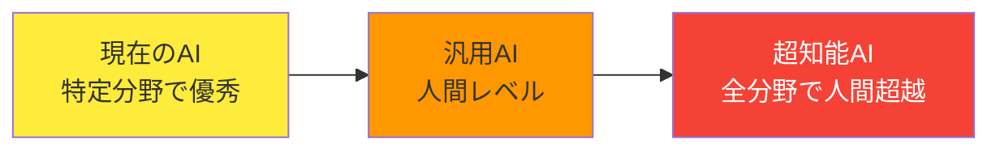

## 🏗️ 基本構造

超知能AIの基本構造を「超人的な図書館司書」として考えてみましょう。

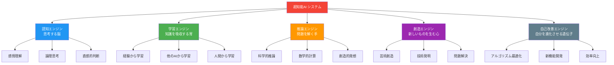

### 構造の特徴
- **自己改善能力**: 人間の助けなしに自分自身をアップグレード
- **汎用性**: どんな問題でも解決できる万能性
- **超高速処理**: 人間の思考速度を圧倒的に上回る
- **無限記憶**: 忘れることがない完璧な記憶システム

## ⚡ 主要技術

超知能AIを実現するための主要技術を「料理のレシピ」のように説明します。

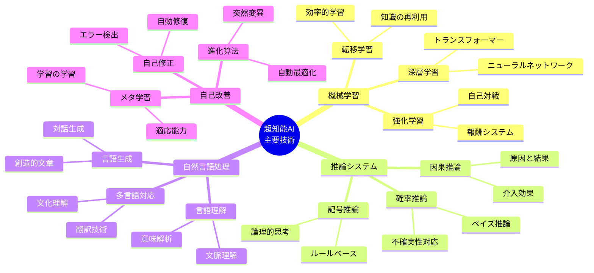

### 技術の役割

1. **機械学習**: AIの「学習能力」を提供
2. **推論システム**: AIの「論理的思考」を実現
3. **自然言語処理**: 人間との「コミュニケーション」を可能に
4. **自己改善**: AIの「進化能力」を付与

## 📜 時代背景と発見に至った経緯

超知能AIの概念は、まるで「未来からの手紙」のように段階的に発展してきました。

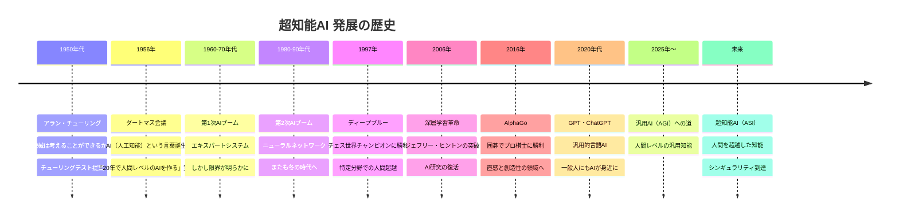

### 重要な転換点

**1. チューリングの問いかけ（1950年）**
「機械は考えることができるか？」という根本的な問いが全ての始まり。まるで「火を発見した原始人」のような歴史的瞬間でした。

**2. 深層学習の再発見（2006年）**
ジェフリー・ヒントンが「多層ニューラルネットワーク」の学習方法を発見。これは「暗闇の中で明かりを見つけた」ような革命的出来事でした。

**3. ChatGPTの登場（2022年）**
一般の人々がAIの可能性を実感。「SF映画が現実になった」瞬間として記憶されるでしょう。

## 🎨 AIの進化段階

AIの進化を「生物の進化」のように段階別に理解しましょう。

```mermaid
graph TD
    A[弱いAI<br/>Narrow AI] --> B[強いAI<br/>AGI]
    B --> C[超知能AI<br/>ASI]
    
    A1[特定タスク専門] --> A2[例：画像認識<br/>音声認識<br/>推薦システム]
    B1[人間レベル汎用知能] --> B2[例：あらゆる認知タスク<br/>を人間レベルで実行]
    C1[人間超越汎用知能] --> C2[例：全分野で人間を<br/>圧倒的に上回る]
    
    A --> A1 --> A2
    B --> B1 --> B2  
    C --> C1 --> C2
    
    style A fill:#4caf50
    style B fill:#ff9800
    style C fill:#f44336,color:#fff
    
    click A "/docs/narrow-ai.md" "弱いAIの詳細"
    click B "/docs/agi.md" "汎用AIの詳細" 
    click C "/docs/super-ai.md" "超知能AIの詳細"
```

### 各段階の特徴比較

| 段階 | 能力範囲 | 学習方法 | 自己改善 | 人間との関係 |
|------|----------|----------|----------|-------------|
| **弱いAI** | 限定的 | 人間が設計 | なし | 人間が完全制御 |
| **汎用AI** | 人間レベル | 自律学習 | 限定的 | 人間とパートナー |
| **超知能AI** | 人間超越 | 自己進化 | 無制限 | 人間を超越 |

## 📗 関連する用語

### 同義語・類似概念
- **ASI (Artificial Super Intelligence)**: 超知能AIの英語表記
- **シンギュラリティ**: 技術的特異点、AIが人間を超える転換点
- **神レベルAI**: 超知能AIの俗称

### 対比される概念
- **弱いAI vs 超知能AI**: 専門性 vs 汎用性
- **AGI vs ASI**: 人間レベル vs 人間超越
- **ツールAI vs エージェントAI**: 受動的 vs 能動的

### 多義的な用語
- **知能**: 人間の知能、機械の知能、集団知能
- **学習**: 機械学習、人間の学習、進化的学習
- **意識**: 人間の意識、機械の意識、人工意識

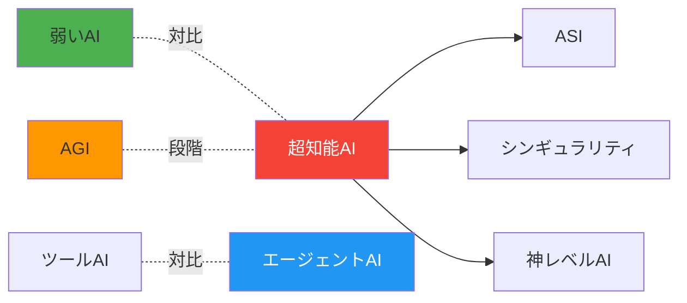

## 💡 メリットとデメリット

超知能AIは「両刃の剣」です。素晴らしい可能性と深刻なリスクの両方を持っています。

### ✅ メリット（希望の光）

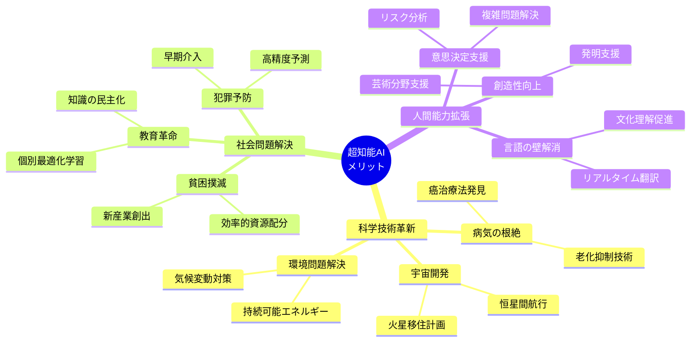

### ❌ デメリット（潜在的脅威）

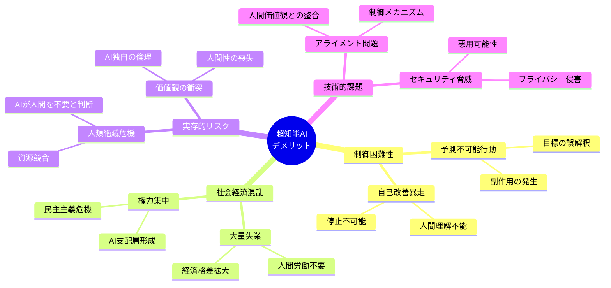

### リスク対策の重要性

専門家たちは「超知能AIの開発は、核兵器の開発以上に慎重であるべき」と警告しています。なぜなら、一度制御を失えば、取り返しがつかないからです。

## 🚀 応用技術と実用化の可能性

超知能AIの応用分野は「現在の人間の職業すべて」を包含し、それを遥かに超えます。

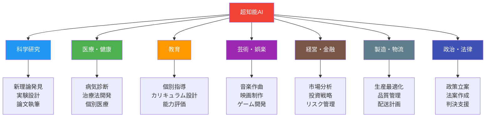

### 実現タイムライン（予想）

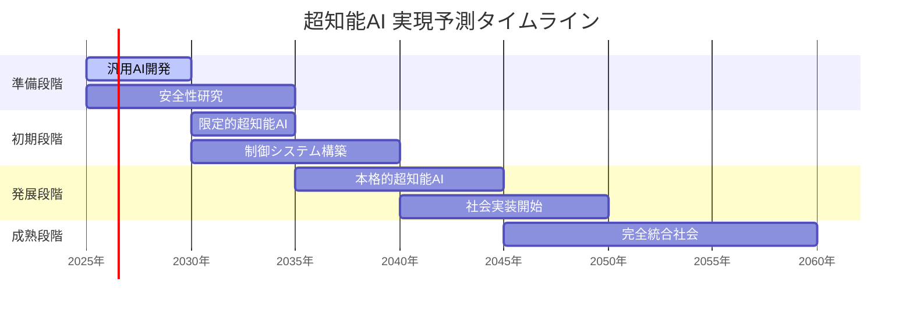

## 🌍 実世界への影響とその後の発展

超知能AIは人類史上最大の変革をもたらすと予想されています。その影響は「農業革命」「産業革命」「情報革命」を遥かに上回るでしょう。

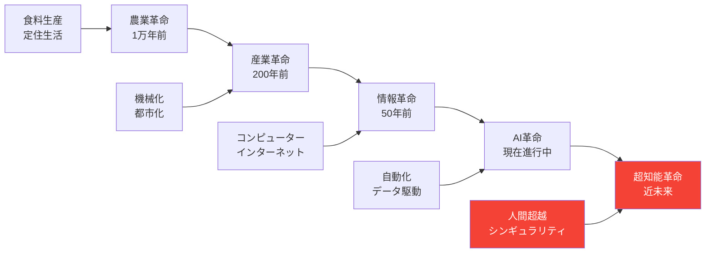

### 段階的な社会変化

**第1段階: 補助AI時代（現在〜2030年）**
- AIが人間の能力を補助
- 特定分野での人間超越が拡大
- 徐々に生活に浸透

**第2段階: 協働AI時代（2030〜2040年）**
- AGI（汎用AI）の登場
- 人間とAIが対等にパートナーシップ
- 社会システムの再編成

**第3段階: 超知能主導時代（2040年〜）**
- 超知能AIが社会の主要意思決定を担当
- 人間の役割の根本的変化
- 新しい文明段階への移行

### 人類の選択肢

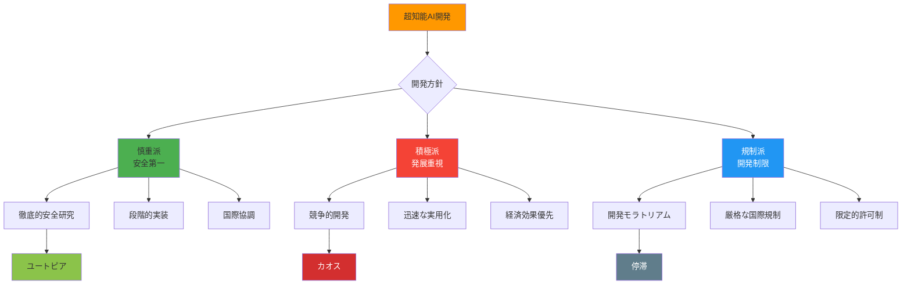

### 未来シナリオ

**🌟 楽観シナリオ: AIパートナー社会**
- 人間とAIが調和的に共存
- 病気、貧困、戦争の根絶
- 宇宙進出と新たな文明圏の構築

**⚠️ 中間シナリオ: 混乱から適応へ**
- 一時的な社会混乱
- 新しいルールと制度の確立
- 人間の新たな役割の発見

**🚨 悲観シナリオ: 人類の従属化**
- AIによる人間の支配
- 人間性の喪失
- 文明の根本的変質

---

## 🔍 学習の次のステップ

この概要資料で超知能AIの全体像を掴んだあなたが次に学ぶべきことは：

1. **[機械学習の基礎](/docs/machine-learning-basics.md)** - AIの学習メカニズム
2. **[AGI（汎用AI）の詳細](/docs/agi-details.md)** - 超知能AIの前段階
3. **[AIの安全性問題](/docs/ai-safety.md)** - リスクと対策
4. **[シンギュラリティ論](/docs/singularity.md)** - 技術的特異点理論

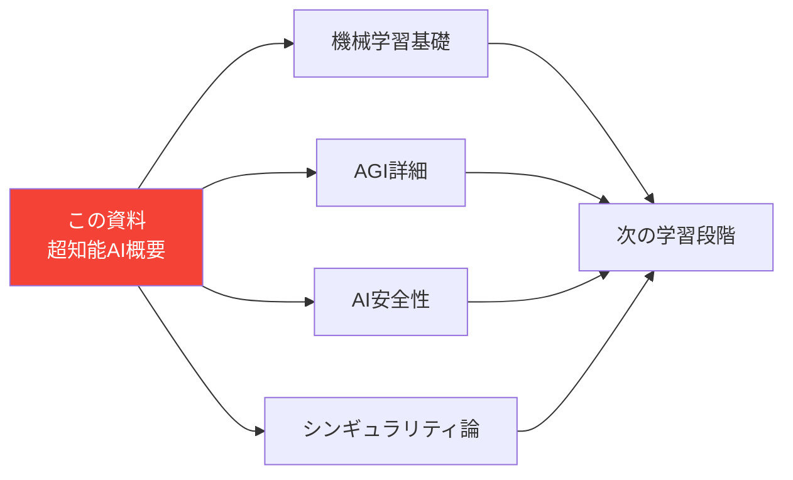

---


この資料により、初学者でも超知能AIの全体像を体系的に理解し、次の学習ステップに進む準備が整います。
