AIのこれまでのブームのうち、第1次AIブーム（1950s-1960s）について

# 第1次AIブーム（1950s-1960s）- 初学者のための完全ガイド

## 🔍 一言要約
人間の脳の仕組みを機械で再現しようとした、AIの壮大な第一歩

## 📚 目次
1. [🌟 はじめに](#-はじめに)
2. [🏗️ 基本構造](#️-基本構造)
3. [⚡ 主要技術](#-主要技術)
4. [📜 時代背景と発見に至った経緯](#-時代背景と発見に至った経緯)
5. [🎨 種類と特徴](#-種類と特徴)
6. [📗 関連する用語](#-関連する用語)
7. [💡 メリットとデメリット](#-メリットとデメリット)
8. [🚀 応用と実例](#-応用と実例)
9. [🔄 置換・変遷](#-置換変遷)
10. [⚔️ 代替・競合](#️-代替競合)
11. [🌍 実世界への影響とその後の発展](#-実世界への影響とその後の発展)

## 🌟 はじめに

第1次AIブームは、まるで「魔法の箱を作ろう」とした時代でした。想像してみてください。1950年代の人々が「機械に人間のように考えさせることができるかもしれない！」と夢見た瞬間を。

これは、電卓がやっと普及し始めた頃に、「将来コンピュータが人間と会話できるかもしれない」と本気で信じた、科学者たちの壮大な挑戦の物語です。

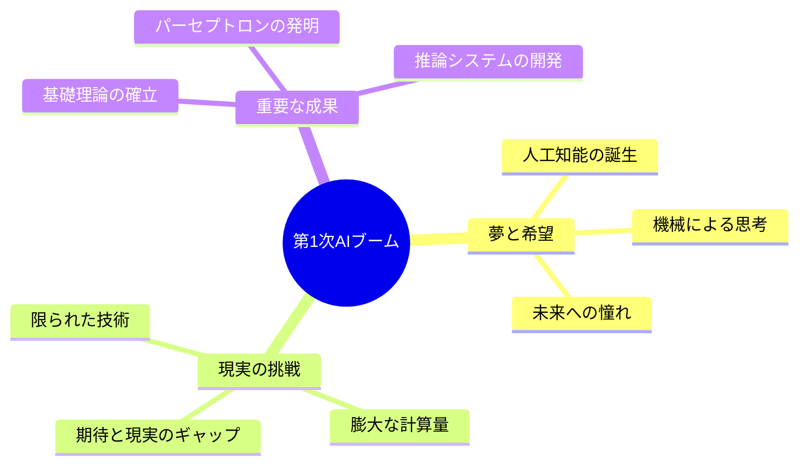

## 🏗️ 基本構造

第1次AIブームの構造は、大きく3つの柱で支えられていました：

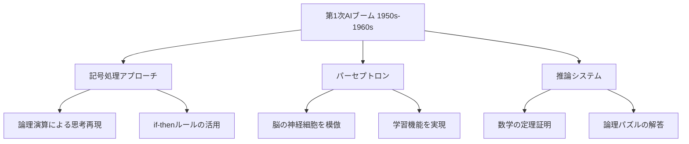

これらの技術は、まるで「人間の脳の設計図を見ながら、同じものを機械で作ろう」という試みでした。

## ⚡ 主要技術

### 1. 記号処理（Symbolic Processing）
**簡単に言うと**：数字や文字を使って、人間の論理的思考をコンピュータで再現する技術

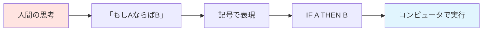

### 2. パーセプトロン（Perceptron）
**簡単に言うと**：脳の神経細胞（ニューロン）を真似して作った、学習できる人工神経細胞

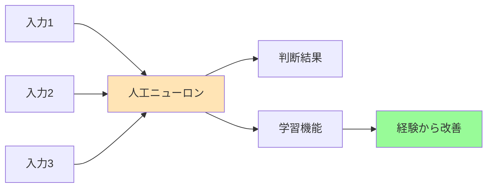

### 3. 定理証明システム
**簡単に言うと**：数学の問題を自動で解く、コンピュータの「数学の天才」

## 📜 時代背景と発見に至った経緯

### 🎭 物語：夢見る科学者たちの時代

**1943年：すべての始まり**
神経生理学者のマカロックとピッツが論文を発表。「脳の神経細胞は、実は電気回路のようなものかもしれない！」この発見が、すべての出発点でした。

**1950年：チューリングの大胆な提案**
アラン・チューリングが「Computing Machinery and Intelligence」を発表。「機械は考えることができるか？」という問いを投げかけました。まるで哲学者のような質問を、数学者がしたのです。

**1956年：ダートマス会議 - AIの正式な誕生**
夏の会議で、「Artificial Intelligence（人工知能）」という言葉が初めて使われました。参加者たちは2ヶ月間、真剣に「機械に知能を与える方法」を議論したのです。

**1957年：パーセプトロンの華々しいデビュー**
フランク・ローゼンブラットがパーセプトロンを発表。新聞は「電子の脳が誕生！」と大騒ぎしました。

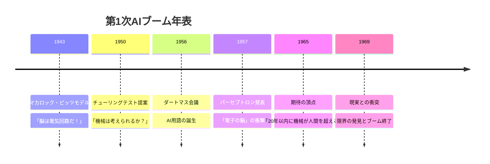

## 🎨 種類と特徴

第1次AIブームの技術は、大きく2つの流派に分かれていました：

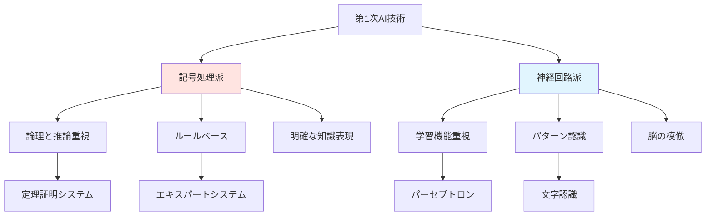

### 記号処理派の特徴
- **得意分野**：論理パズル、数学の証明
- **アプローチ**：「人間の思考は論理的だ」
- **代表例**：Logic Theorist（論理理論家）

### 神経回路派の特徴
- **得意分野**：パターン認識、学習
- **アプローチ**：「脳の仕組みを真似しよう」
- **代表例**：パーセプトロン

## 📗 関連する用語

### 📖 同義語・関連語
- **人工知能（AI）** ← この時代に生まれた言葉
- **機械学習** ← パーセプトロンが原型
- **ニューラルネットワーク** ← 神経回路の模倣
- **エキスパートシステム** ← 専門家の知識をコンピュータに

### 📊 多義語の整理
| 用語 | 当時の意味 | 現在の意味 |
|------|------------|------------|
| AI | 機械による思考の実現 | 様々な知的処理の総称 |
| 学習 | パーセプトロンの重み調整 | 深層学習など高度な学習 |
| 推論 | if-thenルールの適用 | 確率的推論など複雑な推論 |

### 🔄 類義語の比較
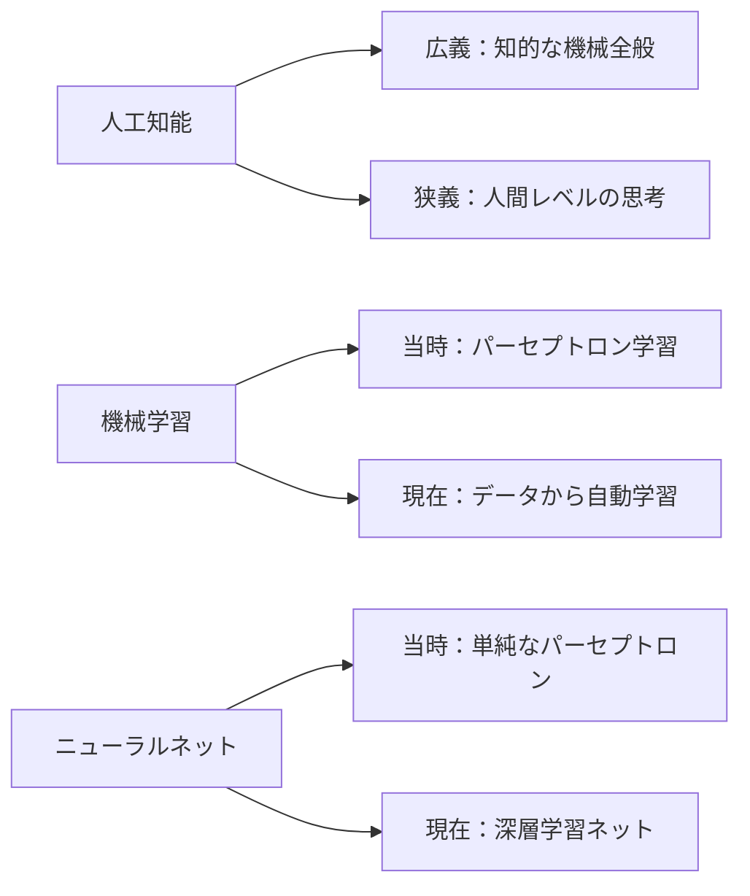

## 💡 メリットとデメリット

### ✅ メリット
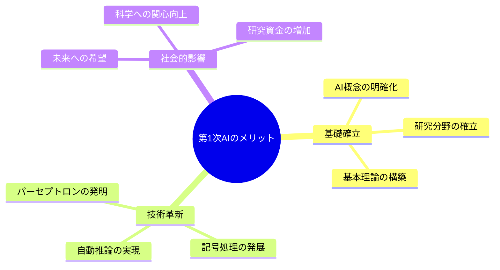

**具体的なメリット：**
- **概念の確立**：「人工知能」という分野が生まれた
- **基礎技術**：現在のAIの土台となる技術が開発された
- **学習能力**：機械が経験から学ぶことを初めて実現した
- **自動化**：単純な判断作業の自動化が可能になった

### ❌ デメリット
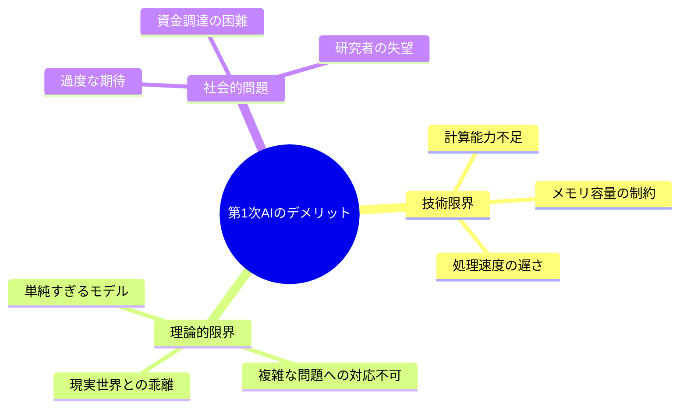

**具体的なデメリット：**
- **計算限界**：当時のコンピュータでは複雑な計算が不可能
- **単純すぎ**：パーセプトロンは線形分離可能な問題しか解けない
- **知識不足**：人間の知識を機械に教える方法が未熟
- **期待過剰**：「20年で人間を超える」という予測が現実離れ

## 🚀 応用と実例

### 🏆 成功例

**1. 定理証明システム「Logic Theorist」**
- **何をした？**：数学の定理を自動で証明
- **すごいところ**：人間の数学者と同じ方法で証明を発見
- **身近な例**：今でいう「数学の宿題を自動で解くソフト」の原型

**2. パーセプトロンによる文字認識**
- **何をした？**：手書きの数字を自動で読み取り
- **すごいところ**：機械が「学習」して認識精度を向上
- **身近な例**：現在のスマホのOCR機能の祖先

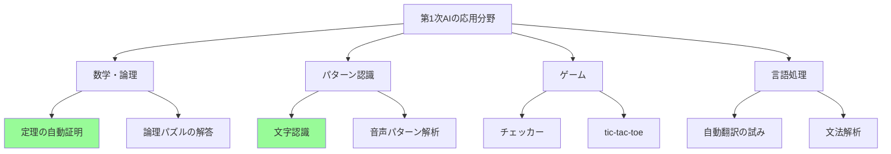

### 📚 研究成果の実例

**チェッカープログラムの学習**
- アーサー・サミュエルが開発
- プログラム同士で対戦を重ね、自動的に強くなる
- 「機械学習」という言葉を初めて使用

## 🔄 置換・変遷

### 🔄 何を置き換えたか
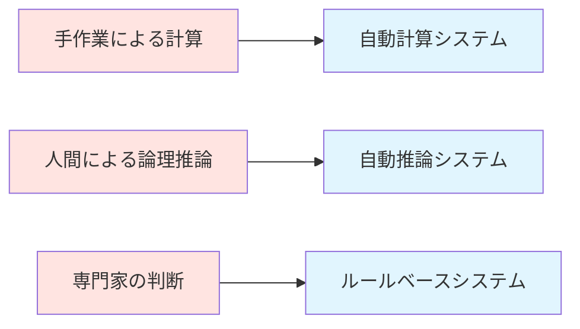

**置き換えた対象：**
- **手作業の計算** → 自動計算システム
- **人間の単純判断** → ルールベース判断
- **専門家の一部業務** → エキスパートシステム

### 🔄 何に置き換えられたか
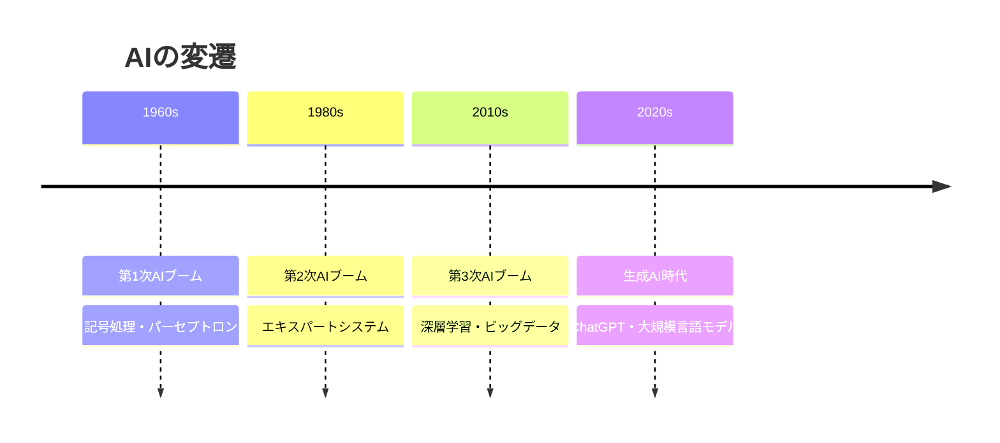

### 🧬 何を継承したか・何に継承されたか

**継承したもの：**
- チューリングテストの概念 → 現在のAI評価基準
- パーセプトロンの学習原理 → 深層学習の基礎
- 記号処理のアプローチ → 知識グラフやオントロジー

**継承されたもの：**
- 単純パーセプトロン → 多層パーセプトロン → 深層ニューラルネットワーク
- ルールベース推論 → エキスパートシステム → 知識ベースAI

## ⚔️ 代替・競合

### 🔄 何に代替できるか
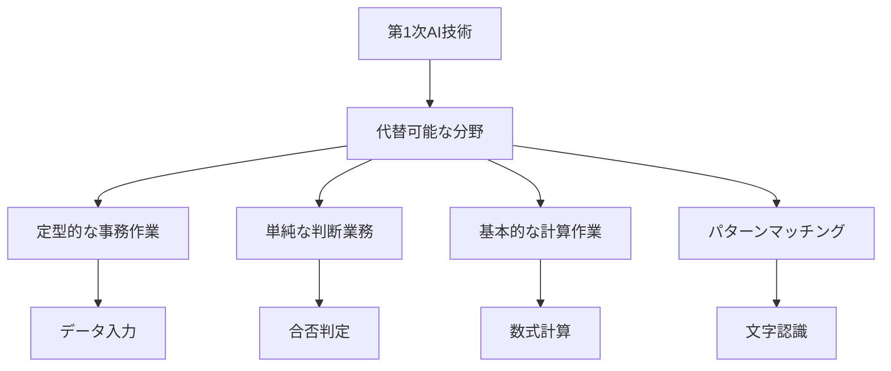

**代替できること：**
- 定型的な事務処理の一部
- 単純なパターン認識作業
- 基本的な論理演算

### ⚔️ 何と競合するか

**当時の競合相手：**
- **人間の専門家** vs **エキスパートシステム**
- **手作業** vs **自動化システム**
- **従来の計算方法** vs **AI的アプローチ**

**現在の立ち位置：**
- 深層学習に技術的に置き換えられた
- しかし、基礎理論として現在でも重要
- 説明可能AIの分野では再評価されている

## 🌍 実世界への影響とその後の発展

### 🌟 当時の社会への影響

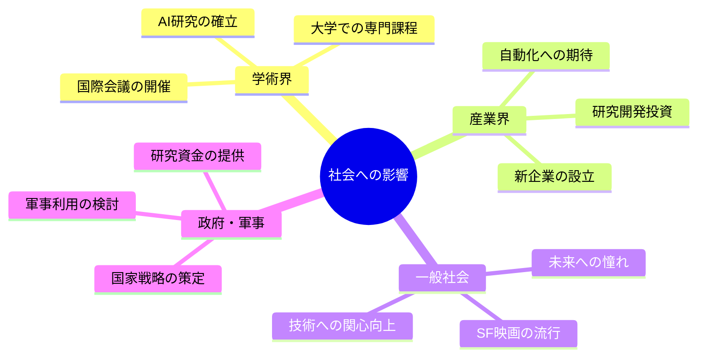

**具体的な影響：**

1. **学術研究の発展**
   - 世界中の大学でAI研究室が設立
   - AI専門の学会や論文誌が創刊
   - 研究者のキャリアパスが確立

2. **産業への波及**
   - IBM、GE等の大企業がAI研究部門を設立
   - ベンチャー企業が多数設立
   - 自動化技術への投資が急増

3. **文化・社会意識の変化**
   - SF小説・映画でAIが頻繁に登場
   - 「未来はAIが支配する」という期待と不安
   - コンピュータサイエンス教育の重要性認識

### 🚀 その後の発展

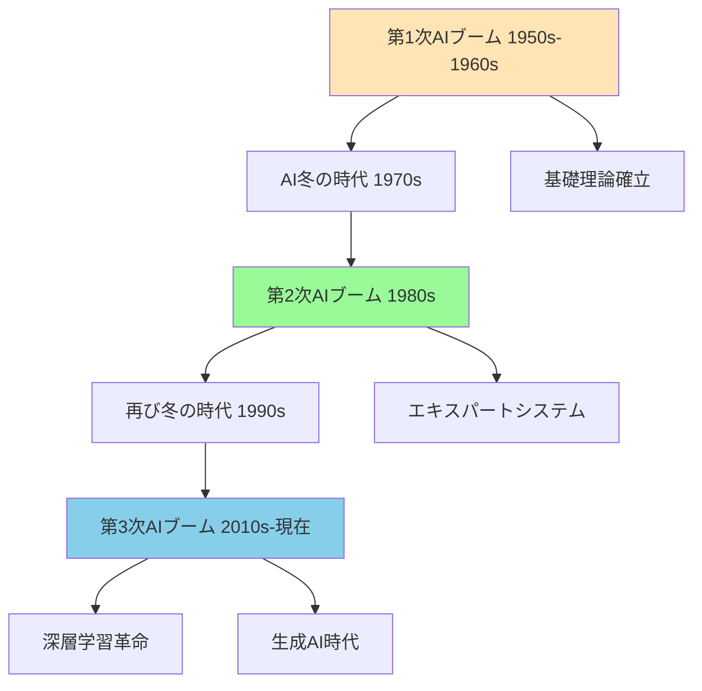

**発展の軌跡：**

1. **1970年代：第1回AI冬の時代**
   - パーセプトロンの限界が明らかに
   - 研究資金が大幅削減
   - 多くの研究者が他分野へ転向

2. **1980年代：第2次AIブーム**
   - エキスパートシステムが大企業で実用化
   - 日本の「第五世代コンピュータプロジェクト」
   - 知識工学の発展

3. **2010年代以降：第3次AIブーム**
   - 深層学習による飛躍的性能向上
   - ビッグデータとクラウドコンピューティング
   - ChatGPTなど生成AIの実用化

### 🔮 現在への教訓

**第1次AIブームから学んだこと：**

1. **技術の成熟には時間が必要**
   - 基礎理論から実用化まで数十年
   - 期待と現実のバランスが重要

2. **計算資源の重要性**
   - アルゴリズムだけでなく、実行環境も crucial
   - ハードウェアの進歩がAIの発展を左右

3. **問題設定の重要性**
   - 現実の複雑さを理解した問題設定
   - 段階的なアプローチの必要性

### 🏆 現在でも活用される遺産

**技術的遺産：**
- パーセプトロンの学習原理 → 現代の深層学習
- 記号処理のアプローチ → 知識グラフ、推論エンジン
- チューリングテスト → AI評価の基準

**哲学的遺産：**
- 「機械は考えることができるか？」 → AGI（汎用人工知能）の目標
- 人間の知能の理解 → 認知科学の発展
- 知識の形式化 → 知識工学の基礎

---

この資料により、初学者は第1次AIブームの本質を理解し、現在のAI技術との繋がりを把握できるようになります。
