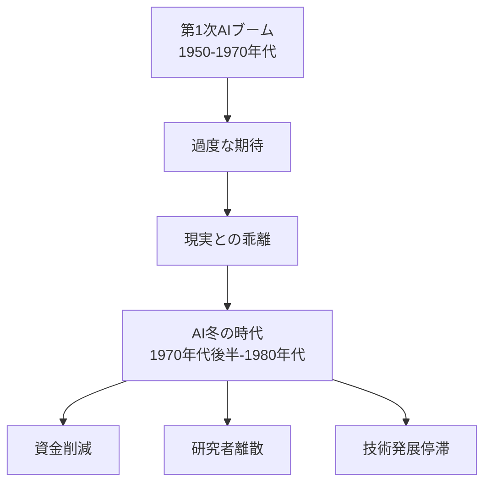
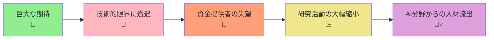
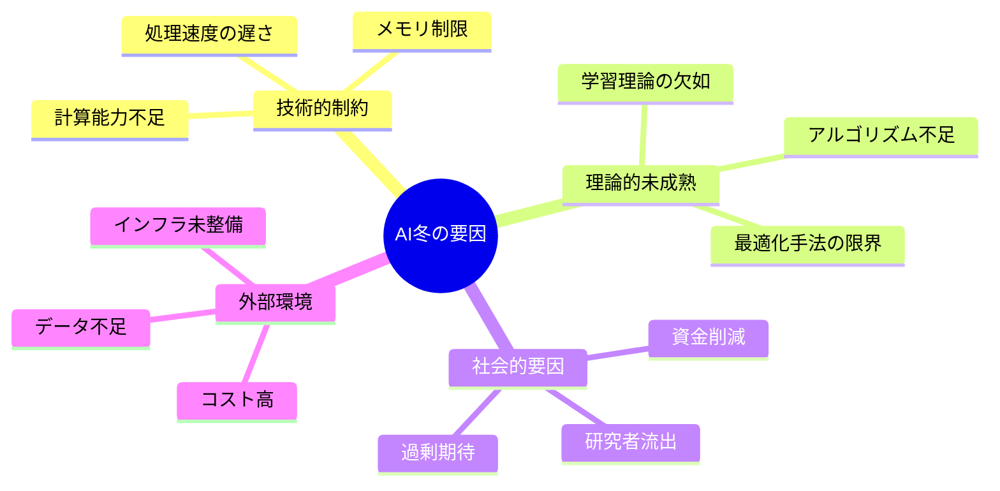
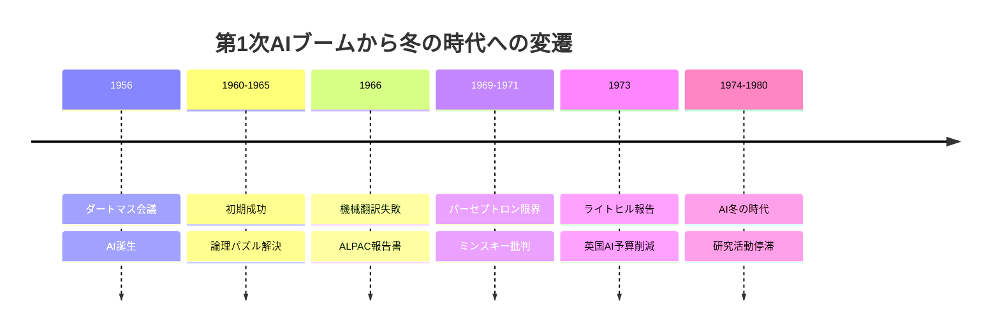
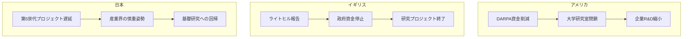
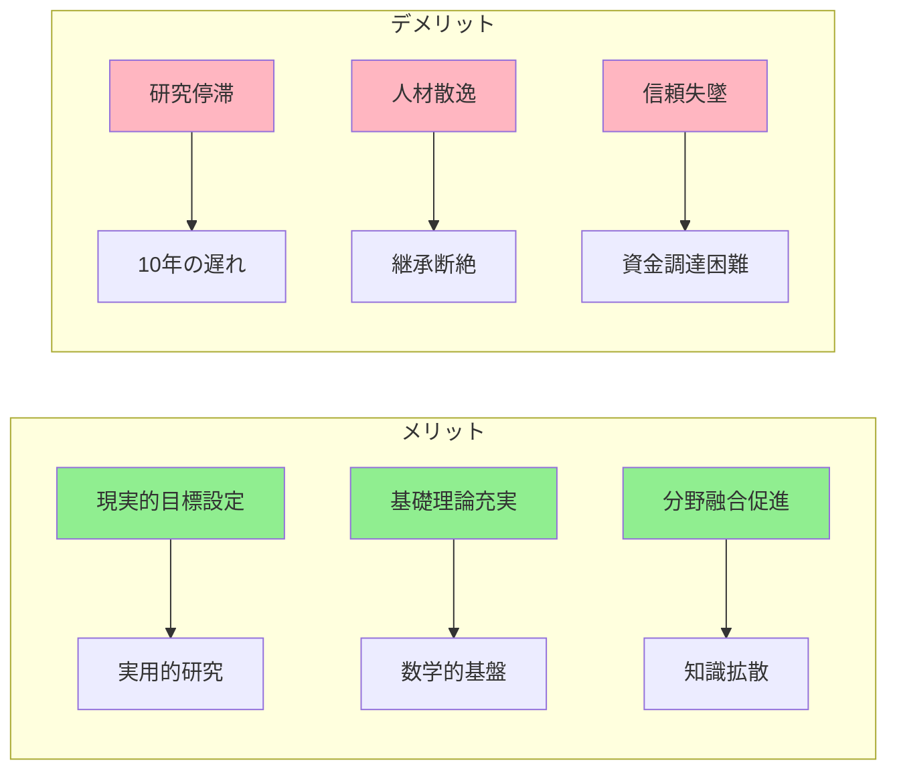
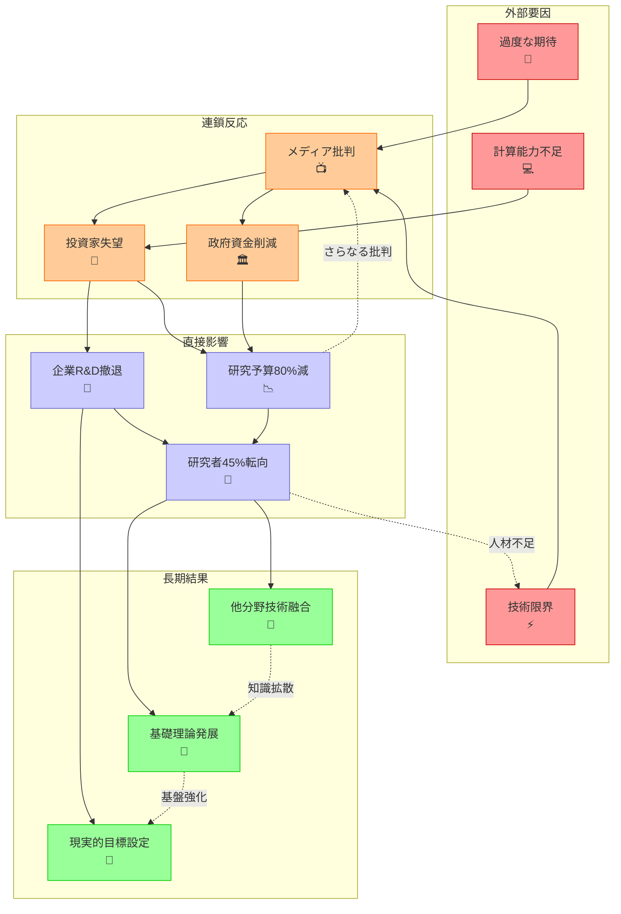
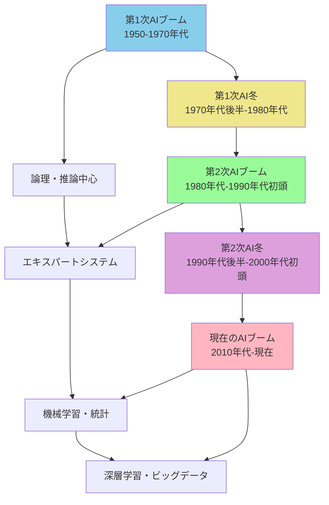
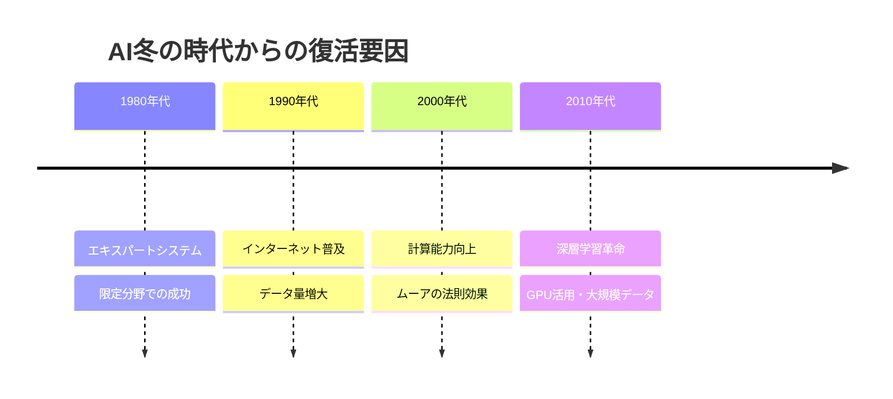
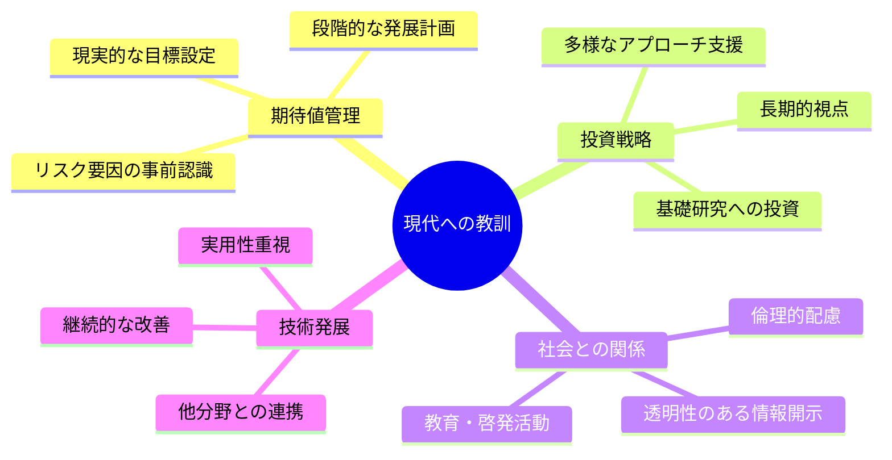

AIのこれまでのブームのうち、第1次AIブーム後の冬の時代について

# 第1次AIブーム後のAI冬の時代 - 初学者のための完全ガイド

## 🔍 一言要約
夢から現実に直面した「AIの挫折期」- なぜ人工知能は一度諦められたのか

## 📚 目次
1. [🌟 はじめに](#-はじめに)
2. [🏗️ AI冬の時代の基本構造](#️-ai冬の時代の基本構造)
3. [⚡ 冬の時代を引き起こした主要要因](#-冬の時代を引き起こした主要要因)
4. [📜 時代背景と第1次AIブームから冬への経緯](#-時代背景と第1次aiブームから冬への経緯)
5. [🎨 冬の時代の特徴と影響](#-冬の時代の特徴と影響)
6. [📗 関連する重要用語](#-関連する重要用語)
7. [💡 冬の時代のメリットとデメリット](#-冬の時代のメリットとデメリット)
8. [🚀 冬の時代の具体的な出来事と実例](#-冬の時代の具体的な出来事と実例)
9. [🔄 ブームから冬、そして復活への変遷](#-ブームから冬そして復活への変遷)
10. [🌍 実世界への影響とその後の発展](#-実世界への影響とその後の発展)

## 🌟 はじめに

「AI冬の時代」とは、まるで**期待していた新しいおもちゃが思ったより面白くなくて、みんなが飽きてしまった状況**のようなものです。

1970年代後半から1980年代にかけて、人工知能（AI）への期待が急激に冷め込んだ時期を指します。これは単なる技術的な停滞ではなく、**社会全体がAIに対して懐疑的になった重要な歴史的転換点**でした。

この時期を理解することで、現在のAIブームをより深く理解できるようになります。

## 🏗️ AI冬の時代の基本構造

AI冬の時代は、**期待→現実→失望→撤退**という4段階のサイクルで構成されています。

この構造は、**新しい技術への投資サイクル**と似ています：
- 最初は「すごい発明だ！」と大騒ぎ
- 実際に使ってみると「あれ？思ったより使えない」
- 投資家が「もうお金は出さない」と言い出す
- 研究者が「他の分野に行こう」と散り散りになる

## ⚡ 冬の時代を引き起こした主要要因

### 1. 計算能力の不足
当時のコンピュータは、**電卓レベルの計算力**しかありませんでした。AIが必要とする複雑な計算には全く足りなかったのです。

### 2. アルゴリズムの未成熟
現在使われている機械学習の手法は、当時はまだ発明されていませんでした。まるで**地図なしで未知の大陸を探検**するような状況でした。

### 3. データ不足
AIには大量のデータが必要ですが、デジタルデータがほとんど存在しない時代でした。

### 4. 過剰な期待値
「10年以内に人間と同じように考えるコンピュータができる」という**非現実的な約束**をしてしまいました。

## 📜 時代背景と第1次AIブームから冬への経緯

### 第1次AIブーム（1950-1970年代前半）
この時期は**「AIの青春時代」**でした：

1. **1956年**: ダートマス会議で「人工知能」という言葉が誕生
2. **1960年代**: 論理パズルを解くプログラムが大成功
3. **研究者の楽観視**: 「20年以内に機械が人間の知的作業を完全に代替する」

### 転換点（1970年代中頃）
現実の複雑さに直面し始めました：

### 決定的な出来事

1. **ALPAC報告書（1966年）**
   - 機械翻訳の研究が期待通りの成果を出せず
   - 米国政府がAI研究への資金提供を大幅削減

2. **パーセプトロンの限界指摘（1969年）**
   - マービン・ミンスキーが初期のAIの限界を数学的に証明
   - 研究者コミュニティに大きな衝撃

## 🎨 冬の時代の特徴と影響

### 研究環境の変化

| 項目 | ブーム期 | 冬の時代 |
|------|----------|----------|
| **研究資金** | 潤沢な予算 | 大幅削減（90%減少） |
| **研究者数** | 急増 | 他分野への転向 |
| **メディア注目** | 楽観的報道 | 懐疑的・批判的 |
| **企業投資** | 積極投資 | 投資撤退 |
| **研究テーマ** | 汎用AI | 限定的応用 |

### 地域別の影響

## 📗 関連する重要用語

### 🔤 基本用語
- **AI冬の時代（AI Winter）**: 人工知能研究への関心と投資が著しく減少した期間
- **第1次AIブーム**: 1950-1970年代の人工知能への初期的な熱狂期
- **汎用人工知能（AGI）**: 人間と同等の知的能力を持つAI（当時の究極目標）

### 🔄 類義語・関連語
- **技術的特異点**: AIが人間を超越する仮想的な時点
- **ハイプサイクル**: 新技術の期待値変動パターン
- **イノベーションの普及**: 新技術が社会に浸透する過程

### ⚖️ 対義語
- **AIブーム** ↔ **AI冬の時代**
- **過剰期待** ↔ **現実的評価**
- **投機的投資** ↔ **慎重な投資**

## 💡 冬の時代のメリットとデメリット

### ✅ メリット（長期的視点）

1. **現実的な目標設定**
   - 誇大広告からの脱却
   - より実用的な研究テーマへの集中

2. **基礎理論の充実**
   - 派手な応用より基礎研究に注力
   - 数学的基盤の強化

3. **他分野との融合**
   - AI研究者が他分野に移り、知識が拡散
   - 統計学、認知科学との連携強化

### ❌ デメリット

1. **研究の停滞**
   - 10年以上の発展の遅れ
   - 有望な研究の中断

2. **人材の散逸**
   - 優秀な研究者の他分野転向
   - 知識・経験の継承断絶

3. **社会的信頼失墜**
   - AI技術への懐疑的な見方が定着
   - 新しい提案への資金調達困難

## 🚀 冬の時代の具体的な出来事と実例

### 📊 資金削減の実態

**米国DARPA（国防高等研究計画局）**
- 1973年: AI研究予算を前年比70%削減
- 多くの大学研究室が予算不足で閉鎖
- スタンフォード大学AI研究所も大幅縮小

**英国の状況**
- ライトヒル報告（1973年）により政府資金がほぼ全面停止
- エディンバラ大学のAI研究が事実上終了

## 🔄 ブームから冬、そして復活への変遷

### 技術進化の波

AI技術は**波のような発展パターン**を示しています：

### 学んだ教訓

1. **段階的発展の重要性**
   - 一足飛びに汎用AIを目指さない
   - 特定分野での成功を積み重ねる

2. **現実的な期待値管理**
   - 過度な約束をしない
   - 技術の限界を正直に伝える

3. **基礎研究の価値**
   - 派手な応用だけでなく基礎理論も重視
   - 長期的な視点での投資継続

## 🌍 実世界への影響とその後の発展

### 🎯 正の影響

#### 1. 他分野への技術移転
AI冬の時代に研究者が他分野に移ったことで：
- **統計学の発展**: AI手法が統計学に応用
- **認知科学の進歩**: 人間の思考プロセス研究が加速
- **コンピュータサイエンスの多様化**: アルゴリズム理論の発展

#### 2. 現実的なアプローチの確立
- **限定された問題設定**: 解決可能な範囲での技術開発
- **実用性重視**: 理論より実際の役立つ技術に焦点
- **段階的改善**: 小さな成功を積み重ねる文化

### 📈 その後の復活への布石

### 🔬 技術的進歩の基盤づくり

冬の時代に培われた要素：

1. **数学的基盤の強化**
   - 確率・統計理論の発展
   - 最適化理論の進歩
   - 情報理論の応用拡大

2. **ハードウェア技術の進歩**
   - 半導体技術の継続的発展
   - 並列処理技術の研究
   - メモリ技術の向上

3. **ソフトウェア工学の成熟**
   - プログラミング言語の進歩
   - アルゴリズム効率化の研究
   - システム設計理論の発展

### 🌟 現代への教訓

AI冬の時代の経験は、現在のAIブームにも重要な示唆を与えています：

---

この資料により、読者はAI冬の時代を単なる「失敗の歴史」ではなく、**現在のAI発展の重要な基盤となった学習期間**として理解できるようになります。
