AIのこれまでのブームのうち、第2次AIブームについて


# 第2次AIブーム - 初学者のための完全ガイド

## 🔍 一言要約
コンピュータに「人間の知識を教える」時代の到来

## 📚 目次
1. [🌟 はじめに](#はじめに)
2. [🏗️ 基本構造](#基本構造)
3. [⚡ 主要技術](#主要技術)
4. [📜 時代背景と発見に至った経緯](#時代背景と発見に至った経緯)
5. [🎨 種類と特徴](#種類と特徴)
6. [📗 関連する用語](#関連する用語)
7. [💡 メリットとデメリット](#メリットとデメリット)
8. [🚀 応用と実例](#応用と実例)
9. [🔄 置換、変遷](#置換変遷)
10. [🌟 代替、競合](#代替競合)
11. [🌍 実世界への影響とその後の発展](#実世界への影響とその後の発展)

## 🌟 はじめに

想像してください。あなたが図書館の司書だとして、膨大な本の知識をコンピュータに覚えさせて、来館者の質問に答えさせたいと思ったとします。第2次AIブーム（1980年代～1990年代前半）は、まさにこの「知識をコンピュータに教える」挑戦の時代でした。

第1次ブームが「コンピュータで人間のような推理をする」ことを目指したのに対し、第2次ブームは「専門家の知識をそのまま移植する」アプローチを取りました。これは、まるで熟練の職人の技術を弟子に伝承するような、知識の継承革命だったのです。

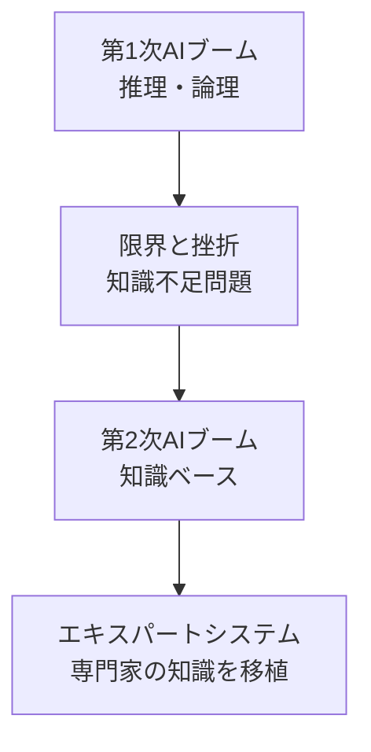

## 🏗️ 基本構造

第2次AIブームは、「知識こそがAIの力の源」という発想に基づいていました。その構造を家づくりに例えると：

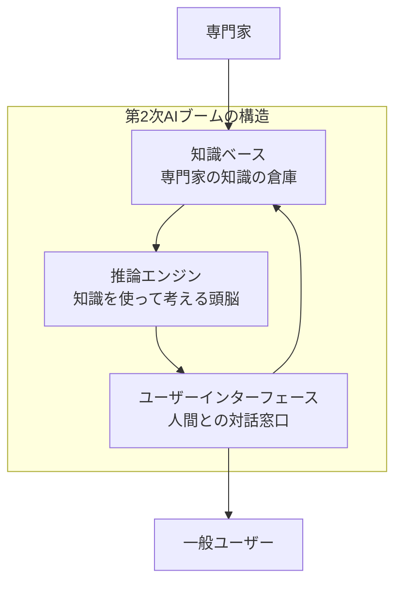

- **知識ベース**：専門家の頭の中にある知識を整理して保存する「図書館」
- **推論エンジン**：その知識を使って問題を解決する「司書」
- **ユーザーインターフェース**：人間が質問し、回答を得る「カウンター」

## ⚡ 主要技術

### エキスパートシステム（Expert Systems）
「専門家の分身」を作る技術です。まるで名医の診断能力をコンピュータに移したような革新でした。

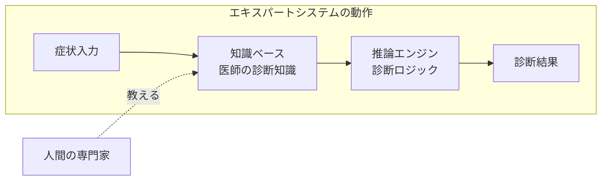

### 知識表現（Knowledge Representation）
人間の知識をコンピュータが理解できる形に翻訳する技術です。

```mermaid
graph TD
    A[人間の知識<br/>鳥は飛ぶ] --> B[ルール形式<br/>IF 鳥 THEN 飛ぶ]
    A --> C[フレーム形式<br/>鳥{翼:あり,飛行:可能}]
    A --> D[セマンティックネット<br/>鳥→飛行→可能]
    
    click B "/docs/rule-based.md" "ルールベース推論"
    click C "/docs/frame-systems.md" "フレームシステム"
    click D "/docs/semantic-networks.md" "セマンティックネット"
```

## 📜 時代背景と発見に至った経緯

### 第1次ブームの教訓（1970年代末）
第1次AIブームは「知識が足りない」という壁にぶつかりました。まるで、計算は得意だが常識を知らない天才数学者のような状況でした。

### 知識工学の誕生（1980年代）
スタンフォード大学のエドワード・ファイゲンバウムが「知識こそが力なり（Knowledge is Power）」という考えを提唱。これは、AIの焦点を「いかに考えるか」から「何を知っているか」へと転換させる歴史的な転換点でした。

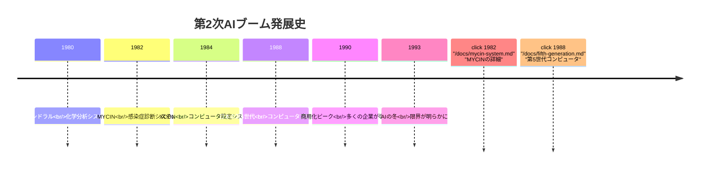

### 日本の挑戦
1980年代、日本は「第5世代コンピュータプロジェクト」を立ち上げ、AI先進国を目指しました。これは国家をあげた知識情報処理への挑戦でした。

## 🎨 種類と特徴

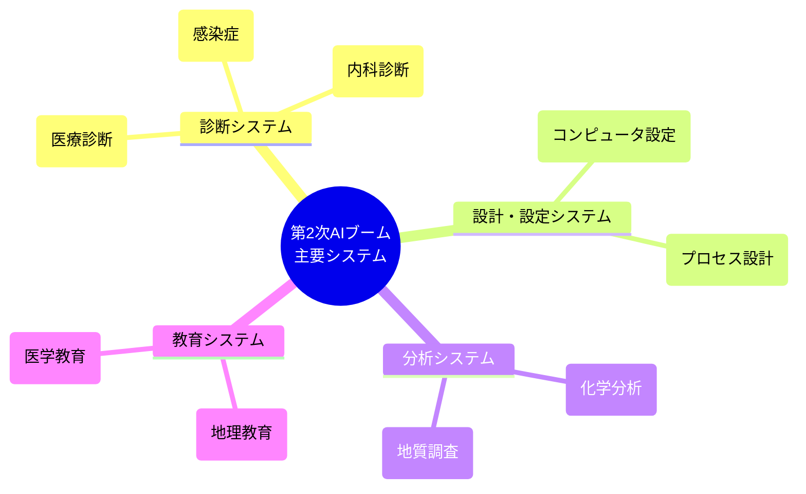

### 主要な特徴比較

| システム種類 | 得意分野 | 代表例 | 特徴 |
|-------------|---------|--------|------|
| 診断型 | 問題特定 | MYCIN | 症状から原因を推定 |
| 設計型 | 構成作成 | XCON | 部品から製品を組み立て |
| 分析型 | データ解釈 | DENDRAL | 測定データから構造を特定 |
| 教育型 | 知識伝達 | SCHOLAR | 学習者に適応した指導 |

## 📗 関連する用語

### 核となる概念
- **エキスパートシステム（Expert System）**：専門家の知識を模倣するシステム
- **知識ベース（Knowledge Base）**：構造化された知識の集合体
- **推論エンジン（Inference Engine）**：知識を使って結論を導く仕組み

### 同義語・類義語
- **知識ベースシステム** ≈ エキスパートシステム
- **ルールベースシステム** ≈ プロダクションシステム
- **知識工学** ≈ 知識システム工学

### 多義語の整理
- **ルール**
  - 一般的意味：規則、決まり
  - AI分野：IF-THEN形式の知識表現
- **フレーム**
  - 一般的意味：枠、骨組み
  - AI分野：オブジェクト指向的な知識表現構造

## 💡 メリットとデメリット

### ✅ メリット

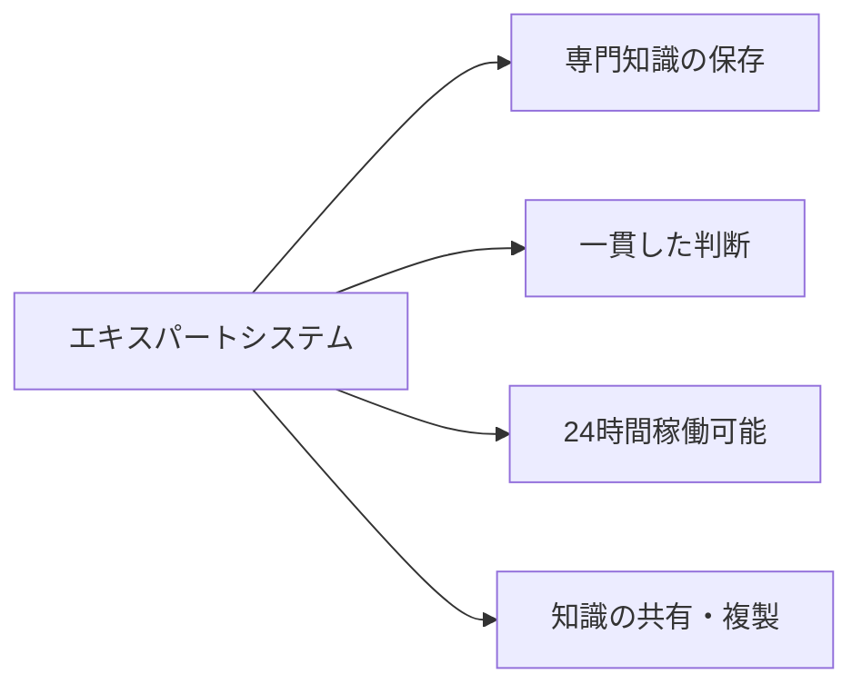

1. **専門家不足の解決**：希少な専門知識を多くの人が利用可能
2. **判断の一貫性**：感情や疲労に左右されない安定した判断
3. **知識の永続化**：専門家の退職後も知識が残る
4. **説明能力**：判断根拠を明確に説明可能

### ❌ デメリット

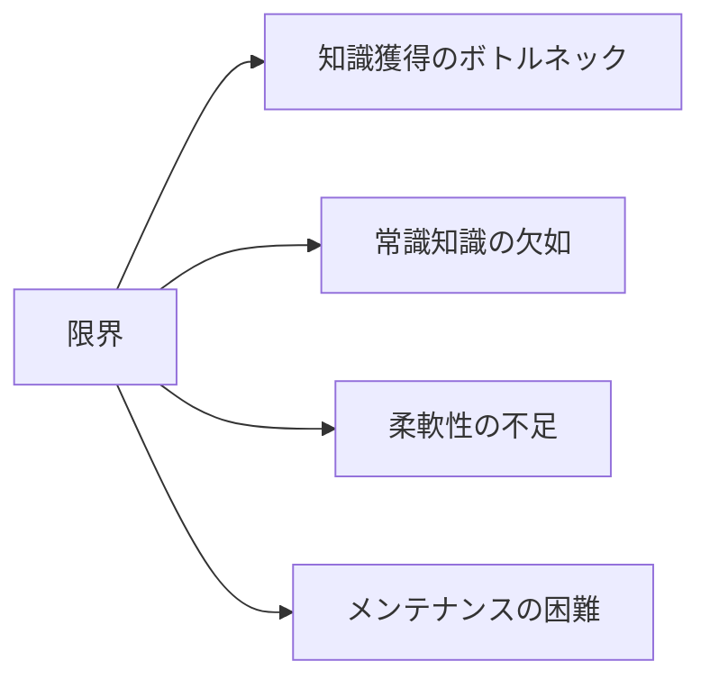

1. **知識獲得の困難**：専門家から知識を抽出するのは極めて困難
2. **常識の欠如**：人間が当たり前に知っていることを知らない
3. **例外処理の弱さ**：想定外の状況に対応できない
4. **更新の困難**：新しい知識の追加や修正が複雑

## 🚀 応用と実例

### 医療分野での革新

**MYCIN（マイシン）**：感染症診断の先駆者
- 血液検査結果から感染症を特定
- 適切な抗生物質を推奨
- 専門医並みの診断精度を達成

```mermaid
sequenceDiagram
    participant 医師
    participant MYCIN
    participant 知識ベース
    
    医師->>MYCIN: 患者症状入力
    MYCIN->>知識ベース: 診断ルール検索
    知識ベース-->>MYCIN: 該当ルール返却
    MYCIN->>MYCIN: 推論実行
    MYCIN-->>医師: 診断結果+治療提案
    
    click MYCIN "/docs/mycin-diagnosis.md" "MYCIN診断プロセス"
```

### 産業分野での成功

**XCON（エクスコン）**：DECコンピュータの自動設定
- 顧客要件に応じた最適なコンピュータシステム構成
- 人間の設計者より高速・正確
- 年間数億円のコスト削減を実現

### 日本独自の取り組み

**第5世代コンピュータプロジェクト**
- 論理プログラミング言語Prologを基盤
- 並列推論マシンの開発
- 知識情報処理の国家プロジェクト

## 🔄 置換、変遷

### 何を置き換えたか

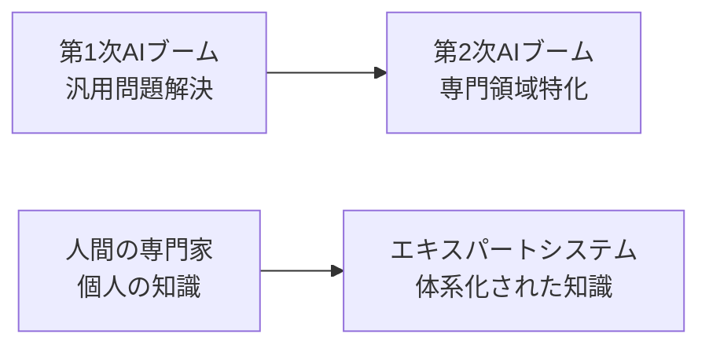

- **汎用的アプローチ** → **専門領域特化アプローチ**
- **推理中心** → **知識中心**
- **個人の暗黙知** → **明示的な知識ベース**

### 何に置き換えられたか

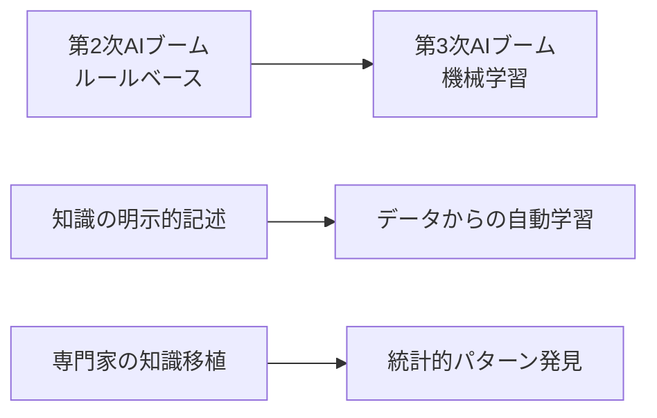

- **ルールベースシステム** → **機械学習システム**
- **知識の手動入力** → **データからの自動学習**
- **論理的推論** → **統計的推論**

## 🌟 代替、競合

### 代替関係

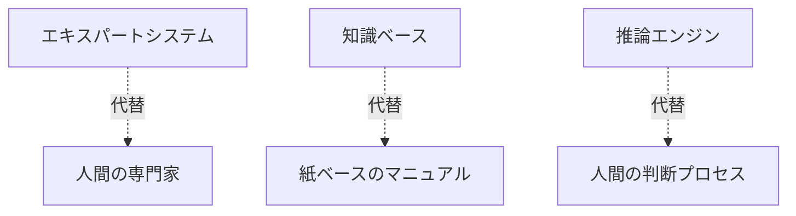

### 競合技術

**同時代の競合**
- **ニューラルネットワーク**：並列分散処理アプローチ
- **ファジィ論理**：曖昧さを扱う推論システム
- **遺伝的アルゴリズム**：進化的計算手法

**現代での競合**
- **深層学習**：大量データからの自動特徴抽出
- **機械学習**：統計的学習アプローチ
- **知識グラフ**：大規模知識の構造化表現

## 🌍 実世界への影響とその後の発展

### 第2次ブームの遺産

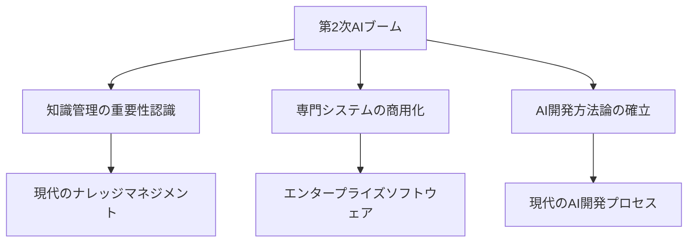

### 現代への継承

**直接的継承**
- **知識ベースシステム**：現代のFAQボットや診断支援システム
- **ルールエンジン**：ビジネスルール管理システム
- **オントロジー**：セマンティックWebや知識グラフ

**間接的影響**
- **説明可能AI（XAI）**：判断根拠の説明というコンセプト
- **ハイブリッドAI**：知識ベースと機械学習の統合
- **ドメイン特化AI**：専門領域に特化したAIシステム

### 未来への展望

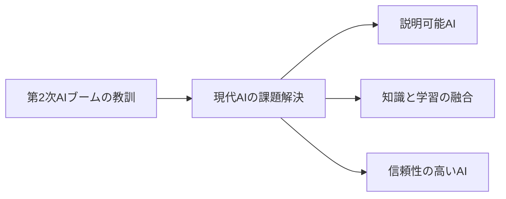

第2次AIブームで培われた「知識の明示化」「推論の可視化」「専門知識の活用」という考え方は、現代の「説明可能AI」や「信頼できるAI」の基盤となっています。

---

## 🎯 学習の次のステップ

この資料を読み終えたあなたは、第2次AIブームの全体像を把握できました。次に学ぶべきトピックは：

1. **[第3次AIブーム（機械学習時代）](/docs/third-ai-boom.md)** - データ駆動型AIの革命
2. **[現代の知識グラフ技術](/docs/knowledge-graphs.md)** - 第2次ブームの現代版
3. **[説明可能AI（XAI）](/docs/explainable-ai.md)** - 第2次ブームの精神を受け継ぐ技術

第2次AIブームは「挫折」ではなく、現代AIの重要な礎石だったのです。
